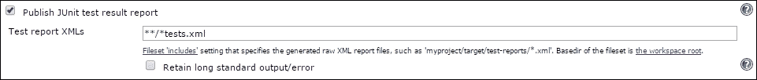

# 第十章。提高测试驱动开发的工具

到目前为止，我们主要关注的是如何编写和运行测试。在本章中，我们将把注意力转向将测试与更广泛的开发生态集成。将测试集成到开发环境中很重要，因为它允许我们设置一个自动化的流程，通过该流程定期执行测试。我们还将探讨其他可以提高我们进行 TDD 方式效率的工具——从其他测试运行器到使断言更容易的库。

# TDD 工具

在本书的早期，我们探讨了 nose2 测试运行器。Python 有其他流行的第三方测试运行器。Python 还有一系列库，可以使断言更加灵活和可读。这些库可以与 `unittest` 兼容的测试以及第三方测试运行器支持的函数式测试一起使用。让我们看看这些 TDD 工具中的一些。

## py.test

与 nose2 一样，py.test 也是另一个流行的第三方测试运行器。py.test 支持许多功能，如下所示：

+   将测试编写为普通函数。

+   使用 Python 的 `assert` 语句进行断言。

+   跳过测试或标记测试为预期失败的能力。

+   支持设置和清理的固定值。

+   可扩展的插件框架，提供插件以执行流行的功能，例如 XML 输出、覆盖率报告以及在多个处理器或核心上并行运行测试。

+   使用属性标记测试。

+   集成流行的工具。

py.test 最独特的特点之一是 funcargs。看看以下代码：

```py
import pytest

@pytest.fixture
def goog():
    return Stock("GOOG")

def test_stock_update(goog):
    assert goog.price is None
```

在此代码中，`test_stock_update` 函数接受一个名为 `goog` 的参数。此外，我们还有一个名为 `goog` 的函数，该函数带有 `pytest.fixture` 装饰器。PyTest 将匹配这两个，调用适当的固定值，并将返回值作为参数传递给测试。

这解决了以下两个问题：

+   它使我们能够在不使用全局变量的情况下，将固定值传递给函数式测试用例。

+   我们可以创建许多小的固定值，而不是编写一个大的固定值，测试用例只使用它们需要的固定值。这使得阅读测试用例更容易，因为我们不需要查看一个大的设置，其中包含为不同测试准备的不同设置行。

上述示例只是对 funcargs 的表面了解。`py.test` 支持许多其他使用场景。绝对要检查这个流行的测试运行器。

### py.test 与 nose2 的比较

在 nose2 和 py.test 之间没有太多选择。nose2 在编写使用层来编写测试方面具有独特功能，而 py.test 在 funcargs 方面具有独特功能。除此之外，两者都支持运行`unittest`测试用例，两者都有强大的插件框架，并且都可以与本章中讨论的所有工具集成。两者之间的选择实际上取决于个人对层与 funcargs 之间的选择，或者是否支持我们真正想要的特定插件。绝对建议查看 py.test 的主页[`pytest.org/latest/`](http://pytest.org/latest/)。

## 尝试

Trial 是一个单元测试运行器，最初是为测试 Python 的 Twisted 框架而构建的。Trial 支持运行使用`unittest`模块编写的纯单元测试，以及专门针对基于网络编程的应用程序（如客户端、服务器等）的高级功能。其中最重要的是对异步编程模型的支持，其中方法可能立即返回，但实际的返回值是在稍后接收的。这通常使用一个称为`Deferred`的概念来完成。由于这是一个深奥且专业的话题，我们不会在本书中进行详细讨论。只需记住，如果你在进行任何网络编程、基于事件系统或异步编程的工作，那么你应该查看 Trial 的主页[`twistedmatrix.com/trac/wiki/TwistedTrial`](http://twistedmatrix.com/trac/wiki/TwistedTrial)。

## 当然

Sure 是一个 Python 库，旨在帮助编写易于阅读的断言。它是 should.js JavaScript 库的 Python 版本。

使用 Sure，我们可以进行以下测试：

```py
def test_stock_update(self):
    """An update should set the price on the stock object

    We will be  using the `datetime` module for the timestamp
    """
    self.goog.update(datetime(2014, 2, 12), price=10)
    self.assertEqual(10, self.goog.price)
```

然后，将其重写为以下形式：

```py
def test_stock_update(self):
    self.goog.update(datetime(2014, 2, 12), price=10)
    self.goog.price.should.equal(10)
```

### 注意

注意到断言已被替换为类似常规英语的语句。Sure 向所有对象添加了大量属性，使我们能够编写这样的断言。

以下是如何在 Sure 中查看我们的浮点测试：

```py
def test_stock_price_should_give_the_latest_price(self):
    self.goog.update(datetime(2014, 2, 12), price=10)
    self.goog.update(datetime(2014, 2, 13), price=8.4)
    self.goog.price.should.equal(8.4, epsilon=0.0001)
```

然后，以下是如何检查预期异常的方法：

```py
def test_negative_price_should_throw_ValueError(self):
    self.goog.update.when.called_with(datetime(2014, 2, 13), -1).\
        should.throw(ValueError)
```

Sure 还支持使用 Python 的`assert`语句如下：

```py
def test_stock_update(self):
    self.goog.update(datetime(2014, 2, 12), price=10)
    assert self.goog.price.should.equal(10)
```

Sure 支持大量如上所述的表达式，以表达多种断言条件。

Sure 使用一些猴子补丁来将这些属性添加到所有对象中。猴子补丁是在执行`import sure`语句后完成的。因此，请务必仅在单元测试文件上使用 Sure，而不要在任何生产文件中使用。

可以通过在运行测试之前将`SURE_DISABLE_NEW_SYNTAX`环境变量设置为 true 来禁用猴子补丁。当猴子补丁被禁用时，Sure 支持使用 expect 函数的以下替代语法：

```py
def test_stock_price_should_give_the_latest_price(self):
    self.goog.update(datetime(2014, 2, 12), price=10)
    self.goog.update(datetime(2014, 2, 13), price=8.4)
    expect(self.goog.price).should.equal(8.4, epsilon=0.0001)
```

所有可用方法和语法的完整详情可在 Sure 主页[`falcao.it/sure/intro.html`](http://falcao.it/sure/intro.html)找到。

由于断言是普通函数，因此我们可以在编写 nose2 和 py.test 支持的函数式测试时使用此库。

## PyHamcrest

PyHamcrest 是 Java Hamcrest 库的 Python 端口。这是另一个库，使我们能够编写更干净、更灵活的断言。

PyHamcrest 定义了自己的`assert_that`函数和多个匹配器，如`equal_to`。使用它们，我们可以编写如下测试：

```py
def test_stock_update(self):
    self.goog.update(datetime(2014, 2, 12), price=10)
    assert_that(self.goog.price, equal_to(10))
```

PyHamcrest 还有一个通过从`BaseMatcher`类继承来编写自定义匹配器的系统。以下是一个自定义匹配器，它检查股票是否具有返回特定值的交叉信号：

```py
class StockCrossoverMatcher(BaseMatcher):
    signal_names = {
        StockSignal.buy: "buy",
        StockSignal.sell: "sell",
        StockSignal.neutral: "neutral"
    }

    def __init__(self, signal, date_to_check):
        self.signal = signal
        self.date_to_check = date_to_check

    def _matches(self, item):
        return self.signal == \
            item.get_crossover_signal(self.date_to_check)

    def describe_to(self, description):
        signal_name = self.signal_names[self.signal]
        return description.append_text(
                "stock crossover signal is {} ".format(signal_name))
```

该类定义了两个方法：`_matches`和`describe_to`。

`_matches`方法接受`assert_that`函数调用的第一个参数，并返回它是否匹配给定的条件。在这种情况下，我们调用`get_crossover_signal`方法并检查它是否匹配我们期望的信号。

`describe_to`方法返回一个文本描述，用于在断言失败时显示的消息。

我们还定义了一个便利函数`is_buy_on`，它返回一个匹配器来匹配`StockSignal.buy`信号，如下所示：

```py
def is_buy_on(date_to_check):
    return StockCrossoverMatcher(StockSignal.buy, date_to_check)
```

使用这种方法，我们可以编写如下测试：

```py
def test_with_upward_crossover_returns_buy(self):
    self.given_a_series_of_prices([
        29, 28, 27, 26, 25, 24, 23, 22, 21, 20, 46])
    assert_that(self.goog, is_buy_on(datetime(2014, 2, 13)))
```

与 Sure 一样，PyHamcrest 断言是纯函数，适用于 nose2 和 py.test 支持的功能测试风格。您可以在 PyHamcrest 的主页[`github.com/hamcrest/PyHamcrest`](https://github.com/hamcrest/PyHamcrest)上查看。

# 与构建工具集成

执行测试用例只需一行代码。那么，为什么我们想要与构建工具集成呢？构建工具支持先决条件，因此通过集成此类工具，我们可以确保在执行关键任务之前运行测试。一个例子是在将代码部署到生产之前运行所有测试。

## Paver

Paver 是一个基于 Python 的流行构建工具。它围绕任务的概念构建。任务是一系列执行特定操作的命令，例如构建应用程序或运行单元测试。任务使用常规 Python 编写，并放置在项目根目录下的名为`pavement.py`的文件中。

我们想要创建一个运行我们的单元测试的任务。以下是在 Paver 中如何做到这一点：

```py
import subprocess
from paver.easy import task, consume_args, options, needs

@task
@consume_args
def test():
    args = []
    if hasattr(options, "args"):
        args = options.args
    p = subprocess.Popen(["python", "-m", "unittest"] + args)
    p.wait()
    return p.returncode
```

上述任务简单地运行一个命令来执行`unittest`模块。我们使用`@consume_args`装饰器，它告诉 Paver 接受所有命令行参数并将它们传递给此任务。

要运行此 Paver 任务，我们只需在命令行上执行以下操作：

```py
paver test -t . -s stock_alerter

```

如果我们使用 nose2，则可以修改任务如下：

```py
import subprocess
from paver.easy import task, consume_args, options, needs

@task
@consume_args
def test():
    args = []
    if hasattr(options, "args"):
        args = options.args
    p = subprocess.Popen(["nose2"] + args)
    p.wait()
    return p.returncode
```

一旦我们有任务，我们就可以在其他任务中使用它，如下所示：

```py
@needs("test")
def deploy():
    # put the deployment commands here
    pass
```

每次执行`deploy`任务时，都会运行`test`任务。只有当测试通过时，才会进行代码的部署。

# 与打包工具集成

打包指的是 Python 软件包通常如何分发给用户。除非我们正在编写专有商业软件，否则我们希望将单元测试与代码一起分发，并允许最终用户运行测试以验证一切是否正常工作。

打包工具一直是 Python 生态系统中最令人困惑的部分之一。曾经有多个不同的框架，在不同的时间点，被认为是“正确”做事的方式。当这本书正在编写时，setuptools 是推荐的打包 Python 模块的方式，因此让我们首先看看它。

## Setuptools

Setuptools 支持一个测试命令来运行测试套件。我们只需要配置它。我们通过在`setup.py`中指定`test_suite`参数来完成此操作，如下所示：

```py
from setuptools import setup, find_packages

setup(
    name="StockAlerter",
    version="0.1",
    packages=find_packages(),
    test_suite="stock_alerter.tests",
)
```

当我们这样做时，setuptools 将使用以下命令获取并运行所有测试：

```py
python setup.py test

```

上面的配置只会运行与`unittest`兼容的测试。我们无法运行任何 nose2 测试，也无法使用 nose2 插件。幸运的是，nose2 也支持与 setuptools 集成。`nose2.collector.collector`函数返回一个兼容的测试套件，setuptools 可以运行。以下测试套件执行了 nose2 找到的所有测试：

```py
from setuptools import setup, find_packages

setup(
    name="StockAlerter",
    version="0.1",
    packages=find_packages(),
    tests_require=["nose2"],
    test_suite="nose2.collector.collector",
```

`tests_require`参数可以设置为运行测试所需的包。我们将`nose2`放在这里，这样即使最终用户没有安装 nose2，setuptools 也会在我们运行测试之前为我们安装它。如果我们使用任何第三方 nose2 插件，我们也可以将它们添加到列表中。

以这种方式运行测试时，我们无法传递任何参数。所有配置都需要在`nose2.cfg`中完成。如果我们有一些只想与`setuptools`测试命令一起使用的特殊设置，我们可以将这些设置放在一个特殊的`setup.cfg`文件中。此文件中的设置仅在通过 setuptools 运行 nose 测试时使用。

要将 py.test 与 setuptools 集成，我们需要使用以下`distutils`集成中使用的`cmdclass`技术。

# Distutils

Python 自带了一个名为**distutils**的打包系统。虽然 setuptools 是首选方式，但我们有时可能想坚持使用 distutils，因为它包含在标准库中。

Distutils 支持向 setup.py 添加自定义命令。我们将使用该功能添加一个将运行我们的测试的命令。以下是如何实现它的样子：

```py
import subprocess
from distutils.core import setup, Command

class TestCommand(Command):

    user_options = []

    def initialize_options(self):
        pass

    def finalize_options(self):
        pass

    def run(self):
        p = subprocess.Popen(["python", "-m", "unittest"])
        p.wait()
        raise SystemExit(p.returncode)

setup(
    name="StockAlerter",
    version="0.1",
    cmdclass={
        "test": TestCommand
    }
)
```

`cmdclass`选项允许我们传递一个包含命令名称映射到命令类的字典。我们配置测试命令并将其映射到我们的`TestCommand`类。

`TestCommand`类继承自 distutil 的`Command`类。`Command`类是一个抽象基类；子类需要创建`user_options`列表以及实现三个方法：`initialize_options`、`finalize_options`和`run`。我们不需要在前两个方法中做任何事情，所以我们将它们保持为空。

我们需要的唯一方法是`run`方法。当命令要被执行时，distutils 会调用此方法，我们的实现简单地运行 shell 命令并返回适当的退出值。

同样的技术也可以用来运行 nose2 测试或 py.test 测试。

# 与持续集成工具集成

持续集成工具允许我们在每次提交时运行测试套件，以验证我们应用程序的完整性。我们可以配置它们，如果任何测试失败，或者测试覆盖率太低，则发出警报。

## Jenkins

Jenkins 是一个流行的基于 Java 的持续集成系统。与 Jenkins 集成需要 nose2 运行器，因为我们需要以 XML 格式获取输出。

我们需要做的第一件事是配置 Jenkins 在构建过程中运行单元测试。为此，我们在构建中添加一个 shell 步骤并输入运行测试的命令。我们需要启用 JUnit XML 插件并获取 XML 格式的覆盖率，如下面的截图所示：


我们接下来需要告诉 Jenkins 在哪里可以找到单元测试结果。选择**发布 JUnit 测试结果报告**复选框，并输入 nose2 单元测试 XML 文件的位置，如下面的截图所示：



启用**发布 Cobertura 覆盖率报告**并选择覆盖率 XML 输出文件的位置，如下面的截图所示。该插件还允许我们设置行覆盖率的警报限制。如果覆盖率低于此处指定的阈值，这将导致构建失败。


一旦完成配置，Jenkins 将在每次构建时运行测试，并为我们提供一个漂亮的单元测试趋势报告以及覆盖率统计信息，如下面的截图所示：


我们还可以深入了解 Jenkins 中特定套件或测试的详细信息，如下面的截图所示：


## Travis CI

Travis CI 是新兴的热门工具，在 Python 社区中非常受欢迎，特别是在开源软件包方面，如下面的截图所示：


作为一项托管服务，它不需要任何安装。配置 Travis 以运行我们的单元测试非常简单。我们只需要将运行测试的命令添加到`.travis.yml`配置文件的`script`部分，如下所示：

```py
script:
   - python -m unittest

or if we are using nose2:

script:
   - nose2
```

就这样。现在 Travis 将在每次提交时执行命令，并通知我们是否由于任何原因测试失败。

# 其他工具

## tox

tox 是一个用于维护 Python 包跨多个 Python 版本的框架。例如，我们可以轻松地测试 Python 2.6 和 Python 3.4 是否一切正常。它是通过为每个版本创建虚拟环境并在该环境中运行单元测试来工作的。

### 注意

tox 使用 virtualenv 工具创建虚拟环境。这个工具包含在 Python 3.4 的标准库中，并且可以从 PyPi 为旧版本的 Python 安装。我们在这本书中不介绍这个工具，但如果您还没有使用它，那么请务必查看一下。

一个典型的`tox`配置文件如下所示：

```py
[tox]
envlist = py33,py34

[testenv:py34]
deps = nose2
       sure
       pyhamcrest
commands = nose2

[testenv:py33]
deps = enum34
       sure
       pyhamcrest
commands = python -m unittest
```

配置包括要测试的 Python 版本列表。每个环境都可以安装我们运行测试所需的依赖项，以及运行测试所需的命令。这个命令可以是普通的 `unittest` 命令，或者像 nose2 或 py.test 这样的第三方运行器。

当 tox 执行时，它会为每个 Python 版本创建一个虚拟环境，安装所需的依赖项，并在该环境中运行我们的测试。tox 可以与持续集成系统集成，以确保每个提交的兼容性。

## Sphinx

Sphinx 是一个常用的文档框架，通常与 Python 项目一起使用。Sphinx 支持在文档中嵌入代码示例片段。Sphinx 还有一个 `sphinx.ext.doctest` 插件，可以提取这些代码示例作为 doctests 并运行它们，以确保文档不会中断。

`sphinx.ext.doctest` 插件支持设置和清理的 doctest 固定值，以及 doctest 选项。当我们的应用程序需要完整的文档系统时，带有 doctest 插件的 Sphinx 是一个不错的选择。

# IDE 集成

我们还没有讨论 IDE 集成。这是因为大多数流行的 Python IDE 都内置了对在 IDE 内运行单元测试的支持。这在当今几乎是一个基本功能。此外，还有适用于流行的文本编辑器（如 vim、emacs 和 Sublime Text 3）的插件。我们不会涵盖每一个，因为它们太多了。只需进行一次快速的在线搜索，就可以找到我们需要的配置或插件，以便在我们的首选 IDE 或文本编辑器中运行测试。

# 摘要

在本章中，你了解了一些流行的第三方工具，帮助我们改进我们的 TDD 实践。其中一些工具，如 `py.test` 和 `trial`，是具有独特功能的测试运行器。其他如 `sure` 和 `pyhamcrest` 的工具是库，帮助我们编写更干净的测试。你了解了如何将我们的单元测试集成到更广泛的开发生成过程中：从将它们放入构建环境，与持续集成工具集成，到在打包我们的代码时启用 `test` 命令。然后我们探讨了如何针对多个 Python 版本维护一个包，以及如何将测试集成到 Sphinx 中，以确保我们的文档不会中断。

# 附录 A. 练习答案

本附录包含本书中提出的练习的答案。请记住，对于这些练习中的任何一个，都没有唯一的正确答案。有许多可能的解决方案，每个都有其自身的优缺点。在可能的情况下，我已经提到了我选择某种路径的原因，这样你就可以看到我的推理，并比较你提出的解决方案的优缺点。

# 红绿重构 – TDD 循环

这个练习要求我们添加对顺序不正确的更新的支持，即，较新的更新后面跟着较旧的更新。我们需要使用时间戳来确定哪个更新较新，哪个更新较旧。

以下是对此要求的测试用例：

```py
def test_price_is_the_latest_even_if_updates_are_made_out_of_order(self):
    self.goog.update(datetime(2014, 2, 13), price=8)
    self.goog.update(datetime(2014, 2, 12), price=10)
    self.assertEqual(8, self.goog.price)
```

在上面的测试中，我们首先给出了 2 月 13 日的更新，然后是 2 月 12 日的更新。然后我们断言价格属性返回最新的价格（对于 2 月 13 日）。当然，测试失败了。

为了使这个测试通过，我们不能简单地将最新的更新添加到 `price_history` 列表的末尾。我们需要检查时间戳并相应地将其插入列表中，保持按时间戳排序。

Python 标准库中提供的 `bisect` 模块包含 `insort_left` 函数，该函数可以将元素插入到有序列表中。我们可以如下使用此函数（记住在文件顶部导入 bisect）：

```py
def update(self, timestamp, price):
    if price < 0:
        raise ValueError("price should not be negative")
    bisect.insort_left(self.price_history, (timestamp, price))
```

为了有一个有序的列表，`price_history` 列表需要保持一个元组的列表，其中时间戳作为第一个元素。这将使列表按时间戳排序。当我们进行这个更改时，它破坏了其他期望列表只包含价格的方法。我们需要按照以下方式修改它们：

```py
@property
def price(self):
    return self.price_history[-1][1] \
        if self.price_history else None

def is_increasing_trend(self):
    return self.price_history[-3][1] < \
        self.price_history[-2][1] < self.price_history[-1][1]
```

经过上述更改，我们所有的现有测试以及新的测试都开始通过。

现在我们有了通过测试，我们可以看看重构代码以使其更容易阅读。由于 `price_history` 列表现在包含元组，我们必须通过元组索引来引用价格元素，导致语句列表 `price_history[-1][1]`，这并不太清晰。我们可以通过使用允许我们为元组值分配名称的命名元组来使这更清晰。我们的重构后的 Stock 类现在看起来如下：

```py
PriceEvent = collections.namedtuple("PriceEvent", ["timestamp", "price"])

class Stock:
    def __init__(self, symbol):
        self.symbol = symbol
        self.price_history = []

    @property
    def price(self):
        return self.price_history[-1].price \
            if self.price_history else None

    def update(self, timestamp, price):
        if price < 0:
            raise ValueError("price should not be negative")
        bisect.insort_left(self.price_history, PriceEvent(timestamp, price))

    def is_increasing_trend(self):
        return self.price_history[-3].price < \
            self.price_history[-2].price < \
                self.price_history[-1].price
```

在更改后，我们运行测试以确保一切仍然正常工作。

# 代码异味和重构

这个练习要求我们重构 `Stock` 类，并将所有与移动平均相关的计算提取到一个新的类中。

以下是我们开始时的代码：

```py
def get_crossover_signal(self, on_date):
    NUM_DAYS = self.LONG_TERM_TIMESPAN + 1
    closing_price_list = \
        self.history.get_closing_price_list(on_date, NUM_DAYS)

    if len(closing_price_list) < NUM_DAYS:
        return StockSignal.neutral

    long_term_series = \
        closing_price_list[-self.LONG_TERM_TIMESPAN:]
    prev_long_term_series = \
        closing_price_list[-self.LONG_TERM_TIMESPAN-1:-1]
    short_term_series = \
        closing_price_list[-self.SHORT_TERM_TIMESPAN:]
    prev_short_term_series = \
        closing_price_list[-self.SHORT_TERM_TIMESPAN-1:-1]

    long_term_ma = sum([update.value
                        for update in long_term_series])\
                    /self.LONG_TERM_TIMESPAN
    prev_long_term_ma = sum([update.value
                             for update in prev_long_term_series])\
                         /self.LONG_TERM_TIMESPAN
    short_term_ma = sum([update.value
                         for update in short_term_series])\
                    /self.SHORT_TERM_TIMESPAN
    prev_short_term_ma = sum([update.value
                              for update in prev_short_term_series])\
                         /self.SHORT_TERM_TIMESPAN

    if self._is_crossover_below_to_above(prev_short_term_ma,
                                         prev_long_term_ma,
                                         short_term_ma,
                                         long_term_ma):
                return StockSignal.buy

    if self._is_crossover_below_to_above(prev_long_term_ma,
                                         prev_short_term_ma,
                                         long_term_ma,
                                         short_term_ma):
                return StockSignal.sell

    return StockSignal.neutral
```

如我们所见，有许多与识别移动平均窗口和计算移动平均值相关的计算。这些计算真的值得放在它们自己的类中。

首先，我们创建一个空的 `MovingAverage` 类，如下所示：

```py
class MovingAverage:
    pass
```

现在我们需要做出设计决策，决定我们希望这个类如何被使用。让我们决定这个类应该接受一个基础的时间序列，并且应该能够根据该时间序列在任何一点计算移动平均。根据这个设计，这个类需要接受时间序列和移动平均的持续时间作为参数，如下所示：

```py
def __init__(self, series, timespan):
    self.series = series
    self.timespan = timespan
```

我们现在可以将移动平均计算提取到这个类中，如下所示：

```py
class MovingAverage:
    def __init__(self, series, timespan):
        self.series = series
        self.timespan = timespan

    def value_on(self, end_date):
        moving_average_range = self.series.get_closing_price_list(
                                   end_date, self.timespan)
        if len(moving_average_range) < self.timespan:
            raise NotEnoughDataException("Not enough data")
        price_list = [item.value for item in moving_average_range]
        return sum(price_list)/len(price_list)
```

这是从`Stock.get_signal_crossover`中相同的移动平均计算代码。唯一值得注意的是，如果数据不足以进行计算，则会引发异常。让我们在`timeseries.py`文件中定义此异常，如下所示：

```py
class NotEnoughDataException(Exception):
    pass
```

现在，我们可以在`Stock.get_signal_crossover`中使用此方法，如下所示：

```py
def get_crossover_signal(self, on_date):
    prev_date = on_date - timedelta(1)
    long_term_ma = \
        MovingAverage(self.history, self.LONG_TERM_TIMESPAN)
    short_term_ma = \
        MovingAverage(self.history, self.SHORT_TERM_TIMESPAN)

    try:
        long_term_ma_value = long_term_ma.value_on(on_date)
        prev_long_term_ma_value = long_term_ma.value_on(prev_date)
        short_term_ma_value = short_term_ma.value_on(on_date)
        prev_short_term_ma_value = short_term_ma.value_on(prev_date)
    except NotEnoughDataException:
        return StockSignal.neutral

    if self._is_crossover_below_to_above(prev_short_term_ma_value,
                                         prev_long_term_ma_value,
                                         short_term_ma_value,
                                         long_term_ma_value):
                return StockSignal.buy

    if self._is_crossover_below_to_above(prev_long_term_ma_value,
                                         prev_short_term_ma_value,
                                         long_term_ma_value,
                                         short_term_ma_value):
                return StockSignal.sell

    return StockSignal.neutral
```

运行测试，所有 21 个测试应该通过。

一旦我们将计算提取到类中，我们会发现，在第三章的“用临时变量替换计算”部分中创建的临时变量实际上并不是必需的。没有它们，代码同样具有自解释性，因此我们现在可以去掉它们，如下所示：

```py
def get_crossover_signal(self, on_date):
    prev_date = on_date - timedelta(1)
    long_term_ma = \
        MovingAverage(self.history, self.LONG_TERM_TIMESPAN)
    short_term_ma = \
        MovingAverage(self.history, self.SHORT_TERM_TIMESPAN)

    try:
        if self._is_crossover_below_to_above(
                short_term_ma.value_on(prev_date),
                long_term_ma.value_on(prev_date),
                short_term_ma.value_on(on_date),
                long_term_ma.value_on(on_date)):
            return StockSignal.buy

        if self._is_crossover_below_to_above(
                long_term_ma.value_on(prev_date),
                short_term_ma.value_on(prev_date),
                long_term_ma.value_on(on_date),
                short_term_ma.value_on(on_date)):
            return StockSignal.sell
    except NotEnoughDataException:
        return StockSignal.neutral

    return StockSignal.neutral
```

最后的清理：现在我们有了移动平均类，我们可以将`_is_crossover_below_to_above`方法的参数替换为移动平均类，而不是单个值。现在该方法如下所示：

```py
def _is_crossover_below_to_above(self, on_date, ma, reference_ma):
    prev_date = on_date - timedelta(1)
    return (ma.value_on(prev_date)
                < reference_ma.value_on(prev_date)
            and ma.value_on(on_date)
                > reference_ma.value_on(on_date))
```

我们可以将`get_crossover_signal`方法修改为使用以下新参数调用：

```py
def get_crossover_signal(self, on_date):
    long_term_ma = \
        MovingAverage(self.history, self.LONG_TERM_TIMESPAN)
    short_term_ma = \
        MovingAverage(self.history, self.SHORT_TERM_TIMESPAN)

    try:
        if self._is_crossover_below_to_above(
                on_date,
                short_term_ma,
                long_term_ma):
            return StockSignal.buy

        if self._is_crossover_below_to_above(
                on_date,
                long_term_ma,
                short_term_ma):
            return StockSignal.sell
    except NotEnoughDataException:
        return StockSignal.neutral

    return StockSignal.neutral
```

这样，我们的提取类重构就完成了。

`get_crossover_signal`类现在非常易于阅读和理解。

注意到`MovingAverage`类的设计是如何建立在之前提取的`TimeSeries`类之上的。当我们重构代码并提取类时，我们经常发现许多类在其他上下文中被重复使用。这是拥有具有单一职责的小类的好处。

将重构到单独的类还允许我们删除之前创建的临时变量，并使交叉条件参数变得更加简单。再次强调，这些都是拥有具有单一职责的小类的副作用。

# 附录 B.处理旧版 Python 版本

本书是为 Python 3.4 编写的。Python 2.x 标准库中包含的`unittest`版本是一个较旧的版本，它不支持本书中讨论的所有功能。此外，`mock`库直到 Python 3.3 才开始成为标准库的一部分。

幸运的是，Python 新版本中所有现有的功能都已经通过`unittest2`库回滚。我们可以使用以下命令从 PyPi 安装此版本：

```py
pip install unittest2

```

安装完成后，我们必须在所有如下引用中使用`unittest2`库：

```py
import unittest2

class StockTest(unittest2.TestCase):
    ...
```

经过这些更改，我们将能够使用本书中讨论的所有功能，从 Python 2.5 版本开始的所有版本。

对于 mock 库也是如此。`mock`库是在 Python 3.3 中添加到标准库的。当前的 mock 库已经回滚，并且可以从 PyPi 获取。我们可以使用以下命令安装它：

```py
pip install mock

```

我们可以使用以下命令来导入它：

```py
import mock
```

然后，我们可以使用本书中讨论的所有 mock 功能，以及 Python 的早期版本。

# 编写跨版本兼容的代码

如今，许多 Python 模块被设计为在多个 Python 版本下运行，特别是同时支持 Python 2.x 和 Python 3.x 版本。我们希望在两个版本中都运行相同的测试，为此，我们需要以使测试与两个版本兼容的方式编写我们的代码。

Python 的导入机制为我们提供了执行此操作的灵活性。在文件顶部，我们像以下这样导入`unittest`：

```py
try:
   import unittest2 as unittest
except ImportError:
   import unittest
```

这所做的首先是尝试导入`unittest2`。如果我们正在运行 Python 2.x，那么我们应该已经安装了它。如果成功，则模块被导入，模块引用被重命名为`unittest`。

如果我们得到`ImportError`，则表示我们正在运行 Python 3.x，在这种情况下，我们可以导入标准库中捆绑的`unittest`模块。

在代码的后续部分，我们只需引用`unittest`模块，它就会正常工作。

此机制依赖于在 Python 2.x 版本中使用时始终安装`unittest2`模块。这可以通过将`unittest2`模块作为 pip 需求文件中仅针对 Python 2.x 的依赖项来实现。

对于模拟，可以使用类似的方法：

```py
try:
   from unittest import mock
except ImportError:
   import mock
```

在这里，我们首先尝试导入作为`unittest`标准库模块一部分提供的`mock`库。这从 Python 3.3 版本开始可用。如果导入成功，则表示已成功导入`mock`库。如果失败，则意味着我们正在运行较旧的 Python 版本，因此我们直接导入从 PyPi 安装的`mock`库。

注意我们如何使用`from unittest import mock`这一行，而不是`import unittest.mock`。这样做是为了确保在两种情况下模块引用名称相同。一旦完成导入，我们就可以在我们的代码中引用`mock`模块，并且它将在 Python 各个版本中正常工作。

# 从命令行运行测试

在整本书中，我们使用了以下语法来运行我们的测试：

```py
python.exe -m unittest

```

能够使用`-m`标志直接运行模块的功能是在 Python 2.7 中引入的。如果我们使用的是较旧的 Python 版本，则此语法将不起作用。相反，PyPi 中的`unittest2`模块包含一个`unit2`脚本，它模拟了这种行为。命令行参数保持不变，因此我们得到以下命令：

```py
python3 -m unittest discover -s stock_alerter -t .

```

上述命令现在变为：

```py
unit2 discover -s stock_alerter -t .

```

如果我们使用构建工具，检查 Python 版本并执行适当的命令就变得相当简单，从而允许开发者以统一的方式运行测试，无论使用的是哪个 Python 版本。

在这些更改到位后，我们将能够使用本书中描述的所有功能，同时能够统一支持 Python 2.x 和 Python 3.x。

# 运行本书中的示例

本书中的代码示例是为 Python 3.4 编写的。它们使用了在 Python 较旧版本中不可用的某些语法。因此，如果我们想在 Python 2.6 等版本上运行示例，我们需要对代码进行一些更改。

### 注意

以下所有更改的完整源代码可在网上找到，链接为 [`github.com/siddhi/test_driven_python`](https://github.com/siddhi/test_driven_python)。如果您想在此书中的 Python 2.6、2.7、3.0、3.1、3.2 或 3.3 版本下运行示例代码，请获取此代码。

需要以下更改：

+   `Enum`：在较老的 Python 版本中，`Enum` 库不是标准库的一部分。它已经被回滚并可以从 PyPi 安装。要使用此功能，请安装 `Enum34` 库。

+   `set` 语法：Python 的新版本支持使用单花括号简写语法创建 `set` 对象，如 `{"MSFT"}`。在较老的版本中，我们需要使用等效的长句语法显式创建集合：`set(["MSFT"])`。

+   `print` 语句：在 Python 2.x 中，`print` 被定义为一条语句，因此我们不能将其作为函数调用，也不能对其进行模拟。我们可以通过在所有使用 `print` 的文件顶部添加一行 `from __future__ import print_function` 来解决这个问题。

+   `builtins`：在 Python 2.x 中，`builtins` 模块被称为 `__builtin__`。因此，当我们想要模拟 `print` 或 `open` 函数时，我们需要使用 `__builtin__.print` 或 `__builtin__.open`。

+   `yield from` 表达式：此表达式在较老的 Python 版本中不可用。它必须被替换为迭代。

+   `mock_open`：此模拟辅助函数仅在回滚版本中模拟 `read` 方法。它不支持在文件对象上模拟迭代。因此，我们需要更改实现，使其不使用迭代。

通过这些更改，本书中的示例将能在 Python 2.6 及以上版本上运行。
