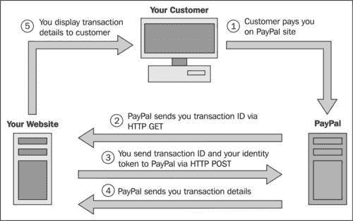

# 第七章. 网络服务

本章我们将涵盖以下菜谱：

+   使用 jQuery 消费 web2py JSON 服务

+   消费 JSON-RPC 服务

+   从 JavaScript 发起 JSON-RPC

+   使用 pyamf 从 Flex 发起 amf3 RPC 调用

+   web2py 中的 PayPal 集成

+   PayPal 网络支付标准

+   获取 Flickr 照片

+   通过**Amazon Web Services** (AWS)使用 Boto 发送电子邮件

+   使用 mapscript 制作 GIS 地图

+   Google 群组和 Google 代码源代码阅读器

+   创建 SOAP 网络服务

# 简介

本章不涉及创建网络服务（该主题在官方 web2py 手册中有讨论）；而是关于如何使用网络服务。最常用的网络服务使用协议，如 JSON、JSON-RPC、XML、XMLRPC 和/或 SOAP。web2py 支持所有这些协议，但集成可能相当复杂。在这里，我们提供了与 Flex、Paypal、Flickr 和 GIS 集成的示例。

# 使用 jQuery 消费 web2py JSON 服务

这是一个从服务器检索 JSON 数据并使用 jQuery 消费它的简单示例。

## 如何做到这一点...

从 web2py 返回 JSON 的方式有很多，但在这里我们考虑的是 JSON 服务的案例，例如：

```py
def consumer():
	return dict()

@service.json
def get_days():
	return ["Sunday", "Monday", "Tuesday", "Wednesday", "Thursday",
		"Friday", "Saturday"]

def call():
	return service()

```

在这里，函数`consumer`实际上并没有做什么；它只是返回一个空字典以渲染视图，该视图将使用服务。`get_days`定义了服务，函数调用暴露了所有已注册的服务。`get_days`不需要在控制器中，也可以在模型中。`call`始终在`default.py`脚手架控制器中。

现在，我们为消费者操作创建一个视图：

```py
{{extend 'layout.html'}}

<div id="target"></div>

<script>
	jQuery.getJSON("{{=URL('call',args=['json','get_days'])}}",
		function(msg){
	jQuery.each(msg, function(){ jQuery("#target").
		append(this + "<br />"); } )
	});
</script>

```

## 它是如何工作的...

`jQuery.getJSON`的第一个参数是以下服务的 URL：

`http://127.0.0.1:8000/app/default/call/json/get_days`

这始终遵循以下模式：`http://<domain>/<app>/<controller>/call/<type>/<service>`

URL 位于`{{...}}`之间，因为它在服务器端解析，而其他所有内容都在客户端执行。

`jQuery.getJSON`的第二个参数是一个回调，它将传递 JSON 响应。在我们的例子中，回调遍历响应中的每个项目（字符串形式的周天列表），并将每个字符串，后跟一个`<br/>`，追加到`<div id="target">`中。

## 更多内容...

如果你启用了通用 URL，你可以将`json`服务实现为一个常规操作。

```py
response.generic_pattern = ['get_days.json']
def get_days():
	return ["Sunday", "Monday", "Tuesday", "Wednesday",
		"Thursday", "Friday", "Saturday"]

```

在这种情况下，你不需要使用`call`操作，你可以将消费者操作的视图重写如下：

```py
{{extend 'layout.html'}}

<div id="target"></div>
	<script>
		jQuery.getJSON(
			"{{=URL('get_days.json')}}",
			function(msg){
			jQuery.each(
				msg,
				function(){
						jQuery("#target").append(this + "<br />");
				}
			);
		}
	);
</script>

```

这样做的话，URL 会更短。那么，为什么使用`@service.json`而不是后一种方法呢？有两个原因。第一个原因是，在前一种情况下，你可以使用相应的装饰器同时暴露相同的函数，用于 JSON-RPC、XMLRPC、SOAP 和 AMF 服务，而在后一种情况下，这会更复杂。第二个原因是，使用`@service.json`，GET 变量会自动解析并作为变量传递给服务函数。例如：

```py
@service.json
def concat(a,b):
	return a+b

```

这可以等价地用以下方式调用：

`http://127.0.0.1:8000/app/default/call/json/concat?a=hello&b=world`

`http://127.0.0.1:8000/app/default/call/json/concat/hello/world`

`http://127.0.0.1:8000/app/default/call/json/concat/hello?b=world`

# 消费 JSON-RPC 服务

虽然，之前我们考虑的是 JSON 服务的情况，但现在我们感兴趣的是 **JSON-RPC** 服务。这更复杂，因为变量（`request` 和 `response`）有更严格的格式，由协议规定。

## 准备工作

我们可以在纯 web2py 中创建 JSON-RPC 服务，但更有可能的是我们会从不同的 Python 程序中消费它。为此，我们将假设一个标准的 `jsonrpc` 库，它可以在以下 URL 中找到：

[`github.com/bmjames/python-jsonrpc`](http://https://github.com/bmjames/python-jsonrpc)

你可以使用以下命令安装它：

```py
easy_install jsonrpc

```

## 如何做...

1.  首先，我们需要创建 `service`。我们将考虑之前使用的相同示例，但改变其装饰器：

    ```py
    	from gluon.tools import Service
    	service = Service(globals())
    	@service.jsonrpc
    	def concat(a,b):
    	return a+b
    def call():
    	return service()

    ```

1.  现在，要调用它，我们需要一个来自独立（非 web2py）Python 程序的 JSON-RPC 客户端库：

    ```py
    from jsonrpc.proxy import JSONRPCProxy
    proxy = JSONRPCProxy(
    	'http://127.0.0.1:8000',path='/app/default/call/jsonrpc')
    print proxy.call('concat','hello','world')

    ```

### 更多...

现在还有其他的 JSON-RPC 库，例如 [`json-rpc.org/wiki/python-json-rpc`](http://json-rpc.org/wiki/python-json-rpc)，它使用的语法更接近 `xmlrpclib` 的语法：

```py
from jsonrpc import ServerProxy
proxy = ServerProxy(
	'http://127.0.0.1:8000/app/default/call/jsonrpc')
print proxy.concat('hello','world')

```

注意，在这种情况下，方法名变成了一个属性。这两个库不兼容，但名称相同。确保你知道你正在使用哪一个。

web2py 在 `gluon/contrib/simplejsonrpc.py` 中包含了它自己的 JSON-RPC 客户端库，并且它的 API 与之前的示例兼容：

```py
def test_concat():
	from gluon.contrib.simplejsonrpc import ServerProxy
	proxy = ServerProxy(
		'http://127.0.0.1:8000/%s/default/call/jsonrpc' %
		request.application)
	return proxy.concat('hello','world')

```

# JSON-RPC 从 JavaScript

有很多理由你想在 Web 应用程序中，客户端和服务器之间使用 JSON-RPC 作为传输协议。这特别有用于创建丰富的客户端界面，因为 JSON-RPC 比 XML-RPC 快，因为它更简洁，并且更容易被 JavaScript 代码解析。JSON-RPC 比单纯的 JSON 更好，因为它是一个 RPC 协议，这意味着它会为你处理错误传播。

在这个配方中，我们提供了一个如何做到这一点的示例。

你可以在以下 URL 上的文章中阅读更多关于此的信息，该文章由 *Luke Kenneth Casson Leighton* 撰写，他是出色的 *Pyjamas 库* 的作者：

[`www.advogato.org/article/993.html`](http://www.advogato.org/article/993.html)

这个配方是基于这里发布的代码：

[`otomotion.org/BasicJSONRPC/static/BasicJSONRPC-application.zip`](http://otomotion.org/BasicJSONRPC/static/BasicJSONRPC-application.zip)

## 准备工作

这个配方是基于 `json-xml-rpc` 库，它可以在以下位置找到：

[`code.google.com/p/json-xml-rpc`](http://code.google.com/p/json-xml-rpc)

这是一个用于连接到 web2py 的动作的 RPC JavaScript 客户端实现，它使用其本地的 JSON-RPC 支持。

这不是一个完美的方法，但它提供了服务器和客户端之间的一定程度的解耦，使得我愿意忽略其小缺陷。这篇启发性的文章，由 *Luke Kenneth Casson Leighton* 撰写，更详细地介绍了这种方法（见 *Full-blown JavaScript-led Development* 部分）。这也是 GWT ([`code.google.com/webtoolkit/`](http://code.google.com/webtoolkit/)) 和 PyJamas ([`pyjs.org/`](http://pyjs.org/)) 等框架所使用的方法。

## 如何做到这一点...

1.  我们将创建两个控制器和一个视图。第一个控制器将简单地加载视图中定义的丰富客户端界面。第二个控制器定义 JSON-RPC 方法。没有真正的理由不使用单个控制器来完成这两个目的，但将两个功能保持在不同文件中是一种更好的设计。

    第一个控制器可以是 `default.py`，我们可以使用通常的简单操作：

    ```py
    def index(); return dict()

    ```

    在 `view views/default/index.html` 中，我们将简单地添加以下代码：

    ```py
    {{
    	response.files.append(URL('static','js/jquery.js'))
    	response.files.append(URL('static','js/rpc.js'))
    	response.files.append(URL('static','js/BasicJSONRPC.js'))
    }}
    {{extend 'layout.html'}}

    ```

    `BasicJSONRPC.py` 控制器除了对视图的引用外，没有其他内容。

    ```py
    def index():
    	response.view = "BasicJSONRPC.html"
    	return dict()

    def BasicJSONRPC():
    	response.view = "BasicJSONRPC.html"
    	return dict()

    ```

    `BasicJSONRPCData.py` 控制器是实际与生活交汇的地方。我们将从简单开始。

    ```py
    import math

    from gluon.tools import Service

    service = Service(globals())

    def call():
    	return service()

    @service.jsonrpc

    def systemListMethods():

    	#Could probably be rendered dynamically

    	return ["SmallTest"];

    @service.jsonrpc

    def SmallTest(a, b):

    	return a + b

    ```

    `systemListMethods` 动作是 `json-xml-rpc` 库所必需的。默认情况下，该库实际上调用 `system.ListMethods`，这在 Python 中无法支持。因此，我们在 RPC 库内部的调用中移除了点号。Python 函数只需返回一个包含所有可能调用方法的字符串数组。

1.  现在我们已经准备好了控制器，我们可以继续到客户端部分。访问 RPC 方法的 URL 大概如下：

    `http://localhost/Application/Controller/call/jsonrpc`

1.  使用此 URL 和 `json-xml-rpc` 库，我们创建一个 JavaScript `DataController` 对象，我们将使用它进行所有未来的过程调用。

    ```py
    var ConnectionCreationTime = null;
    var DataController = null;
    var Connected = false;

    function InitDataConnection() {
    	Connected = false;
    	// replace with the correct service url
    	var url = http://localhost/Application/Controller/call/jsonrpc
    	// var url = GetConnectionURL();
    	try {
    		// Here we connect to the server and build
    		// the service object (important)
    		DataController = new rpc.ServiceProxy(url);
    		Connected = true;
    	} catch(err) {
    		Log("Connection Error: " + err.message);
    		Connected = false;
    	}
    	var now = new Date();
    	ConnectionCreated = now;
    }

    ```

1.  默认情况下，`json-xml-rpc` 库为异步调用创建 `DataController`。由于你不想在请求期间阻塞你的 JavaScript，**异步调用**是期望的行为。然而，如果你想要快速测试你的远程方法，你可以从 Firebug 控制台中运行以下 JavaScript 代码：

    ```py
    http://getfirebug.com

    InitDataConnection();
    rpc.setAsynchronous(DataController,false);
    DataController.SmallTest(1,2);

    ```

    +   `json-xml-rpc` 文档位于 [`code.google.com/p/json-xml-rpc/wiki/DocumentationForJavaScript`](http://code.google.com/p/json-xml-rpc/wiki/DocumentationForJavaScript)，其中详细说明了如何运行异步调用。

        ```py
        function RunSmallTest() {
        	if(Connected == false)
        		Log("Cannot RunSmallTest unless connected");
        	else {
        		var a = GetAValue();
        		var b = GetBValue();
        		Log("Calling remote method SmallTest using values a="
        			+ a + " and b=" + b);
        		DataController.SmallTest({params:[a,b],
        			onSuccess:function(sum){
        		Log("SmallTest returned " + sum);
        		},
        		onException:function(errorObj){
        			Log("SmallTest failed: " + errorObj.message);
        		},
        		onComplete:function(responseObj){
        			Log("Call to SmallTest Complete");
        		}
        		});
        		Log("Asynchronous call sent");
        	}
        }

        ```

    +   你的 Python 函数可以返回字典和数组，正如我们的 `BiggerTest` 函数所展示的那样：

        ```py
        @service.jsonrpc
        def BiggerTest(a, b):
        	results = dict()
        	results["originalValues"] = [a,b]
        	results["sum"] = a + b
        	results["difference"] = a - b
        	results["product"] = a * b
        	results["quotient"] = float(a)/b
        	results["power"] = math.pow(a,b)
        	return results

        ```

        ### 注意

        不要忘记更新 `systemListMethods` 函数以包含任何新函数。

1.  在这一步，你应该能够使用 JavaScript（在 Firebug 控制台中同步调用）测试远程调用并查看结果：

    ```py
    >>> InitDataConnection();
    POST http://127.0.0.1:8000/BasicJSONRPC/BasicJSONRPCData/call/
    jsonrpc 	200 OK 	 20ms 		rpc.js (line 368)
    >>> rpc.setAsynchronous(DataController,false);
    >>> var results = DataController.BiggerTest(17,25);
    POST http://127.0.0.1:8000/BasicJSONRPC/BasicJSONRPCData/call/
    jsonrpc 	200 OK 	20ms 	rpc.js 		(line 368)
    >>> results.originalValues
    [17, 25]
    >>> results.originalValues[1]
    25
    >>> results.sum
    42
    >>> results.difference
    -8
    >>> results.quotient
    0.68

    ```

1.  认证也有效，因为每次请求都会发送 cookie，因此 web2py 能够解析 JSON-RPC 调用的会话 ID cookie。可以通过确保调用函数（而不是单个服务函数；这很重要）来向远程函数添加安全要求：

    ```py
    @auth.requires_login()
    def call():
    	return service()

    ```

1.  如果你还在主`BasicJSONRPC.py`控制器上设置了`@auth.requires_login`，那么当用户首次加载页面时，他们将登录，并且所有后续的 RPC 调用都将得到正确认证。然而，这个问题与**超时**有关。如果用户让页面空闲直到超时发生，他们仍然可以触发对服务器的 RPC 调用。认证将失败，并且默认的 web2py 值`auth.settings.login_url, /default/user/login`将被作为视图调用。问题在于，由于视图不是一个有效的 JSON-RPC 消息，`json-xml-rpc`库将丢弃它并失败。你可以捕获错误，但很难识别它。我找到的最简单解决方案，并且我希望其他人能找到更好的解决方案，是将`auth.settings.login_url`的值设置为 RPC 控制器中的一个操作，该操作返回的只是一个简单的字符串。

1.  在`db.py`中设置：

    ```py
    auth.settings.login_url = URL("BasicJSONRPC", 'Login')

    ```

1.  `Login`是一个非 JSON-RPC 操作（因为我们不希望它需要认证），它返回一个容易识别的字符串：

    ```py
    def Login():
    	return "Not logged in"

    ```

1.  我们可以随后通过在每次 RPC 调用失败时运行检查来从客户端检测认证失败。在异步调用的`onException`处理程序（见`RunSmallTest`）中，替换以下代码以处理认证：

    ```py
    onException:function(errorObj){
    	if(errorObj.message.toLowerCase().indexOf(
    		"badly formed json string: not logged in") >= 0)
    			PromptForAuthentication();
    	else
    		Log("SmallTest failed: " + errorObj.message);
    }

    ```

    这种方法的一个明显缺陷是我们失去了对常规 HTML 视图非常有用的登录视图。因此，虽然认证对 RPC 调用有效，但它破坏了 HTML 视图的认证。

1.  我们现在可以简化我们的调用。

    虽然无法真正简化 json-xml-rpc 库用于异步调用的语法，但对于仅仅获取或更新客户端数据对象的调用，它确实可以在某种程度上自动化许多部分。如果你试图以一致的方式处理错误和认证，这特别有用。我们可以使用以下客户端包装函数来执行异步调用：

    ```py
    function LoadDataObject(objectName,params,
    	responseObject,errorObject) {
    	Log("Loading data object \"" + objectName + "\"")
    	eval("" + objectName + " = \"Loading\"");
    	eval(objectName +"Ready = false");
    	if(responseObject === undefined) {
    		if(Connected != true) {
    			Log("Not connected, connecting...");
    			InitDataConnection();
    		}
    		var listUndefined = eval("DataController." +
    			objectName + " !== undefined")
    		if(Connected == true && listUndefined == true) {
    			var paramsString = "";
    		for(var i in params) {
    			paramsString += "params[" + i + "],";
    		}
    		//Removing trailing coma
    		paramsString = paramsString.substring(0,
    			(paramsString.length - 1));
    		eval(
    			"DataController."
    				+ objectName
    				+ "({params:["
    				+ paramsString
    				+ "], onSuccess:function(response){LoadDataObject(\"" + objectName + "\",["
    				+ paramsString + "],response)}, onException:function(error){
    				Log(\"Error detected\"); LoadDataObject(\""
    				+ objectName
    				+ "\",["
    				+ paramsString
    				+ "],null, error);}, onComplete:function(responseObj){
    				Log(\"Finished loading "
    				+ objectName
    		+ "\");} });" );
    		}
    		else {
    			eval(objectName + " = \"Could not connect\"");
    			eval(objectName + "Ready = false");
    			Log("Could not connect. Either server error " +
    			"or calling non existing method ("
    			+ objectName + ")");
    		}
    	} else {
    		if(errorObject === undefined) {
    			eval(objectName + " = responseObject");
    			eval(objectName +"Ready = true");
    		}
    		else {
    			Log("Failed to Load Data Object " +
    			objectName + ": " + errorObject.message)
    			eval(objectName + " = errorObject");
    			eval(objectName + "Ready = false");
    		}
    	}
    }

    ```

    这个函数可以用于任意数量的数据对象。要求如下：

    +   定义一个与 RPC 函数同名的`data object`变量（例如：`UserList`）

    +   定义另一个变量，其名称后跟`Ready`（例如：`UserListReady`）

    +   调用包装函数，通过传递一个字符串形式的 RPC 操作名称和一个包含任何所需参数值的数组（例如：`LoadDataObject("UserList", ["admins",false])`）

在调用过程中，`ready`变量将被设置为`false`，而`data object`变量将被设置为字符串`Loading`。如果发生错误，`ready`变量将保持`false`，而`data object`变量将被设置为错误对象。如果需要，你可以轮询这两个变量。

## 还有更多...

`json-xml-rpc`库是一个单独的 JavaScript 文件，可以通过从以下 Google 托管代码站点下载**rpc-client-JavaScript** ZIP 文件来获取：

[`code.google.com/p/json-xml-rpc/downloads/list`](http://code.google.com/p/json-xml-rpc/downloads/list)

它有优秀的文档，位于以下 URL：

[`code.google.com/p/json-xml-rpc/wiki/DocumentationForJavaScript`](http://code.google.com/p/json-xml-rpc/wiki/DocumentationForJavaScript)

然而，他们的代码中有一个 bug。在*修订版 36*中，我们必须将*第 422 行*更改为*第 424*：

```py
//Handle errors returned by the server
if(response.error !== undefined){
	var err = new Error(response.error.message);

```

到以下

```py
//Handle errors returned by the server
if(response.error && response.error !== undefined){
	var err = new Error(response.error.message);

```

我们还必须在`system.ListMethods`的调用中删除*第 151 行*和*第 154 行*中的点，以便支持 Python 中的`systemListMethods`函数。

# 使用 pyamf 从 Flex 调用 amf3 RPC

与*《官方 web2py 书籍》*中的示例不同，在这个菜谱中，我们向您展示如何与`mxml` Flex 应用程序通信，而不是与 Flash 通信。

## 准备工作

首先，你必须安装**pyamf**并将其对 web2py 可见（web2py 最初不包含 pyamf）。为此，访问以下 URL 的 pyamf 下载页面，并获取最新稳定版本的 ZIP 文件：

[`www.pyamf.com/community/download.html`](http://www.pyamf.com/community/download.html)

解压并根据`INSTALL.txt`中的说明进行安装。我建议使用以下命令，以避免可能的问题：

```py
python setup.py install --disable-ext

```

这将在 Python 的安装文件夹中放置一个`.egg`包（例如`PyAMF-0.5.1-py2.6.egg`），位于`\Lib\site-packages`下（例如，`C:\Python26\Lib\site-packages`）。`.egg`基本上是一个 ZIP 存档（如`.jar`到 Java），所以打开它并提取`pyamf`文件夹。转到 web2py 安装文件夹，找到`library.zip`存档。将`pyamf`添加到这个存档中。就是这样！现在，web2py 将透明地运行`pyamf`。

## 如何做到这一点...

1.  **Python 代码：**假设你正在开发一个名为`app`的应用程序，web2py 服务器运行在本机（127.0.0.1:8000）。添加一个名为`rpc.py`的新控制器，并将以下代码添加到控制器中：

    ```py
    from gluon.tools import Service
    service = Service(globals())

    def call():
    	session.forget()
    	return service()

    @service.amfrpc3("mydomain")
    def test():
    	return "Test!!!"

    ```

    注意，mydomain 非常重要。你可以使用不同的域名，但必须保持一致。不要忘记它！

1.  **Flex mxml/AS3 代码：**现在，创建一个新的**Flex**应用程序，并用以下代码替换其内容：

    ```py
    <?xml version="1.0" encoding="utf-8"?>
    	<mx:Application  layout="absolute">
    		<mx:Script>
    			<![CDATA[
    				import mx.rpc.events.FaultEvent;
    				import mx.rpc.events.ResultEvent;
    				import mx.controls.Alert;

    				private function resultHandler(
    					event:ResultEvent):void
    					{
    						trace(event.result.toString());
    					}
    					private function faultHandler(
    						event:FaultEvent):void
    						{
    							trace(event.fault.message);
    						}
    			]]>
    	</mx:Script>
    	<mx:RemoteObject
    		id="amfService"
    		endpoint="http://127.0.0.1:8000/app/rpc/call/amfrpc3"
    		destination="mydomain"
    	showBusyCursor="true">
    		<mx:method name="test" result="resultHandler(event)"
    			fault="faultHandler(event)"/>
    	</mx:RemoteObject>
    	<mx:Button x="250" y="150" label="Fire"
    		click="amfService.test();"/>
    </mx:Application>

    ```

1.  `code_xml:`请注意`RemoteObject. Endpoint`的定义是一个服务 URL。它不包括 RPC 方法名称，该名称应在`mx:method`对象的`name`属性中指定。`/call/amfrpc3`是一个标准 URL 后缀，不应更改。指定目标属性很重要，它是`@service.amfrpc3(...)`装饰器中控制器中出现的相同 ID。

1.  **设置** `crossdomain.xml:` 注意，为了让 Flex 能够从不同的域调用 RPC 服务，需要在那个域的服务器顶级目录下暴露一个适当的 `crossdomain.xml` 文件。例如：

    ```py
    http://mydomain.com:8000/crossdomain.xml

    ```

    要做到这一点，在应用程序的 `static/` 文件夹内创建 `crossdomain.xml` 文件（web2py 不支持公共资源，因此我们将进行一些路由），并添加适当的访问策略。例如，**完全访问**（出于安全原因不推荐）：

    ```py
    <?xml version="1.0"?>
    <!DOCTYPE cross-domain-policy SYSTEM
    	"http://www.macromedia.com/xml/dtds/cross-domain-policy.dtd">
    <cross-domain-policy>
    	<allow-access-from domain="*" />
    </cross-domain-policy>

    ```

    现在转到 web2py 安装文件夹，创建一个名为 routes.py 的文件，并包含以下内容：

    ```py
    routes_in = (('/crossdomain.xml', '/app/static/crossdomain.xml'),)

    ```

    此文件指示 web2py 服务器将 crossdomain.xml 中的所有请求重定向到应用程序静态资源的位置。不要忘记关闭并运行服务器进程，以便它重新加载路由信息。

# Web2py 中的 PayPal 集成

这个食谱旨在介绍 web2py 中的 **Paypal** 集成。它绝对没有涵盖所有可能的 PayPal 集成，主要关注 PayPal 命名的 **标准集成**。给出的示例在撰写本文时已被验证，但它们只能作为起点，而不是参考。为此，请使用 PayPal 和 web2py 的文档。

### 注意

PayPal 提供了不同层次的集成，这取决于你需要做什么，可能更适合你的需求。在开始编程之前，了解 PayPal 提供的基本集成概念是很重要的，这样你可以提前规划最适合你需求的内容。

话虽如此，在进一步讨论之前，让我尝试给你一个不同层次的大致概念，以便更好地理解这个食谱涵盖的小领域。然而，这是一个大多数小型和中型项目可能会遇到的领域。

在大体上，使用 PayPal 可以实现三个层次的集成：

+   **快速结账:** 在 PayPal 的卖家账户中，您可以创建与您可能销售的每个项目相关的按钮信息（名称、描述、项目编号和定价）。您可以以这种方式定义多达 1000 个不同的按钮或项目。之后，只需将按钮设置在 HTML 中，与应用程序一起使用即可。关于 web2py，只需将 PayPal 为每个按钮创建的代码复制到您的产品 `db` 中的文本字段，然后在需要时将其显示在屏幕上，这实际上非常简单。使用这种方法，可以选择不同的购买体验，包括直接结账或购物车管理（由 PayPal 管理），这可以让您在 PayPal 的结账屏幕中添加或删除项目。我不喜欢这种方法，除非您要销售非常非常少的商品代码，因为这可能会使您在 PayPal 上维护文章变得痛苦。如果您销售少量服务或具有小价格组合的商品，这可能会非常有价值，因为您不需要从编程角度做太多工作，而且设置起来非常简单。

+   **标准集成:** 这是我们将在本文中介绍的内容。它基本上允许您管理自己的产品数据库等，并在支付时将所有数据发送到 PayPal，以便整个结账过程在 PayPal 上管理。交易完成后，您可以选择（根据您在 PayPal 卖家账户中的个人资料配置）是否将客户重定向回您的域名（您可以设置一个默认 URL 返回，或者每次发送结账数据时动态发送该 URL，但此功能需要在您的卖家账户中激活）。以下两点需要在此处提及，我认为它们是标准集成的一部分，尽管它们不是使您的网站基本功能正常工作的必需品：

    +   **支付数据传输 (PDT):** 这将是一个将客户送回您域名的流程，让您能够捕获交易数据（来自 PayPal 的支付确认数据），并在您自己的域名中的确认屏幕上显示，同时可以显示您可能想要显示的任何其他信息，或者将客户重定向以继续购物。这并不完全安全，因为没有什么是保证客户会被重定向的；这种情况可能发生，因为在某些情况下，PayPal 不会执行重定向，而是强制客户点击一个额外的按钮返回您的域名，以便给客户加入 PayPal 的机会。当客户使用信用卡支付而不是使用他的 PayPal 账户时，这种情况就会发生。

    +   **即时支付通知 (IPN):** 这是一个消息服务，它连接到您的域名，以发送在 PayPal 上处理的每笔交易的信息。它会在您确认接收（或四天未确认）之前不断发送消息。这是收集 PayPal 上所有交易数据的最佳方式，并触发您可能有的任何内部流程。通常，您会在此时进行产品的发货。

+   **详细集成:** 在这里，我实际上是在汇总许多其他方法和 API，我将不会详细说明；其中一些用于非常特定的用途。我想特别提到的唯一方法是**名称值对 (NVP)**，因为它提供了一个非常简单的编程接口，您可以使用它进行非常详细的过程控制，管理所有数据以及从您的域名到所有交易流程。使用 NVP，例如，您可以在您的域名中捕获与支付相关的所有数据，然后仅在这一点上，将所有信息发送到 PayPal 进行处理（与处理结账相反，这是我们之前所做的事情）。您可以在[`web2py.com/appliances/default/show/28`](http://web2py.com/appliances/default/show/28)找到一个很好的实现示例，或者访问主网页，在免费应用程序下找到它，**PayPalEngine**，由*Matt Sellers*开发。然而，您应该检查 PayPal 的详细文档，因为该过程涉及许多步骤，以确保交易的最大安全性。

因此，基本上，在快速结账过程中，PayPal 管理您的购物车（和主数据）、结账流程，当然，还有支付。使用标准集成，PayPal 管理结账和支付，而使用更详细的集成，您可以使其仅管理支付。

## 如何操作...

在继续之前，有关与 PayPal 集成的所有技术文档可以在以下位置找到：

[`cms.paypal.com/us/cgi-bin/?cmd=_render-content&content_ID=developer/library_documentation`](http://https://cms.paypal.com/us/cgi-bin/?cmd=_render-content&content_ID=developer/library_documentation)

如果此链接发生变化，可以通过点击以下文档链接找到该链接：

[`developer.paypal.com/`](http://https://developer.paypal.com/)

接下来，关于如何使用标准集成，您应该做的第一件事是为自己创建一个沙盒账户。您可以在`https://developer.paypal.com/`上完成此操作。创建自己的账户，登录后，创建至少两个测试账户：一个`seller`和一个`buyer`。有一个很好的指南，称为**PP 沙盒用户指南**，您可以在之前提供的文档链接中找到，或者在一个 HTML 版本中查看[`cms.paypal.com/us/cgi-bin/? cmd=_render-content&content_ID=developer/howto_testing_sandbox`](http://https://cms.paypal.com/us/cgi-bin/?)。如何设置您的账户并开始运行的所有信息都在那里描述。

一旦设置并运行，您将拥有您的卖家 ID 和电子邮件（您可以使用它们中的任何一个在下面的代码中向 PayPal 进行身份验证，尽管我更喜欢 ID，以避免可能的垃圾邮件）。

好的，那么现在，我们已经可以创建一个**结账按钮**，该按钮将带我们的客户访问包含所有购物车数据的 PayPal 网站。在继续之前，您可以在之前提供的文档链接下找到与此点相关的所有文档，在*网站支付标准集成指南*中，或者直接在 HTML 格式中查看：

[`cms.paypal.com/us/cgi-bin/? cmd=_render-content&content_ID=developer/howto_html_wp_standard_overview`](http://https://cms.paypal.com/us/cgi-bin/?)

检查有关*第三方购物车*的信息。无论如何，创建发送所有信息的按钮实际上非常简单。您只需要在结账页面视图中添加以下代码：

```py
<form action="https://www.sandbox.paypal.com/cgi-bin/webscr"
		method="post">
		<!-- Select the correct button depending on country etc.
		If you can do it with pre-generated buttons (with prices included
			etc)
			then so much the better for security -->
		<input type="hidden" name="business" value="{{=paypal_id}}" />
	<input type="image" src=
		"https://www.sandbox.paypal.com/es_XC/i/btn/btn_buynowCC_LG.gif"
		border="0" name="submit" alt="PayPal - The safer, easier way to pay
		online!">
	
	<form action="http://www.sandbox.paypal.com/cgi-bin/webscr"
		method="post" />
	<input type="hidden" name="cmd" value="_cart" />
	<input type="hidden" name="upload" value="1" />
	<input type="hidden" name="charset" value="utf-8">
	<input type="hidden" name="currency_code" value="EUR" />
	<input type="hidden" name="display" value="1"/>
	<input type="hidden" name="shopping_url"
		value="http://www.micropolixshop.com/giftlist/default/glist"/>
	<!-- Not really necessary, only if want to allow
		continue Shopping -->
	<input type="hidden" name="notify_url" value=
		"http://www.micropolixshop.com/giftlist/default/ipn_handler"/>
	<!-- Or leave blank and setup default url at paypal -->
	<input type="hidden" name="return"
		value="http://www.micropolixshop.com/giftlist/default/confirm"/>
	<!-- Or leave blank and setup default url at paypal -->
	<input type="hidden" name="custom" value="{{=session.event_code}}"/>
	{{k=1}}
	{{for id,product in products.items():}}
	<input type="hidden" name="item_number_{{=k}}"
		value="{{=product.ext_code}}"/>
	<input type="hidden" name="item_name_{{=k}}"
		value="{{=product.name}}"/>
	<input type="hidden" name="quantity_{{=k}}"
		value="{{=session.cart[str(id)]}}"/>
	<input type="hidden" name="discount_rate_{{=k}}" value="15"/>
	<!-- ie, wants a 15% on all articles always -->
	<input type="hidden" name="tax_{{=k}}"
		value="{{=product.price*product.tax_rate}}"/>
	<input type="hidden" name="amount_{{=k}}"
		value="{{=product.price}}"/>
	{{k+=1}}
	{{pass}}
</form>

```

关于列表`lst:CheckoutButton:`的一些评论

+   在所有情况下，要从沙盒环境迁移到生产环境，只需将使用的 URL 从[`www.sandbox.paypal.com`](http://https://www.sandbox.paypal.com)更改为[`www.paypal.com`](http://https://www.paypal.com)即可。

+   您可以使用卖家账户中的“创建新按钮”功能来创建按钮，然后重用该代码。这将让您选择要使用的语言和按钮类型。这样，您将获得用于您的 PayPal 按钮的正确图片链接。

+   字段`cmd`的`value _cart`非常重要。阅读文档以查看此字段的可能值，具体取决于您想做什么。在这个例子中，我假设了一个购物车场景。

+   如果您设置了卖家账户配置文件，则可以省略字段`shopping_url, notify_url`和`return`。如果在这里设置，则它将优先于在您的卖家账户中设置的默认值。

+   字段`custom`我认为相当重要，因为它是少数几个允许您引入不向客户显示的数据的字段之一，这可能允许您跟踪任何额外信息。它是按交易（而不是按项目）计算的。在这种情况下，我选择使用内部事件代码来跟踪与某个事件（如特殊的`promotion`或任何其他）相关的所有购买。

+   如您所见，我创建了一个循环，包含所有购物车项目以进行结账，通过传递包含所有产品数据的字典。我在会话中拥有已购买商品的信息。它们按照 PayPal 规则命名和编号。

+   关于折扣，尽管您为每个商品设置了折扣，但 PayPal 只显示折扣总额。我不知道这是否在 Pro 版本中有所不同。

如需更多信息，您应查阅之前提到的文档，其中包含您可用的所有字段列表（包括运费等）。

**结账确认/支付数据传输：**一旦客户通过 PayPal 完成支付，如果账户中已设置并他是 PayPal 用户（否则他需要点击按钮返回您的网站），他将被自动重定向到您的网站。本节向您展示如何设置您的应用程序，以便它将从 PayPal 接收支付数据确认，并向客户显示确认信息。

您可以在此处阅读有关此主题的详细文档：

[`cms.paypal.com/us/cgi-bin/?cmd=_render-content&content_ID=developer/howto_html_paymentdatatransfer`](https://cms.paypal.com/us/cgi-bin/?cmd=_render-content&content_ID=developer/howto_html_paymentdatatransfer)

在这里，您可以详细了解如何设置，以便您知道从哪里获取您的令牌，这是您需要用来向 PayPal 确认并获取数据的。在任何情况下，请参考以下表示*基本 PDT 交易流程图*的图（来自 PayPal 文档），以便给您一个详细的过程流程视图：



在`lst:generic-def`列表中，我包含了一些我在设置界面时使用的通用函数。`Connection`类定义是我在网上冲浪时找到的一个通用连接示例的修改版本，但我真的不记得具体在哪里找到了。我包含的`add_to_cart`、`remove_from_cart`、`empty_cart`和`checkout`作为如何设置购物车的示例，这些是从**EStore**中提取的，可以在[`www.web2py.com/appliances/default/show/24`](http://www.web2py.com/appliances/default/show/24)找到。

再次强调，这里的不同方法被过度简化了，试图用几行文字解释不同的可能性：

```py
# db.py file
#####################################################################
# Global Variables definition
#####################################################################
domain='www.sandbox.paypal.com'
protocol='https://'
user=None
passwd=None
realm=None
headers = {'Content-Type':'application/x-www-form-urlencoded'}
# This token should also be set in a table so that the seller can set
#it up
# dynamically and not through the code. Same goes for the PAGINATE.
paypal_token="XXXXXXXXXXXXXXXXXXXXXXXXXXXXXXXXXXXXXXXXXXXXXXXXXXXXXXX"
PAGINATE = 20
#####################################################################

# default.py file
#####################################################################
# coding: utf8

import datetime
import string

if not session.cart: session.cart, session.balance={},0
app=request.application

#### Setup PayPal login email (seller id) in the session
#### I store paypal_id in a table
session.paypal_id=myorg.paypal_id
import urllib2, urllib
import datetime

class Connection:
	def __init__(self, base_url, username, password, realm = None,
		header = {}):
		self.base_url = base_url
		self.username = username
		self.password = password
		self.realm = realm
		self.header = header

	def request(self, resource, data = None, args = None):
		path = resource

		if args:
			path += "?" + (args)

		# create a password manager
		password_mgr = urllib2.HTTPPasswordMgrWithDefaultRealm()

		if self.username and self.password:
			# Add the username and password.
				password_mgr.add_password(self.realm, self.base_url,
					self.username, self.password)

		handler = urllib2.HTTPBasicAuthHandler(password_mgr)

		# create "opener" (OpenerDirector instance)
		opener = urllib2.build_opener(handler)

		# Install the opener.
		# Now all calls to urllib2.urlopen use our opener.
		urllib2.install_opener(opener)
		#Create a Request
		req=urllib2.Request(self.base_url + path, data, self.header)
		# use the opener to fetch a URL
		error = ''
		try:
			ret=opener.open(req)
		except urllib2.HTTPError, e:
			ret = e
			error = 'urllib2.HTTPError'
		except urllib2.URLError, e:
			ret = e
			error = 'urllib2.URLError'

		return ret, error

	def add_to_cart():
		"""
			Add data into the session.cart dictionary
			Session.cart is a dictionary with id product_id and value = quantity
			Session.balance is a value with the total of the transaction.
			After updating values, redirect to checkout
		"""
		pid=request.args[0]
		product=db(db.product.id==pid).select()[0]
		product.update_record(clicked=product.clicked+1)
		try: qty=session.cart[pid]+1
		except: qty=1
		session.cart[pid]=qty
		session.balance+=product.price
		redirect(URL('checkout'))

	def remove_from_cart():
		"""
			allow add to cart
		"""
		pid = request.args[0]
		product=db(db.product.id==pid).select()[0]
		if session.cart.has_key(pid):
			session.balance-=product.price
			session.cart[pid]-=1
			if not session.cart[pid]: del session.cart[pid]
		redirect(URL('checkout'))

	def empty_cart():
		"""
			allow add to cart
		"""
		session.cart, session.balance={},0
		redirect(URL('checkout'))

	def checkout():
		"""
			Checkout
		"""
		pids = session.cart.keys()
		cart={}
		products={}
		for pid in pids:
			products[pid]=db(db.product.id==pid).select()[0]
		return dict(products=products,paypal_id=session.paypal_id)

```

最后，在`lst:confirm`列表中确认，将处理从 PayPal 发送的信息，按照之前基本 PDT 交易流程图中的四个步骤进行，步骤 2、3、4 和 5。

```py
def confirm():
	"""
		This is set so as to capture the transaction data from PayPal
		It captures the transaction ID from the HTTP GET that PayPal
			sends.
		And using the token from vendor profile PDT, it does a form post.
		The data from the http get comes as vars Name Value Pairs.
	"""
	if request.vars.has_key('tx'):
		trans = request.vars.get('tx')
		# Establish connection.
		conn = Connection(base_url=protocol+domain, username=user,
			password = passwd, realm = realm, header = headers)
		data = "cmd=_notify-synch&tx="+trans+"&at="+paypal_token
		resp,error=conn.request('/cgi-bin/webscr', data)
		data={}
		if error=='':
			respu = resp.read()
			respuesta = respu.splitlines()
			data['status']=respuesta[0]
			if respuesta[0]=='SUCCESS':
				for r in respuesta[1:]:
					key,val = r.split('=')
					data[key]=val
				msg=''
				if data.has_key('memo'): msg=data['memo']
				form = FORM("Quiere dejar un mensaje con los regalos?",
					INPUT(_name=T('message'),_type="text",_value=msg),
					INPUT(_type="submit"))
				if form.accepts(request,session):
					email=data['payer_email'].replace('%40','@')
					id = db.gift_msg.insert(buyer=data['payer_email'],
						transact=trans,msg=form.vars.message)
					response.flash=T('Your message will be passed on to the
						recipient')
					redirect(URL('index'))

				return dict(data=data,form=form)
		return dict(data=data)
	else:
		data['status']='FAIL'
else:
	redirect(URL('index'))
return dict(trans=trans)

```

仅为了完整性，我添加了一个非常基础的`confirm.html`示例，您可以在`lst:confirmhtml`列表中看到。

```py
{{extend 'layout.html'}}

{{if data['status'] == 'SUCCESS':}}
<p><h3>{{=T('Your order has been received.')}}</h3></p>
<hr>
<b>{{=T('Details')}}</b><br>
<li>
	{{=T('Name:')}} {{=data['first_name']}} {{=data['last_name']}}
</li>
<li>'
	{{=T('Purchases for event:')}}: {{=data['transaction_subject']}}
</li>
<li>
	{{=T('Amount')}}: {{=data['mc_currency']}} {{=data['mc_gross']}}
</li>
<hr>
{{=form}}
{{else:}}
{{=T('No confirmation received from PayPal. This can be due to a
	number of reasons; please check your email to see if the
	transaction was successful.')}}
{{pass}}

{{=T('Your transaction has finished, you should receive an email of
	your purchase.')}}<br>
{{=T('If you have an account at PayPal, you can check your
	transaction details at')}}
	<a href='https://www.paypal.es'>www.paypal.es</a>

```

**即时支付通知（IPN）**：如前所述，不能完全信任 PDT 过程来接收所有交易的信息，因为可能会发生许多事情。因此，如果你需要对你的销售信息进行额外的处理，或者如果你想保留实际处理的销售的本地区域数据库，你需要实现一个额外的过程。

这是通过 IPN 完成的。你可以在之前给出的文档站点 URL 中找到所有相关文档。你需要在你的卖家账户中启用 IPN 功能，并给出一个默认 URL 来接收这些消息，这个 URL 应该等于你处理它们的视图。在这个例子中，它将是：[`www.yourdomain.com/yourapp/default/ipn_handler`](http://www.yourdomain.com/yourapp/default/ipn_handler)>。

该过程与 PDT 的过程非常相似；甚至变量都是相同的。主要区别在于 IPN 是从 PayPal 发送的，直到你确认它们。这个功能的视图`default/ipn_handler.html`完全可以留空。我还包括了一个用于记录 PayPal 消息的表定义。

无论如何，你可以在列表`lst:ipnhandler`中找到一个如何设置的示例：

```py
#### At models/db.py
#####################################################################
db.define_table('ipn_msgs',
	Field('trans_id',label=T('transaction id')),
	Field('timestamp','datetime',label=T('timestamp')),
	Field('type',label=T('type')),
	Field('msg','text',label=T('message')),
	Field('processed','boolean',label=T('processed')),
	Field('total','double',label=T('total')),
	Field('fee','double',label=T('fee')),
	Field('currency',length=3,label=T('currency')),
	Field('security_msg',label=T('security message'))
)

#### At controllers/default.py
#####################################################################
def ipn_handler():
	"""
		Manages the ipn connection with PayPal
		Ask PayPal to confirm this payment, return status and detail strings
	"""
	parameters = None
	parameters = request.vars
	if parameters:
		parameters['cmd'] = '_notify-validate'
		params = urllib.urlencode(parameters)
		conn = Connection(base_url=protocol+domain, username=user,
			password = passwd, realm = realm, header = headers)
		resp,error =conn.request('/cgi-bin/webscr', params)
		timestamp=datetime.datetime.now()
		# We are going to log all messages confirmed by PayPal.
		if error =='':
		ipn_msg_id = db.ipn_msgs.insert(trans_id=parameters['txn_id'],
			timestamp=timestamp,type=resp.read(),msg=params,
			total=parameters['mc_gross'],fee=parameters['mc_fee'],
			currency=parameters['mc_currency'])
		# But only interested in processing messages that have payment
		#status completed and are VERIFIED by PayPal.
		if parameters['payment_status']=='Completed':
			process_ipn(ipn_msg_id,parameters)

```

唯一缺少的是处理接收到的信息，并检查错误或可能的欺诈尝试。你可以在列表`lst:processipn`中看到一个示例函数。尽管这可能是每个项目都会相当大的变化，但我希望它可能对你作为一个粗略的指南有所帮助。

```py
def process_ipn(ipn_msg_id,param):
	"""
		We process the parameters sent from IPN PayPal, to correctly
		store the confirmed sales in the database.
		param -- request.vars from IPN message from PayPal
	"""
	# Check if transaction_id has already been processed.
	query1 = db.ipn_msgs.trans_id==param['txn_id']
	query2 = db.ipn_msgs.processed == True
	rows = db(query1 & query2).select()
	if not rows:
		trans = param['txn_id']
		payer_email = param['payer_email']
		n_items = int(param['num_cart_items'])
		pay_date = param['payment_date']
		total = param['mc_gross']
		curr = param['mc_currency']
		event_code = param['custom']
		if param.has_key('memo'): memo=param['memo']
		event_id = db(db.event.code==event_code).select(db.event.id)
		if not event_id:
			db.ipn_msgs[ipn_msg_id]=dict(security_msg=T('Event does not
				exist'))
		else:
			error=False
			for i in range(1,n_items+1):
				product_code = param['item_number'+str(i)]
				qtty = param['quantity'+str(i)]
				line_total = float(param['mc_gross_'+str(i)]) +
					float(param['mc_tax'+str(i)])
				product=db(db.product.ext_code==product_code).
					select(db.product.id)
				if not product:
					db.ipn_msgs[ipn_msg_id]=dict(security_msg=T('Product code
						does not exist'))
					error=True
				else:
					db.glist.insert(event=event_id[0],product=product[0],
						buyer=payer_email,transact=trans,
						purchase_date=pay_date,quantity_sold=qtty,
						price=line_total,observations=memo)
			if not error: db.ipn_msgs[ipn_msg_id]=dict(processed=True)

```

希望这个部分能帮助你使用 web2py 设置 PayPal 网站，或者至少帮助你理解设置一个网站背后的基本概念，以及你拥有的不同可能性。

# PayPal 网络支付标准

这个配方展示了使用加密请求和 IPN 实现 PayPal 网络支付标准的示例，以确保流程的安全性。请注意，在这个配方中，使用了 web2py 版本 1.77.3。希望它仍然在最新的 web2py 版本中工作。

## 如何做...

1.  为了实现我们与 PayPal 的集成，我首先开始编写生成加密表单提交到 PayPal 的代码，用于我们所有的购物车操作。如果你这样做，并且配置 PayPal 只接受签名请求，那么用户就不能篡改你的表单并更改商品的价格。为此，我在我们的系统上安装了**M2Crypto**模块，并创建了一个模块，用于对 PayPal 表单进行签名。请注意，这不能在 Google App Engine 上运行，因为 M2Crypto 不支持 GAE。

    我还没有找到在 App Engine 上运行的替代品，所以你不能在那个环境中使用这个 PayPal 支付配方。

    加密模块（`crypt.py`）使用证书对数据进行签名，然后加密它，如下面的代码所示：

    ```py
    from M2Crypto import BIO, SMIME, X509, EVP

    def paypal_encrypt(attributes, sitesettings):
    	"""
    	Takes a list of attributes for working with PayPal (in our
    	case adding to the shopping cart), and encrypts them for
    	secure transmission of item details and prices.
    	@type attributes: dictionary
    	@param attributes: a dictionary of the PayPal request
    		attributes. An
    		example attribute set is:

    		>>> attributes = {"cert_id":sitesettings.paypal_cert_id,
    			"cmd":"_cart",
    			"business":sitesettings.cart_business,
    			"add":"1",
    			"custom":auth.user.id,
    			"item_name":"song 1 test",
    			"item_number":"song-1",
    			"amount":"0.99",
    			"currency_code":"USD",
    			"shopping_url":'http://'+\
    				Storage(globals()).request.env.http_host+\
    				URL(args=request.args),
    			"return":'http://'+\
    				Storage(globals()).request.env.http_host+\
    				URL('account', 'downloads'),
    		}

    	@type sitesettings: SQLStorage
    	@param sitesettings: The settings stored in the database.
    		this method
    		requires I{tenthrow_private_key}, I{tenthrow_public_cert},
    	  and I{paypal_public_cert} to function
    	@rtype: string
    	@return: encrypted attribute string
    """

    plaintext = ''

    for key, value in attributes.items():
    	plaintext += u'%s=%s\n' % (key, value)

    plaintext = plaintext.encode('utf-8')

    # Instantiate an SMIME object.
    s = SMIME.SMIME()

    # Load signer's key and cert. Sign the buffer.
    s.pkey = EVP.load_key_string(sitesettings.tenthrow_private_key)
    s.x509 = X509.load_cert_string(
    	sitesettings.tenthrow_public_cert)

    #s.load_key_bio(BIO.openfile(settings.MY_KEYPAIR),
    # 			BIO.openfile(settings.MY_CERT))

    p7 = s.sign(BIO.MemoryBuffer(plaintext),
    	flags=SMIME.PKCS7_BINARY)

    # Load target cert to encrypt the signed message to.
    #x509 = X509.load_cert_bio(BIO.openfile(settings.PAYPAL_CERT))
    x509 = X509.load_cert_string(sitesettings.paypal_public_cert)

    sk = X509.X509_Stack()
    sk.push(x509)
    s.set_x509_stack(sk)

    # Set cipher: 3-key triple-DES in CBC mode.
    s.set_cipher(SMIME.Cipher('des_ede3_cbc'))

    # Create a temporary buffer.
    tmp = BIO.MemoryBuffer()

    # Write the signed message into the temporary buffer.
    p7.write_der(tmp)

    # Encrypt the temporary buffer.
    p7 = s.encrypt(tmp, flags=SMIME.PKCS7_BINARY)

    # Output p7 in mail-friendly format.
    out = BIO.MemoryBuffer()
    p7.write(out)

    return out.read()

    ```

1.  然后，我们在视图中构建表单，并加密它们：

    ```py
    {{from applications.tenthrow.modules.crypt import * }}

    {{ 		attributes = {"cert_id":sitesettings.paypal_cert_id,
    	"cmd":"_cart",
    	"business":sitesettings.cart_business,
    	"add":"1",
    	"custom":auth.user.id,
    	"item_name":artist_name + ": " + song['name'],
    	"item_number":"song-"+str(song['cue_point_id']),
    	"amount":song['cost'],
    	"currency_code":"USD",
    	"shopping_url":full_url('http',r=request,args=request.args),
    	"return":full_url('https', r=request, c='account', \
    	f='alldownloads'),
       }
    	encattrs = paypal_encrypt(attributes, sitesettings)
      }}
      <form target="_self"
    	action="{{=sitesettings.cart_url}}" method="post"
    	name="song{{=song['cue_point_id']}}">
    	<!-- Identify your business so that you can collect the
    		payments. -->
    	<input type="hidden" name="cmd" value="_s-xclick"
    		class="unform"/>
    	<input type="hidden" name="encrypted" value="{{=encattrs}}"
    		class="unform"/>
    	<a onclick="document.song{{=song['cue_point_id']}}.submit()"
    		class="trBtn">
    		
    		
    	</a>
    	
      </form>

    ```

    注意，上述代码调用了一个名为 full_url()的方法，其定义如下：

    ```py
    def full_url(scheme="http",
    	a=None,
    	c=None,
    	f=None,
    	r=None,
    	args=[],
    	vars={},
    	anchor='',
    	path = None
    ):
    	"""
    		Create a fully qualified URL. The URL will use the same host
    		that the request
    		was made from, but will use the specified scheme.
    		Calls
    		C{gluon.html.URL()} to construct the relative path to the
    		host.

    		if <scheme>_port is set in the settings table, append the port
    		to the domain of the created URL

    		@param scheme: scheme to use for the fully-qualified URL.
    			(default to 'http')
    		@param a: application (default to current if r is given)
    		@param c: controller (default to current if r is given)
    		@param f: function (default to current if r is given)
    		@param r: request
    		@param args: any arguments (optional)
    		@param vars: any variables (optional)
    		@param anchor: anchorname, without # (optional)
    		@param path: the relative path to use. if used overrides
    			a,c,f,args, and
    			vars (optional)
    	"""
    	port = ''
    	if sitesettings.has_key(scheme+"_port") and
    		sitesettings[scheme+"_port"]:
    			port = ":" + sitesettings[scheme+"_port"]
    		if scheme == 'https' and sitesettings.has_key("https_scheme"):
    			scheme = sitesettings.https_scheme
    		url = scheme +'://' + \
    			r.env.http_host.split(':')[0] + port
    		if path:
    			url = url + path
    		else:
    			url = url+URL(a=a, c=c, f=f, r=r, args=args, vars=vars,
    				anchor=anchor)
    		return url

    ```

1.  然后，我需要能够处理我们的 PayPal IPN 响应。以下代码正是这样做的。你会看到我只处理购买请求。我还保留了特定于我们数据库的代码，关于如何编码产品 ID，然后使用该产品 ID 在我们的数据库中创建记录。根据我们数据库中这些购买记录的存在，我允许用户下载他们购买的内容。因此，用户必须在 IPN 消息处理完毕后才能下载他们的购买内容。这通常在他们提交订单后的 5 到 30 秒内完成。大多数情况下，消息在 PayPal 将用户重定向回我们的网站之前就已经被接收和处理。我们的`paypal.py`控制器将有一个处理即时支付通知的函数，如以下代码部分所述（注意我们在模块目录中有`openanything`。访问[`diveintopython.org/`](http://diveintopython.org/)获取最新版本）：

    ```py
    from applications.app.modules.openanything import *

    def ipn():
    	"""
    	This controller processes Instant Payment Notifications from
    	PayPal.
    	It will verify messages, and process completed cart transaction
    	messages
    	only. all other messages are ignored for now.

    	For each item purchased in the cart, the song_purchases table
    	will be
    	updated with the purchased item information, allowing the user 
    	to
    	download the item.

    	logs are written to /tmp/ipnresp.txt

    	the PayPal IPN documentation is available at:
    	https://cms.paypal.com/cms_content/US/en_US/files/developer/
    		IPNGuide.pdf
    	"""
    	"""
    	sample PayPal IPN call:

    	last_name=Smith&
    	txn_id=597202352&
    	receiver_email=seller%40paypalsandbox.com&
    	payment_status=Completed&tax=2.02&
    	mc_gross1=12.34&
    	payer_status=verified&
    	residence_country=US&
    	invoice=abc1234&
    	item_name1=something&
    	txn_type=cart&
    	item_number1=201&
    	quantity1=1&
    	payment_date=16%3A52%3A59+Jul.+20%2C+2009+PDT&
    	first_name=John&
    	mc_shipping=3.02&
    	charset=windows-1252&
    	custom=3&
    	notify_version=2.4&
    	test_ipn=1&
    	receiver_id=TESTSELLERID1&
    	business=seller%40paypalsandbox.com&
    	mc_handling1=1.67&
    	payer_id=TESTBUYERID01&
    	verify_sign=AFcWxV21C7fd0v3bYYYRCpSSRl31AtrKNnsnrW3-8M8R-
    		P38QFsqBaQM&
    	mc_handling=2.06&
    	mc_fee=0.44&
    	mc_currency=USD&
    	payer_email=buyer%40paypalsandbox.com&
    	payment_type=instant&
    	mc_gross=15.34&
    	mc_shipping1=1.02
    """

    #@todo: come up with better logging mechanism
    logfile = "/tmp/ipnresp.txt"

    verifyurl = "https://www.paypal.com/cgi-bin/webscr"
    if request.vars.test_ipn != None and request.vars.test_ipn ==
    	'1':
    	verifyurl = "https://www.sandbox.paypal.com/cgi-bin/webscr"

    	params = dict(request.vars)
    	params['cmd'] = '_notify-validate'
    	resp = fetch(verifyurl, post_data=params)

    #the message was not verified, fail
    if resp['data'] != "VERIFIED":
    	#@todo: figure out how to fail
    	f = open(logfile, "a")
    	f.write("Message not verified:\n")
    	f.write(repr(params) + "\n\n")
    	f.close()
    	return None
    ...
    if request.vars.txn_type != "cart":
    	#for now ignore non-cart transaction messages
    	f = open(logfile, "a")
    	f.write("Not a cart message:\n")
    	f.write(repr(params) + "\n\n")
    	f.close()
    	return None
    ...
    if request.vars.payment_status != 'Completed':
    	#ignore pending transactions
    	f = open(logfile, "a")
    	f.write("Ignore pending transaction:\n")
    	f.write(repr(params) + "\n\n")
    	f.close()
    	return None
    ...
    #check id not recorded
    if len(db(db.song_purchases.transaction_id==request.
    	vars.txn_id).select())>0:
    	#transaction already recorded
    	f = open(logfile, "a")
    	f.write("Ignoring recorded transaction:\n")
    	f.write(repr(params) + "\n\n")
    	f.close()
    	return None

    		#record transaction
    		num_items = 1
    		if request.vars.num_cart_items != None:
    			num_items = request.vars.num_cart_items

    		for i in range(1, int(num_items)+1):
    			#i coded our item_number to be a tag and an ID. the ID is
    			# a key to a table in our database.
    			tag, id = request.vars['item_number'+str(i)].split("-")
    			if tag == "song":
    				db.song_purchases.insert(auth_user=request.vars.custom,
    				cue_point=id,
    				transaction_id=request.vars.txn_id,
    				date=request.vars.payment_date.replace('.', ''))

    			elif tag == "song_media":
    				db.song_purchases.insert(auth_user=request.vars.custom,
    					song_media=id,
    					transaction_id=request.vars.txn_id,
    					date=request.vars.payment_date.replace('.', ''))

    			elif tag == "concert":
    				db.concert_purchases.insert(auth_user=request.vars.custom,
    					playlist=id,
    					transaction_id=request.vars.txn_id,
    					date=request.vars.payment_date.replace('.', ''))
    			else:
    				#@TODO: this is an error, what should we do here?
    				f = open(logfile, "a")
    				f.write("Ignoring bad item number: " + \
    					request.vars['item_number'+str(i)] + "\n")
    				f.write(repr(params) + "\n\n")
    				f.close()

    		f = open(logfile, "a")
    		f.write("Processed message:\n")
    		f.write(repr(params) + "\n\n")
    		f.close()
    	return None

    ```

就这些了，朋友们！

# 获取 Flickr 照片

这个菜谱可以用来获取通过照片集 ID 过滤的 Flickr 照片列表。

## 准备工作

首先，你需要生成一个**APIKEY**，你可以在 Flickr 开发者页面上完成：

[`www.flickr.com/services/api/misc.api_keys.html`](http://www.flickr.com/services/api/misc.api_keys.html)

之后，你需要创建一个函数来获取 Flickr API。通常，这会在模型中创建，但你也可以在模块中完成。

## 如何操作...

1.  在你的模型文件中的任何一个创建一个函数。我们将创建一个名为`models/plugin_flickr.py`的函数，如下所示：

    ```py
    def plugin_flickr(key, photoset=None, per_page=15, page=1):
    	from urllib2 import urlopen
    	from xml.dom.minidom import parse as domparse
    	apiurl = 'http://api.flickr.com/services/rest/?method=flickr.
    		photosets.getPhotos&api_key=%(apikey)s&photoset_id=
    		%(photoset)s&privacy_filter=1&per_page=%(per_page)s&page=
    		%(page)s&extras=url_t,url_m,url_o,url_sq'

    	dom = domparse(urlopen(apiurl % dict(photoset=photoset,
    		per_page=per_page, page=page, apikey=key)))

    	photos = []

    	for node in dom.getElementsByTagName('photo'):
    		photos.append({
    		'id':node.getAttribute('id'),
    		'title':node.getAttribute('title'),
    		'thumb':node.getAttribute('url_t'),
    		'medio':node.getAttribute('url_m'),
    		'original':node.getAttribute('url_o'),
    		'square':node.getAttribute('url_sq'),
    		})

    	return photos

    ```

1.  现在，你可以在任何控制器或视图中调用该函数。例如，在一个控制器操作中，如下所示：

    ```py
    def testflickr():
    	photos = plugin_flickr(
    		key='YOUR_API_KEY',
    		photoset='THE_PHOTOSET_ID',
    		per_page=15,
    		page=1)
    	return dict(photos=photos)

    ```

1.  在关联的`views/default/testflickr.html`中，你可以添加以下内容：

    ```py
    {{extend 'layout.html'}}

    {{for photo in photos:}}
    	{{=IMG(_src=photo['square'])}}
    {{pass}}

    ```

    最终产品将类似于以下截图所示：


# 通过亚马逊网络服务（AWS）使用 Boto 发送电子邮件

**亚马逊简单电子邮件服务**是一种无需操作自己的邮件服务器即可发送电子邮件的好方法。此代码利用了`Boto`库，它是 AWS 的 Python 接口。

## 准备工作

1.  首先，你需要在[`aws.amazon.com`](http://aws.amazon.com)注册 AWS。

1.  然后，在[`aws.amazon.com/ses/`](http://aws.amazon.com/ses/)启用简单电子邮件服务。

1.  你需要从[`aws-portal.amazon.com/gp/aws/developer/account/index.html`](http://https://aws-portal.amazon.com/gp/aws/developer/account/index.html)获取你的亚马逊`AWS-KEY`和`AWS-SECRET-KEY`。

1.  最后，你需要在你的`web2py/site-packages`文件夹中安装 Boto，或者在任何路径下，以便 web2py 可以找到并导入它。你可以在 GitHub 上找到 Boto：[`github.com/boto/boto`](http://https://github.com/boto/boto)。

在您获得亚马逊邮件服务器的**生产**访问权限之前，您必须预先注册您想要使用的每个发送者和接收者的电子邮件地址（最多 100 个）。这对于开发和测试来说是可行的，但在生产环境中当然是不行的。要注册电子邮件地址，请执行以下代码，将 `AWS-KEY` 和 `AWS-SECRET-KEY` 替换为您自己的密钥，并将 `myemail@address.com` 替换为您想要注册的电子邮件地址。

从 web2py shell 或任何其他 Python shell 中，运行以下命令：

```py
from boto.ses.connection import SESConnection
	def verify_email_address():
		conn = SESConnection('', '')
		m = conn.verify_email_address('myemail@address.com')

```

## 如何操作...

假设一切已按之前所述安装和配置，发送电子邮件很容易：

```py
def test_send_emails():
	aws_key = 'YOUR_AWS_KEY'
	aws_secret_key = 'YOUR_SECRET_KEY'
	from boto.ses.connection import SESConnection
	conn = SESConnection(aws_key, aws_secret_key)
	return conn.send_email(source='myemail@address.com',
		subject='Subject',
		body='Body.',
		to_addresses='recipient@email.com',
		cc_addresses=None,
		bcc_addresses=None,
		format='text',
		reply_addresses=None,
		return_path=None)

```

# 使用 mapscript 制作 GIS 图表

**MapServer** 是一个开源平台，用于将空间数据和交互式地图应用程序发布到网络。最初于 1990 年代中期在明尼苏达大学开发，MapServer 采用 MIT 风格许可发布，并在所有主要平台上运行。

这个菜谱将向您展示如何使用 MapServer 网络服务通过 `mapscript` 库发布地理参考地图。

## 准备工作

首先，您需要从以下地址安装 `mapscript`：

[`pypi.python.org/pypi/mapscript/5.4.2.1`](http://pypi.python.org/pypi/mapscript/5.4.2.1).

您可以通过输入以下命令来完成：

```py
easy_install mapscript

```

我们还将假设您在应用程序文件夹中有一个名为 `private/test2.map` 的地图。一个 `.map` 文件看起来像是一个 `ascii` 文件，它描述了一个地图（坐标、类型、带标签的点等），如下所示：

```py
MAP
	NAME "sample"
	EXTENT -180 -90 180 90 # Geographic
	SIZE 800 400
	IMAGECOLOR 128 128 255
END # MAP

```

您可以在此处了解更多关于地图文件的信息：

+   [`mapserver.org/introduction.html`](http://mapserver.org/introduction.html)

+   [`mapserver.org/mapfile/index.html#mapfile`](http://mapserver.org/mapfile/index.html#mapfile)

## 如何操作...

GIS 地图通过 WXS 服务公开。在这里，我们向您展示一个简单的操作，该操作提供了一种服务，用于发布存储在文件 `private/test2.map` 中的地图：

```py
def wxs():
	import mapscript
	import os
	path_map = os.path.join(request.folder, 'private', request.args(0))
	if not request.vars:
		return ''
	req = mapscript.OWSRequest()
	for v in request.vars:
		req.setParameter(v, request.vars[v])

	map = mapscript.mapObj(path_map)
	mapscript.msIO_installStdoutToBuffer()
	map.OWSDispatch(req)

	content_type = mapscript.msIO_stripStdoutBufferContentType()
	content = mapscript.msIO_getStdoutBufferBytes()
	response.header = "Content-Type","%s; charset=utf-8"%content_type
	return content

```

此服务可以通过 QGis ([`www.qgis.org/`](http://www.qgis.org/)) 或任何其他 Web MapService 客户端 ([`en.wikipedia.org/wiki/Web_Map_Service`](http://en.wikipedia.org/wiki/Web_Map_Service))，或 Web Feature Service 客户端 ([`en.wikipedia.org/wiki/Web_Feature_Service`](http://en.wikipedia.org/wiki/Web_Feature_Service)) 来消费。

传递给 QGIS 的 URL 是：

`http://localhost:8000/mapas/default/wxs/test2.map`

在这里，`test2.map` 指向我们的地图文件（存储在文件 `private/test2.map` 中，由之前描述的 `wxs` 函数提供服务）。

# Google 群组和 Google 代码源代码订阅者

在这个菜谱中，我们将实现一个简单的源代码阅读器，使用 RSS 从 Google 群组和 Google 代码检索消息。

## 如何操作...

我们将创建一个名为 `models/plugin_feedreader.py` 的文件，其中包含以下代码：

```py
def plugin_feedreader(name, source='google-group'):
	"""parse group feeds"""
	from gluon.contrib import feedparser
	if source=='google-group':
		URL = "http://groups.google.com/group/%(name)s/
			feed/rss_v2_0_msgs.xml"

	elif source=='google-code':
		URL = "http://code.google.com/feeds/p/%(name)s/hgchanges/basic"

	else:
		URL = source

	url = URL % dict(name=name)
	g = feedparser.parse(url)
	html = UL(*[LI(A(entry['title'],_href=entry['link']))\
		for entry in g['entries'][0:5]])
	return XML(html)

```

现在，在任何控制器中，您都可以嵌入最新的 Google 群组信息：

```py
{{=plugin_feedreader('web2py', source='google-group')}}

```

或者阅读最新的 Google 代码源代码更新：

```py
{{=plugin_feedreader('web2py', source='google-code')}}

```

# 创建 SOAP 网络服务

**简单对象访问协议 (SOAP)** 是一种基于 XML 的复杂进程间通信标准，用于网络服务实现。它广泛用于遗留应用程序（尤其是 JAVA 和 .NET 语言），并支持类型声明和 **Web 服务定义文件 (WSDL)** 。

web2py 已经支持一种通用的基础设施，以简单的方式公开网络服务，使用 **Service** 工具（rss、json、jsonrpc、xmlrpc、jsonrpc、amfrpc 和 amfrpc3）。

包含在 `gluon/contribs`（自版本 #1.82.1 以来）中的 `PySimpleSOAP` 库旨在添加 SOAP 支持，扩展当前的理念。

## 如何操作...

使用 `@service.soap` 装饰函数来提供操作服务，声明以下内容：

+   公开的操作方法（按惯例使用驼峰式命名）

+   返回类型

+   参数类型

类型使用字典声明，将参数/结果名称映射到标准的 Python 转换函数（str、**int、float、bool** 等）。

例如，创建一个应用程序（例如 `webservices`），在一个控制器（sample.py）中添加以下代码：

```py
from gluon.tools import Service
service = Service(globals())

@service.xmlrpc
@service.soap('AddStrings',returns={'AddResult':str},
							args={'a':str, 'b':str})

@service.soap('AddIntegers',returns={'AddResult':int},
							args={'a':int, 'b':int})
def add(a,b):
	"Add two values"
	return a+b

@service.xmlrpc
@service.soap('SubIntegers',returns={'SubResult':int},
							args={'a':int, 'b':int})
def sub(a,b):
	"Substract two values"
	return a-b

def call():
	return service()

```

此外，web2py 可以动态生成帮助网页（操作列表、xml 消息示例）和 WSDL XML：

+   操作列表：[`127.0.0.1:8000/webservices/sample/call/soap`](http://127.0.0.1:8000/webservices/sample/call/soap)

+   操作帮助（对于 `SubIntegers` 方法，在这种情况下）：[`127.0.0.1:8000/webservices/sample/call/soap?op=SubIntegers`](http://127.0.0.1:8000/webservices/sample/call/soap?op=SubIntegers)

+   服务描述（WSDL）：[`127.0.0.1:8000/webservices/sample/call/soap?wsdl`](http://127.0.0.1:8000/webservices/sample/call/soap?wsdl)

样本操作列表页面：

```py
Welcome to Web2Py SOAP webservice gateway

The following operations are available

See WSDL for webservice description

AddIntegers: Add two values
SubIntegers: Substract two values
AddStrings: Add two values
Notes: WSDL is linked to URL retriving the full xml. Each operation
is linked to its help page.

```

样本操作帮助页面：

```py
AddIntegers

Add two values

Location: http://127.0.0.1:8000//webservices/sample/call/soap
Namespace: http://127.0.0.1:8000/webservices/sample/soap
SoapAction?: -N/A by now-
Sample SOAP XML Request Message:

<?xml version="1.0" encoding="UTF-8"?>
<soap:Envelope
	>
	<soap:Body>
		<AddIntegers
			>
		<a>
			<!--integer-->
		</a>
		<b>
			<!--integer-->
		</b>
	</AddIntegers>
	</soap:Body>
</soap:Envelope>
Sample SOAP XML Response Message:

<?xml version="1.0" encoding="UTF-8"?>
	<soap:Envelope
		>
	<soap:Body>
		<AddIntegersResponse
			>
			<AddResult>
				<!--integer-->
			</AddResult>
		</AddIntegersResponse>
	</soap:Body>
</soap:Envelope>

```

您可以使用此库测试 web2py 公开的网络服务：

```py
def test_soap_sub():
from gluon.contrib.pysimplesoap.client import SoapClient, SoapFault
# create a SOAP client
client = SoapClient(wsdl="http://localhost:8000/webservices/
	sample/call/soap?WSDL")

# call SOAP method
response = client.SubIntegers(a=3,b=2)

try:
	result = response['SubResult']

except SoapFault:
	result = None
return dict(xml_request=client.xml_request,
	xml_response=client.xml_response,
	result=result)

```

## 还有更多...

**pysimplesoap** 包含在 web2py 的最新版本中，因为它正在积极维护。您可以经常检查版本以查找增强功能，以扩展此食谱。

虽然有几个 Python SOAP 库，但这个库被设计得尽可能简单，并且完全与 web2py 集成。

更多信息、支持的功能和平台，请查看以下链接：

[`code.google.com/p/pysimplesoap/wiki/Web2Py`](http://code.google.com/p/pysimplesoap/wiki/Web2Py)

### 注意

要查看最新 web2py 版本的帮助页面，您应该在示例中创建一个视图，sample/call.html，在新版本的 web2py 中，出于安全原因，默认不公开通用视图

```py
{{extend 'layout.html'}}
{{for tag in body:}}
{{=tag}}
{{pass}}

```
