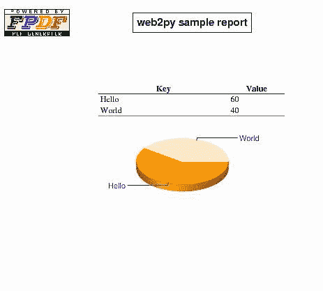
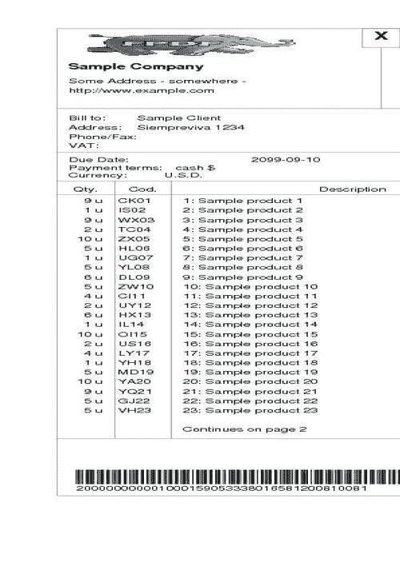

# 第十章：报告菜谱

在本章中，我们将介绍以下菜谱：

+   创建 PDF 报告

+   创建 PDF 列表

+   创建 PDF 标签、徽章和发票

# 简介

在 web2py 中生成 PDF 报告有许多方法。一种方法是用`ReportLab`，这是 Python 中用于生成 PDF 的顶尖库。另一种方法是将**LaTeX**生成，并将其转换为 PDF。这可能是生成 PDF 最强大的方法，web2py 通过在其`contrib`文件夹中打包`markmin2latex`和`markmin2pdf`来帮助你。然而，这两种方法都需要掌握第三方库和语法。本章中描述了第三种方法：*使用 web2py 打包的 pyfpdf 库直接将 HTML 转换为 PDF*。

# 创建 PDF 报告

谁不需要生成 PDF 报告、发票、账单？web2py 自带了`pyfpdf`库，它可以提供 HTML 视图到 PDF 的转换，并可用于此目的。`pyfpdf`仍处于初级阶段，缺乏一些高级功能，例如在`reportlab`中可以找到的功能，但对于普通用户来说已经足够了。

你可以通过使用 web2py HTML 辅助工具，混合页眉、徽标、图表、文本和表格，制作一份看起来专业的商业报告。以下是一个例子：



这种方法的主要优势是，相同的报告可以以 HTML 视图的形式呈现，或者可以以 PDF 格式下载，只需付出最小的努力。

## 如何做到这一点...

这里，我们提供了一个生成示例报告的控制器示例，然后讨论其语法和 API：

```py
import os

def report():
		response.title = "web2py sample report"
	# include a chart from google chart
	url = "http://chart.apis.google.com/chart?cht=p3&chd=t:60,
		40&chs=500x200&chl=Hello|World&.png"
	chart = IMG(_src=url, _width="250",_height="100")

	# create a small table with some data:
	rows = [THEAD(TR(TH("Key",_width="70%"),
		TH("Value",_width="30%"))),
		TBODY(TR(TD("Hello"),TD("60")),
		TR(TD("World"),TD("40")))]

	table = TABLE(*rows, _border="0", _align="center", _width="50%")

if request.extension=="pdf":
	from gluon.contrib.pyfpdf import FPDF, HTMLMixin

# create a custom class with the required functionalities
class MyFPDF(FPDF, HTMLMixin):
	def header(self):
		"hook to draw custom page header (logo and title)"

		# remember to copy logo_pb.png to static/images (and remove
		#alpha channel)
		logo=os.path.join(request.folder,"static","images",
						"logo_pb.png")
		self.image(logo,10,8,33)
		self.set_font('Arial','B',15)
		self.cell(65) # padding
		self.cell(60,10,response.title,1,0,'C')
		self.ln(20)
	def footer(self):
		"hook to draw custom page footer (printing page numbers)"
		self.set_y(-15)
		self.set_font('Arial','I',8)
		txt = 'Page %s of %s' % (self.page_no(), self.alias_nb_pages())
		self.cell(0,10,txt,0,0,'C')
		pdf=MyFPDF()

		# create a page and serialize/render HTML objects
		pdf.add_page()
		pdf.write_html(table.xml())
		pdf.write_html(CENTER(chart).xml())
		# prepare PDF to download:
		response.headers['Content-Type']='application/pdf'
		return pdf.output(dest='S')

# else normal html view:
return dict(chart=chart, table=table)

```

## 它是如何工作的...

关键在于创建和序列化`pdf`对象的行：

```py
if request.extension=='pdf':
	...
	pdf=MyFPDF()
	...
	return pdf.output(dest='S')

```

`pdf`对象可以解析原始 HTML 并将其转换为 PDF。在这里，`MyFPDF`通过定义自己的页眉和页脚扩展了`FPDF`。

以下行在将使用辅助工具创建的 HTML 组件序列化为 PDF 中起着关键作用：

```py
pdf.write_html(table.xml())
pdf.write_html(CENTER(chart).xml())

```

内部，`PyFPDF`使用 Python `HTMLParser`的基本 HTML 渲染器。它读取 HTML 代码，并将其转换为 PDF 指令。尽管它只支持基本的渲染，但它可以很容易地扩展或与其他 PDF 原语混合。

此外，只要使用简单且受支持的标签，你还可以使用 web2py 最新版本中包含的`default.pdf`视图渲染基本的 HTML。

查看以下 URLs 中的`PyFPDF`维基文档以获取更多信息及示例：

+   [`code.google.com/p/pyfpdf/wiki/Web2Py`](http://code.google.com/p/pyfpdf/wiki/Web2Py)

+   [`code.google.com/p/pyfpdf/wiki/WriteHTML`](http://code.google.com/p/pyfpdf/wiki/WriteHTML)

# 创建 PDF 列表

作为前一个菜谱的后续，我们可以以非常 Pythonic 的方式创建漂亮的表格，这些表格可以自动扩展到多个页面，带有页眉/页脚、列/行高亮等功能：

你可以在[`pyfpdf.googlecode.com/files/listing.pdf`](http://pyfpdf.googlecode.com/files/listing.pdf)中看到一个示例。

## 如何做到这一点...

这里有一个或多或少可以自说的例子：

```py
def listing():
	response.title = "web2py sample listing"

	# define header and footers:
	head = THEAD(TR(TH("Header 1",_width="50%"),
	TH("Header 2",_width="30%"),
	TH("Header 3",_width="20%"),
	_bgcolor="#A0A0A0"))
	foot = TFOOT(TR(TH("Footer 1",_width="50%"),
	TH("Footer 2",_width="30%"),
	TH("Footer 3",_width="20%"),
	_bgcolor="#E0E0E0"))

	# create several rows:
	rows = []
	for i in range(1000):
		col = i % 2 and "#F0F0F0" or "#FFFFFF"
		rows.append(TR(TD("Row %s" %i),
		TD("something", _align="center"),
		TD("%s" % i, _align="right"),
		_bgcolor=col))

	# make the table object
	body = TBODY(*rows)
	table = TABLE(*[head,foot, body],
	_border="1", _align="center", _width="100%")

	if request.extension=="pdf":
		from gluon.contrib.pyfpdf import FPDF, HTMLMixin
		# define our FPDF class (move to modules if it is reused

		class MyFPDF(FPDF, HTMLMixin):
			def header(self):
				self.set_font('Arial','B',15)
				self.cell(0,10, response.title ,1,0,'C')
				self.ln(20)
			def footer(self):
				self.set_y(-15)
				self.set_font('Arial','I',8)
				txt = 'Page %s of %s' % (self.page_no(), self.alias_nb_pages())
				self.cell(0,10,txt,0,0,'C')

	pdf=MyFPDF()

	# first page:
	pdf.add_page()
	pdf.write_html(table.xml())
	response.headers['Content-Type']='application/pdf'
	return pdf.output(dest='S')
# else return normal html view:
return dict(table=table)

```

# 创建 PDF 标签、徽章和发票

此配方展示了如何使用 `pyfpdf` 库制作简单的会议徽章和发票，但可以轻松地适应打印标签（`Avery` 或其他格式），以及其他文档。

## 如何做...

1.  首先，您必须定义两个表格来保存模板和将用于设计 PDF 的元素。

1.  创建一个模型，例如 `models/plugin_fpdf_templates.py`，并将其中的以下代码添加到其中：

    ```py
    def _():
    	PAPER_FORMATS = ["A4","legal","letter"]
    	ELEMENT_TYPES = {'T':'Text', 'L':'Line', 'I':'Image', 'B':'Box',
    		'BC':'BarCode'}
    	FONTS = ['Arial', 'Courier', 'Helvetica', 'Times-Roman',
    		'Symbol','ZapfDingbats']
    	ALIGNS = {'L':'Left', 'R':'Right', 'C':'Center',
    		'J':'Justified'}
    	NE = IS_NOT_EMPTY()

    	db.define_table("pdf_template",
    		Field("pdf_template_id","id"),
    		Field("title"),
    		Field("format", requires=IS_IN_SET(PAPER_FORMATS)),
    		format = '%(title)s')

    	db.define_table("pdf_element",
    		Field("pdf_template_id", db.pdf_template),
    		Field("name", requires=NE),
    		Field("type", length=2, requires=IS_IN_SET(ELEMENT_TYPES)),
    		Field("x1", "double", requires=NE),
    		Field("y1", "double", requires=NE),
    		Field("x2", "double", requires=NE),
    		Field("y2", "double", requires=NE),
    		Field("font", default="Arial", requires=IS_IN_SET(FONTS)),
    		Field("size", "double", default="10", requires=NE),
    		Field("bold", "boolean"),
    		Field("italic", "boolean"),
    		Field("underline", "boolean"),
    		Field("foreground", "integer", default=0x000000, comment="Color text"),
    		Field("background", "integer", default=0xFFFFFF, comment="Fill
    			color"),
    		Field("align", "string", length=1, default="L",
    			requires=IS_IN_SET(ALIGNS)),
    		Field("text", "text", comment="Default text"),
    		Field("priority", "integer", default=0, comment="Z-Order"))
    _()

    ```

1.  然后，在控制器 `badges.py` 中添加一些函数来创建初始的基础标签/徽章。根据您的标签格式轻松复制徽章，然后，最终基于一些用户数据（即 `speakers`）生成 PDF：

    ```py
    # coding: utf8
    import os, os.path
    from gluon.contrib.pyfpdf import Template
    def create_label():
    	pdf_template_id = db.pdf_template.insert(title="sample badge",
    												format="A4")

    	# configure optional background image and insert his element
    	path_to_image = os.path.join(request.folder, 'static','42.png')
    	if path_to_image:
    		db.pdf_element.insert(pdf_template_id=pdf_template_id,
    			name='background', type='I', x1=0.0, y1=0.0, x2=85.23,
    			y2=54.75, font='Arial', size=10.0, bold=False, italic=False,
    			underline=False, foreground=0, background=16777215, align='L',
    			text=path_to_image, priority=-1)

    		# insert name, company_name, number and attendee type elements:
    		db.pdf_element.insert(pdf_template_id=pdf_template_id,
    			name='name', type='T', x1=4.0, y1=25.0, x2=62.0, y2=30.0,
    			font='Arial', size=12.0, bold=True,
    			italic=False,
    			underline=False, foreground=0, background=16777215, align='L',
    			text='', priority=0)
    		db.pdf_element.insert(pdf_template_id=pdf_template_id,
    			name='company_name', type='T', x1=4.0, y1=30.0, x2=50.0,
    			y2=34.0, font='Arial', size=10.0, bold=False, italic=False,
    			underline=False, foreground=0, background=16777215, align='L',
    			text='', priority=0)
    		db.pdf_element.insert(pdf_template_id=pdf_template_id,
    			name='no', type='T', x1=4.0, y1=34.0, x2=80.0, y2=38.0,
    			font='Arial', size=10.0, bold=False, italic=False,
    			underline=False, foreground=0, background=16777215, align='R',
    			text='', priority=0)
    		db.pdf_element.insert(pdf_template_id=pdf_template_id,
    			name='attendee_type', type='T', x1=4.0, y1=38.0, x2=50.0,
    			y2=42.0, font='Arial', size=10.0, bold=False, italic=False,
    			underline=False, foreground=0, background=16777215, align='L',
    			text='', priority=0)
    		return dict(pdf_template_id=pdf_template_id)

    def copy_labels():
    	# read base label/badge elements from db
    	base_pdf_template_id = 1
    	elements = db(db.pdf_element.pdf_template_id==\
    	base_pdf_template_id).select(orderby=db.pdf_element.priority)

    	# set up initial offset and width and height:
    	x0, y0 = 10, 10
    	dx, dy = 85.5, 55

    	# create new template to hold several labels/badges:
    	rows, cols = 5, 2
    	pdf_template_id = db.pdf_template.insert(title="sample badge\
    	%s rows %s cols" % (rows, cols), format="A4")

    	# copy the base elements:
    	k = 0
    		for i in range(rows):
    			for j in range(cols):
    				k += 1
    				for e in elements:
    					e = dict(element)
    					e['name'] = "%s%02d" % (e['name'], k)
    					e['pdf_template_id'] = pdf_template_id
    					e['x1'] = e['x1'] + x0 + dx*j
    					e['x2'] = e['x2'] + x0 + dx*j
    					e['y1'] = e['y1'] + y0 + dy*i
    					e['y2'] = e['y2'] + y0 + dy*i
    					del e['update_record']
    					del e['delete_record']
    					del e['id']
    					db.pdf_element.insert(**e)
    	return {'new_pdf_template_id': pdf_template_id}

    def speakers_badges():
    	# set template to use from the db:
    	pdf_template_id = 2

    	# query registered users and generate speaker labels
    	speakers = db(db.auth_user.id>0).select(orderby=
    	db.auth_user.last_name|db.auth_user.first_name)
    	company_name = "web2conf"
    	attendee_type = "Speaker"

    	# read elements from db
    	elements = db(db.pdf_element.pdf_template_id==
    	pdf_template_id).select(orderby=db.pdf_element.priority)
    	f = Template(format="A4",
    				elements = elements,
    				title="Speaker Badges", author="web2conf",
    				subject="", keywords="")

    	# calculate pages:
    	label_count = len(speakers)
    	max_labels_per_page = 5*2
    	pages = label_count / (max_labels_per_page - 1)
    	if label_count % (max_labels_per_page - 1): pages = pages + 1

    	# fill placeholders for each page
    	for page in range(1, pages+1):
    		f.add_page()
    		k = 0
    		li = 0
    		for speaker in speakers:
    			k = k + 1
    			if k > page * (max_labels_per_page ):
    				break
    			if k > (page - 1) * (max_labels_per_page ):
    				li += 1

    		#f['item_quantity%02d' % li] = it['qty']
    		f['name%02d' % li] = unicode("%s %s" % (speaker.first_name,
    												speaker.last_name), "utf8")
    		f['company_name%02d' % li] = unicode("%s %s" % \
    			(company_name, ""), "utf8")
    		f['attendee_type%02d' % li] = attendee_type

    		##f['no%02d' % li] = li
    	response.headers['Content-Type']='application/pdf'
    	return f.render('badge.pdf', dest='S')

    ```

    要检查此示例：

    +   执行 `create_label`，并记录创建的 `pdf_template_id` 的值

    +   将 `copy_labels` 设置为 `base_pdf_template_id` 中的值，然后执行它

    +   将 `speaker_badges` 设置为 `pdf_template_id`，然后执行它

        该函数应生成包含您应用程序注册用户标签（徽章）的 PDF。

        样本徽章具有以下背景图像：

    

1.  然后，它在其上写入文本，填充演讲者姓名、地址等。您可以使用类似的方法制作出席证书和类似的多份报告。

    对于更复杂的示例，请参阅以下发票控制器（您需要导入发票设计；查看 `pyfpdf` 应用程序示例以获取完整示例）：

    ```py
    # coding: utf8

    from gluon.contrib.pyfpdf import Template
    import os.path
    import random
    from decimal import Decimal

    def invoice():
    	# set sample invoice pdf_template_id:
    	invoice_template_id = 3

    	# generate sample invoice (according to Argentina's regulations)

    	# read elements from db
    	elements = db(db.pdf_element.pdf_template_id==
    		invoice_template_id).select(orderby=db.pdf_element.priority)

    	f = Template(format="A4",
    		elements = elements,
    		title="Sample Invoice", author="Sample Company",
    		subject="Sample Customer", keywords="Electronic TAX Invoice")

    	# create some random invoice line items and detail data
    	detail = "Lorem ipsum dolor sit amet, consectetur. " * 5
    	items = []
    	for i in range(1, 30):
    		ds = "Sample product %s" % i
    		qty = random.randint(1,10)
    		price = round(random.random()*100,3)
    		code = "%s%s%02d" % (chr(random.randint(65,90)),
    			chr(random.randint(65,90)),i)
    		items.append(dict(code=code, unit='u',
    			qty=qty, price=price,
    			amount=qty*price,
    			ds="%s: %s" % (i,ds)))

    	# divide and count lines
    	lines = 0
    	li_items = []
    	for it in items:
    		qty = it['qty']
    		code = it['code']
    		unit = it['unit']
    		for ds in f.split_multicell(it['ds'], 'item_description01'):
    			# add item description line (without price nor amount)
    			li_items.append(dict(code=code, ds=ds, qty=qty, unit=unit,
    				price=None, amount=None))
    			# clean qty and code (show only at first)
    			unit = qty = code = None
    			# set last item line price and amount
    			li_items[-1].update(amount = it['amount'],
    				price = it['price'])

    	# split detail into each line description
    	obs="\n<U>Detail:</U>\n\n" + detail
    	for ds in f.split_multicell(obs, 'item_description01'):
    		li_items.append(dict(code=code, ds=ds, qty=qty, unit=unit,
    			price=None, amount=None))

    	# calculate pages:
    	lines = len(li_items)
    	max_lines_per_page = 24
    	pages = lines / (max_lines_per_page - 1)
    	if lines % (max_lines_per_page - 1): pages = pages + 1

    	# fill placeholders for each page
    	for page in range(1, pages+1):
    		f.add_page()
    		f['page'] = 'Page %s of %s' % (page, pages)
    		if pages>1 and page<pages:
    			s = 'Continues on page %s' % (page+1)
    		else:
    			s = ''
    			f['item_description%02d' % (max_lines_per_page+1)] = s
    			f["company_name"] = "Sample Company"
    			f["company_logo"] = os.path.join(request.folder,"static",
    				"images","logo_pb.png")
    			f["company_header1"] = "Some Address - somewhere -"
    			f["company_header2"] = "http://www.example.com"
    			f["company_footer1"] = "Tax Code ..."
    			f["company_footer2"] = "Tax/VAT ID ..."
    			f['number'] = '0001-00001234'
    			f['issue_date'] = '2010-09-10'
    			f['due_date'] = '2099-09-10'
    			f['customer_name'] = "Sample Client"
    			f['customer_address'] = "Siempreviva 1234"

    			# print line item...
    			li = 0
    			k = 0
    			total = Decimal("0.00")
    			for it in li_items:
    				k = k + 1

    			if k > page * (max_lines_per_page - 1):
    				break

    			if it['amount']:
    				total += Decimal("%.6f" % it['amount'])

    			if k > (page - 1) * (max_lines_per_page - 1):
    				li += 1

    			if it['qty'] is not None:
    				f['item_quantity%02d' % li] = it['qty']

    			if it['code'] is not None:
    				f['item_code%02d' % li] = it['code']

    			if it['unit'] is not None:
    				f['item_unit%02d' % li] = it['unit']
    				f['item_description%02d' % li] = it['ds']

    			if it['price'] is not None:
    				f['item_price%02d' % li] = "%0.3f" % it['price']

    			if it['amount'] is not None:
    				f['item_amount%02d' % li] = "%0.2f" % it['amount']

    				# last page? print totals:
    				if pages == page:
    					f['net'] = "%0.2f" % (total/Decimal("1.21"))
    					f['vat'] = "%0.2f" % (total*(1-1/Decimal("1.21")))
    					f['total_label'] = 'Total:'
    				else:
    				  f['total_label'] = 'SubTotal:'
    					f['total'] = "%0.2f" % total
    response.headers['Content-Type']='application/pdf'
    return f.render('invoice.pdf', dest='S')

    ```

    这里是输出示例：



## 它是如何工作的...

PDF 模板是预定义文档（如发票、税务表格等），其中每个元素（文本、线条、条形码等）都有一个固定的位置 `(x1, y1, x2` 和 `y2)`，样式（字体、大小等），以及默认文本。

这些元素可以作为占位符使用，因此程序可以更改默认文本以填充文档。

此外，元素也可以定义在 CSV 文件或数据库中，因此用户可以轻松地根据其打印需求调整表格。**模板**用作 `dict`，使用以下属性设置其项的值：

+   `name:` 这是占位符标识

+   `type: T` 表示文本，`L` 表示线条，`I` 表示图像，`B` 表示框，`BC` 表示条形码

+   `x1, y1, x2` 和 `y2:` 这些是左上角和右下角的坐标（以毫米为单位）。

+   `font:` 这可以取以下值——Arial, `Courier, Helvetica, Times, Symbol, ZapfDingbats`

+   `size:` 这是文本大小（以点为单位），即 10

+   `bold, italic` 和 `underline:` 这是文本样式（非空以启用）

+   `foreground, background:` 这些是文本和填充颜色，即 `0xFFFFFF`

+   `align:` 这些是文本对齐方式，其中 `L` 表示左对齐，`R` 表示右对齐，`C` 表示居中对齐

+   `text:` 这是可以在运行时替换的默认字符串

+   `priority:` 这指定了 `Z-Order`

元素可以手动定义（只需传递一个`dict`），或者可以从 CSV 表格（使用`parse_csv`）中读取，或者存储在数据库中，如本例中所示，使用`pdf_element`表。

## 还有更多...

这是一个基本的示例，用于展示使用填空 PDF 模板生成徽章的过程，但它也可以用来制作任何定制的重复设计。

此外，还有一个可视化设计器，可以拖放元素，图形调整它们的属性，并轻松测试它们。

有关更多信息，请参阅以下 URL 上的 PyFPDF wiki 文档：

+   [`code.google.com/p/pyfpdf/wiki/Web2Py`](http://code.google.com/p/pyfpdf/wiki/Web2Py)

+   [`code.google.com/p/pyfpdf/wiki/Templates`](http://code.google.com/p/pyfpdf/wiki/Templates)
