# 1. Django 简介

概述

本章向您介绍 Django 及其在 Web 开发中的作用。您将从学习如何使用`manage.py`命令（用于协调 Django 操作）开始。您将使用此命令启动 Django 开发服务器并测试您编写的代码是否按预期工作。您还将学习如何使用**PyCharm**，这是一种流行的 Python 集成开发环境（IDE），您将在本书的整个过程中使用它。您将使用它编写返回给 Web 浏览器的**响应**的代码。最后，您将学习如何使用 PyCharm 的调试器来调试代码中的问题。到本章结束时，您将具备使用 Django 创建项目的必要技能。

# 简介

*"为完美主义者设计的具有截止日期的 Web 框架。"* 这是一条恰如其分的标语，描述了 Django，一个已经存在超过 10 年的框架。它经过实战检验，被广泛使用，每天都有越来越多的人使用它。所有这些可能让你认为 Django 已经过时，不再相关。相反，它的长期存在证明了它的应用程序编程接口（API）是可靠和一致的，甚至那些在 2007 年学习 Django v1.0 的人现在也能为 Django 3 编写相同的代码。Django 仍在积极开发中，每月都会发布错误修复和安全补丁。

与它所写的语言 Python 一样，Django 易于学习，但功能强大且足够灵活，可以满足您的需求增长。它是一个“内置电池”的框架，这意味着您不需要寻找和安装许多其他库或组件来使您的应用程序运行。其他框架，如**Flask**或**Pylons**，需要手动安装第三方框架来进行数据库连接或模板渲染。相反，Django 内置了对数据库查询、URL 映射和模板渲染的支持（我们很快会详细介绍这些功能）。但仅仅因为 Django 易于使用，并不意味着它有限制。Django 被许多大型网站使用，包括 Disqus ([`disqus.com/`](https://disqus.com/))、Instagram ([`www.instagram.com/`](https://www.instagram.com/))、Mozilla ([`www.mozilla.org/`](https://www.mozilla.org/))、Pinterest ([`www.pinterest.com/`](https://www.pinterest.com/))、OpenStack ([`www.openstack.org/`](https://www.openstack.org/))和 National Geographic ([`www.nationalgeographic.com/`](http://www.nationalgeographic.com/))。

Django 在 Web 中处于什么位置？当谈到 Web 框架时，你可能会想到前端 JavaScript 框架，如 ReactJS、Angular 或 Vue。这些框架用于增强或添加交互性到已经生成的网页。Django 位于这些工具的下一层，负责路由 URL、从数据库获取数据、渲染模板以及处理用户表单输入。然而，这并不意味着你必须选择其中一个；JavaScript 框架可以用来增强 Django 的输出，或者与 Django 生成的 REST API 交互。

在这本书中，我们将使用专业 Django 开发者每天使用的方法来构建一个 Django 项目。该应用程序被称为**Bookr**，允许浏览和添加书籍及书评。本书分为四个部分。在第一部分，我们将从搭建 Django 应用的基础开始，快速构建一些页面，并使用 Django 开发服务器来提供服务。你将能够通过 Django 管理站点向数据库添加数据。

下一部分将专注于增强 Bookr。你将为网站添加样式和图片来提供静态文件。通过使用 Django 的`form`库，你将添加交互性，并通过使用文件上传，你将能够上传书籍封面和其他文件。然后，你将实现用户登录，并学习如何在会话中存储当前用户的信息。

在第三部分，你将在现有知识的基础上进一步提升。你将定制 Django 管理站点，然后学习高级模板技术。接下来，你将学习如何构建**REST API**并生成非 HTML 数据（如 CSV 和 PDF），并通过学习测试 Django 来结束本部分。

许多第三方库可用于增强 Django 功能，使开发更简单，从而节省时间。在最后一部分，你将了解一些有用的库以及如何将它们集成到你的应用程序中。应用这些知识，你将集成一个 JavaScript 库来与上一节中构建的 REST 框架通信。最后，你将学习如何将你的 Django 应用程序部署到虚拟服务器。

到本书结束时，你将拥有足够的设计和从头到尾构建自己的 Django 项目的经验。

# 搭建 Django 项目和应用程序

在深入探讨 Django 范式和 HTTP 请求背后的理论之前，我们将向你展示如何轻松地将 Django 项目搭建起来。在完成本部分和练习之后，你将已经创建了一个 Django 项目，用浏览器向其发送请求，并看到了响应。

Django 项目是一个包含您项目所有数据的目录：代码、设置、模板和资产。它是通过在命令行上运行带有 `startproject` 参数的 `django-admin.py` 命令并输入项目名称来创建和构建的。例如，要创建一个名为 `myproject` 的 Django 项目，运行的命令如下：

```py
django-admin.py startproject myproject
```

这将创建 `myproject` 目录，Django 会填充运行项目所需的必要文件。在 `myproject` 目录内有两个文件（如图 *1.1* 所示）：

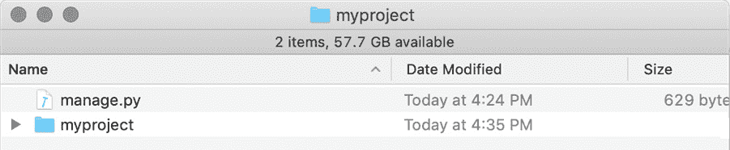

图 1.1：myproject 的项目目录

`manage.py` 是一个 Python 脚本，在命令行中执行以与您的项目交互。我们将使用它来启动 `django-admin.py`，命令通过命令行传入。与 `django-admin.py` 不同，此脚本未映射到您的系统路径，因此我们必须使用 Python 来执行它。我们需要使用命令行来完成此操作。例如，在项目目录内，运行以下命令：

```py
python3 manage.py runserver
```

这将 `runserver` 命令传递给 `manage.py` 脚本，从而启动 Django 开发服务器。我们将在 *Django 项目* 部分检查 `manage.py` 接受的更多命令。以这种方式与 `manage.py` 交互时，我们称这些管理命令。例如，我们可能会说我们在 *"执行 runserver 管理命令。"*

`startproject` 命令还创建了一个与项目同名的目录，在本例中为 `myproject` (*图 1.1*)。这是一个包含设置和一些其他配置文件（您的项目运行所需的）的 Python 包。我们将在 *Django 项目* 部分检查其内容。

在启动 Django 项目后，接下来要做的事情是启动一个 Django 应用。我们应该尝试将我们的 Django 项目分割成不同的应用程序，按功能分组。例如，在 Bookr 中，我们将有一个 `reviews` 应用。这将包含所有与书评工作相关的代码、HTML、资产和数据库类。如果我们决定将 Bookr 扩展为销售书籍，我们可能会添加一个 `store` 应用程序，包含书店的文件。应用程序通过 `startapp` 管理命令创建，传入应用程序名称。例如：

```py
python3 manage.py startapp myapp
```

这将在项目目录内创建应用程序目录 (`myapp`)。Django 会自动填充此目录，以便在您开始开发时填充应用程序所需的文件。我们将在 *Django 应用* 部分检查这些文件并讨论什么使一个应用程序变得良好。

现在我们已经介绍了构建 Django 项目和应用程序的基本命令，让我们通过启动本书的第一个练习中的 Bookr 项目来将它们付诸实践。

## 练习 1.01：创建项目和应用程序，并启动开发服务器

在本书中，我们将构建一个名为 Bookr 的书评网站。它将允许你添加出版商、贡献者、书籍和评论的字段。出版商将出版一本或多本书，每本书将有一个或多个贡献者（作者、编辑、合著者等等）。只有管理员用户才能修改这些字段。一旦用户在该网站上注册了账户，他们就可以开始为书籍添加评论。

在这个练习中，你将构建 `bookr` Django 项目，通过运行开发服务器来测试 Django 是否工作，然后创建 `reviews` Django 应用。

你应该已经设置了一个包含 Django 的虚拟环境。要了解如何做，你可以参考 *前言*。一旦准备好，让我们开始创建 Bookr 项目：

1.  打开一个终端并运行以下命令来创建 `bookr` 项目目录和默认子目录：

    ```py
    django-admin startproject bookr
    ```

    此命令不会生成任何输出，但将在你运行命令的目录中创建一个名为 `bookr` 的文件夹。你可以查看这个目录，看看我们之前在 `myproject` 示例中描述的项目：`bookr` 包目录和 `manage.py` 文件。

1.  我们现在可以通过运行 Django 开发服务器来测试项目和 Django 是否设置正确。启动服务器是通过 `manage.py` 脚本完成的。

    在你的终端（或命令提示符）中，切换到 `bookr` 项目目录（使用 `cd` 命令），然后运行 `manage.py runserver` 命令。

    ```py
    python3 manage.py runserver
    Watching for file changes with StatReloader
    Performing system checks...
    System check identified no issues (0 silenced).
    You have 17 unapplied migration(s). Your project may not work properly until you apply the migrations for app(s): admin, auth, contenttypes, sessions.
    Run 'python manage.py migrate' to apply them.
    September 14, 2019 - 09:40:45
    Django version 3.0a1, using settings 'bookr.settings'
    Starting development server at http://127.0.0.1:8000/
    Quit the server with CONTROL-C.
    ```

    你可能会收到一些关于未应用迁移的警告，但就目前来说这没关系。

1.  打开一个网页浏览器并访问 `http://127.0.0.1:8000/`，这将显示 Django 欢迎界面（*图 1.2*）。如果你看到这个界面，你就知道你的 Django 项目已成功创建，目前一切运行正常：

    图 1.2：Django 欢迎界面

1.  返回你的终端并使用 *Ctrl* + *C* 键组合停止运行的开发服务器。

1.  我们现在将为 `bookr` 项目创建 `reviews` 应用。在你的终端中，确保你处于 `bookr` 项目目录中，然后执行以下命令来创建 `reviews` 应用：

    ```py
    python3 manage.py startapp reviews
    ```

    注意

    创建 `reviews` 应用后，你的 `bookr` 项目目录中的文件将如下所示：[`packt.live/3nZGy5D`](http://packt.live/3nZGy5D)。

    如果命令成功执行，则没有输出，但已创建一个 `reviews` 应用目录。你可以查看这个目录，看看创建的文件：`migrations` 目录、`admin.py`、`models.py` 等等。我们将在 *Django 应用* 部分详细检查这些文件。

在这个练习中，我们创建了 `bookr` 项目，通过启动 Django 开发服务器来测试项目是否工作，然后为该项目创建了 `reviews` 应用。现在我们已经对 Django 项目有了实际操作的经验，我们将回到 Django 设计和 HTTP 请求与响应背后的理论。

# 模型视图模板

应用程序设计中的一种常见设计模式是 **模型视图控制器**（**MVC**），其中应用程序的模型（其数据）在一个或多个视图中显示，控制器协调模型和视图之间的交互。Django 遵循一个类似但略有不同的范式，称为 **模型视图模板**（**MVT**）。

与 MVC 类似，MVT 也使用模型来存储数据。然而，在 MVT 中，视图将查询模型，然后使用模板渲染它。通常，在 MVC 语言中，所有三个组件都需要用相同的语言开发。在 MVT 中，模板可以是不同的语言。在 Django 的情况下，模型和视图是用 Python 编写的，而模板是用 HTML 编写的。这意味着 Python 开发者可以处理模型和视图，而专门的 HTML 开发者可以处理 HTML。我们首先将更详细地解释模型、视图和模板，然后看看它们在哪些示例场景中被使用。

## 模型

Django 模型定义了应用程序的数据并提供了一个通过 **对象关系映射器**（**ORM**）访问 SQL 数据库的抽象层。ORM 允许你使用 Python 代码定义你的数据模式（类、字段及其关系），而不需要了解底层数据库。这意味着你可以在 Python 代码中定义你的数据库层，而 Django 将为你生成 SQL 查询。ORM 将在 *第二章*，*模型和迁移* 中详细讨论。

注意

(`SELECT`) 添加或更改数据（分别使用 `INSERT` 和 `UPDATE`），以及删除数据（使用 `DELETE`）。有许多 SQL 数据库服务器可供选择，例如 SQLite、PostgreSQL、MySQL 或 Microsoft SQL Server。SQL 语法在数据库之间有很多相似之处，但可能会有一些方言上的差异。Django 的 ORM 会为你处理这些差异：当我们开始编码时，我们将使用 SQLite 数据库在磁盘上存储数据，但当我们部署到服务器时，我们将切换到 PostgreSQL，而无需对代码进行任何更改。

通常，当查询数据库时，结果会以原始 Python 对象的形式返回（例如，字符串列表、整数、浮点数或字节）。当使用 ORM 时，结果会自动转换为已定义的模型类实例。使用 ORM 意味着你自动受到一种称为 SQL 注入攻击的漏洞的保护。

如果你更熟悉数据库和 SQL，你也可以选择编写自己的查询。

## 视图

Django 视图是定义应用程序大部分逻辑的地方。当用户访问你的网站时，他们的网络浏览器会发送一个请求以从你的网站检索数据（在下一节中，我们将更详细地介绍 HTTP 请求是什么以及它包含的信息）。视图是你编写的一个函数，它将以 Python 对象的形式接收这个请求（具体来说，是一个 Django `HttpRequest`对象）。你的视图必须决定如何响应请求以及向用户发送什么信息。你的视图必须返回一个`HttpResponse`对象，该对象封装了提供给客户端的所有信息：内容、HTTP 状态和其他头信息。

视图还可以可选地从请求的 URL 中接收信息，例如，一个 ID 号。视图的一个常见设计模式是通过 Django ORM 使用传递给视图的 ID 查询数据库。然后视图可以通过提供从数据库检索到的模型的数据来渲染一个模板（稍后我们将详细介绍这一点）。渲染的模板成为`HttpResponse`的内容，并从视图函数返回。Django 负责将数据回传到浏览器。

## 模板

模板中的`<`和`>`符号（以及其他符号）是 HTML 中的特殊字符。如果你尝试在变量中使用它们，那么 Django 会自动编码它们，以便在浏览器中正确渲染。

### MVT 实践

我们现在将查看一些示例，以说明 MVT 在实际中的应用。在示例中，我们有一个`Book`模型，它存储有关不同书籍的信息，以及一个`Review`模型，它存储有关书籍不同评论的信息。

在第一个例子中，我们希望能够编辑书籍或评论的信息。以编辑书籍详情的第一个场景为例。我们会有一个视图从数据库中获取`Book`数据并提供`Book`模型。然后，我们会将包含`Book`对象（和其他数据）的上下文信息传递给一个模板，该模板将显示一个表单以捕获新信息。第二个场景（编辑评论）类似：从数据库中获取`Review`模型，然后将`Review`对象和其他数据传递给模板以显示编辑表单。这些场景可能非常相似，以至于我们可以为两者重用相同的模板。请参阅*图 1.3*。

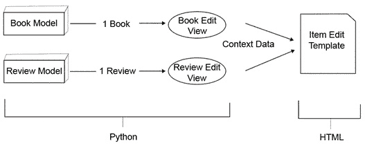

图 1.3：编辑单个书籍或评论

你可以在这里看到我们使用了两种模型、两种视图和一种模板。每个视图都会获取其关联模型的一个实例，但它们都可以使用相同的模板，这是一个通用的 HTML 页面，用于显示表单。视图可以为每种模型类型提供额外的上下文数据，以略微改变模板的显示。图中还展示了用 Python 和 HTML 编写的代码部分。

在第二个例子中，我们希望能够向用户显示存储在应用程序中的书籍或评论列表。此外，我们希望允许用户搜索书籍并获取所有符合他们标准的列表。我们将使用与上一个例子相同的两个模型（`Book` 和 `Review`），但我们将创建新的视图和模板。由于有三个场景，我们这次将使用三个视图：第一个获取所有书籍，第二个获取所有评论，最后一个根据某些搜索标准搜索书籍。再次强调，如果我们编写了一个好的模板，我们可能再次只使用一个 HTML 模板。参见 *图 1.4*：

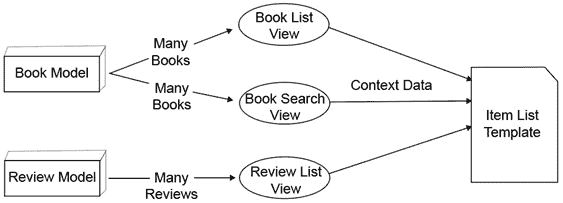

图 1.4：查看多本书或评论

`Book` 和 `Review` 模型与上一个例子保持不变。这三个视图将获取许多（零个或多个）书籍或评论。然后，每个视图都可以使用相同的模板，这是一个通用的 HTML 文件，它遍历它给出的对象列表并渲染它们。再次强调，视图可以在上下文中发送额外的数据以改变模板的行为，但模板的大部分内容将尽可能通用。

在 Django 中，不一定需要使用模型来渲染 HTML 模板。视图可以自己生成上下文数据，并使用它渲染一个模板，而不需要任何模型数据。参见 *图 1.5*，一个视图直接将数据发送到模板：


图 1.5：无需模型从视图到模板

在这个例子中，有一个欢迎视图用于欢迎用户访问网站。它不需要从数据库获取任何信息，因此它可以自己生成上下文数据。上下文数据取决于你想要显示的信息类型；例如，如果你想要通过用户名问候他们，你可以传递用户信息。视图也可以在没有上下文数据的情况下渲染模板。如果你有一个包含静态信息的 HTML 文件并希望提供服务，这可能很有用。

## HTTP 简介

现在你已经了解了 Django 中的 MVT（模型-视图-模板），我们可以看看 Django 如何处理 HTTP 请求并生成 HTTP 响应。但首先，我们需要更详细地解释 HTTP 请求和响应是什么，以及它们包含哪些信息。

假设有人想访问你的网页。他们输入其 URL 或从他们已经所在的页面点击链接到你的网站。他们的网络浏览器创建一个 HTTP 请求，并将其发送到托管你网站的服务器。一旦网络服务器从你的浏览器接收到 HTTP 请求，它就可以解释它，然后发送回一个响应。服务器发送的响应可能很简单，例如只是从磁盘读取 HTML 或图像文件并发送它。或者，响应可能更复杂，可能使用服务器端软件（如 Django）在发送之前动态生成内容：


图 1.6：HTTP 请求和 HTTP 响应

请求由四个主要部分组成：方法、路径、头和主体。某些类型的请求没有主体。如果你只是访问一个网页，你的浏览器不会发送主体，而如果你正在提交一个表单（例如，通过登录一个网站或执行搜索），那么你的请求将包含一个包含你提交的数据的主体。现在我们将查看两个示例请求来阐述这一点。

第一个请求将是一个示例页面，URL 为 `https://www.example.com/page`。当你的浏览器访问该页面时，幕后它会发送以下内容：

```py
GET /page HTTP/1.1
Host: www.example.com
User-Agent: Mozilla/5.0 (X11; Ubuntu; Linux x86_64; rv:15.0) Firefox/15.0.1
Cookie: sessid=abc123def456
```

第一行包含方法（`GET`）和路径（`/page`）。它还包含 HTTP 版本，在这种情况下，`1.1`，尽管你不必担心这一点。根据你如何与远程页面交互，可以使用许多不同的 HTTP 方法。一些常见的方法有 `GET`（检索远程页面）、`POST`（向远程页面发送数据）、`PUT`（创建远程页面）和 `DELETE`（删除远程页面）。请注意，动作的描述有些简化——远程服务器可以选择如何响应不同的方法，即使是经验丰富的开发者也可能对实现特定动作的正确方法意见不一。还重要的是要注意，即使服务器支持某种特定方法，你可能也需要正确的权限才能执行该操作——你不能只是在一个你不喜欢网站上使用 `DELETE`，例如。

当编写 web 应用程序时，绝大多数时间你只会处理 `GET` 请求。当你开始接受表单时，你也将不得不使用 `POST` 请求。只有当你处理创建 REST API 等高级功能时，你才需要担心 `PUT`、`DELETE` 和其他方法。

回顾一下示例请求，从第二行开始是请求的头。头包含关于请求的额外元数据。每个头都在自己的行上，头名称和其值由冒号分隔。大多数是可选的（除了 `Host`——稍后会有更多说明）。头名称不区分大小写。为了说明，我们这里只展示了三个常见的头。让我们按顺序查看示例头：

+   `Host`：如前所述，这是唯一必需的头（对于 HTTP 1.1 或更高版本）。它是必需的，以便 web 服务器知道哪个网站或应用程序应该响应该请求，以防单个服务器上托管了多个网站。

+   `User-Agent`：你的浏览器通常会向服务器发送一个字符串，以标识其版本和操作系统。你的服务器应用程序可以使用这个信息为不同的设备提供不同的页面（例如，为智能手机提供特定的移动页面）。

+   `Cookie`：你可能见过当访问网页时显示的消息，告诉你它在浏览器中存储了一个 cookie。这些是网站可以在你的浏览器中存储的小块信息，可以用来识别你或保存你返回网站时的设置。如果你想知道浏览器是如何将这些 cookie 发送回服务器的，它就是通过这个标题。

定义了许多其他标准标题，列出所有这些标题会占用太多空间。它们可以用来向服务器进行身份验证（`Authorization`），告诉服务器你能够接收什么类型的数据（`Accept`），或者甚至声明你希望页面使用的语言（`Accept-Language`，尽管这只有在页面创建者已经将内容提供为请求的特定语言时才会生效）。你甚至可以定义只有你的应用程序知道如何响应的自定义标题。

现在让我们看看一个稍微复杂一点的请求：它向服务器发送一些信息，因此（与之前的示例不同）包含一个正文。在这个示例中，我们通过发送用户名和密码来登录网页。例如，你访问 `https://www.example.com/login`，它显示一个输入用户名和密码的表单。在你点击 `Login` 按钮后，这就是发送到服务器的请求：

```py
POST /login HTTP/1.1
Host: www.example.com
Content-Type: application/x-www-form-urlencoded
Content-Length: 32
username=user1&password=password1
```

如你所见，这看起来与第一个示例类似，但有一些不同。方法现在是 `POST`，并且引入了两个新的标题（你可以假设浏览器仍然会发送之前示例中的其他标题）：

+   `Content-Type`：这告诉服务器正文中包含的数据类型。在 `application/x-www-form-urlencoded` 的情况下，正文是一组键值对。HTTP 客户端可以设置此标题来告诉服务器它是否正在发送其他类型的数据，例如 JSON 或 XML。

+   `Content-Length`：为了服务器知道要读取多少数据，客户端必须告诉它正在发送多少数据。`Content-Length` 标题包含正文的长度。如果你计算这个示例中正文的长度，你会看到它是 32 个字符。

标题始终由一个空行与正文隔开。通过查看示例，你应该能够了解表单数据是如何在正文中编码的：`username` 的值为 `user1`，而 `password` 的值为 `password1`。

这些请求相当简单，但大多数请求并没有变得更加复杂。它们可能有不同的方法和标题，但应该遵循相同的格式。现在你已经看到了请求，我们将查看从服务器返回的 HTTP 响应。

HTTP 响应看起来与请求类似，由三个主要部分组成：状态、标题和正文。然而，与请求一样，根据响应的类型，它可能没有正文。第一个响应示例是一个简单的成功响应：

```py
HTTP/1.1 200 OK
Server: nginx
Content-Length: 18132
Content-Type: text/html
Set-Cookie: sessid=abc123def46
<!DOCTYPE html><html><head>…
```

第一行包含 HTTP 版本、数字状态码（`200`）以及状态码的文本描述（`OK`——请求成功）。在下一个示例之后，我们将展示更多状态。第 2 行到第 5 行包含标题，类似于请求。您之前已经看到一些标题；我们将在这种情况下解释所有这些标题：

+   `Server`：这与`User-Agent`标题类似，但相反：这是服务器告诉客户端它正在运行什么软件。

+   `Content-Length`：客户端使用此值来确定从服务器读取多少数据以获取主体。

+   `Content-Type`：服务器使用此标题向客户端指示发送的数据类型。客户端可以选择如何显示数据——例如，图像必须以与 HTML 不同的方式显示。

+   `Set-Cookie`：我们在第一个请求示例中看到客户端如何向服务器发送 cookie。这是服务器向浏览器设置该 cookie 的相应标题。

在标题之后是一个空行，然后是响应的主体。我们在这里没有展示全部内容，只是展示了接收到的 HTML 的前几个字符，而服务器共发送了 18,132 个字符。

接下来，我们将展示一个示例，说明如果请求的页面未找到时返回的响应：

```py
HTTP/1.1 404 Not Found
Server: nginx
Content-Length: 55
Content-Type: text/html
<!DOCTYPE html><html><body>Page Not Found</body></html>
```

这与上一个示例类似，但状态现在是`404 未找到`。如果您曾经在网上浏览并收到`404`错误，那么这就是您的浏览器收到的响应类型。各种状态码根据它们指示的成功或失败类型分组：

+   **100-199**：服务器发送此范围内的代码以指示协议更改或需要更多数据。您不必担心这些问题。

+   `200 OK`。

+   `301 永久移动`或`302 找到`。在发送重定向响应时，服务器还会包括一个包含应重定向到的 URL 的`Location`标题。

+   `401 未授权`（客户端应登录）和`403 禁止访问`（客户端不允许访问特定资源）。这两个问题可以通过让客户端登录来避免，因此它们被认为是客户端（请求）问题。

+   `500 内部服务器错误`。如果您的代码抛出异常，将会生成此错误。另一个常见的是`504 网关超时`，这可能会发生在您的代码运行时间过长的情况下。其他常见的变体包括`502 网关错误`和`503 服务不可用`，这通常意味着您的应用程序托管存在问题。

这些只是最常见的 HTTP 状态之一。您可以在[`developer.mozilla.org/en-US/docs/Web/HTTP/Status`](https://developer.mozilla.org/en-US/docs/Web/HTTP/Status)找到更完整的列表。然而，与 HTTP 标题一样，状态是任意的，应用程序可以返回自定义状态。这取决于服务器和客户端来决定这些自定义状态和代码的含义。

如果你第一次接触 HTTP 协议，有很多信息需要吸收。幸运的是，Django 做了所有艰苦的工作，并将传入的数据封装到 `HttpRequest` 对象中。大多数时候，你不需要了解大部分传入的信息，但如果你需要，这些信息都是可用的。同样，在发送响应时，Django 将你的数据封装到 `HttpResponse` 对象中。通常你只需设置要返回的内容，但你也可以自由地设置 HTTP 状态码和头信息。我们将在本章后面讨论如何访问和设置 `HttpRequest` 和 `HttpResponse` 中的信息。

## 处理请求

这是一个请求和响应流程的基本时间线，这样你可以了解你将在每个阶段编写的代码做什么。在编写代码方面，你将首先编写的是你的视图。你创建的视图将执行一些操作，例如查询数据库以获取数据。然后视图将把数据传递给另一个函数以渲染模板，最后返回包含你想要发送回客户端的数据的 `HttpResponse` 对象。

接下来，Django 需要知道如何将特定的 URL 映射到你的视图，以便它可以加载请求中作为请求一部分的 URL 的正确视图。你将在 URL 配置 Python 文件中编写这个 URL 映射。

当 Django 接收到一个请求时，它会解析 URL 配置文件，然后找到相应的视图。它调用视图，传入一个代表请求的 `HttpRequest` 对象。你的视图将返回其 `HttpResponse`，然后 Django 再次接管，将数据发送到其宿主 Web 服务器，并返回给请求它的客户端：

![图 1.7：请求和响应流程

![图片 B15509_01_07.jpg]

![图 1.7：请求和响应流程]

请求-响应流程如图 *图 1.7* 所示；标记为 *你的代码* 的部分是你编写的代码——第一个和最后一步由 Django 处理。Django 为你进行 URL 匹配，调用你的视图代码，然后处理将响应传递回客户端。

## Django 项目

我们在前面一个章节中已经介绍了 Django 项目。为了提醒自己运行 `startproject`（对于名为 `myproject` 的项目）时会发生什么：该命令创建一个名为 `myproject` 的目录，其中包含一个名为 `manage.py` 的文件，以及一个名为 `myproject` 的目录（这与项目名称匹配，在 *练习 1.01*，*创建项目和应用程序，并启动开发服务器* 中；这个文件夹被命名为 `bookr`，与项目名称相同）。目录布局如图 *图 1.8* 所示。我们现在将更详细地检查 `manage.py` 文件和 `myproject` 包的内容：

![图 1.8：myproject 项目目录]

![图片 B15509_01_08.jpg]

![图 1.8：myproject 项目目录]

**manage.py**

如其名所示，这是一个用于管理您的 Django 项目的脚本。您与项目交互的大多数命令将通过命令行提供给此脚本。命令作为参数传递给此脚本；例如，如果我们说要运行`manage.py runserver`命令，我们的意思是以这种方式运行`manage.py`脚本：

```py
python3 manage.py runserver
```

`manage.py`提供了许多有用的命令。您将在本书的后续章节中详细了解它们；其中一些更常见的命令在此列出：

+   `runserver`：启动 Django 开发 HTTP 服务器，在您的本地计算机上提供 Django 应用。

+   `startapp`：在您的项目中创建一个新的 Django 应用。我们将在稍后更深入地讨论应用是什么。

+   `shell`：启动一个预加载 Django 设置的 Python 解释器。这对于在不手动加载 Django 设置的情况下与您的应用程序交互非常有用。

+   `dbshell`：启动一个连接到您的数据库的交互式 shell，使用 Django 设置中的默认参数。您可以通过这种方式运行手动 SQL 查询。

+   `makemigrations`：从您的模型定义生成数据库更改指令。您将在*第二章*，*模型和迁移*中了解这意味着什么以及如何使用此命令。

+   `migrate`：应用由`makemigrations`命令生成的迁移。您也将在*第二章*，*模型和迁移*中使用此命令。

+   `test`：运行您编写的自动化测试。您将在*第十四章*，*测试*中使用此命令。

所有命令的完整列表可在[`docs.djangoproject.com/en/3.0/ref/django-admin/`](https://docs.djangoproject.com/en/3.0/ref/django-admin/)找到。

### `myproject`目录

从`manage.py`文件继续，`startproject`创建的另一个文件项是`myproject`目录。这是您的项目的实际 Python 包。它包含项目设置，一些用于您的 Web 服务器的配置文件，以及全局 URL 映射。在`myproject`目录内包含五个文件：

+   `__init__.py`

+   `asgi.py`

+   `settings.py`

+   `urls.py`

+   `wsgi.py`![Figure 1.9: The myproject package (inside the myproject project directory)]

    ![Figure 1.9: The myproject package (inside the myproject project directory)]

图 1.9：myproject 包（位于 myproject 项目目录内）

`__init__.py`

一个空文件，让 Python 知道`myproject`目录是一个 Python 模块。如果您之前使用过 Python，您会熟悉这些文件。

`settings.py`

这包含您应用程序的所有 Django 设置。我们将在稍后解释其内容。

`urls.py`

这包含 Django 将最初用于定位视图或其他子 URL 映射的全局 URL 映射。您很快就会向此文件添加 URL 映射。

`asgi.py`和`wsgi.py`

这些文件是 ASGI 或 WSGI 网络服务器在将你的 Django 应用部署到生产网络服务器时用来与你的 Django 应用通信的。你通常不需要编辑这些文件，它们在日常开发中也不被使用。它们的使用将在 *第十七章*，*Django 应用程序的部署* 中进一步讨论。

### Django 开发服务器

你已经在 *练习 1.01* 中启动了 Django 开发服务器，即 *创建项目和应用程序，并启动开发服务器*。正如我们之前提到的，这是一个仅在开发期间运行在开发者机器上的网络服务器。它不适用于生产环境。

默认情况下，服务器在 `localhost (127.0.0.1)` 的端口 `8000` 上监听，但可以通过在 `runserver` 参数后添加端口号或地址和端口号来更改此设置：

```py
python3 manage.py runserver 8001
```

服务器将在 `localhost (127.0.0.1)` 的端口 `8001` 上监听。

如果你的电脑有多个地址，你也可以让它监听特定的地址，或者对所有地址使用 `0.0.0.0`：

```py
python3 manage.py runserver 0.0.0.0:8000
```

服务器将在所有电脑的地址上监听端口 `8000`，如果你想在另一台电脑或你的智能手机上测试应用程序，这可能会很有用。

开发服务器会监视你的 Django 项目目录，每次你保存文件时都会自动重启，这样你做的任何代码更改都会自动重新加载到服务器中。尽管如此，你仍然需要手动刷新浏览器来查看更改。

当你想停止 `runserver` 命令时，可以在终端中按照停止进程的常规方式操作：通过使用 *Ctrl* + *C* 键组合。

## Django 应用

现在我们已经介绍了一些关于应用的理论，我们可以更具体地讨论它们的目的。应用目录包含所有必要的模型、视图、模板（以及更多）以提供应用程序功能。Django 项目至少包含一个应用（除非它已经被高度定制，不依赖于大量的 Django 功能）。如果设计得当，一个应用应该能够从项目中移除并移动到另一个项目而无需修改。通常，一个应用将包含单个设计域的模型，这可以是一个有用的方法来确定你的应用是否应该拆分为多个应用。

你的应用可以有任何名称，只要它是有效的 Python 模块名称（即，只使用字母、数字和下划线）并且不与项目目录中的其他文件冲突。例如，正如我们所看到的，项目目录中已经有一个名为 `myproject` 的目录（包含 `settings.py` 文件），因此你不能有一个名为 `myproject` 的应用。正如我们在 *练习 1.01*，*创建项目和应用程序，并启动开发服务器* 中所看到的，创建应用使用 `manage.py startapp appname` 命令。例如：

```py
python3 manage.py startapp myapp
```

`startapp` 命令在你的项目目录中创建一个以应用程序命名的目录。它还会为应用程序生成文件框架。在 `app` 目录中包含几个文件和一个文件夹，如图 1.10 所示：

![图 1.10: myapp 应用程序目录的内容

![img/B15509_01_10.jpg]

图 1.10: myapp 应用程序目录的内容

+   `__init__.py`: 一个空文件，表示这个目录是一个 Python 模块。

+   `admin.py`: Django 内置了一个具有图形用户界面 (GUI) 的管理站点，用于查看和编辑数据。在这个文件中，你将定义你的应用程序模型如何在 Django 管理站点中暴露。我们将在第四章 *Django 管理介绍* 中更详细地讲解。

+   `apps.py`: 这包含了一些关于你的应用程序元数据的配置。你不需要编辑这个文件。

+   `models.py`: 这是你定义应用程序模型的地方。你将在第二章 *模型和迁移* 中更详细地了解。

+   `migrations`: Django 使用迁移文件来自动记录模型变化时底层数据库的变化。这些文件在运行 `manage.py makemigrations` 命令时由 Django 生成，并存储在这个目录中。它们只有在运行 `manage.py migrate` 命令后才会应用到数据库中。它们将在第二章 *模型和迁移* 中详细讲解。

+   `tests.py`: 为了测试你的代码是否运行正确，Django 支持编写测试（单元、功能或集成）并将它们放在这个文件中。本书中我们将编写一些测试，并在第十四章 *测试* 中详细讲解。

+   `views.py`: 你的 Django 视图（响应 HTTP 请求的代码）将放在这里。你将很快创建一个基本视图，视图将在第三章 *URL 映射、视图和模板* 中详细讲解。

我们将在稍后更详细地检查这些文件的内容，但现在，我们将通过第二个练习来让 Django 在我们的环境中运行起来。

## PyCharm 设置

在 *练习 1.01*，*创建项目和应用程序，并启动开发服务器* 中，我们确认了 Bookr 项目已经正确设置（因为开发服务器运行成功），因此我们现在可以使用 **PyCharm** 来运行和编辑我们的项目。PyCharm 是一个 Python 开发 IDE，它包括代码补全、自动格式化风格和内置调试器等功能。然后我们将使用 PyCharm 来编写我们的 URL 映射、视图和模板。它还将用于启动和停止开发服务器，这将允许我们通过设置断点来调试我们的代码。

## 练习 1.02: 在 PyCharm 中设置项目

在这个练习中，我们将打开 PyCharm 中的 Bookr 项目，并设置项目解释器，以便 PyCharm 可以运行和调试项目：

1.  打开 PyCharm。当你第一次打开 PyCharm 时，你会看到 `欢迎使用 PyCharm` 界面，它会询问你想要做什么：![图 1.11: PyCharm 欢迎界面

    ![img/B15509_01_11.jpg]

    图 1.11: PyCharm 欢迎界面

1.  点击 `打开`，然后浏览到您刚刚创建的 `bookr` 项目，然后打开它。请确保您打开的是 `bookr` 项目目录，而不是 `bookr` 包目录内部。

    如果您之前没有使用过 PyCharm，它将询问您想要使用哪些设置和主题，一旦您回答了所有这些问题，您将看到 `bookr` 项目结构在窗口左侧的 `项目` 窗格中打开：

    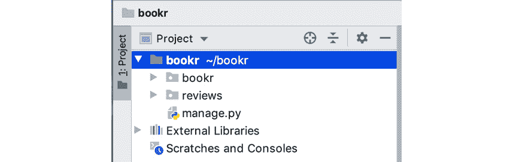

    图 1.12：PyCharm 项目窗格

    您的 `项目` 窗格应该看起来像 *图 1.12* 并显示 `bookr` 和 `reviews` 目录，以及 `manage.py` 文件。如果您没有看到这些，而是看到 `asgi.py`、`settings.py`、`urls.py` 和 `wsgi.py`，那么您已经打开了 `bookr` 包目录。选择 `文件` -> `打开`，然后浏览并打开 `bookr` 项目目录。

    在 PyCharm 知道如何执行您的项目以启动 Django 开发服务器之前，解释器必须设置为虚拟环境中的 Python 二进制文件。这是通过首先将解释器添加到全局解释器设置来完成的。

1.  在 PyCharm 中打开 `首选项`（macOS）或 `设置`（Windows/Linux）窗口。

    macOS：

    `PyCharm 菜单` -> `首选项`

    Windows 和 Linux：

    `文件` -> `设置`

1.  在左侧的偏好设置列表窗格中，打开 `项目: bookr` 项，然后点击 `项目解释器`：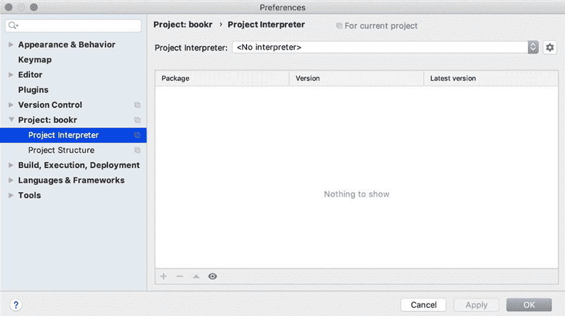

    图 1.13：项目解释器设置

1.  有时 PyCharm 可以自动确定虚拟环境，因此在这种情况下，`项目解释器` 可能已经填充了正确的解释器。如果是这样，并且您在包列表中看到 Django，您可以点击 `确定` 关闭窗口并完成此练习。

    然而，在大多数情况下，必须手动设置 Python 解释器。点击 `项目解释器` 下拉菜单旁边的齿轮图标，然后点击 `添加…`。

1.  现在显示 `添加 Python 解释器` 窗口。选择 `现有环境` 单选按钮，然后点击 `解释器` 下拉菜单旁边的省略号 (`…`)。然后您应该浏览并选择虚拟环境中的 Python 解释器：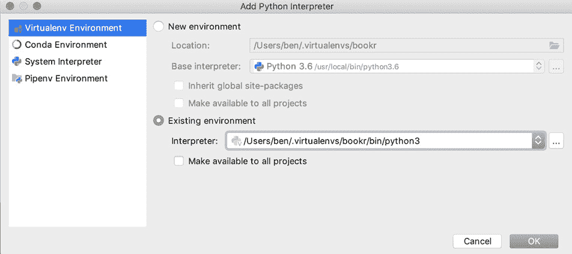

    图 1.14：添加 Python 解释器窗口

1.  在 macOS 上（假设您将虚拟环境命名为 `bookr`），路径通常是 `/Users/<您的用户名>/.virtualenvs/bookr/bin/python3`。同样，在 Linux 上，它应该是 `/home/<您的用户名>/.virtualenvs/bookr/bin/python3`。

    如果您不确定，您可以在之前运行 `python manage.py` 命令的终端中运行 `which python3` 命令，它将告诉您 Python 解释器的路径：

    ```py
    which python3
    /Users/ben/.virtualenvs/bookr/bin/python3
    ```

    在 Windows 上，它将是您使用 `virtualenv` 命令创建虚拟环境的位置。

    选择解释器后，您的 `添加 Python 解释器` 窗口应该看起来像 *图 1.14*。

1.  点击 `确定` 关闭 `添加 Python 解释器` 窗口。

1.  现在你应该能看到主偏好设置窗口，Django（以及你虚拟环境中的其他包）将被列出（见 *图 1.15*）：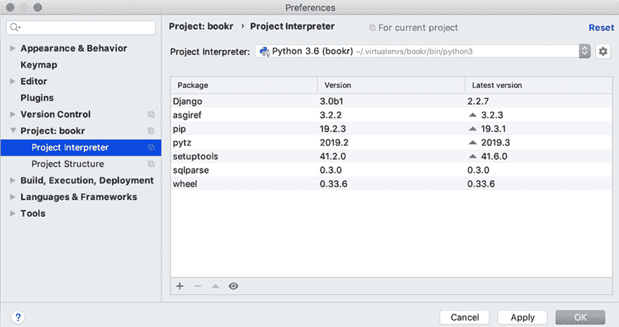

    图 1.15：虚拟环境中的包列表

1.  在主 `偏好设置` 窗口中点击 `OK` 以关闭它。PyCharm 现在将花费几秒钟来索引你的环境和已安装的库。你可以在其底部的状态栏中看到这个过程。等待此过程完成，进度条将消失。

1.  要运行 Django 开发服务器，Python 需要配置一个运行配置。你现在将设置它。

    点击 PyCharm 项目窗口右上角的 `添加配置…` 以打开 `运行/调试配置` 窗口：

    

    图 1.16：PyCharm 窗口右上角的“添加配置…”按钮

1.  在此窗口的左上角点击 `+` 按钮，从下拉菜单中选择 `Python`：

    图 1.17：在运行/调试配置窗口中添加新的 Python 配置

1.  一个新的配置面板将在窗口的右侧显示，其中包含有关如何运行你的项目的字段。你应该按照以下方式填写字段。

    `名称` 字段可以是任何内容，但应该是可理解的。输入 `Django Dev Server`。

    `脚本路径` 是你的 `manage.py` 文件的路径。如果你点击此字段中的文件夹图标，你可以浏览你的文件系统来选择 `bookr` 项目目录中的 `manage.py` 文件。

    `参数` 是在 `manage.py` 脚本之后出现的参数，就像从命令行运行它一样。我们将在这里使用相同的参数来启动服务器，所以输入 `runserver`。

    注意

    如前所述，`runserver` 命令也可以接受一个用于监听端口或地址的参数。如果你想，你可以在相同的 `参数` 字段中添加此参数在 `runserver` 之后。

    `Python 解释器` 设置应该已经自动设置为在 *步骤 5* 到 *8* 中设置的设置。如果不是，你可以点击右侧的箭头下拉菜单来选择它。

    `工作目录` 应设置为 `bookr` 项目目录。这很可能已经设置正确了。

    `将内容根添加到 PYTHONPATH` 和 `将源根添加到 PYTHONPATH` 都应该被选中。这将确保 PyCharm 将你的 `bookr` 项目目录添加到 `PYTHONPATH`（Python 解释器在加载模块时搜索的路径列表）。如果没有选中这些选项，你的项目中的导入将无法正确工作：

    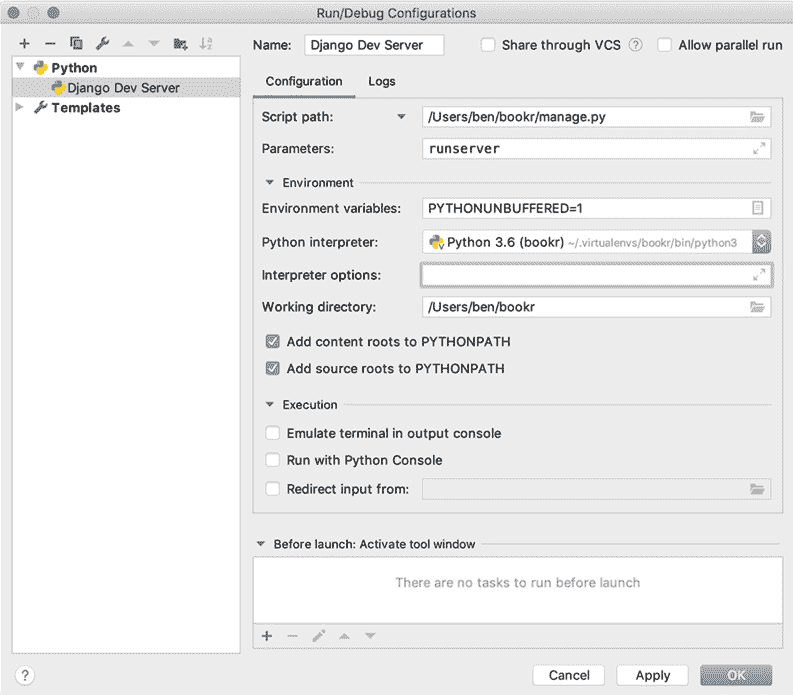

    图 1.18：配置设置

    确保你的 `运行/调试配置` 窗口看起来类似于 *图 1.18*，然后点击 `OK` 保存配置。

1.  现在，你不再需要在终端中启动 Django 开发服务器，而是可以点击 `项目` 窗口右上角的播放图标来启动它（见 *图 1.19*）：

    图 1.19：带有播放、调试和停止按钮的 Django 开发服务器配置

1.  点击播放图标以启动 Django 开发服务器。

    注意

    确保停止任何正在运行的 Django 开发服务器实例（例如在终端中），否则你启动的服务器将无法绑定到端口 `8000` 并无法启动。

1.  PyCharm 窗口的底部将打开一个控制台，显示输出信息，表明开发服务器已启动（*图 1.20*）：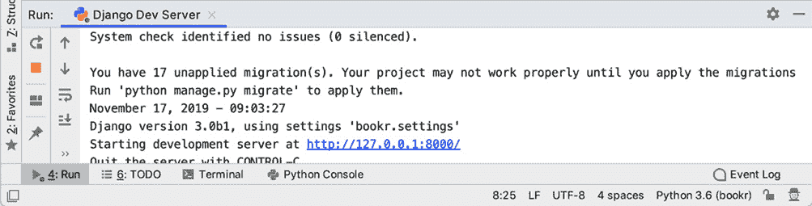

    图 1.20：运行中的 Django 开发服务器的控制台

1.  打开一个网页浏览器并导航到 `http://127.0.0.1:8000`。你应该会看到与之前在 *练习 1.01*、*创建项目和应用程序，以及启动开发服务器* 中相同的 Django 示例屏幕（*图 1.2*），这将确认一切再次设置正确。

在这个练习中，我们在 PyCharm 中打开了 Bookr 项目，然后为我们的项目设置了 Python 解释器。我们接着在 PyCharm 中添加了一个运行配置，这允许我们从 PyCharm 内部启动和停止 Django 开发服务器。我们还将能够在 PyCharm 的调试器中运行项目以进行调试。

## 查看详情

现在，你已经设置好了一切，可以开始编写自己的 Django 视图并配置映射到它们的 URL。正如我们在本章前面所看到的，视图只是一个函数，它接受一个 `HttpRequest` 实例（由 Django 构建）以及（可选的）来自 URL 的某些参数。然后它将执行一些操作，例如从数据库中获取数据。最后，它返回 `HttpResponse`。

以我们的 Bookr 应用程序为例，我们可能有一个视图，它接收对某本书的请求。它查询数据库以获取这本书，然后返回一个包含有关这本书信息的 HTML 页面的响应。另一个视图可以接收列出所有书籍的请求，然后返回包含此列表的另一个 HTML 页面的响应。视图还可以创建或修改数据：另一个视图可以接收创建新书的请求；然后它会将这本书添加到数据库中，并返回显示新书信息的 HTML 响应。

在本章中，我们只会使用函数作为视图，但 Django 也支持基于类的视图，这允许你利用面向对象范式（如继承）。这允许你简化多个具有相同业务逻辑的视图所使用的代码。例如，你可能想显示所有书籍或仅显示某个出版商的书籍。两个视图都需要从数据库中查询书籍列表并将其渲染到书籍列表模板中。一个视图类可以继承另一个类，只需实现数据获取的不同方式，其余的功能（如渲染）保持相同。基于类的视图可能更强大，但也更难学习。它们将在你有了更多 Django 经验后，在*第十一章*，*高级模板和基于类的视图*中介绍。

传递给视图的`HttpRequest`实例包含与请求相关的所有数据，具有诸如这些属性：

+   `method`: 一个包含浏览器用于请求页面的 HTTP 方法的字符串；通常这是`GET`，但如果用户提交了表单，它将是`POST`。你可以使用这个属性来改变视图的流程，例如，在`GET`时显示一个空表单，或者在`POST`时验证并处理表单提交。

+   `GET`: 一个包含 URL 查询字符串中使用的参数的`QueryDict`实例。这是 URL 中`?`之后的部分，如果有的话。我们很快会进一步介绍`QueryDict`。请注意，即使请求不是`GET`，此属性也始终可用。

+   `POST`: 另一个包含在`POST`请求中发送到视图的参数的`QueryDict`，例如来自表单提交。通常，你会与 Django 表单一起使用这个属性，这将在*第六章*，*表单*中介绍。

+   `headers`: 一个不区分大小写的键字典，包含请求中的 HTTP 头。例如，你可以根据`User-Agent`头为不同的浏览器提供不同的内容。我们之前在本章中讨论了一些客户端发送的 HTTP 头。

+   `path`: 这是请求中使用的路径。通常，你不需要检查这个属性，因为 Django 会自动解析路径并将其作为参数传递给视图函数，但在某些情况下这可能很有用。

我们现在不会使用所有这些属性，其他属性将在以后介绍，但现在你可以看到`HttpRequest`参数在你的视图中扮演的角色。

## URL 映射详情

我们在*处理请求*部分简要提到了 URL 映射。Django 在接收到特定 URL 的请求时不会自动知道应该执行哪个视图函数。URL 映射的作用是建立 URL 和视图之间的这种联系。例如，在 Bookr 中，你可能想将 URL `/books/` 映射到你创建的`books_list`视图。

URL 到视图的映射定义在 Django 自动创建的文件中，该文件名为`urls.py`，位于`bookr`包目录内（尽管可以在`settings.py`中设置不同的文件；关于这一点稍后会有更多说明）。

此文件包含一个变量`urlpatterns`，它是一个路径列表，Django 将依次评估，直到找到与请求的 URL 匹配的路径。匹配将解析为一个视图函数，或者解析为另一个也包含`urlpatterns`变量的`urls.py`文件，它将以相同的方式解析。你可以按这种方式将 URL 文件链式连接，直到你想要的程度。这样，你可以将 URL 映射拆分为单独的文件（例如每个应用一个或多个），这样它们就不会变得太大。一旦找到视图，Django 就会使用一个`HttpRequest`实例和从 URL 解析出的任何参数来调用它。

规则是通过调用`path`函数来设置的，该函数将 URL 路径作为第一个参数。路径可以包含命名参数，这些参数将被作为函数参数传递给视图。其第二个参数是一个视图或另一个也包含`urlpatterns`的文件。

此外，还有一个`re_path`函数，它与`path`类似，但它将正则表达式作为第一个参数，用于更高级的配置。URL 映射还有很多其他内容；然而，它将在*第三章*，*URL 映射、视图和模板*中介绍。

![图 1.21：默认的 urls.py 文件

![img/B15509_01_21.jpg]

图 1.21：默认的 urls.py 文件

为了说明这些概念，*图 1.21*展示了 Django 生成的默认`urls.py`文件。你可以看到`urlpatterns`变量，它列出了所有已设置的 URL。目前，只有一个规则被设置，它将任何以`admin/`开头的路径映射到管理 URL 映射（`admin.site.urls`模块）。这不是一个映射到视图的映射；相反，它是一个将 URL 映射链式连接的例子——`admin.site.urls`模块将定义剩余的路径（`admin/`之后），这些路径映射到管理视图。我们将在*第四章*，*Django 管理简介*中介绍 Django 管理站点。

我们现在将编写一个视图，并设置一个 URL 映射到它，以观察这些概念的实际应用。

## 练习 1.03：编写视图并将 URL 映射到它

我们的第一个视图将非常简单，它只会返回一些静态文本内容。在这个练习中，我们将看到如何编写视图，以及如何设置 URL 映射以解析到视图：

注意

当你在项目中的文件进行更改并保存时，你可能会在运行它的终端或控制台中看到 Django 开发服务器自动重启。这是正常的；它会自动重启以加载你做出的任何代码更改。请注意，如果你编辑模型或迁移，它不会自动将更改应用到数据库中——关于这一点，我们将在*第二章*，*模型和迁移*中详细说明。

1.  在 PyCharm 中，在左侧的项目浏览器中展开 `reviews` 文件夹，然后双击 `views.py` 文件以打开它。在 PyCharm 的右侧（编辑器）面板中，你应该能看到 Django 自动生成的占位文本：

    ```py
    from django.shortcuts import render
    # Create your views here.
    ```

    在编辑器面板中应该看起来像这样：

    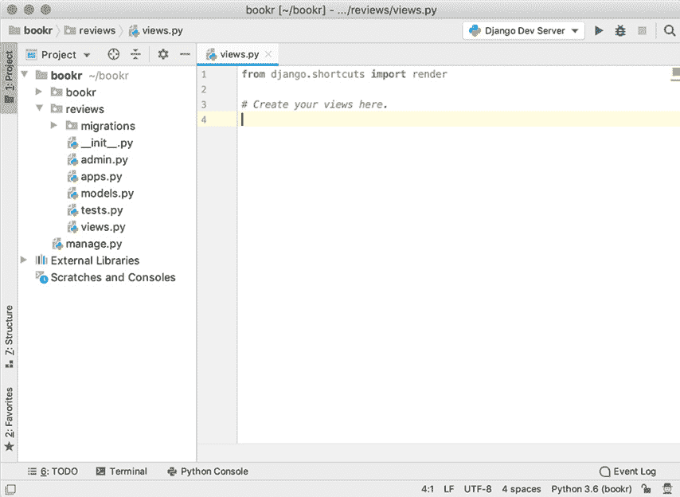

    图 1.22：views.py 默认内容

1.  从 `views.py` 中删除此占位文本，并插入以下内容：

    ```py
    from django.http import HttpResponse
    def index(request):
        return HttpResponse("Hello, world!")
    ```

    首先，需要从 `django.http` 中导入 `HttpResponse` 类。这是用来创建返回给网页浏览器的响应的。你也可以用它来控制诸如 HTTP 标头或状态码之类的功能。现在，它将只使用默认的标头和 `200 Success` 状态码。它的第一个参数是要发送为响应正文的字符串内容。

    然后，视图函数返回一个包含我们定义的内容的 `HttpResponse` 实例（`Hello, world!`）：

    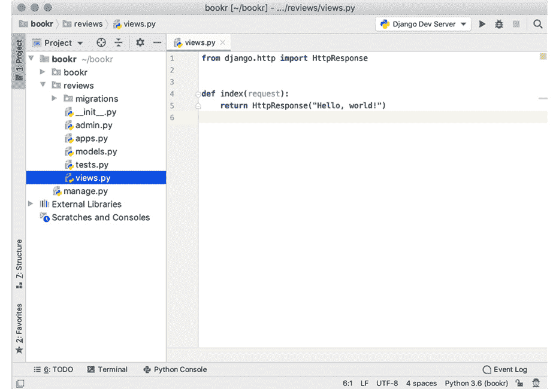

    图 1.23：编辑后的 views.py 内容

1.  现在我们将设置一个 URL 映射到 `index` 视图。这将非常简单，不会包含任何参数。在 `Project` 面板中展开 `bookr` 目录，然后打开 `urls.py`。Django 已经自动生成了此文件。

    目前，我们只需添加一个简单的 URL 来替换 Django 提供的默认索引。

1.  通过在现有导入之后添加此行将你的视图导入到 `urls.py` 文件中：

    ```py
    import reviews.views
    ```

1.  通过向 `urlpatterns` 列表中添加对 `path` 函数的调用（一个空字符串和一个对 `index` 函数的引用）来将映射添加到索引视图：

    ```py
    urlpatterns = [path('admin/', admin.site.urls),\
                   path('', reviews.views.index)]
    index function (that is, it should be reviews.views.index and not reviews.views.index()) as we are passing a reference to a function rather than calling it. When you're finished, your urls.py file should like *Figure 1.24*:
    ```

    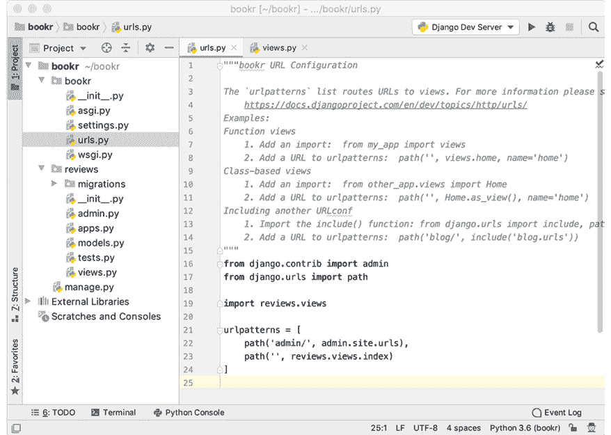

    图 1.24：编辑后的 urls.py

1.  切换回你的网页浏览器并刷新。Django 默认欢迎屏幕应该被视图定义中的文本 `Hello, world!` 替换：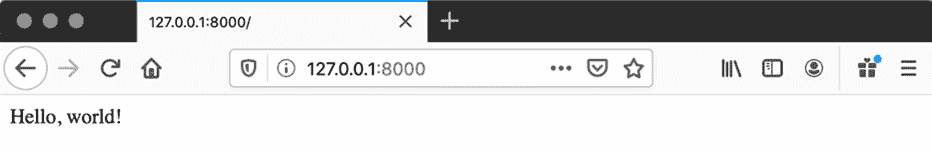

图 1.25：现在网页浏览器应该显示 Hello, world! 消息

我们刚刚看到了如何编写视图函数并将 URL 映射到它。然后我们通过在网页浏览器中加载它来测试了视图。

## GET、POST 和 QueryDict 对象

数据可以通过 HTTP 请求作为 URL 上的参数或 `POST` 请求正文中的内容传入。你可能已经注意到在浏览网页时 URL 中的参数——`?` 后面的文本——例如，`http://www.example.com/?parameter1=value1&parameter2=value2`。我们也在本章前面看到了一个 `POST` 请求中表单数据的例子，用于用户登录（请求正文是 `username=user1&password=password1`）。

Django 自动将这些参数字符串解析为`QueryDict`对象。然后，这些数据在传递给视图函数的`HttpRequest`对象上可用——具体来说，在`HttpRequest`.`GET`和`HttpRequest`.`POST`属性中，分别对应 URL 参数和表单参数。`QueryDict`对象是主要像字典一样行为的对象，除了它们可以为键包含多个值。

为了展示访问项的不同方法，我们将使用一个简单的名为`qd`的`QueryDict`作为示例，它只有一个键（`k`）。`k`项在列表中有三个值：字符串`a`、`b`和`c`。以下代码片段显示了 Python 解释器的输出。

首先，`QueryDict` `qd`是从一个参数字符串构建的：

```py
>>> qd = QueryDict("k=a&k=b&k=c")
```

当使用方括号符号或`get`方法访问项时，返回该键的最后一个值：

```py
>>> qd["k"]
'c'
>>> qd.get("k")
'c'
```

要访问一个键的所有值，应使用`getlist`方法：

```py
>>> qd.getlist("k")
['a', 'b', 'c']
```

`getlist`始终返回一个列表——如果键不存在，它将是空的：

```py
>>> qd.getlist("bad key")
[]
```

虽然`getlist`对于不存在的键不会引发异常，但使用方括号符号访问不存在的键将引发`KeyError`，就像普通字典一样。使用`get`方法来避免这个错误。

`GET`和`POST`的`QueryDict`对象是不可变的（它们不能被更改），所以如果你需要更改其值，应使用`copy`方法来获取一个可变副本：

```py
>>> qd["k"] = "d"
AttributeError: This QueryDict instance is immutable
>>> qd2 = qd.copy()
>>> qd2
<QueryDict: {'k': ['a', 'b', 'c']}>
>>> qd2["k"] = "d"
>>> qd2["k"]
"d"
```

为了说明`QueryDict`是如何从 URL 中填充的，想象一个示例 URL：`http://127.0.0.1:8000?val1=a&val2=b&val2=c&val3`。

在幕后，Django 将 URL 中的查询（`?`之后的所有内容）传递给`QueryDict`对象以实例化，并将其附加到传递给视图函数的`request`实例。类似于以下内容：

```py
request.GET = QueryDict("val1=a&val2=b&val2=c&val3")
```

记住，这在你将`request`实例传递到视图函数内部之前就完成了；你不需要这样做。

在我们的示例 URL 的情况下，我们可以在视图函数内部如下访问参数：

```py
request.GET["val1"]
```

使用标准字典访问，它将返回值`a`：

```py
request.GET["val2"]
```

再次，使用标准字典访问，`val2`键设置了两个值，因此它会返回最后一个值，`c`：

```py
request.GET.getlist("val2")
```

这将返回`val2`的所有值列表：`["b", "c"]`:

```py
request.GET["val3"]
```

这个键在查询字符串中存在但没有设置值，因此返回一个空字符串：

```py
request.GET["val4"]
```

这个键没有设置，所以会引发`KeyError`。请使用`request.GET.get("val4")`代替，它将返回`None`：

```py
request.GET.getlist("val4")
```

由于这个键没有设置，将返回一个空列表（`[]`）。

现在，我们将通过`GET`参数来观察`QueryDict`的实际应用。你将在*第六章*，*表单*中进一步了解`POST`参数。

## 练习 1.04：探索 GET 值和 QueryDict

现在，我们将对之前练习中的`index`视图进行一些修改，以便从 URL 的`GET`属性中读取值，然后我们将尝试传递不同的参数以查看结果：

1.  在 PyCharm 中打开`views.py`文件。添加一个名为`name`的新变量，该变量从`GET`参数中读取用户的名称。在`index`函数定义之后添加此行：

    ```py
    name = request.GET.get("name") or "world"
    ```

1.  将返回值修改为使用名称作为返回内容的一部分：

    ```py
    return HttpResponse("Hello, {}!".format(name))
    ```

    在 PyCharm 中，更改后的代码将看起来像这样：

    ![图 1.26：更新后的 views.py 文件

    ![图片 B15509_01_26.jpg]

    图 1.26：更新后的 views.py 文件

1.  在你的浏览器中访问`http://127.0.0.1:8000`。你应该注意到页面仍然显示`Hello, world!`这是因为我们没有提供`name`参数。你可以在 URL 中添加你的名字，例如，`http://127.0.0.1:8000?name=Ben`：![图 1.27：在 URL 中设置名称

    ![图片 B15509_01_27.jpg]

    图 1.27：在 URL 中设置名称

1.  尝试添加两个名称，例如，`http://127.0.0.1:8000?name=Ben&name=John`。正如我们提到的，参数的最后一个值是通过`get`函数检索的，所以你应该看到`Hello, John!`：![图 1.28：在 URL 中设置多个名称

    ![图片 B15509_01_28.jpg]

    图 1.28：在 URL 中设置多个名称

1.  尝试不设置名称，如下所示：`http://127.0.0.1:8000?name=`。页面应该会回到显示`Hello, world!`：![图 1.29：URL 中没有设置名称

    ![图片 B15509_01_29.jpg]

图 1.29：URL 中没有设置名称

注意

你可能会想知道为什么我们使用`or`而不是将`'world'`作为默认值传递给`get`函数来将`name`设置为默认值。考虑一下在*步骤 5*中我们为`name`参数传递了一个空白值时发生了什么。如果我们为`get`函数传递了`'world'`作为默认值，那么`get`函数仍然会返回一个空字符串。这是因为有一个`name`值，只是它是空的。在开发你的视图时请记住这一点，因为没有设置值和设置了空白值是有区别的。根据你的使用情况，你可能会选择传递`get`的默认值。

在这个练习中，我们使用传入请求的`GET`属性从我们的视图中检索值。我们看到了如何设置默认值以及如果为同一参数设置了多个值，则检索哪个值。

## 探索 Django 设置

我们还没有查看 Django 如何存储其设置。现在我们已经看到了 Django 的不同部分，现在是检查`settings.py`文件的好时机。这个文件包含许多可以用来自定义 Django 的设置。当你开始 Bookr 项目时，为你创建了一个默认的`settings.py`文件。

现在，我们将讨论文件中的一些重要设置，以及一些在你更熟悉 Django 时可能有用的其他设置。你应该在 PyCharm 中打开你的`settings.py`文件并跟随，这样你就可以看到你的项目中的值在哪里以及是什么。

此文件中的每个设置都是一个全局变量。我们将讨论设置的顺序与它们在此文件中出现的顺序相同，尽管我们可能会跳过一些——例如，在`DEBUG`和`INSTALLED_APPS`之间有`ALLOWED_HOSTS`设置，我们不会在本部分书中介绍（您将在*第十七章*，*Django 应用程序的部署（第一部分 - 服务器设置）*中看到它）：

```py
SECRET_KEY = '…'
```

这是一个自动生成的值，不应与任何人共享。它用于散列、令牌和其他加密函数。如果您在 cookie 中已有会话并且更改了此值，会话将不再有效。

```py
DEBUG = True
```

将此值设置为`True`，Django 将自动将异常显示在浏览器中，以便您调试遇到的任何问题。当您将应用程序部署到生产环境时，应将其设置为`False`：

```py
INSTALLED_APPS = […]
```

当您编写自己的 Django 应用程序（如`reviews`应用程序）或安装第三方应用程序（将在*第十五章*，*Django 第三方库*中介绍）时，它们应添加到此列表中。正如我们所看到的，将它们添加到这里并不是严格必要的（我们的`index`视图在没有`reviews`应用程序在此列表中的情况下也能工作）。然而，为了 Django 能够自动找到应用程序的模板、静态文件、迁移和其他配置，它必须列在此处：

```py
ROOT_URLCONF = 'bookr.urls'
```

这是 Django 首先加载以查找 URL 的 Python 模块。请注意，这是我们之前添加索引视图 URL 映射的文件：

```py
TEMPLATES = […]
```

目前，您不需要理解这个设置中的所有内容，因为您不会更改它；需要指出的重要行是这一行：

```py
'APP_DIRS': True,
```

这告诉 Django 在加载模板以进行渲染时应在每个`INSTALLED_APP`内部的`templates`目录中查找。我们目前还没有为`reviews`创建`templates`目录，但我们将在下一次练习中添加一个。

Django 还有更多设置可用，这些设置在`settings.py`文件中未列出，因此在这些情况下它将使用其内置默认值。您还可以使用该文件设置您为应用程序创建的任意设置。第三方应用程序可能也希望在此处添加设置。在后面的章节中，我们将为其他应用程序在此处添加设置。您可以在[`docs.djangoproject.com/en/3.0/ref/settings/`](https://docs.djangoproject.com/en/3.0/ref/settings/)找到所有设置的列表及其默认值。

### 在您的代码中使用设置

有时引用`settings.py`中的设置在您的代码中可能很有用，无论是 Django 的内置设置还是您自己定义的设置。您可能会想编写如下代码来完成此操作：

```py
from bookr import settings
if settings.DEBUG:  # check if running in DEBUG mode
    do_some_logging()
```

注意

前面的代码片段中的`#`符号表示代码注释。注释被添加到代码中以帮助解释特定的逻辑。

由于以下多个原因，这种方法是不正确的：

+   有可能运行 Django 并指定一个不同的设置文件来读取，在这种情况下，之前的代码会导致错误，因为它将无法找到那个特定的文件。或者，如果文件存在，导入将成功，但将包含错误的设置。

+   Django 有一些设置可能不会在 `settings.py` 文件中列出，如果没有列出，它将使用其内部默认值。例如，如果你从你的 `settings.py` 文件中移除了 `DEBUG = True` 行，Django 将回退到使用其内部的 `DEBUG` 值（这是 `False`）。如果你直接使用 `settings.DEBUG` 尝试访问它，你会得到一个错误。

+   第三方库可以更改你的设置定义方式，所以你的 `settings.py` 文件可能看起来完全不同。所有预期的变量可能根本不存在。所有这些应用程序的行为超出了本书的范围，但这是需要注意的。

优先的方式是使用 `django.conf` 模块，如下所示：

```py
from django.conf import settings  # import settings from here instead
if settings.DEBUG:
    do_some_logging()
```

当从 `django.conf` 导入 `settings` 时，Django 缓解了我们刚才讨论的三个问题：

+   设置是从指定的任何 Django 设置文件中读取的。

+   任何默认设置值都会被插值。

+   Django 负责解析由第三方库定义的任何设置。

在我们新的简短示例代码片段中，即使 `DEBUG` 在 `settings.py` 文件中缺失，它也会回退到 Django 内部默认值（这是 `False`）。对于 Django 定义的所有其他设置也是如此；然而，如果你在这个文件中定义了自己的自定义设置，Django 将不会为它们提供内部值，所以在你代码中，你应该有一些处理它们可能不存在的方案——你的代码如何行为是你的选择，并且超出了本书的范围。

## 在应用目录中查找 HTML 模板

有许多选项可以告诉 Django 如何查找模板，这些选项可以在 `settings.py` 文件的 `TEMPLATES` 设置中设置，但最简单的一个（目前）是在 `reviews` 目录内创建一个 `templates` 目录。由于 `settings.py` 文件中的 `APP_DIRS` 设置为 `True`，Django 将会查找这个目录（以及其他应用中的 `templates` 目录），正如我们在上一节中看到的。

## 练习 1.05：创建模板目录和基本模板

在这个练习中，你将为 `reviews` 应用创建一个 `templates` 目录。然后，你将添加一个 Django 可以渲染到 HTTP 响应中的 HTML 模板文件：

1.  我们在上一节（*探索 Django 设置*）中讨论了 `settings.py` 和其 `INSTALLED_APPS` 设置。我们需要将 `reviews` 应用添加到 `INSTALLED_APPS` 中，以便 Django 能够找到模板。在 PyCharm 中打开 `settings.py`。更新 `INSTALLED_APPS` 设置并在末尾添加 `reviews`。它应该看起来像这样：

    ```py
    INSTALLED_APPS = ['django.contrib.admin',\
                      'django.contrib.auth',\
                      'django.contrib.contenttypes',\
                      'django.contrib.sessions',\
                      'django.contrib.messages',\
                      'django.contrib.staticfiles',\
                      'reviews']
    ```

    在 PyCharm 中，文件现在应该看起来像这样：

    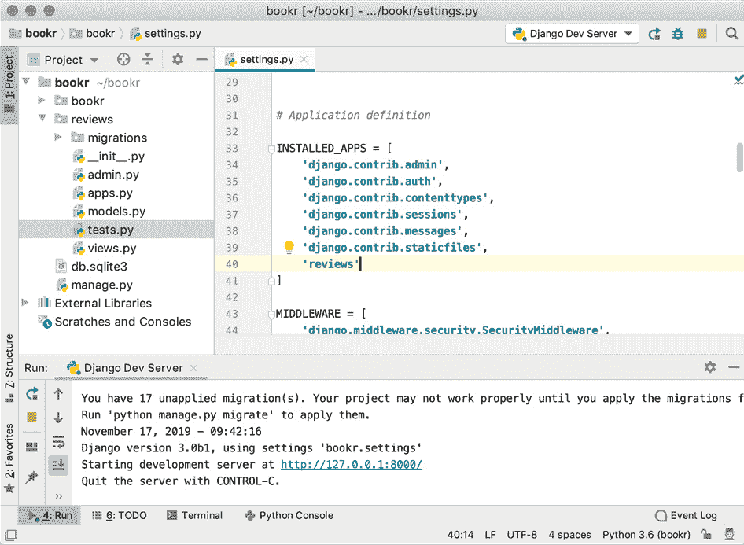

    

    图 1.30：已将 reviews 应用添加到 settings.py

1.  保存并关闭 `settings.py`。

1.  在 PyCharm 项目浏览器中，右键单击 `reviews` 目录并选择 `New` -> `Directory`：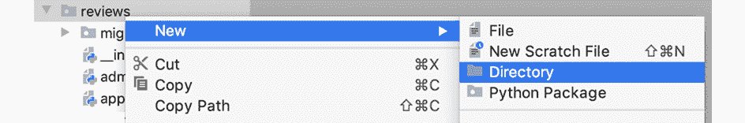

    图 1.31：在 reviews 目录内创建新的目录

1.  输入名称 `templates` 并点击 `OK` 以创建它：

    图 1.32：命名目录 templates

1.  右键单击新创建的 `templates` 目录并选择 `New` -> `HTML File`：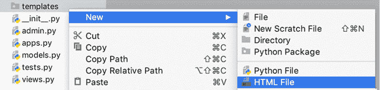

    图 1.33：在 templates 目录中创建新的 HTML 文件

1.  在出现的窗口中，输入名称 `base.html`，保持 `HTML 5 file` 选中状态，然后按 `Enter` 创建文件：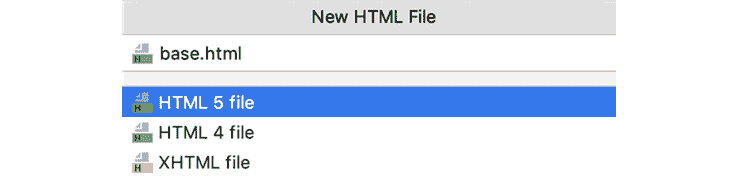

    图 1.34：新的 HTML 文件窗口

1.  在 PyCharm 创建文件后，它也会自动打开它。它将包含以下内容：

    ```py
    <!DOCTYPE html>
    <html lang="en">
    <head>
        <meta charset="UTF-8">
        <title>Title</title>
    </head>
    <body>
    </body>
    </html>
    ```

1.  在 `<body>…</body>` 标签之间添加一条简短的消息以验证模板正在被渲染：

    ```py
    <body>
        Hello from a template!
    </body>
    ```

    这是在 PyCharm 中的样子：

    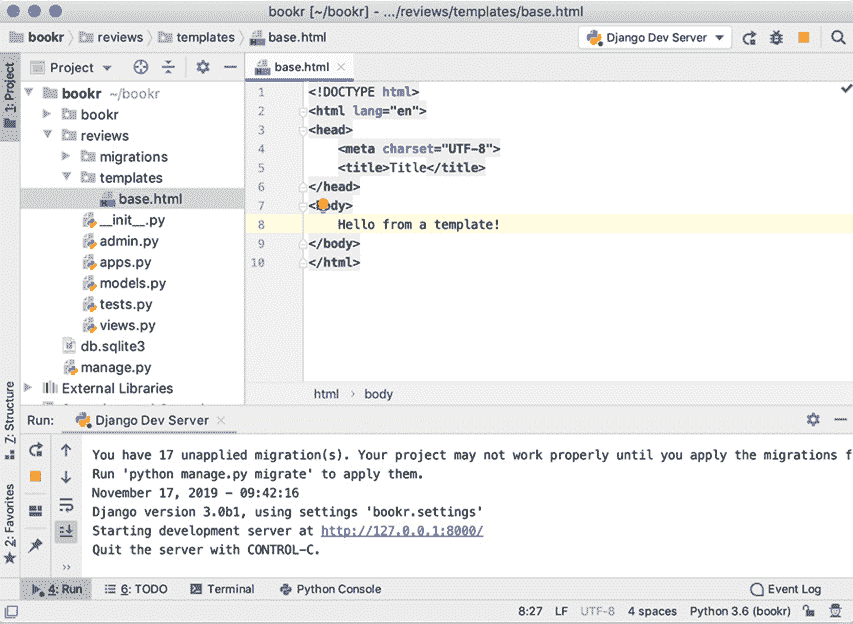

图 1.35：包含一些示例文本的 base.html 模板

在这个练习中，我们为 `reviews` 应用程序创建了一个 `templates` 目录，并向其中添加了一个 HTML 模板。一旦我们在视图中实现了 `render` 函数的使用，HTML 模板就会被渲染。

## 使用 render 函数渲染模板

现在我们有了可以使用的模板，但我们需要更新我们的 `index` 视图，使其渲染模板而不是返回当前显示的 `Hello (name)!` 文本（参考 *图 1.29* 了解其当前的外观）。我们将通过使用 `render` 函数并提供模板的名称来完成此操作。`render` 是一个快捷函数，它返回一个 `HttpResponse` 实例。还有其他方法可以渲染模板以提供更多控制渲染的方式，但就目前而言，这个函数对我们的需求来说已经足够好了。`render` 至少需要两个参数：第一个始终是传递给视图的请求，第二个是正在渲染的模板的名称/相对路径。我们还将使用第三个参数调用它，即渲染上下文，它包含在模板中将可用的所有变量——更多关于这一点将在 *练习 1.07*，*在模板中使用变量* 中介绍。

## 练习 1.06：在视图中渲染模板

在这个练习中，你将更新你的 `index` 视图函数以渲染你在 *练习 1.05*，*创建模板目录和基本模板* 中创建的 HTML 模板。你将使用 `render` 函数，该函数从磁盘加载你的模板，渲染它，并将其发送到浏览器。这将替换你当前从 `index` 视图函数返回的静态文本：

1.  在 PyCharm 中，打开 `reviews` 目录中的 `views.py`。

1.  我们不再手动创建 `HttpResponse` 实例，因此请删除 `HttpResponse` 导入行：

    ```py
    from django.http import HttpResponse
    ```

1.  用从 `django.shortcuts` 导入的 `render` 函数替换它：

    ```py
    from django.shortcuts import render
    ```

1.  更新 `index` 函数，使其返回 `render` 调用，而不是返回 `HttpResponse`，传递 `request` 实例和模板名称：

    ```py
    def index(request):
        return render(request, "base.html")
    ```

    在 PyCharm 中，它将看起来如下：

    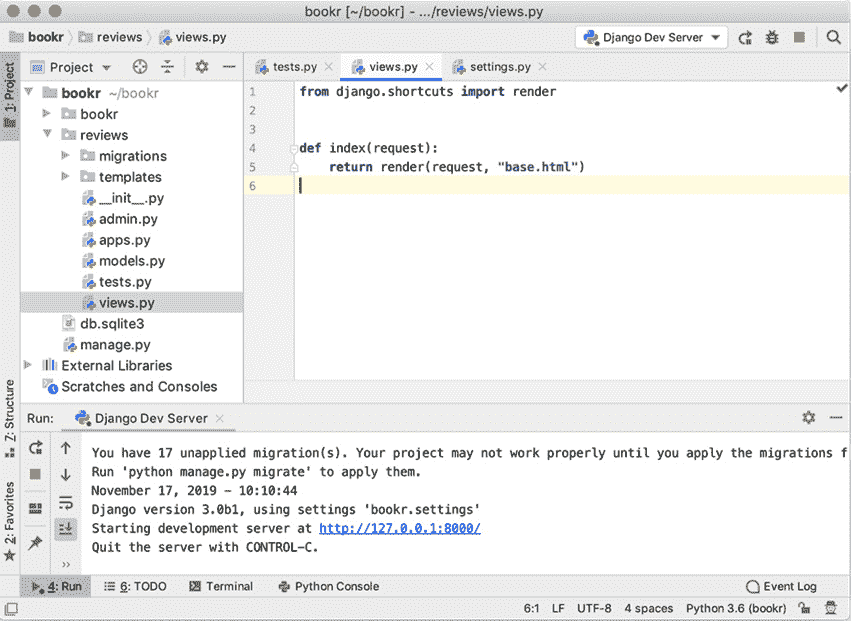

    图 1.36：完成的 views.py 文件

1.  如果开发服务器尚未运行，请启动它。然后，打开您的网页浏览器并刷新 `http://127.0.0.1:8000`。你应该会看到 *图 1.37* 中所示的 `Hello from a template!` 消息被渲染出来。

    ](img/B15509_01_37.jpg)

图 1.37：您的第一个渲染的 HTML 模板

## 在模板中渲染变量

模板不仅仅是静态的 HTML。大多数情况下，它们将包含变量，这些变量在渲染过程中被插值。这些变量通过上下文从视图传递到模板：一个包含所有模板可以使用变量名称的字典（或类似字典的对象）。我们将再次以 Bookr 为例。如果你的模板中没有变量，你需要为每个要显示的书籍创建不同的 HTML 文件。相反，我们在模板内部使用一个如 `book_name` 的变量，然后视图为模板提供一个 `book_name` 变量，其值设置为已加载的书籍模型标题。当显示不同的书籍时，HTML 不需要改变；视图只需传递一个不同的书籍给它。你可以看到模型、视图和模板现在是如何全部结合在一起的。

与 PHP 等一些其他语言不同，变量必须显式传递到模板中，视图中的变量不会自动对模板可用。这是出于安全考虑，以及避免意外污染模板的命名空间（我们不希望在模板中出现任何意外的变量）。

在模板内部，变量通过双大括号 `{{ }}` 表示。虽然这并非严格的标准，但这种风格相当常见，并被用于其他模板工具，如 Vue.js 和 Mustache。Symfony（一个 PHP 框架）在其 Twig 模板语言中也使用双大括号，因此你可能在那里看到过类似的用法。

在模板中渲染变量，只需用大括号包裹它：`{{ book_name }}`。Django 会自动转义输出中的 HTML，这样你就可以在变量中包含特殊字符（如 `<` 或 `>`），而不用担心它会破坏你的输出。如果一个变量没有传递到模板中，Django 将在该位置简单地渲染空内容，而不是抛出异常。

使用过滤器渲染变量有更多不同的方式，但这些将在 *第三章，URL 路由器、视图和模板* 中介绍。

## 练习 1.07：在模板中使用变量

我们将在 `base.html` 文件中放置一个简单的变量来演示 Django 的变量插值是如何工作的：

1.  在 PyCharm 中打开 `base.html`。

1.  更新 `<body>` 元素，使其包含一个用于渲染 `name` 变量的位置：

    ```py
    <body>
    Hello, {{ name }}!
    </body>
    ```

1.  返回您的网页浏览器并刷新（您应该仍然在 `http://127.0.0.1:8000`）。您会看到页面现在显示 `Hello, !`。这是因为我们没有在渲染上下文中设置 `name` 变量：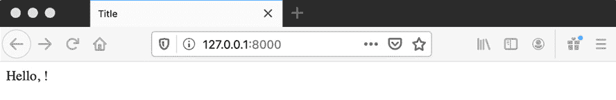

    图 1.38：由于没有设置上下文，模板中没有渲染任何值

1.  打开 `views.py` 并在 `index` 函数内添加一个名为 `name` 的变量，将其值设置为 `"world"`：

    ```py
    def index(request):
        name = "world"
        return render(request, "base.html")
    ```

1.  再次刷新您的浏览器。您应该注意到没有任何变化：我们想要渲染的任何内容都必须明确传递给 `render` 函数作为 `context`。这是在渲染时提供的变量字典。

1.  将 `context` 字典作为 `render` 函数的第三个参数添加。将您的 `render` 行更改为以下内容：

    ```py
    return render(request, "base.html", {"name": name})
    ```

    在 PyCharm 中，它应该如下所示：

    ![图 1.39：在渲染上下文中发送了 `name` 变量的 `views.py`    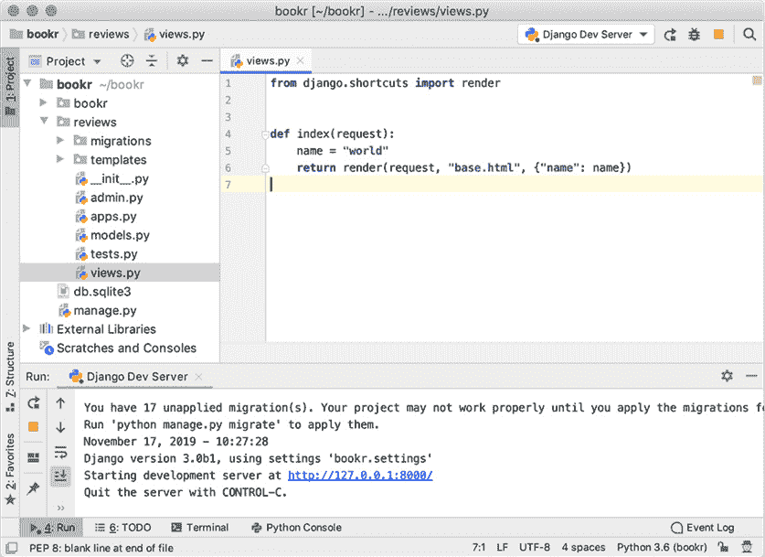

    图 1.39：在渲染上下文中发送了 `name` 变量的 `views.py`

1.  再次刷新您的浏览器，您会看到它现在显示 `Hello, world!`：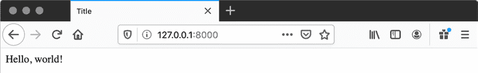

图 1.40：使用变量渲染的模板

在这个练习中，我们将之前练习中创建的模板与 `render` 函数结合起来，以渲染一个包含传递到其中的 `name` 变量的 `context` 字典的 HTML 页面。

## 调试和错误处理

在编程时，除非您是那种从不犯错的完美程序员，否则您可能需要在某个时候处理错误或调试您的代码。当您的程序中发生错误时，通常有两种方式可以告知：要么您的代码会引发异常，要么在查看页面时您会得到意外的输出或结果。您可能会更频繁地遇到异常，因为有许多意外的方式可以引发它们。如果您的代码正在生成意外的输出，但没有引发任何异常，您可能想使用 PyCharm 调试器来找出原因。

## 异常

如果您之前使用过 Python 或其他编程语言，您可能已经遇到过异常。如果没有，这里有一个快速介绍。当发生错误时，会引发（或在其他语言中抛出）异常。程序在代码的该点停止执行，异常沿着函数调用链向上传播，直到被捕获。如果没有被捕获，则程序将崩溃，有时会显示一个描述异常及其发生位置的错误消息。Python 本身会引发异常，您的代码可以在任何位置快速停止执行。这里列出了您在编写 Python 代码时可能会遇到的常见异常：

+   `IndentationError`

    Python 如果你的代码没有正确缩进或者混合了制表符和空格，将会引发这个错误。

+   `SyntaxError`

    如果你的代码有无效的语法，Python 会引发这个错误：

    ```py
    >>> a === 1
      File "<stdin>", line 1
        a === 1
            ^
    SyntaxError: invalid syntax
    ```

+   `ImportError`

    当导入失败时（例如，尝试从一个不存在的文件导入，或者尝试导入一个文件中未设置的名字）会引发这个错误：

    ```py
    >>> import missing_file
    Traceback (most recent call last):
      File "<stdin>", line 1, in <module>
    ImportError: No module named missing_file
    ```

+   `NameError`

    当尝试访问尚未设置变量的值时会引发这个错误：

    ```py
    >>> a = b + 5
    Traceback (most recent call last):
      File "<stdin>", line 1, in <module>
    NameError: name 'b' is not defined
    ```

+   `KeyError`

    当访问字典（或类似字典的对象）中未设置的关键字时会引发这个错误：

    ```py
    >>> d = {'a': 1}
    >>> d['b']
    Traceback (most recent call last):
      File "<stdin>", line 1, in <module>
    KeyError: 'b'
    ```

+   `IndexError`

    当尝试访问列表长度之外的索引时会引发这个错误：

    ```py
    >>> l = ['a', 'b']
    >>> l[3]
    Traceback (most recent call last):
      File "<stdin>", line 1, in <module>
    IndexError: list index out of range
    ```

+   `TypeError`

    当尝试对一个不支持该操作的对象执行操作，或者使用错误类型的两个对象时（例如，尝试将一个字符串添加到一个整数上）会引发这个错误：

    ```py
    >>> 1 + '1'
    Traceback (most recent call last):
      File "<stdin>", line 1, in <module>
    TypeError: unsupported operand type(s) for +: 'int' and 'str'
    ```

Django 还会引发它自己的自定义异常，你将在整本书中了解到它们。

当你在 `settings.py` 文件中将 `DEBUG` 设置为 `True` 并运行 Django 开发服务器时，Django 会自动捕获代码中发生的异常（而不是崩溃）。然后它会生成一个 HTTP 响应，显示堆栈跟踪和其他信息，以帮助你调试问题。在生产环境中，`DEBUG` 应该设置为 `False`。此时 Django 将返回一个标准的内部服务器错误页面，不包含任何敏感信息。你也可以选择显示自定义错误页面。

## 练习 1.08：生成和查看异常

让我们在视图中创建一个简单的异常，这样你就可以熟悉 Django 如何显示它们。在这种情况下，我们将尝试使用一个不存在的变量，这将引发 `NameError`：

1.  在 PyCharm 中打开 `views.py`。在 `index` 视图函数中，更改发送给 `render` 函数的上下文，使其使用一个不存在的变量。我们将尝试在上下文字典中使用 `invalid_name` 而不是 `name`。不要更改上下文字典的键，只需更改其值：

    ```py
    return render(request, "base.html", {"name": invalid_name})
    ```

1.  返回你的浏览器并刷新页面。你应该会看到一个像 *图 1.41* 的屏幕：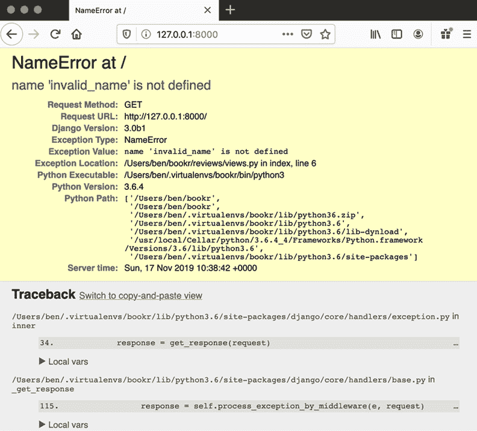

    图 1.41: Django 异常屏幕

1.  页面上方的前几行标题告诉你发生了什么错误：

    ```py
    NameError at /
    name 'invalid_name' is not defined
    ```

1.  在标题下方是异常发生的跟踪信息。你可以点击代码的各个行来展开它们，查看周围的代码，或者点击每个帧的 `Local vars` 来展开它们，查看变量的值：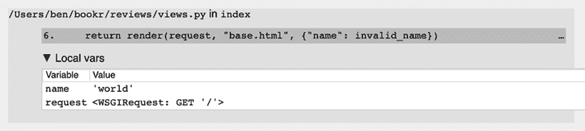

    图 1.42: 引发异常的行

1.  在我们的例子中，我们可以看到异常是在 `views.py` 文件的第 *6* 行引发的，展开 `Local vars`，我们看到 `name` 的值是 `world`，唯一的另一个变量是传入的 `request`（*图 1.42*）。

1.  返回 `views.py` 并通过将 `invalid_name` 重命名为 `name` 来修复你的 `NameError`。

1.  保存文件并刷新浏览器，`Hello World` 应该再次显示（如 *图 1.40* 所示）。

在这个练习中，我们通过尝试使用一个尚未设置的变量来使我们的 Django 代码引发异常（`NameError`）。我们看到了 Django 自动将此异常的详细信息以及堆栈跟踪发送到浏览器，以帮助我们找到错误的原因。然后我们撤销了代码更改，以确保我们的视图能够正常工作。

## 调试

当您试图查找代码中的问题时，使用调试器可能会有所帮助。这是一个工具，它允许您逐行执行代码，而不是一次性执行所有代码。每次调试器在特定的代码行上暂停时，您都可以看到所有当前变量的值。这对于找出不会引发异常的代码错误非常有用。

例如，在 Bookr 中，我们讨论了有一个视图从数据库中获取书籍列表并在 HTML 模板中渲染它们的场景。如果你在浏览器中查看页面，当你期望看到多本书时，你可能会只看到一本书。你可以在你的视图函数内部暂停执行，查看从数据库中获取了哪些值。如果你的视图只从数据库接收一本书，那么你知道你的数据库查询某处存在问题。如果你的视图成功获取了多本书但只渲染了一本，那么可能是一个模板的问题。调试可以帮助你缩小这类错误的范围。

PyCharm 内置了调试器，这使得您可以轻松地逐行执行代码并查看每行的执行情况。为了告诉调试器在代码的哪个位置停止执行，您需要在代码的一行或多行上设置一个 *断点*。它们之所以被这样命名，是因为代码的执行将在那个 *点* 上 *中断*（停止）。

为了激活断点，PyCharm 需要设置为在调试器中运行您的项目。这会有轻微的性能损失，但通常不明显，因此您可能选择始终在调试器中运行代码，这样您就可以快速设置断点而无需停止和重新启动 Django 开发服务器。

在调试器内运行 Django 开发服务器就像点击调试图标而不是播放图标（见 *图 1.19*）来启动它。

## 练习 1.09：调试您的代码

在这个练习中，您将学习 PyCharm 调试器的基础知识。您将在调试器中运行 Django 开发服务器，然后在您的视图函数中设置一个断点以暂停执行，这样您就可以检查变量：

1.  如果 Django 开发服务器正在运行，可以通过点击 PyCharm 窗口右上角的 *停止* 按钮来停止它：

    图 1.43：PyCharm 窗口右上角的停止按钮

1.  通过点击停止按钮左侧的调试图标（*图 1.43*）再次在调试器内启动 Django 开发服务器。

1.  服务器将花费几秒钟时间启动，然后你应该能够刷新浏览器中的页面以确保它仍在加载——你不应该注意到任何变化；所有代码的执行与之前相同。

1.  现在我们可以设置一个断点，这将导致执行停止，以便我们可以看到程序的状态。在 PyCharm 中，点击行号右侧的第 5 行，在编辑器面板左侧的空白处。一个红色圆圈将出现以指示断点现在处于活动状态：

    图 1.44：第 5 行的断点

1.  返回到你的浏览器并刷新页面。你的浏览器将不会显示任何内容；相反，它将继续尝试加载页面。根据你的操作系统，PyCharm 应该再次变得活跃；如果不是，将其带到前台。你应该看到第 5 行被高亮显示，在窗口底部，调试器被显示。堆栈帧（调用当前行的函数链）在左侧，函数的当前变量在右侧：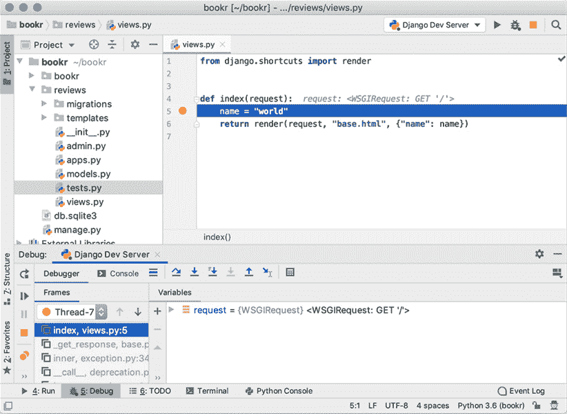

    图 1.45：调试器暂停，当前行（5）被高亮显示

1.  当前作用域中有一个变量，`request`。如果你点击其名称左侧的切换三角形，你可以显示或隐藏它设置的属性：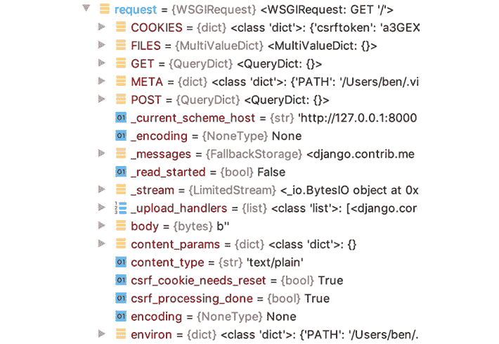

    图 1.46：request 变量的属性

    例如，如果你滚动通过属性列表，你可以看到方法是 `GET` 而路径是 `/`。

1.  *图 1.47* 中显示的操作栏位于堆栈帧和变量之上。其按钮（从左到右）如下所示：

    图 1.47：操作栏

    +   *Step Over*

        执行当前行代码并继续到下一行。

    +   *Step Into*

        进入当前行。例如，如果该行包含一个函数，它将在这个函数内部继续使用调试器。

    +   *Step Into My Code*

        进入正在执行的行，但继续执行直到找到你编写的代码。例如，如果你进入第三方库代码，稍后调用你的代码，它将不会显示第三方代码，而是继续执行直到返回到你编写的代码。

    +   *Force Step Into*

        进入通常不会进入的代码，例如 Python 标准库代码。这仅在少数情况下可用，并且通常不使用。

    +   *Step Out*

        从当前代码返回到调用它的函数或方法。与 *Step In* 动作相反。

    +   *Run To Cursor*

        如果你有一行代码在你当前所在位置之后，你想执行而不必点击 *Step Over* 之间的所有行，请将光标移到该行。然后，点击 *Run To Cursor*，执行将继续到该行。

        注意，并非所有按钮在所有时候都很有用。例如，很容易从你的视图中退出，并最终混淆 Django 库代码。

1.  点击一次 *Step Over* 按钮来执行第 5 行\.

1.  你可以看到 `name` 变量已经被添加到调试器视图中的变量列表中，其值为 `world`：

    图 1.48：新的名称变量现在在作用域内，其值为 world

1.  我们现在到达了 `index` 视图函数的末尾，如果我们继续执行此行代码，它将跳转到 Django 库代码，而我们不想看到这些代码。要继续执行并将响应发送回浏览器，请点击窗口左侧的 `Resume Program` 按钮(*图 1.49*)。你应该看到浏览器已经重新加载了页面：

    图 1.49：控制执行的动作——绿色播放图标是 Resume Program 按钮

    在 *图 1.49* 中还有更多按钮；从上到下，它们是 `Rerun`（停止程序并重新启动），`Resume Program`（继续运行直到下一个断点），`Pause Program`（在当前执行点中断程序），`Stop`（停止调试器），`View Breakpoints`（打开一个窗口以查看你设置的断点），和 `Mute Breakpoints`（将切换所有断点的开或关，但不会删除它们）。

1.  现在，通过点击它（第 5 行旁边的红色圆圈）在 PyCharm 中关闭断点：

图 1.50：点击位于第 5 行的断点可以禁用它

这只是对如何在 PyCharm 中设置断点的快速介绍。如果你在其他 IDE 中使用过调试功能，那么你应该熟悉这些概念——你可以逐行执行代码，进入和退出函数，或者评估表达式。一旦设置了断点，你可以右键单击它来更改选项。例如，你可以使断点条件化，以便仅在特定情况下停止执行。所有这些内容都超出了本书的范围，但在尝试解决代码中的问题时了解这些是有用的。

## 活动 1.01：创建站点欢迎屏幕

我们正在构建的 Bookr 网站需要一个欢迎页面，欢迎用户并告知他们所在的网站。它还将包含到网站其他部分的链接，但这些将在后面的章节中添加。现在，你将创建一个带有欢迎信息的页面。

这些步骤将帮助你完成活动：

1.  在你的`index`视图中，渲染`base.html`模板。

1.  更新`base.html`模板以包含欢迎信息。它应位于`<head>`中的`<title>`标签和正文中新的`<h1>`标签中。

    完成活动后，你应该能看到类似这样的内容：

    ![图 1.51：Bookr 欢迎页面

    ![图片 B15509_01_51.jpg]

图 1.51：Bookr 欢迎页面

注意

本活动的解决方案可以在[`packt.live/2Nh1NTJ`](http://packt.live/2Nh1NTJ)找到。

## 活动一.02：图书搜索框架

对于像 Bookr 这样的网站来说，一个有用的功能是能够搜索数据以快速找到网站上的内容。Bookr 将实现图书搜索功能，允许用户通过书籍标题的一部分来查找特定的书籍。虽然我们目前还没有任何书籍可以查找，但我们仍然可以实施一个显示用户搜索文本的页面。用户将搜索字符串作为 URL 参数的一部分输入。我们将在*第六章*，*表单*中实现搜索和一个易于文本输入的表单。

这些步骤将帮助你完成活动：

1.  创建一个搜索结果 HTML 模板。它应该包含一个变量占位符，以显示通过渲染上下文传递的搜索词。在`<title>`和`<h1>`标签中显示传递的变量。在正文中使用`<em>`标签包围搜索文本，使其变为斜体。

1.  在`views.py`中添加一个搜索视图函数。该视图应从 URL 参数（请求的`GET`属性）中读取搜索字符串。然后，它应该渲染你在上一步创建的模板，传递要替换的搜索值，使用上下文字典。

1.  将新视图的 URL 映射添加到`urls.py`文件中。URL 可以是类似`/book-search`的内容。

完成此活动后，你应该能够通过 URL 的参数传递一个搜索值，并在结果页面上看到它被渲染。它应该看起来像这样：

![图 1.52：搜索使用 Django 进行 Web 开发

![图片 B15509_01_52.jpg]

图 1.52：搜索使用 Django 进行 Web 开发

你还应该能够传递特殊 HTML 字符，如`<`和`>`，以查看 Django 如何在模板中自动转义它们：

![图 1.53：注意 HTML 字符是如何被转义的，这样我们就可以防止标签注入

![图片 B15509_01_53.jpg]

图 1.53：注意 HTML 字符是如何被转义的，这样我们就可以防止标签注入

注意

本活动的解决方案可以在[`packt.live/2Nh1NTJ`](http://packt.live/2Nh1NTJ)找到。

你已经构建了图书搜索视图，可以展示如何从`GET`参数中读取变量。你还可以使用此视图来测试 Django 如何在模板中自动转义特殊 HTML 字符。搜索视图实际上还没有搜索或显示结果，因为数据库中没有书籍，但这一点将在*第六章*，*表单*中添加。

# 摘要

本章简要介绍了 Django。你首先了解了 HTTP 协议以及 HTTP 请求和响应的结构。然后我们看到了 Django 如何使用 MVT 范式，以及它是如何解析 URL、生成 HTTP 请求并将其发送到视图以获取 HTTP 响应的。我们为 Bookr 项目搭建了框架，并为它创建了`reviews`应用。接着，我们构建了两个示例视图来展示如何从请求中获取数据并在渲染模板时使用它。你应该已经尝试过，看看 Django 在渲染模板时如何在 HTML 中转义输出。

你使用 PyCharm IDE 完成了所有这些，并学习了如何设置它以调试你的应用程序。调试器将帮助你找出为什么事情没有按预期工作。在下一章中，你将开始学习 Django 的数据库集成及其模型系统，这样你就可以开始为你的应用程序存储和检索真实数据了。
