# 第二章：2. 模型和迁移

概述

本章向您介绍数据库的概念及其在构建网络应用中的重要性。您将首先使用一个名为**SQLite DB Browser**的开源数据库可视化工具创建数据库。然后，您将使用 SQL 命令执行一些基本的**创建、读取、更新、删除**（**CRUD**）数据库操作。接着，您将学习 Django 的**对象关系映射**（**ORM**），使用它，您的应用程序可以使用简单的 Python 代码与关系型数据库无缝交互和工作，从而消除运行复杂 SQL 查询的需要。您将学习**模型**和**迁移**，它们是 Django ORM 的一部分，用于将数据库模式更改从应用程序传播到数据库，并执行数据库 CRUD 操作。在本章的末尾，您将研究各种类型的数据库关系，并利用这些知识对相关记录进行查询。

# 简介

数据是大多数网络应用的核心。除非我们谈论的是一个非常简单的应用，例如计算器，在大多数情况下，我们需要存储数据，处理它，并在页面上向用户展示。由于用户界面网络应用中的大多数操作都涉及数据，因此需要在安全、易于访问和随时可用的地方存储数据。这正是数据库发挥作用的地方。想象一下在计算机出现之前运作的图书馆。图书管理员必须维护书籍库存记录、书籍借阅记录、学生归还记录等等。所有这些都会在物理记录中维护。图书管理员在执行日常活动时，会为每个操作修改这些记录，例如，当向某人借书或书籍归还时。

今天，我们有数据库来帮助我们处理这样的管理任务。数据库看起来像是一个包含记录的电子表格或 Excel 表，其中每个表由多行和多列组成。一个应用程序可以有许多这样的表。以下是一个图书馆书籍库存表的示例：

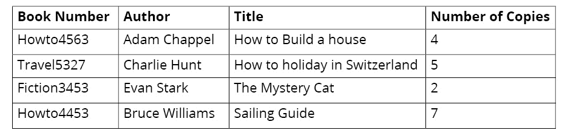

](img/B15509_02_01.jpg)

图 2.1：图书馆书籍库存表

在前面的表中，我们可以看到有关于图书馆中书籍各种属性的详细信息的列，而行包含每本书的条目。为了管理图书馆，可以有多个这样的表作为一个系统协同工作。例如，除了库存之外，我们可能还有其他表，如学生信息、书籍借阅记录等等。数据库是用相同的逻辑构建的，其中软件应用程序可以轻松地管理数据。

在上一章中，我们简要介绍了 Django 及其在开发 Web 应用程序中的应用。然后我们学习了模型-视图-模板（MVT）的概念。随后，我们创建了一个 Django 项目并启动了 Django 开发服务器。我们还简要讨论了 Django 的视图、URL 和模板。

在本章中，我们将首先学习数据库的类型以及使用 SQL 进行的一些基本数据库操作。之后，我们将继续学习 Django 中的模型和迁移概念，这些概念通过提供一层抽象来简化数据库操作，从而加速开发过程。

# 数据库

数据库是一个结构化的数据集合，有助于轻松管理信息。一个称为数据库管理系统（DBMS）的软件层用于存储、维护和执行数据操作。数据库分为两种类型：关系型数据库和非关系型数据库。

## 关系型数据库

关系型数据库或结构化查询语言（SQL）数据库将数据存储在预先确定的行和列结构中，这种结构称为表。一个数据库可以由多个这样的表组成，这些表具有固定的属性、数据类型和其他表之间的关系结构。例如，正如我们在 *图 2.1* 中所看到的，图书库存表具有由 **书号**、**作者**、**标题** 和 **副本数量** 组成的固定列结构，而条目则形成表中的行。也可能有其他表，例如 **学生信息** 和 **借阅记录**，这些表可能与库存表相关。此外，每当一本书借给学生时，记录将根据多个表之间的关系（例如，**学生信息** 和 **图书库存** 表）进行存储。

定义数据类型、表格结构和不同表之间关系的预定义规则结构类似于脚手架或数据库的蓝图。这个蓝图统称为数据库模式。当应用于数据库时，它将准备数据库以存储应用程序数据。为了管理和维护这些数据库，关系型数据库有一个通用的语言，称为 SQL。一些关系型数据库的例子包括 SQLite、PostgreSQL、MySQL 和 OracleDB。

## 非关系型数据库

非关系型数据库或 NoSQL（不仅限于 SQL）数据库旨在存储非结构化数据。它们非常适合大量生成的不遵循严格规则的数据，正如关系型数据库的情况一样。一些非关系型数据库的例子包括 Cassandra、MongoDB、CouchDB 和 Redis。

例如，假设你需要使用 Redis 在数据库中存储公司的股票价值。在这里，公司名称将被存储为键，股票价值将被存储为值。在这个用例中使用键值类型的 NoSQL 数据库是合适的，因为它为唯一的键存储了所需的价值，并且访问速度更快。

在本书的范围内，我们将只处理关系型数据库，因为 Django 官方不支持非关系型数据库。然而，如果你希望探索，有许多分支项目，如 Django non-rel，支持 NoSQL 数据库。

## 使用 SQL 进行数据库操作

SQL 使用一系列命令来执行各种数据库操作，如创建条目、读取值、更新条目和删除条目。这些操作统称为**CRUD 操作**，代表创建（Create）、读取（Read）、更新（Update）和删除（Delete）。为了详细了解数据库操作，让我们首先通过 SQL 命令获得一些实际操作经验。大多数关系型数据库共享类似的 SQL 语法；然而，某些操作可能会有所不同。

在本章的范围内，我们将使用 SQLite 作为数据库。SQLite 是一个轻量级的关系型数据库，它是 Python 标准库的一部分。这就是为什么 Django 将其作为默认数据库配置。然而，我们还将学习如何在*第十七章*，*Django 应用程序的部署（第一部分 - 服务器设置）*中执行配置更改以使用其他数据库。本章可以从本书的 GitHub 仓库中下载，从[`packt.live/2Kx6FmR`](http://packt.live/2Kx6FmR)。

## 关系型数据库中的数据类型

数据库为我们提供了一种限制给定列中可以存储的数据类型的方法。这些被称为数据类型。以下是一些关系型数据库（如 SQLite3）的数据类型示例：

+   `INTEGER` 用于存储整数。

+   `TEXT` 可以存储文本。

+   `REAL` 用于存储浮点数。

例如，你可能希望书的标题使用 `TEXT` 作为数据类型。因此，数据库将强制执行一条规则，即在该列中只能存储文本数据，而不能存储其他类型的数据。同样，书的定价可以使用 `REAL` 数据类型，等等。

## 练习 2.01：创建图书数据库

在这个练习中，你将为书评应用程序创建一个图书数据库。为了更好地可视化 SQLite 数据库中的数据，你将安装一个名为**DB Browser**的 SQLite 开源工具。此工具有助于可视化数据，并提供一个执行 SQL 命令的 shell。

如果你还没有这样做，请访问 URL [`sqlitebrowser.org`](https://sqlitebrowser.org)，并在*下载*部分根据你的操作系统安装应用程序并启动它。DB Browser 安装的详细说明可以在*前言*中找到。

注意

可以使用命令行 shell 执行数据库操作。

1.  启动应用程序后，通过点击应用程序左上角的“新建数据库”来创建一个新的数据库。创建一个名为 `bookr` 的数据库，因为你正在开发一个书评应用程序：![图 2.2：创建名为 bookr 的数据库

    ![img/B15509_02_02.jpg]

    图 2.2：创建名为 bookr 的数据库

1.  接下来，点击左上角的`创建表`按钮，输入表名为`book`。

    注意

    点击`保存`按钮后，你可能发现创建表的窗口会自动打开。在这种情况下，你不需要点击`创建表`按钮；只需按照前面步骤指定的方式继续创建图书表即可。

1.  现在，点击`添加字段`按钮，输入字段名为`title`，并从下拉菜单中选择类型为`TEXT`。在这里，`TEXT`是数据库中`title`字段的类型：![图 2.3：添加名为 title 的文本字段]

    ![图片 B15509_02_03.jpg]

    图 2.3：添加一个名为 title 的文本字段

1.  类似地，为名为`publisher`和`author`的表添加两个更多字段，并将两个字段的类型都选择为`TEXT`。然后，点击`确定`按钮：![图 2.4：创建名为 publisher 和 author 的文本字段]

    ![图片 B15509_02_04.jpg]

图 2.4：创建名为 publisher 和 author 的文本字段

这在`bookr`数据库中创建了一个名为`book`的数据库表，包含字段 title、publisher 和`author`。如下所示：

![图 2.5：包含字段 title、publisher 和 author 的数据库]

![图片 B15509_02_05.jpg]

![图 2.5：包含字段 title、publisher 和 author 的数据库]

在这个练习中，我们使用了一个名为 DB Browser（SQLite）的开源工具来创建我们的第一个数据库`bookr`，并在其中创建了我们第一个名为`book`的表。

# SQL CRUD 操作

假设我们的书评应用编辑器或用户想要对图书库存进行一些修改，例如向数据库中添加几本书，更新数据库中的条目等。SQL 提供了各种方式来执行此类 CRUD 操作。在我们深入 Django 模型和迁移的世界之前，让我们首先探索这些基本的 SQL 操作。

对于接下来的 CRUD 操作，你将运行几个 SQL 查询。要运行它们，导航到 DB Browser 中的`执行 SQL`标签页。你可以在`SQL 1`窗口中键入或粘贴我们在后续部分列出的 SQL 查询。在执行它们之前，你可以花些时间修改和了解这些查询。准备好后，点击看起来像播放按钮的图标或按 F5 键来执行命令。结果将显示在`SQL 1`窗口下面的窗口中：

![图 2.6：在 DB Browser 中执行 SQL 查询]

![图片 B15509_02_06.jpg]

![图 2.6：在 DB Browser 中执行 SQL 查询]

## SQL 创建操作

`insert`命令，正如其名所示，允许我们将数据插入到数据库中。让我们回到我们的`bookr`示例。由于我们已经创建了数据库和`book`表，我们现在可以通过执行以下命令在数据库中创建或插入一个条目：

```py
insert into book values ('The Sparrow Warrior', 'Super Hero   Publications', 'Patric Javagal');
```

这将把命令中定义的值插入到名为 `book` 的表中。在这里，`The Sparrow Warrior` 是标题，`Super Hero Publications` 是出版社，`Patric Javagal` 是这本书的作者。请注意，插入的顺序与我们创建表的方式相对应；也就是说，值分别插入到代表标题、出版社和作者的列中。同样，让我们执行另外两个插入操作以填充 `book` 表：

```py
insert into book values ('Ninja Warrior', 'East Hill Publications',   'Edward Smith');
insert into book values ('The European History', 'Northside   Publications', 'Eric Robbins');
```

到目前为止已执行了三个插入操作，将三个行插入到 `book` 表中。但我们如何验证这一点？我们如何知道我们插入的三个条目是否正确地输入到数据库中？让我们在下一节中学习如何做到这一点。

## SQL 读取操作

我们可以使用 `select` SQL 操作从数据库中读取。例如，以下 SQL `select` 命令检索在 `book` 表中创建的所选条目：

```py
select title, publisher, author from book;
```

你应该看到以下输出：

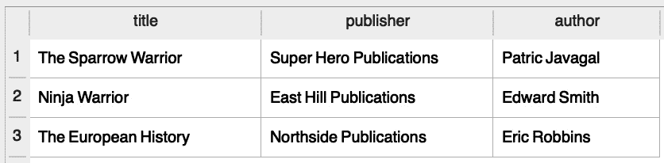

图 2.7：使用选择命令后的输出

这里，`select` 是从数据库中读取的命令，字段 `title`、`publisher` 和 `author` 是我们打算从书籍表中选择的列。由于这些列都是数据库中有的，所以选择语句返回了数据库中所有存在的值。选择语句也被称为 SQL 查询。另一种获取数据库中所有字段的方法是在选择查询中使用通配符 `*` 而不是明确指定所有列名：

```py
select * from book;
```

这将返回与前面图中所示相同的输出。现在，假设我们想获取名为《The Sparrow Warrior》的书的作者姓名；在这种情况下，`select` 查询将如下所示：

```py
select author from book where title="The Sparrow Warrior";
```

这里，我们添加了一个特殊的 SQL 关键字 `where`，以便 `select` 查询只返回与条件匹配的条目。查询的结果当然是 `Patric Javagal`。现在，如果我们想更改书的出版社的名称呢？

## SQL 更新操作

在 SQL 中，更新数据库中记录的方式是通过使用 `update` 命令：

```py
update book set publisher = 'Northside Publications' where   title='The Sparrow Warrior';
```

这里，我们设置出版社的值为 `Northside Publications`，如果标题的值为 `The Sparrow Warrior`。然后我们可以运行在 SQL 读取操作部分运行的 `select` 查询，以查看运行 `update` 命令后更新的表看起来如何：

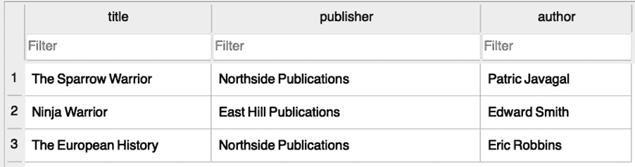

图 2.8：更新《The Sparrow Warrior》标题的出版社值

接下来，如果我们想删除刚刚更新的记录的标题呢？

## SQL 删除操作

这里是一个使用 `delete` 命令从数据库中删除记录的示例：

```py
delete from book where title='The Sparrow Warrior';
```

`delete`是 SQL 中用于删除操作的关键字。在这里，只有当标题为`The Sparrow Warrior`时，才会执行此操作。以下是删除操作后书籍表的外观：

![图 2.9：执行删除操作后的输出]

![图 2.9：执行删除操作后的输出]

![图 2.9：执行删除操作后的输出]

这些是 SQL 的基本操作。我们不会深入探讨所有的 SQL 命令和语法，但你可以自由探索使用 SQL 进行数据库基础操作的相关内容。

注意

为了进一步学习，你可以从探索一些使用`join`语句的高级 SQL `select`操作开始，这些操作用于查询多个表中的数据。有关 SQL 的详细课程，你可以参考*The SQL Workshop* ([`www.packtpub.com/product/the-sql-workshop/9781838642358`](https://www.packtpub.com/product/the-sql-workshop/9781838642358))。

## Django ORM

网络应用程序不断与数据库进行交互，其中一种方式就是使用 SQL。如果你决定不使用像 Django 这样的网络框架，而是单独使用 Python 来编写网络应用程序，那么可以使用 Python 库如`psycopg2`来直接使用 SQL 命令与数据库进行交互。但在开发包含多个表和字段的网络应用程序时，SQL 命令可能会变得过于复杂，从而难以维护。因此，像 Django 这样的流行网络框架提供了抽象层，使我们能够轻松地与数据库进行交互。Django 中帮助我们完成这一功能的部分被称为**ORM**，即**对象关系映射**。

Django ORM 将面向对象的 Python 代码转换为实际的数据库结构，如具有数据类型定义的数据库表，并通过简单的 Python 代码简化所有数据库操作。正因为如此，我们在执行数据库操作时无需处理 SQL 命令。这有助于加快应用程序的开发速度，并简化应用程序源代码的维护。

Django 支持关系型数据库，如 SQLite、PostgreSQL、Oracle 数据库和 MySQL。Django 的数据库抽象层确保了相同的 Python/Django 源代码可以在上述任何关系型数据库上使用，只需对项目设置进行很少的修改。由于 SQLite 是 Python 库的一部分，并且 Django 默认配置为 SQLite，因此在本章的学习过程中，我们将使用 SQLite 来了解 Django 模型和迁移。

## 数据库配置和创建 Django 应用程序

正如我们在*第一章*，*Django 简介*中已经看到的，当我们创建 Django 项目并运行 Django 服务器时，默认的数据库配置是 SQLite3。数据库配置将位于项目目录中的`settings.py`文件中。

注意

确保您仔细阅读`bookr`应用的`settings.py`文件。通读整个文件一次将有助于您理解后续的概念。您可以通过此链接找到文件：[`packt.live/2KEdaUM`](http://packt.live/2KEdaUM)。

因此，对于我们的示例项目，数据库配置将位于以下位置：`bookr/settings.py`。当创建 Django 项目时，该文件中默认的数据库配置如下：

```py
DATABASES = {\
             'default': {\
                         'ENGINE': 'django.db.backends.sqlite3',\
                         'NAME': os.path.join\
                                 (BASE_DIR, 'db.sqlite3'),}}
```

注意

前面的代码片段使用反斜杠（\）将逻辑拆分到多行。当代码执行时，Python 将忽略反斜杠，并将下一行的代码视为当前行的直接延续。

`DATABASES`变量被分配了一个包含项目数据库详细信息的字典。在字典中，有一个嵌套字典，其键为`default`。这包含了 Django 项目的默认数据库配置。我们使用带有`default`键的嵌套字典的原因是，Django 项目可能需要与多个数据库交互，而默认数据库是 Django 在所有操作中默认使用的数据库，除非明确指定。`ENGINE`键表示正在使用哪个数据库引擎；在这种情况下，它是`sqlite3`。

`NAME`键定义了数据库的名称，可以有任何值。但对于 SQLite3，由于数据库是以文件形式创建的，因此`NAME`可以包含需要创建文件的目录的完整路径。`db`文件的完整路径是通过将`BASE_DIR`中定义的先前路径与`db.sqlite3`连接（或连接）来处理的。请注意，`BASE_DIR`是在`settings.py`文件中已定义的项目目录。

如果您使用其他数据库，例如 PostgreSQL、MySQL 等，则需要在此前的数据库设置中进行更改，如下所示：

```py
DATABASES = {\
             'default': {\
                         'ENGINE': 'django.db\
                                    .backends.postgresql',\
                         'NAME': 'bookr',\
                         'USER': <username>,\
                         'PASSWORD': <password>,\
                         'HOST': <host-IP-address>,\
                         'PORT': '5432',}}
```

在这里，已对`ENGINE`进行了更改以使用 PostgreSQL。需要分别提供服务器的 IP 地址和端口号作为`HOST`和`PORT`。正如其名称所暗示的，`USER`是数据库用户名，`PASSWORD`是数据库密码。除了配置更改外，我们还需要安装数据库驱动程序或绑定，包括数据库主机和凭证。这将在后面的章节中详细说明，但就目前而言，由于我们正在使用 SQLite3，默认配置就足够了。请注意，上面的只是一个示例，以展示您需要为使用不同的数据库（如 PostgreSQL）所做的更改，但由于我们正在使用 SQLite，我们将使用现有的数据库配置，并且不需要对数据库设置进行任何修改。

## Django 应用

一个 Django 项目可以有多个应用程序，这些应用程序通常作为独立的实体。这就是为什么，在需要时，一个应用程序也可以插入到不同的 Django 项目中。例如，如果我们正在开发一个电子商务网络应用程序，该网络应用程序可以有多个应用程序，例如用于客户支持的聊天机器人或用于接受用户从应用程序购买商品时的支付网关。如果需要，这些应用程序也可以插入到或在不同项目中重用。

Django 默认启用了以下应用程序。以下是从一个项目的 `settings.py` 文件中摘录的一段内容：

```py
INSTALLED_APPS = ['django.contrib.admin',\
                  'django.contrib.auth',\
                  'django.contrib.contenttypes',\
                  'django.contrib.sessions',\
                  'django.contrib.messages',\
                  'django.contrib.staticfiles',]
```

这些是一组用于管理站点、身份验证、内容类型、会话、消息传递以及用于收集和管理静态文件的应用程序。在接下来的章节中，我们将深入研究这些内容。然而，在本章范围内，我们将了解为什么 Django 迁移对于这些已安装的应用程序是必要的。

## Django 迁移

如我们之前所学的，Django 的 ORM 有助于使数据库操作更简单。操作的主要部分是将 Python 代码转换为数据库结构，如具有指定数据类型的数据库字段和表。换句话说，将 Python 代码转换为数据库结构称为 *Exercise 2.01*，*创建一个图书数据库*）中的 *第 4 步* 的 `TEXT`。

由于我们已经设置了 Django 项目，让我们执行第一次迁移。尽管我们还没有向项目中添加任何代码，但我们仍然可以迁移 `INSTALLED_APPS` 中列出的应用程序。这是必要的，因为 Django 安装的程序需要将相关数据存储在数据库中以供其操作，迁移将创建所需的数据库表以在数据库中存储数据。为此，应在终端或 shell 中输入以下命令：

```py
python manage.py migrate
```

注意

对于 macOS，您可以在上述命令中使用 `python3` 而不是 `python`。

在这里，`manage.py` 是在创建项目时自动创建的脚本。它用于执行管理或行政任务。通过执行此命令，我们创建所有已安装应用程序所需的数据库结构。

由于我们正在使用 DB Browser for SQLite 浏览数据库，让我们看一下执行 `migrate` 命令后已更改的数据库。

数据库文件将在项目目录下以 `db.sqlite3` 的名称创建。打开 DB Browser，点击 `Open Database`，导航直到找到 `db.sqlite3` 文件，然后打开它。您应该会看到由 Django 迁移创建的一组新表。在 DB Browser 中看起来如下：

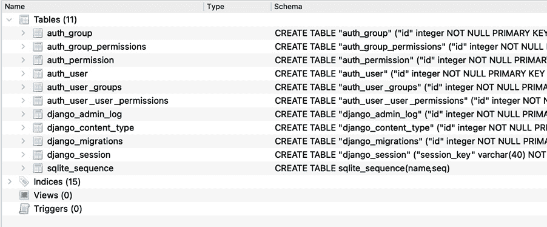

图 2.10：db.sqlite3 文件的内容

现在，如果我们通过点击数据库表浏览新创建的数据库结构，我们会看到以下内容：

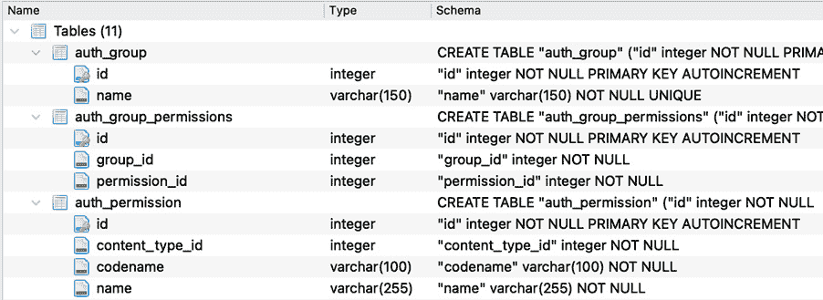

图 2.11：浏览新创建的数据库结构

注意到创建的数据库表有不同的字段，每个字段都有其对应的数据类型。在 DB Browser 中点击`浏览数据`标签页，并从下拉菜单中选择一个表。例如，在点击`auth_group_permissions`表后，您应该看到类似以下的内容：

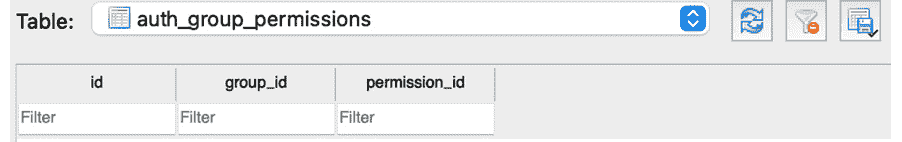

图 2.12：查看 auth_group_permissions 表

您会看到这些表还没有数据，因为 Django 迁移只创建数据库结构或蓝图，而实际数据是在应用程序运行期间存储在数据库中的。现在，既然我们已经迁移了内置或默认的 Django 应用程序，让我们尝试创建一个应用程序并执行 Django 迁移。

## 创建 Django 模型和迁移

Django 模型本质上是一个 Python 类，它包含了在数据库中创建表的蓝图。`models.py`文件可以包含许多这样的模型，每个模型都会转换成一个数据库表。类的属性根据模型定义形成了数据库表的字段和关系。

对于我们的评论应用程序，我们需要创建以下模型及其相应的数据库表：

+   书籍：这个模型应该存储关于书籍的信息。

+   贡献者：这个模型应该存储关于为书籍写作的个人（如作者、合著者或编辑）的信息。

+   出版社：正如其名所示，这指的是书籍的出版社。

+   评论：这个模型应该存储应用程序用户所写的所有书籍评论。

在我们的应用程序中，每本书都需要有一个出版社，因此让我们创建`Publisher`作为我们的第一个模型。在`reviews/models.py`中输入以下代码：

```py
from django.db import models
class Publisher(models.Model):
    """A company that publishes books."""
    name = models.CharField\
           (max_length=50, \
            help_text="The name of the Publisher.")
    website = models.URLField\
              (help_text="The Publisher's website.")
    email = models.EmailField\
            (help_text="The Publisher's email address.")
```

注意

您可以通过点击以下链接查看 bookr 应用程序的完整`models.py`文件：[`packt.live/3hmFQxn`](http://packt.live/3hmFQxn)。

代码的第一行导入了 Django 的`models`模块。虽然这一行将在创建 Django 应用程序时自动生成，但请确保如果它不存在，您已经添加了它。在导入之后，其余的代码定义了一个名为`Publisher`的类，它将是 Django 的`models.Model`的子类。此外，这个类将具有名称、网站和电子邮件等属性或字段。

## 字段类型

如我们所见，每个字段都被定义为以下类型：

+   `CharField`：这种字段类型用于存储较短的字符串字段，例如，Packt Publishing。对于非常长的字符串，我们使用`TextField`。

+   `EmailField`：这与`CharField`类似，但会验证字符串是否代表一个有效的电子邮件地址，例如，customersupport@packtpub.com。

+   `URLField`：这又类似于`CharField`，但会验证字符串是否代表一个有效的 URL，例如，[`www.packtpub.com`](https://www.packtpub.com)。

## 字段选项

Django 提供了一种为模型字段定义字段选项的方法。这些字段选项用于设置值或约束等。例如，我们可以使用`default=<value>`为字段设置默认值，以确保每次在数据库中为该字段创建记录时，它都被设置为指定的默认值。以下是我们定义`Publisher`模型时使用的两个字段选项：

+   `help_text`：这是一个字段选项，帮助我们为字段添加描述性文本，该文本会自动包含在 Django 表单中。

+   `max_length`：此选项提供给了`CharField`，其中它定义了字段以字符数表示的最大长度。

Django 有许多更多的字段类型和字段选项，可以在广泛的官方 Django 文档中进行探索。随着我们开发我们的示例书评应用程序，我们将了解用于项目的那些类型和字段。现在让我们将 Django 模型迁移到数据库中。在 shell 或终端中执行以下命令以完成此操作（从存储`manage.py`文件的文件夹中运行）：

```py
python manage.py makemigrations reviews
```

命令的输出如下：

```py
Migrations for 'reviews':
  reviews/migrations/0001_initial.py
    - Create model Publisher
```

`makemigrations <appname>`命令为给定的应用创建迁移脚本；在这种情况下，为 reviews 应用。注意，在运行 makemigrations 之后，在`migrations`文件夹下创建了一个新文件：

![图 2.13：在 migrations 文件夹下创建的新文件

![图 2.13：在 migrations 文件夹下创建的新文件

图 2.13：在 migrations 文件夹下创建的新文件

这是 Django 创建的迁移脚本。当我们运行不带应用名称的`makemigrations`时，将为项目中的所有应用创建迁移脚本。接下来，让我们列出项目的迁移状态。记住，之前我们为 Django 已安装的应用程序应用了迁移，现在我们创建了一个新的应用，reviews。以下命令在 shell 或终端中运行时，将显示整个项目中模型迁移的状态（从存储`manage.py`文件的文件夹中运行）：

```py
python manage.py showmigrations
```

前一个命令的输出如下：

```py
admin
 [X] 0001_initial
 [X] 0002_logentry_remove_auto_add
 [X] 0003_logentry_add_action_flag_choices
auth
 [X] 0001_initial
 [X] 0002_alter_permission_name_max_length
 [X] 0003_alter_user_email_max_length
 [X] 0004_alter_user_username_opts
 [X] 0005_alter_user_last_login_null
 [X] 0006_require_contenttypes_0002
 [X] 0007_alter_validators_add_error_messages
 [X] 0008_alter_user_username_max_length
 [X] 0009_alter_user_last_name_max_length
 [X] 0010_alter_group_name_max_length
 [X] 0011_update_proxy_permissions
contenttypes
 [X] 0001_initial
 [X] 0002_remove_content_type_name
reviews
 [ ] 0001_initial
sessions
 [X] 0001_initial
```

这里，`[X]`标记表示迁移已经应用。注意，除了 reviews 之外，所有其他应用的迁移都已应用。可以使用`showmigrations`命令来了解迁移状态，但在执行模型迁移时这不是一个强制性的步骤。

接下来，让我们了解 Django 如何将模型转换为实际的数据库表。这可以通过运行`sqlmigrate`命令来理解：

```py
python manage.py sqlmigrate reviews 0001_initial 
```

我们应该看到以下输出：

```py
BEGIN;
--
-- Create model Publisher
--
CREATE TABLE "reviews_publisher" ("id" integer \
    NOT NULL PRIMARY KEY AUTOINCREMENT, "name" \
    varchar(50) NOT NULL, "website" varchar(200) \
    NOT NULL, "email" varchar(254) NOT NULL);
COMMIT;
```

前面的代码片段显示了当 Django 迁移数据库时使用的 SQL 命令等效。在这种情况下，我们正在创建一个名为 `reviews_publisher` 的表，包含名称、网站和电子邮件字段，并定义了相应的字段类型。此外，所有这些字段都被定义为 `NOT NULL`，这意味着这些字段的条目不能为空，应该有一些值。在执行模型迁移时，`sqlmigrate` 命令不是必须的步骤。

## 主键

假设有一个名为 users 的数据库表，正如其名称所暗示的，它存储有关用户的信息。假设它有超过 1,000 条记录，并且至少有 3 个用户的名字叫 Joe Burns。我们如何从应用程序中唯一地识别这些用户呢？解决方案是找到一种方法来唯一地识别数据库中的每条记录。这是通过使用 `id` 作为主键（整数类型）来实现的，它在创建新记录时会自动递增。

在上一节中，注意 `python manage.py sqlmigrate` 命令的输出。在创建 `Publisher` 表时，`SQL CREATE TABLE` 命令向表中添加了一个额外的字段，称为 `id`。`id` 被定义为 `PRIMARY KEY AUTOINCREMENT`。在关系型数据库中，主键用于在数据库中唯一地标识一个条目。例如，书籍表有 `id` 作为主键，其数字从 1 开始。这个值在新记录创建时会递增 1。`id` 的整数值在书籍表中总是唯一的。由于迁移脚本已经通过执行 makemigrations 被创建，现在让我们通过执行以下命令来迁移 reviews 应用程序中新建的模型：

```py
python manage.py migrate reviews
```

你应该得到以下输出：

```py
Operations to perform:
    Apply all migrations: reviews
Running migrations:
    Applying reviews.0001_initial... OK
```

这个操作创建了 reviews 应用的数据库表。以下是从 DB Browser 中摘录的片段，表明新表 `reviews_publisher` 已在数据库中创建：

![图 2.14：执行迁移命令后创建的 reviews_publisher 表]

![img/B15509_02_14.jpg]

图 2.14：执行迁移命令后创建的 reviews_publisher 表

到目前为止，我们已经探讨了如何创建一个模型并将其迁移到数据库中。现在让我们着手创建我们书籍评论应用程序的其余模型。正如我们已经看到的，应用程序将具有以下数据库表：

+   `Book`：这是包含关于书籍本身信息的数据库表。我们已创建了一个 `Book` 模型并将其迁移到数据库中。

+   `Publisher`：这个表包含有关书籍出版者的信息。

+   `Contributor`：这个表包含有关贡献者（即作者、合著者或编辑）的信息。

+   `Review`：这个表包含由评论者发布的评论信息。

让我们将 `Book` 和 `Contributor` 模型，如以下代码片段所示，添加到 `reviews/models.py` 中：

```py
class Book(models.Model):
    """A published book."""
    title = models.CharField\
            (max_length=70, \
             help_text="The title of the book.")
    publication_date = models.DateField\
                       (verbose_name=\
                        "Date the book was published.")
    isbn = models.CharField\
           (max_length=20, \
            verbose_name="ISBN number of the book.")
class Contributor(models.Model):
"""
A contributor to a Book, e.g. author, editor, \
co-author.
"""
  first_names = models.CharField\
                (max_length=50, \
                 help_text=\
                 "The contributor's first name or names.")
    last_names = models.CharField\
                 (max_length=50, \
                  help_text=\
                  "The contributor's last name or names.")
    email = models.EmailField\
            (help_text="The contact email for the contributor.")
```

代码是自我解释的。`Book`模型有标题、出版日期和 isbn 字段。`Contributor`模型有`first_names`和`last_names`字段以及贡献者的电子邮件 ID。还有一些新添加的模型，除了我们在`Publisher`模型中看到的外。它们有一个新的字段类型`DateField`，正如其名所示，用于存储日期。还有一个名为`verbose_name`的新字段选项也被使用。它为字段提供了一个描述性名称。

# 关系

关系型数据库的一项强大功能是能够在数据库表间建立数据关系。通过在表间建立正确的引用，关系有助于维护数据完整性，进而帮助维护数据库。另一方面，关系规则确保数据一致性并防止重复。

在关系型数据库中，可能存在以下类型的关联：

+   多对一

+   多对多

+   一对一

让我们详细探讨每种关系。

## 多对一

在这种关系中，一个表中的多个记录（行/条目）可以引用另一个表中的一个记录（行/条目）。例如，可以有一个出版社出版多本书。这是一个多对一关系的例子。为了建立这种关系，我们需要使用数据库的外键。关系型数据库中的外键在一个表中的字段与另一个表的主键之间建立关系。

例如，假设你有一个存储在名为`employee_info`的表中的员工数据，该表以员工 ID 作为主键，并包含一个存储部门名称的列；此表还包含一个存储该部门 ID 的列。现在，还有一个名为`departments_info`的表，其中部门 ID 作为主键。在这种情况下，部门 ID 是`employee_info`表的外键。

在我们的`bookr`应用中，`Book`模型可以有一个外键引用`Publisher`表的主键。由于我们已创建了`Book`、`Contributor`和`Publisher`的模型，现在让我们在`Book`和`Publisher`模型之间建立多对一关系。对于`Book`模型，添加最后一行：

```py
class Book(models.Model):
    """A published book."""
    title = models.CharField\
            (max_length=70, \
             help_text="The title of the book.")
    publication_date = models.DateField\
                       (verbose_name=\
                        "Date the book was published.")
    isbn = models.CharField\
           (max_length=20, \
            verbose_name="ISBN number of the book.")
    publisher = models.ForeignKey\
                (Publisher, on_delete=models.CASCADE)
```

现在新增的`publisher`字段正在使用外键在`Book`和`Publisher`之间建立多对一关系。这种关系确保了多对一关系的性质，即多本书可以有一个出版商：

+   `models.ForeignKey`：这是用于建立多对一关系的字段选项。

+   `Publisher`：当我们与 Django 中的不同表建立关系时，我们指的是创建表的模型；在这种情况下，`Publisher`表是由`Publisher`模型（或 Python 类 Publisher）创建的。

+   `on_delete`: 这是一个字段选项，用于确定在删除引用对象时要采取的操作。在这种情况下，`on_delete` 选项设置为 `CASCADE(models.CASCADE)`，这将删除引用对象。

例如，假设一个出版社出版了一系列书籍。由于某种原因，如果需要从应用程序中删除该出版社，则下一步操作是 CASCADE，这意味着从应用程序中删除所有引用的书籍。还有许多其他的 `on_delete` 操作，例如以下内容：

+   `PROTECT`: 这防止删除记录，除非所有引用对象都被删除。

+   `SET_NULL`: 如果数据库字段之前已配置为存储空值，则此操作将设置一个空值。

+   `SET_DEFAULT`: 在删除引用对象时设置为默认值。

对于我们的书评应用程序，我们将仅使用 CASCADE 选项。

# 多对多

在这种关系中，一个表中的多个记录可以与另一个表中的多个记录建立关系。例如，一本书可以有多个合著者，而每位作者（贡献者）可能都写过多本书。因此，这形成了 `Book` 和 `Contributor` 表之间的多对多关系：


图 2.15：书籍与合著者之间的多对多关系

在 `models.py` 中，对于 Book 模型，添加如下所示的最后一条线：

```py
class Book(models.Model):
    """A published book."""
    title = models.CharField\
            (max_length=70, \
             help_text="The title of the book.")
    publication_date = models.DateField\
                       (verbose_name=\
                        "Date the book was published.")
    isbn = models.CharField\
           (max_length=20, \
            verbose_name="ISBN number of the book.")
    publisher = models.ForeignKey\
                (Publisher, on_delete=models.CASCADE)
    contributors = models.ManyToManyField\
                   ('Contributor', through="BookContributor")
```

新增的贡献者字段通过使用 ManyToManyField 字段类型与书籍和贡献者建立了多对多关系：

+   `models.ManyToManyField`: 这是用于建立多对多关系的字段类型。

+   `through`: 这是多对多关系的一个特殊字段选项。当我们有两个表之间的多对多关系时，如果我们想存储关于关系的额外信息，则可以使用此选项通过中介表建立关系。

例如，我们有两个表，即 `Book` 和 `Contributor`，我们需要存储关于书籍贡献者类型的信息，如作者、合著者或编辑。然后贡献者类型存储在一个称为 `BookContributor` 的中介表中。以下是 `BookContributor` 表/模型的外观。确保您将此模型包含在 `reviews/models.py` 中：

```py
class BookContributor(models.Model):
    class ContributionRole(models.TextChoices):
        AUTHOR = "AUTHOR", "Author"
        CO_AUTHOR = "CO_AUTHOR", "Co-Author"
        EDITOR = "EDITOR", "Editor"
    book = models.ForeignKey\
           (Book, on_delete=models.CASCADE)
    contributor = models.ForeignKey\
                  (Contributor, \
                   on_delete=models.CASCADE)
    role = models.CharField\
           (verbose_name=\
            "The role this contributor had in the book.", \
            choices=ContributionRole.choices, max_length=20)
```

备注

完整的 `models.py` 文件可以在此链接查看：[`packt.live/3hmFQxn`](http://packt.live/3hmFQxn)。

一个中介表，如 `BookContributor`，通过使用到 `Book` 和 `Contributor` 表的外键来建立关系。它还可以有额外的字段，可以存储关于 `BookContributor` 模型与以下字段之间的关系的信息：

+   `book`: 这是到 `Book` 模型的外键。正如我们之前所看到的，`on_delete=models.CASCADE` 将在应用程序中删除相关书籍时从关系表中删除一个条目。

+   `Contributor`: 这又是 `Contributor` 模型/表的另一个外键。在删除时也定义为 `CASCADE`。

+   `role`: 这是中间模型字段，它存储关于 `Book` 和 `Contributor` 之间关系的额外信息。

+   `class ContributionRole(models.TextChoices)`: 这可以通过创建 `models.TextChoices` 的子类来定义一组选择。例如，`ContributionRole` 是从 `TextChoices` 创建的子类，它用于 roles 字段，将作者、合著者和编辑定义为一组选择。

+   `choices`: 这指的是在模型中定义的一组选择，当使用模型创建 Django `Forms` 时非常有用。

    注意

    当在建立多对多关系时没有提供 through 字段选项，Django 会自动创建一个中间表来管理关系。

## 一对一关系

在这种关系中，一个表中的一个记录将只引用另一个表中的一个记录。例如，一个人只能有一个驾照，因此一个人和他们的驾照可以形成一对一关系：


图 2.16：一对一关系的示例

OneToOneField 可以用来建立一对一关系，如下所示：

```py
class DriverLicence(models.Model):
    person = models.OneToOneField\
             (Person, on_delete=models.CASCADE)
    licence_number = models.CharField(max_length=50)
```

既然我们已经探讨了数据库关系，让我们回到我们的 bookr 应用程序，并添加一个额外的模型。

## 添加评论模型

我们已经将 `Book` 和 `Publisher` 模型添加到了 `reviews/models.py` 文件中。我们将要添加的最后一个模型是 `Review` 模型。以下代码片段应该能帮助我们完成这项工作：

```py
from django.contrib import auth
class Review(models.Model):
    content = models.TextField\
              (help_text="The Review text.")
    rating = models.IntegerField\
             (help_text="The rating the reviewer has given.")
    date_created = models.DateTimeField\
                   (auto_now_add=True, \
                    help_text=\
                    "The date and time the review was created.")
    date_edited = models.DateTimeField\
                  (null=True, \
                   help_text=\
                   "The date and time the review was last edited.")
    creator = models.ForeignKey\
              (auth.get_user_model(), on_delete=models.CASCADE)
    book = models.ForeignKey\
           (Book, on_delete=models.CASCADE, \
            help_text="The Book that this review is for.")
```

注意

完整的 `models.py` 文件可以在以下链接查看：[`packt.live/3hmFQxn`](http://packt.live/3hmFQxn)。

`review` 模型/表将用于存储用户提供的书籍评论和评分。它有以下字段：

+   `content`: 此字段存储书籍评论的文本，因此使用的字段类型是 `TextField`，因为它可以存储大量文本。

+   `rating`: 此字段存储书籍的评论评分。由于评分将是一个整数，因此使用的字段类型是 `IntegerField`。

+   `date_created`: 此字段存储评论被撰写的时间和日期，因此字段类型是 `DateTimeField`。

+   `date_edited`: 此字段存储每次编辑评论时的日期和时间。字段类型再次是 `DateTimeField`。

+   `Creator`: 此字段指定评论创建者或撰写书评的人。请注意，这是一个指向 `auth.get_user_model()` 的外键，它引用了 Django 内置认证模块中的 `User` 模型。它有一个字段选项 `on_delete=models.CASCADE`。这解释了当从数据库中删除用户时，该用户所写的所有评论也将被删除。

+   `Book`：评论有一个名为`book`的字段，它是`Book`模型的外键。这是因为对于评论应用，评论必须被撰写，一本书可以有多个评论，所以这是一个多对一的关系。这也通过字段选项`on_delete=models.CASCADE`定义，因为一旦删除书籍，保留应用中的评论就没有意义了。所以，当删除书籍时，所有引用该书籍的评论也将被删除。

## 模型方法

在 Django 中，我们可以在模型类内部编写方法。这些被称为`__str__()`。此方法返回`Model`实例的字符串表示形式，在使用 Django shell 时特别有用。在以下示例中，当`__str__()`方法添加到`Publisher`模型时，`Publisher`对象的字符串表示形式将是出版商的名称：

```py
class Publisher(models.Model):
    """A company that publishes books."""
    name = models.CharField\
           (max_length=50, \
            help_text="The name of the Publisher.")
    website = models.URLField\
              (help_text="The Publisher's website.")
    email = models.EmailField\
            (help_text="The Publisher's email address.")
    def __str__(self):
        return self.name
```

还要将`_str_()`方法添加到`Contributor`和`Book`中，如下所示：

```py
class Book(models.Model):
    """A published book."""
    title = models.CharField\
            (max_length=70, \
             help_text="The title of the book.")
    publication_date = models.DateField\
                       (verbose_name=\
                        "Date the book was published.")
    isbn = models.CharField\
           (max_length=20, \
            verbose_name="ISBN number of the book.")
    publisher = models.ForeignKey\
                (Publisher, \
                 on_delete=models.CASCADE)
    contributors = models.ManyToManyField\
                   ('Contributor', through="BookContributor")
    def __str__(self):
        return self.title
class Contributor(models.Model):
"""
A contributor to a Book, e.g. author, editor, \
co-author.
"""
    first_names = models.CharField\
                  (max_length=50, \
                   help_text=\
                   "The contributor's first name or names.")
    last_names = models.CharField\
                 (max_length=50, \
                  help_text=\
                  "The contributor's last name or names.")
    email = models.EmailField\
            (help_text=\
             "The contact email for the contributor.")
    def __str__(self):
        return self.first_names
```

## 迁移评论应用

由于我们已经准备好了整个模型文件，现在让我们将模型迁移到数据库中，就像我们之前对已安装的应用程序所做的那样。由于评论应用有一组我们创建的模型，在运行迁移之前，创建迁移脚本非常重要。迁移脚本有助于识别模型中的任何更改，并在运行迁移时将这些更改传播到数据库中。执行以下命令以创建迁移脚本：

```py
python manage.py makemigrations reviews
```

你应该得到类似以下输出：

```py
  reviews/migrations/0002_auto_20191007_0112.py
    - Create model Book
    - Create model Contributor
    - Create model Review
    - Create model BookContributor
    - Add field contributors to book
    - Add field publisher to book
```

迁移脚本将在应用程序文件夹中名为`migrations`的文件夹中创建。接下来，使用`migrate`命令将所有模型迁移到数据库中：

```py
python manage.py migrate reviews
```

你应该看到以下输出：

```py
Operations to perform:
  Apply all migrations: reviews
Running migrations:
  Applying reviews.0002_auto_20191007_0112... OK
```

执行此命令后，我们已经成功创建了`reviews`应用中定义的数据库表格。你可以在迁移后使用 DB Browser for SQLite 来探索你刚刚创建的表格。为此，打开 DB Browser for SQLite，点击`Open` `Database`按钮（*图 2.17*），并导航到你的项目目录：


图 2.17：点击打开数据库按钮

选择名为`db.sqlite3`的数据库文件以打开它（*图 2.18*）。

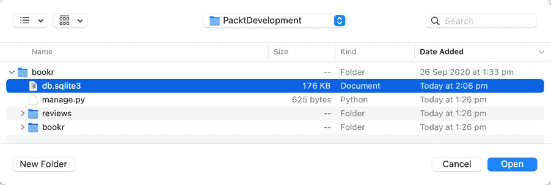

图 2.18：在 bookr 目录中定位 db.sqlite3

现在你应该能够浏览创建的新表格集。以下图显示了`reviews`应用中定义的数据库表格：

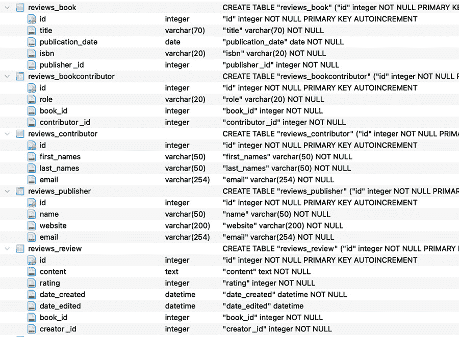

图 2.19：评论应用中定义的数据库表格

# Django 的数据库 CRUD 操作

由于我们已经为评论应用创建了必要的数据库表格，让我们现在通过 Django 了解基本数据库操作。

我们已经在名为“SQL CRUD 操作”的部分中简要介绍了使用 SQL 语句进行数据库操作。我们尝试使用`Insert`语句将条目插入数据库，使用`select`语句从数据库中读取，使用`update`语句更新条目，以及使用`delete`语句从数据库中删除条目。

Django 的 ORM 提供了相同的功能，无需处理 SQL 语句。Django 的数据库操作是简单的 Python 代码，因此我们克服了在 Python 代码中维护 SQL 语句的麻烦。让我们看看这些是如何执行的。

要执行 CRUD 操作，我们将通过执行以下命令进入 Django 的命令行 shell：

```py
python manage.py shell
```

注意

对于本章，我们将使用代码块开头的`>>>`符号（突出显示）来指定 Django shell 命令。当将查询粘贴到数据库浏览器时，请确保每次都排除这个符号。

当交互式控制台启动时，看起来如下所示：

```py
Type "help", "copyright", "credits" or "license" for more information.
(InteractiveConsole)
>>> 
```

## 练习 2.02：在 Bookr 数据库中创建条目

在这个练习中，您将通过保存模型实例来在数据库中创建一个新条目。换句话说，您将在数据库表中创建一个条目，而不需要显式运行 SQL 查询：

1.  首先，从`reviews.models`导入`Publisher`类/模型：

    ```py
    >>>from reviews.models import Publisher
    ```

1.  通过传递`Publisher`模型所需的所有字段值（名称、网站和电子邮件）来创建`Publisher`类的对象或实例：

    ```py
    >>>publisher = Publisher(name='Packt Publishing', website='https://www.packtpub.com', email='info@packtpub.com')
    ```

1.  接下来，要将对象写入数据库，重要的是调用`save()`方法，因为直到这个方法被调用，数据库中才不会创建条目：

    ```py
    >>>publisher.save()
    ```

    现在，您可以在数据库浏览器中看到一个新条目被创建：

    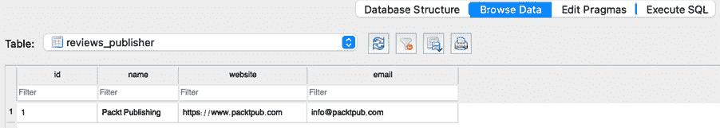

    图 2.20：数据库中创建的条目

1.  使用对象属性对对象进行任何进一步的修改，并将更改保存到数据库中：

    ```py
    >>>publisher.email
    'info@packtpub.com'
    >>> publisher.email = 'customersupport@packtpub.com'
    >>> publisher.save()
    ```

    您可以使用以下方式使用数据库浏览器查看更改：

    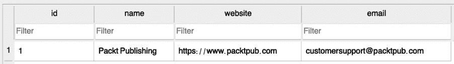

图 2.21：更新了电子邮件字段的条目

在这个练习中，您通过创建模型对象的实例并在数据库中写入模型对象来创建数据库条目使用了`save()`方法。

注意，通过遵循前面的方法，直到调用`save()`方法，对类实例的更改都不会被保存。然而，如果我们使用`create()`方法，Django 将在一步中将更改保存到数据库中。我们将在接下来的练习中使用此方法。

## 练习 2.03：使用 create()方法创建条目

在这里，您将使用`create()`方法一步创建`contributor`表中的记录：

1.  首先，像之前一样导入`Contributor`类：

    ```py
    >>> from reviews.models import Contributor
    ```

1.  通过调用`create()`方法，您可以一步在数据库中创建一个对象。确保您传递所有必需的参数（`first_names`、`last_names`和`email`）：

    ```py
    >>> contributor  =   Contributor.objects.create(first_names="Rowel",     last_names="Atienza", email="RowelAtienza@example.com")
    ```

1.  使用 DB Browser 验证贡献者记录是否已创建在数据库中。如果你的 DB Browser 还没有打开，请像上一节中那样打开数据库文件`db.sqlite3`。点击`浏览数据`并选择所需的表——在本例中，从`表`下拉菜单中选择`reviews_contributor`表，如图所示——并验证新创建的数据库记录：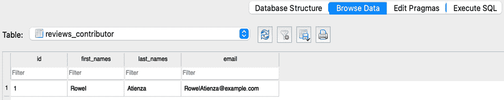

图 2.22：在 DB Browser 中验证记录的创建

在这个练习中，我们学习了使用`create()`方法，我们可以一次性在数据库中为模型创建记录。

## 创建具有外键的对象

与我们创建`Publisher`和`Contributor`表中的记录类似，现在让我们为`Book`表创建一个记录。如果你还记得，`Book`模型有一个不能为空的外键`Publisher`。因此，填充出版商外键的一种方法是在书籍的`publisher`字段中提供创建的`publisher`对象，如下面的练习所示。

## 练习 2.04：创建多对一关系的记录

在这个练习中，你将在`Book`表中创建一个包含指向`Publisher`模型外键的记录。正如你所知，`Book`和`Publisher`之间的关系是多对一关系，因此你必须首先获取`Publisher`对象，然后在创建书籍记录时使用它：

1.  首先，导入`Publisher`类：

    ```py
    >>>from reviews.models import Book, Publisher
    ```

1.  使用以下命令从数据库中检索`publisher`对象。`get()`方法用于从数据库中检索对象。我们还没有探索数据库的读取操作。现在，使用以下命令；我们将在下一节中深入探讨数据库的读取/检索：

    ```py
    >>>publisher = Publisher.objects.get(name='Packt Publishing')
    ```

1.  在创建书籍时，我们需要提供一个`date`对象，因为`Book`模型中的`publication_date`是一个日期字段。因此，从`datetime`导入`date`，以便在创建`book`对象时提供日期对象，如下代码所示：

    ```py
    >>>from datetime import date
    ```

1.  使用`create()`方法在数据库中创建书籍的记录。确保你传递所有字段，即`title`、`publication_date`、`isbn`和`publisher`对象：

    ```py
    >>>book = Book.objects.create(title="Advanced Deep Learning   with Keras", publication_date=date(2018, 10, 31),     isbn="9781788629416", publisher=publisher)
    ```

    注意，由于`publisher`是一个外键，并且它不可为空（不能持有`null`值），因此必须传递一个`publisher`对象。当必需的外键对象`publisher`未提供时，数据库将抛出完整性错误。

    *图 2.23*显示了创建第一条记录的`Book`表。注意，外键字段（`publisher_id`）指向`Publisher`表。书籍记录中的`publisher_id`条目指向一个具有`id`（主键）`1`的`Publisher`记录，如下两个屏幕截图所示：

    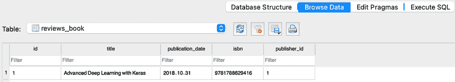

图 2.23：指向 reviews_book 主键的外键

![图 2.24：指向 reviews_publisher 主键的外键]

![img/B15509_02_24.jpg]

图 2.24：指向 reviews_publisher 主键的外键

在这个练习中，我们了解到在创建数据库记录时，如果是一个外键，可以将对象分配给字段。我们知道`Book`模型也与`Contributor`模型有多个对多个的关系。现在，让我们在创建数据库记录时探索建立多个对多个关系的方法。

## 练习 2.05：使用多对多关系创建记录

在这个练习中，你将使用关系模型`BookContributor`在`Book`和`Contributor`之间创建多对多关系：

1.  如果你在重启了 shell 后丢失了`publisher`和`book`对象，可以通过以下一组 Python 语句从数据库中检索它们：

    ```py
    >>>from reviews.models import Book
    >>>from reviews.models import Contributor
    >>>contributor = Contributor.objects.get(first_names='Rowel')
    book = Book.objects.get(title="Advanced Deep Learning with Keras")
    ```

1.  建立多对多关系的方法是将关系信息存储在中间模型或关系模型中；在这种情况下，它是`BookContributor`。由于我们已经从数据库中检索了书籍和贡献者记录，让我们在创建`BookContributor`关系模型记录时使用这些对象。为此，首先创建`BookContributor`关系类的实例，然后将对象保存到数据库中。在这个过程中，确保你传递了所需的字段，即`book`对象、`contributor`对象和`role`：

    ```py
    >>>from reviews.models import BookContributor
    >>>book_contributor = BookContributor(book=book,   contributor=contributor, role='AUTHOR')
    >>> book_contributor.save()
    ```

    注意，我们在创建`book_contributor`对象时指定了角色为`AUTHOR`。这是一个在建立多对多关系时存储关系数据的经典示例。角色可以是`AUTHOR`、`CO_AUTHOR`或`EDITOR`。

    这建立了书籍《高级深度学习与 Keras》和贡献者 Rowel（Rowel 是这本书的作者）之间的关系。

在这个练习中，我们使用`BookContributor`关系模型在`Book`和`Contributor`之间建立了多对多关系。关于我们刚刚创建的多对多关系的验证，我们将在本章稍后的几个练习中详细看到。

## 练习 2.06：使用 add()方法建立多对多关系

在这个练习中，你将使用`add()`方法建立多对多关系。当我们不使用关系来创建对象时，我们可以使用`through_default`传入一个包含定义所需字段的参数的字典。从上一个练习继续，让我们向名为《高级深度学习与 Keras》的书籍添加一个额外的贡献者。这次，这个贡献者是这本书的编辑：

1.  如果你重启了 shell，运行以下两个命令来导入和检索所需的书籍实例：

    ```py
    >>>from reviews.models import Book, Contributor
    >>>book = Book.objects.get(title="Advanced Deep Learning with   Keras")
    ```

1.  使用`create()`方法创建一个贡献者，如下所示：

    ```py
    >>>contributor = Contributor.objects.create(first_names='Packt',   last_names='Example Editor',     email='PacktEditor@example.com')
    ```

1.  使用 `add()` 方法将新创建的贡献者添加到书籍中。确保您提供的关系参数 `role` 作为 `dict`。输入以下代码：

    ```py
    >>>book.contributors.add(contributor,   through_defaults={'role': 'EDITOR'})
    ```

因此，我们使用了 `add()` 方法在书籍和贡献者之间建立多对多关系，同时将关系数据角色存储为 `Editor`。现在让我们看看其他实现这一点的其他方法。

## 使用 create() 和 set() 方法处理多对多关系

假设书籍 *Advanced Deep Learning with Keras* 有两位编辑。让我们使用以下方法为这本书添加另一位编辑。如果贡献者尚未存在于数据库中，则我们可以使用 `create()` 方法同时创建条目以及与书籍建立关系：

```py
>>>book.contributors.create(first_names='Packtp', last_names=  'Editor Example', email='PacktEditor2@example.com',     through_defaults={'role': 'EDITOR'})
```

同样，我们也可以使用 `set()` 方法为书籍添加一系列贡献者。让我们创建一个 `Publisher` 模型，一组两位合著者贡献者，以及一个 `book` 对象。首先，如果尚未导入，使用以下代码导入 `Publisher` 模型：

```py
>>>from reviews.models import Publisher
```

以下代码将帮助我们做到这一点：

```py
>>> publisher = Publisher.objects.create(name='Pocket Books',   website='https://pocketbookssampleurl.com', email='pocketbook@example.com')
>>> contributor1 = Contributor.objects.create(first_names=  'Stephen', last_names='Stephen', email='StephenKing@example.com')
>>> contributor2 = Contributor.objects.create(first_names=  'Peter', last_names='Straub', email='PeterStraub@example.com')
>>> book = Book.objects.create(title='The Talisman',   publication_date=date(2012, 9, 25), isbn='9781451697216',     publisher=publisher)
```

由于这是一个多对多关系，我们可以通过一次添加一个对象列表，使用 `set()` 方法。我们可以使用 through_defaults 来指定贡献者的角色；在这种情况下，他们是合著者：

```py
>>> book.contributors.set([contributor1, contributor2],   through_defaults={'role': 'CO_AUTHOR'})
```

## 读取操作

Django 为我们提供了允许我们从数据库中读取/检索的方法。我们可以使用 `get()` 方法从数据库中检索单个对象。在前面的章节中，我们已经创建了一些记录，所以让我们使用 `get()` 方法来检索一个对象。

## 练习 2.07：使用 get() 方法检索对象

在这个练习中，你将使用 `get()` 方法从数据库中检索一个对象：

1.  获取具有 `name` 字段值为 `Pocket Books` 的 `Publisher` 对象：

    ```py
    >>>from reviews.models import Publisher
    >>> publisher = Publisher.objects.get(name='Pocket Books')
    ```

1.  重新输入检索到的 `publisher` 对象并按 *Enter* 键：

    ```py
    >>> publisher
    <Publisher: Pocket Books>
    ```

    注意，输出显示在壳中。这被称为对象的字符串表示。这是在 *模型方法* 部分为 `Publisher` 类添加模型方法 `__str__()` 的结果。

1.  在检索对象后，你可以访问所有对象的属性。由于这是一个 Python 对象，可以通过使用 `.` 后跟属性名称来访问对象的属性。因此，你可以使用以下命令检索出版商的名称：

    ```py
    >>> publisher.name
    'Pocket Books'
    ```

1.  同样，检索出版商的网站：

    ```py
    >>> publisher.website
    'https://pocketbookssampleurl.com'
    ```

    可以检索出版商的电子邮件地址：

    ```py
    >>> publisher.email
    'pocketbook@example.com'
    ```

在这个练习中，我们学习了如何使用 `get()` 方法检索单个对象。尽管如此，使用这种方法有几个缺点。让我们找出原因。

## 使用 get() 方法返回对象

重要的是要注意，`get()` 方法只能获取一个对象。如果有另一个对象具有与字段相同的值，那么我们可以预期会收到一个 *"返回了多个"* 错误消息。例如，如果 `Publisher` 表中有两个条目具有相同的名称字段值，我们可能会收到一个错误。在这种情况下，有其他方法可以检索这些对象，我们将在后续章节中探讨。

当 `get()` 查询没有返回对象时，我们也可以得到一个 *"匹配的查询不存在"* 错误消息。`get()` 方法可以与对象的任何字段一起使用来检索记录。在以下情况下，我们正在使用 `website` 字段：

```py
>>> publisher = Publisher.objects.get(website='https://pocketbookssampleurl.com')
```

在检索对象之后，我们仍然可以获取出版者的名字，如下所示：

```py
>>> publisher.name
'Pocket Books'
```

另一种检索对象的方法是使用其主键 `pk`，如下所示：

```py
>>> Publisher.objects.get(pk=2)
<Publisher: Pocket Books>
```

使用主键 `pk` 是使用主键字段的一种更通用的方式。但对于 `Publisher` 表，由于我们知道 `id` 是主键，我们可以简单地使用字段名 `id` 来创建我们的 `get()` 查询：

```py
>>> Publisher.objects.get(id=2)
<Publisher: Pocket Books>
```

注意

对于 `Publisher` 以及其他所有表，主键是 `id`，这是 Django 自动创建的。这发生在创建表时没有提到主键字段的情况下。但也可以有字段被明确声明为主键的情况。

## 练习 2.08：使用 all() 方法检索一组对象

我们可以使用 `all()` 方法检索一组对象。在这个练习中，你将使用这个方法检索所有贡献者的名字：

1.  添加以下代码以从 `Contributor` 表中检索所有对象：

    ```py
    >>>from reviews.models import Contributor
    >>> Contributor.objects.all()
    <QuerySet [<Contributor: Rowel>, <Contributor: Packt>, <Contributor: Packtp>, <Contributor: Stephen>, <Contributor:   Peter>]>
    ```

    执行后，您将得到所有对象的 `QuerySet`。

1.  我们可以使用列表索引来查找特定的对象，或者使用循环遍历列表以执行任何其他操作：

    ```py
    >>> contributors = Contributor.objects.all()
    ```

1.  由于 `Contributor` 是一个对象列表，你可以使用索引来访问列表中的任何元素，如下面的命令所示：

    ```py
    >>> contributors[0]
    <Contributor: Rowel>
    ```

    在这种情况下，列表中的第一个元素是一个具有 `'Rowel'` 的 `first_names` 值和 `'Atienza'` 的 `last_names` 值的贡献者，如下面的代码所示：

    ```py
    >>> contributors[0].first_names
    'Rowel'
    >>> contributors[0].last_names
    'Atienza'
    ```

在这个练习中，我们学习了如何使用 `all()` 方法检索所有对象，我们还学习了如何使用检索到的对象集作为列表。

## 通过过滤检索对象

如果一个字段值对应多个对象，那么我们不能使用 `get()` 方法，因为 `get()` 方法只能返回一个对象。对于这种情况，我们有 `filter()` 方法，它可以检索所有符合指定条件的对象。

## 练习 2.09：使用 filter() 方法检索对象

在这个练习中，你将使用 `filter()` 方法获取满足特定条件的特定对象集。具体来说，你将检索所有名字为 `Peter` 的贡献者的名字：

1.  首先，创建两个额外的贡献者：

    ```py
    >>>from reviews.models import Contributor
    >>> Contributor.objects.create(first_names='Peter', last_names='Wharton', email='PeterWharton@example.com')
    >>> Contributor.objects.create(first_names='Peter', last_names='Tyrrell', email='PeterTyrrell@example.com')
    ```

1.  要检索那些`first_names`值为`Peter`的捐助者，请添加以下代码：

    ```py
    >>> Contributor.objects.filter(first_names='Peter')
    <QuerySet [<Contributor: Peter>, <Contributor: Peter>,   <Contributor: Peter>]>
    ```

1.  即使只有一个对象匹配，`filter()`方法也会返回该对象。你可以在这里看到：

    ```py
    >>>Contributor.objects.filter(first_names='Rowel')
    <QuerySet [<Contributor: Rowel>]>
    ```

1.  此外，如果查询没有匹配项，`filter()`方法返回一个空的`QuerySet`。这在这里可以看到：

    ```py
    >>>Contributor.objects.filter(first_names='Nobody')
    <QuerySet []>
    ```

在这个练习中，我们看到了如何使用过滤器根据特定条件检索一组少量对象。

## 通过字段查找进行过滤

现在，让我们假设我们想要通过提供某些条件来过滤和查询一组对象。在这种情况下，我们可以使用所谓的双下划线查找。例如，`Book`对象有一个名为`publication_date`的字段；假设我们想要过滤并获取所有在 01-01-2014 之后出版的书籍。我们可以通过使用双下划线方法轻松地查找这些书籍。为此，我们首先导入`Book`模型：

```py
>>>from reviews.models import Book
>>>book = Book.objects.filter(publication_date__gt=date(2014, 1, 1))
```

这里，`publication_date__gt`表示出版日期，大于（`gt`）某个指定的日期——在本例中是 01-01-2014。类似地，我们有以下缩写：

+   `lt`：小于

+   `lte`：小于或等于

+   `gte`：大于或等于

过滤后的结果如下所示：

```py
>>> book
<QuerySet [<Book: Advanced Deep Learning with Keras>]>
```

这是查询集中的书籍的出版日期，这证实了出版日期是在 01-01-2014 之后的：

```py
>>> book[0].publication_date
datetime.date(2018, 10, 31)
```

## 使用模式匹配进行过滤操作

对于过滤结果，我们还可以查找参数是否包含我们正在寻找的字符串的一部分：

```py
>>> book = Book.objects.filter(title__contains=
    'Deep learning')
```

这里，`title__contains`查找所有标题包含字符串`'Deep learning'`的对象：

```py
>>> book
<QuerySet [<Book: Advanced Deep Learning with Keras>]>
>>> book[0].title
'Advanced Deep Learning with Keras'
```

类似地，如果字符串匹配需要不区分大小写，我们可以使用`icontains`。使用`startswith`匹配以指定字符串开头的任何字符串。

## 通过排除检索对象

在上一节中，我们学习了通过匹配特定条件来获取一组对象。现在，假设我们想要做相反的操作；也就是说，我们想要获取所有那些不匹配特定条件的对象。在这种情况下，我们可以使用`exclude()`方法来排除特定条件并获取所有所需的对象。以下是一个所有捐助者的列表：

```py
>>> Contributor.objects.all()
<QuerySet [<Contributor: Rowel>, <Contributor: Packt>,   <Contributor: Packtp>, <Contributor: Stephen>,     <Contributor: Peter>, <Contributor: Peter>,       <Contributor: Peter>]>
```

现在，从这个列表中，我们将排除所有那些`first_names`值为`Peter`的捐助者：

```py
>>> Contributor.objects.exclude(first_names='Peter')
<QuerySet [<Contributor: Rowel>, <Contributor: Packt>,   <Contributor: Packtp>, <Contributor: Stephen>]>
```

我们可以看到，查询返回了所有那些名字不是 Peter 的捐助者。

## 使用 order_by()方法检索对象

我们可以使用`order_by()`方法按指定字段排序来检索对象列表。例如，在以下代码片段中，我们按出版日期对书籍进行排序：

```py
>>> books = Book.objects.order_by("publication_date")
>>> books
<QuerySet [<Book: The Talisman>, <Book: Advanced Deep Learning   with Keras>]>
```

让我们检查查询的顺序。由于查询集是一个列表，我们可以使用索引来检查每本书的出版日期：

```py
>>> books[0].publication_date
datetime.date(2012, 9, 25)
>>> books[1].publication_date
datetime.date(2018, 10, 31)
```

注意，索引为 `0` 的第一本书的出版日期早于索引为 `1` 的第二本书的出版日期。因此，这证实了查询到的书籍列表已经按照出版日期正确排序。我们还可以使用带有负号的字段参数前缀来按降序排序结果。这可以从以下代码片段中看出：

```py
>>> books = Book.objects.order_by("-publication_date")
>>> books
<QuerySet [<Book: Advanced Deep Learning with Keras>,   <Book: The Talisman>]>
```

由于我们在出版日期前加上了负号，请注意，现在查询到的书籍集合已经以相反的顺序返回，其中索引为 `0` 的第一本书对象比索引为 `1` 的第二本书对象更晚。

```py
>>> books[0].publication_date
datetime.date(2018, 10, 31)
>>> books[1].publication_date
datetime.date(2012, 9, 25)
```

我们还可以使用字符串字段或数值进行排序。例如，以下代码可以用来按书籍的主键或 `id` 排序：

```py
>>>books = Book.objects.order_by('id')
<QuerySet [<Book: Advanced Deep Learning with Keras>,   <Book: The Talisman>]>
```

查询到的书籍集合已经按照书籍 `id` 升序排序：

```py
>>> books[0].id
1
>>> books[1].id
2
```

再次，为了按降序排序，我们可以使用负号作为前缀，如下所示：

```py
>>> Book.objects.order_by('-id')
<QuerySet [<Book: The Talisman>, <Book: Advanced Deep Learning   with Keras>]>
```

现在，查询到的书籍集合已经按照书籍 `id` 降序排序：

```py
>>> books[0].id
2
>>> books[1].id
1
```

按照字符串字段按字母顺序排序，我们可以这样做：

```py
>>>Book.objects.order_by('title')
<QuerySet [<Book: Advanced Deep Learning with Keras>, <Book:   The Talisman>]>
```

由于我们使用了书籍的标题进行排序，查询集已经按字母顺序排序。我们可以如下看到：

```py
>>> books[0]
<Book: Advanced Deep Learning with Keras>
>>> books[1]
<Book: The Talisman>
```

与之前看到的排序类型类似，负号前缀可以帮助我们按逆字母顺序排序，正如我们在这里可以看到的：

```py
>>> Book.objects.order_by('-title')
<QuerySet [<Book: The Talisman>, <Book: Advanced Deep Learning   with Keras>]>
```

这将导致以下输出：

```py
>>> books[0]
<Book: The Talisman>
>>> books[1]
<Book: Advanced Deep Learning with Keras>
```

Django 提供的另一个有用方法是 `values()`。它帮助我们获取字典查询集而不是对象。在以下代码片段中，我们使用它来查询 `Publisher` 对象：

```py
>>> publishers = Publisher.objects.all().values()
>>> publishers
<QuerySet [{'id': 1, 'name': 'Packt Publishing', 'website':   'https://www.packtpub.com', 'email':     'customersupport@packtpub.com'}, {'id': 2, 'name':       'Pocket Books', 'website': 'https://pocketbookssampleurl.com',        'email': 'pocketbook@example.com'}]>
>>> publishers[0]
{'id': 1, 'name': 'Packt Publishing', 'website':  'https://www.packtpub.com', 'email':     'customersupport@packtpub.com'}
>>> publishers[0]
{'id': 1, 'name': 'Packt Publishing', 'website':   'https://www.packtpub.com', 'email':    'customersupport@packtpub.com'}
```

## 跨关系查询

正如我们在本章中学到的，`reviews` 应用有两种关系类型——多对一和多对多。到目前为止，我们已经学习了使用 `get()`、过滤器、字段查找等方法进行查询的各种方式。现在让我们研究如何执行跨关系查询。有几种方法可以做到这一点——我们可以使用外键、对象实例等等。让我们通过一些示例来探讨这些方法。

## 使用外键进行查询

当我们在两个模型/表之间有关系时，Django 提供了一种使用关系执行查询的方法。本节中显示的命令将通过执行模型关系查询来检索由 `Packt Publishing` 出版的所有书籍。与之前看到的情况类似，这是通过使用双下划线查找来完成的。例如，`Book` 模型有一个指向 `Publisher` 模型的外键 `publisher`。使用这个外键，我们可以使用双下划线和 `Publisher` 模型中的 `name` 字段来执行查询。这可以从以下代码中看出：

```py
>>> Book.objects.filter(publisher__name='Packt Publishing')
<QuerySet [<Book: Advanced Deep Learning with Keras>]>
```

## 使用模型名称进行查询

查询的另一种方式是，我们可以使用关系反向进行查询，使用模型名称的小写形式。例如，假设我们想要使用查询中的模型关系查询出版《Advanced Deep Learning with Keras》书籍的出版商。为此，我们可以执行以下语句来检索`Publisher`信息对象：

```py
>>> Publisher.objects.get(book__title='Advanced Deep Learning   with Keras')
<Publisher: Packt Publishing>
```

在这里，`book`是模型名称的小写形式。正如我们已经知道的，`Book`模型有一个`publisher`外键，其值为`name`，即 Packt Publishing。

## 使用对象实例跨外键关系进行查询

我们还可以使用对象的 外键检索信息。假设我们想要查询标题为《The Talisman》的出版商名称：

```py
>>> book = Book.objects.get(title='The Talisman')
>>> book.publisher
<Publisher: Pocket Books>
```

在这里使用对象是一个例子，我们使用反向方向通过`set.all()`方法获取一个出版商出版的所有书籍：

```py
>>> publisher = Publisher.objects.get(name='Pocket Books')
>>> publisher.book_set.all()
<QuerySet [<Book: The Talisman>]>
```

我们还可以使用查询链来创建查询：

```py
>>> Book.objects.filter(publisher__name='Pocket Books').filter(title='The Talisman')
<QuerySet [<Book: The Talisman>]>
```

让我们进行更多练习，以巩固我们对迄今为止所学的各种查询类型的知识。

## 练习 2.10：使用字段查找跨多对多关系查询

我们知道`Book`和`Contributor`之间存在多对多关系。在这个练习中，不创建对象，您将执行查询以检索所有参与编写标题为《The Talisman》的书籍的贡献者：

1.  首先，导入`Contributor`类：

    ```py
    >>> from reviews.models import Contributor
    ```

1.  现在，添加以下代码以查询《The Talisman》的所有贡献者：

    ```py
    >>>Contributor.objects.filter(book__title='The Talisman')
    ```

    您应该看到以下内容：

    ```py
    <QuerySet [<Contributor: Stephen>, <Contributor: Peter>]>
    ```

从前面的输出中，我们可以看到 Stephen 和 Peter 是参与编写《The Talisman》书籍的贡献者。查询使用`book`模型（小写形式）并使用命令中的双下划线进行`title`字段的字段查找。

在这个练习中，我们学习了如何使用字段查找执行跨多对多关系的查询。现在，让我们看看使用另一种方法来完成相同任务。

## 练习 2.11：使用对象进行多对多查询

在这个练习中，使用`Book`对象，搜索所有参与编写标题为《The Talisman》的书籍的贡献者。以下步骤将帮助您完成此操作：

1.  导入`Book`模型：

    ```py
    >>> from reviews.models import Book
    ```

1.  通过添加以下代码行检索标题为《The Talisman》的书籍对象：

    ```py
    >>> book = Book.objects.get(title='The Talisman')
    ```

1.  然后使用`book`对象检索参与编写《The Talisman》书籍的所有贡献者。为此，请添加以下代码：

    ```py
    >>>book.contributors.all()
    <QuerySet [<Contributor: Stephen>, <Contributor: Peter>]>
    ```

再次，我们可以看到 Stephen 和 Peter 是参与编写书籍《The Talisman》的贡献者。由于书籍与贡献者之间存在多对多关系，我们使用了`contributors.all()`方法来获取所有参与编写该书籍的贡献者的查询集。现在，让我们尝试使用`set`方法执行类似的任务。

## 练习 2.12：使用 set()方法进行多对多查询

在这个练习中，您将使用`contributor`对象检索名为`Rowel`的贡献者所写的所有书籍：

1.  导入 `Contributor` 模型：

    ```py
    >>> from reviews.models import Contributor
    ```

1.  使用 get() 方法获取一个 `contributor` 对象，其 `first_names` 为 `'Rowel'`：

    ```py
    >>> contributor = Contributor.objects.get(first_names='Rowel')
    ```

1.  使用 `contributor` 对象和 `book_set()` 方法，获取该作者所写的所有书籍：

    ```py
    >>> contributor.book_set.all()
    <QuerySet [<Book: Advanced Deep Learning with Keras>]>
    ```

由于 `Book` 和 `Contributor` 之间存在多对多关系，我们可以使用 `set()` 方法查询与模型关联的对象集。在这种情况下，`contributor.book_set.all()` 返回了该作者所写的所有书籍。

## 练习 2.13：使用 update() 方法

在这个练习中，你将使用 `update()` 方法更新现有记录：

1.  更改具有 `last_name` 为 `Tyrrell` 的贡献者的 `first_names`：

    ```py
    >>> from reviews.models import Contributor
    >>> Contributor.objects.filter(last_names='Tyrrell').  update(first_names='Mike')
    1
    ```

    返回值显示已更新的记录数。在这种情况下，一条记录已被更新。

1.  使用 get() 方法获取刚刚修改的 `contributor` 对象，并验证其名字是否已更改为 `Mike`：

    ```py
    >>> Contributor.objects.get(last_names='Tyrrell').first_names
    'Mike'
    ```

    注意

    如果过滤操作返回多个记录，则 `update()` 方法将更新所有返回记录中的指定字段。

在这个练习中，我们学习了如何使用 `update` 方法更新数据库中的记录。现在，让我们尝试使用 `delete()` 方法从数据库中删除记录。

## 练习 2.14：使用 delete() 方法

可以使用 `delete()` 方法从数据库中删除现有记录。在这个练习中，你将删除 `contributors` 表中 `last_name` 值为 `Wharton` 的记录：

1.  使用 get 方法获取对象，并按以下方式使用 delete 方法：

    ```py
    >>> from reviews.models import Contributor
    >>> Contributor.objects.get(last_names='Wharton').delete()
    (1, {'reviews.BookContributor': 0, 'reviews.Contributor': 1})
    ```

    注意，你没有将 `contributor` 对象分配给变量就调用了 `delete()` 方法。由于 get() 方法返回单个对象，你可以直接访问对象的方法，而无需为它创建变量。

1.  验证具有 `last_name` 为 `'Wharton'` 的 `contributor` 对象已被删除：

    ```py
    >>> Contributor.objects.get(last_names='Wharton')
    Traceback (most recent call last):
        File "<console>", line 1, in <module>
        File "/../site-packages/django/db/models/manager.py",  line 82, in manager_method
        return getattr(self.get_queryset(), name)(*args, **kwargs)
        File "/../site-packages/django/db/models/query.py",  line 417, in get
        self.model._meta.object_name
    reviews.models.Contributor.DoesNotExist: Contributor   matching query does not exist.
    ```

如你所见，运行查询时出现了 *对象不存在* 错误。这是预期的，因为记录已被删除。在这个练习中，我们学习了如何使用 `delete` 方法从数据库中删除记录。

## 活动 2.01：为项目管理应用程序创建模型

想象你正在开发一个名为 `Juggler` 的项目管理应用程序。Juggler 是一个可以跟踪多个项目，并且每个项目可以关联多个任务的应用程序。以下步骤将帮助你完成此活动：

1.  使用我们迄今为止学到的技术，创建一个名为 `juggler` 的 Django 项目。

1.  创建一个名为 `projectp` 的 Django 应用程序。

1.  在 `juggler/settings.py` 文件中添加 app projects。

1.  在 `projectp/models.py` 中创建两个相关模型类 `Project` 和 `Task`。

1.  创建迁移脚本并将模型定义迁移到数据库中。

1.  现在打开 Django shell 并导入模型。

1.  使用示例数据填充数据库，并编写一个查询以显示与给定项目关联的任务列表。

    注意

    此活动的解决方案可在 [`packt.live/2Nh1NTJ`](http://packt.live/2Nh1NTJ) 找到。

## 填充 Bookr 项目的数据库

虽然我们知道如何为项目创建数据库记录，但在接下来的几章中，我们将不得不创建大量记录以与项目一起工作。因此，我们创建了一个脚本，可以使事情变得简单。此脚本通过读取包含许多记录的 **.csv** （逗号分隔值）文件来填充数据库。按照以下步骤填充项目的数据库：

1.  在项目目录内创建以下文件夹结构：

    ```py
    bookr/reviews/management/commands/
    ```

1.  从以下位置复制 `loadcsv.py` 文件和 `WebDevWithDjangoData.csv` 到创建的文件夹中。这些文件可以在本书的 GitHub 仓库 [`packt.live/3pvbCLM`](http://packt.live/3pvbCLM) 中找到。

    因为 `loadcsv.py` 放置在 `management/commands` 文件夹中，现在它就像一个 Django 自定义管理命令一样工作。您可以查看 `loadcsv.py` 文件，并在此链接中了解更多关于编写 Django 自定义管理命令的信息：[`docs.djangoproject.com/en/3.0/howto/custom-management-commands/`](https://docs.djangoproject.com/en/3.0/howto/custom-management-commands/)。

1.  现在，让我们重新创建一个全新的数据库。删除项目文件夹中存在的 SQL 数据库文件：

    ```py
    rm reviews/db.sqlite3
    ```

1.  要再次创建一个全新的数据库，请执行 Django 的 `migrate` 命令：

    ```py
    python manage.py migrate
    ```

    现在，您可以在 `reviews` 文件夹下看到新创建的 `db.sqlite3` 文件。

1.  执行自定义管理命令 `loadcsv` 以填充数据库：

    ```py
    python manage.py loadcsv --csv reviews/management/commands/WebDevWithDjangoData.csv
    ```

1.  使用 DB Browser for SQLite，验证由 `bookr` 项目创建的所有表都已填充。

# 摘要

在本章中，我们学习了某些基本数据库概念及其在应用程序开发中的重要性。我们使用了一个免费的数据库可视化工具 DB Browser for SQLite，以了解数据库表和字段是什么，记录如何在数据库中存储，并进一步使用简单的 SQL 查询在数据库上执行了一些基本的 CRUD 操作。

然后，我们学习了 Django 提供的一个非常有价值的抽象层，称为 ORM，它帮助我们通过简单的 Python 代码无缝地与关系数据库交互，而无需编写 SQL 命令。作为 ORM 的一部分，我们学习了 Django 模型、迁移以及它们如何帮助将更改传播到数据库中的 Django 模型。

我们通过学习关系型数据库中的数据库关系及其关键类型，巩固了我们对数据库的知识。我们还使用了 Django shell，在那里我们用 Python 代码执行了之前用 SQL 执行过的相同的 CRUD 查询。后来，我们学习了如何使用模式匹配和字段查找以更精细的方式检索我们的数据。在我们学习这些概念的同时，我们在 Bookr 应用程序上也取得了显著的进展。我们为`reviews`应用程序创建了模型，并获得了与该应用程序数据库中存储的数据交互所需的所有技能。在下一章中，我们将学习如何创建 Django 视图、URL 路由和模板。
