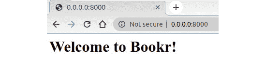
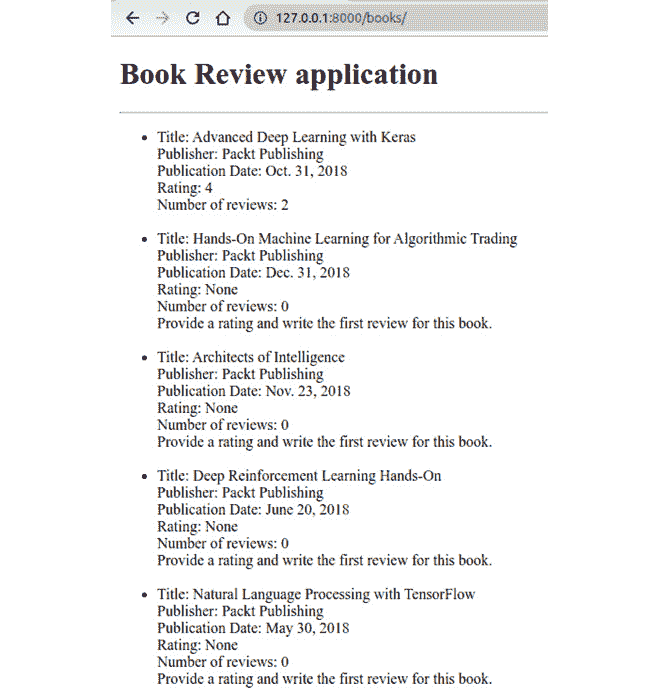
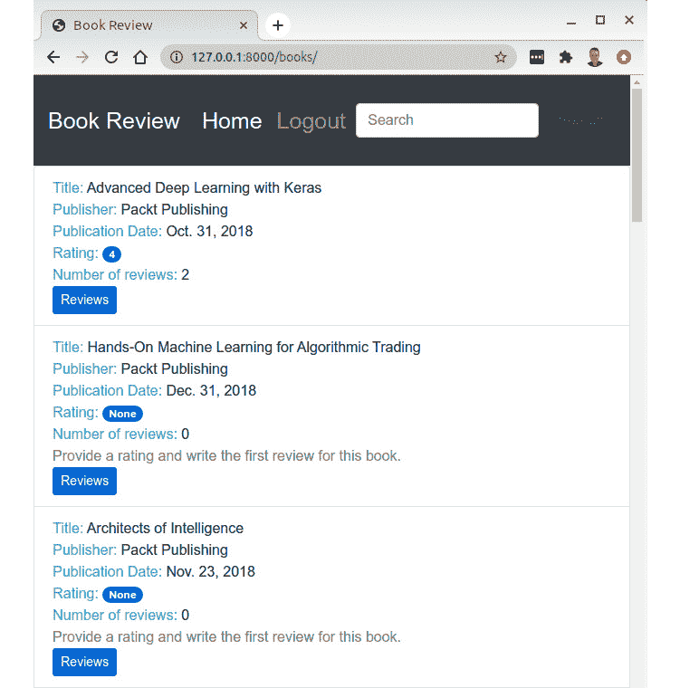
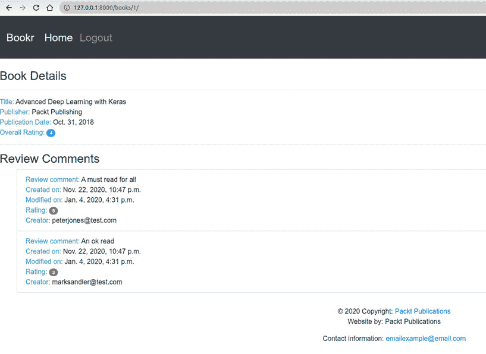

# 3. URL 映射、视图和模板

概述

本章向您介绍了 Django 的三个核心概念：**视图**、**模板**和**URL 映射**。您将从探索 Django 中的两种主要视图类型开始：**基于函数的视图**和**基于类的视图**。接下来，您将学习 Django 模板语言和模板继承的基础知识。使用这些概念，您将创建一个页面来显示**Bookr**应用程序中所有书籍的列表。您还将创建另一个页面来显示书籍的详细信息、评论和评分。

# 简介

在上一章中，我们介绍了数据库，并学习了如何从数据库中存储、检索、更新和删除记录。我们还学习了如何创建 Django 模型并应用数据库迁移。

然而，仅凭这些数据库操作本身并不能将应用程序的数据展示给用户。我们需要一种方法，以有意义的方式将所有存储的信息展示给用户；例如，在我们的 Bookr 应用程序数据库中显示所有现有的书籍，在浏览器中以可展示的格式。这就是 Django 视图、模板和 URL 映射发挥作用的地方。视图是 Django 应用程序的一部分，它接收网络请求并提供网络响应。例如，一个网络请求可能是一个用户通过输入网站地址来尝试查看网站，而一个网络响应可能是网站的主页在用户的浏览器中加载。视图是 Django 应用程序最重要的部分之一，应用程序逻辑在这里被编写。这种应用程序逻辑控制与数据库的交互，例如创建、读取、更新或从数据库中删除记录。它还控制数据如何展示给用户。这是通过 Django HTML 模板来实现的，我们将在后面的章节中详细探讨。

Django 视图可以大致分为两种类型，**基于函数的视图**和**基于类的视图**。在本章中，我们将学习 Django 中的基于函数的视图。

注意

在本章中，我们将仅学习关于基于函数的视图。更高级的基于类的视图将在第十一章“高级模板和基于类的视图”中详细讨论。

# 基于函数的视图

如其名所示，基于函数的视图是以 Python 函数的形式实现的。为了理解它们是如何工作的，考虑以下代码片段，它展示了一个名为`home_page`的简单视图函数：

```py
from django.http import HttpResponse
def home_page(request):
    message = "<html><h1>Welcome to my Website</h1></html>"
    return HttpResponse(message)
```

在这里定义的视图函数，名为`home_page`，接受一个`request`对象作为参数，并返回一个包含`Welcome to my Website`消息的`HttpResponse`对象。使用基于函数的视图的优势在于，由于它们是以简单的 Python 函数实现的，因此更容易学习和阅读。基于函数的视图的主要缺点是，代码不能被重用，并且对于通用用例来说，不能像基于类的视图那样简洁。

# 基于类的视图

如其名所示，基于类的视图是以 Python 类的形式实现的。利用类继承的原则，这些类被实现为 Django 通用视图类的子类。与所有视图逻辑都明确表达在函数中的基于函数的视图不同，Django 的通用视图类提供了各种预构建的属性和方法，可以提供编写干净、可重用视图的快捷方式。这个特性在 Web 开发中非常有用；例如，开发者经常需要渲染一个 HTML 页面，而不需要从数据库中插入任何数据，或者任何针对特定用户的定制化。在这种情况下，可以简单地继承 Django 的 `TemplateView`，并指定 HTML 文件的路径。以下是一个可以显示与基于函数的视图示例中相同信息的基于类的视图示例：

```py
from django.views.generic import TemplateView
class HomePage(TemplateView):
    template_name = 'home_page.html'
```

在前面的代码片段中，`HomePage` 是一个继承自 `django.views.generic` 模块的 Django `TemplateView` 的基于类的视图。类属性 `template_name` 定义了在视图被调用时要渲染的模板。对于模板，我们在 `templates` 文件夹中添加了一个包含以下内容的 HTML 文件：

```py
<html><h1>Welcome to my Website</h1></html>
```

这是一个基于类的视图的非常基础的例子，将在第十一章 *高级模板和基于类的视图* 中进一步探讨。使用基于类的视图的主要优势是，与基于函数的视图相比，实现相同功能所需的代码行数更少。此外，通过继承 Django 的通用视图，我们可以使代码更加简洁，避免代码重复。然而，基于类的视图的一个缺点是，对于 Django 新手来说，代码通常不太易读，这意味着学习它通常是一个更长的过程，与基于函数的视图相比。

# URL 配置

Django 视图不能独立在 Web 应用程序中工作。当向应用程序发起 Web 请求时，Django 的 URL 配置负责将请求路由到适当的视图函数以处理请求。Django 中 `urls.py` 文件中的典型 URL 配置如下所示：

```py
from . import views
urlpatterns = [path('url-path/' views.my_view, name='my-view'),]
```

在这里，`urlpatterns` 是定义 URL 路径列表的变量，`'url-path/'` 定义了要匹配的路径。

`views.my_view` 是在 URL 匹配时调用的视图函数，`name='my-view'` 是用于引用视图的视图函数的名称。可能存在这样的情况，在应用程序的其他地方，我们想要获取这个视图的 URL。我们不想硬编码这个值，因为这会导致在代码库中需要指定两次。相反，我们可以通过使用视图的名称来访问 URL，如下所示：

```py
from django.urls import reverse
url = reverse('my-view')
```

如果需要，我们还可以在 URL 路径中使用正则表达式，通过 `re_path()` 匹配字符串模式：

```py
urlpatterns = [re_path\
               (r'^url-path/(?P<name>pattern)/$', views.my_view, \
                name='my-view')]
```

在这里，`name` 指的是模式名称，它可以是指定的任何 Python 正则表达式模式，并且在调用定义的视图函数之前需要匹配。你也可以将参数从 URL 传递到视图本身，例如：

```py
urlpatterns = [path(r'^url-path/<int:id>/', views.my_view, \
               name='my-view')]
```

在前面的例子中，`<int:id>` 告诉 Django 查找字符串中此位置的整数 URL，并将该整数的值分配给 `id` 参数。这意味着如果用户导航到 `/url-path/14/`，则将 `id=14` 关键字参数传递给视图。这在视图需要查找数据库中的特定对象并返回相应数据时非常有用。例如，假设我们有一个 `User` 模型，我们希望视图显示用户的姓名。

视图可以编写如下：

```py
def my_view(request, id):
    user = User.objects.get(id=id)
    return HttpResponse(f"This user's name is \
    { user.first_name } { user.last_name }")
```

当用户访问 `/url-path/14/` 时，调用前面的视图，并将 `id=14` 参数传递给函数。

当使用网络浏览器调用类似于 `http://0.0.0.0:8000/url-path/` 的 URL 时，这是典型的流程：

1.  将对运行中的应用程序的 URL 路径发起 HTTP 请求。在收到请求后，它会查找 `settings.py` 文件中存在的 `ROOT_URLCONF` 设置：

    ```py
    ROOT_URLCONF = 'project_name.urls'
    ```

    这确定了首先使用的 URL 配置文件。在这种情况下，它是项目目录 `project_name/urls.py` 中存在的 URL 文件。

1.  接下来，Django 会遍历名为 `urlpatterns` 的列表，一旦它与 URL `http://0.0.0.0:8000/url-path/` 中的路径匹配，它就会调用相应的视图函数。

URL 配置有时也被称为 URL conf 或 URL 映射，这些术语通常可以互换使用。为了更好地理解视图和 URL 映射，让我们从简单的练习开始。

## 练习 3.01：实现基于函数的简单视图

在这个练习中，我们将编写一个非常基本的基于函数的视图，并使用相关的 URL 配置在浏览器中显示消息 `Welcome to Bookr!`。我们还将告诉用户我们数据库中有多少本书：

1.  首先，确保 `bookr/settings.py` 中的 `ROOT_URLCONF` 指向项目的 URL 文件，通过添加以下命令：

    ```py
    ROOT_URLCONF = 'bookr.urls'
    ```

1.  打开 `bookr/reviews/views.py` 文件并添加以下代码片段：

    ```py
    from django.http import HttpResponse
    from .models import Book
    def welcome_view(request):
        message = f"<html><h1>Welcome to Bookr!</h1> "\
    "<p>{Book.objects.count()} books and counting!</p></html>"
        return HttpResponse(message)
    ```

    首先，我们从 `django.http` 模块导入 `HttpResponse` 类。接下来，我们定义 `welcome_view` 函数，该函数可以在浏览器中显示消息 `Welcome to Bookr!`。请求对象是一个函数参数，它携带 HTTP `request` 对象。下一行定义了 `message` 变量，它包含显示标题的 HTML，然后是一行统计数据库中可用的书籍数量。

    在最后一行，我们返回一个与消息变量关联的 `HttpResponse` 对象。当调用 `welcome_view` 视图函数时，它将在浏览器中显示消息 `Welcome to Bookr! 2 Books and counting`。

1.  现在，创建 URL 映射以调用新创建的视图函数。打开项目 URL 文件，`bookr/urls.py`，并按照以下方式添加`urlpatterns`列表：

    ```py
    from django.contrib import admin
    from django.urls import include, path
    urlpatterns = [path('admin/', admin.site.urls),\
                   path('', include('reviews.urls'))]
    ```

    `urlpatterns`列表中的第一行，即`path('admin/', admin.site.urls)`，如果 URL 路径中存在`admin/`，则路由到管理 URL（例如，`http://0.0.0.0:8000/admin`）。

    类似地，考虑第二行，`path('', include('reviews.urls'))`。在这里，提到的路径是一个空字符串`''`。如果 URL 在`http://hostname:port-number/`（例如，`http://0.0.0.0:8000/`）之后没有特定的路径，它将包含`review.urls`中存在的`urlpatterns`。

    `include`函数是一个快捷方式，允许您组合 URL 配置。在您的 Django 项目中，通常每个应用程序都保留一个 URL 配置。在这里，我们为`reviews`应用程序创建了一个单独的 URL 配置，并将其添加到我们的项目级 URL 配置中。

1.  由于我们还没有`reviews.urls` URL 模块，创建一个名为`bookr/reviews/urls.py`的文件，并添加以下代码行：

    ```py
    from django.contrib import admin
    from django.urls import path
    from . import views
    urlpatterns = [path('', views.welcome_view, \
                        name='welcome_view'),]
    ```

1.  在这里，我们再次使用了空字符串作为 URL 路径。因此，当 URL `http://0.0.0.0:8000/`被调用时，从`bookr/urls.py`路由到`bookr/reviews/urls.py`后，这个模式将调用`welcome_view`视图函数。

1.  在对两个文件进行修改后，我们已经准备好了必要的 URL 配置，以便调用`welcome_view`视图。现在，使用`python manage.py runserver`启动 Django 服务器，并在您的网页浏览器中输入`http://0.0.0.0:8000`或`http://127.0.0.1:8000`。您应该能看到消息`欢迎使用 Bookr!`：

图 3.1：显示“欢迎使用 Bookr!”和主页上的书籍数量

注意

如果没有 URL 匹配，Django 将调用错误处理，例如显示`404 页面未找到`消息或类似的内容。

在这个练习中，我们学习了如何编写基本的视图函数和相关的 URL 映射。我们创建了一个网页，向用户显示一条简单的消息，并报告我们数据库中当前有多少本书。

然而，细心的读者会注意到，像前面的例子那样，将 HTML 代码放在我们的 Python 函数中看起来并不美观。随着视图变大，这将会变得更加不可持续。因此，我们现在将注意力转向 HTML 代码应该所在的地方——在模板中。

# 模板

在*练习 3.01*，*实现基于简单函数的视图*中，我们看到了如何创建视图，进行 URL 映射，并在浏览器中显示消息。但如果你还记得，我们在视图函数本身中硬编码了 HTML 消息`欢迎使用 Bookr!`，并返回了一个`HttpResponse`对象，如下所示：

```py
message = f"<html><h1>Welcome to Bookr!</h1> "\
"<p>{Book.objects.count()} books and counting!</p></html>"
return HttpResponse(message)
```

在 Python 模块中硬编码 HTML 不是一种好的做法，因为随着要在网页中渲染的内容增加，我们需要为其编写的 HTML 代码量也会增加。在 Python 代码中包含大量的 HTML 代码可能会使代码在长期内难以阅读和维护。

因此，Django 模板为我们提供了一种更好的方式来编写和管理 HTML 模板。Django 的模板不仅与静态 HTML 内容一起工作，还与动态 HTML 模板一起工作。

Django 的模板配置是在`settings.py`文件中存在的`TEMPLATES`变量中完成的。这是默认配置的外观：

```py
TEMPLATES = \
[{'BACKEND': 'django.template.backends.django.DjangoTemplates',\
  'DIRS': [],
  'APP_DIRS': True,
  'OPTIONS': {'context_processors': \
              ['django.template.context_processors.debug',\
               'django.template.context_processors.request',\
               'django.contrib.auth.context_processors.auth',\
               'django.contrib.messages.context_processors\
                .messages',\
            ],\
        },\
    },\
]
```

让我们逐一分析前面代码片段中出现的每个关键字：

+   `'BACKEND': 'django.template.backends.django.DjangoTemplates'`：这指的是要使用的模板引擎。模板引擎是 Django 用来与 HTML 模板工作的 API。Django 是用 Jinja2 和`DjangoTemplates`引擎构建的。默认配置是`DjangoTemplates`引擎和 Django 模板语言。然而，如果需要，这可以更改为使用不同的一个，例如 Jinja2 或任何其他第三方模板引擎。但是，对于我们的 Bookr 应用程序，我们将保持这个配置不变。

+   `'DIRS': []`：这指的是 Django 在给定顺序中搜索模板的目录列表。

+   `'APP_DIRS': True`：这告诉 Django 模板引擎是否应该在`settings.py`文件中定义的`INSTALLED_APPS`下安装的应用中查找模板。这个选项的默认值是`True`。

+   `'OPTIONS'`：这是一个包含模板引擎特定设置的字典。在这个字典中，有一个默认的上下文处理器列表，它帮助 Python 代码与模板交互以创建和渲染动态 HTML 模板。

现在的默认设置对于我们来说大多数情况下都是合适的。然而，在下一个练习中，我们将为我们的模板创建一个新的目录，并且我们需要指定这个文件夹的位置。例如，如果我们有一个名为`my_templates`的目录，我们需要通过将其添加到`TEMPLATES`设置中来指定其位置，如下所示：

```py
TEMPLATES = \
[{'BACKEND': 'django.template.backends.django.DjangoTemplates',\
  'DIRS': [os.path.join(BASE_DIR, 'my_templates')],\
  'APP_DIRS': True,\
  'OPTIONS': {'context_processors': \
               ['django.template.context_processors.debug',\
                'django.template.context_processors.request',\
                'django.contrib.auth.context_processors.auth',\
                'django.contrib.messages.context_processors\
                 .messages',\
            ],\
        },\
    },
```

`BASE_DIR`是项目文件夹的目录路径。这定义在`settings.py`文件中。`os.path.join()`方法将项目目录与`templates`目录连接起来，返回模板目录的完整路径。

## 练习 3.02：使用模板显示问候消息

在这个练习中，我们将创建我们的第一个 Django 模板，就像我们在上一个练习中所做的那样，我们将使用模板显示`Welcome to Bookr!`消息：

1.  在`bookr`项目目录下创建一个名为`templates`的目录，并在其中创建一个名为`base.html`的文件。目录结构应类似于*图 3.2*：

    图 3.2: bookr 的目录结构

    注意

    当使用默认配置时，即`DIRS`为空列表时，Django 只会在应用程序文件夹的`template`目录中搜索模板（在书评应用程序的情况下是`reviews/templates`文件夹）。由于我们将新的模板目录包含在主项目目录中，除非将目录包含在`DIRS`列表中，否则 Django 的模板引擎将无法找到该目录。

1.  将文件夹添加到`TEMPLATES`设置中：

    ```py
    TEMPLATES = \
    [{'BACKEND': 'django.template.backends.django.DjangoTemplates',\
      'DIRS': [os.path.join(BASE_DIR, 'templates')],
      'APP_DIRS': True,
      'OPTIONS': {'context_processors': \
                  ['django.template.context_processors.debug',\
                   'django.template.context_processors.request',\
                   'django.contrib.auth.context_processors.auth',\
                   'django.contrib.messages.context_processors\
                   .messages',\
                ],\
            },\
        },\
                ]
    ```

1.  将以下代码行添加到`base.html`文件中：

    ```py
    <!doctype html>
    <html lang="en">
    <head>
        <meta charset=»utf-8»>
        <title>Home Page</title>
    </head>
        <body>
            <h1>Welcome to Bookr!</h1>
        </body>
    </html>
    ```

    这只是一个简单的 HTML，用于在页眉中显示消息`欢迎使用 Bookr!`。

1.  修改`bookr/reviews/views.py`中的代码，使其如下所示：

    ```py
    from django.shortcuts import render
    def welcome_view (request):
        return render(request, 'base.html')
    ```

    由于我们已经在`TEMPLATES`配置中配置了`'templates'`目录，因此`base.html`可用于模板引擎。代码使用从`django.shortcuts`模块导入的`render`方法渲染文件`base.html`。

1.  保存文件，运行`python manage.py runserver`，然后打开`http://0.0.0.0:8000/`或`http://127.0.0.1:8000/` URL 以检查浏览器中新添加的模板加载情况：![图 3.3：在主页上显示“欢迎使用 Bookr!”]

    

图 3.3：在主页上显示“欢迎使用 Bookr!”

在这个练习中，我们创建了一个 HTML 模板，并使用 Django 模板和视图返回消息`欢迎使用 Bookr!`。接下来，我们将学习 Django 模板语言，它可以用来渲染应用程序的数据以及 HTML 模板。

# Django 模板语言

Django 模板不仅返回静态 HTML 模板，还可以在生成模板时添加动态应用程序数据。除了数据，我们还可以在模板中包含一些程序性元素。所有这些加在一起构成了**Django 模板语言**的基础。本节将探讨 Django 模板语言的一些基本部分。

### 模板变量

模板变量用两个花括号表示，如下所示：

```py
{{ variable }}
```

当模板中存在此内容时，变量的值将在模板中被替换。模板变量有助于将应用程序的数据添加到模板中：

```py
template_variable = "I am a template variable."
<body>
        {{ template_variable }}
    </body>
```

### 模板标签

标签类似于程序性控制流，例如`if`条件或`for`循环。标签用两个花括号和百分号表示。以下是一个使用模板标签遍历列表的`for`循环示例：

```py


```

与 Python 编程不同，我们通过添加`end`标签来添加控制流的结束，例如``。这可以与模板变量一起使用，以显示列表中的元素，如下所示：

```py
<ul>
    
        <li>{{ element.title }}</li>
    
</ul>
```

### 注释

Django 模板语言中的注释可以按照以下方式编写；在``和``之间的任何内容都将被注释掉：

```py

    <p>This text has been commented out</p>

```

### 过滤器

过滤器可以用来修改一个变量，以不同的格式表示它。过滤器的语法是使用管道（`|`）符号将变量与过滤器名称分开：

```py
{{ variable|filter }}
```

这里有一些内置过滤器的示例：

+   `{{ variable|lower }}`：这会将变量字符串转换为小写。

+   `{{ variable|title}}`：这会将每个单词的首字母转换为大写。

让我们使用到目前为止学到的概念来开发书评应用。

## 练习 3.03：显示书籍和评论列表

在这个练习中，我们将创建一个可以显示所有书籍、它们的评分和书评应用中现有评论数量的网页。为此，我们将使用 Django 模板语言的一些功能，如变量和模板标签，将书评应用数据传递到模板中，以在网页上显示有意义的数据：

1.  在`bookr/reviews/utils.py`下创建一个名为`utils.py`的文件，并添加以下代码：

    ```py
    def average_rating(rating_list):
        if not rating_list:
            return 0
        return round(sum(rating_list) / len(rating_list))
    ```

    这是一个将用于计算书籍平均评分的帮助方法。

1.  删除`bookr/reviews/views.py`中现有的所有代码，并添加以下代码到其中：

    ```py
    from django.shortcuts import render
    from .models import Book, Review
    from .utils import average_rating
    def book_list(request):
        books = Book.objects.all()
        book_list = []
        for book in books:
            reviews = book.review_set.all()
            if reviews:
                book_rating = average_rating([review.rating for \
                                              review in reviews])
                number_of_reviews = len(reviews)
            else:
                book_rating = None
                number_of_reviews = 0
            book_list.append({'book': book,\
                              'book_rating': book_rating,\
                              'number_of_reviews': number_of_reviews})
        context = {
            'book_list': book_list
        }
        return render(request, 'reviews/books_list.html', context)
    ```

    这是一个用于显示书评应用中书籍列表的视图。前五行导入 Django 模块、模型类和刚刚添加的帮助方法。

    在这里，`books_list`是视图方法。在这个方法中，我们首先查询所有书籍的列表。接下来，对于每一本书，我们计算平均评分和发布的评论数量。每本书的所有这些信息都作为字典列表附加到名为`book_list`的列表中。然后，这个列表被添加到名为 context 的字典中，并传递给渲染函数。

    渲染函数有三个参数，第一个是传递给视图的请求对象，第二个是 HTML 模板`books_list.html`，它将显示书籍列表，第三个是上下文，我们将其传递给模板。

    由于我们已经将`book_list`作为上下文的一部分传递，因此模板将使用它来使用模板标签和模板变量渲染书籍列表。

1.  在路径`bookr/reviews/templates/reviews/books_list.html`中创建名为`book_list.html`的文件，并在文件中添加以下 HTML 代码：

    ```py
    reviews/templates/reviews/books_list.html
    1  <!doctype html>
    2  <html lang="en">
    3  <head>
    4      <meta charset="utf-8">
    5      <title>Bookr</title>
    6  </head>
    7      <body>
    8          <h1>Book Review application</h1>
    9          <hr>
    You can find the complete code at http://packt.live/3hnB4Qr.
    ```

    这是一个简单的 HTML 模板，包含模板标签和变量，用于迭代`book_list`以显示书籍列表。

1.  在`bookr/reviews/urls.py`中，添加以下 URL 模式以调用`books_list`视图：

    ```py
    from django.urls import path
    from . import views
    urlpatterns = [path('books/', views.book_list, \
                        name='book_list'),]
    ```

    这为`books_list`视图函数执行 URL 映射。

1.  保存所有修改过的文件，等待 Django 服务重启。在浏览器中打开`http://0.0.0.0:8000/books/`，你应该会看到类似于*图 3.4*的内容：

图 3.4：书评应用中现有的书籍列表

在这个练习中，我们创建了一个视图函数，创建了模板，并进行了 URL 映射，可以显示应用中所有现有书籍的列表。虽然我们能够使用单个模板显示书籍列表，但接下来，让我们探讨一下如何在具有公共或相似代码的应用程序中处理多个模板。

## 模板继承

随着我们构建项目，模板的数量将会增加。在设计和应用时，某些页面可能会看起来相似，并且具有某些功能的公共 HTML 代码。使用模板继承，我们可以将公共 HTML 代码继承到其他 HTML 文件中。这类似于 Python 中的类继承，其中父类包含所有公共代码，而子类包含那些满足子类需求的独特代码。

例如，让我们考虑以下内容为一个名为`base.html`的父模板：

```py
<!doctype html>
<html lang="en">
<head>
    <meta charset="utf-8">
    <title>Hello World</title>
</head>
    <body>
        <h1>Hello World using Django templates!</h1>
        
        
    </body>
</html>
```

以下是一个子模板的示例：

```py


<h1>How are you doing?</h1>

```

在前面的代码片段中，行``扩展了来自`base.html`的模板，这是父模板。在从父模板扩展后，任何在块内容之间的 HTML 代码都将与父模板一起显示。一旦子模板被渲染，这就是它在浏览器中的样子：

![图 3.5：扩展 base.html 模板后的问候信息

![img/B15509_03_05.jpg]

图 3.5：扩展 base.html 模板后的问候信息

## 使用 Bootstrap 进行模板样式化

我们已经看到了如何使用视图、模板和 URL 映射来显示所有书籍。虽然我们能够在浏览器中显示所有信息，但如果我们能添加一些样式并使网页看起来更好，那就更好了。为此，我们可以添加一些**Bootstrap**元素。Bootstrap 是一个开源的**层叠样式表**（**CSS**）框架，特别适合设计适用于桌面和移动浏览器的响应式页面。

使用 Bootstrap 很简单。首先，你需要将 Bootstrap CSS 添加到你的 HTML 中。你可以通过创建一个名为`example.html`的新文件来自行实验。在文件中填充以下代码，并在浏览器中打开它：

```py
<!doctype html>
<html lang="en">
  <head>
    <!-- Required meta tags -->
    <meta charset="utf-8">
    <meta name="viewport" content="width=device-width,       initial-scale=1, shrink-to-fit=no">
    <!-- Bootstrap CSS -->
    <link rel="stylesheet"       href="https://stackpath.bootstrapcdn.com/bootstrap/4.4.1/      css/bootstrap.min.css" integrity="sha384-      Vkoo8x4CGsO3+Hhxv8T/Q5PaXtkKtu6ug5TOeNV6gBiFeWPGFN9MuhOf23Q       9Ifjh" crossorigin="anonymous">
  </head>
  <body>
    Content goes here
  </body>
</html>
```

上述代码中的 Bootstrap CSS 链接将 bootstrap CSS 库添加到你的页面中。这意味着某些 HTML 元素类型和类将继承其样式来自 Bootstrap。例如，如果你将`btn-primary`类添加到按钮的类中，按钮将被渲染为蓝色带白色文字。尝试在`<body>`和`</body>`之间添加以下内容：

```py
<h1>Welcome to my Site</h1>
<button type="button" class="btn btn-primary">Checkout my   Blog!</button>
```

你会看到标题和按钮都被 Bootstrap 的默认样式优雅地样式化：

![图 3.6：应用 Bootstrap 后的显示效果

![img/B15509_03_06.jpg]

图 3.6：应用 Bootstrap 后的显示效果

这是因为在 Bootstrap CSS 代码中，它使用以下代码指定了`btn-primary`类的颜色：

```py
.btn-primary {
    color: #fff;
    background-color: #007bff;
    border-color: #007bff
}
```

你可以看到，使用像 Bootstrap 这样的第三方 CSS 库，你可以快速创建样式优美的组件，而不需要编写太多的 CSS。

注意

我们建议你进一步探索 Bootstrap，请参考他们的教程：[`getbootstrap.com/docs/4.4/getting-started/introduction/`](https://getbootstrap.com/docs/4.4/getting-started/introduction/)。

## 练习 3.04：添加模板继承和 Bootstrap 导航栏

在这个练习中，我们将使用模板继承从基本模板继承模板元素，并在`book_list`模板中重新使用它们来显示图书列表。我们还将使用基本 HTML 文件中的某些 Bootstrap 元素，在页面顶部添加一个导航栏。`base.html`中的 Bootstrap 代码来自[`getbootstrap.com/docs/4.4/getting-started/introduction/`](https://getbootstrap.com/docs/4.4/getting-started/introduction/)和[`getbootstrap.com/docs/4.4/components/navbar/`](https://getbootstrap.com/docs/4.4/components/navbar/)：

1.  从`bookr/templates/base.html`的位置打开`base.html`文件。删除任何现有的代码，并用以下代码替换：

    ```py
    bookr/templates/base_html
    1  <!doctype html>
    2  
    3  <html lang="en">
    4    <head>
    5      <!-- Required meta tags -->
    6      <meta charset="utf-8">
    7      <meta name="viewport" content="width=device-width,          initial-scale=1, shrink-to-fit=no">
    8  
    9      <!-- Bootstrap CSS -->
    You can view the entire code for this file at http://packt.live/3mTjlBn.
    ```

    这是一个包含所有 Bootstrap 元素以进行样式化和导航栏的`base.html`文件。

1.  接下来，打开位于`bookr/reviews/templates/reviews/books_list.html`的模板，删除所有现有的代码，并用以下代码替换：

    ```py
    reviews/templates/reviews/books_list.html
    1  
    2  
    3  
    4  <ul class="list-group">
    5    
    6    <li class="list-group-item">
    7        <span class="text-info">Title: </span> <span>{{            item.book.title }}</span>
    8        <br>
    9        <span class="text-info">Publisher: </span><span>{{            item.book.publisher }}</span>
    You can view the complete code for this file at http://packt.live/3aPJv5O.
    ```

    此模板已配置为继承`base.html`文件，并且还添加了一些样式元素来显示图书列表。帮助继承`base.html`文件的模板部分如下：

    ```py
    
    
    
    ```

1.  在添加了两个新模板后，在您的网络浏览器中打开以下任一 URL `http://0.0.0.0:8000/books/` 或 `http://127.0.0.1:8000/books/`，以查看图书列表页面，现在它应该看起来格式整洁：

图 3.7：格式整洁的图书列表页面

在这个练习中，我们使用 Bootstrap 在应用程序中添加了一些样式，并且在显示图书评论应用程序中的图书列表时，我们还使用了模板继承。到目前为止，我们已经广泛地工作了，以显示应用程序中所有存在的图书。在下一个活动中，你将显示单个图书的详细信息及评论。

## 活动三.01：实现图书详细信息视图

在这个活动中，你将实现一个新的视图、模板和 URL 映射，以显示以下图书的详细信息：标题、出版社、出版日期和总体评分。除了这些详细信息外，页面还应显示所有评论，指定评论者的姓名和评论被撰写及（如适用）修改的日期。以下步骤将帮助你完成这个活动：

1.  创建一个图书详细信息端点，它扩展了基本模板。

1.  创建一个书籍详细视图，它接受特定书籍的主键作为参数，并返回一个 HTML 页面，列出书籍的详细信息以及任何相关的评论。

1.  在 `urls.py` 中进行所需的 URL 映射。书籍详细视图的 URL 应该是 `http://0.0.0.0:8000/books/1/`（其中 `1` 将代表正在访问的书籍的 `ID`）。你可以使用 `get_object_or_404` 方法检索具有给定主键的书籍。

    注意

    `get_object_or_404` 函数是一个用于根据其主键检索实例的有用快捷方式。你也可以使用*第二章*中描述的 .`get()` 方法，即 `Book.objects.get(pk=pk)`。然而，`get_object_or_404` 有一个额外的优点，即如果对象不存在，它会返回一个 `HTTP 404 Not Found` 响应。如果我们仅仅使用 `get()`，并且有人尝试访问一个不存在的对象，我们的 Python 代码将引发异常，并返回一个 `HTTP 500 Server Error` 响应。这是不可取的，因为它看起来好像我们的服务器未能正确处理请求。

1.  活动结束时，你应该能够点击书单页面上的“评论”按钮，并获取书籍的详细视图。详细视图应显示以下截图中的所有详细信息：

图 3.8：显示书籍详细信息的页面

注意

该活动的解决方案可在[`packt.live/2Nh1NTJ`](http://packt.live/2Nh1NTJ)找到。

# 摘要

本章介绍了处理对我们的网站进行 HTTP 请求所需的核心基础设施。请求首先通过 URL 模式映射到适当的视图。URL 中的参数也会传递到视图中，以指定页面上显示的对象。视图负责编译任何必要的信息以显示在网站上，然后将此字典传递给模板，该模板将信息渲染为 HTML 代码，可以作为对用户的响应返回。我们介绍了基于类和基于函数的视图，并学习了 Django 模板语言和模板继承。我们为书评应用程序创建了两个新页面，一个显示所有书籍，另一个是书籍详细视图页面。在下一章中，我们将学习 Django 管理后台和超级用户，注册模型，以及使用管理后台执行 CRUD 操作。
