# 第四章：4. Django 管理简介

概述

本章将向您介绍 Django 管理应用的基本功能。您将首先为 Bookr 应用创建超级用户账户，然后继续在管理应用中执行 `ForeignKeys`。在本章结束时，您将看到如何通过子类化 `AdminSite` 和 `ModelAdmin` 类来根据一组独特的偏好定制管理应用，使其界面更加直观和用户友好。

# 简介

在开发一个应用时，通常需要填充数据，然后修改这些数据。我们已经在 *第二章*，*模型和迁移* 中看到，如何使用 Python 的 `manage.py` 命令行界面来执行这一操作。在 *第三章*，*URL 映射、视图和模板* 中，我们学习了如何使用 Django 的视图和模板开发一个面向模型的网页表单界面。但上述两种方法都不适用于管理 `reviews/models.py` 中的类数据。使用命令行管理数据对于非程序员来说过于技术性，而构建单个网页将是一个费力的过程，因为它将使我们重复相同的视图逻辑和非常相似的模板功能，每个模型中的每个表都需要这样做。幸运的是，在 Django 早期开发阶段，就为解决这个问题想出了一个解决方案。

Django 管理界面实际上是一个 Django 应用。它提供了一个直观的网页界面，以便对模型数据进行管理访问。管理界面是为网站管理员设计的，并不打算供没有特权的用户使用，这些用户与网站进行交互。在我们的书评系统案例中，普通的书评者永远不会遇到管理应用。他们将看到应用页面，就像我们在 *第三章*，*URL 映射、视图和模板* 中使用视图和模板构建的页面一样，并在这些页面上撰写他们的评论。

此外，虽然开发人员投入了大量精力为普通用户创建一个简单且吸引人的网页界面，但针对管理用户的行政界面，仍然保持着实用主义的感觉，通常显示模型的复杂性。可能你已经注意到了，但你已经在你的 Bookr 项目中有一个管理应用。看看 `bookr/settings.py` 中安装的应用列表：

```py
INSTALLED_APPS = [
    'django.contrib.admin',
    …
]
```

现在，看看 `bookr/urls.py` 中的 URL 模式：

```py
urlpatterns = [
    path('admin/', admin.site.urls),
    …
]
```

如果我们将此路径输入到我们的浏览器中，我们可以看到开发服务器上管理应用的链接是 `http://127.0.0.1:8000/admin/`。但在使用它之前，我们需要通过命令行创建一个超级用户。

# 创建超级用户账户

我们的书评应用 Bookr 刚刚发现了一个新用户。她的名字是 Alice，她想要立即开始添加她的评论。已经使用 Bookr 的 Bob 刚刚告诉我们，他的个人资料似乎不完整，需要更新。David 不再想使用这个应用，并希望删除他的账户。出于安全考虑，我们不希望任何用户为我们执行这些任务。这就是为什么我们需要创建一个具有提升权限的 **超级用户**。让我们先做这件事。

在 Django 的授权模型中，超级用户是指将 `Staff` 属性设置为 `True` 的用户。我们将在本章后面探讨这一点，并在第九章 *会话和认证* 中了解更多关于这个授权模型的信息。

我们可以通过使用我们在前面章节中探索过的 `manage.py` 脚本来创建超级用户。同样，当我们输入它时，我们需要在项目目录中。我们将通过在命令行中输入以下命令来使用 `createsuperuser` 子命令（如果你使用的是 Windows，你需要将 `python` 替换为 `python3`）：

```py
python3 manage.py createsuperuser
```

让我们继续创建我们的超级用户。

注意

在本章中，我们将使用属于 *example.com* 域的电子邮件地址。这遵循了一个既定的惯例，即使用这个保留域进行测试和文档。如果你愿意，可以使用你自己的电子邮件地址。

## 练习 4.01：创建超级用户账户

在这个练习中，你将创建一个超级用户账户，允许用户登录到管理站点。这个功能将在接下来的练习中也被使用，以实现只有超级用户才能执行的改变。以下步骤将帮助你完成这个练习：

1.  输入以下命令来创建超级用户：

    ```py
    python manage.py createsuperuser
    ```

    执行此命令后，系统将提示你创建一个超级用户。此命令将提示你输入超级用户名、可选的电子邮件地址和密码。

1.  按照以下方式添加超级用户的用户名和电子邮件。在这里，我们在提示符下输入 `bookradmin`（高亮显示）并按 *Enter* 键。同样，在下一个提示符，要求你输入电子邮件地址时，你可以添加 `bookradmin@example.com`（高亮显示）。按 *Enter* 键继续：

    ```py
    Username (leave blank to use 'django'): bookradmin to the superuser. Note that you won't see any output immediately.
    ```

1.  在 shell 中的下一个提示是要求你的密码。添加一个强大的密码，然后按 *Enter* 键再次确认：

    ```py
    Password:
    Password (again): 
    ```

    你应该在屏幕上看到以下信息：

    ```py
    Superuser created successfully.
    ```

    注意，密码的验证是根据以下标准进行的：

    它不能是前 20,000 个最常见的密码之一。

    它应该至少有八个字符。

    它不能只包含数字字符。

    它不能从用户名、名字、姓氏或电子邮件地址中派生出来。

    通过这种方式，你已经创建了一个名为 `bookradmin` 的超级用户，他可以登录到管理应用。*图 4.1* 展示了在 shell 中的样子：

    ![图 4.1：创建超级用户

    ![img/B15509_04_01.jpg]

    图 4.1：创建超级用户

1.  访问 `http://127.0.0.1:8000/admin` 上的管理应用，并使用你创建的超级用户账户登录：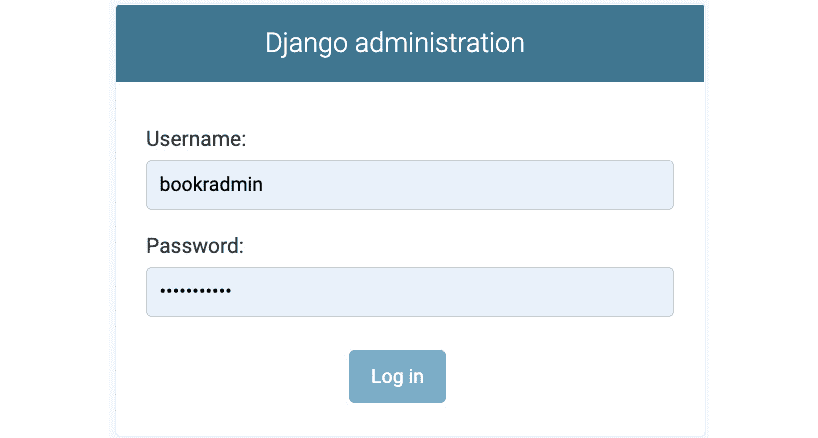

图 4.2 Django 管理登录表单

在这个练习中，你创建了一个超级用户账户，我们将在这个章节的剩余部分使用它，根据需要分配或删除权限。

注意

本章中使用的所有练习和活动的代码可以在本书的 GitHub 仓库中找到，网址为 [`packt.live/3pC5CRr`](http://packt.live/3pC5CRr)。

# 使用 Django 管理应用进行 CRUD 操作

让我们回到我们从鲍勃、爱丽丝和戴维那里收到的请求。作为超级用户，你的任务将涉及创建、更新、检索和删除各种用户账户、评论和标题名称。这些活动统称为 CRUD。CRUD 操作是管理应用行为的核心。结果是，管理应用已经知道来自另一个 Django 应用 `Authentication and Authorization` 的模型，在 `INSTALLED_APPS` 中被引用为 `'django.contrib.auth'`。当我们登录到 `http://127.0.0.1:8000/admin/` 时，我们看到了授权应用的模型，如图 *4.3* 所示：

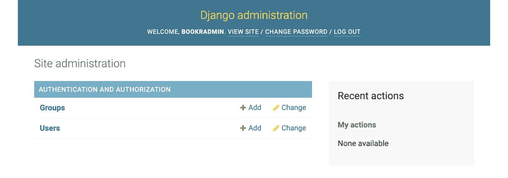

图 4.3：Django 管理窗口

当管理应用初始化时，它会调用其 `autodiscover()` 方法来检测是否有其他已安装的应用包含管理模块。如果有，这些管理模型将被导入。在我们的例子中，它发现了 `'django.contrib.auth.admin'`。现在模块已导入，我们的超级用户账户已准备就绪，让我们先从鲍勃、爱丽丝和戴维的请求开始工作。

## 创建

在爱丽丝开始撰写她的评论之前，我们需要通过管理应用为她创建一个账户。一旦完成，我们就可以查看我们可以分配给她的管理访问级别。点击 `用户` 旁边的 `+ 添加` 链接（参见图 *4.3*），并填写表单，如图 *4.4* 所示。

注意

我们不希望任何随机用户都能访问 Bookr 用户的账户。因此，选择强大、安全的密码至关重要。

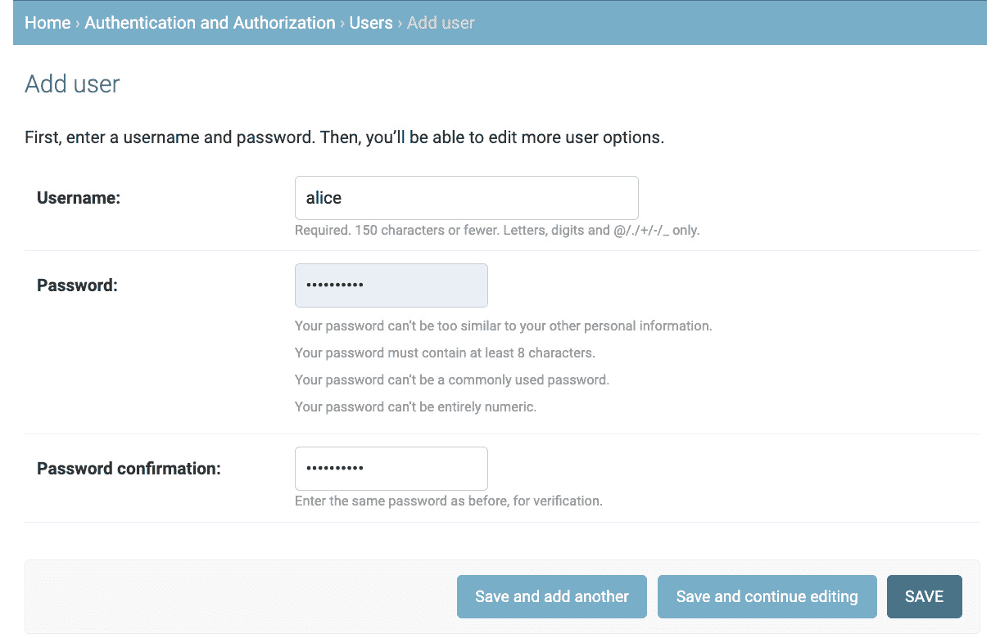

图 4.4：添加用户页面

表单底部有三个按钮：

+   `保存并添加另一个` 创建用户并再次渲染相同的 `添加用户` 页面，字段为空。

+   `保存并继续编辑` 创建用户并加载 `更改用户` 页面。`更改用户` 页面允许你添加在 `添加用户` 页面上未出现的信息，例如 `名字`、`姓氏` 等（见图 *4.5*）。请注意，`密码` 在表单中没有可编辑字段。相反，它显示了存储时使用的哈希技术信息，以及一个链接到单独的 *更改密码* 表单。

+   `保存` 创建用户并允许用户导航到 `选择用户以更改` 列表页面，如图 4.6 所示。![图 4.5：点击保存并继续编辑后显示的更改用户页面]

    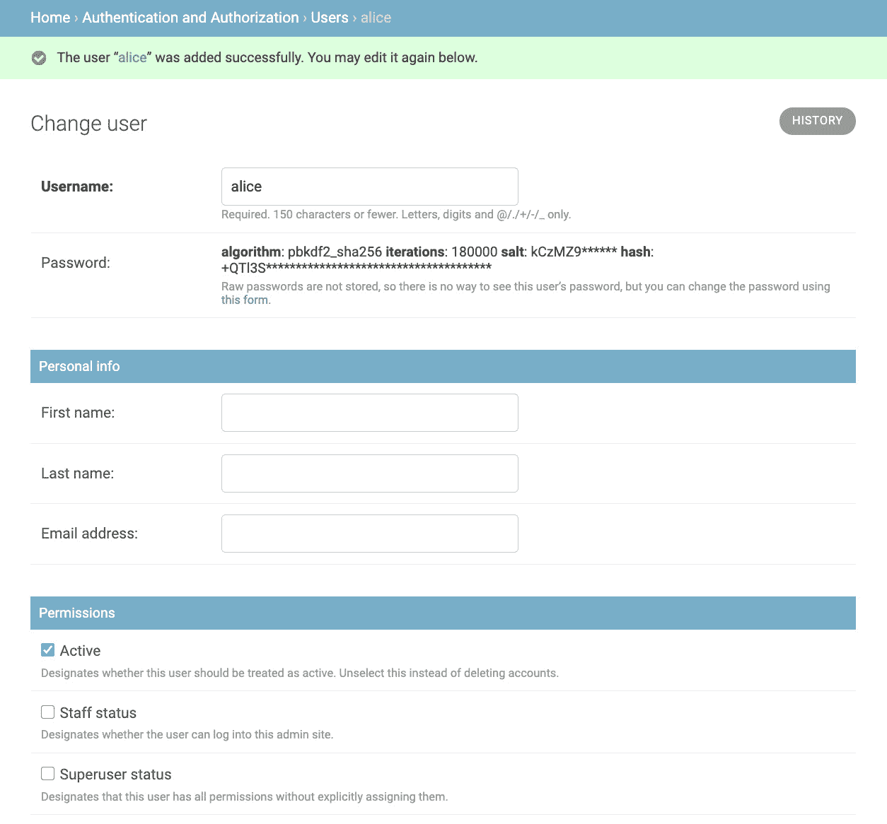

图 4.5：点击保存并继续编辑后显示的更改用户页面

## 检索

管理任务需要分配给一些用户，为此，管理员（拥有超级用户账户的人）希望查看电子邮件地址以 *n@example.com* 结尾的用户并将任务分配给这些用户。这就是在 `添加用户` 页面上的 `保存` 按钮（参见图 4.4*），我们将被带到 `选择用户以更改` 列表页面（如图 4.6 所示），执行 `创建` 表单也可以通过点击 `选择用户以更改` 列表页面上的 `添加用户` 按钮来访问。因此，在我们添加了更多用户之后，更改列表将看起来像这样：

![图 4.6：选择用户以更改页面]

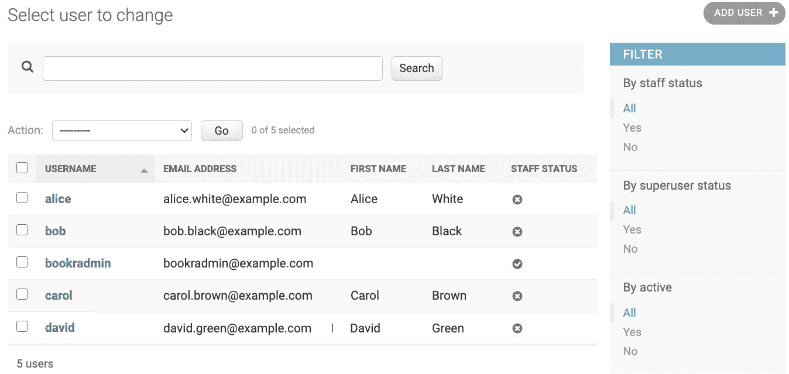

![图 4.6：选择用户以更改页面]

表单顶部有一个 `搜索` 栏，用于搜索用户的用户名、电子邮件地址以及名和姓。右侧是一个 `筛选` 面板，根据 `员工状态`、`超级用户状态` 和 `活跃状态` 的值来缩小选择范围。在 *图 4.7* 中，我们将看到当我们搜索字符串 `n@example.com` 并查看结果时会发生什么。这将只返回电子邮件地址以 *n* 结尾且域名以 *example.com* 开头的用户名称。我们将只看到三个符合此要求的电子邮件地址的用户 – `bookradmin@example.com`、`carol.brown@example.com` 和 `david.green@example.com`：

![图 4.7：通过电子邮件地址的一部分搜索用户]

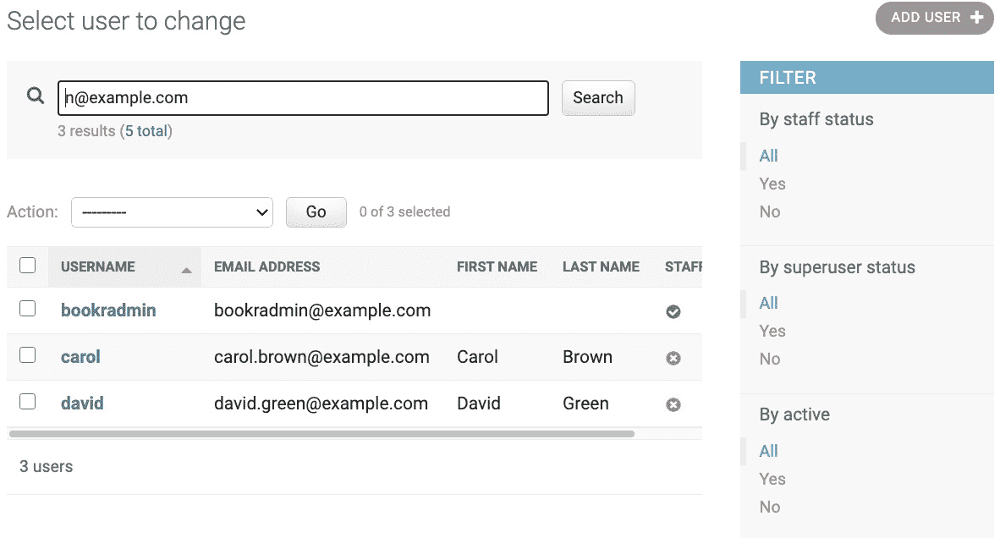

![图 4.7：通过电子邮件地址的一部分搜索用户]

## 更新

记住 Bob 想要更新他的个人资料。让我们在 `选择用户以更改` 列表中的 `bob` 用户名链接：

![图 4.8：从“选择用户以更改”列表中选择 bob]

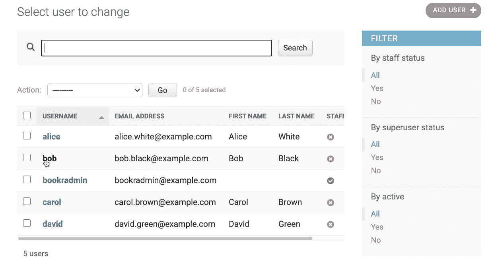

![图 4.8：从选择用户以更改列表中选择 bob]

这将带我们回到 `更改用户` 表单，可以在其中输入 `名`、`姓` 和 `电子邮件地址` 的值：

![图 4.9：添加个人信息]

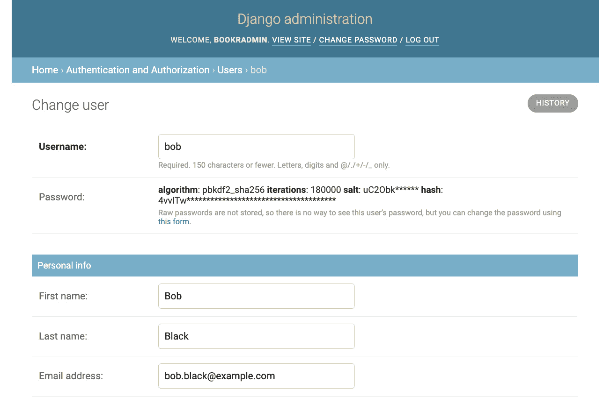

![图 4.9：添加个人信息]

如 *图 4.9* 所示，我们在这里添加关于 Bob 的个人信息 – 他的名字、姓氏和电子邮件地址，具体而言。

另一种更新操作是“软删除”。`Active` 布尔属性允许我们停用用户，而不是删除整个记录并丢失所有依赖于该账户的数据。这种使用布尔标志来表示记录为非活动或已删除（并随后从查询中过滤掉这些标记的记录）的做法被称为通过勾选相应的复选框来表示的`Staff 状态`或`Superuser 状态`：

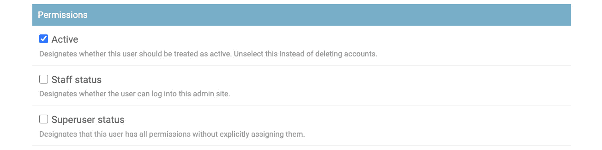

图 4.10：Active、Staff 状态和 Superuser 状态布尔值

## 删除

David 不再想使用 Bookr 应用程序，并要求我们删除他的账户。auth admin 也支持这一点。在“选择要更改的用户”列表页面上选择用户或用户记录，并从“操作”下拉菜单中选择“删除选定的用户”选项。然后点击`Go`按钮（*图 4.11*）：

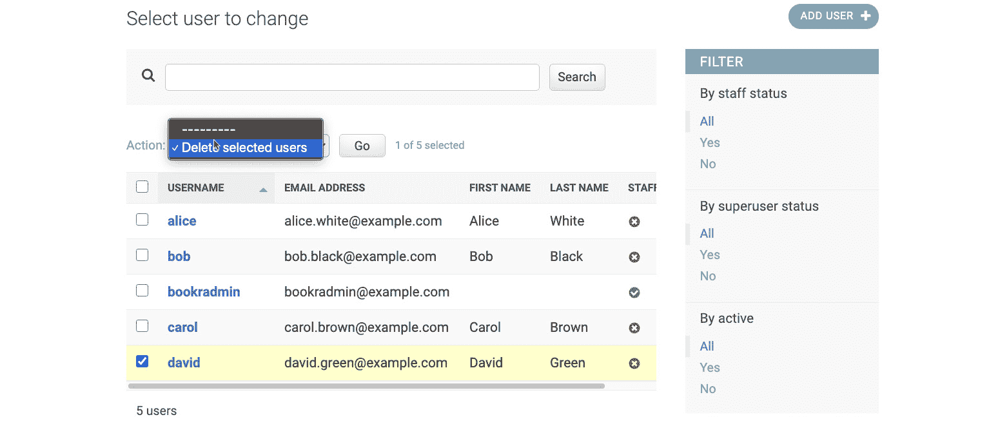

图 4.11：从选择要更改的用户列表页面上删除

删除对象后，您将看到一个确认屏幕，并被带回到“选择要更改的用户”列表：

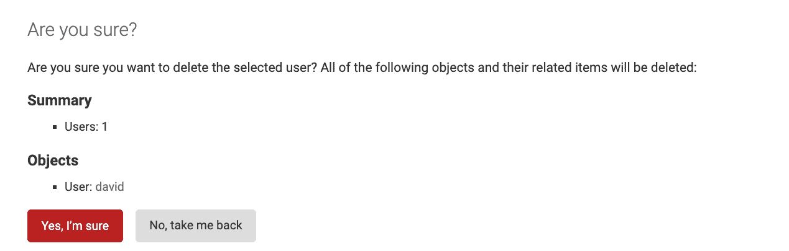

图 4.12：用户删除确认

用户被删除后，您将看到以下消息：


图 4.13：用户删除通知

在确认之后，你会发现 David 的账户已不再存在。

到目前为止，我们已经学习了如何添加新用户、获取另一个用户的详细信息、更改用户的资料数据以及删除用户。这些技能帮助我们满足了 Alice、Bob 和 David 的请求。随着我们应用用户数量的增长，管理来自数百名用户的请求最终将变得相当困难。解决这个问题的方法之一是将一些管理职责委托给一组选定的用户。我们将在接下来的部分中学习如何做到这一点。

## 用户和组

Django 的认证模型由用户、组和权限组成。用户可以属于多个组，这是对用户进行分类的一种方式。它还通过允许将权限分配给用户集合以及个人来简化权限的实现。

在 *练习 4.01*，*创建 Superuser 账户* 中，我们看到了如何满足 Alice、David 和 Bob 修改其个人资料的需求。这做起来相当容易，我们的应用程序似乎已经准备好处理他们的请求。

当用户数量增加时会发生什么？管理员用户能否一次性管理 100 或 150 个用户？正如您所想象的，这可能是一项相当复杂的任务。为了克服这一点，我们可以给一组特定的用户赋予更高的权限，他们可以帮助减轻管理员的负担。这就是组派上用场的地方。虽然我们将在*第九章*，*会话和身份验证*中了解更多关于用户、组和权限的内容，但我们可以通过创建一个包含可以访问管理界面但缺乏许多强大功能（如添加、编辑或删除组或添加或删除用户的能力）的`帮助台用户组`来开始理解组和它们的功能。

## 练习 4.02：通过管理应用添加和修改用户和组

在这个练习中，我们将授予我们 Bookr 用户之一，Carol，一定级别的管理访问权限。首先，我们将定义组的访问级别，然后我们将 Carol 添加到该组。这将允许 Carol 更新用户资料和检查用户日志。以下步骤将帮助您实施此练习：

1.  访问管理界面`http://127.0.0.1:8000/admin/`并使用通过超级用户命令设置的账户以`bookradmin`身份登录。

1.  在管理界面中，通过链接到`首页` › `身份验证和授权` › `组`：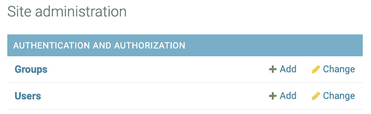

    图 4.14：身份验证和授权页面上的组和用户选项

1.  在右上角使用`ADD GROUP +`添加一个新组：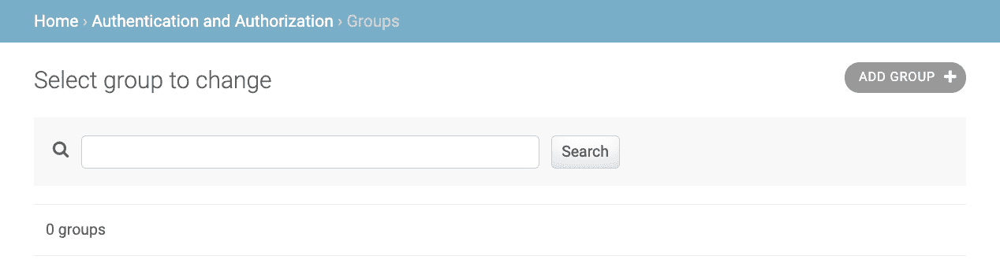

    图 4.15：添加新组

1.  将组命名为`帮助台用户`并赋予以下权限，如图*图 4.16*所示：

    `可以查看日志条目`

    `可以查看权限`

    `可以更改用户`

    `可以查看用户`

    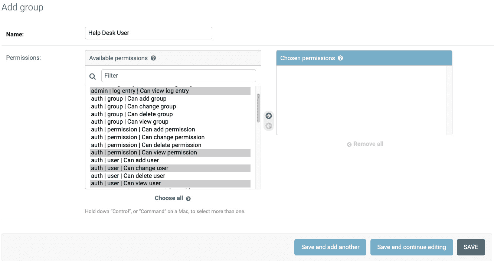

    图 4.16：选择权限

    可以通过从“可用权限”中选择权限并点击中间的右箭头，使它们出现在“已选权限”下完成此操作。请注意，要一次性添加多个权限，您可以按住*Ctrl*键（或 Mac 上的*Command*键）以选择多个：

    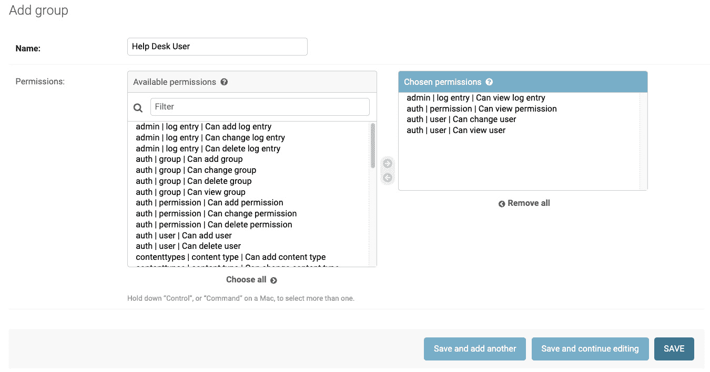

    图 4.17：将选定的权限添加到已选权限

    一旦您点击`保存`按钮，您将看到一个确认消息，表明已成功添加了组`帮助台用户`：

    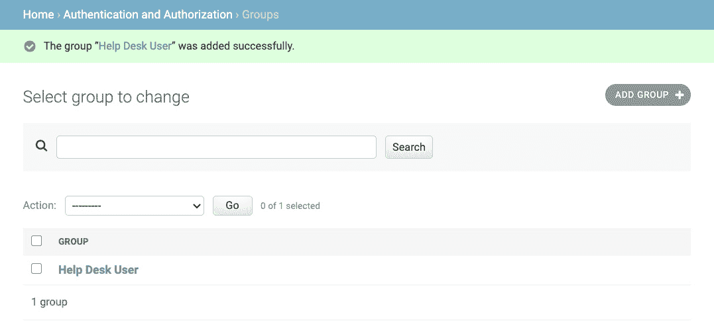

    图 4.18：确认已添加帮助台用户组的消息

1.  现在，导航到`首页` › `身份验证和授权` › `用户`并点击具有名字首字母`carol`的用户链接：

    图 4.19：点击用户名 carol

1.  滚动到“权限”字段设置，并选择“员工状态”复选框。这是 Carol 能够登录到管理应用所必需的：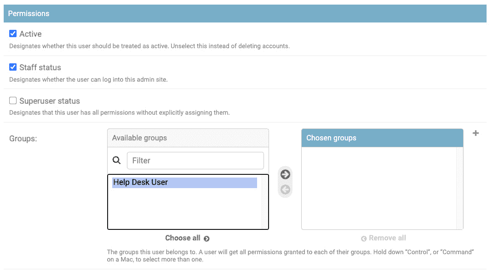

    图 4.20：点击员工状态复选框

1.  通过从“可用组”选择框中选择它（参见图 4.20）并点击右箭头将其移至她的“选择组”列表中（如图 4.21 所示），将 Carol 添加到我们在上一步骤中创建的“帮助台用户”组中。请注意，除非你这样做，否则 Carol 将无法使用她的凭据登录到管理界面：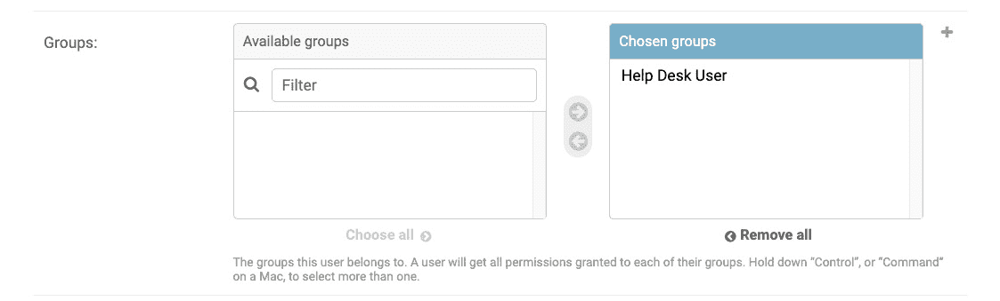

    图 4.21：将帮助台用户组移至 Carol 选择的组列表中

1.  让我们测试一下到目前为止我们所做的是否得到了正确的结果。为此，从管理员站点注销并再次以`carol`身份登录。注销后，你应该在屏幕上看到以下内容：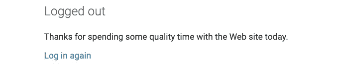

图 4.22：注销屏幕

注意

如果你记不起你最初给她设置的密码，你可以在命令行中通过输入`python3 manage.py changepassword carol`来更改密码。

登录成功后，在管理员仪表板上，你可以看到没有指向“组”的链接：

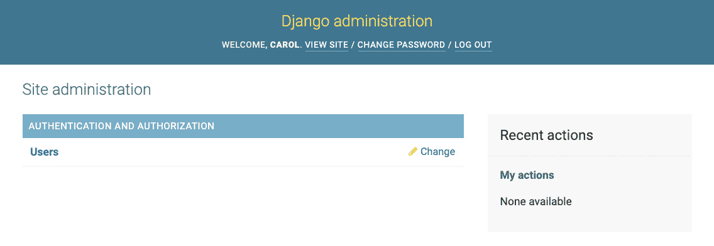

图 4.23：管理员仪表板

由于我们没有将任何组权限，甚至`auth | group | Can view group`，分配给“帮助台用户”组，当 Carol 登录时，她无法访问“组”管理界面。同样，导航到“首页 › 认证和授权 › 用户”。点击用户链接，你会看到没有编辑或删除用户的选项。这是因为授予了帮助台用户组的权限，而 Carol 是该组成员。该组成员可以查看和编辑用户，但不能添加或删除任何用户。

在这个练习中，我们学习了如何授予我们 Django 应用用户一定量的管理权限。

# 注册评论模型

假设 Carol 的任务是改进 Bookr 中的评论部分；也就是说，只有最相关和最全面的评论应该显示，而重复或垃圾信息应该被删除。为此，她将需要访问`reviews`模型。正如我们通过调查组和用户所看到的那样，管理员应用已经包含了来自认证和授权应用的模型的管理页面，但它还没有引用我们的 Reviews 应用中的模型。

为了让管理应用知道我们的模型，我们需要明确地将它们注册到管理应用中。幸运的是，我们不需要修改管理应用的代码来做这件事，因为我们可以将管理应用导入到我们的项目中，并使用它的 API 来注册我们的模型。这已经在认证和授权应用中完成了，所以让我们用我们的“评论”应用试一试。我们的目标是能够使用管理应用来编辑我们的`reviews`模型中的数据。

查看一下`reviews/admin.py`文件。这是一个占位符文件，它是通过我们在*第一章*，*Django 简介*中使用的`startapp`子命令生成的，目前包含以下行：

```py
from django.contrib import admin
# Register your models here.
```

现在我们可以尝试扩展这个功能。为了让管理应用知道我们的模型，我们可以修改`reviews/admin.py`文件并导入模型。然后我们可以使用`AdminSite`对象，`admin.site`，来注册模型。`AdminSite`对象包含 Django 管理应用的实例（稍后我们将学习如何子类化这个`AdminSite`并覆盖其许多属性）。然后，我们的`reviews/admin.py`将看起来如下：

```py
from django.contrib import admin
from reviews.models import Publisher, Contributor, \
Book, BookContributor, Review
# Register your models here.
admin.site.register(Publisher)
admin.site.register(Contributor)
admin.site.register(Book)
admin.site.register(BookContributor)
admin.site.register(Review)
```

`admin.site.register`方法通过将其添加到`admin.site._registry`中包含的类注册表中，使模型对管理应用可用。如果我们选择不通过管理界面使模型可访问，我们只需不注册它即可。当你刷新浏览器中的`http://127.0.0.1:8000/admin/`时，你将在管理应用首页看到以下内容。注意在导入`reviews`模型后管理页面的外观变化：

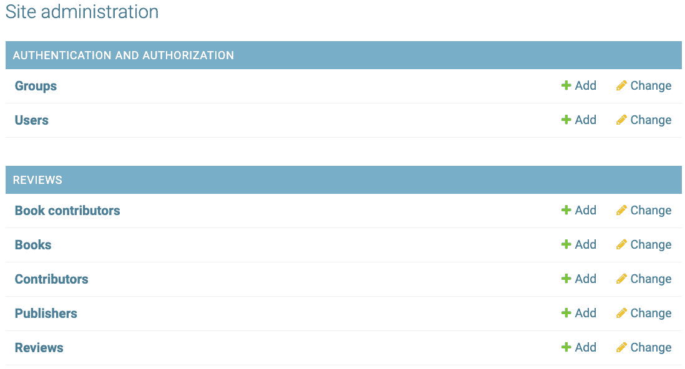


图 4.24：管理应用首页

## 变更列表

我们现在为我们的模型创建了变更列表。如果我们点击“发布者”链接，我们将被带到`http://127.0.0.1:8000/admin/reviews/publisher`并看到包含指向发布者链接的变更列表。这些链接由“发布者”对象的`id`字段指定。

如果你的数据库已经通过*第三章*中的脚本填充，你将看到一个包含七个发布者的列表，看起来像*图 4.25*：

注意

根据你的数据库状态和已完成的活动，这些示例中的对象 ID、URL 和链接可能与这里列出的不同。

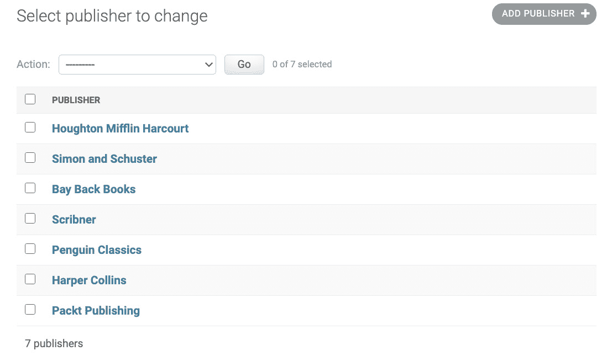


图 4.25：选择要更改的发布者列表

## 发布者变更页面

在`http://127.0.0.1:8000/admin/reviews/publisher/1`的发布者变更页面包含我们可能预期的内容（见*图 4.26*）。这里有一个用于编辑发布者详情的表单。这些详情是从`reviews.models.Publisher`类派生出来的：

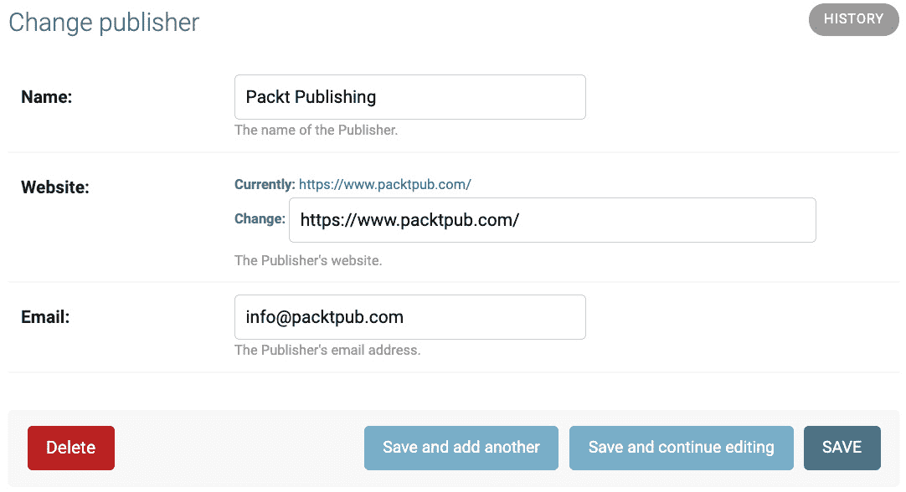


图 4.26：发布者变更页面

如果我们点击了“添加出版商”按钮，管理应用会返回用于添加出版商的类似表单。管理应用的美妙之处在于，它只通过一行代码——`admin.site.register(Publisher)`——就为我们提供了所有这些 CRUD 功能，使用`reviews.models.Publisher`属性的定义作为页面内容的模式：

```py
class Publisher(models.Model):
    """A company that publishes books."""
    name = models.CharField\
           (help_text="The name of the Publisher.",\
            max_length=50)
    website = models.URLField\
              (help_text="The Publisher's website.")
    email = models.EmailField\
            (help_text="The Publisher's email address.")
```

出版商的“名称”字段被限制为 50 个字符，如模型中指定。在每个字段下方出现的灰色帮助文本是从模型上指定的`help_text`属性派生出来的。我们可以看到，`models.CharField`、`models.URLField`和`models.EmailField`分别作为 HTML 中的`text`、`url`和`email`类型的输入元素渲染。

表单中的字段在适当的地方带有验证。除非模型字段设置为`blank=True`或`null=True`，否则如果字段留空，表单将抛出错误，例如对于`Publisher.name`字段。同样，由于`Publisher.website`和`Publisher.email`分别定义为`models.URLField`和`models.EmailField`的实例，它们将相应地进行验证。在*图 4.27*中，我们可以看到“名称”作为必填字段的验证，验证“网站”作为 URL，以及验证“电子邮件”作为电子邮件地址：

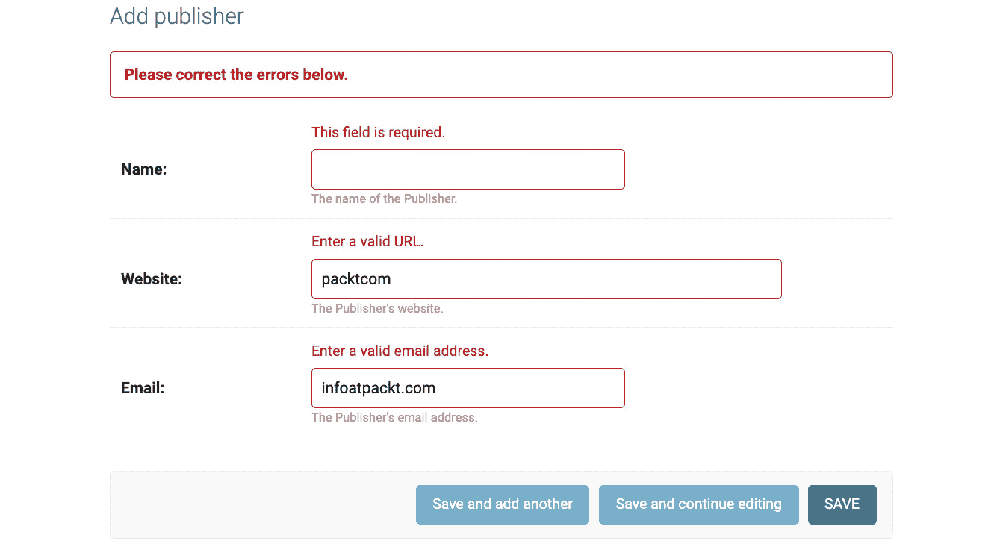

图 4.27：字段验证

检查管理应用如何渲染模型元素，以了解其工作方式是有用的。在您的浏览器中，右键单击“查看页面源代码”并检查此表单已渲染的 HTML。您将看到一个浏览器标签页显示如下内容：

```py
<fieldset class="module aligned ">
    <div class="form-row errors field-name">
        <ul class="errorlist"><li>This field is required.</li></ul>
            <div>
                    <label class="required" for="id_name">Name:</label>
                        <input type="text" name="name" class="vTextField"
                         maxlength="50" required id="id_name">
                    <div class="help">The name of the Publisher.</div>
            </div>
    </div>
    <div class="form-row errors field-website">
        <ul class="errorlist"><li>Enter a valid URL.</li></ul>
            <div>
                    <label class="required" for="id_website">Website:</label>
                        <input type="url" name="website" value="packtcom"
                         class="vURLField" maxlength="200" required
                         id="id_website">
                    <div class="help">The Publisher's website.</div>
            </div>
    </div>
    <div class="form-row errors field-email">
        <ul class="errorlist"><li>Enter a valid email address.</li></ul>
            <div>
                    <label class="required" for="id_email">Email:</label>
                        <input type="email" name="email" value="infoatpackt.com"
                         class="vTextField" maxlength="254" required
                         id="id_email">
                    <div class="help">The Publisher's email address.</div>
            </div>
  </div>
</fieldset>
```

表单具有`publisher_form` ID，并包含一个与`reviews/models.py`中`Publisher`模型的数据库结构相对应的`fieldset`，如下所示：

```py
class Publisher(models.Model):
    """A company that publishes books."""
    name = models.CharField\
           (max_length=50,
            help_text="The name of the Publisher.")
    website = models.URLField\
              (help_text="The Publisher's website.")
    email = models.EmailField\
            (help_text="The Publisher's email address.")
```

注意，对于名称，输入字段被渲染如下：

```py
<input type="text" name="name" value="Packt Publishing"
                   class="vTextField" maxlength="50" required="" id="id_name">
```

这是一个必填字段，它具有`text`类型和由模型定义中的`max_length`参数定义的`maxlength`为 50：

```py
    name = models.CharField\
           (help_text="The name of the Publisher.",\
            max_length=50)
```

同样，我们可以看到在模型中定义的网站和电子邮件作为`URLField`和`EmailField`被分别渲染为 HTML 中的`url`和`email`类型的输入元素：

```py
<input type="url" name="website" value="https://www.packtpub.com/"
                     class="vURLField" maxlength="200" required=""
                     id="id_website">            
<input type="email" name="email" value="info@packtpub.com"
                    class="vTextField" maxlength="254" required=""
                    id="id_email">
```

我们已经了解到，这个 Django 管理应用根据我们提供的模型定义，为 Django 模型生成合理的 HTML 表示形式。

## 书籍更改页面

类似地，可以通过从“站点管理”页面选择“书籍”并然后在更改列表中选择特定的书籍来访问更改页面：

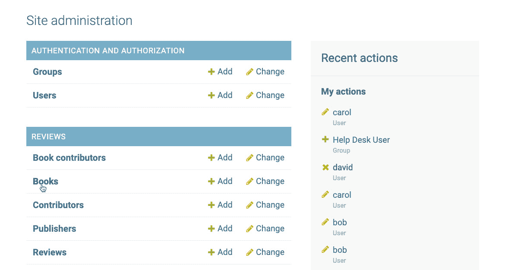

图 4.28：从站点管理页面选择书籍

如前一个屏幕截图所示，点击“书籍”后，您会在屏幕上看到以下内容：

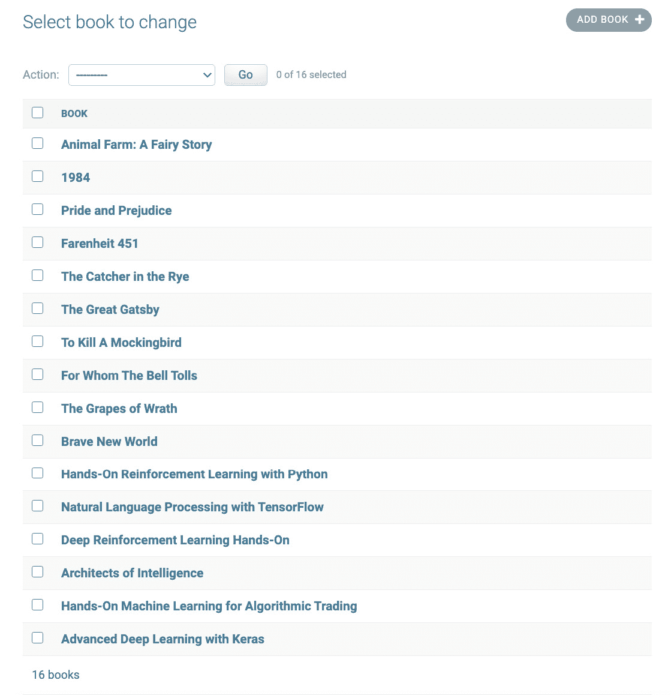

图 4.29：书籍更改页面

在这种情况下，选择书籍 *智能建筑师* 将带我们到 URL `http://127.0.0.1:8000/admin/reviews/book/3/change/`。在上一个示例中，所有模型字段都被呈现为简单的 HTML 文本小部件。`models.Book` 中使用的 `django.db.models.Field` 的某些其他子类的呈现值得更仔细地检查：

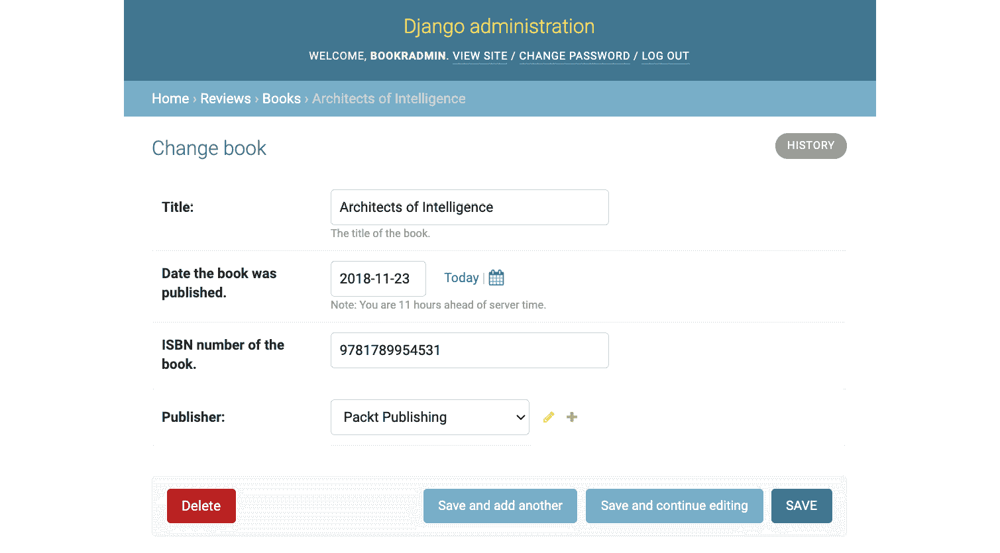

图 4.30：更改书籍页面

在这里，`publication_date` 使用 `models.DateField` 定义。它通过日期选择小部件呈现。小部件的视觉表示将在不同的操作系统和浏览器选择中有所不同：

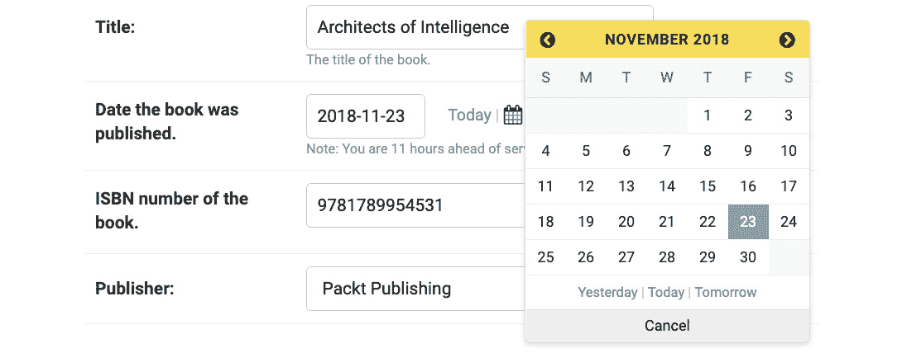

图 4.31：日期选择小部件

由于 `Publisher` 被定义为外键关系，它通过一个 `Publisher` 下拉菜单呈现，其中包含 `Publisher` 对象的列表：

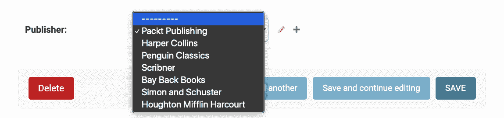

图 4.32：出版社下拉菜单

这带我们来到了管理员应用如何处理删除操作。管理员应用在确定如何实现删除功能时，会从模型的 外键约束中获取线索。在 `BookContributor` 模型中，`Contributor` 被定义为外键。`reviews/models.py` 中的代码如下：

```py
contributor = models.ForeignKey(Contributor, on_delete=models.CASCADE)
```

通过在外键上设置 `on_delete=CASCADE`，模型指定了当删除记录时所需的数据库行为；删除将级联到由外键引用的其他对象。

## 练习 4.03：管理员应用中的外键和删除行为

目前，`reviews` 模型中的所有 `ForeignKey` 关系都定义为 `on_delete=CASCADE` 行为。例如，考虑一个管理员删除出版商的情况。这将删除与出版商关联的所有书籍。我们不希望发生这种情况，这正是我们将在此练习中改变的行为：

1.  访问 `Contributors` 变更列表 `http://127.0.0.1:8000/admin/reviews/contributor/` 并选择一个要删除的贡献者。确保该贡献者是某本书的作者。

1.  点击 `删除` 按钮，但在确认对话框中不要点击 `是，我确定`。你会看到一个类似于 *图 4.33* 中的消息：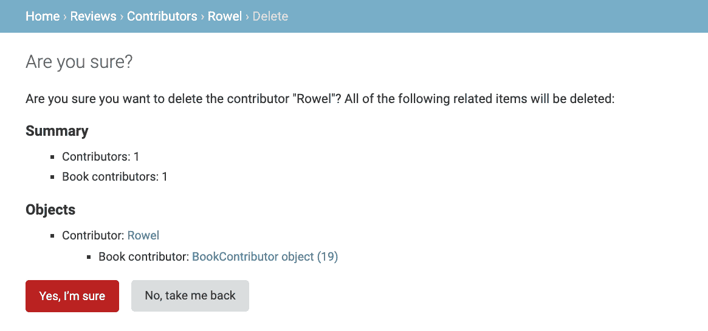

    图 4.33：级联删除确认对话框

    根据 `on_delete=CASCADE` 外键参数，我们被警告，删除此 `Contributor` 对象将对 `BookContributor` 对象产生级联效应。

1.  在 `reviews/models.py` 文件中，将 `BookContributor` 的 `Contributor` 属性修改为以下内容并保存文件：

    ```py
    contributor = models.ForeignKey(Contributor, \
                                    on_delete=models.PROTECT)
    ```

1.  现在，再次尝试删除 `Contributor` 对象。你会看到一个类似于 *图 4.34* 中的消息：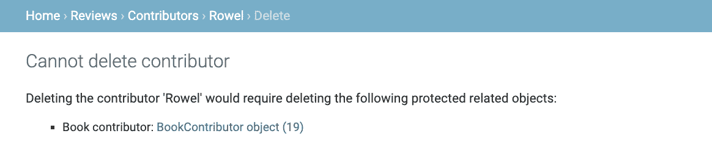

    图 4.34：外键保护错误

    因为`on_delete`参数是`PROTECT`，我们尝试删除具有依赖关系的对象将会抛出错误。如果我们在这个模型中使用这种方法，我们需要在删除原始对象之前删除`ForeignKey`关系中的对象。在这种情况下，这意味着在删除`Contributor`对象之前删除`BookContributor`对象。

1.  现在我们已经了解了管理应用程序如何处理`ForeignKey`关系，让我们将`BookContributor`类中的`ForeignKey`定义恢复为以下内容：

    ```py
    contributor = models.ForeignKey(Contributor, \
                                    on_delete=models.CASCADE)
    ```

我们已经检查了管理应用程序的行为如何适应在模型定义中表达出的`ForeignKey`约束。如果`on_delete`行为设置为`models.PROTECT`，管理应用程序将返回一个错误，解释为什么受保护的对象阻止了删除。在构建现实世界的应用程序时，这种功能可能会派上用场，因为经常会有手动错误意外导致删除重要记录的风险。在下一节中，我们将探讨如何自定义我们的管理应用程序界面以获得更流畅的用户体验。

# 自定义管理界面

在最初开发应用程序时，默认管理界面的便利性对于构建应用程序的快速原型非常出色。确实，对于许多需要最小数据维护的简单应用程序或项目，这个默认管理界面可能完全足够。然而，随着应用程序成熟到发布阶段，通常需要自定义管理界面以促进更直观的使用并稳健地控制数据，同时考虑用户权限。你可能希望保留默认管理界面的某些方面，同时调整某些功能以更好地满足你的需求。例如，你可能希望出版商列表显示出版机构的完整名称，而不是“`Publisher(1)`”，“`Publisher(2)`”等等。除了美学吸引力外，这还使得使用和浏览应用程序变得更加容易。

## 站点范围内的 Django 管理自定义

我们已经看到一页标题为 `登录 | Django 站点管理` 的页面，其中包含一个 `Django 管理` 表单。然而，Bookr 应用程序的管理用户可能会对所有的这些 Django 术语感到困惑，如果他们必须处理所有具有相同管理应用程序的多个 Django 应用程序，这将非常令人困惑，并且可能导致错误。作为一个直观且用户友好的应用程序的开发者，你可能会想要自定义这一点。像这样的全局属性被指定为`AdminSite`对象的属性。以下表格详细说明了如何进行一些简单的自定义，以改善你应用程序管理界面的可用性：

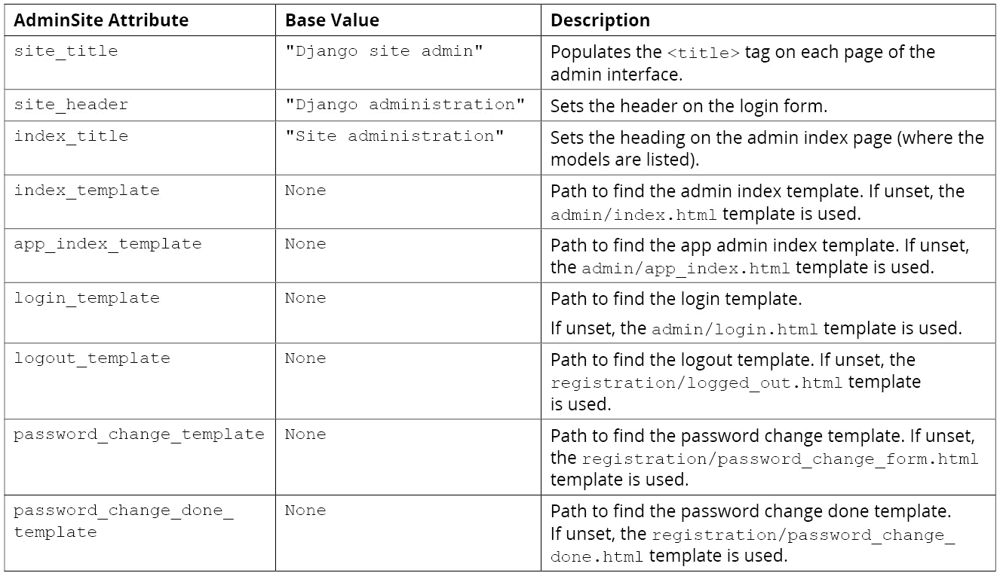


图 4.35：重要的 AdminSite 属性

## 从 Python Shell 检查 AdminSite 对象

让我们更深入地看看`AdminSite`类。我们之前已经遇到了`AdminSite`类的一个对象。它是我们在上一节中使用的`admin.site`对象，即*注册评论模型*。如果开发服务器没有运行，现在就使用`runserver`子命令启动它，如下所示（在 Windows 上使用`python`而不是`python3`）：

```py
python3 manage.py runserver
```

我们可以通过在 Django shell 中导入 admin 应用来检查`admin.site`对象，再次使用`manage.py`脚本：

```py
python3 manage.py shell
>>>from django.contrib import admin
```

我们可以交互式地检查`site_title`、`site_header`和`index_title`的默认值，并看到它们与我们已经在 Django 管理应用渲染的网页上观察到的预期值`'Django site admin'`、`'Django administration'`和`'Site administration'`相匹配：

```py
>>> admin.site.site_title
'Django site admin'
>>> admin.site.site_header
'Django administration'
>>> admin.site.index_title
'Site administration'
```

`AdminSite`类还指定了用于渲染管理界面并确定其全局行为的表单和视图。

### 子类化 AdminSite

我们可以对`reviews/admin.py`文件进行一些修改。我们不再导入`django.contrib.admin`模块并使用其站点对象，而是导入`AdminSite`，创建其子类，并实例化我们的自定义`admin_site`对象。考虑以下代码片段。在这里，`BookrAdminSite`是`AdminSite`的一个子类，它包含自定义的`site_title`、`site_header`和`index_title`值；`admin_site`是`BookrAdminSite`的一个实例；我们可以使用这个实例来代替默认的`admin.site`对象，以注册我们的模型。`reviews/admin.py`文件将如下所示：

```py
from django.contrib.admin import AdminSite
from reviews.models import (Publisher, Contributor, Book,\
     BookContributor, Review)
class BookrAdminSite(AdminSite):
    title_header = 'Bookr Admin'
    site_header = 'Bookr administration'
    index_title = 'Bookr site admin'
admin_site = BookrAdminSite(name='bookr')
# Register your models here.
admin_site.register(Publisher)
admin_site.register(Contributor)
admin_site.register(Book)
admin_site.register(BookContributor)
admin_site.register(Review)
```

由于我们现在创建了自己的`admin_site`对象，它覆盖了`admin.site`对象的行为，我们需要在我们的代码中删除对`admin.site`对象的现有引用。在`bookr/urls.py`中，我们需要将管理指向新的`admin_site`对象并更新我们的 URL 模式。否则，我们仍然会使用默认的管理站点，我们的自定义设置将被忽略。更改将如下所示：

```py
from reviews.admin import admin_site
from django.urls import include, path
import reviews.views
urlpatterns = [path('admin/', admin_site.urls),\
               path('', reviews.views.index),\
               path('book-search/', reviews.views.book_search, \
                    name='book_search'),\
               path('', include('reviews.urls'))]
```

这在登录界面上产生了预期的结果：

![图 4.36：自定义登录界面]

![图片 B15509_04_36.jpg]

图 4.36：自定义登录界面

然而，现在出现了问题；那就是，我们失去了认证对象的界面。之前，管理应用通过自动发现过程在`reviews/admin.py`和`django.contrib.auth.admin`中查找注册的模型，但现在我们通过创建一个新的`AdminSite`来覆盖了这种行为：

![图 4.37：自定义 AdminSite 缺少认证和授权]

![图片 B15509_04_37.jpg]

图 4.37：自定义 AdminSite 缺少认证和授权

我们可以选择在`bookr/urls.py`中将两个`AdminSite`对象都引用到 URL 模式中，但这种方法意味着我们将最终拥有两个独立的用于认证和评论的 admin 应用。因此，URL `http://127.0.0.1:8000/admin`将带您访问从`admin.site`对象派生的原始 admin 应用，而`http://127.0.0.1:8000/bookradmin`将带您到我们的`BookrAdminSite` `admin_site`。这不是我们想要做的，因为我们仍然有一个没有添加我们子类化`BookrAdminSite`时所做的定制的 admin 应用：

```py
from django.contrib import admin
from reviews.admin import admin_site
from django.urls import path
urlpatterns = [path('admin/', admin.site.urls),\
               path('bookradmin/', admin_site.urls),]
```

这一直是 Django admin 界面中的一个笨拙问题，导致早期版本中出现了许多临时解决方案。自从 Django 2.1 发布以来，有一个简单的方法可以集成自定义的 admin 应用界面，而不会破坏自动发现或其其他默认功能。由于`BookrAdminSite`是项目特定的，代码实际上并不属于我们的`reviews`文件夹。我们应该将`BookrAdminSite`移动到`Bookr`项目目录顶层的名为`admin.py`的新文件中：

```py
from django.contrib import admin
class BookrAdminSite(admin.AdminSite):
    title_header = 'Bookr Admin'
    site_header = 'Bookr administration'
    index_title = 'Bookr site admin'
```

`bookr/urls.py`中的 URL 设置路径更改为`path('admin/', admin.site.urls)`，我们定义我们的`ReviewsAdminConfig`。`reviews/apps.py`文件将包含以下附加行：

```py
from django.contrib.admin.apps import AdminConfig
class ReviewsAdminConfig(AdminConfig):
    default_site = 'admin.BookrAdminSite'
```

将`django.contrib.admin`替换为`reviews.apps.ReviewsAdminConfig`，因此`bookr/settings.py`文件中的`INSTALLED_APPS`将如下所示：

```py
INSTALLED_APPS = ['reviews.apps.ReviewsAdminConfig',\
                  'django.contrib.auth',\
                  'django.contrib.contenttypes',\
                  'django.contrib.sessions',\
                  'django.contrib.messages',\
                  'django.contrib.staticfiles',\
                  'reviews']
```

使用`default_site`的`ReviewsAdminConfig`规范，我们不再需要用自定义的`AdminSite`对象`admin_site`替换对`admin.site`的引用。我们可以用最初的`admin.site`调用替换那些`admin_site`调用。现在，`reviews/admin.py`恢复为以下内容：

```py
from django.contrib import admin
from reviews.models import (Publisher, Contributor, Book,\
     BookContributor, Review)
# Register your models here.
admin.site.register(Publisher)
admin.site.register(Contributor)
admin.site.register(Book, BookAdmin)
admin.site.register(BookContributor)
admin.site.register(Review)
```

我们还可以自定义`AdminSite`的其他方面，但我们将等到对 Django 的模板和表单有更深入的了解后，在*第九章*，*会话和认证*中重新讨论这些内容。

## 活动四点零一：自定义 SiteAdmin

您已经学会了如何在 Django 项目中修改`AdminSite`对象的属性。此活动将挑战您使用这些技能来自定义一个新项目，并覆盖其站点标题、站点页眉和索引页眉。此外，您将通过创建特定于项目的模板并将其设置在我们的自定义`SiteAdmin`对象中来替换注销消息。您正在开发一个实现留言板的 Django 项目，称为*Comment8or*。*Comment8or*面向技术受众，因此您需要使措辞简洁并使用缩写：

1.  *Comment8or* admin 站点将被称作`c8admin`。这将出现在网站页眉和索引标题中。

1.  对于标题页眉，它将显示为`c8 site admin`。

1.  默认的 Django admin 注销消息是`Thanks for spending some quality time with the Web site today.` 在 Comment8or 中，它将显示为`Bye from c8admin.`。

完成此活动需要遵循以下步骤：

1.  按照你在 *第一章*，*Django 简介* 中学到的流程，创建一个新的 Django 项目，名为 `comment8or`，一个名为 `messageboard` 的应用，并运行迁移。创建一个名为 `c8admin` 的超级用户。

1.  在 Django 源代码中，有一个位于 `django/contrib/admin/templates/registration/logged_out.html` 的登出页面模板。

1.  在你的项目目录 `comment8or/templates/comment8or` 下复制它。根据要求修改模板中的信息。

1.  在项目内部，创建一个 `admin.py` 文件，实现一个自定义的 `SiteAdmin` 对象。根据要求设置属性 `index_title`、`title_header`、`site_header` 和 `logout_template` 的适当值。

1.  在 `messageboard/apps.py` 中添加一个自定义的 `AdminConfig` 子类。

1.  在 `comment8or/settings.py` 中将管理应用替换为自定义的 `AdminConfig` 子类。

1.  配置 `TEMPLATES` 设置，以便项目模板可被发现。

    当项目首次创建时，登录、应用索引和登出页面将如下所示：

    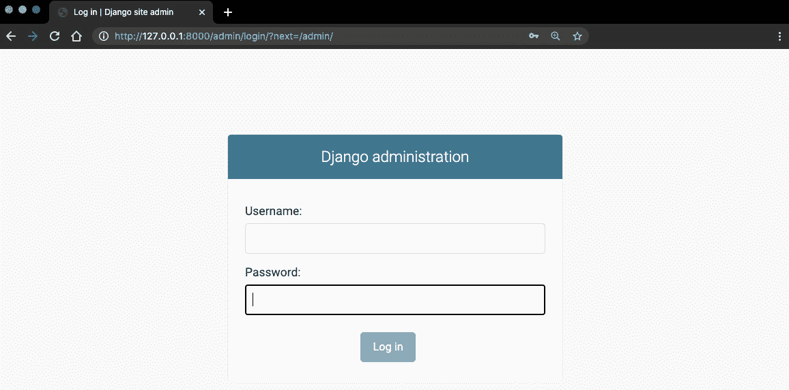

图 4.38：项目的登录页面

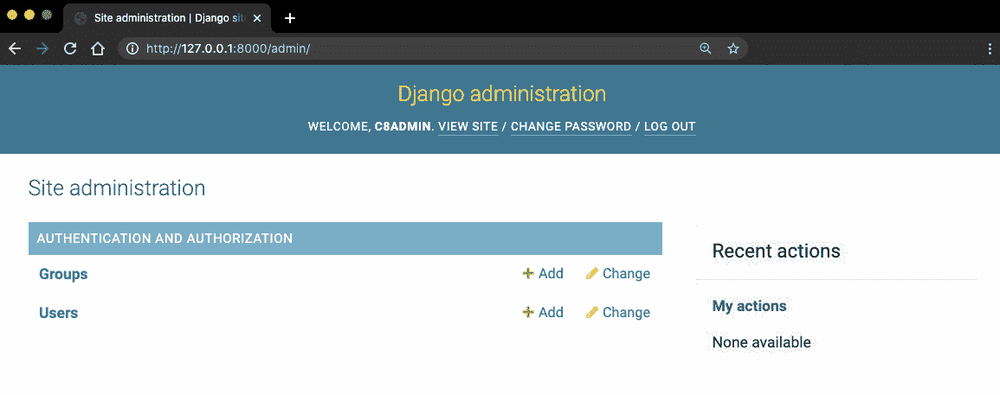

图 4.39：项目的应用索引页面

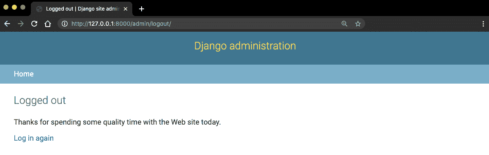

图 4.40：项目的登出页面

完成此活动后，登录、应用索引和登出页面将显示以下自定义设置：

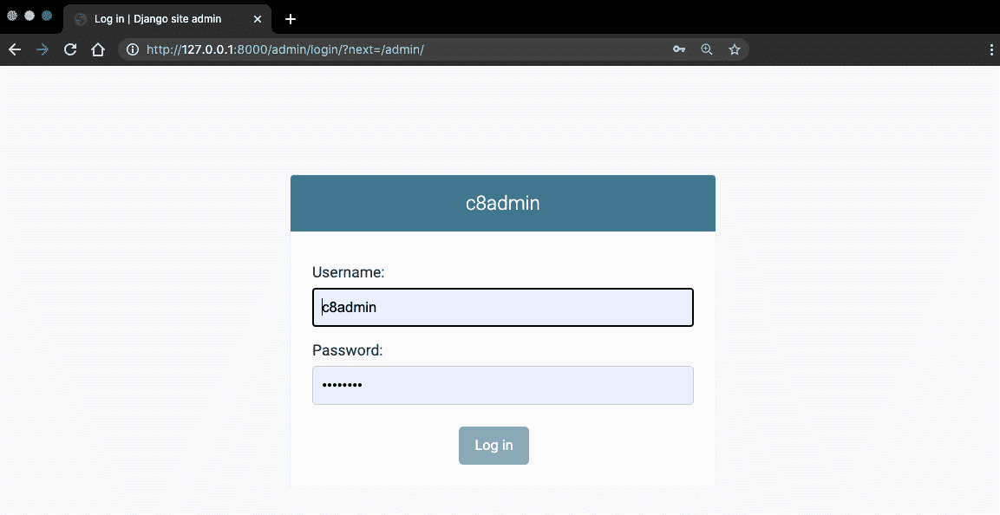

图 4.41：自定义后的登录页面

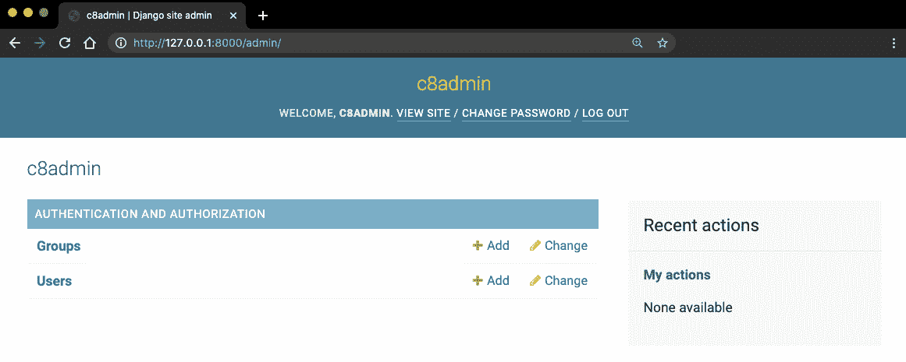

图 4.42：自定义后的应用索引页面

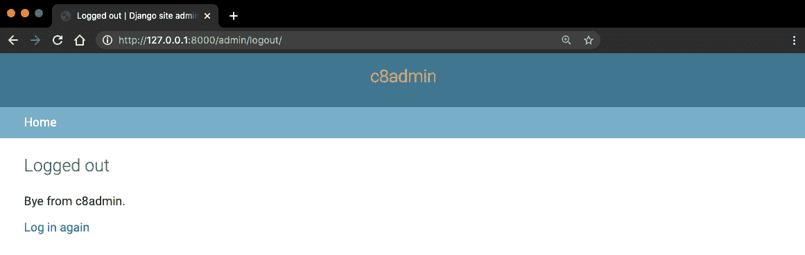

图 4.43：自定义后的登出页面

你已经通过继承 `AdminSite` 成功自定义了管理应用。

注意

此活动的解决方案可以在 [`packt.live/2Nh1NTJ`](http://packt.live/2Nh1NTJ) 找到。

## 自定义 ModelAdmin 类

现在我们已经学习了如何使用子类化的`AdminSite`来自定义管理应用的全局外观，我们将探讨如何自定义管理应用界面以适应单个模型。由于管理界面是自动从模型结构生成的，因此它具有过于通用的外观，需要为了美观和可用性进行自定义。点击管理应用中的`Books`链接，并将其与`Users`链接进行比较。这两个链接都会带您到变更列表页面。这些页面是 Bookr 管理员在想要添加新书籍或添加或更改用户权限时访问的页面。如上所述，变更列表页面展示了一个模型对象的列表，可以选择其中的一组进行批量删除（或其他批量操作），查看单个对象以便编辑，或添加新对象。注意两个变更列表页面的差异，以便使我们的基本`Books`页面与`Users`页面一样功能齐全。

以下是从`Authentication and Authorization`应用中截取的屏幕截图，其中包含有用的功能，如搜索栏、可排序的重要用户字段列标题和结果过滤器：

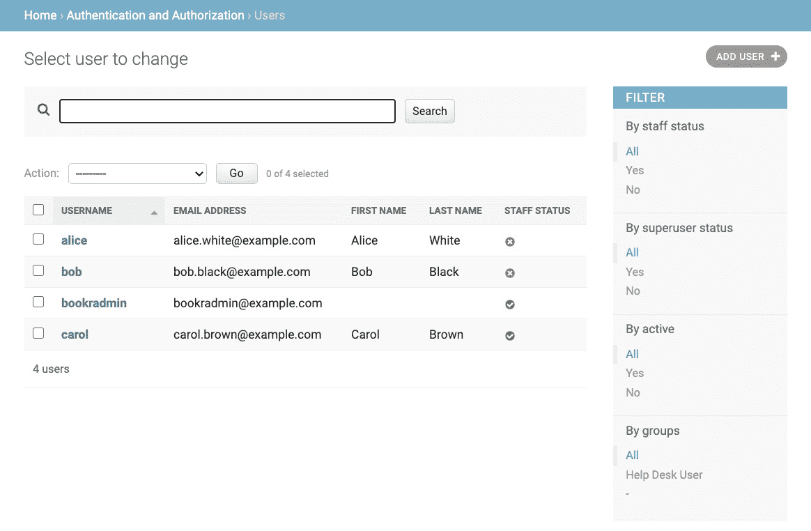

图 4.44：用户变更列表包含自定义的 ModelAdmin 功能

### 列表显示字段

在`Users`变更列表页面上，您将看到以下内容：

+   展示了一个用户对象列表，通过其`USERNAME`、`EMAIL ADDRESS`、`FIRST NAME`、`LAST NAME`和`STAFF STATUS`属性进行总结。

+   这些单个属性是可排序的。排序顺序可以通过点击标题来更改。

+   页面顶部有一个搜索栏。

+   在右侧列中，有一个选择过滤器，允许选择多个用户字段，包括一些不在列表显示中出现的字段。

然而，`Books`变更列表页面的行为帮助不大。书籍按标题列出，但不是按字母顺序排列。标题列不可排序，且没有过滤或搜索选项：


图 4.45：书籍变更列表

回想一下*第二章*，*模型和迁移*，我们为`Publisher`、`Book`和`Contributor`类定义了`__str__`方法。在`Book`类的情况下，它有一个返回书籍对象标题的`__str__()`表示：

```py
class Book(models.Model):
    …
    def __str__(self):
        return "{} ({})".format(self.title, self.isbn)
```

如果我们没有在`Book`类上定义`__str__()`方法，它将继承自基类`django.db.models.Model`。

这个基类提供了一种抽象的方式来给出对象的字符串表示。当我们有`Book`类，其主键为`id`字段，值为`17`时，我们将得到一个字符串表示为`Book object (17)`：

![图 4.46：使用 Model __str__ 表示的书籍变更列表

![img/B15509_04_46.jpg]

图 4.46：使用 Model __str__ 表示的 Books 更改列表

在我们的应用程序中，将`Book`对象表示为几个字段的组合可能是有用的。例如，如果我们想将书籍表示为`Title (ISBN)`，以下代码片段将产生所需的结果：

```py
class Book(models.Model):
    …
    def __str__(self):
        return "{} ({})".format(self.title, self.isbn)
```

这本身就是一个有用的更改，因为它使得对象在应用中的表示更加直观：

![Figure 4.47: A portion of the Books change list with the custom string representation]

![img/B15509_04_47.jpg]

图 4.47：带有自定义字符串表示的 Books 更改列表的一部分

我们不仅限于在`list_display`字段中使用对象的`__str__`表示形式。列表显示中出现的列是由 Django 管理应用中的`ModelAdmin`类决定的。在 Django shell 中，我们可以导入`ModelAdmin`类并检查其`list_display`属性：

```py
python manage.py shell
>>> from django.contrib.admin import ModelAdmin
>>> ModelAdmin.list_display
('__str__',)
```

这解释了为什么`list_display`的默认行为是显示对象的`__str__`表示形式的单列表格，这样我们就可以通过覆盖此值来自定义列表显示。最佳实践是为每个对象子类化`ModelAdmin`。如果我们想使`Book`列表显示包含两个单独的列`Title`和`ISBN`，而不是像*图 4.47*中那样有一个包含两个值的单列，我们将子类化`ModelAdmin`为`BookAdmin`并指定自定义的`list_display`。这样做的好处是，我们现在能够按`Title`和`ISBN`对书籍进行排序。我们可以将此类添加到`reviews/admin.py`：

```py
class BookAdmin(admin.ModelAdmin):
    list_display = ('title', 'isbn')
```

现在我们已经创建了一个`BookAdmin`类，我们应该在将我们的`reviews.models.Book`类注册到管理站点时引用它。在同一个文件中，我们还需要修改模型注册以使用`BookAdmin`而不是`admin.ModelAdmin`的默认值，因此`admin.site.register`调用现在变为以下内容：

```py
admin.site.register(Book, BookAdmin)
```

一旦对`reviews/admin.py`文件进行了这两项更改，我们将得到一个看起来像这样的`Books`更改列表页面：

![Figure 4.48: A portion of the Books change list with a two-column list display]

![img/B15509_04_48.jpg]

图 4.48：带有两列列表显示的 Books 更改列表的一部分

这给我们一个关于`list_display`如何灵活的提示。它可以接受四种类型的值：

+   它接受模型中的字段名称，例如`title`或`isbn`。

+   它接受一个接受模型实例作为参数的函数，例如这个给出一个人姓名初始化版本的函数：

    ```py
    def initialled_name(obj):
        """ obj.first_names='Jerome David', obj.last_names='Salinger'
            => 'Salinger, JD' """
        initials = ''.join([name[0] for name in \
                            obj.first_names.split(' ')])
        return "{}, {}".format(obj.last_names, initials)
    class ContributorAdmin(admin.ModelAdmin):
        list_display = (initialled_name,)
    ```

+   它接受一个从`ModelAdmin`子类中来的方法，该方法接受模型对象作为单个参数。请注意，这需要指定为一个字符串参数，因为它在类外部，并且未定义：

    ```py
    class BookAdmin(admin.ModelAdmin):
        list_display = ('title', 'isbn13')
        def isbn13(self, obj):
            """ '9780316769174' => '978-0-31-676917-4' """
            return "{}-{}-{}-{}-{}".format\
                                    (obj.isbn[0:3], obj.isbn[3:4],\
                                     obj.isbn[4:6], obj.isbn[6:12],\
                                     obj.isbn[12:13])
    ```

+   它接受模型类的一个方法（或非字段属性），例如`__str__`，只要它接受模型对象作为参数。例如，我们可以将`isbn13`转换为`Book`模型类上的一个方法：

    ```py
    class Book(models.Model):
        def isbn13(self):
            """ '9780316769174' => '978-0-31-676917-4' """
            return "{}-{}-{}-{}-{}".format\
                                    (self.isbn[0:3], self.isbn[3:4],\
                                     self.isbn[4:6], self.isbn[6:12],\
                                     self.isbn[12:13])
    ```

    现在，当在 `http://127.0.0.1:8000/admin/reviews/book` 查看书籍更改列表时，我们可以看到带有连字符的 `ISBN13` 字段：

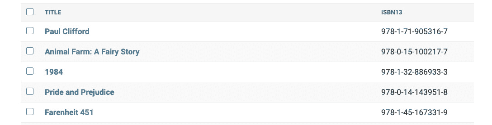

图 4.49：带有连字符 ISBN13 的书籍更改列表的一部分

值得注意的是，如 `__str__` 或我们的 `isbn13` 方法这样的计算字段不适合在摘要页面上排序。此外，我们无法在 `display_list` 中包含 `ManyToManyField` 类型的字段。

### 过滤器

一旦管理界面需要处理大量记录，就方便在更改列表页面上缩小显示的结果。最简单的过滤器是选择单个值。例如，*图 4.6* 中描述的用户过滤器允许用户通过 `staff status`、`superuser status` 和 `active` 来选择用户。我们已经看到在用户过滤器中，`BooleanField` 可以用作过滤器。我们还可以在 `CharField`、`DateField`、`DateTimeField`、`IntegerField`、`ForeignKey` 和 `ManyToManyField` 上实现过滤器。在这种情况下，将 `publisher` 作为 `Book` 的 `ForeignKey` 添加，它在 `Book` 类中定义如下：

```py
publisher = models.ForeignKey(Publisher, \
                              on_delete=models.CASCADE)
```

过滤器是通过 `ModelAdmin` 子类的 `list_filter` 属性实现的。在我们的 Bookr 应用中，通过书名或 ISBN 过滤是不切实际的，因为它会产生一个包含大量过滤选项的列表，而这些选项只返回一条记录。占据页面右侧的过滤器将占用比实际更改列表更多的空间。一个实用的选项是按出版商过滤书籍。我们为 `Publisher` 模型定义了一个自定义的 `__str__` 方法，该方法返回出版商的 `name` 属性，因此我们的过滤选项将以出版商名称列出。

我们可以在 `reviews/admin.py` 文件中的 `BookAdmin` 类中指定我们的更改列表过滤器：

```py
    list_filter = ('publisher',)
```

这是书籍更改页面现在应该看起来的样子：

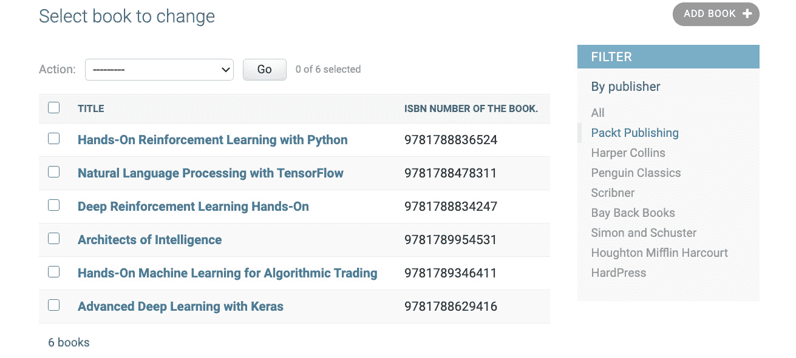

图 4.50：带有出版商过滤器的书籍更改页面

通过这一行代码，我们在书籍更改列表页面上实现了一个有用的出版商过滤器。

## 练习 4.04：添加日期列表过滤器（list_filter）和日期层次结构（date_hierarchy）

我们已经看到，`admin.ModelAdmin` 类提供了有用的属性来自定义更改列表页面的过滤器。例如，按日期过滤对于许多应用来说是关键功能，也可以帮助我们使我们的应用更加用户友好。在这个练习中，我们将检查如何通过在过滤器中包含日期字段来实现日期过滤，并查看 `date_hierarchy` 过滤器：

1.  编辑 `reviews/admin.py` 文件并修改 `BookAdmin` 类中的 `list_filter` 属性，以包括 `'publication_date'`：

    ```py
    class BookAdmin(admin.ModelAdmin):
        list_display = ('title', 'isbn')
        list_filter = ('publisher', 'publication_date')
    ```

1.  重新加载书籍更改页面并确认过滤器现在包括日期设置：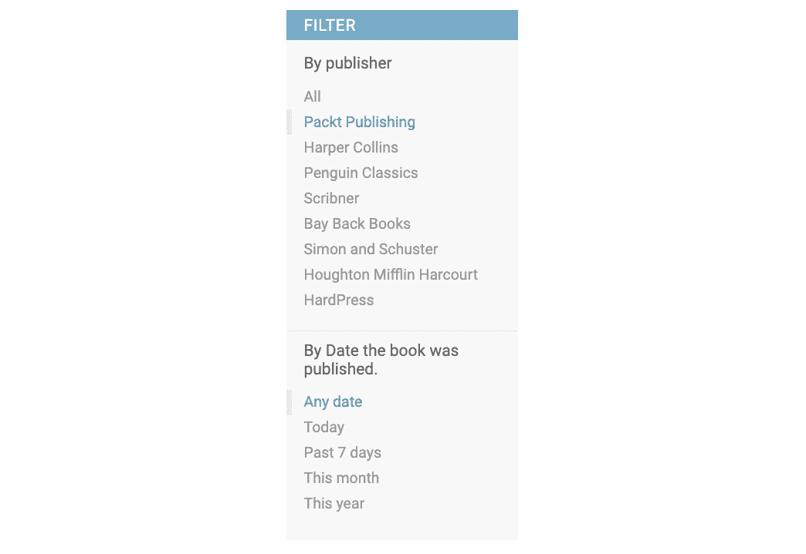

    图 4.51：确认书籍页面变化包括日期设置

    如果 Bookr 项目接收大量新发布，并且我们想要通过最近 7 天或一个月内出版的书籍来过滤书籍，这个发布日期过滤器将非常方便。有时，我们可能希望按特定年份或特定年份中的特定月份进行过滤。幸运的是，`admin.ModelAdmin` 类自带一个自定义过滤器属性，专门用于导航时间信息层次结构。它被称为 `date_hierarchy`。

1.  将 `date_hierarchy` 属性添加到 `BookAdmin` 并将其值设置为 `publication_date`：

    ```py
    class BookAdmin(admin.ModelAdmin):
        date_hierarchy = 'publication_date'
        list_display = ('title', 'isbn')
        list_filter = ('publisher', 'publication_date')
    ```

1.  重新加载“书籍”更改页面并确认日期层次结构出现在“操作”下拉菜单上方：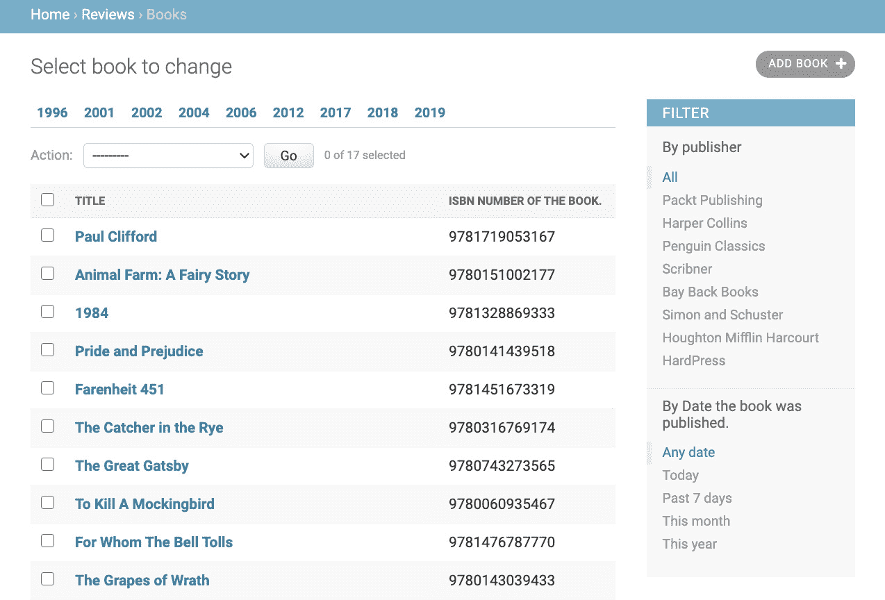

    图 4.52：确认日期层次结构出现在操作下拉菜单上方

1.  从日期层次结构中选择一年并确认它包含该年包含书名和书籍总列表的月份列表：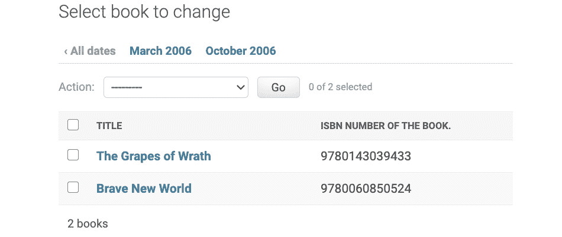

    图 4.53：确认从日期层次结构中选择一年显示该年出版的书籍

1.  确认选择这些月份之一将进一步过滤到月份中的天数：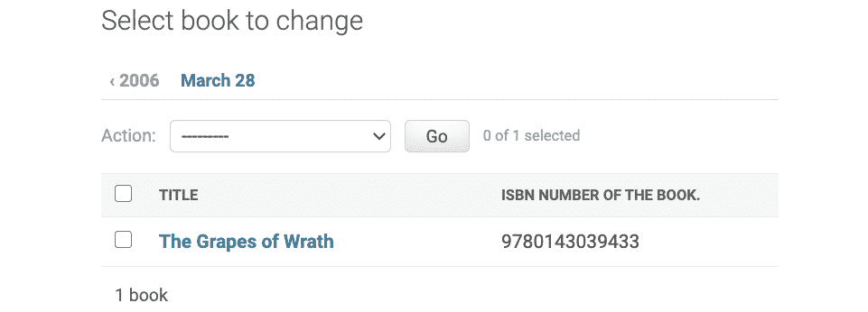

图 4.54：将月份过滤到月份中的天数

`date_hierarchy` 过滤器是一种方便的方式来定制包含大量可按时间排序数据的更改列表，以便加快记录选择，正如我们在这次练习中所看到的。现在，让我们看看在我们的应用中实现搜索栏。

## 搜索栏

这就带我们来到了我们想要实现的功能的最后一部分——搜索栏。和过滤器一样，基本的搜索栏实现起来相当简单。我们只需要将 `search_fields` 属性添加到 `ModelAdmin` 类中。在我们 `Book` 类中用于搜索的明显字符字段是 `title` 和 `isbn`。目前，“书籍”更改列表显示在更改列表顶部的日期层次结构。搜索栏将出现在这个位置上方：

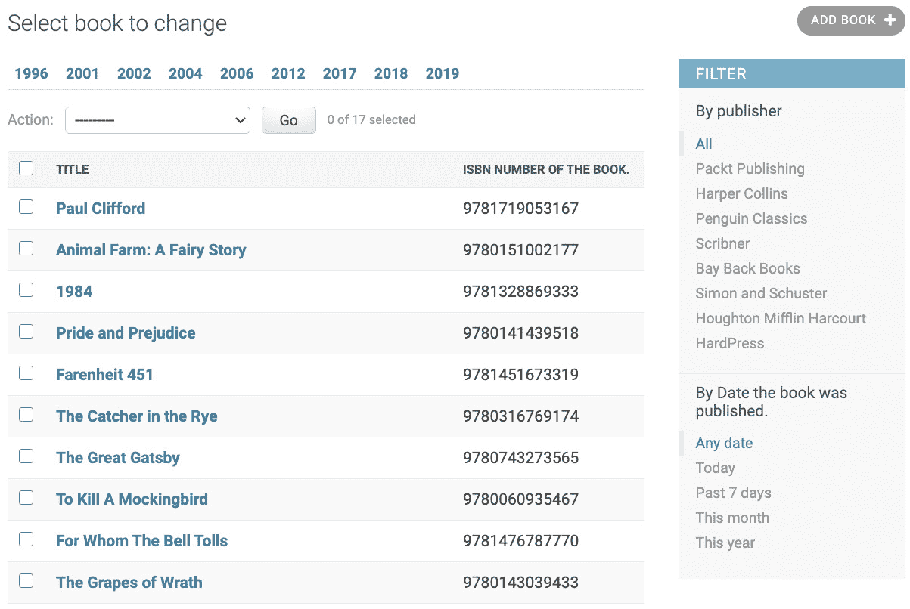

图 4.55：添加搜索栏之前的书籍更改列表

我们可以从将此属性添加到 `BookAdmin` 在 `reviews/admin.py` 中并检查结果开始：

```py
    search_fields = ('title', 'isbn')
```

结果看起来会是这样：

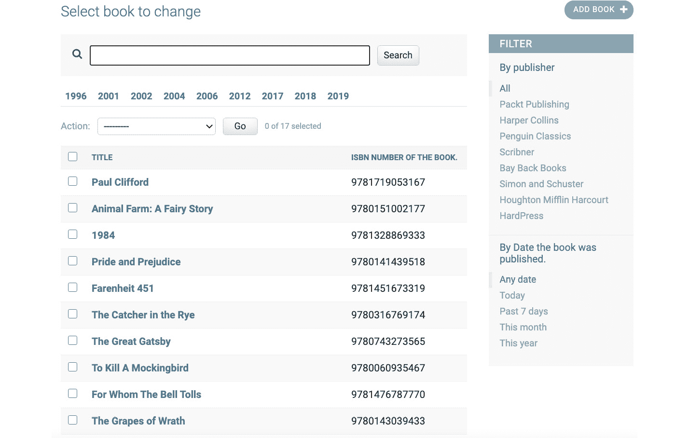

图 4.56：带有搜索栏的书籍更改列表

现在我们可以对匹配标题字段或 ISBN 的字段执行简单的文本搜索。这个搜索需要精确的字符串匹配，所以 "color" 不会匹配 "colour"。它也缺乏我们从更复杂的搜索设施（如 `Books` 模型）所期望的深度语义处理。我们可能还想按出版商名称进行搜索。幸运的是，`search_fields` 足够灵活，可以完成这项任务。要搜索 `ForeignKeyField` 或 `ManyToManyField`，我们只需要指定当前模型上的字段名称和关联模型上的字段名称，两者之间用两个下划线分隔。在这种情况下，`Book` 有一个外键 `publisher`，我们想要搜索 `Publisher.name` 字段，因此可以在 `BookAdmin.search_fields` 中指定为 `'publisher__name'`：

```py
    search_fields = ('title', 'isbn', 'publisher__name')
```

如果我们想要将搜索字段限制为精确匹配而不是返回包含搜索字符串的结果，则可以在字段后添加 `'__exact'` 后缀。因此，将 `'isbn'` 替换为 `'isbn__exact'` 将要求匹配完整的 ISBN，而我们不能使用 ISBN 的一部分来匹配。

类似地，我们通过使用 `'__startswith'` 后缀将搜索字段限制为只返回以搜索字符串开头的搜索结果。将出版商名称搜索字段指定为 `'publisher__name__startswith'` 意味着我们将得到搜索 "pack" 的结果，但不会得到搜索 "ackt" 的结果。

## 排除和分组字段

有时在管理界面中限制模型中某些字段的可见性是合适的。这可以通过 `exclude` 属性实现。

这是带有 `Date edited` 字段可见的审阅表单屏幕。请注意，`Date created` 字段没有显示——因为它已经在模型中定义为带有 `auto_now_add` 参数的隐藏视图：

![图 4.57：审阅表单]

![图片 B15509_04_57.jpg]

图 4.57：审阅表单

如果我们想要从审阅表单中排除 `Date edited` 字段，我们将在 `ReviewAdmin` 类中这样做：

```py
exclude = ('date_edited')
```

然后审阅表单将不会显示 `Date edited`：

![图 4.58：排除 Date edited 字段的审阅表单]

![图片 B15509_04_58.jpg]

图 4.58：排除 Date edited 字段的审阅表单

相反，可能更谨慎的做法是限制管理字段只包括那些已被明确允许的字段。这是通过 `fields` 属性实现的。这种方法的优点是，如果模型中添加了新的字段，除非它们被添加到 `ModelAdmin` 子类的 `fields` 元组中，否则它们不会在管理表单中可用：

```py
fields = ('content', 'rating', 'creator', 'book')
```

这将给我们之前看到的结果。

另一个选项是使用 `ModelAdmin` 子类的 `fieldsets` 属性来指定表单布局为一系列分组字段。`fieldsets` 中的每个分组由一个标题后跟一个包含一个指向字段名称字符串列表的 `'fields'` 键的字典组成：

```py
    fieldsets = (('Linkage', {'fields': ('creator', 'book')}),\
                 ('Review content', \
                   {'fields': ('content', 'rating')}))
```

审阅表单应该看起来如下：

![图 4.59：带有字段集的评审表单]

![图片 B15509_04_59.jpg]

图 4.59：带有字段集的评审表单

如果我们想在字段集中省略标题，我们可以通过将其值设置为 `None` 来实现：

```py
    fieldsets = ((None, {'fields': ('creator', 'book')}),\
                 ('Review content', \
                   {'fields': ('content', 'rating')}))
```

现在，评审表单应该如以下截图所示：

![图 4.60：带有未命名第一个字段集的评审表单]

![图片 B15509_04_60.jpg]

图 4.60：带有未命名第一个字段集的评审表单

## 活动四.02：自定义模型管理员

在我们的数据模型中，`Contributor` 类用于存储书籍贡献者的数据--他们可以是作者、贡献者或编辑。这个活动侧重于修改 `Contributor` 类并添加一个 `ContributorAdmin` 类以提高管理员应用程序的用户友好性。目前，`Contributor` 变更列表默认基于在 *第二章*，*模型和迁移* 中创建的 `__str__` 方法，基于单个列 `FirstNames`。我们将探讨一些表示的替代方法。这些步骤将帮助您完成活动：

1.  编辑 `reviews/models.py` 以向 `Contributor` 模型添加额外的功能。

1.  为 `Contributor` 添加一个不带参数的 `initialled_name` 方法（类似于 `Book.isbn13` 方法）。

1.  `initialled_name` 方法将返回一个包含 `Contributor.last_names` 后跟一个逗号和给定名字首字母的字符串。例如，对于一个 `Contributor` 对象，其 `first_names` 为 `Jerome David`，`last_names` 为 `Salinger`，`initialled_name` 将返回 `Salinger, JD`。

1.  将 `Contributor` 的 `__str__` 方法替换为一个调用 `initialled_name()` 的方法。

    到目前为止，`Contributors` 显示列表将看起来像这样：

    ![图 4.61：贡献者显示列表]

    ![图片 B15509_04_61.jpg]

    图 4.61：贡献者显示列表

1.  在 `reviews/admin.py` 中添加一个 `ContributorAdmin` 类。它应该继承自 `admin.ModelAdmin`。

1.  修改它，以便在 `Contributors` 变更列表中，记录以两个可排序的列（`Last Names` 和 `First Names`）显示。

1.  添加一个搜索栏，用于搜索“姓氏”和“名字”。修改它，使其只匹配“姓氏”的开头。

1.  在 `Last Names` 上添加一个过滤器。

通过完成这个活动，你应该能够看到如下内容：

![图 4.62：预期输出]

![图片 B15509_04_62.jpg]

图 4.62：预期输出

像这样的更改可以提高管理员用户界面的功能。通过将 `Contributors` 变更列表中的 `First Names` 和 `Last Names` 作为单独的列实现，我们为用户提供了在任一字段上排序的选项。通过考虑在搜索检索和筛选选择中最有用的列，我们可以提高记录的高效检索。

注意

这个活动的解决方案可以在 [`packt.live/2Nh1NTJ`](http://packt.live/2Nh1NTJ) 找到。

# 摘要

在本章中，我们了解了如何通过 Django 命令行创建超级用户，以及如何使用它们来访问管理应用。在简要浏览了管理应用的基本功能后，我们探讨了如何将我们的模型注册到其中，以生成我们数据的 CRUD 界面。

然后，我们学习了如何通过修改全局特性来细化这个界面。我们通过在管理站点上注册自定义模型管理类来改变管理应用向用户展示模型数据的方式。这使得我们能够对我们的模型界面进行细致的调整。这些修改包括通过添加额外的列、过滤器、日期层次结构和搜索栏来自定义变更列表页面。我们还通过分组和排除字段来修改模型管理页面的布局。

这只是对管理应用功能的一个非常浅显的探索。我们将在第十章“高级 Django 管理及定制”中重新审视`AdminSite`和`ModelAdmin`的丰富功能。但首先，我们需要学习更多 Django 的中间级特性。在下一章中，我们将学习如何从 Django 应用中组织和提供静态内容，例如 CSS、JavaScript 和图片。
