# 第五章：5. 提供静态文件服务

概述

在本章中，您将首先学习静态响应和动态响应之间的区别。然后您将看到 Django 的 `staticfiles` 应用如何帮助管理静态文件。在继续对 Bookr 应用进行工作的同时，您将使用图像和 CSS 来增强它。您将了解您可以为项目布局静态文件的不同方式，并检查 Django 如何为生产部署合并它们。Django 包括在模板中引用静态文件的工具，您将看到这些工具如何帮助减少将应用程序部署到生产所需的工作量。在此之后，您将探索 `findstatic` 命令，它可以用来调试静态文件的问题。稍后，您将了解如何为远程服务编写存储静态文件的代码的概述。最后，您将了解缓存网络资产以及 Django 如何帮助进行缓存失效。

# 简介

一个仅包含纯 **超文本标记语言**（**HTML**）的 Web 应用程序相当有限。我们可以使用 **层叠样式表**（**CSS**）和图像来增强网页的外观，并且我们可以通过 JavaScript 添加交互。我们将所有这些类型的文件称为“静态文件”。它们被开发并作为应用程序的一部分部署。我们可以将它们与动态响应进行比较，动态响应是在请求实时生成时产生的。您所编写的所有视图都通过渲染模板生成动态响应。请注意，我们不会将模板视为静态文件，因为它们不是直接发送给客户端；相反，它们首先被渲染，然后作为动态响应的一部分发送。

在开发期间，静态文件是在开发者的机器上创建的，然后必须将它们移动到生产 Web 服务器。如果您必须在短时间内（比如几个小时）转移到生产，那么收集所有静态资产、将它们移动到正确的目录并将它们上传到服务器可能会很耗时。当使用其他框架或语言开发 Web 应用程序时，您可能需要手动将所有静态文件放入您的 Web 服务器托管的特定目录。更改提供静态文件的 URL 可能意味着在整个代码中更新值。

Django 可以帮助我们管理静态资产，使这个过程更加简单。它提供了在开发期间使用其开发服务器提供这些文件的工具。当您的应用程序进入生产阶段时，它还可以收集所有您的资产并将它们复制到一个文件夹中，由专门的 web 服务器托管。这允许您在开发期间以有意义的方式将静态文件分离，并在部署时自动打包。

此功能由 Django 内置的 `staticfiles` 应用提供。它为处理和提供静态文件添加了几个有用的功能：

+   `static` 模板标签用于自动构建资产的静态 URL 并将其包含在您的 HTML 中。

+   一个名为 `static` 的视图，用于在开发中提供静态文件。

+   静态文件查找器用于自定义在文件系统上查找资源的位置。

+   `collectstatic` 管理命令，用于查找所有静态文件并将它们移动到单个目录以进行部署。

+   `findstatic` 管理命令，用于显示针对特定请求加载的磁盘上的哪个静态文件。这也有助于调试如果某个文件没有被加载的情况。

在本章的练习和活动中，我们将向 Bookr 应用程序添加静态文件（图像和 CSS）。每个文件在开发过程中都将存储在 Bookr 项目目录中。我们需要为每个文件生成一个 URL，以便模板可以引用它们，浏览器可以下载它们。一旦生成了 URL，Django 需要提供这些文件。当我们部署 Bookr 应用程序到生产环境时，所有静态文件都需要被找到并移动到可以被生产 Web 服务器提供服务的目录。如果存在未按预期加载的静态文件，我们需要某种方法来确定原因。

为了简化，让我们以单个静态文件为例：`logo.png`。我们将简要介绍上一段中提到的每个功能的角色，并在本章中深入解释：

+   使用 `static` 模板标签将文件名转换为模板中可用的 URL 或路径，例如，从 `logo.png` 转换为 `/static/logo.png`。

+   `static` 视图接收一个请求，加载路径为 `/static/logo.png` 的静态文件。它读取文件并将其发送到浏览器。

+   静态文件查找器（或简称 `finder`）被 `static` 视图用来在磁盘上定位静态文件。有不同的查找器，但在这个例子中，查找器只是将 URL 路径 `/static/logo.png` 转换为磁盘上的路径 `bookr/static/logo.png`。

+   在部署到生产环境时，使用 `collectstatic` 管理命令。这将把 `logo.png` 文件从 `bookr` 项目目录复制到 Web 服务器目录，例如 `/var/www/bookr/static/logo.png`。

+   如果一个静态文件无法正常工作（例如，请求它返回一个 `404 Not Found` 响应，或者正在提供错误的文件），那么我们可以使用 `findstatic` 管理命令来尝试确定原因。此命令接受文件名作为参数，并将输出搜索过的目录以及它能够定位请求的文件的位置。

这些是日常使用中最常见的功能，但我们还将讨论其他一些功能。

# 静态文件提供

在介绍中，我们提到 Django 包含一个名为 `static` 的视图函数，用于提供静态文件。关于静态文件提供的一个重要观点是，Django 并不打算在生产环境中提供这些文件。这不是 Django 的角色，在生产环境中，Django 将拒绝提供静态文件。这是正常且预期的行为。如果 Django 只是读取文件系统并发送文件，那么它在这方面没有比普通 Web 服务器更多的优势，而普通 Web 服务器在此任务上可能表现得更好。此外，如果您使用 Django 提供静态文件，那么在请求期间您将保持 Python 进程忙碌，它将无法处理它更适合处理的动态请求。

由于这些原因，Django 的 `static` 视图仅设计用于开发期间使用，如果您的 `DEBUG` 设置为 `False`，则不会工作。由于在开发期间我们通常只有一个人（开发者）访问网站，因此 Django 可以提供静态文件。我们很快将讨论更多关于 `staticfiles` 应用如何支持生产部署的内容。整个生产部署过程将在第十七章 *Django 应用程序的部署（第一部分 – 服务器设置）* 中介绍。您可以从本书的 GitHub 仓库下载此章节，网址为 [`packt.live/2Kx6FmR`](http://packt.live/2Kx6FmR)。

当运行 Django 开发服务器时，如果您的 `settings.py` 文件满足以下条件，则会自动设置一个指向 `static` 视图的 URL 映射：

+   `DEBUG` 设置为 `True`

+   在其 `INSTALLED_APPS` 中包含 `'django.contrib.staticfiles'`

这两个设置默认都存在。

创建的 URL 映射大致等同于在您的 `urlpatterns` 中有以下的映射：

```py
path(settings.STATIC_URL, django.conf.urls.static)
```

任何以 `settings.STATIC_URL`（默认为 `/static/`）开头的 URL 都会被映射到 `static` 视图。

注意

即使没有在 `INSTALLED_APPS` 中包含 `staticfiles`，您也可以使用 `static` 视图，但您必须手动设置等效的 URL 映射。

## 静态文件查找器简介

Django 需要在磁盘上定位静态文件的三种情况，为此，它使用一个 **静态文件查找器**。静态文件查找器可以被认为是一个插件。它是一个实现将 URL 路径转换为磁盘路径的方法的类，并遍历项目目录以查找静态文件。

当 Django 需要在磁盘上定位静态文件时，第一次是在 Django `static` 视图接收到请求以加载特定的静态文件时；然后它需要将 URL 中的路径转换为磁盘上的位置。例如，URL 的路径是 `/static/logo.png`，它被转换为磁盘上的路径 `bookr/static/logo.png`。正如我们在上一节中提到的，这仅在开发期间。在生产服务器上，Django 不应接收此请求，因为它将由 Web 服务器直接处理。

第二次是在使用 `collectstatic` 管理命令时。这会将项目目录中的所有静态文件收集起来，并将它们复制到单个目录中，以便由生产 Web 服务器提供服务。例如，`bookr/static/logo.png` 将被复制到 Web 服务器根目录，如 `/var/www/bookr/static/logo.png`。静态文件查找器包含用于在项目目录内定位所有静态文件的代码。

最后一次使用静态文件查找器是在执行 `findstatic` 管理命令期间。这与第一次使用类似，它接受一个静态文件的名称（例如 `logo.png`），但它将完整路径（`bookr/static/logo.png`）输出到终端，而不是加载文件内容。

Django 随带一些内置的查找器，但如果你想要将静态文件存储在自定义目录布局中，你也可以编写自己的查找器。Django 使用的查找器列表由 `settings.py` 中的 `STATICFILES_FINDERS` 设置定义。在本章中，我们将分别在第 *AppDirectoriesFinder* 和 *FileSystemFinder* 节中介绍默认静态文件查找器 `AppDirectoriesFinder` 和 `FileSystemFinder` 的行为。

注意

如果你查看 `settings.py`，你不会看到默认定义的 `STATICFILES_FINDERS` 设置。这是因为 Django 将使用其内置的默认设置，该设置定义为列表 `['django.contrib.staticfiles.finders.FileSystemFinder', 'django.contrib.staticfiles.finders.AppDirectoriesFinder']`。如果你要将 `STATICFILES_FINDERS` 设置添加到你的 `settings.py` 文件中，以包含一个自定义查找器，确保如果你在使用它们，要包括这些默认设置。

首先，我们将讨论静态文件查找器及其在第一种情况下的使用——响应请求。然后，我们将介绍一些更多概念，并返回到 `collectstatic` 的行为以及它是如何使用静态文件查找器的。在章节的后面部分，我们将使用 `findstatic` 命令来了解如何使用它。

## 静态文件查找器：在请求期间使用

当 Django 收到对静态文件的请求（记住，Django 只在开发期间提供静态文件服务）时，将查询所有已定义的静态文件查找器，直到在磁盘上找到文件。如果所有查找器都无法定位到文件，则 `static` 视图将返回 `HTTP 404 Not Found` 响应。

例如，请求的 URL 可能类似于 `/static/main.css` 或 `/static/reviews/logo.png`。每个查找器将依次查询来自 URL 的路径，并将返回一个路径，例如第一个文件为 `bookr/static/main.css`，第二个文件为 `bookr/reviews/static/reviews/logo.png`。每个查找器将使用自己的逻辑将 URL 路径转换为文件系统路径——我们将在即将到来的 *AppDirectoriesFinder* 和 *FileSystemFinder* 节中讨论这种逻辑。

## AppDirectoriesFinder

`AppDirectoriesFinder` 类用于在每个应用目录中查找名为 `static` 的目录内的静态文件。应用必须在 `settings.py` 文件中的 `INSTALLED_APPS` 设置中列出（我们在 *第一章*，*Django 简介* 中这样做过）。正如我们在 *第一章*，*Django 简介* 中提到的，应用自包含是很好的。通过让每个应用都有自己的 `static` 目录，我们也可以通过在应用目录中存储特定于应用的静态文件来继续自包含设计。

在我们使用 `AppDirectoriesFinder` 之前，我们将解释如果多个静态文件具有相同的名称可能会出现的问题，以及如何解决这个问题。

## 静态文件命名空间

在 *静态文件查找器：请求期间使用* 部分，我们讨论了提供名为 `logo.png` 的文件。这将提供 `reviews` 应用的标志。文件名（`logo.png`）可能非常常见——你可以想象，如果我们添加一个 `store` 应用（用于购买书籍），它也将有一个标志。更不用说第三方 Django 应用可能也想使用像 `logo.png` 这样的通用名称。我们即将描述的问题可能适用于任何具有通用名称的静态文件，例如 `styles.css` 或 `main.js`。

让我们考虑 `reviews` 和 `store` 的例子。我们可以在这些应用中的每个应用中添加一个 `static` 目录。然后，每个 `static` 目录都会有一个 `logo.png` 文件（尽管它将是不同的标志）。目录结构如图 5.1 所示：

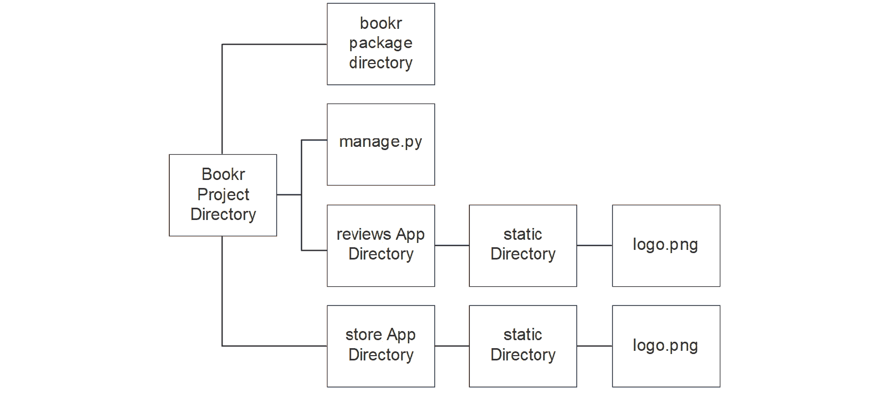

](img/B15509_05_01.jpg)

图 5.1：包含静态目录的应用目录布局

我们用来下载静态文件的 URL 路径是相对于静态目录的。因此，如果我们对 `/static/logo.png` 发起 HTTP 请求，就不知道引用的是哪个 `logo.png` 文件。Django 将依次检查每个应用中的 `static` 目录（按照 `INSTALLED_APPS` 设置中指定的顺序）。它找到的第一个 `logo.png` 文件，就会提供服务。在这个目录布局中，没有方法可以指定你想要加载的 `logo.png` 文件。

我们可以通过将 `static` 目录命名为与应用相同的名称来解决这个问题。`reviews` 应用在其 `static` 目录内有一个名为 `reviews` 的目录，而 `store` 应用在其 `static` 目录内有一个名为 `store` 的目录。相应的 `logo.png` 文件随后被移动到这些子目录中。新的目录布局如图 5.2 所示：

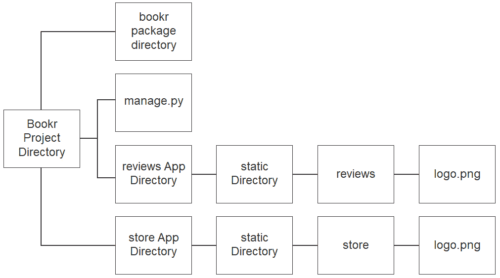

](img/B15509_05_02.jpg)

图 5.2：命名空间目录布局

要加载特定文件，我们还包括了命名空间目录。对于`reviews`标志，URL 路径是`/static/reviews/logo.png`，它在磁盘上映射到`bookr/reviews/static/review/logo.png`。同样，对于商店标志，其路径是`/static/store/logo.png`，它在磁盘上映射到`bookr/store/static/store/logo.png`。你可能已经注意到，`logo.png`文件的示例路径已经在*静态文件查找器：请求期间使用*部分中进行了命名空间。

注意

如果你正在考虑编写可能作为独立插件发布的 Django 应用，你可以使用更明确的子目录名称。例如，选择一个包含整个点分项目路径的名称：*bookr/reviews/static/bookr.reviews*。然而，在大多数情况下，子目录名称仅对项目本身是唯一的就足够了。

现在我们已经介绍了`AppDirectoriesFinder`和静态文件命名空间，我们可以使用它们来提供我们的第一个静态文件。在本章的第一个练习中，我们将创建一个新的 Django 项目用于基本的商业网站。然后，我们将从这个项目中创建的名为`landing`的应用中提供标志文件。`AppDirectoriesFinder`类用于在每个应用目录中查找名为`static`的目录中的静态文件。应用必须在`settings.py`文件中的`INSTALLED_APPS`设置中列出。正如我们在*第一章*，*Django 简介*中提到的，应用自包含是好的。通过让每个应用都有自己的`static`目录，我们也可以通过在应用目录中存储特定应用的静态文件来继续自包含设计。

提供静态文件最简单的方法是从应用目录中提供。这是因为我们不需要进行任何设置更改。相反，我们只需要在正确的目录中创建文件，它们将使用默认的 Django 配置提供。

商业网站项目

对于本章的练习，我们将创建一个新的 Django 项目，并使用它来演示静态文件的概念。该项目将是一个基本的商业网站，有一个带有标志的简单着陆页。该项目将有一个名为`landing`的应用。

你可以参考*第一章*，*创建项目和应用程序，并启动开发服务器*，*Django 简介*中的*练习 1.01*，以刷新你对创建 Django 项目的记忆。

## 练习 5.01：从应用目录提供文件

在这个练习中，你将为`landing`应用添加一个标志文件。这需要将一个`logo.png`文件放入`landing`应用目录内的`static`目录中。完成此操作后，你可以测试静态文件是否正确提供，并确认提供它的 URL：

1.  首先创建新的 Django 项目。您可以重复使用已经安装了 Django 的`bookr`虚拟环境。打开一个新的终端并激活虚拟环境（有关如何创建和激活虚拟环境的说明，请参阅*前言*）。然后，在终端（或命令提示符）中运行`django-admin`命令以启动名为`business_site`的 Django 项目。为此，运行以下命令：

    ```py
    django-admin startproject business_site
    ```

    将不会有任何输出。此命令将在名为`business_site`的新目录中构建 Django 项目。

1.  通过使用`startapp`管理命令在此项目中创建一个新的 Django 应用。该应用应命名为*landing*。为此，请进入`business_site`目录，然后运行以下命令：

    ```py
    python3 manage.py startapp landing
    ```

    注意，将不会再次有任何输出。该命令将在`business_site`目录内创建名为`landing`的应用目录。

    注意

    记住，在 Windows 上，命令是`python manage.py startapp landing`。

1.  启动 PyCharm，然后打开`business_site`目录。如果您已经打开了一个项目，可以通过选择`File` -> `Open`来做到这一点；否则，只需在“欢迎使用 PyCharm”窗口中单击`Open`。导航到`business_site`目录，选择它，然后单击`Open`。`business_site`项目窗口应类似于*图 5.3*：

    注意

    有关如何设置和配置 PyCharm 以与 Django 项目一起工作的详细说明，请参阅*练习 1.02*，*PyCharm 中的项目设置*，位于*第一章*，*Django 简介*。

    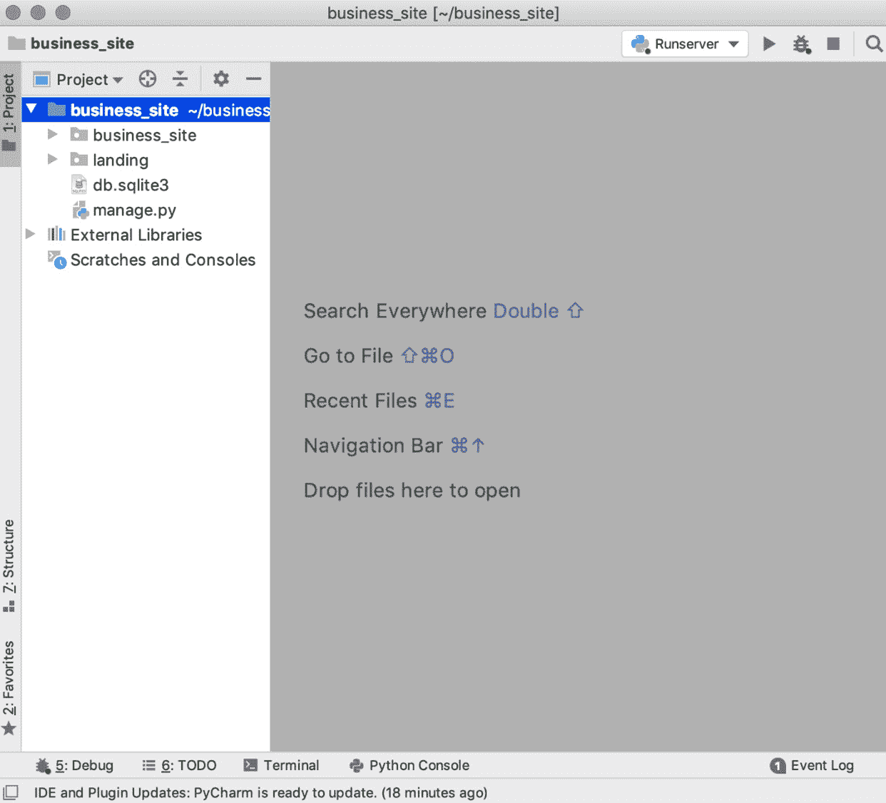

    图 5.3：business_site 项目

1.  创建一个新的运行配置来执行项目的`manage.py runserver`。您可以再次使用`bookr`虚拟环境。完成操作后，“运行/调试配置”窗口应类似于*图 5.4*。

    注意

    注意，如果您不确定如何在 PyCharm 中配置这些设置，请参阅*练习 1.02*，*PyCharm 中的项目设置*，来自*第一章*，*Django 简介*。

    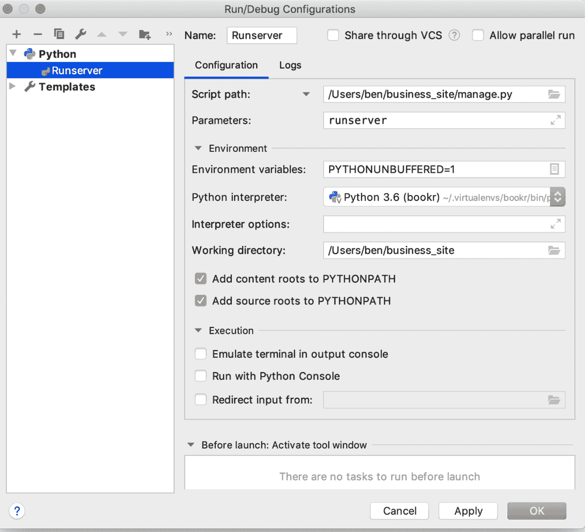

    图 5.4：运行服务器时的运行/调试配置

    您可以通过单击`Run`按钮来测试配置是否设置正确，然后在浏览器中访问`http://127.0.0.1:8000/`。您应该看到 Django 欢迎屏幕。如果调试服务器无法启动或您看到 Bookr 主页面，那么您可能仍在运行 Bookr 项目。尝试停止 Bookr 的`runserver`进程（在运行它的终端中按*Ctrl* + *C*），然后启动您刚刚设置的新进程。

1.  在`business_site`目录中打开`settings.py`文件，并将`'landing'`添加到`INSTALLED_APPS`设置中。记住我们在*第一章*，*Django 简介*中的*练习 1.05*，*创建模板目录和基本模板*的*步骤 1*中学到了如何这样做。

1.  在 PyCharm 中，在“项目”面板中右键单击`landing`目录，然后选择`New` -> `Directory`。

1.  输入名称 `static` 并点击 `OK`：![图 5.5：命名目录 static

    ![img/B15509_05_05.jpg]

    图 5.5：将目录命名为 static

1.  右键单击您刚刚创建的 `static` 目录，然后选择 `New` -> `Directory` 再次创建目录。

1.  输入名称 `landing` 并点击 `OK`。这是为了实现我们之前讨论的静态文件目录的命名空间：![图 5.6：将新目录命名为 landing，以实现命名空间

    ![img/B15509_05_06.jpg]

    图 5.6：将新目录命名为 landing，以实现命名空间

1.  从 [`packt.live/2KM6kfT`](https://packt.live/2KM6kfT) 下载 `logo.png` 并将其移动到 `landing/static/landing` 目录。

1.  启动 Django 开发服务器（如果尚未运行），然后导航到 `http://127.0.0.1:8000/static/landing/logo.png`。您应该在浏览器中看到图像正在被提供：![图 5.7：Django 提供的图像

    ![img/B15509_05_07.jpg]

图 5.7：Django 提供的图像

如果您看到的图像与 *图 5.7* 中的图像相同，您已经正确设置了静态文件服务。现在让我们看看如何自动将此 URL 插入到您的 HTML 代码中。

## 使用静态模板标签生成静态 URL

在 *练习 5.01* 中，*从应用目录中提供文件*，您设置了 Django 来提供图像文件。您看到图像的 URL 是 `http://127.0.0.1:8000/static/landing/logo.png`，您可以在 HTML 模板中使用它。例如，要使用 `img` 标签显示图像，您可以在模板中使用以下代码：

```py

```

或者，由于 Django 也负责提供媒体文件，并且与动态模板响应有相同的域名，您可以通过只包含路径来简化这个过程，如下所示：

```py

```

两个地址（URL 和路径）都硬编码到了模板中；也就是说，我们包含了静态文件的完整路径，并假设文件托管的位置。这对于 Django 开发服务器或者如果您将静态文件和 Django 网站托管在同一域名下是可行的。为了在您的网站越来越受欢迎时获得更好的性能，您可能考虑从自己的域名或 **内容分发网络**（**CDN**）提供静态文件。

注意

**CDN** 是一种可以为您托管网站的部分或全部内容的服务。它们提供多个 Web 服务器，并且可以无缝地加快您网站的加载速度。例如，他们可能会从地理位置上离用户最近的服务器向用户提供服务。有多个 CDN 提供商，根据它们的设置，它们可能要求您指定一个用于提供静态文件的域名。

以常见的分离方法为例：使用不同的域名来提供静态文件服务。您的主网站托管在 `https://www.example.com`，但希望从 `https://static.example.com` 提供静态文件。在开发过程中，我们可以像刚才看到的例子一样，只使用到 logo 文件的路径。但是当我们部署到生产服务器时，我们的 URL 需要更改以包含域名，如下所示：

```py

```

由于所有链接都是硬编码的，因此每次部署到生产环境时，都需要在我们的模板中的每个 URL 上执行此操作。然而，一旦它们被更改，这些 URL 在 Django 开发服务器上就不再有效。幸运的是，Django 提供了一个解决方案来解决这个问题。

`staticfiles`应用提供了一个模板标签`static`，用于在模板中动态生成静态文件的 URL。由于所有 URL 都是动态生成的，我们可以通过更改一个设置（`settings.py`中的`STATIC_URL`）来更改所有这些 URL。此外，稍后我们将介绍一种基于使用`static`模板标签的方法来使浏览器缓存静态文件失效。

`static`标签非常简单：它接受一个单一参数，即静态资产的工程相对路径。然后，它将输出这个路径，并在其前面加上`STATIC_URL`设置。它必须首先使用``模板标签将其加载到模板中。

Django 提供了一套默认的模板标签和过滤器（或标签集），它自动将这些标签集提供给每个模板。Django（以及第三方库）还提供了不是自动加载的标签集。在这些情况下，我们需要在可以使用它们之前将这些额外的模板标签和过滤器加载到模板中。这是通过使用`load`模板标签来完成的，它应该在模板的开始附近（尽管如果使用了`extends`模板标签，它必须在之后）。`load`模板标签接受一个或多个要加载的包/库，例如：

```py

```

这将加载由（虚构的）`package_one`、`package_two`和`package_three`包提供的模板标签和过滤器集。

`load`模板标签必须在需要加载包的实际模板中使用。换句话说，如果你的模板扩展了另一个模板，并且基本模板已经加载了某个包，那么你的依赖模板不会自动访问该包。你的模板仍然需要使用`load`标签来加载该包以访问新的标签集。`static`模板标签不是默认集的一部分，这就是为什么我们需要加载它的原因。

然后，它可以在模板文件中的任何位置使用。例如，默认情况下，Django 使用`/static/`作为`STATIC_URL`。如果我们想为我们的`logo.png`文件生成静态 URL，我们可以在模板中使用如下标签：

```py

```

模板内的输出将是这样的：

```py
/static/landing/logo.png
```

通过示例可以使它更清晰，所以让我们看看`static`标签如何用于生成多个不同资产的 URL。

我们可以使用`img`标签在页面上包含一个图像作为标志，如下所示：

```py

```

这在模板中的渲染如下所示：

```py

```

或者，我们可以使用`static`标签来生成链接 CSS 文件的 URL，如下所示：

```py
<link href="" 
            rel="stylesheet">
```

这将被渲染为如下所示：

```py
<link href="/static/path/to/file.css" 
            rel="stylesheet">
```

它可以在`script`标签中使用，以包含 JavaScript 文件，如下所示：

```py
<script src="img/file.js' %}">
    </script>
```

这将被渲染为如下所示：

```py
<script src="img/file.js"></script>
```

我们甚至可以使用它来生成指向静态文件的下载链接：

```py
<a href="">
    Download PDF</a>
```

注意

注意，这不会生成实际的 PDF 内容；它只会创建一个指向已存在的文件的链接。

它将渲染如下：

```py
<a href="/static/path/to/document.pdf">
    Download PDF</a>
```

参考这些示例，我们现在可以展示使用`static`标签而不是硬编码的优势。当我们准备好部署到生产环境时，我们只需在`settings.py`中更改`STATIC_URL`的值。模板中的任何值都不需要更改。

例如，我们可以将`STATIC_URL`改为`https://static.example.com/`，然后当页面下次渲染时，我们看到的示例将自动更新如下。

以下行显示了这一点，针对图片：

```py

```

以下是对 CSS 链接的说明：

```py
<link href=
    "https://static.example.com/path/to/files.css" 
    rel="stylesheet">
```

对于脚本，如下所示：

```py
<script src="
    https://static.example.com/path/to/file.js">
    </script>
```

最后，以下是对链接的说明：

```py
<a href="
    https://static.example.com/path/to/document.pdf">
    Download PDF</a>
```

注意，在所有这些示例中，一个字面字符串被作为参数传递（它是引用的）。您也可以使用变量作为参数。例如，假设您正在渲染一个模板，其上下文如下示例代码所示：

```py
def view_function(request):
    context = {"image_file": "logofile.png"}
    return render(request, "example.html", context)
```

我们正在渲染`example.html`模板，并使用`image_file`变量。这个变量的值是`logo.png`。

您将不带引号传递这个变量到`static`标签中：

```py

```

它将渲染成这样（假设我们将`STATIC_URL`改回`/static/`）：

```py

```

模板标签也可以与`as [variable]`后缀一起使用，将结果分配给变量，以便在模板的稍后位置使用。如果静态文件查找需要很长时间，并且您想多次引用相同的静态文件（例如，在多个位置包含图像），这可能会很有用。

第一次引用静态 URL 时，给它一个变量名来分配。在这种情况下，我们创建了`logo_path`变量：

```py

```

这与之前看到的示例渲染相同：

```py

```

然而，我们可以在模板中稍后再次使用分配的变量（`logo_path`）：

```py

```

这再次渲染相同的内容：

```py

```

这个变量现在只是模板作用域中的一个普通上下文变量，可以在模板的任何地方使用。但请注意，您可能会覆盖已经定义的变量——尽管这是使用任何分配变量的模板标签时的一个一般警告（例如，``）。

在下一个练习中，我们将把`static`模板应用到实践中，将 Bookr 评论标志添加到 Bookr 网站上。

## 练习 5.02：使用静态模板标签

在*练习 5.01*，*从应用目录中提供文件*，您测试了从静态目录提供`logo.png`文件。在这个练习中，您将继续进行商业网站项目，并创建一个`index.html`文件作为我们的着陆页模板。然后您将在这个页面上包含标志，使用`{`% static %`}`模板标签：

1.  在 PyCharm 中（确保你处于 `business_site` 项目），右键单击 `business_site` 项目目录，创建一个名为 `templates` 的新文件夹。右键单击此目录，选择 `New` -> `HTML File`。选择 `HTML 5 file` 并将其命名为 `index.html`：

    图 5.8：新的 index.html

1.  `index.html` 将打开。首先，加载 `static` 标签库，以便在模板中使用 `static` 标签。使用 `load` 模板标签来完成此操作。在文件的第二行（在 `<!DOCTYPE html>` 之后），添加此行以加载静态库：

    ```py
    
    ```

1.  你还可以通过添加一些额外内容使模板看起来更美观。在 `<title>` 标签内输入文本 `Business Site`：

    ```py
    <title>Business Site</title>
    ```

    然后，在主体内部，添加一个包含文本 `Welcome to my Business Site` 的 `<h1>` 元素：

    ```py
    <h1>Welcome to my Business Site</h1>
    ```

1.  在标题文本下方，使用 `` 模板标签设置 `` 的源。你将使用它来引用来自 *练习 5.01*，*从应用目录中提供文件* 的标志：

    ```py
    
    ```

1.  最后，为了使网站更完整，在 `` 元素下添加一个 `<p>` 元素。给它一些关于企业的文本：

    ```py
    <p>Welcome to the site for my Business. 
        For all your Business needs!</p>
    ```

    虽然额外的文本和标题并不太重要，但它们给出了如何在使用 `` 模板标签围绕其余内容的方法。保存文件。完成后，它应该看起来像这样：[`packt.live/37RUVnE`](http://packt.live/37RUVnE)。

1.  接下来，设置一个用于渲染模板的 URL。你还将使用内置的 `TemplateView` 来渲染模板，而无需创建视图。在 `business_site` 包目录中打开 `urls.py` 文件。在文件开头，按照以下方式导入 `TemplateView`：

    ```py
    from django.views.generic import TemplateView
    ```

    你还可以删除此 Django 管理导入行，因为我们在这个项目中没有使用它：

    ```py
    from django.contrib import admin
    ```

1.  从 `/` 到 `TemplateView` 添加一个 URL 映射。`TemplateView` 的 `as_view` 方法接受 `template_name` 作为参数，它以与传递给 `render` 函数的路径相同的方式使用。你的 `urlpatterns` 应该看起来像这样：

    ```py
    urlpatterns = [path('', TemplateView.as_view\
                            (template_name='index.html')),]
    ```

    保存 `urls.py` 文件。完成后，它应该看起来像这样：[`packt.live/2KLTrlY`](http://packt.live/2KLTrlY)。

1.  由于我们不是使用 `landing` 应用模板目录来存储此模板，你需要告诉 Django 使用你在 *步骤 1* 中创建的 `templates` 目录。通过在 `settings.py` 中的 `TEMPLATES['DIRS']` 列表中添加该目录来完成此操作。

    在 `business_site` 目录中打开 `settings.py` 文件。向下滚动，直到找到 `TEMPLATES` 设置。它看起来像这样：

    ```py
    TEMPLATES = \
    [{'BACKEND': 'django.template.backends.django.DjangoTemplates',\
      'DIRS': [],\
      'APP_DIRS': True,\
      'OPTIONS': {'context_processors': \
                  ['django.template.context_processors.debug',\
                   'django.template.context_processors.request',\
                   'django.contrib.auth.context_processors.auth',\
                   'django.contrib.messages.context_processors\
                   .messages',\
         ],\
      },\
    },]
    ```

    将 `os.path.join(BASE_DIR, 'templates')` 添加到 `DIRS` 设置中，这样 `TEMPLATES` 设置看起来就像这样：

    ```py
    TEMPLATES = \
    [{'BACKEND': 'django.template.backends.django.DjangoTemplates',\
      os module in settings.py. To fix this, at the top of the settings.py file, just add this line:

    ```

    导入 os

    ```py

    Save and close `settings.py`. It should look like this: [`packt.live/3pz4rlo`](http://packt.live/3pz4rlo). 
    ```

1.  启动 Django 开发服务器，如果它尚未运行。在浏览器中导航到 `http://127.0.0.1:8000/`。你应该能看到你的新着陆页面，如图 *图 5.9*：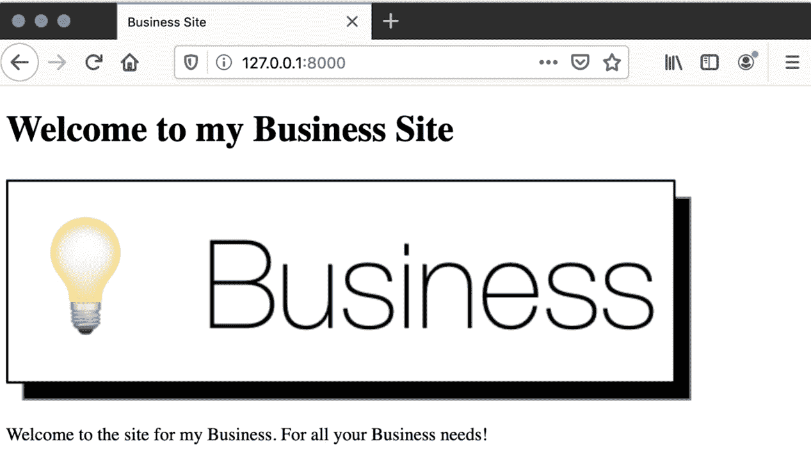

图 5.9：带有标志的网站

在这个练习中，我们为 `landing` 添加了一个基本模板，并将静态库加载到模板中。一旦静态库被加载，我们就能使用 `static` 模板标签来加载一个图片。然后我们能够在浏览器中看到我们的业务标志被渲染出来。

到目前为止，所有的静态文件加载都使用了 `AppDirectoriesFinder`，因为它使用它不需要额外的配置。在下一节中，我们将查看 `FileSystemFinder`，它更灵活，但需要少量配置才能使用。

## FileSystemFinder

我们已经学习了 `AppDirectoriesFinder`，它会在 Django 应用目录内部加载静态文件。然而，设计良好的应用应该是自包含的，因此它们应该只包含它们自己依赖的静态文件。如果我们有其他在网站或不同应用中使用的静态文件，我们应该将它们存储在应用目录之外。

注意

作为一条一般规则，你的 CSS 可能在整个网站上都是一致的，并且可以保存在一个全局目录中。一些图片和 JavaScript 代码可能特定于应用，因此这些将存储在该应用的静态目录中。这只是一般建议：你可以将静态文件存储在项目最有意义的地方。

在我们的业务站点应用中，我们将把 CSS 文件存储在站点静态目录中，因为它不仅会在 `landing` 应用中使用，随着我们添加更多应用，它还会在整个网站上使用。

Django 通过其 `FileSystemFinder` 静态文件查找器提供了从任意目录服务静态文件的支持。这些目录可以位于磁盘的任何位置。通常，你会在你的项目目录内部有一个 `static` 目录，但如果你的公司有一个全局静态目录，它被许多不同的项目（包括非 Django 网络应用）使用，那么你也可以使用它。

`FileSystemFinder` 使用 `settings.py` 文件中的 `STATICFILES_DIRS` 设置来确定搜索静态文件的目录。当项目创建时，这个设置是不存在的，必须由开发者设置。我们将在下一个练习中添加它。构建这个列表有两种选项：

+   设置目录列表

+   设置一个元组列表的形式 `(prefix, directory)`

第二个用例在我们覆盖更多基础知识后更容易理解，所以我们将在解释和演示第一个用例之后返回它。它将在 *STATICFILES_DIRS Prefixed Mode* 部分的 *Exercise 5.04*，*为生产收集静态文件* 之后进行说明。现在，我们只解释第一个用例，它只是一个或多个目录的列表。

在 `business_site` 中，我们将在项目目录内部添加一个 `static` 目录（即，在包含 `landing` 应用和 `manage.py` 文件的同一目录中）。在构建列表时，我们可以使用 `BASE_DIR` 设置将其分配给 `STATICFILES_DIRS`：

```py
STATICFILES_DIRS = [os.path.join(BASE_DIR, 'static')]
```

我们还在这部分前面提到，你可能想要在这个列表中设置多个目录路径，例如，如果你有一些由多个网络项目共享的公司级静态数据。只需将额外的目录添加到 `STATICFILES_DIRS` 列表中：

```py
STATICFILES_DIRS = [os.path.join(BASE_DIR, 'static'), \
                    '/Users/username/projects/company-static/']
```

这些目录将按顺序检查以找到匹配的文件。如果两个目录中都有文件，则首先找到的文件将被提供。例如，如果 `static/main.css`（在 `business_site` 项目目录内）和 `/Users/username/projects/company-static/bar/main.css` 文件都存在，则对 `/static/main.css` 的请求将提供 `business_site` 项目的 `main.css`，因为它在列表中排在第一位。在决定将目录添加到 `STATICFILES_DIRS` 的顺序时请记住这一点；你可以选择优先考虑项目静态文件或全局文件。

在我们的商业网站（以及稍后的 Bookr）中，我们在这个列表中只会使用一个 `static` 目录，所以我们不必担心这个问题。

在下一个练习中，我们将添加一个包含 CSS 文件的 `static` 目录。然后我们将配置 `STATICFILES_DIRS` 设置以从 `static` 目录提供。

## 练习 5.03：从项目静态目录提供

我们已经在 *练习 5.01*，*从应用目录中提供文件* 中展示了提供特定应用图像文件的示例。现在我们想要提供一个 CSS 文件，该文件将在我们的整个项目中用于设置样式，因此我们将从项目文件夹内的静态目录中提供这个文件。

在这个练习中，你将设置你的项目以从特定目录中提供静态文件，然后再次使用 `` 模板标签将其包含在模板中。这将通过 `business_site` 示例项目来完成：

1.  在 PyCharm 中打开 `business_site` 项目（如果尚未打开）。然后，右键单击 `business_site` 项目目录（顶级 `business_site` 目录，而不是 `business_site` 包目录）并选择 `New` -> `Directory`。

1.  在 `New Directory` 对话框中，输入 `static` 然后点击 `OK`。

1.  右键单击你刚刚创建的 `static` 目录，选择 `New` -> `File`。

1.  在 `Name New File` 对话框中，输入 `main.css` 并点击 `OK`。

1.  空的 `main.css` 文件应该会自动打开。输入一些简单的 CSS 规则，以居中文本并设置字体和背景颜色。将以下文本输入到 `main.css` 文件中：

    ```py
    body {
        font-family: Arial, sans-serif;
        text-align: center;
        background-color: #f0f0f0;
    }
    ```

    你现在可以保存并类 `main.css`。你可以查看完整的文件以供参考：[`packt.live/38H8a9N`](http://packt.live/38H8a9N)。

1.  打开 `business_site/settings.py`。在这里，将目录列表设置到 `STATICFILES_DIRS` 设置中。在这种情况下，列表将只有一个条目。在 `settings.py` 的底部定义一个新的 `STATICFILES_DIRS` 变量，使用以下代码：

    ```py
    STATICFILES_DIRS = [os.path.join(BASE_DIR, 'static')]
    ```

    在 `settings.py` 文件中，`BASE_DIR` 是一个包含项目目录路径的变量。你可以通过将 `static` 与 `BASE_DIR` 连接来构建你在 *步骤 2* 中创建的 `static` 目录的完整路径。然后你将这个路径放入一个列表中。完整的 `settings.py` 文件应该看起来像这样：[`packt.live/3hnQQKW`](http://packt.live/3hnQQKW)。

1.  如果 Django 开发服务器没有运行，请启动它。你可以通过检查是否可以加载 `main.css` 文件来验证设置是否正确。请注意，这没有命名空间，所以 URL 是 `http://127.0.0.1:8000/static/main.css`。在浏览器中打开这个 URL 并检查内容是否与你刚刚输入和保存的内容匹配：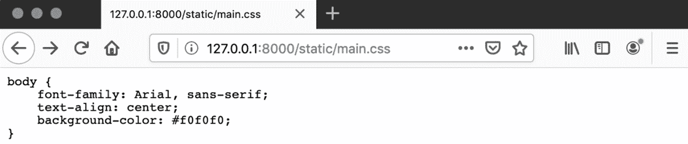

    图 5.10：Django 提供的 CSS

    如果文件没有加载，请检查你的 `STATICFILES_DIRS` 设置。如果你在修改 `settings.py` 时 Django 开发服务器正在运行，你可能需要重新启动 Django 开发服务器。

1.  现在，你需要在索引模板中包含 `main.css`。在 `templates` 文件夹中打开 `index.html`。在关闭 `</head>` 标签之前，添加以下 `<link>` 标签来加载 CSS：

    ```py
    <link rel="stylesheet" href="">
    ```

    这通过使用 `` 模板标签将 `main.css` 文件链接进来。如前所述，由于 `main.css` 没有命名空间，你只需包含它的名称即可。保存文件。它应该看起来像这样：[`packt.live/392aedP`](http://packt.live/392aedP)。

1.  在你的浏览器中加载 `http://127.0.0.1:8000/`，你应该会看到背景颜色、字体和对齐方式都发生了变化：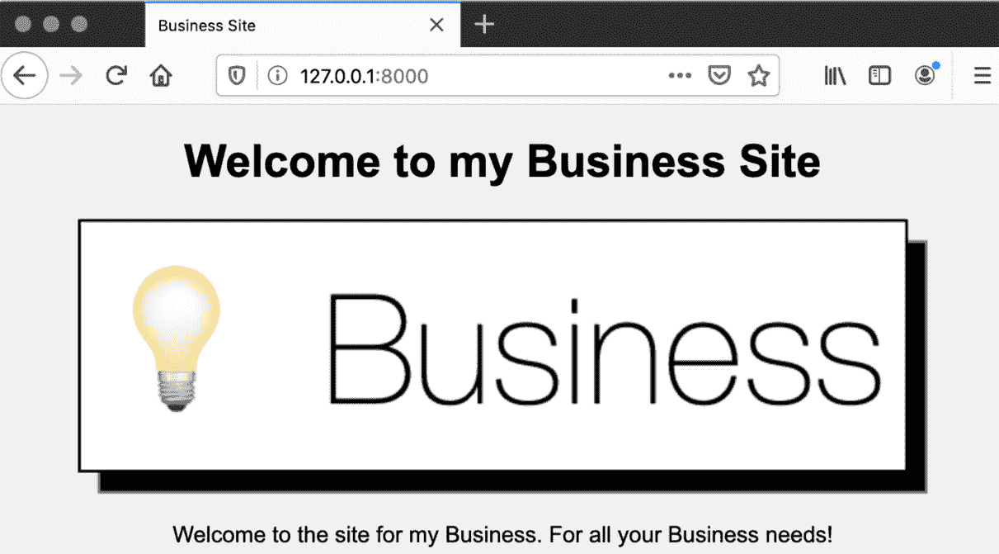

图 5.11：使用自定义字体可见的 CSS 应用

你的商业着陆页应该看起来像 *图 5.11*。由于你在 `base.html` 模板中包含了 CSS，它将在所有扩展此模板的模板中可用（尽管目前没有，但这是为未来做好规划的好方法）。

在这个练习中，我们将一些 CSS 规则放入它们自己的文件中，并使用 Django 的 `FileSystemFinder` 来提供它们。这是通过在 `business_site` 项目目录内创建一个 `static` 目录并在 Django 设置（`settings.py` 文件）中使用 `STATICFILES_DIRS` 设置来实现的。我们使用 `static` 模板标签将 `main.css` 文件链接到 `base.html` 模板中。我们在浏览器中加载了主页面，并看到字体和颜色变化已经应用。

我们现在已经介绍了静态文件查找器在请求期间的使用（在给定 URL 时加载特定的静态文件）。现在我们将看看它们的另一个用例：在运行 `collectstatic` 管理命令时，查找和复制用于生产部署的静态文件。

## 静态文件查找器：在 collectstatic 时使用

一旦我们完成对静态文件的工作，它们需要被移动到可以被我们的生产 Web 服务器提供的特定目录中。然后我们可以通过将我们的 Django 代码和静态文件复制到生产 Web 服务器上来部署我们的网站。在`business_site`的情况下，我们将希望将`logo.png`和`main.css`（以及其他 Django 自身包含的静态文件）移动到一个单独的目录中，以便可以复制到生产 Web 服务器。这就是`collectstatic`管理命令的作用。

我们已经讨论了 Django 在请求处理期间如何使用静态文件查找器。现在，我们将介绍另一个用例：为部署收集静态文件。运行`collectstatic`管理命令后，Django 会使用每个查找器列出磁盘上的静态文件。然后，找到的每个静态文件都会被复制到`STATIC_ROOT`目录（也在`settings.py`中定义）。这有点像是处理请求的反向操作。不是通过获取 URL 路径并将其映射到文件系统路径，而是将文件系统路径复制到一个前端 Web 服务器可以预测的位置。这允许前端 Web 服务器独立于 Django 处理静态文件的请求。

注意

前端 Web 服务器的设计是为了将请求路由到应用程序（如 Django）或从磁盘读取静态文件。它可以更快地处理请求，但不能像 Django 那样生成动态内容。前端 Web 服务器包括 Apache HTTPD、Nginx 和 lighttpd 等软件。

为了具体说明`collectstatic`的工作方式，我们将使用来自*练习 5.01*，*从应用目录中提供文件*，和*练习 5.03*，*从项目状态目录中提供*的两个文件分别：`landing/static/landing/logo.png`和`static/main.css`。

假设`STATIC_ROOT`被设置为一个由普通 Web 服务器提供的目录——这可能是类似`/var/www/business_site/static`的路径。这些文件的存储目的地将分别是`/var/www/business_site/static/reviews/logo.png`和`/var/www/business_site/static/main.css`。

现在当接收到一个静态文件的请求时，由于路径映射是一致的，Web 服务器将能够轻松地提供服务：

+   `/static/main.css`是从`/var/www/business_site/static/main.css`文件中提供的。

+   `/static/reviews/logo.png`是从`/var/www/business_site/static/reviews/logo.png`文件中提供的。

这意味着 Web 服务器根目录是`/var/www/business_site/`，静态路径只是以通常方式从磁盘加载，就像 Web 服务器加载文件一样。

我们已经展示了 Django 如何在开发期间定位静态文件并自行提供服务。在生产环境中，我们需要前端 Web 服务器能够不涉及 Django 就提供静态文件，这既是为了安全也是为了速度。

在没有运行 `collectstatic` 的情况下，网络服务器无法将 URL 映射回路径。例如，它不知道 `main.css` 必须从项目静态目录加载，而 `logo.png` 则要从 `landing` 应用目录加载——它没有关于 Django 目录布局的概念。

你可能会想通过将你的网络服务器根目录设置为这个目录来直接从 Django 项目目录提供文件——请不要这样做。将整个 Django 项目目录共享存在安全风险，因为它会使下载我们的 `settings.py` 或其他敏感文件成为可能。运行 `collectstatic` 将文件复制到一个目录，这个目录可以被移动到 Django 项目目录外，到网络服务器根目录，以提高安全性。

到目前为止，我们讨论了使用 Django 直接将静态文件复制到网络服务器根目录的方法。你也可以让 Django 将它们复制到一个中间目录，然后在部署过程中将其移动到 CDN 或其他服务器。我们不会详细介绍具体的部署过程；你如何选择将静态文件复制到网络服务器将取决于你或你公司的现有设置（例如，持续交付管道）。

注意

`collectstatic` 命令没有考虑到使用 `static` 模板标签的情况。它将收集 `static` 目录内所有的静态文件，即使这些文件在你的项目中没有被包含在模板中。

在下一个练习中，我们将看到 `collectstatic` 命令的实际应用。我们将使用它来将到目前为止所有的 `business_site` 静态文件复制到一个临时目录中。

## 练习 5.04：为生产收集静态文件

尽管我们本章不会涉及将应用部署到网络服务器，但我们仍然可以使用 `collectstatic` 管理命令并查看其结果。在这个练习中，我们将创建一个临时存放位置来存放将要复制的静态文件。这个目录将被命名为 `static_production_test`，并位于 `business_site` 项目目录内。作为部署过程的一部分，你可以将这个目录复制到你的生产网络服务器上。然而，由于我们直到第 *17* 章才会设置网络服务器，即 *Django 应用部署（第一部分 – 服务器设置）*，我们只会检查其内容，以了解文件是如何复制和组织的：

1.  在 PyCharm 中，创建一个临时目录来存放收集到的文件。右键点击 `business_site` 项目目录（这是顶级文件夹，不是 `business_site` 模块），然后选择 `新建` -> `目录`。

1.  在 `新目录` 对话框中，输入名称 `static_production_test` 并点击 `确定`。

1.  打开 `settings.py` 文件，并在文件底部定义一个新的设置 `STATIC_ROOT`。将其设置为刚刚创建的目录路径：

    ```py
    STATIC_ROOT = os.path.join(BASE_DIR, 'static_production_test')
    ```

    这会将`static_dir`与`BASE_DIR`（业务站点项目路径）连接起来以生成完整路径。保存`settings.py`文件。它应该看起来像这样：[`packt.live/2Jq59Cc`](http://packt.live/2Jq59Cc)。

1.  在终端中运行`collectstatic` `manage`命令：

    ```py
    python3 manage.py collectstatic
    ```

    您应该看到以下类似的输出：

    ```py
    132 static files copied to \
      '/Users/ben/business_site/static_production_test'.
    ```

    如果您预期只复制两个文件，这可能会显得很多，但请记住，它将复制所有已安装应用程序的所有文件。在这种情况下，由于您安装了 Django 管理应用程序，所以 132 个文件中的大多数都是为了支持它。

1.  让我们查看`static_production_test`目录以查看已创建的内容。此目录的扩展视图（来自 PyCharm 项目页面）如图 5.12 所示，仅供参考。您的应该类似。

    ]

图 5.12：collectstatic 命令的目标目录

您应该注意到里面有三个项目：

`css`、`fonts`、`img`和`js`。

来自您的着陆应用的`static`目录。其中包含`logo.png`文件。已创建此目录以匹配我们创建的目录的命名空间。

`static`目录。由于您没有将其放置在命名空间目录内，因此它已被直接放置在`STATIC_ROOT`中。

如果你想，可以打开这些文件中的任何一个并验证其内容是否与您刚刚正在工作的文件相匹配——它们应该是匹配的，因为它们只是原始文件的副本。

在这个练习中，我们从`business_site`（包括 Django 包含的`admin`静态文件）收集了所有静态文件。它们被复制到由`STATIC_ROOT`设置定义的目录中（在`business_site`项目目录中的`static_production_test`）。我们看到`main.css`直接在这个文件夹中，但其他静态文件被命名空间在其应用程序目录中（`admin`和`reviews`）。这个文件夹可以被复制到生产 Web 服务器上以部署我们的项目。

## STATICFILES_DIRS 前缀模式

如前所述，`STATICFILES_DIRS`设置也接受形式为`(prefix, directory)`的元组项。这些操作模式不是互斥的，`STATICFILES_DIRS`可以包含非前缀（字符串）或前缀（元组）项。本质上，这允许您将特定的 URL 前缀映射到目录。在 Bookr 中，我们没有足够的静态资源来证明设置这一点的必要性，但如果您想以不同的方式组织静态资源，它可能是有用的。例如，您可以将所有图像保存在某个目录中，所有 CSS 保存在另一个目录中。如果您使用第三方 CSS 生成工具，如使用**LESS**的 Node.js，可能需要这样做。

注意

LESS 是一个使用 Node.js 的 CSS 预处理器。它允许您使用变量和其他类似编程的概念来编写 CSS，这些概念在原生 CSS 中不存在。然后 Node.js 将其编译为 CSS。更深入的解释超出了本书的范围——简而言之，如果您使用它（或类似的工具），那么您可能希望直接从它保存编译输出的目录提供服务。

解释前缀模式的工作原理的最简单方法是通过一个简短的示例。这将扩展 *练习 5.03*，*从项目静态目录中提供服务* 中创建的 `STATICFILES_DIRS` 设置。在这个示例中，向此设置添加了两个前缀目录，一个用于提供图像，另一个用于提供 CSS：

```py
STATICFILES_DIRS = [os.path.join(BASE_DIR, 'static'),\
                    ('images', os.path.join\
                               (BASE_DIR, 'static_images')),\
                    ('css', os.path.join(BASE_DIR, 'static_css'))]
```

除了已经无前缀提供服务的 `static` 目录外，我们还在 `business_site` 项目目录内添加了 `static_images` 目录的服务。这个前缀是 `images`。我们还在 Bookr 项目目录内添加了 `static_css` 目录的服务，前缀是 `css`。

然后，我们可以从 `static`、`static_css` 和 `static_images` 目录分别提供 `main.js`、`main.css` 和 `main.jpg` 三个文件。目录布局如图 *图 5.13* 所示：

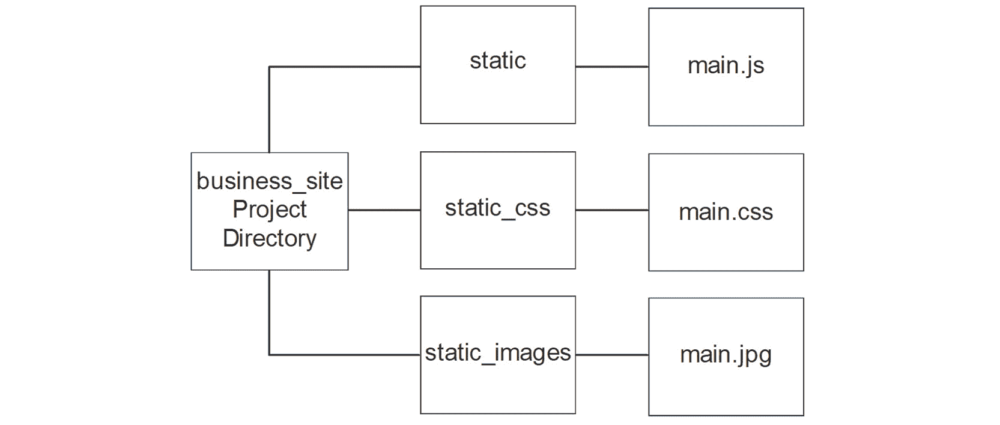

图 5.13：用于前缀 URL 的目录布局

在通过 URL 访问这些文件时，映射如图 *图 5.14* 所示：

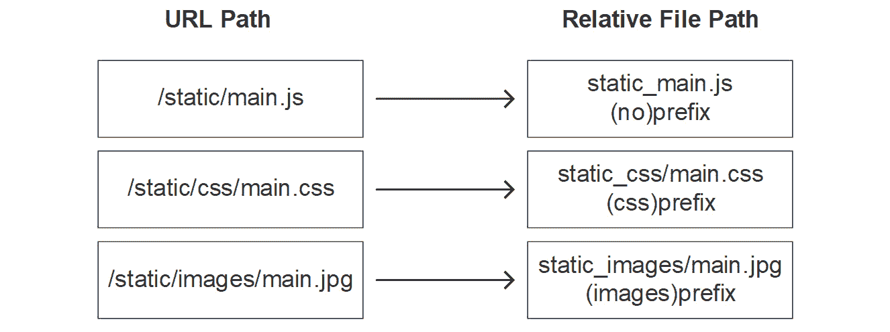

图 5.14：基于前缀的 URL 到文件的映射

Django 将任何以前缀开头的静态 URL 路由到匹配该前缀的目录。

当使用 `static` 模板标签时，请使用前缀和文件名，而不是目录名。例如：

```py

```

当使用 `collectstatic` 命令收集静态文件时，它们会被移动到 `STATIC_ROOT` 内部具有前缀名称的目录中。`STATIC_ROOT` 目录中的源路径和目标路径如图 *图 5.15* 所示：

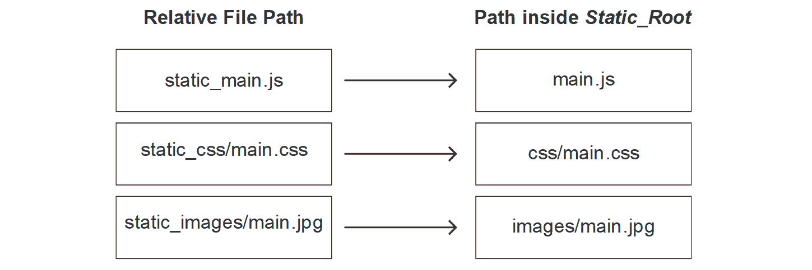

图 5.15：项目目录中的路径映射到 STATIC_ROOT 中的路径

Django 在 `STATIC_ROOT` 内部创建前缀目录。正因为如此，即使在使用网络服务器且不通过 Django 路由 URL 查找的情况下，路径也可以保持一致。

## findstatic 命令

`staticfiles` 应用程序还提供了一个额外的管理命令：`findstatic`。此命令允许您输入静态文件的相对路径（与在 `static` 模板标签内使用的相同）并且 Django 会告诉您该文件的位置。它也可以在详细模式下使用，以输出它正在搜索的目录。

注意

您可能不熟悉详尽性或详细模式的概念。具有更高的详尽性（或简单地打开详细模式）将导致命令生成更多输出。许多命令行应用程序可以以更多或更少的详尽性执行。这有助于尝试调试您正在使用的程序。要查看详细模式的作用示例，您可以尝试以详细模式运行 Python shell。输入 `python -v`（而不是仅输入 `python`）并按 `Enter`。Python 将以详细模式启动并打印出它导入的每个文件的路径。

此命令主要用于调试/故障排除目的。如果加载了错误的文件，或者找不到某个特定文件，您可以使用此命令尝试找出原因。该命令将显示特定路径正在加载的磁盘上的文件，或者通知您文件找不到以及搜索了哪些目录。

这可以帮助解决多个文件具有相同名称且优先级不是您期望的问题。请参阅 *FileSystemFinder* 部分关于 `STATICFILES_DIRS` 设置中优先级的一些说明。您还可能看到 Django 没有在您期望的目录中搜索文件，在这种情况下，可能需要将静态目录添加到 `STATICFILES_DIRS` 设置中。

在下一个练习中，您将执行 `findstatic` 管理命令，以便熟悉一些输出对于良好（文件正确找到）和不良（文件缺失）场景的含义。

## 练习 5.05：使用 findstatic 查找文件

您现在将使用各种选项运行 `findstatic` 命令，并理解其输出的含义。首先，我们将使用它来查找一个存在的文件，并查看它显示文件的路径。然后，我们将尝试查找一个不存在的文件并检查输出的错误。然后，我们将以多个详尽级别和不同的与命令交互的方式重复此过程。虽然这个练习不会对 Bookr 项目进行更改或推进，但熟悉该命令在您需要在自己的 Django 应用程序中工作时很有用：

1.  打开终端并导航到 `business_site` 项目目录。

1.  使用不带选项的 `findstatic` 命令。它将输出一些帮助信息，解释如何使用：

    ```py
    python3 manage.py findstatic
    ```

    帮助输出显示：

    ```py
    usage: manage.py findstatic 
          [-h] [--first] [--version] [-v {0,1,2,3}]
          [--settings SETTINGS] [--pythonpath PYTHONPATH]
          [--traceback] [--no-color] [--force-color]
          [--skip-checks]
          staticfile [staticfile ...]
    manage.py findstatic: error: Enter at least one label.
    ```

1.  您可以一次查找一个或多个文件；让我们从已知的 `main.css` 文件开始：

    ```py
    python3 manage.py findstatic main.css
    ```

    命令将输出 `main.css` 被找到的路径：

    ```py
    Found 'main.css' here:
      /Users/ben/business_site/static/main.css
    ```

    您的完整路径可能不同（除非您也叫 Ben），但您可以看到当 Django 在请求中定位 `main.css` 时，它将从项目的 `static` 目录加载 `main.css` 文件。

    如果您安装的第三方应用程序没有正确命名空间其静态文件并且与您的某个文件冲突，这可能很有用。

1.  让我们尝试查找一个不存在的文件，`logo.png`：

    ```py
    python3 manage.py findstatic logo.png
    ```

    Django 显示错误信息，表示文件找不到：

    ```py
    No matching file found for 'logo.png'.
    ```

    Django 无法定位此文件，因为我们已经对其进行了命名空间化——我们必须包含完整的相对路径，就像我们在`static`模板标签中使用的那样。

1.  再次尝试查找`logo.png`，但这次使用完整路径：

    ```py
    python3 manage.py findstatic landing/logo.png
    ```

    Django 现在可以找到该文件：

    ```py
    Found 'landing/logo.png' here:
      /Users/ben/business_site/landing/static/landing/logo.png
    ```

1.  同时查找多个文件可以通过将每个文件作为参数添加来完成：

    ```py
    python3 manage.py findstatic landing/logo.png missing-file.js main.css
    ```

    每个文件的位置状态都会显示：

    ```py
    No matching file found for 'missing-file.js'.
    Found 'landing/logo.png' here:
      /Users/ben/business_site/landing/static/landing/logo.png
    Found 'main.css' here:
      /Users/ben/business_site/static/main.css
    ```

1.  命令可以以`0`、`1`或`2`的详细程度执行。默认情况下，它在详细程度`1`下执行。要设置详细程度，请使用`--verbosity`或`-v`标志。将详细程度降低到`0`以仅输出它找到的路径而不提供任何额外信息。对于缺失的路径不显示错误：

    ```py
    python3 manage.py findstatic -v0 landing/logo.png missing-file.js main.css
    ```

    输出仅显示找到的路径——注意对于缺失的文件`missing-file.js`没有显示错误：

    ```py
    /Users/ben/business_site/landing/static/landing/logo.png
    /Users/ben/business_site/static/main.css
    ```

    如果您将输出管道传输到另一个文件或命令，这种详细程度可能很有用。

1.  要获取更多关于 Django 正在搜索的目录以查找您请求的文件的信息，请将详细程度增加到`2`：

    ```py
    python3 manage.py findstatic -v2 landing/logo.png missing-file.js main.css
    ```

    输出包含更多信息，包括已搜索请求文件的目录。您可以看到，随着`admin`应用的安装，Django 也在 Django admin 应用目录中搜索静态文件：

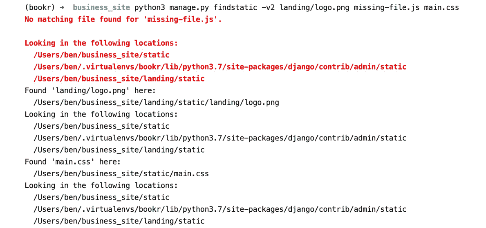

图 5.16：以详细程度 2 执行 findstatic，显示确切搜索了哪些目录

`findstatic`命令不是您在处理 Django 时每天都会使用的东西，但在尝试解决静态文件问题时，了解它是有用的。我们看到了命令输出了存在文件的完整路径，以及文件不存在时的错误信息。我们还一次性提供了多个文件并看到了所有文件的信息。最后，我们使用不同级别的详细程度运行了该命令。`-v0`标志抑制了关于缺失文件的错误。`-v1`是默认值，显示了找到的路径和错误。使用`-v2`标志增加详细程度还会打印出正在搜索特定静态文件的目录。

## 服务器最新文件（用于缓存失效）

如果您不熟悉缓存，基本想法是某些操作可能需要很长时间才能执行。我们可以通过将操作的结果存储在更快访问的地方来加快系统速度，这样在下一次需要它们时，可以快速检索。耗时较长的操作可以是任何事情——从运行时间较长的函数或渲染时间较长的图像，到在互联网上下载时间较长的大型资产。我们对此最后一种情况最感兴趣。

你可能已经注意到，你第一次访问某个特定网站时，它加载很慢，但下次加载就快得多。这是因为你的浏览器已经缓存了网站加载所需的一些（或全部）静态文件。

以我们的商业网站为例，我们有一个包含`logo.png`文件的页面。第一次访问商业网站时，我们必须下载动态 HTML，它很小且传输速度快。我们的浏览器解析 HTML，并看到应该包含`logo.png`。然后它可以下载这个文件，这个文件很大，下载可能需要更长的时间。请注意，这个场景假设商业网站现在托管在远程服务器上，而不是在我们的本地机器上——这对我们来说访问速度非常快。

如果网页服务器设置正确，浏览器会将`logo.png`存储在计算机上。下次我们访问*着陆页*（或者确实任何包含`logo.png`的页面），你的浏览器会识别 URL，可以从磁盘加载文件，而不是再次下载，从而加快浏览体验。

注意

我们说浏览器会缓存“如果网页服务器设置正确”。这是什么意思？前端网页服务器应该配置为在静态文件响应中发送特殊的 HTTP 头。它可以发送一个`Cache-Control`头，它可以有如`no-cache`（文件永远不应被缓存；换句话说，每次都应该请求最新版本）或`max-age=<seconds>`（只有在最后检索超过`<seconds>`秒之前，文件才应再次下载）。响应还可以包含一个`Expires`头，其值为日期。一旦达到这个日期，文件就被认为是“过时”的，此时应该请求新版本。

计算机科学中最难的问题之一是缓存失效。例如，如果我们更改`logo.png`，我们的浏览器如何知道它应该下载新版本呢？唯一确定知道它已更改的方法是再次下载文件，并与我们已保存的版本进行比较。当然，这会违背缓存的目的，因为我们每次文件更改时（或没有更改）仍然会下载。我们可以缓存任意时间或服务器指定的时间，但如果静态文件在时间到达之前已更改，我们就不知道。我们会使用旧版本，直到我们认为它已过期，那时我们会下载新版本。如果我们有一个 1 周的过期时间，而静态文件在第二天更改，我们仍然会使用旧版本 6 天。当然，如果你想要强制重新下载所有静态资源，浏览器可以被设置为不使用缓存来重新加载页面（具体如何操作取决于浏览器，例如*Shift* + *F5* 或 *Cmd* + *Shift* + *R*）。

没有必要尝试缓存我们的动态响应（渲染的模板）。由于它们被设计成动态的，我们希望确保用户在每次页面加载时都能获得最新版本，因此它们不应该被缓存。它们的大小也相当小（与图像等资产相比），因此缓存它们时速度优势不大。

Django 提供了一个内置的解决方案。在 `collectstatic` 阶段，当文件被复制时，Django 可以将文件内容的哈希值附加到文件名上。例如，`logo.png` 源文件将被复制到 `static_production_test/landing/logo.f30ba08c60ba.png`。这仅在使用 `ManifestFilesStorage` 存储引擎时才会这样做。由于文件名仅在内容更改时才会更改，因此浏览器将始终下载新的内容。

使用 `ManifestFilesStorage` 是使缓存失效的一种方法。可能还有其他更适合您应用程序的选项。

注意

哈希是一个单向函数，它根据输入的长度生成一个固定长度的字符串。有几种不同的哈希函数可用，Django 使用的是 `a` 是 `0cc175b9c0f1b6a831c399e269772661`。字符串（一个更长的字符串）的 MD5 哈希是 `69fc4316c18cdd594a58ec2d59462b97`。它们都是 32 个字符长。

通过更改 `settings.py` 中的 `STATICFILES_STORAGE` 值来选择存储引擎。这是一个指向要使用的模块和类的点分隔路径的字符串。实现哈希添加功能的类是 `django.contrib.staticfiles.storage.ManifestStaticFilesStorage`。

使用此存储引擎不需要对您的 HTML 模板进行任何更改，前提是您使用 `static` 模板标签包含静态资产。Django 生成一个包含原始文件名和哈希文件名之间映射的清单文件（`staticfiles.json`，JSON 格式）。当使用 `static` 模板标签时，它将自动插入哈希文件名。如果您没有使用 `static` 标签而是手动插入静态 URL，那么浏览器将尝试加载非哈希路径，并且当缓存应该失效时，URL 不会自动更新。

例如，我们在这里使用 `static` 标签包含 `logo.png`：

```py

```

当页面被渲染时，最新哈希值将从 `staticfiles.json` 中检索，输出将如下所示：

```py

```

如果我们没有使用 `static` 标签，而是硬编码路径，它将始终按原样显示：

```py

```

由于这不含哈希值，我们的浏览器将不会看到路径变化，因此永远不会尝试下载新文件。

在运行 `collectstatic` 时，Django 保留带有旧哈希值的文件的前一个版本，因此旧版本的应用程序在需要时仍然可以引用它。文件的最新版本也以不带哈希的形式复制，这样非 Django 应用程序可以引用它而无需查找哈希。

在下一个练习中，我们将更改项目设置以使用 `ManifestFilesStorage` 引擎，然后运行 `collectstatic` 管理命令。这将复制所有静态资产，就像在 *练习 5.04*，*为生产收集静态文件* 中一样；然而，现在它们的哈希将包含在文件名中。

## 练习 5.06：探索 ManifestFilesStorage 存储引擎

在这个练习中，您将临时更新 *settings.py* 以使用 `ManifestFilesStorage`，然后运行 `collectstatic` 以查看文件如何生成带有哈希的文件：

1.  在 PyCharm 中（仍在 `business_site` 项目中），打开 `settings.py`。在文件底部添加一个 `STATICFILES_STORAGE` 设置：

    ```py
    STATICFILES_STORAGE = \
    'django.contrib.staticfiles.storage.ManifestStaticFilesStorage'
    ```

    完成的文件应如下所示：[`packt.live/2Jq59Cc`](http://packt.live/2Jq59Cc)。

1.  打开终端并导航到 `business_site` 项目目录。像之前一样运行 `collectstatic` 命令：

    ```py
    python3 manage.py collectstatic
    ```

    如果您的 `static_production_test` 目录不为空（这可能是文件在 *练习 5.04*，*为生产收集静态文件* 期间被移动到那里的情况），则您将提示允许覆盖现有文件：

    ![图 5.17：在 collectstatic 期间允许覆盖的提示]

    ![图片 B15509_05_17.jpg]

    ```py
    0 static files copied to '/Users/ben/business_site
      /static_production_test', 132 unmodified, 
      28 post-processed.
    ```

    由于自上次运行 `collectstatic` 以来您没有更改任何文件，因此没有文件被复制。相反，Django 只是后处理文件（28 个文件），即生成它们的哈希并附加到文件名。

    静态文件已按之前的方式复制到 `static_production_test` 目录；然而，现在每个文件都有两个副本：一个带有哈希，一个不带。

    `static/main.css` 已被复制到 `static_production_test/main.856c74fb7029.css`（如果您的 CSS 文件内容不同，例如包含额外的空格或换行符，则此文件名可能不同）：

    ![图 5.18：带有哈希文件名的 expanded static_production_test 目录]

    ![图片 B15509_05_18.jpg]

    图 5.18：带有哈希文件名的 expanded static_production_test 目录

    *图 5.18* 展示了 expanded `static_production_test` 目录布局。您可以看到每个静态文件有两个副本以及 `staticfiles.json` 清单文件。以 `logo.png` 为例，您可以看到 `landing/static/landing/logo.png` 已被复制到与 `static_production_test/landing/logo.ba8d3d8fe184.png` 相同的目录。

1.  让我们对 `main.css` 文件进行更改，看看哈希如何变化。在文件末尾添加一些空白行然后保存。这不会改变 CSS 的效果，但文件的变化将影响其哈希。在终端中重新运行 `collectstatic` 命令：

    ```py
    python3 manage.py collectstatic
    ```

    再次提醒，您可能需要输入 `yes` 以确认覆盖：

    ```py
    You have requested to collect static files at the \
      destination location as specified in your settings:
        /Users/ben/business_site/static_production_test
    This will overwrite existing files!
    Are you sure you want to do this?
    Type 'yes' to continue, or 'no' to cancel: yes
    1 static file copied to '/Users/ben/business_site\
      /static_production_test', 131 unmodified, 28 post-processed.
    ```

    由于只有一个文件被更改，因此只复制了一个静态文件（`main.css`）。

1.  再次查看 `static_production_test` 目录。你应该会看到保留了带有旧哈希的旧文件，并添加了一个带有新哈希的新文件：![图 5.19：添加了另一个带有最新哈希的 `main.css` 文件    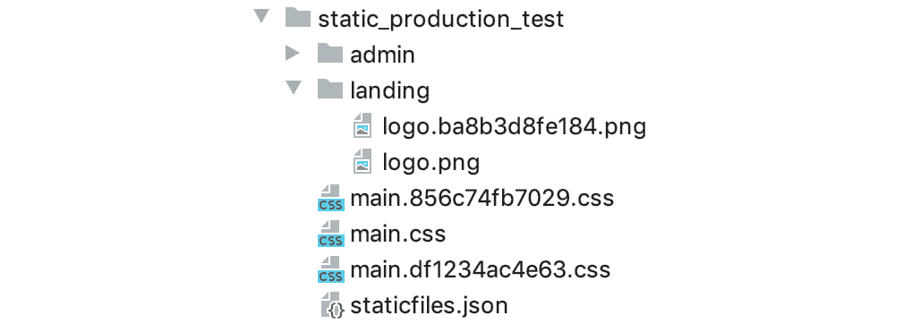

    图 5.19：添加了另一个带有最新哈希的 `main.css` 文件

    在这种情况下，我们有 `main.856c74fb7029.css`（现有）、`main.df1234ac4e63.css`（新）和 `main.css`。你的哈希可能不同。

    `main.css` 文件（无哈希）始终包含最新内容；也就是说，`main.df1234ac4e63.css` 和 `main.css` 文件的内容是相同的。在执行 `collectstatic` 命令期间，Django 将复制带有哈希和不带哈希的文件。

1.  现在检查 Django 生成的 `staticfiles.json` 文件。这是允许 Django 从正常路径查找哈希路径的映射。打开 `static_production_test/staticfiles.json`。所有内容可能都在一行中；如果这样的话，请从 `视图` 菜单 -> `活动编辑器` -> `软换行` 启用文本软换行。滚动到文件末尾，你应该会看到一个 `main.css` 文件的条目，例如：

    ```py
    "main.css": "main.df1234ac4e63.css"
    ```

    这就是 Django 如何在模板中使用 `static` 模板标签时填充正确的 URL：通过查找映射文件中的哈希路径。

1.  我们已经完成了对 `business_site` 的使用，我们只是用它来测试。你可以删除项目或者保留它作为活动期间的参考。

    注意

    不幸的是，我们无法检查哈希 URL 在模板中的插值方式，因为在调试模式下运行时，Django 不会查找文件的哈希版本。正如我们所知，Django 开发服务器只在调试模式下运行，所以如果我们关闭调试模式来尝试查看哈希插值，那么 Django 开发服务器将无法启动。当使用前端 Web 服务器进入生产环境时，你需要自己检查这个插值。

在这个练习中，我们通过在 `settings.py` 中添加 `STATICFILES_STORAGE` 设置来配置 Django 使用 `ManifestFilesStorage` 作为其静态文件存储。然后我们执行了 `collectstatic` 命令来查看哈希是如何生成并添加到复制文件的文件名中的。我们看到了名为 `staticfiles.json` 的清单文件，它存储了从原始路径到哈希路径的查找。最后，我们清理了在本练习和 *练习 5.04*，*为生产收集静态文件* 中添加的设置和目录。这些是 `STATIC_ROOT` 设置、`STATICFILES_STORAGE` 设置和 `static_product_test` 目录。

## 自定义存储引擎

在上一节中，我们将存储引擎设置为 `ManifestFilesStorage`。这个类由 Django 提供，但也可以编写自定义存储引擎。例如，你可以编写一个存储引擎，在运行 `collectstatic` 时将你的静态文件上传到 CDN、Amazon S3 或 Google Cloud 存储桶。

编写自定义存储引擎超出了本书的范围。已经存在支持上传到各种云服务的第三方库；其中一个这样的库是`django-storages`，可以在[`django-storages.readthedocs.io/`](https://django-storages.readthedocs.io/)找到。

以下代码是一个简短的框架，指示你应该实现哪些方法来创建自定义文件存储引擎：

```py
from django.conf import settings
from django.contrib.staticfiles import storage
class CustomFilesStorage(storage.StaticFilesStorage):
    def __init__(self):
    """
    The class must be able to be instantiated 
    without any arguments.
    Create custom settings in settings.py and read them instead.
    """
    self.setting = settings.CUSTOM_STORAGE_SETTING
```

该类必须能够不带任何参数进行实例化。`__init__`函数必须能够从全局标识符（在这种情况下，从我们的 Django 设置）中加载任何设置：

```py
  def delete(self, name):
    """
    Implement delete of the file from the remote service.
    """
```

此方法应能够从远程服务中删除由`name`参数指定的文件：

```py
    def exists(self, name):
    """
    Return True if a file with name exists in the remote service.
    """
```

此方法应查询远程服务以检查由名称指定的文件是否存在。如果文件存在，则返回`True`，如果不存在，则返回`False`：

```py
    def listdir(self, path):
    """
    List a directory in the remote service. Return should 
    be a 2-tuple of lists, the first a list of directories, 
    the second a list of files.
    """
```

此方法应查询远程服务以列出`path`处的目录。然后它应返回一个包含两个列表的 2 元组。第一个元素应该是`path`内的目录列表，第二个元素应该是文件列表。例如：

```py
return (['directory1', 'directory2'], \
        ['code.py', 'document.txt', 'image.jpg'])
```

如果`path`不包含目录或文件，则应返回一个空列表。如果目录为空，则返回两个空列表：

```py
    def size(self, name):
    """
    Return the size in bytes of the file with name.
    """
```

此方法应查询远程服务并获取由`name`指定的文件大小：

```py
  def url(self, name):
  """
  Return the URL where the file of with name can be 
  access on the remote service. For example, this 
  might be URL of the file after it has been uploaded 
  to a specific remote host with a specific domain.
  """
```

此方法应确定访问由`name`指定的文件的 URL。这可以通过将`name`附加到特定的静态托管 URL 来构建：

```py
  def _open(self, name, mode='rb'):
  """
  Return a File-like object pointing to file with 
  name. For example, this could be a URL handle for 
  a remote file.
  """
```

此方法将提供一个远程文件句柄，由`name`指定。你的实现将取决于远程服务的类型。你可能需要下载文件，然后使用内存缓冲区（例如`io.BytesIO`对象）来模拟文件的打开：

```py
    def _save(self, name, content):
    """
    Write the content for a file with name. In this 
    method you might upload the content to a 
    remote service.
    """
```

此方法应将`content`保存到远程文件`name`中。实现此方法的方法将取决于你的远程服务。它可能通过 SFTP 传输文件，或者上传到 CDN。

虽然此示例没有实现任何与远程服务的传输，但你可参考它来了解如何实现自定义存储引擎。

在实现你的自定义存储引擎后，你可以通过在`settings.py`中的`STATICFILES_STORAGE`设置中设置其点模块路径来使其生效。

## 活动 5.01：添加评论 Logo

Bookr 应用应有一个针对`reviews`应用页面的特定 Logo。这涉及到添加一个仅针对`reviews`应用的基模板，并更新我们当前的`reviews`模板以继承它。然后你将在基模板上包含 Bookr 的`reviews` Logo。

这些步骤将帮助你完成此活动：

1.  添加一个 CSS 规则来定位 Logo。将此规则放入现有的`base.html`中，在`.navbar-brand`规则之后：

    ```py
    .navbar-brand > img {
      height: 60px;
    }
    ```

1.  添加一个继承模板可以覆盖的 `brand` 块模板标签。将其放在具有 `navbar-brand` 类的 `<a>` 元素内。`block` 的默认内容应保持为 `Book Review`。

1.  在 `reviews` 应用程序中添加一个静态目录，包含一个命名空间目录。从 [`packt.live/2WYlGjP`](https://packt.live/2WYlGjP) 下载 `reviews` 的 `logo.png` 并将其放入此目录中。

1.  创建 Bookr 项目的 `templates` 目录（在 Bookr 项目目录内）。然后，将 `reviews` 应用程序的当前 `base.html` 移动到这个目录中，使其成为整个项目的基模板。

1.  将新 `templates` 目录的路径添加到 `settings.py` 中的 `TEMPLATES['DIRS']` 设置（与你在 *练习 5.02*，*使用静态模板标签* 中所做的一样）。

1.  为 `reviews` 应用程序创建另一个 `base.html` 模板。将其放在 `reviews` 应用程序的 `templates` 目录中。新的模板应该扩展现有的 `base.html`。

1.  新的 `base.html` 应该覆盖 `brand` 块的内容。这个块应该只包含一个 `` 实例，其 `src` 属性使用 `` 模板标签设置。图像源应该是 *步骤 2* 中添加的标志。

1.  `views.py` 中的索引视图应渲染项目 `base.html` 而不是 `reviews` 的。

参考以下屏幕截图以查看这些更改后您的页面应该是什么样子。请注意，尽管您正在修改基础模板，但它不会改变主页面的布局：


图 5.20：添加评论标志后的图书列表页面

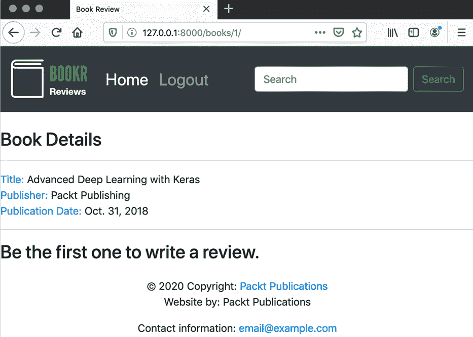


图 5.21：添加标志后的图书详情页面

注意

此活动的解决方案可以在 [`packt.live/2Nh1NTJ`](http://packt.live/2Nh1NTJ) 找到。

## 活动 5.02：CSS 优化

目前，CSS 被保留在 `base.html` 模板中。为了最佳实践，它应该移动到自己的文件中，以便可以单独缓存并减小 HTML 下载的大小。作为此过程的一部分，你还将添加一些 CSS 优化，例如字体和颜色，并将 Google Fonts CSS 链接到以支持这些更改。

这些步骤将帮助您完成此活动：

1.  在 Bookr 项目目录中创建一个名为 `static` 的目录。然后，在它里面创建一个名为 `main.css` 的新文件。

1.  将主 `base.html` 模板中的 `<style>` 元素内容复制到新的 `main.css` 文件中，然后从模板中删除 `<style>` 元素。将这些额外规则添加到 CSS 文件的末尾：

    ```py
    body {
      font-family: 'Source Sans Pro', sans-serif;
        background-color: #e6efe8
      color: #393939;
    }
    h1, h2, h3, h4, h5, h6 {
      font-family: 'Libre Baskerville', serif;
    }
    ```

1.  使用 `<link rel="stylesheet" href="…">` 标签链接到新的 `main.css` 文件。使用 `` 模板标签生成 `href` 属性的 URL，并且不要忘记 `load` `static` 库。

1.  在 Google fonts CSS 中添加链接，通过在基础模板中添加以下代码：

    ```py
    <link rel="stylesheet" 
      href="https://fonts.googleapis.com/css?family
        =Libre+Baskerville|Source+Sans+Pro&display=swap">
    ```

    注意

    您需要保持一个活跃的互联网连接，以便您的浏览器可以包含这个远程 CSS 文件。

1.  更新您的 Django 设置以添加`STATICFILES_DIRS`，设置为在*步骤 1*中创建的`static`目录。完成之后，您的 Bookr 应用应该看起来像*图 5.22*：

图 5.22：带有新字体和背景颜色的书单

注意新的字体和背景颜色。这些应该在所有 Bookr 页面上显示。

注意

本活动的解决方案可以在[`packt.live/2Nh1NTJ`](http://packt.live/2Nh1NTJ)找到。

## 活动五.03：添加全局标志

您已经添加了一个在`reviews`应用的页面中提供的标志。我们还有一个作为默认值的全局标志，但其他应用将能够覆盖它：

1.  从[`packt.live/2Jx7Ge4`](https://packt.live/2Jx7Ge4)下载 Bookr 标志（`logo.png`）。

1.  将其保存在项目的主`static`目录中。

1.  编辑主`base.html`文件。我们已经有了一个用于标志的区块（`brand`），因此可以在这里放置一个``实例。使用`static`模板标签来引用您刚刚下载的标志。

1.  检查您的页面是否正常工作。在主 URL 上，您应该看到 Bookr 标志，但在书单和详情页面上，您应该看到 Bookr 评论标志。

    完成后，您应该在主页上看到 Bookr 标志：

    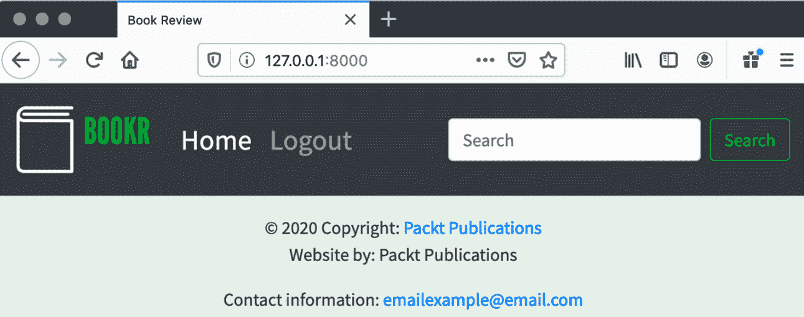

图 5.23：主页上的 Bookr 标志

当您访问之前有 Bookr 评论标志的页面，例如书单页面时，它应该仍然显示 Bookr 评论标志：

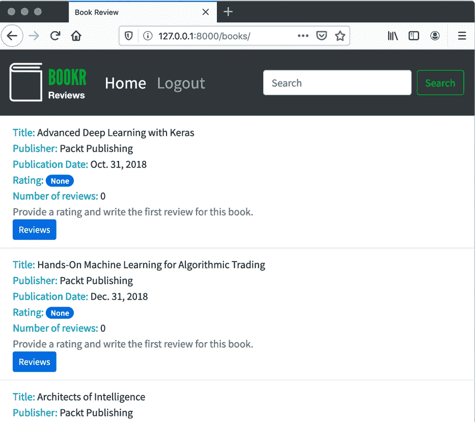

图 5.24：Bookr 评论标志仍然显示在评论页面上

注意

本活动的解决方案可以在[`packt.live/2Nh1NTJ`](http://packt.live/2Nh1NTJ)找到。

# 摘要

在本章中，我们展示了如何使用 Django 的`staticfiles`应用来查找和提供静态文件。我们使用内置的`static`视图在`DEBUG`模式下通过 Django 开发服务器提供这些文件。我们展示了存储静态文件的不同位置，使用项目全局的目录或为应用特定的目录；全局资源应存储在前者，而应用特定资源应存储在后者。我们展示了对静态文件目录进行命名空间的重要性，以防止冲突。在提供资产后，我们使用`static`标签将它们包含在我们的模板中。然后我们演示了如何使用`collectstatic`命令将所有资产复制到`STATIC_ROOT`目录，以便生产部署。我们展示了如何使用`findstatic`命令来调试静态文件的加载。为了自动使缓存失效，我们探讨了使用`ManifestFilesStorage`将文件内容的哈希添加到静态文件 URL 的方法。最后，我们简要讨论了使用自定义文件存储引擎。

到目前为止，我们只使用已经存在的内文来抓取网页。在下一章中，我们将开始添加表单，这样我们就可以通过向网页发送数据来与它们进行交互，使用 HTTP 协议。
