# 第七章：7. 高级表单验证和模型表单

概述

在继续使用 Bookr 应用程序的旅程中，你将开始本章，通过添加一个新的表单到你的应用程序中，并使用自定义的多字段验证和表单清理。你将学习如何设置表单的初始值并自定义小部件（正在生成的 HTML 输入元素）。然后，你将介绍`ModelForm`类，它允许从模型自动创建表单。你将在视图中使用它来自动保存新的或更改的`Model`实例。

到本章结束时，你将知道如何为 Django 表单添加额外的多字段验证，如何自定义和设置字段的表单小部件，如何使用`ModelForms`从 Django 模型自动创建表单，以及如何从`ModelForms`自动创建`Model`实例。

# 简介

本章建立在我们在*第六章*，*表单*中获得的知识之上，我们学习了如何从 HTML 表单提交数据到 Django 视图，无论是手动构建的 HTML 表单还是 Django 表单。我们使用了 Django 的`form`库来构建和自动验证具有基本验证的表单。例如，现在我们可以构建检查日期是否以期望的格式输入的表单，是否在用户输入年龄时输入了数字，以及用户点击`提交`按钮之前是否选择了下拉菜单。然而，大多数大型网站需要更高级的验证。

例如，某个字段可能只有在另一个字段被设置时才是必需的。假设我们想添加一个复选框，允许用户注册我们的月度通讯录。它下面有一个文本框，让他们输入他们的电子邮件地址。通过一些基本的验证，我们可以检查以下内容：

+   用户是否勾选了复选框。

+   用户已经输入了他们的电子邮件地址。

当用户点击`提交`按钮时，我们将能够验证两个字段是否都被操作。但如果用户不想注册我们的通讯录呢？如果他们点击`提交`按钮，理想情况下，两个字段都应该为空。这就是验证每个单独字段可能不起作用的地方。

另一个例子可能是有两个字段，每个字段的最高值是，比如说，50。但每个字段添加的总值必须小于 75。我们将从查看如何编写自定义验证规则来解决此类问题开始本章。

随着本章的深入，我们将探讨如何在表单上设置初始值。这在自动填写用户已知的信息时可能很有用。例如，如果用户已登录，我们可以自动将用户的联系信息放入表单中。

我们将通过查看模型形式来结束本章，这将使我们能够自动从 Django `Model`类创建一个表单。这减少了创建新的`Model`实例所需编写的代码量。

# 自定义字段验证和清理

我们已经看到了 Django 表单如何将 HTTP 请求中的值（字符串）转换为 Python 对象。在非自定义 Django 表单中，目标类型取决于字段类。例如，从 `IntegerField` 衍生的 Python 类型是 `int`，字符串值将按用户输入的原文提供给我们。但我们可以为我们的 `Form` 类实现方法，以任何我们选择的方式更改字段的输出值。这使我们能够清理或过滤用户的输入数据，使其更好地符合我们的预期。我们可以将整数四舍五入到最接近的十的倍数，以便适应批量大小以订购特定项目。或者，我们可以将电子邮件地址转换为小写，以便数据在搜索时保持一致性。

我们还可以实现一些自定义验证器。我们将探讨几种不同的验证字段的方法：通过编写自定义验证器，以及为字段编写自定义的 `clean` 方法。每种方法都有其优缺点：自定义验证器可以应用于不同的字段和表单，因此你不必为每个字段编写验证逻辑；自定义的 `clean` 方法必须为每个你想要清理的表单实现，但它更强大，允许使用表单中的其他字段进行验证或更改字段返回的清理值。

## 自定义验证器

验证器是一个简单的函数，它接受一个值，如果该值无效，则引发 `django.core.exceptions.ValidationError` – 有效性由你编写的代码确定。该值是一个 Python 对象（即，已经从 `POST` 请求字符串转换而来的 `cleaned_data`）。

这里有一个简单的示例，用于验证值是否为小写：

```py
from django.core.exceptions import ValidationError
def validate_lowercase(value):
  if value.lower() != value:
    raise ValidationError("{} is not lowercase."\
                          .format(value))
```

注意，该函数对于成功或失败都不会返回任何内容。如果值无效，它将仅引发 `ValidationError`。

注意

注意，`ValidationError` 的行为和处理方式与 Django 中其他异常的行为不同。通常，如果你在视图中引发异常，你将得到 Django 的 `500` 响应（如果你没有在代码中处理该异常）。

当在验证/清理代码中引发 `ValidationError` 时，Django 的 `form` 类会为你捕获错误，然后 `form` 的 `is_valid` 方法将返回 `False`。你不需要在可能引发 `ValidationError` 的代码周围编写 `try`/`except` 处理程序。

验证器可以作为表单中字段构造函数的 `validators` 参数传递，在列表中；例如，将我们的 `text_input` 字段从我们的 `ExampleForm` 传递：

```py
class ExampleForm(forms.Form):
  text_input = forms.CharField(validators=[validate_lowercase])
```

现在，如果我们提交表单并且字段包含大写值，我们将得到一个错误，如图下所示：

![图 7.1：小写文本验证器在作用中

![img/B15509_07_01.jpg]

图 7.1：小写文本验证器在作用中

验证器函数可以用在任何数量的字段上。在我们的例子中，如果我们想强制许多字段使用小写，可以将`validate_lowercase`传递给所有这些字段。现在让我们看看我们如何以另一种方式实现它，使用自定义的`clean`方法。

## 清理方法

在`Form`类上创建了一个名为`clean_field-name`格式的`clean`方法。例如，`text_input`的`clean`方法将被调用为`clean_text_input`，`books_you_own`的`clean`方法将是`clean_books_you_own`，依此类推。

清理方法不接受任何参数；相反，它们应该使用`self`上的`cleaned_data`属性来访问字段数据。这个字典将包含以标准 Django 方式清理后的数据，正如我们在前面的例子中所看到的。`clean`方法必须返回清理后的值，这将替换`cleaned_data`字典中的原始值。即使方法没有改变值，也必须返回一个值。你还可以使用`clean`方法来引发`ValidationError`，错误将被附加到字段（与 validator 相同）。

让我们重新实现小写验证器作为一个`clean`方法，如下所示：

```py
class ExampleForm(forms.Form):
   text_input = forms.CharField()
  …
  def clean_text_input(self):
    value = self.cleaned_data['text_input']
    if value.lower() != value:
      raise ValidationError("{} is not lowercase."\
                            .format(value))\
    return value
```

你可以看到逻辑基本上是相同的，除了我们必须在最后返回验证过的值。如果我们提交表单，我们会得到与之前尝试时相同的结果（*图 7.1*）。

让我们再看一个清理示例。当值无效时，我们不是抛出异常，而是直接将值转换为小写。我们可以用以下代码实现：

```py
class ExampleForm(forms.Form):
  text_input = forms.CharField()
  …
  def clean_text_input(self):
    value = self.cleaned_data['text_input']
    return value.lower()
```

现在，考虑我们以大写形式输入文本到输入框中：


图 7.2：输入的全大写文本

如果我们使用视图的调试输出检查清理后的数据，我们会看到它已经被转换为小写：


图 7.3：清理后的数据已转换为小写

这些只是使用验证器和`clean`方法验证字段的一些简单示例。当然，如果你愿意，你可以使每种类型的验证更加复杂，并使用`clean`方法以更复杂的方式转换数据。

到目前为止，你只学习了简单的表单验证方法，其中你独立地处理每个字段。一个字段是否有效（或无效）仅基于它包含的信息，而不是其他任何东西。如果某个字段的验证性依赖于用户在另一个字段中输入的内容怎么办？这种情况的一个例子可能是有`email`字段来收集某人的电子邮件地址，如果他们想要注册邮件列表。只有当他们在复选框中勾选表示他们想要注册时，该字段才是必需的。这两个字段本身都不是必需的——我们不希望复选框必须被勾选，但如果它被勾选，那么`email`字段也应该是必需的。

在下一节中，我们将展示如何通过在你的表单中重写 `clean` 方法来验证字段相互依赖的表单。

## 多字段验证

我们刚刚查看的 `clean_<field-name>` 方法可以添加到 Django 表单中，以清理特定字段。Django 还允许我们重写 `clean` 方法，在其中我们可以访问所有字段的 `cleaned_data`，并且我们知道所有自定义字段方法都已调用。这允许基于另一个字段的数据进行字段验证。

参考我们之前的示例，其中有一个只有在复选框被勾选时才需要的电子邮件地址的表单，我们将看到如何使用 `clean` 方法实现这一点。

首先，创建一个 `Form` 类并添加两个字段——使用 `required=False` 参数使它们都为可选：

```py
class NewsletterSignupForm(forms.Form):
  signup = forms.BooleanField\
           (label="Sign up to newsletter?", required=False)
  email = forms.EmailField\
          (help_text="Enter your email address to subscribe", \
           required=False)
```

我们还引入了两个新参数，可以用于任何字段：

+   `label`

    这允许设置字段的标签文本。正如我们所见，Django 将自动从字段名称生成标签文本。如果你设置 `label` 参数，你可以覆盖这个默认值。如果你想要一个更具描述性的标签，请使用此参数。

+   `help_text`

    如果你需要显示有关字段所需输入的更多信息，你可以使用此参数。默认情况下，它显示在字段之后。

当渲染时，表单看起来像这样：

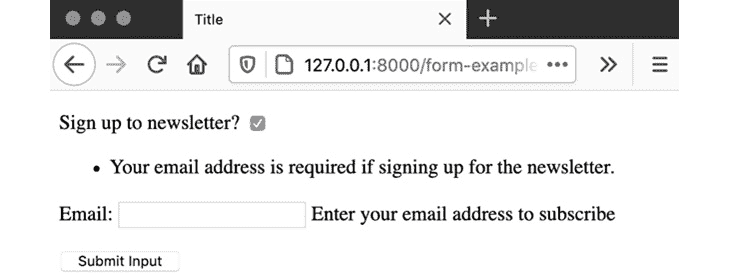

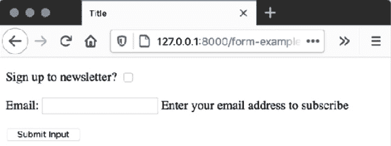


如果我们现在提交表单而不输入任何数据，将不会发生任何事情。两个字段都不是必需的，所以表单验证良好。

现在，我们可以将多字段验证添加到 `clean` 方法中。我们将检查 `signup` 复选框是否被勾选，然后检查 `email` 字段是否有值。内置的 Django 方法已经验证了电子邮件地址的有效性，所以我们只需检查是否存在值。然后我们将使用 `add_error` 方法为 `email` 字段设置错误。这是一个你之前没有见过的方法，但它非常简单；它接受两个参数——设置错误的字段名称和错误文本。

这是 `clean` 方法的代码：

```py
class NewsletterSignupForm(forms.Form):
  …
  def clean(self):
    cleaned_data = super().clean()
    if cleaned_data["signup"] and not cleaned_data.get("email"):
    self.add_error\
    ("email", \
     "Your email address is required if signing up for the newsletter.")
```

您的 `clean` 方法必须始终调用 `super().clean()` 方法来检索清理后的数据。当调用 `add_error` 添加错误到表单时，表单将不再验证（`is_valid` 方法返回 `False`）。

现在如果我们提交表单而不勾选复选框，仍然不会生成错误，但如果你勾选复选框而没有电子邮件地址，你将收到我们刚刚编写的代码错误：


你可能会注意到我们正在使用`get`方法从`cleaned_data`字典中检索电子邮件。这样做的原因是，如果表单中的`email`值无效，那么`email`键将不会存在于字典中。浏览器应该阻止用户提交包含无效电子邮件的表单，但用户可能正在使用不支持此客户端验证的较旧浏览器，因此为了安全起见，我们使用`get`方法。由于`signup`字段是`BooleanField`，并且不是必需的，它只有在使用自定义验证函数时才会无效。我们在这里没有使用，所以使用方括号表示法访问其值是安全的。

在进行我们的第一个练习之前，还有一个需要考虑的验证场景，那就是添加不特定于任何字段的错误。Django 将这些称为*非字段错误*。有许多场景，你可能想在多个字段相互依赖时使用这些错误。

以购物网站为例。你的订单表单可能包含两个数值字段，其总和不能超过某个值。如果总和超过了，任一字段的值可以减少以使总和低于最大值，因此错误不是特定于任一字段的。要添加非字段错误，请使用`add_error`方法，并将`None`作为第一个参数。

让我们看看如何实现这一点。在这个例子中，我们将有一个表单，用户可以指定要订购的特定数量的项目，对于项目 A 或项目 B。用户总共不能订购超过 100 个项目。字段将具有`max_value`为`100`和`min_value`为`0`，但需要在`clean`方法中编写自定义验证来处理总金额的验证：

```py
class OrderForm(forms.Form):
  item_a = forms.IntegerField(min_value=0, max_value=100)
  item_b = forms.IntegerField(min_value=0, max_value=100)\
  def clean(self):
    cleaned_data = super().clean()
    if cleaned_data.get("item_a", 0) + cleaned_data.get\
                                       ("item_b", 0) > 100:
      self.add_error\
      (None, \
       "The total number of items must be 100 or less.")
```

字段（`item_a`和`item_b`）以正常方式添加，并使用标准验证规则。你可以看到我们像以前一样使用了`clean`方法。此外，我们在该方法内部实现了最大项目逻辑。以下行是注册超过最大项目时记录非字段错误的：

```py
self.add_error(None, \
               "The total number of items must be 100 or less.")
```

再次强调，我们使用`get`方法访问`item_a`和`item_b`的值，默认值为`0`。这是以防用户使用较旧的浏览器（2011 年或更早）并能提交包含无效值的表单。

在浏览器中，字段级验证确保每个字段都输入了 0 到 100 之间的值，否则将阻止表单提交：


图 7.6：如果一个字段超过最大值，则无法提交表单

然而，如果我们输入两个总和超过 100 的值，我们可以看到 Django 如何显示非字段错误：


图 7.7：Django 非字段错误在表单开始处显示

Django 的非字段错误始终在表单的开始处显示，在其他字段或错误之前。在下一个练习中，我们将构建一个实现验证函数、字段清理方法和表单清理方法的表单。

## 练习 7.01：自定义清理和验证方法

在这个练习中，您将构建一个新的表单，允许用户为书籍或杂志创建订单。它必须满足以下验证标准：

+   用户可以订购最多 80 本杂志和/或 50 本书，但物品总数不得超过 100。

+   用户可以选择接收订单确认，如果他们这样做，则必须输入电子邮件地址。

+   如果用户没有选择接收订单确认，则不应输入电子邮件地址。

+   为了确保他们是我们的公司的一员，电子邮件地址必须是我们的公司域名的一部分（在我们的例子中，我们将只使用`example.com`）。

+   为了与其他虚构公司的电子邮件地址保持一致，地址应转换为小写。

这听起来像是一大堆规则，但如果我们逐一解决，使用 Django 就很简单了。我们将继续使用我们在第六章“表单”中开始的`form_project`应用程序。如果您还没有完成第六章“表单”，可以从[`packt.live/2LRCczP`](http://packt.live/2LRCczP)下载代码：

1.  在 PyCharm 中，打开`form_example`应用程序的`forms.py`文件。

    注意

    确保 Django 开发服务器没有运行，否则，在您更改此文件时，它可能会崩溃，导致 PyCharm 跳入调试器。

1.  由于我们的`ExampleForm`工作已完成，您可以将其从该文件中删除。

1.  创建一个新的类`OrderForm`，它从`forms.Form`继承：

    ```py
    class OrderForm(forms.Form):
    ```

1.  按照以下方式向类中添加四个字段：

    +   `magazine_count`，`IntegerField`，最小值为`0`，最大值为`80`

    +   `book_count`，`IntegerField`，最小值为`0`，最大值为`50`

    +   `send_confirmation`，`BooleanField`，不是必需的

    +   `email`，`EmailField`，也不是必需的

        类应该看起来像这样：

        ```py
        class OrderForm(forms.Form):
          magazine_count = forms.IntegerField\
                           (min_value=0, max_value=80)
          book_count = forms.IntegerField\
                       (min_value=0, max_value=50)
          send_confirmation = forms.BooleanField\
                              (required=False)
          email = forms.EmailField(required=False)
        ```

1.  添加一个验证函数来检查用户的电子邮件地址是否在正确的域名下。首先，需要导入`ValidationError`；在文件顶部添加此行：

    ```py
    from django.core.exceptions import ValidationError
    ```

    然后在`import`行之后（在`OrderForm`类实现之前）编写此函数：

    ```py
    def validate_email_domain(value):
      if value.split("@")[-1].lower()!= "example.com":\
          raise ValidationError\
          ("The email address must be on the domain example.com.")
    ```

    该函数将电子邮件地址在`@`符号处分割，然后检查其后的部分是否等于`example.com`。这个函数本身将验证非电子邮件地址。例如，字符串`not-valid@someotherdomain@example.com`不会在这个函数中引发`ValidationError`。在我们的情况下这是可以接受的，因为我们使用的是`EmailField`，其他标准字段验证器将检查电子邮件地址的有效性。

1.  将`validate_email_domain`函数作为验证器添加到`OrderForm`中的`email`字段。更新`EmailField`构造函数调用，添加一个`validators`参数，传递包含验证函数的列表：

    ```py
    class OrderForm(forms.Form):
      …
      email = forms.EmailField\
              (required=False, \
               validators=[validate_email_domain])
    ```

1.  在表单中添加一个`clean_email`方法，以确保电子邮件地址是小写的：

    ```py
    class OrderForm(forms.Form):
      # truncated for brevity
      def clean_email(self):
      return self.cleaned_data['email'].lower()
    ```

1.  现在，添加`clean`方法以执行所有跨字段验证。首先，我们将仅添加确保只有在请求订单确认时才输入电子邮件地址的逻辑：

    ```py
    class OrderForm(forms.Form):
      # truncated for brevity
    email field if Send confirmation is checked but no email address is added: 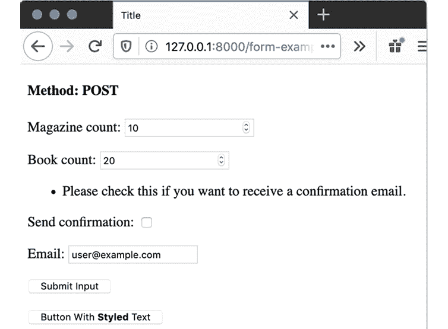Figure 7.8: Error if Send confirmation is checked but no email address is addedSimilarly, an error will be added to `email` if an email address is entered but `Send confirmation` is not checked: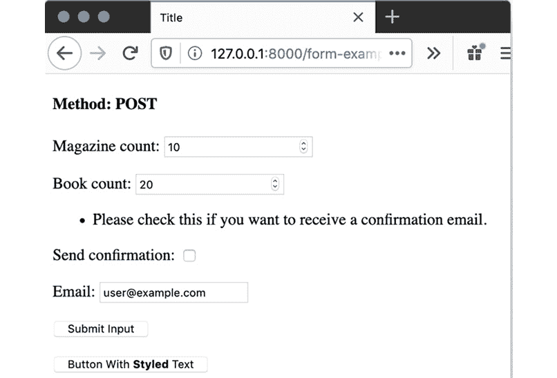Figure 7.9: Error because an email has been entered but the user has not chosen to receive confirmation
    ```

1.  在`clean`方法内部添加最终的检查。项目总数不应超过 100。如果`magazine_count`和`book_count`的总和大于 100，我们将添加一个非字段错误：

    ```py
    class OrderForm(forms.Form):
      …
      def clean(self):
        …
        None as the first argument to the add_error call.NoteRefer to [`packt.live/3nMP3R7`](http://packt.live/3nMP3R7) for the complete code.Save `forms.py`.
    ```

1.  打开`reviews`应用的`views.py`文件。我们将更改表单`import`，以便导入`OrderForm`而不是`ExampleForm`。考虑以下导入行：

    ```py
    from .forms import ExampleForm, SearchForm
    ```

    按照以下方式更改：

    ```py
    from .forms import OrderForm, SearchForm
    ```

1.  在`form_example`视图中，将使用`ExampleForm`的两行更改为使用`OrderForm`。考虑以下代码行：

    ```py
    form = ExampleForm(request.POST)
    ```

    按照以下方式更改：

    ```py
    form = OrderForm(request.POST)
    ```

    类似地，考虑以下代码行：

    ```py
    form = ExampleForm()
    ```

    按照以下方式更改：

    ```py
    form = OrderForm()
    ```

    函数的其余部分可以保持不变。

    我们不需要更改模板。启动 Django 开发服务器，并在浏览器中导航到`http://127.0.0.1:8000/form-example/`。你应该会看到像*图 7.10*中渲染的表单：

    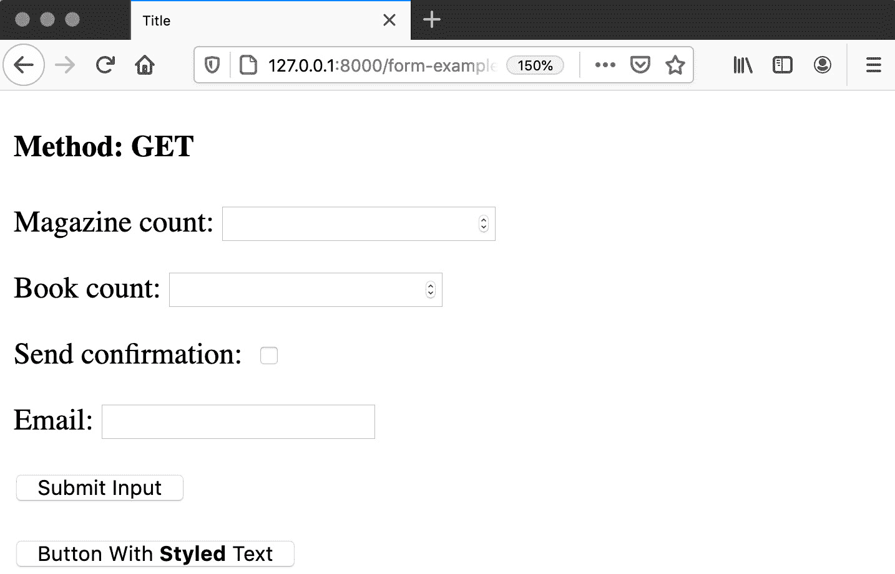

    图 7.10：浏览器中的 OrderForm

1.  尝试提交一个`Magazine count`为`80`和`Book count`为`50`的表单。浏览器会允许这样做，但由于它们的总和超过 100，表单中的`clean`方法会触发错误并在页面上显示：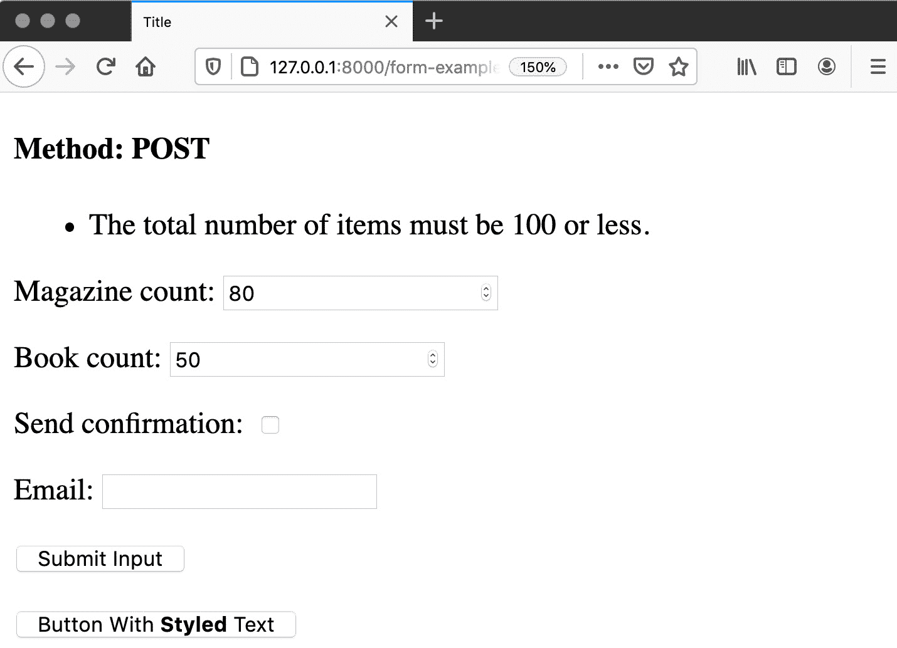

    图 7.11：当允许的最大项目数量超出时在表单上显示的非字段错误

1.  尝试提交一个带有`Send confirmation`勾选但`Email`字段为空的表单。然后填写`Email`文本框，但取消勾选`Send confirmation`。任何一种组合都会给出一个错误，指出两者都必须存在。错误将根据缺少的字段而有所不同：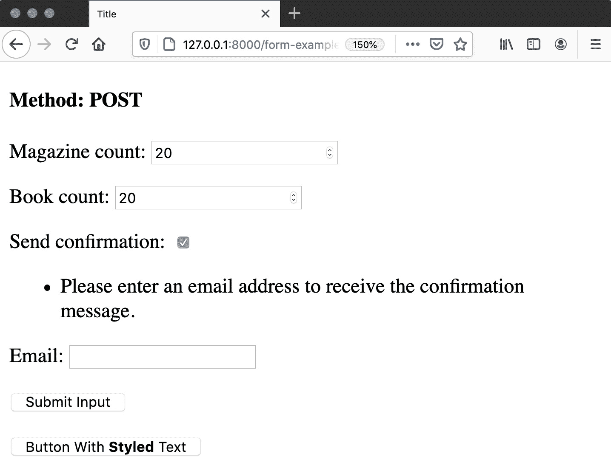

    图 7.12：如果没有电子邮件地址时的错误信息

1.  现在尝试提交带有`Send confirmation`勾选和`example.com`域电子邮件地址的表单。你应该会收到一条消息，指出你的电子邮件地址必须具有`example.com`域。你还应该收到一条消息，指出`email`必须设置 – 因为电子邮件最终没有进入`cleaned_data`字典，因为它不是有效的：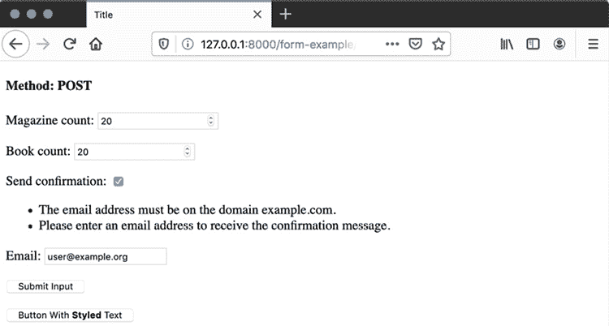

    图 7.13：当电子邮件域不是 example.com 时显示的错误信息

1.  最后，输入有效的`杂志数量`和`书籍数量`（例如`20`和`20`）。勾选`发送确认`，并将`UserName@Example.Com`作为电子邮件输入（确保匹配字母大小写，包括混合的大小写字符）：![图 7.14：提交有效值后的表单

    ![img/B15509_07_14.jpg]

    图 7.14：提交有效值后的表单

1.  切换到 PyCharm 并查看调试控制台。你会看到，当我们的调试代码打印时，电子邮件已经被转换为小写：![图 7.15：电子邮件字段已转换为小写，以及其他字段

    ![img/B15509_07_15.jpg]

图 7.15：电子邮件字段已转换为小写，以及其他字段

这是我们的`clean_email`方法在起作用——即使我们输入了大小写混合的数据，它已经被转换为全小写。

在这个练习中，我们创建了一个新的`OrderForm`，该表单实现了表单和字段清理方法。我们使用自定义验证器来确保`Email`字段符合我们的特定验证规则——只允许特定的域名。我们使用自定义字段清理方法（`clean_email`）将电子邮件地址转换为小写。然后我们实现了`clean`方法来验证相互依赖的表单。在这个方法中，我们添加了字段和非字段错误。在下一节中，我们将介绍如何向表单添加占位符和初始值。

## 占位符和初始值

我们第一个手动构建的表单有两个我们当前的 Django 表单还没有的特性——占位符和初始值。添加占位符很简单；它们只是作为表单字段的`widget`构造函数的属性添加。这与我们在之前的示例中设置`DateField`类型的方法类似。

这里有一个例子：

```py
class ExampleForm(forms.Form):
  text_field = forms.CharField\
               (widget=forms.TextInput\
               (attrs={"placeholder": "Text Placeholder"}))
  password_field = forms.CharField(\
    widget=forms.PasswordInput\
           (attrs={"placeholder": "Password Placeholder"}))
  email_field = forms.EmailField\
                (widget=forms.EmailInput\
                 (attrs={"placeholder": "Email Placeholder"}))
  text_area = forms.CharField\
              (widget=forms.Textarea\
              (attrs={"placeholder": "Text Area Placeholder"}))
```

这就是浏览器中渲染的前一个表单的样子：

![图 7.16：带有占位符的 Django 表单

![img/B15509_07_16.jpg]

图 7.16：带有占位符的 Django 表单

当然，如果我们为每个字段手动设置`Widget`，我们需要知道要使用哪个`Widget`类。支持占位符的类有`TextInput`、`NumberInput`、`EmailInput`、`URLInput`、`PasswordInput`和`Textarea`。

当我们检查`Form`类本身时，我们将探讨设置字段初始值的两种方法之一。我们可以通过在`Field`构造函数上使用`initial`参数来实现，如下所示：

```py
text_field = forms.CharField(initial="Initial Value", …)
```

另一种方法是，在视图中实例化表单时传入一个包含数据的字典。键是字段名称。该字典应该有零个或多个项（即空字典是有效的）。任何额外的键都将被忽略。这个字典应该作为`initial`参数在我们的视图中提供如下：

```py
initial = {"text_field": "Text Value", \
           "email_field": "user@example.com"}
form = ExampleForm(initial=initial)
```

或者对于`POST`请求，像往常一样传入`request.POST`作为第一个参数：

```py
initial = {"text_field": "Text Value", \
           "email_field": "user@example.com"}
form = ExampleForm(request.POST, initial=initial)
```

`request.POST` 中的值将覆盖 `initial` 中的值。这意味着即使我们对一个必填字段有一个初始值，如果提交时留空，则它将不会验证。该字段不会回退到 `initial` 中的值。

你决定在 `Form` 类本身或视图中设置初始值，这取决于你的用例。如果你有一个在多个视图中使用但通常具有相同值的表单，那么在表单中设置 `initial` 值会更好。否则，在视图中使用 `setting` 可能会更加灵活。

在下一个练习中，我们将向上一个练习中的 `OrderForm` 类添加占位符和初始值。

## 练习 7.02：占位符和初始值

在这个练习中，你将通过添加占位符文本来增强 `OrderForm` 类。你将模拟向表单传递一个初始电子邮件地址。它将是一个硬编码的地址，但一旦用户可以登录，它可能是与他们的账户关联的电子邮件地址——你将在 *第九章*、*会话和身份验证* 中学习关于会话和身份验证的内容：

1.  在 PyCharm 中，打开 `reviews` 应用程序的 `forms.py` 文件。你将在 `OrderForm` 上的 `magazine_count`、`book_count` 和 `email` 字段中添加占位符，这意味着还需要设置 `widget`。

    在 `magazine_count` 字段中，向 `attrs` 字典添加一个带有 `placeholder` 的 `NumberInput` `widget`。`placeholder` 应设置为 *杂志数量*。请编写以下代码：

    ```py
    magazine_count = forms.IntegerField\
                     (min_value=0, max_value=80,\
                      widget=forms.NumberInput\
                      (attrs={"placeholder": "Number of Magazines"}))
    ```

1.  以相同的方式为 `book_count` 字段添加占位符。占位符文本应为 `书籍数量`：

    ```py
    book_count = forms.IntegerField\
                 (min_value=0, max_value=50,\
                  widget=forms.NumberInput\
                  (attrs={"placeholder": "Number of Books"}))
    ```

1.  对 `OrderForm` 的最终修改是向电子邮件字段添加占位符。这次小部件是 `EmailInput`。占位符文本应为 `您的公司电子邮件地址`：

    ```py
    email = forms.EmailField\
            (required=False, validators=[validate_email_domain],\
             widget=forms.EmailInput\
             (attrs={"placeholder": "Your company email address"}))
    ```

    注意，`clean_email` 和 `clean` 方法应保持与 *练习 7.01，自定义清理和验证方法* 中相同。保存文件。

1.  打开 `reviews` 应用程序的 `views.py` 文件。在 `form_example` 视图函数中，创建一个新的字典变量 `initial`，其中有一个键 `email`，如下所示：

    ```py
    initial = {"email": "user@example.com"}
    ```

1.  在你实例化 `OrderForm` 的两个地方，也使用 `initial` 关键字参数传入 `initial` 变量。第一个实例如下：

    ```py
    form = OrderForm(request.POST, initial=initial)
    ```

    第二个实例如下：

    ```py
    form = OrderForm(initial=initial)
    ```

    `views.py` 的完整代码可以在 [`packt.live/3szaPM6`](http://packt.live/3szaPM6) 找到。

    保存 `views.py` 文件。

1.  如果 Django 开发服务器尚未运行，请启动它。在浏览器中浏览到 `http://127.0.0.1:8000/form-example/`。你应该会看到你的表单现在有了占位符和设置的初始值：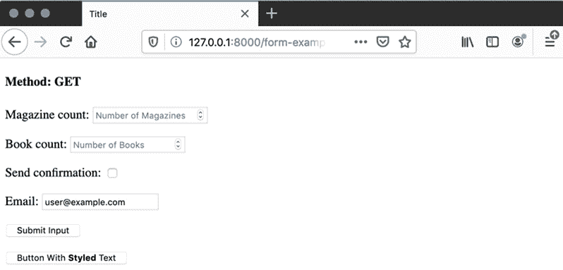

图 7.17：带有初始值和占位符的订单表单

在这个练习中，我们在表单字段中添加了占位符。这是通过在表单类上定义`form`字段时设置`form`小部件，并在`attrs`字典中设置一个`*placeholder*`值来完成的。我们还使用字典设置表单的初始值，并通过`initial`关键字参数将其传递给`form`实例。

在下一节中，我们将讨论如何使用表单中的数据与 Django 模型一起工作，以及`ModelForm`如何使这变得更加容易。

## 创建或编辑 Django 模型

你已经看到了如何定义一个表单，在*第二章*，*模型和迁移*中，你学习了如何创建 Django 模型实例。通过结合使用这些功能，你可以构建一个显示表单并保存模型实例到数据库的视图。这为你提供了一个简单的方法来保存数据，而无需编写大量的模板代码或创建自定义表单。在 Bookr 中，我们将使用这种方法来允许用户添加评论，而无需访问 Django 管理站点。不使用`ModelForm`，我们可以这样做：

+   我们可以基于现有的模型创建一个表单，例如`Publisher`。表单将被称为`PublisherForm`。

+   我们可以手动在`PublisherForm`上定义字段，使用与`Publisher`模型上定义的相同规则，如下所示：

    ```py
    class PublisherForm(forms.Form):
      name = forms.CharField(max_length=50)
      website = forms.URLField()
      …
    ```

+   在视图中，`initial`值将从数据库查询到的模型中检索，然后通过`initial`参数传递给表单。如果我们正在创建一个新的实例，`initial`值将是空的——就像这样：

    ```py
    if create:
      initial = {}
    else:
      publisher = Publisher.objects.get(pk=pk)
      initial = {"name": publisher.name, \
                 "website": publisher.website, …}
    form = PublisherForm(initial=initial)
    ```

+   然后，在视图的`POST`流程中，我们可以根据`cleaned_data`创建或更新模型：

    ```py
    form = PublisherForm(request.POST, initial=initial)
    if create:
      publisher = Publisher()
    else:
      publisher = Publisher.objects.get(pk=pk)
    publisher.name = form.cleaned_data['name']
    publisher.website = forms.cleaned_data['website']
    …
    publisher.save()
    ```

这需要做很多工作，我们必须考虑我们有多少重复的逻辑。例如，我们在`name`表单字段中定义了名称的长度。如果我们在这里犯了一个错误，我们可能会允许字段中的名称比模型允许的更长。我们还要记住设置`initial`字典中的所有字段，以及使用表单的`cleaned_data`设置新或更新模型的值。在这里有很多出错的机会，以及记住如果模型发生变化，为每个这些步骤添加或删除字段设置数据。所有这些代码都必须为每个你工作的 Django 模型重复，这加剧了重复问题。

## ModelForm 类

幸运的是，Django 提供了一种更简单的方法来从表单构建 `Model` 实例，使用 `ModelForm` 类。`ModelForm` 是一个从特定模型自动构建的表单。它将继承模型的验证规则（例如，字段是否必需或 `CharField` 实例的最大长度等）。它提供了一个额外的 `__init__` 参数（称为 `instance`），用于自动从现有模型中填充初始值。它还添加了一个 `save` 方法，用于自动将表单数据持久化到数据库。要设置 `ModelForm`，只需指定其模型和应使用的字段：这是在 `form` 类的 `class Meta` 属性上完成的。让我们看看如何从 `Publisher` 构建表单。

在包含表单的文件中（例如，我们一直在工作的 `forms.py` 文件），唯一的改变是模型必须被导入：

```py
from .models import Publisher
```

然后，可以定义 `Form` 类。该类需要一个 `class Meta` 属性，该属性反过来必须定义一个 `model` 属性以及 `fields` 或 `excludes` 属性：

```py
class PublisherForm(forms.ModelForm):
  class Meta:
    model = Publisher
    fields = ("name", "website", "email")
```

`fields` 是一个包含在表单中要包含的字段的列表或元组。当手动设置字段列表时，如果你向模型中添加了额外的字段，你也必须在这里添加它们的名称，以便它们在表单中显示。

你也可以使用特殊值 `__all__` 来代替列表或元组，以自动包含所有字段，如下所示：

```py
class PublisherForm(forms.ModelForm):
  class Meta:
    model = Publisher
    fields = "__all__"
```

如果 `model` 字段的 `editable` 属性设置为 `False`，则它将不会自动包含。

相反，`exclude` 属性将字段设置为不在表单中显示。添加到模型中的任何字段都会自动添加到表单中。我们可以使用 `exclude` 和任何空元组来定义前面的表单，因为我们想要显示所有字段。代码如下：

```py
class PublisherForm(forms.ModelForm):
  class Meta:
    model = Publisher
    exclude = ()
```

这节省了一些工作，因为你不需要在模型和 `fields` 列表中添加字段，然而，这并不安全，因为你可能会自动向最终用户暴露你不希望他们看到的字段。例如，如果你有一个 `User` 模型和一个 `UserForm`，你可能会在 `User` 模型中添加一个 `is_admin` 字段，以给管理员用户额外的权限。如果这个字段没有 `exclude` 属性，它就会显示给用户。然后，用户就可以将自己变成管理员，这可能是你不太希望发生的事情。

无论我们决定使用这三种选择要显示的表单的方法中的哪一种，在我们的情况下，它们在浏览器中都会显示相同的内容。这是因为我们选择显示 *所有* 字段。当在浏览器中渲染时，它们看起来都像这样：


图 7.18：PublisherForm

注意，`Publisher` 模型的 `help_text` 也会自动渲染。

在视图中使用与我们所看到的其他表单类似。此外，如前所述，还有一个额外的参数可以提供，称为`instance`。它可以设置为`None`，这将渲染一个空表单。

假设在你的视图函数中，你有一些方法来确定你是否正在创建或编辑模型实例（我们将在稍后讨论如何做到这一点），这将确定一个名为`is_create`的变量（如果创建实例则为`True`，如果编辑现有实例则为`False`）。然后，你的创建表单的视图函数可以写成这样：

```py
if is_create:
  instance = None
else:
  instance = get_object_or_404(Publisher, pk=pk)
if request.method == "POST":
  form = PublisherForm(request.POST, instance=instance)
  if form.is_valid():
    # we'll cover this branch soon
else:
  form = PublisherForm(instance=instance)
```

如您所见，在任一分支中，实例都传递给了`PublisherForm`构造函数，尽管在创建模式中它是`None`。

如果表单有效，然后我们可以保存`model`实例。这是通过在表单上调用`save`方法来完成的。这将自动创建实例，或者简单地保存对旧实例的更改：

```py
if form.is_valid():
  form.save()
  return redirect(success_url)
```

`save`方法返回已保存的`model`实例。它接受一个可选参数`commit`，它确定是否将更改写入数据库。你可以传递`False`，这允许你在手动保存更改之前对实例进行更多更改。这可能需要设置未包含在表单中的属性。正如我们提到的，也许你会在`User`实例上将`is_admin`标志设置为`False`：

```py
if form.is_valid():
  new_user = form.save(False)
  new_user.is_admin = False
  new_user.save()
  return redirect(success_url)
```

在本章末尾的*活动 7.02*，*创建 UI 回顾*中，我们将使用这个功能。

如果你的模型使用`ManyToMany`字段，并且你也调用了`form.save(False)`，你应该也调用`form.save_m2m()`来保存任何已设置的许多对多关系。如果你使用带有`commit`设置为`True`（即默认值）的表单`save`方法，则不需要调用此方法。

可以通过修改其`Meta`属性来自定义模型表单。可以设置`widgets`属性。它可以包含一个以字段名称为键的字典，其中包含小部件类或实例作为值。例如，这是如何设置`PublisherForm`以具有占位符的：

```py
class PublisherForm(forms.ModelForm):
  class Meta:
    model = Publisher
    fields = "__all__"
    widgets = {"name": forms.TextInput\
               (attrs={"placeholder": "The publisher's name."})}
```

这些值的行为与在字段定义中设置`kwarg`小部件相同；它们可以是类或实例。例如，要显示`CharField`作为密码输入，可以使用`PasswordInput`类；它不需要实例化：

```py
widgets = {"password": forms.PasswordInput}
```

模型表单也可以通过添加与添加到普通表单相同方式添加的额外字段来增强。例如，假设我们想在保存`Publisher`对象后发送通知电子邮件的选项。我们可以在`PublisherForm`中添加一个`email_on_save`字段，如下所示：

```py
class PublisherForm(forms.ModelForm):
  email_on_save = forms.BooleanField\
                  (required=False, \
                   help_text="Send notification email on save")
  class Meta:
    model = Publisher
    fields = "__all__"
```

当渲染时，表单看起来像这样：

![图 7.19：带有额外字段的 PublisherForm]

![img/B15509_07_19.jpg]

图 7.19：带有额外字段的 PublisherForm

额外的字段放置在 `Model` 字段之后。额外的字段不会自动处理——它们在模型上不存在，所以 Django 不会尝试在 `model` 实例上保存它们。相反，你应该通过检查表单的 `cleaned_data` 值来处理它们的值的保存，就像使用标准表单一样（在你的视图函数内部）：

```py
if form.is_valid():
  if form.cleaned_data.get("email_on_save"):
    send_email()
      # assume this function is defined elsewhere
  # save the instance regardless of sending the email or not
  form.save()  
  return redirect(success_url)
```

在下一个练习中，你将编写一个新的视图函数来创建或编辑一个 `Publisher`。

## 练习 7.03：创建和编辑一个出版商

在这个练习中，我们将回到 Bookr。我们想要添加创建和编辑 `Publisher` 而不使用 Django 管理员的能力。为此，我们将为 `Publisher` 模型添加一个 `ModelForm`。它将用于一个新的视图函数。视图函数将接受一个可选参数 `pk`，它将是正在编辑的 `Publisher` 的 ID 或 `None` 以创建一个新的 `Publisher`。我们将添加两个新的 URL 映射来简化这个过程。当完成时，我们将能够通过它们的 ID 查看 和更新任何出版商。例如，`Publisher 1` 的信息将在 URL 路径 `/publishers/1` 上可查看/可编辑：

1.  在 PyCharm 中打开 `reviews` 应用的 `forms.py` 文件。在 `forms` 导入之后，也导入 `Publisher` 模型：

    ```py
    from .models import Publisher
    ```

1.  创建一个继承自 `forms.ModelForm` 的 `PublisherForm` 类：

    ```py
    class PublisherForm(forms.ModelForm):
    ```

1.  在 `PublisherForm` 上定义 `Meta` 属性。`Meta` 所需的属性是模型 (`Publisher`) 和字段 (`"__all__"`):

    ```py
    class PublisherForm(forms.ModelForm):
      class Meta:
        model = Publisher
        fields = "__all__"
    ```

    保存 `forms.py`。

    注意

    完整的文件可以在 [`packt.live/3qh9bww`](http://packt.live/3qh9bww) 找到。

1.  打开 `reviews` 应用程序的 `views.py` 文件。在文件顶部，导入 `PublisherForm`：

    ```py
    from .forms import PublisherForm, SearchForm
    ```

1.  确保如果你还没有导入，你已经从 `django.shortcuts` 中导入了 `get_object_or_404` 和 `redirect` 函数：

    ```py
    from django.shortcuts import render, get_object_or_404, redirect
    ```

1.  确保如果你还没有导入 `Publisher` 模型，你已经导入了它。你可能已经导入了这个和其他模型：

    ```py
    from .models import Book, Contributor, Publisher
    ```

1.  你需要的最后一个导入是 `messages` 模块。这将允许我们注册一个消息，让用户知道 `Publisher` 对象已被编辑或创建：

    ```py
    from django.contrib import messages
    ```

    再次提醒，如果你还没有导入，请添加此导入。

1.  创建一个新的视图函数，命名为 `publisher_edit`。它接受两个参数，`request` 和 `pk`（要编辑的 `Publisher` 对象的 ID）。这是可选的，如果它是 `None`，则将创建一个新的 `Publisher` 对象：

    ```py
    def publisher_edit(request, pk=None):
    ```

1.  在视图函数内部，如果 `pk` 不是 `None`，我们需要尝试加载现有的 `Publisher` 实例。否则，`publisher` 的值应该是 `None`：

    ```py
    def publisher_edit(request, pk=None):
      if pk is not None:
        publisher = get_object_or_404(Publisher, pk=pk)
      else:
        publisher = None
    ```

1.  在获取到 `Publisher` 实例或 `None` 之后，完成 `POST` 请求的分支。以与本章前面看到的方式实例化表单，但现在确保它接受 `instance` 作为关键字参数。然后，如果表单有效，使用 `form.save()` 方法保存它。该方法将返回更新的 `Publisher` 实例，该实例存储在 `updated_publisher` 变量中。然后，根据 `Publisher` 实例是创建还是更新，注册不同的成功消息。最后，由于此时 `updated_publisher` 总是具有 ID，重定向回此 `publisher_edit` 视图：

    ```py
    def publisher_edit(request, pk=None):
      …
      if request.method == "POST":
        form = PublisherForm(request.POST, instance=publisher)
        if form.is_valid():
        updated_publisher = form.save()
          if publisher is None:
            messages.success\
            (request, "Publisher \"{}\" was created."\
                      .format(updated_publisher))
          else:
            messages.success\
            (request, "Publisher \"{}\" was updated."\
                      .format(updated_publisher))\
          return redirect("publisher_edit", updated_publisher.pk)
    ```

    如果表单无效，执行将跳过，只返回带有无效表单的 `render` 函数调用（这将在第 12 步中实现）。重定向使用命名 URL 映射，该映射将在练习的后续部分添加。

1.  接下来，填写代码中的非 `POST` 分支。在这种情况下，只需使用 `instance` 实例化表单：

    ```py
    def publisher_edit(request, pk=None):
      …
      if request.method == "POST":
        …
      else:
        form = PublisherForm(instance=publisher)
    ```

1.  最后，你可以重用之前练习中使用的 `form-example.html` 文件。使用 `render` 函数渲染它，传入 HTTP 方法以及 `form` 作为上下文：

    ```py
    def publisher_edit(request, pk=None):
      …
      return render(request, "form-example.html", \
                    {"method": request.method, "form": form}) 
    ```

    保存此文件。你可以参考它，请见 [`packt.live/3nI62En`](http://packt.live/3nI62En)。

1.  在 `reviews` 目录中打开 `urls.py` 文件。添加两个新的 URL 映射；它们都将导向 `publisher_edit` 视图。一个将捕获我们想要编辑的 `Publisher` 的 ID，并将其作为 `pk` 参数传递给视图。另一个将使用单词 `new`，并且不会传递 `pk`，这表示我们想要创建一个新的 `Publisher`。

    将 `'publishers/<int:pk>/'` 映射添加到 `urlpatterns` 变量中，映射到 `reviews.views.publisher_edit` 视图，名称为 `'publisher_edit'`。

    还需添加 `'publishers/new/'` 映射到 `reviews.views.publisher_edit` 视图，名称为 `'publisher_create'`：

    ```py
    urlpatterns = [
      …
      path('publishers/<int:pk>/',views.publisher_edit, \
            name='publisher_edit'),\
      path('publishers/new/',views.publisher_edit, \
            name='publisher_create')]
    ```

    由于第二个映射没有捕获任何内容，传递给 `publisher_detail` 视图函数的 `pk` 是 `None`。

    保存 `urls.py` 文件。参考的完成版本请见 [`packt.live/39CpUnw`](http://packt.live/39CpUnw)。

1.  在 `reviews` 应用程序的 `templates` 目录中创建一个 `form-example.html` 文件。由于这是一个独立的模板（它不扩展任何其他模板），我们需要在其中渲染消息。在 `<body>` 标签打开后添加此代码，遍历所有消息并显示它们：

    ```py
    
    <p><em>{{ message.level_tag|title }}:</em> {{ message }}</p>
    
    ```

    这将遍历我们添加的消息，并显示标签（在我们的例子中是 `Success`）然后是消息。

1.  然后，添加正常的表单渲染和提交代码：

    ```py
    <form method="post">
      
      {{ form.as_p }}
      <p>
        <input type="submit" value="Submit">
      </p>
    </form>
    ```

    保存并关闭此文件。

    你可以参考此文件的完整版本，请见 [`packt.live/38I8XZx`](http://packt.live/38I8XZx)。

1.  启动 Django 开发服务器，然后导航到 `http://127.0.0.1:8000/publishers/new/`。你应该看到一个空白的 `PublisherForm` 正在被显示：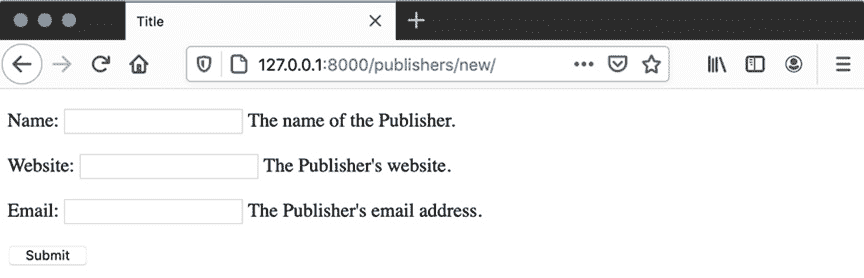

    

    图 7.20：空白出版者表单

1.  表单继承了模型的验证规则，因此你不能提交包含过多字符的`Name`或包含无效的`Website`或`Email`的表单。输入一些有效信息，然后提交表单。提交后，你应该看到成功消息，表单将填充保存到数据库中的信息：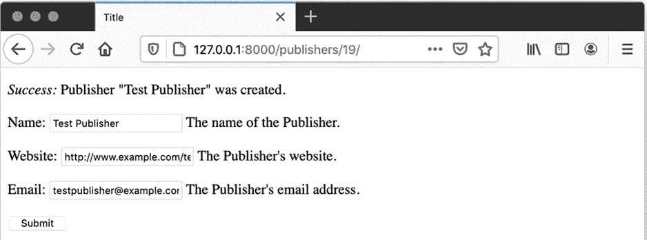

图 7.21：提交后的表单

注意，URL 也已更新，现在包括创建的出版商的 ID。在这种情况下，它是`http://127.0.0.1:8000/publishers/19/`，但你的设置中的 ID 将取决于你的数据库中已经有多少个`Publisher`实例。

注意，如果你刷新页面，你将不会收到确认是否重新发送表单数据的消息。这是因为我们在保存后进行了重定向，所以你可以多次刷新这个页面，而不会创建新的`Publisher`实例。如果你没有重定向，那么每次刷新页面都会创建一个新的`Publisher`实例。

如果你数据库中有其他`Publisher`实例，你可以更改 URL 中的 ID 来编辑其他实例。由于这个实例的 ID 是`3`，我们可以假设`Publisher` `1`和`Publisher` `2`已经存在，可以用它们的 ID 来替换以查看现有数据。以下是现有`Publisher 1`的视图（在`http://127.0.0.1:8000/publishers/1/`）——你的信息可能不同：

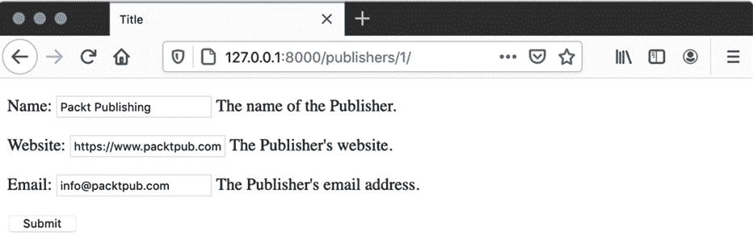

图 7.22：现有出版商 1 信息

尝试更改现有的`Publisher`实例。注意，在你保存后，消息是不同的——它告诉用户`Publisher`实例已被*更新*而不是*创建*：

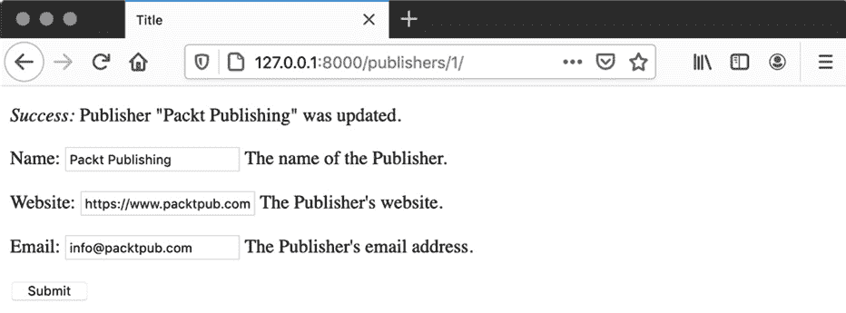

图 7.23：更新而不是创建后的出版商

在这个练习中，我们从一个模型（`PublisherForm`是从`Publisher`创建的）实现了`ModelForm`，并看到了 Django 如何自动生成带有正确验证规则的表单字段。然后，我们使用表单的内置`save`方法将更改保存到`Publisher`实例（或自动创建它）中的`publisher_edit`视图。我们将两个 URL 映射到该视图。第一个 URL 用于编辑现有的`Publisher`，将`pk`传递给视图。另一个没有将`pk`传递给视图，表示应该创建`Publisher`实例。最后，我们使用浏览器来尝试创建一个新的`Publisher`实例，然后编辑现有的一个。

## 活动 7.01：样式化和集成出版商表单

在*练习 7.03*，*创建和编辑出版商*中，你添加了`PublisherForm`来创建和编辑`Publisher`实例。你是通过一个不扩展任何其他模板的独立模板构建的，因此它缺少全局样式。在这个活动中，你将构建一个通用的表单详情页面，该页面将显示 Django 表单，类似于`form-example.html`，但扩展自基础模板。该模板将接受一个变量以显示正在编辑的模型类型。你还将更新主要的`base.html`模板以使用 Bootstrap 样式渲染 Django 消息。

这些步骤将帮助你完成这个活动：

1.  首先编辑`base.html`项目。将`content`块包裹在一个带有一些间距的容器`div`中，以获得更美观的布局。使用`class="container-fluid"`的`<div>`元素包围现有的`content`块。

1.  在你刚刚创建的`<div>`之后但在`content`块之前渲染`messages`中的每个`message`（类似于*练习 7.03*，*创建和编辑出版商*中的*步骤 14*）。你应该使用 Bootstrap 框架类 - 这个片段将帮助你：

    ```py
    <div class="alert alert-danger{    {message.level_tag }}"
        role="alert">
      {{ message }}
    </div>
    ```

    大部分情况下，Bootstrap 类和 Django 的`message`标签有相应的名称（例如，`success`和`alert-success`）。例外的是 Django 的`error`标签，对应的 Bootstrap 类是`alert-danger`。有关 Bootstrap 警报的更多信息，请参阅[`getbootstrap.com/docs/4.0/components/alerts/`](https://getbootstrap.com/docs/4.0/components/alerts/)。这就是为什么你需要在这个片段中使用`if`模板标签的原因。

1.  在`reviews`应用的命名空间`templates`目录中创建一个新的模板`instance-form.html`。

1.  `instance-form.html`应该从`reviews`应用的`base.html`扩展。

1.  传递给此模板的上下文将包含一个名为`instance`的变量。这将是要编辑的`Publisher`实例，或者如果我们正在创建新的`Publisher`实例，则为`None`。上下文还将包含一个`model_type`变量，它是一个表示模型类型的字符串（在这种情况下，`Publisher`）。使用这两个变量来填充`title`块模板标签：

    如果实例是`None`，标题应该是`新出版商`。

    否则，标题应该是`编辑出版商 <出版商名称>`。

1.  `instance-form.html`应包含一个`content` `block`模板标签以覆盖`base.html`的`content`块。

1.  在`content`块内添加一个`<h2>`元素，并使用与标题相同的逻辑进行填充。为了更好的样式，将出版商名称包裹在一个`<em>`元素中。

1.  在模板中添加一个`method`为`post`的`<form>`元素。由于我们正在将数据发送回相同的 URL，因此不需要指定`action`。

1.  在`<form>`体中包含 CSRF 令牌模板标签。

1.  使用`as_p`方法在`<form>`内渲染 Django 表单（其上下文变量将是`form`)。

1.  在表单中添加一个`submit` `<button>`。其文本应取决于你是在编辑还是创建。对于编辑使用文本`保存`，对于创建使用`创建`。你可以在这里使用 Bootstrap 类来设置按钮样式。它应该有属性`class="btn btn-primary"`。

1.  在`reviews/views.py`中，`publisher_edit`视图不需要很多更改。将`render`调用更新为渲染`instance-form.html`而不是`form-example.html`。

1.  更新传递给`render`调用的上下文字典。它应包括`Publisher`实例（已定义的`publisher`变量）和`model_type`字符串。上下文字典已经包括`form`（一个`PublisherForm`实例）。你可以移除`method`键。

1.  由于我们完成了`form-example.html`模板，它可以被删除。

    当你完成时，`Publisher`创建页面（在`http://127.0.0.1:8000/publishers/new/`）应该看起来像*图 7.24*：

    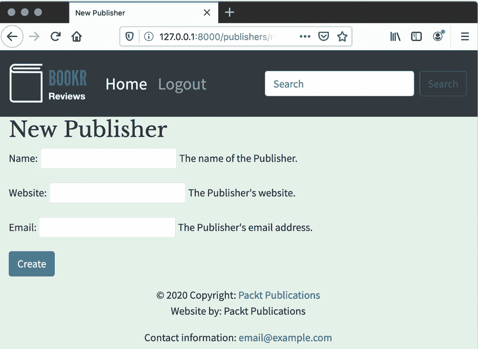

图 7.24：出版商创建页面

当编辑一个`Publisher`（例如，在 URL `http://127.0.0.1:8000/publishers/1/`），你的页面应该看起来像*图 7.25*：

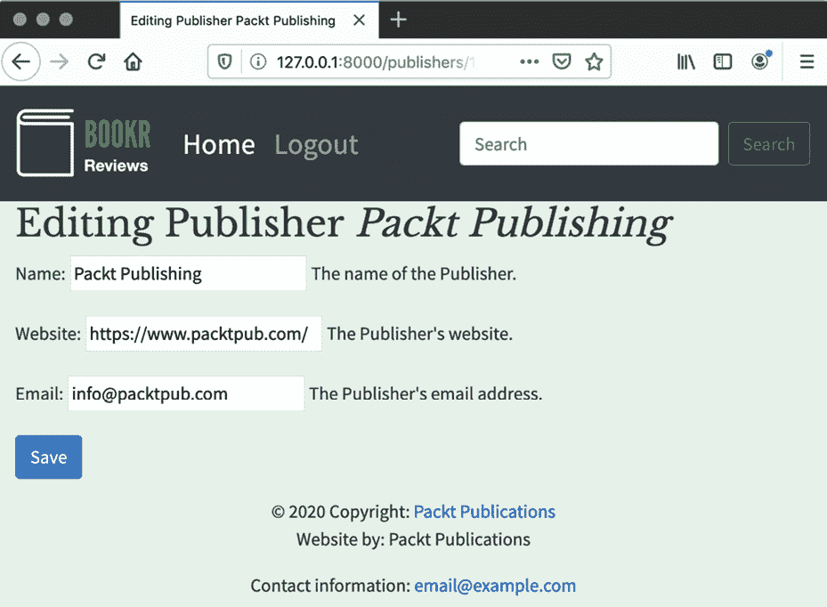

图 7.25：编辑出版商页面

保存`Publisher`实例后，无论是创建还是编辑，你应该在页面顶部看到成功消息（*图 7.26*）：

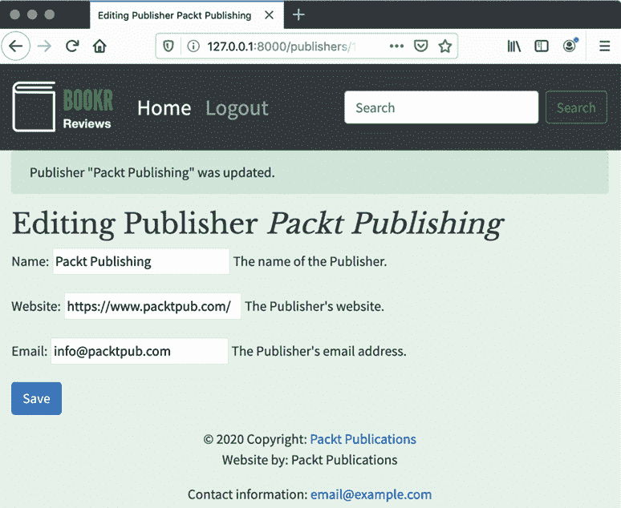

图 7.26：Bootstrap 警告框显示的成功消息

注意

此活动的解决方案可以在[`packt.live/2Nh1NTJ`](http://packt.live/2Nh1NTJ)找到。

## 活动七.02：评论创建 UI

*活动 7.01*，*样式化和集成出版商表单*，相当广泛；然而，通过完成它，你已经创建了一个基础，使得添加其他*编辑*和*创建*视图变得更容易。在这个活动中，当你构建创建和编辑评论的表单时，你将亲身体验这一点。因为`instance-form.html`模板是通用的，所以你可以在其他视图中重用它。

在这个活动中，你将创建一个评论`ModelForm`，然后添加一个`review_edit`视图来创建或编辑`Review`实例。你可以从*活动 7.01*，*样式化和集成出版商表单*中重用`instance-form.html`，并传入不同的上下文变量以使其与`Review`模型一起工作。当你处理评论时，你将在书籍的上下文中操作，也就是说，`review_edit`视图必须接受一个书籍的`pk`作为参数。你将单独获取`Book`实例并将其分配给你创建的`Review`实例。

这些步骤将帮助你完成此活动：

1.  在`forms.py`中添加一个`ReviewForm`子类`ModelForm`；其模型应该是`Review`（确保你`导入`了`Review`模型）。

    `ReviewForm`应该排除`date_edited`和`book`字段，因为用户不应该在表单中设置这些。数据库允许任何评分，但我们可以用需要最小值为*0*和最大值为*5*的`IntegerField`覆盖`rating`字段。

1.  创建一个新的视图`review_edit`。它在`request`之后接受两个参数：必需的`book_pk`，可选的`review_pk`（默认为`None`）。使用`get_object_or_404`快捷方式（对每种类型调用一次）获取`Book`实例和`Review`实例。在获取评论时，确保评论属于该书籍。如果`review_pk`是`None`，那么`Review`实例也应该是`None`。

1.  如果`request`方法为`POST`，则使用`request.POST`和评论实例实例化一个`ReviewForm`。确保你`导入`了`ReviewForm`。

    如果表单有效，保存表单但将`commit`参数设置为`save`为`False`。然后，将返回的`Review`实例上的`book`属性设置为在*步骤 2*中获取的书籍。

1.  如果正在更新`Review`实例而不是创建它，那么你还应该将`date_edited`属性设置为当前日期和时间。使用`from` `django.utils.timezone.now()`函数。然后，保存`Review`实例。

1.  通过注册成功消息并将重定向回`book_detail`视图来完成有效的表单分支。由于`Review`模型实际上不包含有意义的文本描述，所以使用书籍标题作为消息。例如，`Review for "<book title>" created`。

1.  如果`request`方法不是`POST`，实例化一个`ReviewForm`并仅传递`Review`实例。

1.  渲染`instance-form.html`模板。在上下文字典中，包括与在`publisher_view`中使用的相同项：`form`、`instance`和`model_type`（`Review`）。包括两个额外项，`related_model_type`，它应该是`Book`，以及`related_instance`，它将是`Book`实例。

1.  编辑`instance-form.html`以添加一个显示在*步骤 6*中添加的相关实例信息的地方。在`<h2>`元素下添加一个`<p>`元素，只有当`related_model_type`和`related_instance`都设置时才显示。它应该显示文本`For <related_model_type> <related_instance>`。例如：`For Book Advanced Deep Learning with Keras`。将`related_instance`输出放在`<em>`元素中以获得更好的可读性。

1.  在`reviews`应用的`urls.py`文件中，向`review_edit`视图添加 URL 映射。URL `/books/` 和 `/books/<pk>/` 已经配置好了。添加 URL `/books/<book_pk>/reviews/new/` 来创建评论，以及 `/books/<book_pk>/reviews/<review_pk>/` 来编辑评论。确保你给出这些名称，例如`review_create`和`review_edit`。

1.  在`book_detail.html`模板中，添加用户可以点击以创建或编辑评论的链接。在`content`块内，紧接在`endblock`关闭模板标签之前添加一个链接。它应该使用`url`模板标签在创建模式时链接到`review_edit`视图。同时，使用属性`class="btn btn-primary"`使链接显示为 Bootstrap 按钮。链接文本应该是`添加评论`。

1.  最后，在遍历`Book`的`Reviews`的`for`循环中添加一个编辑评论的链接。在所有`text-info` `<span>`实例之后添加一个链接到`review_edit`视图，使用`url`模板标签。你需要提供`book.pk`和`review.pk`作为参数。链接的文本应该是`编辑评论`。完成之后，`评论详情`页面应该看起来像*图 7.27*：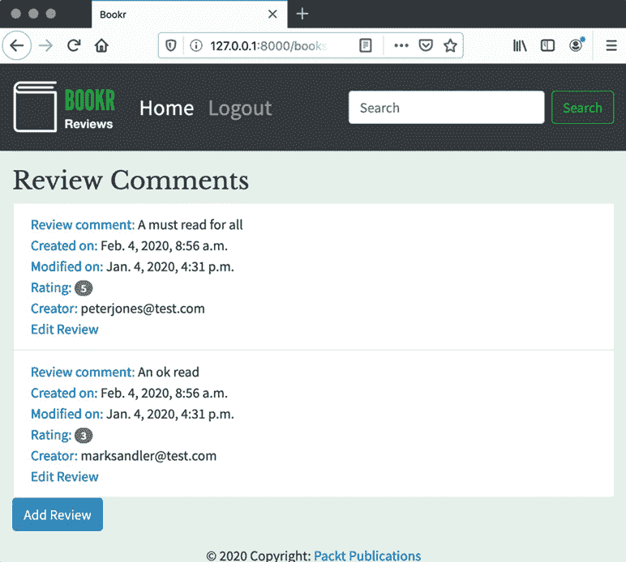

图 7.27：添加了添加评论按钮的书籍详情页面

你可以看到`添加评论`按钮。点击它将带你到`创建书籍评论`页面，它应该看起来像*图 7.28*：

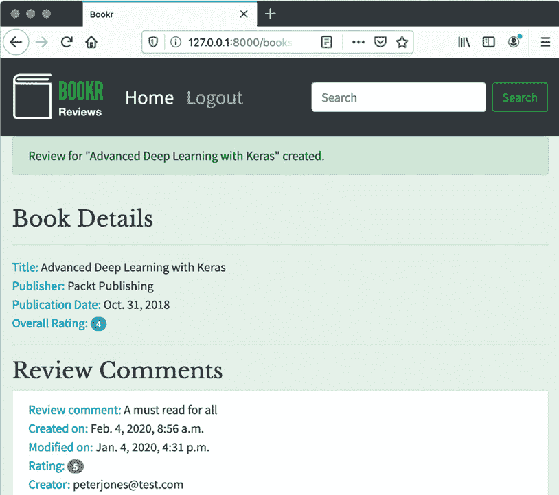

图 7.28：评论创建页面

在表单中输入一些详细信息并点击`创建`。你将被重定向到`书籍详情`页面，你应该看到成功消息和你的评论，就像*图 7.29*：

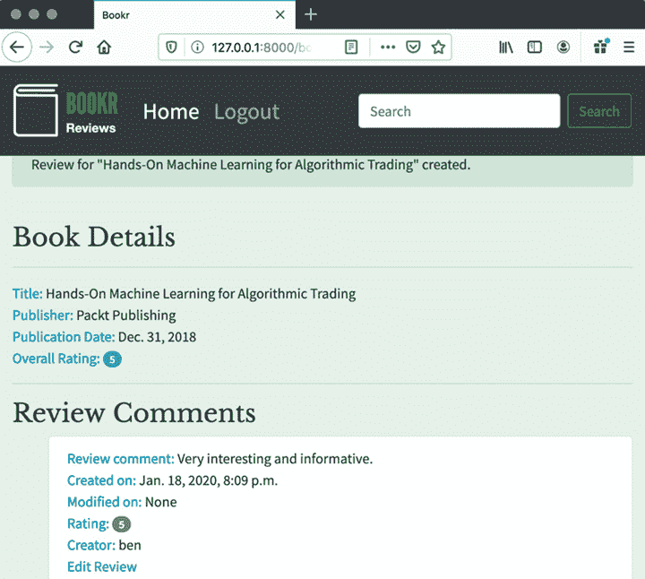

图 7.29：添加了评论的书籍详情页面

你也可以看到`编辑评论`链接，如果你点击它，你将被带到包含你的评论数据的表单（见*图 7.30*）：

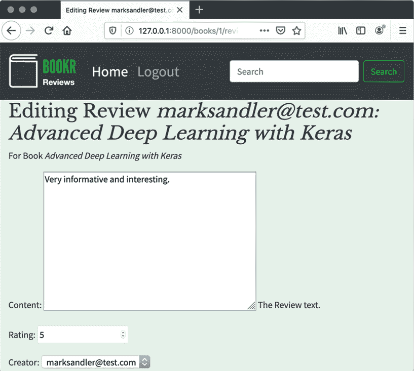

图 7.30：编辑评论时的评论表单

保存现有的评论后，你应该在`书籍详情`页面上看到`修改于`日期已更新（*图 7.31*）：

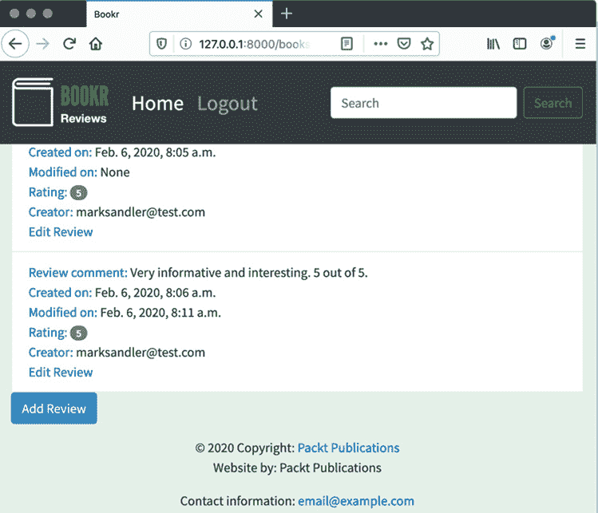

图 7.31：修改日期现在已填充

注意

这个活动的解决方案可以在[`packt.live/2Nh1NTJ`](http://packt.live/2Nh1NTJ)找到。

# 摘要

本章深入探讨了表单。我们看到了如何通过自定义验证规则、清理数据和验证字段来增强 Django 表单。我们看到了如何通过自定义清理方法转换从表单中获取的数据。我们看到了可以添加到表单中的一个很好的功能，即能够在字段上设置初始值和占位符值，这样用户就不必填写它们。

我们接下来探讨了如何使用`ModelForm`类从 Django 模型自动创建表单。我们看到了如何只向用户显示一些字段，以及如何将自定义表单验证规则应用到`ModelForm`上。我们还了解到 Django 如何在视图中自动将新或更新的模型实例保存到数据库中。在本章的活动部分，我们通过添加创建和编辑出版社以及提交评论的表单，进一步增强了 Bookr 的功能。下一章将继续探讨提交用户输入的主题，并在此基础上，我们将讨论 Django 如何处理文件的上传和下载。
