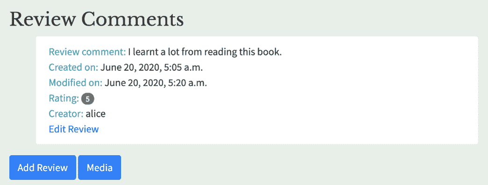

# 9. 会话和认证

概述

本章首先简要介绍**中间件**，然后深入探讨**认证模型**和**会话引擎**的概念。您将实现 Django 的认证模型以限制权限仅限于特定用户集。然后，您将了解如何利用 Django 认证提供灵活的应用安全方法。之后，您将学习 Django 如何支持多个会话引擎以保留用户数据。到本章结束时，您将熟练使用会话来保留过去用户交互的信息，并在页面被重新访问时维护用户偏好。

# 简介

到目前为止，我们使用 Django 开发允许用户与应用模型交互的动态应用，但我们尚未尝试保护这些应用免受未经授权的使用。例如，我们的 Bookr 应用允许未经认证的用户添加评论和上传媒体。这对任何在线 Web 应用都是一个关键的安全问题，因为它使网站容易受到垃圾邮件或其他不适当内容的发布以及现有内容的破坏。我们希望内容的创建和修改严格限于已在网站上注册的认证用户。

**认证应用**为 Django 提供了表示用户、组和权限的模型。它还提供了中间件、实用函数、装饰器和混入，这些可以帮助将用户认证集成到我们的应用中。此外，认证应用允许对某些用户集进行分组和命名。

在*第四章*，*Django Admin 简介*中，我们使用 Admin 应用创建了一个帮助台用户组，具有“可以查看日志条目”、“可以查看权限”、“可以更改用户”和“可以查看用户”的权限。这些权限可以通过它们对应的名称引用：`view_logentry`、`view_permissions`、`change_user`和`view_user`。在本章中，我们将学习如何根据特定的用户权限自定义 Django 行为。

权限是定义用户类别可以做什么的指令。权限可以分配给组或直接分配给单个用户。从管理角度来看，将权限分配给组更清晰。组使得建模角色和组织结构更容易。如果创建了一个新的权限，修改几个组比记住将其分配给用户子集要节省时间。

我们已经熟悉了使用多种方法创建用户和组以及分配权限，例如通过脚本使用模型实例化用户和组，以及通过 Django Admin 应用创建它们的便利性。认证应用还提供了创建和删除用户、组和权限以及分配它们之间关系的编程方式。

随着我们进入本章，我们将学习如何使用身份验证和权限来实现应用安全，以及如何存储特定于用户的数据以定制用户的体验。这将帮助我们保护 `bookr` 项目免受未经授权的内容更改，并使其对不同类型的用户具有上下文相关性。在我们考虑将其部署到互联网之前，向 `bookr` 项目添加这种基本安全措施至关重要。

身份验证以及会话管理（我们将在 *会话* 部分中学习），由一个名为 `bookr` 项目的组件处理，让我们了解一下这个中介栈及其模块。

# 中介模块

在 *第三章*，*URL 映射、视图和模板* 中，我们讨论了 Django 对请求/响应过程的实现，以及其视图和渲染功能。除了这些之外，另一个在 Django 核心网络处理中起着极其重要作用的特性是 **中介**。Django 的中介指的是各种软件组件，它们介入这个请求/响应过程以集成重要的功能，如安全、会话管理和身份验证。

因此，当我们用 Django 编写视图时，我们不需要在响应头中显式设置一系列重要的安全功能。这些添加到响应对象中的功能是由 `SecurityMiddleware` 实例在视图返回其响应后自动完成的。由于中介组件封装视图并在请求上执行一系列预处理以及在响应上执行一系列后处理，因此视图不会充斥着大量重复的代码，我们可以专注于编写应用逻辑而不是担心低级服务器行为。而不是将这些功能构建到 Django 核心中，Django 的中介栈实现允许这些组件既可选又可替换。

## 中介模块

当我们运行 `startproject` 子命令时，默认的中介模块列表会被添加到 `<project>/settings.py` 文件中的 `MIDDLEWARE` 变量中，如下所示：

```py
MIDDLEWARE = ['django.middleware.security.SecurityMiddleware',\
              'django.contrib.sessions.middleware.SessionMiddleware',\
              'django.middleware.common.CommonMiddleware',\
              'django.middleware.csrf.CsrfViewMiddleware',\
              'django.contrib.auth.middleware.AuthenticationMiddleware',\
              'django.contrib.messages.middleware.MessageMiddleware',\
              'django.middleware.clickjacking.XFrameOptionsMiddleware',\]
```

这是一个适合大多数 Django 应用的最小化中介栈。以下列表详细说明了每个模块的通用目的：

+   `SecurityMiddleware` 提供了常见的安全增强功能，例如处理 SSL 重定向和添加响应头以防止常见的攻击。

+   `SessionMiddleware` 启用会话支持，并无缝地将存储的会话与当前请求关联起来。

+   `CommonMiddleware` 实现了许多杂项功能，例如拒绝来自 `DISALLOWED_USER_AGENTS` 列表的请求，实现 URL 重写规则，并设置 `Content-Length` 头。

+   `CsrfViewMiddleware` 添加了对 **跨站请求伪造**（**CSRF**）的保护。

+   `AuthenticationMiddleware` 将 `user` 属性添加到 `request` 对象中。

+   `MessageMiddleware` 添加了 "闪存" 消息支持。

+   `XFrameOptionsMiddleware`可以防止`X-Frame-Options`头部点击劫持攻击。

中间件模块按照它们在`MIDDLEWARE`列表中出现的顺序加载。这样做是有道理的，因为我们希望首先调用处理初始安全问题的中间件，以便在进一步处理之前拒绝危险请求。Django 还附带了一些执行重要功能的其他中间件模块，例如使用`gzip`文件压缩、重定向配置和网页缓存配置。

本章致力于讨论作为中间件组件实现的状态感知应用程序开发的两个重要方面——`SessionMiddleware`和`AuthenticationMiddleware`。

`SessionMiddleware`的`process_request`方法将一个`session`对象作为`request`对象的属性添加。`AuthenticationMiddleware`的`process_request`方法将一个`user`对象作为`request`对象的属性添加。

如果项目不需要用户认证或保存单个交互状态的方法，则可以编写不包含这些中间件堆栈层的 Django 项目。然而，大多数默认中间件在应用程序安全方面都发挥着重要作用。如果没有充分的理由更改中间件组件，最好是保持这些初始设置。实际上，Admin 应用需要`SessionMiddleware`、`AuthenticationMiddleware`和`MessageMiddleware`才能运行，如果 Admin 应用安装了这些中间件，Django 服务器将抛出如下错误：

```py
django.core.management.base.SystemCheckError: SystemCheckError: System check identified some issues:
ERRORS:
?: (admin.E408) 'django.contrib.auth.middleware.AuthenticationMiddleware' must be in MIDDLEWARE in order to use the admin application.
?: (admin.E409) 'django.contrib.messages.middleware.MessageMiddleware' must be in MIDDLEWARE in order to use the admin application.
?: (admin.E410) 'django.contrib.sessions.middleware.SessionMiddleware' must be in MIDDLEWARE in order to use the admin application.
```

现在我们已经了解了中间件模块，让我们看看一种使用认证应用视图和模板在我们的项目中启用认证的方法。

## 实现认证视图和模板

我们已经在*第四章，Django Admin 简介*中遇到了登录表单。这是访问 Admin 应用的员工用户的认证入口点。我们还需要为想要撰写书评的普通用户创建登录功能。幸运的是，认证应用提供了实现这一功能的工具。

在我们处理认证应用的表单和视图的过程中，我们遇到了其在实现上的很多灵活性。我们可以自由地实现自己的登录页面，在视图级别定义非常简单或细粒度的安全策略，并对外部权威机构进行认证。

认证应用旨在适应许多不同的认证方法，以便 Django 不会严格强制执行单一机制。对于第一次遇到文档的用户来说，这可能会相当令人困惑。在本章的大部分内容中，我们将遵循 Django 的默认设置，但会注意一些重要的配置选项。

Django 项目的`settings`对象包含登录行为的属性。`LOGIN_URL`指定登录页面的 URL。默认值是`'/accounts/login/'`。`LOGIN_REDIRECT_URL`指定成功登录后重定向的路径。默认路径是`'/accounts/profile/'`。

认证应用提供执行典型认证任务的标准表单和视图。表单位于`django.contrib.auth.forms`，视图位于`django.contrib.auth.views`。

视图通过`django.contrib.auth.urls`中存在的这些 URL 模式进行引用：

```py
urlpatterns = [path('login/', views.LoginView.as_view(), \
                    name='login'),
               path('logout/', views.LogoutView.as_view(), \
                    name='logout'),
               path('password_change/', \
                    views.PasswordChangeView.as_view()),\
                    (name='password_change'),\
               path('password_change/done/', \
                    views.PasswordChangeDoneView.as_view()),\
                    (name='password_change_done'),\
               path('password_reset/', \
                    views.PasswordResetView.as_view()),\
                    (name='password_reset'),\
               path('password_reset/done/', \
                    views.PasswordResetDoneView.as_view()),\
                    (name='password_reset_done'),\
               path('reset/<uidb64>/<token>/', \
                    views.PasswordResetConfirmView.as_view()),\
                    (name='password_reset_confirm'),\
               path('reset/done/', \
                    views.PasswordResetCompleteView.as_view()),\
                    (name='password_reset_complete'),]
```

如果这种视图风格看起来不熟悉，那是因为它们是基于类的视图，而不是我们之前遇到过的基于函数的视图。我们将在*第十一章*，*高级模板和基于类的视图*中了解更多关于基于类的视图。现在，请注意，认证应用利用类继承来分组视图的功能，以避免大量的重复编码。

如果我们想保持认证应用和 Django 设置预设的默认 URL 和视图，我们可以在项目的`urlpatterns`中包含认证应用的 URL。

通过采取这种方法，我们节省了大量工作。我们只需要将认证应用的 URL 包含到我们的`<project>/urls.py`文件中，并分配给它`'accounts'`命名空间。指定这个命名空间确保我们的反向 URL 与视图的默认模板值相对应：

```py
urlpatterns = [path('accounts/', \
                    include(('django.contrib.auth.urls', 'auth')),\
                    (namespace='accounts')),\
               path('admin/', admin.site.urls),\
               path('', include('reviews.urls'))]
```

虽然认证应用自带了其自己的表单和视图，但它缺少将这些组件渲染为 HTML 所需的模板。*图 9.1*列出了我们为实现项目中认证功能所需的模板。幸运的是，管理应用实现了一套模板，我们可以用于我们的目的。

我们可以直接从 Django 源代码的`django/contrib/admin/templates/registration`目录和`django/contrib/admin/templates/admin/login.html`复制模板文件到我们的项目`templates/registration`目录。

注意

当我们说 Django 源代码时，指的是你的 Django 安装所在的目录。如果你在虚拟环境中安装了 Django（如*前言*中详细说明），你可以找到这些模板文件在以下路径：`<你的虚拟环境名称>/lib/python3.X/site-packages/django/contrib/admin/templates/registration/`。如果你的虚拟环境已激活且 Django 已安装在其中，你还可以通过在终端运行以下命令来检索`site-packages`目录的完整路径：`python -c "import sys; print(sys.path)"`。


图 9.1：认证模板的默认路径

注意

我们只需要复制视图的依赖模板，并应避免复制`base.html`或`base_site.html`文件。

这一开始给出了一个有希望的结果，但正如我们所看到的，管理员模板并不完全符合我们的精确需求，正如登录页面（*图 9.2*）所示：

![图 9.2：用户登录屏幕的第一次尝试

![img/B15509_09_02.jpg]

图 9.2：用户登录屏幕的第一次尝试

由于这些认证页面继承自 Admin 应用的`admin/base_site.html`模板，它们遵循 Admin 应用的风格。我们更希望这些页面遵循我们开发的`bookr`项目的风格。我们可以通过在每个从 Admin 应用复制到我们项目的 Django 模板上遵循以下三个步骤来实现这一点：

1.  需要做的第一个更改是将``标签替换为``。

1.  由于`template/base.html`仅包含以下块定义——`title`、`brand`和`content`——因此我们应该从`bookr`文件夹中的模板中移除所有其他块替换。在我们的应用中，我们没有使用`userlinks`和`breadcrumbs`块的内容，因此这些块可以被完全移除。

    其中一些块，如`content_title`和`reset_link`，包含与我们的应用相关的 HTML 内容。我们应该从这些 HTML 内容周围移除块，并将其放入内容块中。

    例如，`password_change_done.html`模板包含大量的块：

    ```py
    
    
      <a href="{{ docsroot }}">    </a> /  / <a href=""></a>
    
    <div class="breadcrumbs">
    <a href=""></a>
    &rsaquo; 
    </div>
    
    {{ title }}
    <h1>{{ title }}</h1>
    
    <p></p>
    
    ```

    在`bookr`项目中，它将被简化为以下模板：

    ```py
    
    
    {{ title }}
    
    <h1>{{ title }}</h1>
    <p></p>
    
    ```

1.  同样，需要更改反向 URL 模式以反映当前路径，因此``被替换为``。

考虑到这些因素，下一个练习将专注于将 Admin 应用的登录模板转换为`bookr`项目的登录模板。

注意

`i18n`模块用于创建多语言内容。如果您打算为您的网站开发多语言内容，请在模板中保留`i18n`导入、`trans`标签和`transblock`语句。为了简洁，我们将在本章中不详细讨论这些内容。

## 练习 9.01：重新利用 Admin 应用登录模板

我们在项目中没有登录页面的情况下开始了这一章。通过添加认证的 URL 模式并从 Admin 应用复制模板到我们的项目，我们可以实现登录页面的功能。但是，这个登录页面并不令人满意，因为它直接从 Admin 应用复制而来，并且与 Bookr 设计不匹配。在这个练习中，我们将遵循将 Admin 应用的登录模板重新用于我们项目的步骤。新的登录模板需要直接从`bookr`项目的`templates/base.html`继承其样式和格式：

1.  在您的项目中创建一个名为`templates/registration`的目录。

1.  管理员登录模板位于 Django 源目录的`django/contrib/admin/templates/admin/login.html`路径。它以一个`extends`标签、一个`load`标签、导入`i18n`和`static`模块以及一系列覆盖子模板`django/contrib/admin/templates/admin/base.html`中定义的块的块扩展开始。以下是一个`login.html`文件的截断片段：

    ```py
    
    
    {{ block.super }}…
    
    {{ block.super }} login
    
    
    
    
    ```

1.  将此管理员登录模板`django/contrib/admin/templates/admin/login.html`复制到`templates/registration`，然后使用 PyCharm 开始编辑文件。

1.  由于您正在编辑的登录模板位于`templates/registration/login.html`，并且扩展了基本模板（`templates/base.html`），因此请替换`templates/registration/login.html`顶部`extends`标签的参数：

    ```py
    
    ```

1.  我们不需要这个文件的大部分内容。只需保留包含登录表单的`content`块。模板的其余部分将包括加载`i18n`和`static`标签库：

    ```py
    
    
    …
    
    ```

1.  现在您必须将`templates/registration/login.html`中的路径和反向 URL 模式替换为适合您项目的模式。由于您在模板中没有定义`app_path`变量，它需要被替换为登录的反向 URL，即`'accounts:login'`。因此，请考虑以下行：

    ```py
    <form action="{{ app_path }}" method="post" id="login-form">
    ```

    这一行将按以下方式更改：

    ```py
    <form action="" method="post" id="login-form">
    ```

    在您的项目路径中没有定义`'admin_password_reset'`，因此它将被替换为`'accounts:password_reset'`。

    考虑以下行：

    ```py
    
    ```

    这一行将按以下方式更改：

    ```py
    
    ```

    您的登录模板将如下所示：

    ```py
    templates/registration/login.html
    1  
    2  
    3
    4  
    5  
    6  <p class="errornote">
    7  
    8  </p>
    9  
    You can find the complete code for this file at http://packt.live/2MILJtF.
    ```

1.  要使用标准的 Django 认证视图，我们必须将 URL 映射添加到它们中。打开`bookr`项目目录中的`urls.py`文件，然后添加以下 URL 模式：

    ```py
    urlpatterns = [path('accounts/', \
                        include(('django.contrib.auth.urls', 'auth')),\
                        (namespace='accounts')),\
                   path('admin/', admin.site.urls),\
                   path('', include('reviews.urls'))]
    ```

1.  现在当您访问`http://127.0.0.1:8000/accounts/login/`的登录链接时，您将看到这个页面：

图 9.3：Bookr 登录页面

通过完成这个练习，您已经创建了项目所需的非管理员认证模板。

注意

在您继续之前，您需要确保`registration`目录中的其余模板遵循`bookr`项目的风格；也就是说，它们继承自管理员应用的`admin/base_site.html`模板。您已经看到了`password_change_done.html`和`login.html`模板是如何做到这一点的。现在将您在这个练习（以及之前的章节）中学到的知识应用到`registration`目录中的其余文件上。或者，您也可以从 GitHub 仓库下载修改后的文件：[`packt.live/3s4R5iU`](http://packt.live/3s4R5iU)。

## Django 中的密码存储

Django 不会以纯文本形式在数据库中存储密码。相反，密码会与哈希算法（如**PBKDF2/SHA256**、**BCrypt/**SHA256**或**Argon2**）进行散列。由于哈希算法是一种单向转换，这可以防止从数据库中存储的哈希中解密用户的密码。这对于期望系统管理员检索他们忘记的密码的用户来说可能是个惊喜，但在安全设计中这是最佳实践。因此，如果我们查询数据库以获取密码，我们将看到如下内容：

```py
sqlite> select password from auth_user;pbkdf2_sha256$180000$qgDCHSUv1E4w$jnh69TEIO6kypHMQPOknkNWMlE1e2ux8Q1Ow4AHjJDU=
```

此字符串的组成部分是`<algorithm>$<iterations>$<salt>$<hash>`。由于随着时间的推移，几个哈希算法已被破坏，并且我们有时需要与强制性的安全要求一起工作，Django 足够灵活，可以适应新的算法，并可以维护使用多种算法加密的数据。

## 个人资料页面和 request.user 对象

当登录成功时，登录视图将重定向到`/accounts/profile`。然而，此路径未包含在现有的`auth.url`中，认证应用程序也没有提供相应的模板。为了避免“页面未找到”错误，需要一个视图和适当的 URL 模式。

每个 Django 请求都有一个`request.user`对象。如果请求是由未经认证的用户发起的，则`request.user`将是一个`AnonymousUser`对象。如果请求是由认证用户发起的，则`request.user`将是一个`User`对象。这使得在 Django 视图中检索个性化用户信息并在模板中渲染它变得容易。

在下一个练习中，我们将向我们的`bookr`项目添加一个个人资料页面。

## 练习 9.02：添加个人资料页面

在这个练习中，我们将向我们的项目添加一个个人资料页面。为此，我们需要在 URL 模式中包含其路径，并在我们的视图和模板中包含它。个人资料页面将简单地显示`request.user`对象中的以下属性：

+   `username`

+   `first_name`和`last_name`

+   `date_joined`

+   `email`

+   `last_login`

执行以下步骤以完成此练习：

1.  将`bookr/views.py`添加到项目中。它需要一个简单的个人资料函数来定义我们的视图：

    ```py
    from django.shortcuts import render
    def profile(request):
        return render(request, 'profile.html')
    ```

1.  在主`bookr`项目的模板文件夹中，创建一个名为`profile.html`的新文件。在这个模板中，可以使用类似`{{ request.user.username }}`的表示法轻松引用`request.user`对象的属性：

    ```py
    
    Bookr
    
    <h2>Profile</h2>
    <div>
      <p>
          Username: {{ request.user.username }} <br>
          Name: {{ request.user.first_name }} {{ request.user.last_name }}<br>
          Date Joined: {{ request.user.date_joined }} <br>
          Email: {{ request.user.email }}<br>
          Last Login: {{ request.user.last_login }}<br>
      </p>
    </div>
    
    ```

    此外，我们还添加了一个包含用户个人资料详情的块。更重要的是，我们确保`profile.html`扩展了`base.html`。

1.  最后，需要将此路径添加到`bookr/urls.py`中的`urlpatterns`列表顶部。首先，导入新的视图，然后添加一个将 URL `accounts/profile/`链接到`bookr.views.profile`的路径：

    ```py
    from bookr.views import profile
    urlpatterns = path('accounts/', \
                        include(('django.contrib.auth.urls', 'auth')),\
                       (namespace='accounts')),\
                   http://localhost:8000/accounts/profile/, it is rendered as shown in the screenshot in *Figure 9.4*. Remember, if the server needs to be started, use the python manage.py runserver command:![Figure 9:4: Alice visits her user profile        ```图 9.4：爱丽丝访问她的用户资料我们已经看到了如何将用户重定向到他们的个人资料页面，一旦他们成功登录。现在让我们讨论如何仅向特定用户提供内容访问。## 认证装饰器和重定向现在我们已经学会了如何允许普通用户登录到我们的项目，我们可以发现如何将内容限制为认证用户。认证模块附带了一些有用的装饰器，可以根据当前用户的认证或访问权限来保护视图。不幸的是，如果比如说用户 Alice 要从 Bookr 注销，资料页面仍然会渲染并显示空详情。为了避免这种情况，我们更希望任何未经认证的访客被引导到登录界面：

图 9.5：一个未认证的用户访问用户资料

认证应用附带了一些有用的装饰器，可以用于向 Django 视图添加认证行为。在这种情况下，为了保护我们的资料视图，我们可以使用`login_required`装饰器：

```py
from django.contrib.auth.decorators import login_required
@login_required
def profile(request):
    …
```

现在，如果一个未认证的用户访问`/accounts/profile` URL，他们将被重定向到`http://localhost:8000/accounts/login/?next=/accounts/profile/`。

这个 URL 会将用户带到登录 URL。`GET`变量中的`next`参数告诉登录视图在登录成功后重定向到哪里。默认行为是重定向回当前视图，但可以通过指定`login_required`装饰器的`login_url`参数来覆盖这个行为。例如，如果我们需要登录后重定向到不同的页面，我们可以在装饰器调用中明确指出，如下所示：

```py
@login_required(login_url='/accounts/profile2')
```

如果我们重写了登录视图，使其期望重定向 URL 在`'next'`参数之外的其他 URL 参数中指定，我们可以在装饰器调用中使用`redirect_field_name`参数来明确这一点：

```py
@login_required(redirect_field_argument='redirect_to')
```

经常会有这样的情况，一个 URL 应该限制给满足特定条件的用户或组。考虑这样一个情况，我们有一个页面供员工用户查看任何用户资料。我们不希望这个 URL 对所有用户都可用，因此我们希望将这个 URL 限制为具有`'view_user'`权限的用户或组，并将未经授权的请求转发到登录 URL：

```py
from django.contrib.auth.decorators \
import login_required, permission_required
…
@permission_required('view_group')
def user_profile(request, uid):
    user = get_object_or_404(User, id=uid)
    permissions = user.get_all_permissions()
    return render(request, 'user_profile.html',\
                  {'user': user, 'permissions': permissions}
```

因此，在我们的`user_profile`视图上应用了这个装饰器后，访问`http://localhost:8000/accounts/users/123/profile/`的未经授权的用户将被重定向到`http://localhost:8000/accounts/login/?next=/accounts/users/123/profile/`。

然而，有时我们需要构建更微妙的条件权限，这些权限不适用于这两个导演。为此，Django 提供了一个自定义装饰器，它接受一个任意函数作为参数。`user_passes_test`装饰器需要一个`test_func`参数：

```py
user_passes_test(test_func, login_url=None, redirect_field_name='next')
```

这里有一个例子，我们有一个视图`veteran_features`，这个视图只对在网站上注册超过一年的用户可用：

```py
from django.contrib.auth.decorators import (login_required),\
                                           (permission_required),\
                                           (user_passes_test)
…
def veteran_user(user):
    now = datetime.datetime.now()
    if user.date_joined is None:
        return False
    return now - user.date_joined > datetime.timedelta(days=365)
@user_passes_test(veteran_user)
def veteran_features(request):
    user = request.user
    permissions = user.get_all_permissions()
    return render(request, 'veteran_profile.html',\
                  {'user': user, 'permissions': permissions}
```

有时候，我们视图中的逻辑无法用这些装饰器处理，我们需要在视图的控制流中应用重定向。我们可以使用`redirect_to_login`辅助函数来完成此操作。它接受与装饰器相同的参数，如下面的代码片段所示：

```py
redirect_to_login(next, login_url=None, redirect_field_name='next')
```

## 练习 9.03：向视图添加认证装饰器

在了解了认证应用的权限和认证装饰器的灵活性之后，我们现在将着手在“评论”应用中使用它们。我们需要确保只有经过认证的用户可以编辑评论，只有工作人员用户可以编辑出版商。有几种实现方式，因此我们将尝试几种方法。这些步骤中的所有代码都在`reviews/views.py`文件中：

1.  解决这个问题的第一直觉可能是认为`publisher_edit`方法需要一个适当的装饰器来强制用户具有`edit_publisher`权限。为此，你可以轻松地做如下操作：

    ```py
    from django.contrib.auth.decorators import permission_required 
    …
    @permission_required('edit_publisher')
    def publisher_edit(request, pk=None):
        …
    ```

1.  使用这种方法是可以的，这是向视图添加权限检查的一种方法。您还可以使用一种稍微复杂但更灵活的方法。不是使用权限装饰器来强制`publisher_edit`方法的权限，而是创建一个需要工作人员用户的测试函数，并使用`user_passes_test`装饰器将此测试函数应用于`publisher_edit`。编写测试函数允许在验证用户访问权或权限方面进行更多定制。如果您在*步骤 1*中对`views.py`文件进行了更改，请随意取消注释（或删除）装饰器，并编写以下测试函数代替：

    ```py
    from django.contrib.auth.decorators import user_passes_test
    …
    def is_staff_user(user):
        return user.is_staff
    @user_passes_test(is_staff_user)
        …
    ```

1.  通过添加适当的装饰器来确保`review_edit`和`book_media`函数需要登录：

    ```py
    …
    from django.contrib.auth.decorators import login_required, \
                                               user_passes_test
    …
    @login_required
    def review_edit(request, book_pk, review_pk=None):
    @login_required
    def book_media(request, pk):
    …
    ```

1.  在`review_edit`方法中，向视图中添加逻辑，要求用户必须是工作人员用户或评论的所有者。`review_edit`视图控制评论创建和评论更新的行为。我们正在开发的约束仅适用于正在更新现有评论的情况。因此，添加代码的位置是在成功检索到`Review`对象之后。如果用户不是工作人员账户或评论的创建者与当前用户不匹配，我们需要抛出一个`PermissionDenied`错误：

    ```py
    …
    from django.core.exceptions import PermissionDenied
    from PIL import Image
    from django.contrib import messages
    …
    @login_required
    def review_edit(request, book_pk, review_pk=None):
        book = get_object_or_404(Book, pk=book_pk)
        if review_pk is not None:
            review = get_object_or_404(Review),\
                                     (book_id=book_pk),\
                                     (pk=review_pk)
            user = request.user
            if not user.is_staff and review.creator.id != user.id:
                raise PermissionDenied
        else:
            review = None
    …
    ```

    现在，当非工作人员用户尝试编辑其他用户的评论时，将会抛出一个`Forbidden`错误，如*图 9.6*所示。在下一节中，我们将探讨在模板中应用条件逻辑，以便用户不会被带到他们没有足够权限访问的页面：

    ![图 9.6：非工作人员用户无法访问]

    ](img/B15509_09_06.jpg)

图 9.6：非工作人员用户无法访问

在这个练习中，我们使用了认证装饰器来保护 Django 应用中的视图。所应用的认证装饰器提供了一个简单的机制来限制缺乏必要权限的用户、非工作人员用户和未认证用户的视图。Django 的认证装饰器提供了一个遵循 Django 角色和权限框架的强大机制，而 `user_passes_test` 装饰器提供了一个开发自定义认证的选项。

## 使用认证数据增强模板

在 *练习 9.02*，*添加个人资料页面* 中，我们了解到我们可以将 `request.user` 对象传递到模板中，以在 HTML 中渲染当前用户的属性。我们还可以根据用户的类型或权限采取不同的模板渲染方法。假设我们想要添加一个仅对工作人员用户显示的编辑链接。我们可能使用 `if` 条件来实现这一点：

```py

  <p><a href="">Edit this Review</a></p>

```

如果我们没有花时间根据权限条件渲染链接，用户在导航应用程序时会感到沮丧，因为他们点击的许多链接都会导致 `403 禁止访问` 页面。接下来的练习将展示我们如何使用模板和认证在我们的项目中呈现上下文相关的链接。

## 练习 9.04：在基础模板中切换登录和登出链接

在 `bookr` 项目的基模板中，位于 `templates/base.html`，我们在页眉中有一个占位符登出链接。它用以下 HTML 编码：

```py
<li class="nav-item">
  <a class="nav-link" href="#">Logout</a>
</li>
```

我们不希望在用户登出后显示登出链接。因此，这个练习的目的是在模板中应用条件逻辑，以便根据用户是否认证来切换 `登录` 和 `登出` 链接：

1.  编辑 `templates/base.html` 文件。复制 `登出` 列表元素的架构，创建一个 `登录` 列表元素。然后，将占位符链接替换为 `登出` 和 `登录` 页面的正确 URL - 分别为 `/accounts/logout` 和 `/accounts/login` - 如下所示：

    ```py
    <li class="nav-item">
      <a class="nav-link" href="/accounts/logout">Logout</a>
    </li>
    <li class="nav-item">
      <a class="nav-link" href="/accounts/login">Login</a>
    </li>
    ```

1.  现在将我们的两个 `li` 元素放入一个 `if … else … endif` 条件块中。我们正在应用的逻辑条件是 `if user.is_authenticated`：

    ```py
    
      <li class="nav-item">
        <a class="nav-link" href="/accounts/logout">Logout</a>
      </li>
        
      <li class="nav-item">
        <a class="nav-link" href="/accounts/login">Login</a>
      </li>
    
    ```

1.  现在访问用户个人资料页面，网址为 `http://localhost:8000/accounts/profile/`。当您登录后，您将看到 `登出` 链接：

    图 9.7：已认证用户看到的登出链接

1.  现在点击 `登出` 链接；您将被带到 `/accounts/logout` 页面。`登录` 链接出现在菜单中，确认该链接是依赖于用户认证状态的：

图 9.8：未认证用户看到的登录链接

这个练习是一个简单的例子，说明了 Django 模板如何与认证信息一起使用，以创建有状态和上下文化的用户体验。我们也不希望提供用户无权访问的链接或用户权限级别不允许的操作。以下活动将使用这种模板技术来解决 Bookr 中的一些问题。

## 活动九.01：使用模板中的条件块进行基于认证的内容

在这个活动中，你将在模板中应用条件块，根据用户认证和用户状态修改内容。不应向用户提供他们无权访问的链接或他们无权执行的操作。以下步骤将帮助你完成这个活动：

1.  在`book_detail`模板中，在`reviews/templates/reviews/book_detail.html`文件中，隐藏非认证用户的“添加评论”和“媒体”按钮。

1.  此外，隐藏标题“*成为第一个写评论的人*”，因为这不是非认证用户的选项。

1.  在相同的模板中，使“编辑评论”链接仅对工作人员或撰写评论的用户显示。模板块的条件逻辑与我们在上一节中使用的`review_edit`视图中的条件逻辑非常相似：

    图 9.9：当爱丽丝登录时，爱丽丝的评论中会出现“编辑评论”链接

    

    图 9.10：当鲍勃登录时，爱丽丝的评论中没有“编辑评论”链接

1.  修改`template/base.html`，使其在页眉中搜索表单的右侧显示当前已认证用户的用户名，并链接到用户个人资料页面。

    通过完成这个活动，你将在模板中添加反映当前用户认证状态和身份的动态内容，如下面的截图所示：

    

图 9.11：搜索表单之后显示已认证用户的名称

注意

这个活动的解决方案可以在[`packt.live/2Nh1NTJ`](http://packt.live/2Nh1NTJ)找到。

# 会话

值得研究一些理论来了解为什么会话是 Web 应用程序中管理用户内容的一种常见解决方案。HTTP 协议定义了客户端和服务器之间的交互。它被称为“无状态”协议，因为服务器在请求之间不保留任何有状态信息。这种协议设计在万维网早期很好地用于传递超文本信息，但它不适合需要向特定用户交付定制信息的受保护 Web 应用程序的需求。

我们现在已经习惯了看到网站适应我们的个人浏览习惯。购物网站推荐与我们最近浏览过的类似产品，并告诉我们在我们地区受欢迎的产品。所有这些功能都需要一种有状态的网站开发方法。实现有状态网络体验最常见的方法之一是通过**会话**。会话指的是用户与网络服务器或应用的当前交互，并要求在交互期间持续存储数据。这可能包括用户访问的链接、他们执行的操作以及他们在交互中做出的偏好。

如果用户在一页上将博客网站的配色方案设置为深色主题，那么人们会期待下一页也会使用相同的主题。我们将这种行为描述为“保持状态”。会话密钥存储在客户端作为浏览器 cookie，并且可以通过在用户登录期间持续存在的服务器端信息进行识别。

在 Django 中，会话被实现为一种中间件形式。当我们最初在*第四章*，*Django Admin 简介*中创建应用时，会话支持默认激活。

### 会话引擎

需要将当前和已过期的会话信息存储在某个地方。在万维网早期，这是通过在服务器上保存会话信息到文件中实现的，但随着网络服务器架构变得更加复杂以及性能需求的增加，其他更高效的策略，如数据库或内存存储，已成为标准。默认情况下，在 Django 中，会话信息存储在项目数据库中。

这对于大多数小型项目来说是一个合理的默认设置。然而，Django 的会话中间件实现为我们提供了灵活性，可以根据我们的系统架构和性能需求以多种方式存储我们的项目会话信息。这些不同的实现方式被称为会话引擎。如果我们想更改会话配置，我们需要在项目的`settings.py`文件中指定`SESSION_ENGINE`设置：

+   用于此目的的`django.contrib.sessions.backends.cache`和`django.contrib.sessions.backends.cached_db`会话引擎。

+   **基于文件的会话**：如前所述，这是一种相对过时的维护会话信息的方式，但可能适合一些性能不是问题且没有理由在数据库中存储动态信息的网站。

+   **基于 cookie 的会话**：而不是在服务器端保持会话信息，你可以通过将会话内容序列化为 JSON 并存储在基于浏览器的 cookie 中，将它们完全保存在网络浏览器客户端。

### 你需要标记 cookie 内容吗？

Django 的所有会话实现都需要在用户的网络浏览器中存储一个会话 ID 到 cookie 中。

不论使用哪种会话引擎，所有这些中间件实现都涉及在 Web 浏览器中存储特定于网站的 cookie。在 Web 开发的早期，将会话 ID 作为 URL 参数传递并不罕见，但出于安全考虑，Django 已经放弃了这种方法。

在许多司法管辖区，包括欧盟，网站在用户浏览器中设置 cookie 时，在法律上必须警告用户。如果您打算在某个地区运营网站，并且该地区有此类立法要求，您有责任确保代码符合这些义务。请确保使用最新的实现，并避免使用未跟上立法变化的废弃项目。

注意

为了适应这些变化和立法要求，有许多有用的应用程序，如**Django Simple Cookie Consent**和**Django Cookie Law**，它们旨在与多个立法框架一起工作。您可以通过以下链接了解更多信息：

[`pypi.org/project/django-simple-cookie-consent/`](https://pypi.org/project/django-simple-cookie-consent/)

[`github.com/TyMaszWeb/django-cookie-law`](https://github.com/TyMaszWeb/django-cookie-law)

存在许多 JavaScript 模块实现了类似的 cookie 同意机制。

## Pickle 或 JSON 存储

Python 在其标准库中提供了**pickle**模块，用于将 Python 对象序列化为字节流表示。pickle 是一种二进制结构，具有在不同架构和不同版本的 Python 之间互操作的优势，因此 Python 对象可以在 Windows PC 上序列化为 pickle，并在 Linux Raspberry Pi 上反序列化为 Python 对象。

这种灵活性伴随着安全漏洞，因此不建议用它来表示不受信任的数据。考虑以下 Python 对象，它包含多种类型的数据。它可以使用`pickle`进行序列化：

```py
import datetime
data = dict(viewed_books=[17, 18, 3, 2, 1],\
            search_history=['1981', 'Machine Learning', 'Bronte'],\
            background_rgb=(96, 91, 92),\
            foreground_rgb=(17, 17, 17),\
            last_login_login=datetime.datetime(2019, 12, 3, 15, 30, 30),\
            password_change=datetime.datetime(2019, 9, 2, 8, 41, 25),\
            user_class='Veteran',\
            average_rating=4.75,\
            reviewed_books={18, 3, 7})
```

使用`pickle`模块的`dumps`（导出字符串）方法，我们可以将数据对象序列化以生成字节表示：

```py
import pickle
data_pickle = pickle.dumps(data)
```

`pickle`格式：

```py
import json
data_json = json.dumps(data)
```

因为数据包含 Python 的`datetime`和`set`对象，这些对象不能与 JSON 序列化，当我们尝试序列化结构时，会抛出类型错误：

```py
TypeError: Object of type datetime is not JSON serializable
```

对于将数据序列化为 JSON，我们可以将`datetime`对象转换为`string`，将`set`转换为列表：

```py
data['last_login_login'] = data['last_login_login'].strftime("%Y%d%m%H%M%S")
data['password_change'] = data['password_change'].strftime("%Y%d%m%H%M%S")
data['reviewed_books'] = list(data['reviewed_books'])
```

由于 JSON 数据是可读的，因此很容易检查：

```py
{"viewed_books": [17, 18, 3, 2, 1], "search_history": ["1981", "Machine Learning", "Bronte"], "background_rgb": [96, 91, 92], "foreground_rgb": [17, 17, 17], "last_login_login": "20190312153030", "password_change": "20190209084125", "user_class": "Veteran", "average_rating": 4.75, "reviewed_books": [18, 3, 7]}
```

注意，我们不得不显式地将`datetime`和`set`对象转换为，但 JSON 会自动将元组转换为列表。Django 附带`PickleSerializer`和`JSONSerializer`。如果需要更改序列化器，可以通过在项目的`settings.py`文件中设置`SESSION_SERIALIZER`变量来实现：

```py
SESSION_SERIALIZER = 'django.contrib.sessions.serializers.JSONSerializer'
```

## 练习 9.05：检查会话密钥

本练习的目的是查询项目的 SQLite 数据库并对会话表进行查询，以便熟悉会话数据的存储方式。然后，您将创建一个用于检查使用 `JSONSerializer` 存储的会话数据的 Python 脚本：

1.  在命令提示符下，使用以下命令打开项目数据库：

    ```py
    sqlite3 db.sqlite3
    ```

1.  使用 `.schema` 指令来观察 `django_session` 表的结构如下：

    ```py
    sqlite> .schema django_session
    CREATE TABLE IF NOT EXISTS "django_session" ("django_session table in the database stores session information in the following fields:`session_key``session_data``expire_date`
    ```

1.  使用 SQL 命令 `select * from django_session;` 查询 `django_session` 表中的数据：

    图 9.12：查询 django_session 表中的数据

    注意

    要退出 `sqlite3`，在 Linux 和 macOS 上按 *Ctrl* + *D*，或在 Windows 上按 *Ctrl* + *Z* 然后按 *Enter*。

1.  我们观察到会话数据以 `base64` 格式编码。我们可以在 Python 命令行中使用 `base64` 模块解密此数据。一旦从 `base64` 解码，`session_key` 数据包含一个 `binary_key` 和一个由冒号分隔的 JSON 有效载荷：

    ```py
    b'\x82\x1e"z\xc9\xb4\xd7\xbf8\x83K…5e02:{"_auth_user_id":"1"…}'
    ```

    这段 Python 代码展示了如何获取有效载荷：

    

    图 9.13：使用 Python shell 解码会话密钥

    我们可以看到有效载荷中编码的结构。有效载荷表示会话中存储的最小数据。它包含 `_auth_user_id`、`_auth_user_backend` 和 `_auth_user_hash` 键，其值分别来自 `User.id`、`ModelBackend` 类名和从用户的密码信息中派生的哈希值。我们将在下一节学习如何添加额外的数据。

1.  我们将开发一个简单的 Python 实用程序来解密此会话信息。它需要我们使用的模块以及用于格式化输出的 `pprint` 模块和用于检查命令行参数的 `sys` 模块：

    ```py
    import base64
    import json
    import pprint
    import sys
    ```

1.  在 `import` 语句之后，编写一个函数来解码会话密钥并加载 JSON 有效载荷作为 Python 字典：

    ```py
    def get_session_dictionary(session_key):
        binary_key, payload = base64.b64decode\
                              (session_key).split(b':', 1)
        session_dictionary = json.loads(payload.decode())
        return session_dictionary
    ```

1.  添加一个代码块，以便当运行此实用程序时，它接受命令行中指定的 `session_key` 参数，并使用 `get_session_dictionary` 函数将其转换为字典。然后，使用 `pprint` 模块打印字典结构的缩进版本：

    ```py
    if __name__ == '__main__':
        if len(sys.argv)>1:
            session_key = sys.argv[1]
            session_dictionary = get_session_dictionary(session_key)
            pp = pprint.PrettyPrinter(indent=4)
            pp.pprint(session_dictionary)
    ```

1.  现在您可以使用这个 Python 脚本来检查存储在数据库中的会话数据。您可以通过以下方式在命令行中调用它，将会话数据作为参数传递：

    ```py
        python session_info.py <session_data>
    ```

    当您尝试最终活动时，这将有助于调试会话行为：

    

图 9.14：Python 脚本

此脚本输出解码后的会话信息。目前，会话只包含三个键：

`_auth_user_backend` 是用户后端类的字符串表示。由于我们的项目在模型中存储用户凭据，因此使用 `ModelBackend`。

`_auth_user_hash` 是用户密码的哈希值。

`_auth_user_id`是从模型的`User.id`属性中获取的用户 ID。

这个练习帮助你熟悉了 Django 中会话数据是如何存储的。现在，我们将把注意力转向向 Django 会话添加更多信息。

## 在会话中存储数据

我们已经介绍了 Django 中会话的实现方式。现在，我们将简要探讨一些我们可以利用会话来丰富用户体验的方法。在 Django 中，会话是`request`对象的一个属性。它被实现为一个类似字典的对象。在我们的视图中，我们可以像典型的字典一样向`session`对象分配键，如下所示：

```py
request.session['books_reviewed_count'] = 39
```

但是有一些限制。首先，会话中的键必须是字符串，因此不允许整数和时间戳。其次，以下划线开头的键是为内部系统使用保留的。数据限于可以编码为 JSON 的值，因此一些无法解码为 UTF-8 的字节序列，如之前列出的`binary_key`，不能作为 JSON 数据存储。另一个警告是避免将`request.session`重新赋值为不同的值。我们只应分配或删除键。所以，不要这样做：

```py
request.session = {'books_read_count':30, 'books_reviewed_count': 39}
```

而应该这样做：

```py
request.session['books_read_count'] = 30
request.session['books_reviewed_count'] = 39
```

考虑到这些限制，我们将研究在我们的评论应用中可以如何使用会话数据。

## 练习 9.06：将最近浏览的书籍存储在会话中

本练习的目的是使用会话来保存已认证用户最近浏览的`10`本书的信息。这些信息将在`bookr`项目的个人资料页上显示。当浏览一本书时，会调用`book_detail`视图。在本练习中，我们将编辑`reviews/views.py`文件，并向`book_detail`方法添加一些额外的逻辑。我们将向会话中添加一个名为`viewed_books`的键。利用基本的 HTML 和 CSS 知识，可以创建页面以显示个人资料详情和存储在页面不同部分的已浏览书籍，如下所示：


图 9.15：包含已浏览书籍的个人资料页面

1.  编辑`reviews/views.py`和`book_detail`方法。我们只对为已认证用户添加会话信息感兴趣，因此添加一个条件语句来检查用户是否已认证，并将`max_viewed_books_length`（已浏览书籍列表的最大长度）设置为`10`：

    ```py
    def book_detail(request, pk):
        …
        if request.user.is_authenticated:
            max_viewed_books_length = 10
    ```

1.  在相同的条件块中，添加代码以检索当前`request.session['viewed_books']`的值。如果此键不在会话中，则从一个空列表开始：

    ```py
            viewed_books = request.session.get('viewed_books', [])
    ```

1.  如果当前书籍的主键已经在`viewed_books`中，以下代码将删除它：

    ```py
            viewed_book = [book.id, book.title]
            if viewed_book in viewed_books:
                viewed_books.pop(viewed_books.index(viewed_book))
    ```

1.  以下代码将当前书籍的主键插入到`viewed_books`列表的开头：

    ```py
            viewed_books.insert(0, viewed_book)
    ```

1.  添加以下键以仅保留列表的前 10 个元素：

    ```py
            viewed_books = viewed_books[:max_viewed_books_length]
    ```

1.  以下代码将我们的 `viewed_books` 添加回 `session[ 'viewed_books']`，以便在后续请求中可用：

    ```py
            request.session['viewed_books'] = viewed_books
    ```

1.  如前所述，在 `book_detail` 函数的末尾，根据请求和上下文数据渲染 `reviews/book_detail.html` 模板：

    ```py
        return render(request, "reviews/book_detail.html", context)
    ```

    完成后，`book_detail` 视图将包含以下条件块：

    ```py
    def book_detail(request, pk):
        …
        if request.user.is_authenticated:
            max_viewed_books_length = 10
            viewed_books = request.session.get('viewed_books', [])
            viewed_book = [book.id, book.title]
            if viewed_book in viewed_books:
                viewed_books.pop(viewed_books.index(viewed_book))
            viewed_books.insert(0, viewed_book)
            viewed_books = viewed_books[:max_viewed_books_length]
            request.session['viewed_books'] = viewed_books
        return render(request, "reviews/book_detail.html", context)
    ```

1.  修改 `templates/profile.html` 的页面布局和 CSS，以适应查看书籍的分区。由于我们可能在未来向此页面添加更多分区，一个方便的布局概念是将水平排列在页面上的 `div` 实例。我们将内部 `div` 实例称为 `infocell` 实例，并用绿色边框和圆角进行样式设计：

    ```py
    <style>
    .flexrow { display: flex;
               border: 2px black;
    }
    .flexrow > div { flex: 1; }
    .infocell {
      border: 2px solid green;
      border-radius: 5px 25px;
      background-color: white;
      padding: 5px;
      margin: 20px 5px 5px 5px;
    }
    </style>
      <div class="flexrow" >
        <div class="infocell" >
          <p>Profile</p>
          …
        </div>
        <div class="infocell" >
          <p>Viewed Books</p>
          …
        </div>
      </div>
    ```

1.  修改 `templates/profile.html` 中的 `Viewed Books` `div`，以便如果有书籍存在，它们的标题将被显示，并链接到单个书籍详情页面。这将如下所示：

    ```py
    <a href="/books/1">Advanced Deep Learning with Keras</a><br>
    ```

    如果列表为空，应该显示一条消息。整个 `div`，包括遍历 `request.session.viewed_books`，将看起来像这样：

    ```py
        <div class="infocell" >
          <p>Viewed Books</p>
          <p>
          
          <a href="/books/{{ book_id }}">{{ book_title }}</a><br>
          
                No recently viewed books found.
          
          </p>
        </div>
    ```

    一旦所有这些更改都被纳入，这将是一个完整的个人资料模板：

```py
templates/profile.html
1  
2
3  Bookr
4
5  Profile
6
7  
8
9  <style>
You can find the complete code for this file at http://packt.live/3btvSJZ.
```

通过添加最近查看的书籍列表，这项练习增强了个人资料页面。现在，当您访问 `http://127.0.0.1:8000/accounts/profile/` 上的登录链接时，您将看到此页面：


图 9.16：最近查看的书籍

我们可以使用我们在 *练习 9.04*，*在基础模板中切换登录和注销链接* 中开发的 `session_info.py` 脚本来检查用户会话，一旦此功能实现。它可以通过在命令行中传递会话数据作为参数来调用：

```py
    python session_info.py <session_data>
```

我们可以看到，书籍的 ID 和标题列在 `viewed_books` 键下。记住，编码后的数据是通过查询 SQLite 数据库中的 `django_session` 表获得的：


图 9.17：查看的书籍存储在会话数据中

在这个练习中，我们使用了 Django 的会话机制来存储关于用户与 Django 项目交互的临时信息。我们学习了如何从用户会话中检索这些信息，并在一个通知用户其最近活动的视图中显示这些信息。

## 活动 9.02：使用会话存储书籍搜索页面

会话是存储短期信息的有用方式，有助于在网站上维护一个有状态的用户体验。用户经常重新访问诸如搜索表单之类的页面，当用户返回这些页面时，存储他们最近使用的表单设置将非常方便。在 *第三章*，*URL 映射、视图和模板* 中，我们为 `bookr` 项目开发了一个书籍搜索功能。书籍搜索页面有两个 `搜索范围` 选项 – `标题` 和 `贡献者`。目前，每次访问页面时，它默认为 `标题`：


图 9.18：图书搜索表单的搜索字段

在这个活动中，你将使用会话存储，以便当访问`/book-search`图书搜索页面时，它将默认显示最近使用的搜索选项。你还将向个人资料页面添加一个包含最近使用的搜索术语链接列表的第三个`infocell`。以下是完成此活动的步骤：

1.  编辑`book_search`视图并从会话中检索`search_history`。

1.  当表单接收到有效输入并且用户已登录时，将搜索选项和搜索文本追加到会话的搜索历史列表中。

    如果表单尚未填写（例如，当首次访问页面时），则使用之前使用的`搜索在`选项渲染表单，即`标题`或`贡献者`（如图 9.19 所示）：

    

    图 9.19：在搜索页面选择贡献者

1.  在个人资料模板中，包括一个额外的`infocell`分区用于`搜索历史`。

1.  将搜索历史以一系列链接的形式列出到图书搜索页面。链接将采用以下形式：`/book-search?search=Python&search_in=title`。

这个活动将挑战你将会话数据应用于解决网络表单中的可用性问题。这种方法在许多实际情况下都有适用性，并给你一些关于在创建有状态的 Web 体验中使用会话的思路。完成此活动后，个人资料页面将包含如图 9.20 所示的第三个`infocell`：


图 9.20：带有搜索历史信息单元格的个人资料页面

注意

该活动的解决方案可以在[`packt.live/2Nh1NTJ`](http://packt.live/2Nh1NTJ)找到。

# 摘要

在本章中，我们检查了 Django 的认证和会话中间件实现。我们学习了如何将认证和权限逻辑集成到视图和模板中。我们可以对特定页面设置权限并限制其访问权限仅限于认证用户。我们还检查了如何在用户的会话中存储数据并在后续页面中渲染它。

现在你已经拥有了定制 Django 项目以提供个性化网络体验的技能。你可以限制内容仅对认证用户或特权用户可见，并且可以根据用户之前的交互来个性化用户体验。在下一章中，我们将重新审视 Admin 应用，学习一些高级技术来自定义我们的用户模型，并对模型的管理界面进行细粒度更改。
