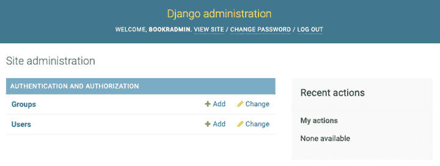
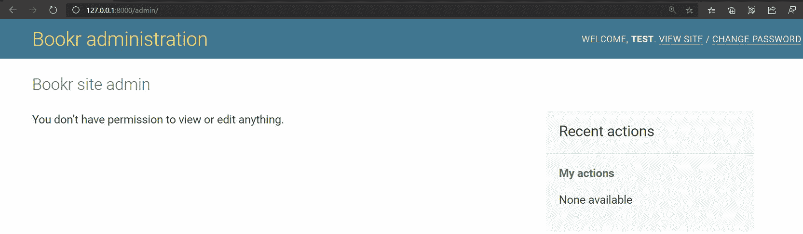
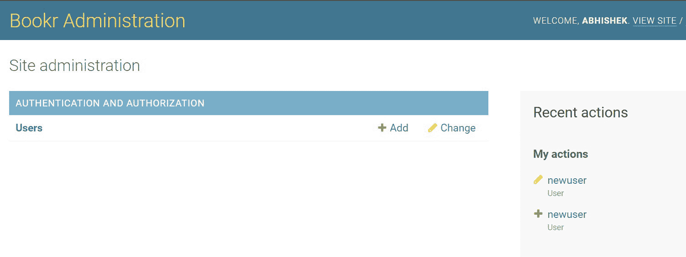
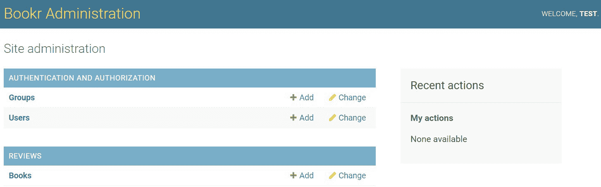
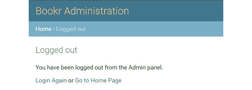
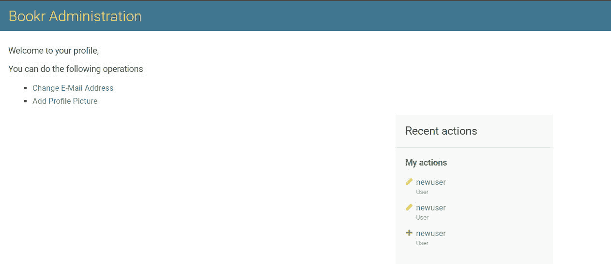

# 第十章：10. 高级 Django 管理及自定义

概述

本章向您介绍了对**Django 管理**站点的高级自定义，以便您可以根据您的 Web 项目定制 Django 管理仪表板的外观，使其与您的 Web 项目融为一体。您将了解如何将新功能和能力添加到您的 Web 项目的 Django 管理界面，使其在实现项目目标方面更加强大和有用。这些自定义是通过添加自定义模板来实现的，这些模板有助于修改现有页面的外观和感觉。这些自定义模板还添加了新的视图，可以帮助扩展管理仪表板的默认功能。完成本章学习后，您将掌握不仅可以让您自定义界面，还可以自定义基于 Django 的项目管理页面的功能。

# 简介

假设我们想要自定义一个大组织管理站点的首页。我们希望展示组织内不同系统的健康状况，并查看任何活跃的高优先级警报。如果这是一个基于 Django 构建的内部网站，我们就需要对其进行自定义。添加这些类型的功能将需要 IT 团队的开发者自定义默认管理面板并创建他们自己的自定义`AdminSite`模块，这将渲染与默认管理站点提供的不同的索引页面。幸运的是，Django 使这些类型的自定义变得容易。

在本章中，我们将探讨如何利用 Django 框架及其可扩展性来自定义 Django 的默认管理界面（如图*10.1*所示）。我们不仅将学习如何使界面更加个性化；我们还将学习如何控制管理站点的不同方面，使 Django 加载自定义管理站点而不是默认框架提供的那一个。当我们需要在管理站点中引入默认情况下不存在的功能时，这种自定义会非常有用。



图 10.1：默认 Django 管理面板界面

本章基于我们在*第四章*，“Django 管理简介”中练习的技能。为了回顾，我们学习了如何使用 Django 管理站点来控制我们的 Bookr 应用的管理和授权。我们还学习了如何注册模型以读取和编辑其内容，以及如何使用`admin.site`属性来自定义 Django 的管理界面。现在，让我们通过查看如何利用 Django 的`AdminSite`模块来开始自定义管理站点，并添加到我们的 Web 应用管理门户中的强大新功能，来进一步扩展我们的知识。 

# 自定义管理站点

Django 作为 Web 框架，为构建 Web 应用提供了大量的自定义选项。当我们构建项目管理员应用时，我们将使用 Django 提供的相同自由度。

在 *第四章*，*Django 管理员介绍* 中，我们探讨了如何使用 `admin.site` 属性来自定义 Django 管理界面的元素。但如果我们需要更多控制管理员站点的行为呢？例如，假设我们想要为登录页面（或注销页面）使用自定义模板，以便用户访问 Bookr 管理面板时显示。在这种情况下，`admin.site` 提供的属性可能不够用，我们需要构建可以扩展默认管理员站点行为的自定义功能。幸运的是，通过扩展 Django 管理模型中的 `AdminSite` 类，我们可以轻松实现这一点。但在我们开始构建管理员站点之前，让我们首先了解 Django 如何发现管理员文件以及我们如何利用这个管理员文件发现机制在 Django 中构建一个新应用，该应用将作为我们的管理员站点应用。

## 在 Django 中发现管理员文件

当我们在 Django 项目中构建应用时，我们经常使用 `admin.py` 文件来注册我们的模型或创建自定义 `ModelAdmin` 类，以便在管理员界面中与模型进行交互。这些 `admin.py` 文件存储并提供这些信息给我们的项目管理员界面。当我们把 `django.contrib.admin` 添加到 `settings.py` 文件中的 `INSTALLED_APPS` 部分时，Django 会自动发现这些文件：


图 10.2：Bookr 应用结构

如前图所示，我们在 `reviews` 应用目录下有一个 `admin.py` 文件，Django 使用它来自定义 Bookr 的管理员站点。

当管理员应用被添加时，它会尝试在我们正在工作的 Django 项目的每个应用中寻找 `admin` 模块，如果找到一个模块，它就会从该模块加载内容。

## Django 的 AdminSite 类

在我们开始自定义 Django 的管理员站点之前，我们必须了解默认管理员站点是如何由 Django 生成和处理的。

为了为我们提供默认的管理站点，Django 打包了一个名为`admin`的模块，该模块包含一个名为`AdminSite`的类。这个类实现了很多有用的功能和一些智能默认设置，Django 社区认为这些对于实现大多数 Django 网站的有用管理面板非常重要。默认的`AdminSite`类提供了很多内置属性，不仅控制了默认管理站点在浏览器中的外观和感觉，还控制了我们与之交互的方式以及特定交互将导致哪些操作。其中一些默认设置包括站点模板属性，如显示在站点标题中的文本、显示在浏览器标题栏中的文本、与 Django 的`auth`模块集成以验证管理站点，以及一系列其他属性。

在我们构建自定义 Django 网络项目的管理站点的道路上不断前进时，保留 Django 的`AdminSite`类中已经构建的许多有用功能是非常理想的。这正是 Python 面向对象编程概念帮助我们的时候。

当我们开始创建自定义管理站点时，我们将尝试利用 Django 默认的`AdminSite`类提供的现有有用功能集。为此，我们不会从头开始构建一切，而是将致力于创建一个新的子类，该子类继承自 Django 的`AdminSite`类，以利用 Django 已经为我们提供的现有功能集和有用集成。这种方法的优点是，我们可以专注于向我们的自定义管理站点添加新的和有用的功能集，而不是花费时间从头实现基本功能集。例如，以下代码片段展示了我们如何创建 Django 的`AdminSite`类的子类：

```py
class MyAdminSite(admin.AdminSite):
    …
```

为了开始为我们网络应用构建自定义管理站点，让我们首先通过使用我们将要工作的自定义`AdminSite`类来覆盖 Django 管理面板的一些基本属性。

可以覆盖的一些属性包括`site_header`、`site_title`等。

注意

当创建一个自定义管理站点时，我们必须再次注册任何之前使用默认的`admin.site`变量注册的`Model`和`ModelAdmin`类。这是因为自定义管理站点不会从 Django 提供的默认管理站点继承实例详情，除非我们重新注册我们的`Model`和`ModelAdmin`接口，否则我们的自定义管理站点将不会显示它们。

现在，了解了 Django 如何发现加载到管理界面中的内容以及我们如何开始构建自定义管理站点后，让我们继续尝试为 Bookr 创建自定义管理应用程序，该应用程序扩展了 Django 提供的现有`admin`模块。在接下来的练习中，我们将使用 Django 的`AdminSite`类为 Bookr 应用程序创建自定义管理站点界面。

## 练习 10.01：为 Bookr 创建自定义管理站点

在这个练习中，您将创建一个新的应用程序，该应用程序扩展了默认的 Django 管理站点，并允许您自定义界面的组件。因此，您将自定义 Django 管理面板的默认标题。完成此操作后，您将覆盖 Django 的`admin.site`属性的默认值，将其指向您自定义的管理站点：

1.  在您开始工作于自定义管理站点之前，首先需要确保您位于项目中可以运行 Django 应用程序管理命令的正确目录。为此，使用终端或 Windows 命令提示符导航到`bookr`目录，然后运行以下命令创建一个名为`bookr_admin`的新应用程序，该应用程序将作为 Bookr 的管理站点：

    ```py
    python3 manage.py startapp bookr_admin
    ```

    一旦这个命令成功执行，您应该在项目中有一个名为`bookr_admin`的新目录。

1.  现在，默认结构配置完成后，下一步是创建一个名为`BookrAdmin`的新类，该类将扩展 Django 提供的`AdminSite`类以继承默认管理站点的属性。为此，打开 PyCharm 中`bookr_admin`目录下的`admin.py`文件。一旦文件打开，您将看到文件中已经存在以下代码片段：

    ```py
    from django.contrib import admin
    ```

    现在，保持这个`import`语句不变，从下一行开始，创建一个名为`BookrAdmin`的新类，该类继承自您之前导入的`admin`模块提供的`AdminSite`类：

    ```py
    class BookrAdmin(admin.AdminSite):
    ```

    在这个新的`BookrAdmin`类内部，覆盖`site_header`变量的默认值，该变量负责在 Django 管理面板中渲染站点标题，通过设置`site_header`属性，如下所示：

    ```py
        site_header = "Bookr Administration"
    ```

    通过这样，自定义管理站点类现在已经定义好了。要使用这个类，您首先需要创建这个类的实例。这可以通过以下方式完成：

    ```py
    admin_site = BookrAdmin(name='bookr_admin')
    ```

1.  保存文件，但不要关闭它；我们将在第 6 步中再次访问它。接下来，让我们编辑`bookr`应用中的`urls.py`文件。

1.  现在自定义类已经定义好了，下一步是修改`urlpatterns`列表，将我们项目中`/admin`端点映射到您创建的新`AdminSite`类。为此，打开 PyCharm 中`Bookr`项目目录下的`urls.py`文件，并将`/admin`端点的映射更改为指向我们的自定义站点：

    ```py
    admin_site object from the admin module of the bookr_admin app. Then, we used the urls property of the object to map to the admin endpoint in our application as follows:

    ```

    `path('admin/', admin_site.urls)`

    ```py

    In this case, the `urls` property of our `admin_site` object is being automatically populated by the `admin.AdminSite` base class provided by Django's `admin` module. Once complete, your `urls.py` file should look like this: [`packt.live/3qjx46J`](http://packt.live/3qjx46J).
    ```

1.  现在，配置完成后，让我们在浏览器中运行我们的管理应用。为此，从包含 `manage.py` 文件的项目的根目录运行以下命令：

    ```py
    python manage.py runserver localhost:8000
    ```

    然后，导航到 `http://localhost:8000/admin`（或 `http://127.0.0.1:8000/admin`），这将打开一个类似于以下截图的页面：

    

    图 10.3：自定义 Bookr 管理站点的首页视图

    在前面的截图（*图 10.3*）中，你会看到 Django 显示消息，“你没有权限查看或编辑任何内容”。没有足够权限的问题发生是因为，到目前为止，我们还没有将任何模型注册到我们的自定义 `AdminSite` 实例中。这个问题也适用于与 Django `auth` 模块一起提供的 `User 和 Groups` 模型。因此，让我们通过从 Django 的 `auth` 模块注册 `User` 模型，使我们的自定义管理站点更有用。

1.  要从 Django 的 `auth` 模块注册 `User` 模型，打开 PyCharm 中 `bookr_admin` 目录下的 `admin.py` 文件，并在文件顶部添加以下行：

    ```py
    from django.contrib.auth.admin import User
    ```

    在文件末尾，使用您的 `BookrAdmin` 实例按以下方式注册此模型：

    ```py
    admin_site.register(User)
    ```

    到目前为止，您的 `admin.py` 文件应该看起来像这样：

    ```py
    from django.contrib import admin
    from django.contrib.auth.admin import User
    class BookrAdmin(admin.AdminSite):
        site_header = "Bookr Administration"
    admin_site = BookrAdmin(name='bookr_admin')
    admin_site.register(User)
    ```

    完成此操作后，重新加载网络服务器并访问 `http://localhost:8000/admin`。现在，你应该能够在管理界面中看到用于编辑的 `User` 模型，如图所示：

    

图 10.4：显示我们在 Bookr 管理站点注册的模型的首页视图

通过这种方式，我们刚刚创建了我们的管理站点应用，现在我们也可以验证自定义站点有一个不同的标题——“Bookr 管理”。

## 覆盖默认的 admin.site

在上一节中，在我们创建自己的 `AdminSite` 应用程序之后，我们看到了我们必须手动注册模型。这是因为我们之前构建的大多数应用程序仍然使用 `admin.site` 属性来注册它们的模型，如果我们想使用我们的 `AdminSite` 实例，我们必须更新所有这些应用程序以使用我们的实例，如果项目中有许多应用程序，这可能会变得很繁琐。

幸运的是，我们可以通过覆盖默认的 `admin.site` 属性来避免这个额外的负担。为此，我们首先必须创建一个新的 `AdminConfig` 类，它将为我们覆盖默认的 `admin.site` 属性，使我们的应用程序被标记为默认管理站点，从而覆盖我们项目中的 `admin.site` 属性。在下一个练习中，我们将探讨如何将我们的自定义管理站点映射为应用程序的默认管理站点。

## 练习 10.02：覆盖默认 Admin Site

在这个练习中，您将使用 `AdminConfig` 类来覆盖您项目的默认管理站点，这样您就可以继续使用默认的 `admin.site` 变量来注册模型、覆盖站点属性等：

1.  打开 `bookr_admin` 目录下的 `admin.py` 文件，并移除对 `User` 模型的导入以及 `BookrAdmin` 实例创建，这些是在 *练习 10.01* 的 *步骤 6* 中编写的。完成此操作后，文件内容应类似于以下内容：

    ```py
    from django.contrib import admin
    class BookrAdmin(admin.AdminSite):
        site_header = "Bookr Administration"
    ```

1.  您需要为自定义管理站点创建一个 `AdminConfig` 类，以便 Django 识别 `BookrAdmin` 类作为 `AdminSite` 并覆盖 `admin.site` 属性。为此，打开 `bookr_admin` 目录中的 `apps.py` 文件，并用以下内容覆盖文件内容：

    ```py
    from django.contrib.admin.apps import AdminConfig
    class BookrAdminConfig(AdminConfig):
        default_site = 'bookr_admin.admin.BookrAdmin'
    ```

    在此，我们首先从 Django 的 `admin` 模块中导入了 `AdminConfig` 类。此类用于定义应用作默认管理站点的应用程序，并覆盖 Django 管理站点的默认行为。

    对于我们的用例，我们创建了一个名为 `BookrAdminConfig` 的类，它作为 Django 的 `AdminConfig` 类的子类，并覆盖了 `default_site` 属性，将其指向我们的 `BookrAdmin` 类，即我们的自定义管理站点：

    ```py
    default_site = 'bookr_admin.admin.BookrAdmin'
    ```

    完成此操作后，我们需要在我们的 `Bookr` 项目中将我们的应用程序设置为管理应用程序。为此，打开 `Bookr` 项目的 `settings.py` 文件，并在 `INSTALLED_APPS` 部分下，将 `'reviews.apps.ReviewsAdminConfig'` 替换为 `'bookr_admin.apps.BookrAdminConfig'`。`settings.py` 文件应如下所示：[`packt.live/3siv1lf`](http://packt.live/3siv1lf)。

1.  将应用程序映射为管理应用程序后，最后一步是修改 URL 映射，以便 `'admin/'` 端点使用 `admin.site` 属性来找到正确的 URL。为此，打开 bookr 项目下的 `urls.py` 文件。考虑 `urlpatterns` 列表中的以下条目：

    ```py
    path('admin/', adminadmin_site.urls is a module, while admin.site is a Django internal property. Once the preceding steps are complete, let's reload our web server and check whether our admin site loads by visiting `http://localhost:8000/admin`. If the website that loads looks like the one shown here, we have our own custom admin app now being used for the admin interface:
    ```

图 10.5：自定义 Bookr 管理站点的首页视图

如您所见，一旦我们用我们的管理应用覆盖了 `admin.site`，之前使用 `admin.site.register` 属性注册的模型就会自动显示出来。

通过这种方式，我们现在有一个自定义的基本模板，我们可以利用它来构建我们 Django 管理自定义的其余部分。随着我们通过本章的学习，我们将发现一些有趣的定制，使我们能够将管理仪表板集成到我们的应用程序中。

## 使用 AdminSite 属性自定义管理站点文本

正如我们可以使用`admin.site`属性来自定义 Django 应用程序的文本一样，我们也可以使用`AdminSite`类公开的属性来自定义这些文本。在*练习 10.02*，*覆盖默认管理网站*中，我们查看更新了管理网站的`site_header`属性。同样，还有许多其他属性我们可以修改。以下是一些可以覆盖的属性描述如下：

+   `site_header`: 在每个管理页面的顶部显示的文本（默认为`Django 管理`）。

+   `site_title`: 在浏览器标题栏中显示的文本（默认为`Django 管理网站`）。

+   `site_url`: 用于“查看网站”选项的链接（默认为`/`）。当网站在自定义路径上运行时，此设置会被覆盖，并且重定向应将用户直接带到子路径。

+   `index_title`: 这是应该在管理应用程序的索引页上显示的文本（默认为`站点管理`）。

    注意

    关于所有`adminsite`属性的更多信息，请参阅官方 Django 文档[`docs.djangoproject.com/en/3.1/ref/contrib/admin/#adminsite-attributes`](https://docs.djangoproject.com/en/3.1/ref/contrib/admin/#adminsite-attributes)。

如果我们想在自定义管理网站上覆盖这些属性，过程非常简单：

```py
class MyAdminSite(admin.AdminSite):
    site_header = "My web application"
    site_title = "My Django Web application"
    index_title = "Administration Panel"
```

如我们迄今为止所看到的示例，我们已经为 Bookr 创建了一个自定义管理应用，并将其设置为项目的默认管理网站。这里出现了一个有趣的问题。由于我们迄今为止所自定义的属性也可以通过直接使用`admin.site`对象来自定义，为什么我们要创建一个自定义管理应用？我们难道不能直接修改`admin.site`的属性吗？

事实上，有人选择自定义管理网站可能有多个原因；例如，他们可能想要更改默认管理网站的布局，以使其与应用程序的整体布局保持一致。这在创建一个对内容同质性要求很高的企业级 Web 应用时非常常见。以下是一个简短的列表，这些要求可能会促使开发者去构建一个自定义管理网站，而不是仅仅修改`admin.site`变量的属性：

+   需要覆盖管理界面的索引模板

+   需要覆盖登录或注销模板

+   需要在管理界面中添加自定义视图

## 自定义管理网站模板

就像一些可定制的通用文本，例如出现在管理网站上的`site_header`和`site_title`，Django 也允许我们通过在`AdminSite`类中设置某些属性来自定义模板，这些模板用于在管理网站内部渲染不同的页面。

这些自定义可以包括修改用于渲染索引页面、登录页面、模型数据页面等模板。这些自定义可以通过利用 Django 提供的模板系统轻松完成。例如，以下代码片段展示了我们如何向 Django 管理员仪表板添加一个新的模板：

```py


  <!-- Template Content -->

```

在这个自定义模板中，有几个重要的方面我们需要理解。

当通过修改仪表板内某些页面的外观或向仪表板添加一组新页面来自定义现有的 Django 管理员仪表板时，我们可能不想从头开始重新编写每个 HTML 片段以保持 Django 管理员仪表板的基本外观和感觉。

通常，在自定义管理员仪表板时，我们希望保留 Django 组织仪表板上显示的不同元素的布局，这样我们就可以专注于修改对我们重要的页面部分。这个页面的基本布局，以及常见的页面元素，如页面标题和页面页脚，都在 Django 管理员的基模板中定义，该模板还充当默认 Django 管理员网站内所有页面的主模板。

为了保留 Django 管理员页面内常见元素的组织和渲染方式，我们需要从这个基模板扩展，使得我们的自定义模板页面提供与 Django 管理员仪表板内其他页面一致的用户体验。这可以通过使用模板扩展标签并从 Django 提供的`admin`模块扩展`base_site.html`模板来完成：

```py

```

完成此操作后，下一步是定义我们自己的自定义模板内容。Django 提供的`base_site.html`模板提供了一个基于块的占位符，供开发者为模板添加自己的内容。要添加此内容，开发人员必须在``标签内放置他们自己的页面自定义元素逻辑。这本质上覆盖了`base_site.html`模板内定义的任何``标签内容，遵循 Django 模板继承的概念。

现在，让我们看看我们如何自定义用于渲染注销页面的模板，一旦用户在管理员面板中点击“注销”按钮。

## 练习 10.03：为 Bookr 管理员网站自定义注销模板

在这个练习中，你将自定义一个模板，该模板用于在用户点击管理员网站上的“注销”按钮后渲染注销页面。这种覆盖在银行网站上可能会很有用。一旦用户点击“注销”，银行可能希望向用户展示一个页面，其中包含有关如何确保其银行会话安全关闭的详细说明。

1.  在你之前章节中必须创建的`templates`目录下，创建另一个名为`admin`的目录，该目录将用于存储你自定义管理员网站的模板。

    注意

    在继续之前，请确保将模板目录添加到你的`settings.py`文件中的`DIRS`列表（在`bookr/项目`下）。

1.  现在，随着目录结构设置完成，并且 Django 配置为加载模板，下一步涉及编写你想要渲染的自定义注销模板。为此，让我们在*步骤 1*中创建的`templates/admin`目录下创建一个名为`logout.html`的新文件，并将以下内容添加到其中：

    ```py
    
    
    <p>You have been logged out from the Admin panel. </p>
    <p><a href="">Login Again</a> or   <a href="{{ site_url }}">Go to Home Page</a></p>
    
    ```

    在前面的代码片段中，我们做了几件事情。首先，对于我们的自定义注销模板，我们将使用由`django.contrib.admin`模块提供的相同主布局。所以，考虑以下内容：

    ```py
    
    ```

    当我们编写这段代码时，Django 会尝试在由`django.contrib.admin`模块提供的`templates`目录中查找并加载`admin/base_site.html`模板。

    现在，随着我们的基础模板设置完毕，接下来我们要尝试通过执行以下命令来覆盖内容块的 HTML：

    ```py
    
    …
    
    ```

    `admin:index`和`site_url`的值由`AdminSite`类自动提供，基于我们定义的设置。

    使用`admin:index`和`site_url`的值，我们创建了一个名为“再次登录”的超链接，当点击时，将用户带回到登录表单，以及一个“返回”主页的链接，这将带用户回到网站的主页。文件现在应该看起来像这样：[`packt.live/3oIGQPo`](http://packt.live/3oIGQPo)。

1.  现在，自定义模板已经定义好了，下一步就是在我们自定义的 admin 站点中使用这个自定义模板。为此，让我们打开位于`bookr_admin`目录下的`admin.py`文件，并将以下字段添加为`BookrAdmin`类的最后一个值：

    ```py
    logout_template = 'admin/logout.html'
    ```

    保存文件。它应该看起来像这样：[`packt.live/3oHHsVz`](http://packt.live/3oHHsVz)。

1.  一旦所有前面的步骤都完成，让我们通过运行以下命令来启动我们的开发服务器：

    ```py
    python manage.py runserver localhost:8000
    ```

    然后，我们导航到`http://localhost:8000/admin`。

    一旦你到了那里，尝试登录然后点击“注销”。一旦你注销，你会看到以下页面呈现：

    ![图 10.6：点击注销按钮后向用户呈现的注销视图]

    

图 10.6：点击注销按钮后向用户呈现的注销视图

通过这样，我们已经成功覆盖了我们的第一个模板。同样，我们也可以覆盖 Django admin 面板中的其他模板，例如索引视图和登录表单的模板。

# 向 Admin 站点添加视图

就像 Django 内部的一般应用程序可以有多个与之关联的视图一样，Django 允许开发者向 admin 站点添加自定义视图。这允许开发者扩展 admin 站点界面的功能范围。

将自己的观点添加到管理站点的能力为网站的行政面板提供了很多可扩展性，这可以用于几个额外的用例。例如，正如我们在本章开头所讨论的，一个大组织的 IT 团队可以向管理站点添加一个自定义视图，然后可以使用它来监控组织内不同 IT 系统的健康状况，并为 IT 团队提供快速查看任何需要解决的紧急警报的能力。

现在，我们需要回答的下一个问题是：*我们如何向管理站点添加一个自定义视图？*

实际上，在管理模板中添加新视图相当简单，遵循了我们创建应用程序视图时使用的方法，尽管有一些小的修改。在下一节中，我们将探讨如何将新视图添加到我们的 Django 管理仪表板。

## 创建视图函数

向 Django 应用程序添加新视图的第一步是创建一个视图函数，该函数实现了处理视图的逻辑。在前面的章节中，我们在一个名为`views.py`的单独文件中创建了视图函数，该文件用于存放我们所有的基于方法和类的视图。

当涉及到向 Django 管理仪表板添加新视图时，为了创建新视图，我们需要在我们的自定义`AdminSite`类中定义一个新的视图函数。例如，为了添加一个渲染组织内不同 IT 系统健康状况的页面的新视图，我们可以在自定义`AdminSite`类实现中创建一个名为`system_health_dashboard()`的新视图函数，如下面的代码片段所示：

```py
class SysAdminSite(admin.AdminSite):
    def system_health_dashboard(self, request):
        # View function logic
```

在视图函数内部，我们可以执行任何我们想要的操作来生成视图，并最终使用该响应来渲染模板。在这个视图函数内部，有一些重要的逻辑我们需要确保正确实现。

第一种方法是在视图函数内部为`request`字段的`current_app`属性设置值。这是为了允许 Django 的 URL 解析器在模板中正确解析应用程序的视图函数。为了在刚刚创建的自定义视图函数中设置此值，我们需要按照以下代码片段设置`current_app`属性：

```py
request.current_app = self.name
```

`self.name`字段由 Django 的`AdminSite`类自动填充，我们不需要显式地初始化它。有了这个，我们的最小自定义视图实现将如以下代码片段所示：

```py
class SysAdminSite(admin.AdminSite):
    def system_health_dashboard(self, request):
        request.current_app = self.name
        # View function logic
```

## 访问常用模板变量

当创建自定义视图函数时，我们可能希望访问常用的模板变量，例如`site_header`和`site_title`，以便在关联的视图函数模板中正确渲染它们。实际上，通过使用`AdminSite`类提供的`each_context()`方法，这相当容易实现。

`AdminSite` 类的 `each_context()` 方法接受一个单一参数 `request`，它是当前请求上下文，并返回要插入到所有管理站点模板中的模板变量。

例如，如果我们想在自定义视图函数内部访问模板变量，我们可以实现类似于以下代码片段的代码：

```py
def system_health_dashboard(self, request):
    request.current_app = self.name
    context = self.each_context(request)
    # view function logic
```

`each_context()` 方法返回的值是一个包含变量名称和相关值的字典。

## 映射自定义视图的 URL

一旦定义了视图函数，下一步就是将该视图函数映射到一个 URL，以便用户可以访问它或允许其他视图链接到它。对于在 `AdminSite` 内定义的视图，这种 URL 映射由 `AdminSite` 类实现的 `get_urls()` 方法控制。`get_urls()` 方法返回映射到 `AdminSite` 视图的 `urlpatterns` 列表。

如果我们想要为我们的自定义视图添加 URL 映射，首选的方法是在我们的自定义 `AdminSite` 类中覆盖 `get_urls()` 的实现，并在那里添加 URL 映射。以下代码片段展示了这种方法：

```py
class SysAdminSite(admin.AdminSite):
    def get_urls(self):
        base_urls = super().get_urls(). # Get the existing set of URLs
        # Define our URL patterns for custom views
        urlpatterns = [path("health_dashboard/"),\
                           (self.system_health_dashboard)]
        # Return the updated mapping
        return base_urls + urlpatterns. 
```

`get_urls()` 方法通常由 Django 自动调用，因此不需要对其进行任何手动处理。

完成此操作后，最后一步是确保我们的自定义管理视图只能通过管理站点访问，并且非管理员用户不应能够访问它。让我们看看如何实现这一点。

## 将自定义视图限制在管理站点

如果你仔细阅读了所有前面的部分，你现在应该有一个自定义的 `AdminSite` 视图可以使用了。然而，有一个小问题。这个视图也可以被任何不在管理站点上的用户直接访问。

为了确保这种情况不会发生，我们需要将此视图限制在管理站点。这可以通过将我们的 URL 路径包裹在 `admin_view()` 调用中来实现，如下面的代码片段所示：

```py
urlpatterns = [self.admin_view\
               (path("health_dashboard/"),\
               (self.system_health_dashboard))]
```

`admin_view` 函数确保传递给它的路径仅限于管理仪表板，并且没有非管理员权限的用户可以访问它。

现在，让我们为我们管理站点添加一个新的自定义视图。

## 练习 10.04：将自定义视图添加到管理站点

在这个练习中，你将为管理站点添加一个自定义视图，该视图将渲染用户资料，并显示用户修改电子邮件或添加新个人照片的选项。要构建这个自定义视图，请遵循以下步骤描述：

1.  打开位于 `bookr_admin` 目录下的 `admin.py` 文件，并添加以下导入。这些将用于在管理站点应用程序内部构建我们的自定义视图：

    ```py
    from django.template.response import TemplateResponse
    from django.urls import path
    ```

1.  打开位于 `bookr_admin` 目录下的 `admin.py` 文件，并在 `BookrAdmin` 类中创建一个名为 `profile_view` 的新方法，该方法接受一个 `request` 变量作为其参数：

    ```py
    def profile_view(self, request):
    ```

    接下来，在方法内部，获取当前应用程序的名称并将其设置在`request`上下文中。为此，你可以使用类的`name`属性，该属性由 Django 自动填充。要获取此属性并将其设置在您的`request`上下文中，您需要添加以下行：

    ```py
    request.current_app = self.name
    ```

    一旦将应用程序名称填充到请求上下文中，下一步是获取模板变量，这些变量是渲染内容所必需的，例如`site_title`、`site_header`等，在管理模板中。为此，利用`AdminSite`类的`each_context()`方法，该方法从类中提供管理站点模板变量的字典：

    ```py
    context = self.each_context(request)
    ```

    一旦设置了数据，最后一步是返回一个`TemplateResponse`对象，当有人访问映射到您自定义视图的 URL 端点时，它将渲染自定义配置文件模板：

    ```py
    return TemplateResponse(request, "admin/admin_profile.html", \
                            context)
    ```

1.  现在已经创建了视图函数，下一步是让`AdminSite`返回将视图映射到`AdminSite`内部路径的 URL 映射。为此，您需要创建一个名为`get_urls()`的新方法，该方法覆盖了`AdminSite.get_urls()`方法并返回您新视图的映射。这可以通过首先在您为自定义管理站点创建的`BookrAdmin`类中创建一个名为`get_urls()`的新方法来完成：

    ```py
    def get_urls(self):
    ```

    在此方法中，您需要做的第一件事是获取已映射到管理端点的 URL 列表。这是必需的步骤，否则，您的自定义管理站点将无法加载与模型编辑页面、注销页面等相关联的任何结果，如果这种映射丢失。要获取此映射，请调用从`BookrAdmin`类派生的基类的`get_urls()`方法：

    ```py
    urls = super().get_urls()
    ```

    一旦捕获了基类的 URL，下一步是创建一个 URL 列表，将我们的自定义视图映射到管理站点的 URL 端点。为此，我们创建一个名为`url_patterns`的新列表，并将我们的`profile_view`方法映射到`admin_profile`端点。为此，我们使用 Django 的`path`实用函数，该函数允许我们将视图函数与基于字符串的 API 端点路径映射：

    ```py
    url_patterns = [path("admin_profile", self.profile_view)]
    return urls + url_patterns
    ```

    保存`admin.py`文件。它应该看起来像这样：[`packt.live/38Jlyvz`](http://packt.live/38Jlyvz)。

1.  现在，已经为新的视图配置了`BookrAdmin`类，下一步是创建管理配置文件页面的模板。为此，在项目根目录下的`templates/admin`目录中创建一个名为`admin_profile.html`的新文件。在这个文件中，首先添加一个`extend`标签以确保您是从默认的`admin`模板扩展的：

    ```py
    
    ```

    此步骤确保您的所有管理模板样式表和 HTML 都可以在自定义视图模板中使用。例如，如果没有这个`extend`标签，您的自定义视图将不会显示任何已映射到您的管理站点的特定内容，如`site_header`、`site_title`或任何注销或转到其他页面的链接。

    一旦添加了扩展标签，添加一个 `block` 标签并提供内容值。这确保了你在 `…` 段落之间添加的代码会覆盖 Django 管理模块预先打包的 `index.html` 模板中存在的任何值：

    ```py
    
    ```

    在 `block` 标签内部，添加渲染在练习的第二步中创建的配置文件视图所需的 HTML：

    ```py
    <p>Welcome to your profile, {{ username }}</p>
    <p>You can do the following operations</p>
    <ul>
        <li><a href="#">Change E-Mail Address</a></li>
        <li><a href="#">Add Profile Picture</a></li>
    </ul>
    
    ```

    文件应该看起来像这样：[`packt.live/2MZhU8d`](http://packt.live/2MZhU8d)。

1.  现在完成前面的步骤后，通过运行 `python manage.py runserver localhost:8000` 来重新加载你的应用程序服务器，然后访问 `http://localhost:8000/admin/admin_profile`。

    当页面打开时，你可以期待看到以下截图：

    

图 10.7：管理站点中的配置文件页面视图

注意

到目前为止创建的视图将正常渲染，无论用户是否登录到管理应用程序。

为了确保这个视图只能被登录的管理员访问，你需要在练习的第三步中定义的 `get_urls()` 方法内部进行一个小修改。

在 `get_urls()` 方法中，修改 `url_patterns` 列表，使其看起来像下面这样：

```py
url_patterns = [path("admin_profile", \
                self.admin_view(self.profile_view)),]
```

在前面的代码中，你将 `profile_view` 方法包裹在 `admin_view()` 方法内部。

`AdminSite.admin_view()` 方法使得视图仅限于已登录的用户。如果一个当前未登录管理站点的用户尝试直接访问 URL，他们将被重定向到登录页面，并且只有在成功登录的情况下，他们才能看到我们自定义页面的内容。

在这个练习中，我们利用了我们对为 Django 应用编写视图的现有理解，并将其与 `AdminSite` 类的上下文相结合，为我们的管理仪表板构建了一个自定义视图。有了这些知识，我们现在可以继续前进，并为我们的 Django 管理添加有用的功能。

## 使用模板变量传递额外的键

在管理站点内部，传递给模板的变量值是通过使用模板变量来传递的。这些模板变量是由 `AdminSite.each_context()` 方法准备并返回的。

现在，如果你想要将某个值传递到你的管理站点上的所有模板，你可以覆盖 `AdminSite.each_context()` 方法，并将所需的字段添加到 `request` 上下文中。让我们通过一个例子看看我们如何实现这个结果。

考虑到 `username` 字段，我们之前将其传递给了我们的 `admin_profile` 模板。如果我们想将其传递到自定义管理站点内的每个模板，我们首先需要在 `BookrAdmin` 类内部覆盖 `each_context()` 方法，如下所示：

```py
def each_context(self, request):
        context = super().each_context(request)
        context['username'] = request.user.username
        return context
```

`each_context()`方法接受一个单一参数（这里我们不考虑 self），它使用该参数来评估某些其他值。

现在，在我们的重写`each_context()`方法中，我们首先调用基类`each_context()`方法，以便检索管理网站的`context`字典：

```py
context = super().each_context(request)
```

完成此操作后，接下来要做的是将我们的`username`字段添加到`context`中，并将其值设置为`request.user.username`字段的值：

```py
context['username'] = request.user.username
```

完成此操作后，最后剩下的事情就是返回这个修改后的上下文。

现在，每当我们的自定义管理网站渲染模板时，模板将带有这个额外的用户名变量。

## 活动十点零一：使用内置搜索构建自定义管理仪表板

在这个活动中，您将使用您在创建自定义管理网站的不同方面获得的知识来为 Bookr 构建自定义管理仪表板。在这个仪表板中，您将引入允许用户通过书籍名称或书籍出版社的名称搜索书籍的能力，并允许用户修改或删除这些书籍记录。

以下步骤将帮助您构建自定义管理仪表板，并添加通过出版社名称搜索书籍记录的功能：

1.  在 Bookr 项目中创建一个新的应用，命名为`bookr_admin`，如果尚未创建。这将存储我们自定义管理网站的逻辑。

1.  在`bookr_admin`目录下的`admin.py`文件中，创建一个新的类`BookrAdmin`，该类继承自 Django 管理模块的`AdminSite`类。

1.  在*步骤 2*中新建的`BookrAdmin`类中，添加对站点标题或其他管理仪表板品牌组件的任何自定义设置。

1.  在`bookr_admin`目录下的`apps.py`文件中，创建一个新的`BookrAdminConfig`类，并在新的`BookrAdminConfig`类中，将默认站点属性设置为我们的自定义管理网站类`BookrAdmin`的完全限定模块名称。

1.  在您的 Django 项目的`settings.py`文件中，将创建于*步骤 4*的`BookrAdminConfig`类的完全限定路径作为第一个安装的应用程序。

1.  要在 Bookr 中注册来自`reviews`应用的`Books`模型，打开`reviews`目录下的`admin.py`文件，并确保使用`admin.site.register(ModelClass)`将 Books 模型注册到管理网站。

1.  为了允许根据出版社名称搜索书籍，在`reviews`应用的`admin.py`文件中，修改`BookAdmin`类，并向其中添加一个名为`search_fields`的属性，该属性包含`publisher_name`字段。

1.  为了正确获取`search_fields`属性的出版社名称，在`BookAdmin`类中引入一个新的方法`get_publisher`，该方法将从`Book`模型返回出版社的名称字段。

1.  确保使用`admin.site.register(Book, BookModel)`在我们的 Django 管理仪表板中将`BookAdmin`类注册为书籍模型的模型管理类。

完成此活动后，一旦您启动应用程序服务器并访问 `http://localhost:8000/admin` 并导航到书籍模型，您应该能够通过使用出版社的名称来搜索书籍，在搜索成功的情况下，您将看到一个类似于以下截图所示的页面：

![图 10.8：Bookr 管理仪表板内的书籍编辑页面

![img/B15509_10_08.jpg]

图 10.8：Bookr 管理仪表板内的书籍编辑页面

注意

此活动的解决方案可以在[`packt.live/2Nh1NTJ`](http://packt.live/2Nh1NTJ)找到。

# 摘要

在本章中，我们探讨了 Django 如何允许自定义其管理站点。它是通过为网站的一些更通用的部分提供易于使用的属性来实现的，例如标题字段、标题和主页链接。除此之外，我们还学习了如何通过利用 Python 面向对象编程的概念来创建`AdminSite`的子类来构建自定义管理站点。

通过实现一个自定义的注销页面模板，我们进一步增强了此功能。我们还学习了如何通过添加一组新的视图来增强我们的管理仪表板。

随着我们进入下一章，我们将通过学习如何为模板创建我们自己的自定义标签和过滤器来构建我们迄今为止所学的内容。此外，通过使用基于类的视图，我们将获得以面向对象风格构建视图的能力。
