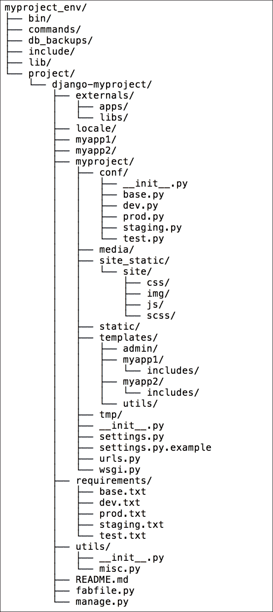
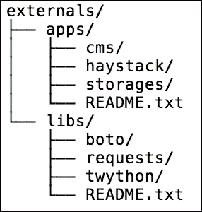

# 第一章：Django 1.8 入门

在本章中，我们将涵盖以下主题：

+   在虚拟环境中工作

+   创建项目文件结构

+   使用 pip 处理项目依赖

+   使你的代码兼容 Python 2.7 和 Python 3

+   在你的项目中包含外部依赖

+   配置开发、测试、预发布和生产环境下的设置

+   在设置中定义相对路径

+   创建和包含本地设置

+   为 Subversion 用户动态设置 STATIC_URL

+   为 Git 用户动态设置 STATIC_URL

+   将 UTF-8 设置为 MySQL 配置的默认编码

+   设置 Subversion 忽略属性

+   创建 Git 忽略文件

+   删除 Python 编译文件

+   尊重 Python 文件中的导入顺序

+   创建应用配置

+   定义可覆盖的应用设置

# 简介

在本章中，我们将探讨在 Python 2.7 或 Python 3 上使用 Django 1.8 开始新项目时的一些良好实践。这里介绍的一些技巧是处理项目布局、设置和配置的最佳方式。然而，对于一些技巧，你可能需要在网络上或其他关于 Django 的书籍中寻找替代方案。在深入 Django 世界的同时，请随意评估并选择最适合你的最佳部分。

我假设你已经熟悉 Django、Subversion 和 Git 版本控制、MySQL 和 PostgreSQL 数据库以及命令行使用的基础知识。我还假设你可能正在使用基于 Unix 的操作系统，如 Mac OS X 或 Linux。在 Unix 基础平台上使用 Django 进行开发更有意义，因为网站很可能会在 Linux 服务器上发布，因此，你可以在开发和部署时建立相同的常规。如果你在 Windows 上本地使用 Django，常规是相似的；然而，它们并不总是相同的。

# 在虚拟环境中工作

你很可能会在你的电脑上开发多个 Django 项目。一些模块，如 Python Imaging Library（或 Pillow）和 MySQLdb，可以安装一次，然后供所有项目共享。其他模块，如 Django、第三方 Python 库和 Django 应用，需要彼此隔离。虚拟环境工具是一种将所有 Python 项目分离到各自领域的实用工具。在本食谱中，我们将了解如何使用它。

## 准备工作

要管理 Python 包，你需要 `pip`。如果你使用的是 Python 2.7.9 或 Python 3.4+，那么 `pip` 已经包含在你的 Python 安装中了。如果你使用的是其他版本的 Python，可以通过执行 [`pip.readthedocs.org/en/stable/installing/`](http://pip.readthedocs.org/en/stable/installing/) 中的安装说明来安装 `pip`。让我们使用以下命令安装共享的 Python 模块 Pillow 和 MySQLdb，以及虚拟环境工具：

```py
$ sudo pip install Pillow
$ sudo pip install MySQL-python
$ sudo pip install virtualenv

```

## 如何做到这一点...

一旦你安装了所有必备条件，创建一个目录来存储你所有的 Django 项目，例如，在你的主目录下创建`virtualenvs`。在创建目录后执行以下步骤：

1.  进入新创建的目录并创建一个使用共享系统 site 包的虚拟环境：

    ```py
    $ cd ~/virtualenvs
    $ mkdir myproject_env
    $ cd myproject_env
    $ virtualenv --system-site-packages .
    New python executable in ./bin/python
    Installing setuptools………….done.
    Installing pip……………done.

    ```

1.  要使用你新创建的虚拟环境，你需要执行当前 shell 中的激活脚本。可以使用以下命令完成：

    ```py
    $ source bin/activate

    ```

    你也可以使用以下命令（注意点与 bin 之间的空格）：

    ```py
    $ . bin/activate

    ```

1.  你会看到命令行工具的提示符前面有了项目名称的前缀，如下所示：

    ```py
    (myproject_env)$

    ```

1.  要退出虚拟环境，请输入以下命令：

    ```py
    $ deactivate

    ```

## 它是如何工作的…

当你创建一个虚拟环境时，会创建一些特定的目录（`bin`、`build`、`include`和`lib`），以便存储 Python 安装的副本，并定义一些共享的 Python 路径。当虚拟环境激活时，使用`pip`或`easy_install`安装的任何内容都将放入并用于虚拟环境的 site 包，而不是 Python 安装的全局 site 包。

要在你的虚拟环境中安装 Django 1.8，请输入以下命令：

```py
(myproject_env)$ pip install Django==1.8

```

## 参见

+   *Creating a project file structure*食谱

+   在第十一章的*Deploying on Apache with mod_wsgi*食谱中，*Testing and Deployment*的*Deploying on Apache with mod_wsgi*食谱

# 创建项目文件结构

为你的项目保持一致的文件结构可以使你更有条理并提高生产效率。当你定义了基本的工作流程后，你可以更快地进入业务逻辑并创建出色的项目。

## 准备工作

如果你还没有这样做，创建一个`virtualenvs`目录，你将在这里保存所有虚拟环境（关于这一点，请参阅*Working with a virtual environment*食谱）。这可以在你的主目录下创建。

然后，为项目环境创建一个目录，例如，`myproject_env`。在其中启动虚拟环境。我建议添加`commands`目录以存储与项目相关的本地 bash 脚本，`db_backups`目录用于数据库转储，以及`project`目录用于你的 Django 项目。此外，在你的虚拟环境中安装 Django。

## 如何操作…

按照以下步骤创建项目的文件结构：

1.  在激活虚拟环境后，转到项目目录并按照以下方式启动一个新的 Django 项目：

    ```py
    (myproject_env)$ django-admin.py startproject myproject

    ```

    为了清晰起见，我们将新创建的目录重命名为`django-myproject`。这是你将置于版本控制下的目录，因此，它将包含`.git`、`.svn`或类似的目录。

1.  在 `django-myproject` 目录中，创建一个 `README.md` 文件来描述您的项目给新开发者。您还可以将带有 Django 版本的 pip 要求包含在内，并包括其他外部依赖（有关此内容，请参阅 *使用 pip 处理项目依赖项* 菜谱）。此外，此目录将包含您的项目 Python 包名为 `myproject`；Django 应用（我建议有一个名为 `utils` 的应用，用于在整个项目中共享的不同功能）；如果项目是多语言的，则包含项目翻译的 `locale` 目录；根据 *创建和使用 Fabric 部署脚本* 菜谱中的建议，创建一个名为 `fabfile.py` 的 Fabric 部署脚本；以及如果您决定不使用 pip 要求，则包含在此项目中的外部依赖的 `externals` 目录。

1.  在您的项目 Python 包 `myproject` 中，创建 `media` 目录用于项目上传，`site_static` 目录用于项目特定的静态文件，`static` 目录用于收集的静态文件，`tmp` 目录用于上传过程，以及 `templates` 目录用于项目模板。此外，`myproject` 目录应包含您的项目设置，`settings.py` 和 `conf` 目录（有关此内容，请参阅 *配置开发、测试、预发布和生产环境设置* 菜谱），以及 `urls.py` URL 配置。

1.  在您的 `site_static` 目录中，创建一个 `site` 目录作为特定于站点的静态文件的命名空间。然后，将分离的静态文件分别放在其中的目录中。例如，`scss` 用于 Sass 文件（可选），`css` 用于生成的最小化层叠样式表，`img` 用于样式化图像和标志，`js` 用于 JavaScript，以及任何组合所有类型文件的第三方模块，例如 tinymce 富文本编辑器。除了 `site` 目录外，`site_static` 目录可能还包含第三方应用的覆盖静态目录，例如 `cms` 覆盖 Django CMS 的静态文件。要使用具有图形用户界面的 CodeKit 或 Prepros 应用程序从 Sass 生成 CSS 文件并压缩 JavaScript 文件。

1.  将您通过应用分离的模板放在您的模板目录中。如果一个模板文件代表一个页面（例如，`change_item.html` 或 `item_list.html`），则直接将其放在应用的模板目录中。如果模板包含在其他模板中（例如，`similar_items.html`），则将其放在包含子目录中。此外，您的模板目录可以包含一个名为 `utils` 的目录，用于全局可重用的片段，例如分页、语言选择器等。

## 如何工作…

在虚拟环境中，一个完整项目的整个文件结构将类似于以下内容：



## 参见

+   *使用 pip 处理项目依赖项* 菜谱

+   *将外部依赖项包含到你的项目中*配方

+   *配置开发、测试、预发布和生产环境的设置*配方

+   [在 Apache 上使用 mod_wsgi 部署](https://wiki.example.org/ch11.html "第十一章。测试和部署")的配方在*测试和部署*的第十一章中

+   第十一章中的*创建和使用 Fabric 部署脚本*配方，*测试和部署*

# 使用 pip 处理项目依赖

pip 是安装和管理 Python 包最方便的工具。除了逐个安装包之外，你还可以定义一个你想要安装的包列表，并将其传递给工具，以便它自动处理该列表。

你将需要至少有两个不同实例的项目：开发环境，在那里你创建新功能，以及通常称为托管服务器上的生产环境的公共网站环境。此外，可能还有其他开发者的开发环境。你还可以有一个测试和预发布环境，以便在本地和类似公共网站的情况下测试项目。

为了良好的可维护性，你应该能够安装开发、测试、预发布和生产环境所需的 Python 模块。其中一些模块将是共享的，而另一些将是特定的。在这个配方中，我们将了解如何组织项目依赖并使用 pip 管理它们。

## 准备工作

在使用此配方之前，你需要安装 pip 并激活虚拟环境。有关如何操作的更多信息，请阅读*使用虚拟环境*配方。

## 如何操作...

依次执行以下步骤，为你的 Django 项目准备 pip 需求：

1.  让我们去你的 Django 项目，该项目在版本控制下，并创建`requirements`目录，包含以下文本文件：`base.txt`用于共享模块，`dev.txt`用于开发环境，`test.txt`用于测试环境，`staging.txt`用于预发布环境，以及`prod.txt`用于生产环境。

1.  编辑`base.txt`并逐行添加所有环境中共享的 Python 模块，例如：

    ```py
    # base.txt
    Django==1.8
    djangorestframework
    -e git://github.com/omab/python-social-auth.git@6b1e301c79#egg=python-social-auth

    ```

1.  如果特定环境的需要与`base.txt`中的相同，请在该环境的需求文件中添加包含`base.txt`的行，例如：

    ```py
    # prod.txt
    -r base.txt
    ```

1.  如果有特定环境的特定要求，请按以下方式添加：

    ```py
    # dev.txt
    -r base.txt
    django-debug-toolbar
    selenium
    ```

1.  现在，你可以运行以下命令来安装开发环境所需的所有依赖项（或适用于其他环境的类似命令），如下所示：

    ```py
    (myproject_env)$ pip install -r requirements/dev.txt

    ```

## 它是如何工作的...

上述命令从您的虚拟环境中的`requirements/base.txt`和`requirements/dev.txt`下载并安装所有项目依赖项。如您所见，您可以指定 Django 框架所需的模块版本，甚至可以直接从 Git 仓库中的`python-social-auth`的特定提交安装。在实践中，从特定提交安装很少有用，例如，只有当您的项目中包含具有特定功能且不再受最新版本支持的第三方依赖项时。

当您的项目中有很多依赖项时，坚持使用 Python 模块的特定版本是一个好习惯，这样您可以确保在部署项目或将其提供给新开发者时，完整性不会受损，并且所有模块都能正常工作，不会发生冲突。

如果您已经手动使用 pip 逐个安装了项目`requirements`，您可以使用以下命令生成`requirements/base.txt`文件：

```py
(myproject_env)$ pip freeze > requirements/base.txt

```

## 更多内容...

如果您想保持简单，并且确信在所有环境中都将使用相同的依赖项，您可以使用一个名为`requirements.txt`的文件，按定义：

```py
(myproject_env)$ pip freeze > requirements.txt

```

要在新环境中安装模块，只需调用以下命令：

```py
(myproject_env)$ pip install -r requirements.txt

```

### 注意

如果您需要从其他版本控制系统或本地路径安装 Python 库，您可以从官方文档中了解更多关于 pip 的信息：[`pip-python3.readthedocs.org/en/latest/reference/pip_install.html`](http://pip-python3.readthedocs.org/en/latest/reference/pip_install.html)。

## 参见

+   *使用虚拟环境工作*食谱

+   *将外部依赖项包含到您的项目中*食谱

+   *配置开发、测试、预生产和生产环境设置*食谱

# 使您的代码兼容 Python 2.7 和 Python 3

自 1.7 版本以来，Django 可以与 Python 2.7 和 Python 3 一起使用。在本食谱中，我们将探讨使您的代码兼容这两个 Python 版本的操作。

## 准备工作

在创建新的 Django 项目或升级旧项目时，请考虑遵循本食谱中给出的规则。

## 如何操作...

使您的代码兼容 Python 的两个版本包括以下步骤：

1.  在每个模块的顶部添加`from __future__ import unicode_literals`，然后使用通常的引号，无需`u`前缀来表示 Unicode 字符串，使用`b`前缀来表示字节字符串。

1.  要确保一个值是字节字符串，请使用`django.utils.encoding.smart_bytes`函数。要确保一个值是 Unicode，请使用`django.utils.encoding.smart_text`或`django.utils.encoding.force_text`函数。

1.  对于您的模型，请使用`__str__`方法而不是`__unicode__`方法，并添加`python_2_unicode_compatible`装饰器，如下所示：

    ```py
    # models.py
    # -*- coding: UTF-8 -*-
    from __future__ import unicode_literals
    from django.db import models
    from django.utils.translation import ugettext_lazy as _
    from django.utils.encoding import \
        python_2_unicode_compatible

    @python_2_unicode_compatible
    class NewsArticle(models.Model):
        title = models.CharField(_("Title"), max_length=200)
        content = models.TextField(_("Content"))

        def __str__(self):
            return self.title

        class Meta:
            verbose_name = _("News Article")
            verbose_name_plural = _("News Articles")
    ```

1.  要遍历字典，请使用`django.utils.six`中的`iteritems()`、`iterkeys()`和`itervalues()`。以下是一个示例：

    ```py
    from django.utils.six import iteritems
    d = {"imported": 25, "skipped": 12, "deleted": 3}
    for k, v in iteritems(d):
        print("{0}: {1}".format(k, v))
    ```

1.  当你捕获异常时，请使用`as`关键字，如下所示：

    ```py
    try:
        article = NewsArticle.objects.get(slug="hello-world")
    except NewsArticle.DoesNotExist as exc:
        pass
    except NewsArticle.MultipleObjectsReturned as exc:
        pass
    ```

1.  要检查值的类型，请使用`django.utils.six`，如下所示：

    ```py
    from django.utils import six
    isinstance(val, six.string_types) # previously basestring
    isinstance(val, six.text_type) # previously unicode
    isinstance(val, bytes) # previously str
    isinstance(val, six.integer_types) # previously (int, long)
    ```

1.  不要使用`xrange`，而应使用`django.utils.six.moves`中的`range`，如下所示：

    ```py
    from django.utils.six.moves import range
    for i in range(1, 11):
        print(i)
    ```

1.  要检查当前版本是 Python 2 还是 Python 3，你可以使用以下条件：

    ```py
    from django.utils import six
    if six.PY2:
        print("This is Python 2")
    if six.PY3:
        print("This is Python 3")
    ```

## 工作原理…

Django 项目中的所有字符串都应被视为 Unicode 字符串。通常，只有`HttpRequest`的输入和`HttpResponse`的输出是以 UTF-8 编码的字节串。

Python 3 中的许多函数和方法现在返回迭代器而不是列表，这使得语言更加高效。为了使代码与两个 Python 版本兼容，你可以使用 Django 中捆绑的 six 库。

在官方 Django 文档中了解更多关于编写兼容代码的信息。[`docs.djangoproject.com/en/1.8/topics/python3/`](https://docs.djangoproject.com/en/1.8/topics/python3/)

### 小贴士

**下载示例代码**

你可以从你购买 Packt 书籍的账户中下载所有示例代码文件。[`www.packtpub.com`](http://www.packtpub.com)。如果你在其他地方购买了这本书，你可以访问[`www.packtpub.com/support`](http://www.packtpub.com/support)并注册，以便直接将文件通过电子邮件发送给你。

# 在你的项目中包含外部依赖项

有时，将外部依赖项包含在你的项目中会更好。这确保了每当第三方模块升级时，所有其他开发者都会在版本控制系统（Git、Subversion 或其他）的下一个更新中收到升级版本。

此外，当从非官方来源（即除了**Python Package Index**（**PyPI**）或不同的版本控制系统之外）获取库时，最好将外部依赖项包含在你的项目中。

## 准备工作

以包含 Django 项目的虚拟环境开始。

## 如何操作…

依次执行以下步骤：

1.  如果你还没有这样做，请在你的 Django 项目`django-myproject`目录下创建一个外部目录。然后，在该目录下创建`libs`和`apps`目录。

    `libs`目录用于你的项目所需的 Python 模块，例如 boto、Requests、Twython、Whoosh 等。`apps`目录用于第三方 Django 应用，例如 django-cms、django-haystack、django-storages 等。

    ### 小贴士

    我强烈建议你在`libs`和`apps`目录中创建`README.txt`文件，其中说明每个模块的用途、使用的版本或修订号以及来源。

1.  目录结构应类似于以下内容：

1.  下一步是将外部库和应用程序添加到 Python 路径中，以便它们被识别为已安装。这可以通过在设置中添加以下代码来完成：

    ```py
    # settings.py
    # -*- coding: UTF-8 -*-
    from __future__ import unicode_literals
    import os
    import sys

    BASE_DIR = os.path.abspath(os.path.join(
        os.path.dirname(__file__), ".."
    ))

    EXTERNAL_LIBS_PATH = os.path.join(
        BASE_DIR, "externals", "libs"
    )
    EXTERNAL_APPS_PATH = os.path.join(
        BASE_DIR, "externals", "apps"
    )
    sys.path = ["", EXTERNAL_LIBS_PATH, EXTERNAL_APPS_PATH] + \
        sys.path
    ```

## 它是如何工作的...

如果你可以运行 Python 并导入该模块，则模块应该位于 Python 路径下。将模块添加到 Python 路径的一种方法是在导入位于非常规位置的模块之前修改`sys.path`变量。`sys.path`的值是一个以空字符串开始的目录列表，表示当前目录，然后是虚拟环境中的目录，最后是 Python 安装的全局共享目录。你可以在 Python shell 中查看`sys.path`的值，如下所示：

```py
(myproject_env)$ python
>>> import sys
>>> sys.path

```

当尝试导入一个模块时，Python 会在这个列表中搜索模块，并返回找到的第一个结果。

因此，我们首先定义`BASE_DIR`变量，它是`settings.py`文件上一级的绝对路径。然后，我们定义`EXTERNAL_LIBS_PATH`和`EXTERNAL_APPS_PATH`变量，它们相对于`BASE_DIR`。最后，我们修改`sys.path`属性，将新路径添加到列表的开头。请注意，我们还添加了一个空字符串作为第一个搜索路径，这意味着在检查其他 Python 路径之前，应该始终检查任何模块的当前目录。

### 小贴士

这种包含外部库的方式在具有 C 语言绑定的 Python 包（例如`lxml`）之间不跨平台工作。对于此类依赖项，我建议使用在*使用 pip 处理项目依赖项*配方中引入的 pip 需求。

## 参见

+   *创建项目文件结构*的配方

+   *使用 pip 处理项目依赖项*的配方

+   *在设置中定义相对路径*的配方

+   在第十章*铃声和哨子*中的*使用 Django shell*配方，第十章

# 配置开发、测试、预发布和生产环境的设置

如前所述，你将在开发环境中创建新功能，然后在测试环境中测试它们，接着将网站部署到预发布服务器，让其他人尝试新功能，最后，网站将被部署到生产服务器以供公众访问。每个环境都可以有特定的设置，你将在这个配方中看到如何组织它们。

## 准备工作

在 Django 项目中，我们将为每个环境创建设置：开发、测试、预发布和生产。

## 如何做到这一点...

按照以下步骤配置项目设置：

1.  在`myproject`目录中，创建一个`conf` Python 模块，包含以下文件：`__init__.py`，`base.py`用于共享设置，`dev.py`用于开发设置，`test.py`用于测试设置，`staging.py`用于预发布设置，以及`prod.py`用于生产设置。

1.  将所有共享设置放在`conf/base.py`中。

1.  如果环境的设置与共享设置相同，则只需从`base.py`中导入所有内容，如下所示：

    ```py
    # myproject/conf/prod.py
    # -*- coding: UTF-8 -*-
    from __future__ import unicode_literals
    from .base import *
    ```

1.  在其他文件中应用您想要附加或覆盖的特定环境的设置，例如，开发环境设置应放在`dev.py`中，如下所示：

    ```py
    # myproject/conf/dev.py
    # -*- coding: UTF-8 -*-
    from __future__ import unicode_literals
    from .base import *
    EMAIL_BACKEND = \
        "django.core.mail.backends.console.EmailBackend"
    ```

1.  在`myproject/settings.py`的开头，从环境设置之一导入配置，然后附加特定的或敏感的配置，例如`DATABASES`或`API`密钥，这些不应置于版本控制之下，如下所示：

    ```py
    # myproject/settings.py
    # -*- coding: UTF-8 -*-
    from __future__ import unicode_literals
    from .conf.dev import *

    DATABASES = {
        "default": {
            "ENGINE": "django.db.backends.mysql",
            "NAME": "myproject",
            "USER": "root",
            "PASSWORD": "root",
        }
    }
    ```

1.  创建一个`settings.py.sample`文件，该文件应包含项目运行所需的所有敏感设置，但设置为空值。

## *它的工作原理…

默认情况下，Django 管理命令使用`myproject/settings.py`中的设置。使用本食谱中定义的方法，我们可以将所有环境所需的非敏感设置都放在 conf 目录下进行版本控制。而`settings.py`文件本身将被版本控制忽略，并且只会包含当前开发、测试、预发布或生产环境所需的设置。

## 参见

+   *创建和包含本地设置*的食谱

+   *在设置中定义相对路径的食谱*

+   *设置 Subversion 忽略属性*的食谱

+   *创建 Git 忽略文件的食谱*

# 在设置中定义相对路径

Django 要求你在设置中定义不同的文件路径，例如媒体根目录、静态文件根目录、模板路径、翻译文件路径等。对于你的项目的每个开发者，路径可能不同，因为虚拟环境可以设置在任何地方，用户可能在 Mac OS X、Linux 或 Windows 上工作。无论如何，有一种方法可以定义这些相对于 Django 项目目录的路径。

## 准备工作

首先，打开`settings.py`。

## 如何操作…

根据需要修改你的路径相关设置，而不是将本地目录的路径硬编码，如下所示：

```py
# settings.py
# -*- coding: UTF-8 -*-
from __future__ import unicode_literals
import os

BASE_DIR = os.path.abspath(
    os.path.join(os.path.dirname(__file__), "..")
)

MEDIA_ROOT = os.path.join(BASE_DIR, "myproject", "media")

STATIC_ROOT = os.path.join(BASE_DIR, "myproject", "static")

STATICFILES_DIRS = (
    os.path.join(BASE_DIR, "myproject", "site_static"),
)

TEMPLATE_DIRS = (
    os.path.join(BASE_DIR, "myproject", "templates"),
)

LOCALE_PATHS = (
    os.path.join(BASE_DIR, "locale"),
)

FILE_UPLOAD_TEMP_DIR = os.path.join(
    BASE_DIR, "myproject", "tmp"
)
```

## *它的工作原理…

首先，我们定义`BASE_DIR`，它是相对于`settings.py`文件的一个更高层的绝对路径。然后，我们使用`os.path.join`函数将所有路径设置为相对于`BASE_DIR`。

## 参见

+   *在项目中包含外部依赖的食谱*

# 创建和包含本地设置

配置不一定是复杂的。如果你想保持简单，你可以使用两个设置文件：`settings.py`用于通用配置，`local_settings.py`用于不应置于版本控制下的敏感设置。

## 准备工作

不同环境的设置的大部分将共享并保存在版本控制中。然而，将会有一些设置是特定于项目实例的环境的，例如数据库或电子邮件设置。我们将它们放在`local_settings.py`文件中。

## 如何操作…

在您的项目中使用本地设置，请执行以下步骤：

1.  在`settings.py`的末尾添加一个`local_settings.py`的版本，它声称位于同一目录中，如下所示：

    ```py
    # settings.py
    # … put this at the end of the file …
    try:
        execfile(os.path.join(
            os.path.dirname(__file__), "local_settings.py"
        ))
    except IOError:
        pass
    ```

1.  创建`local_settings.py`并将您的环境特定设置放在那里，如下所示：

    ```py
    # local_settings.py
    DATABASES = {
        "default": {
            "ENGINE": "django.db.backends.mysql",
            "NAME": "myproject",
            "USER": "root",
            "PASSWORD": "root",
        }
    }

    EMAIL_BACKEND = \
        "django.core.mail.backends.console.EmailBackend"

    INSTALLED_APPS += (
        "debug_toolbar",
    )
    ```

## 它是如何工作的...

如您所见，本地设置通常不是导入的，而是包含并执行在`settings.py`文件本身中。这允许您不仅创建或覆盖现有设置，还可以调整`settings.py`文件中的元组或列表。例如，我们在这里添加`debug_toolbar`到`INSTALLED_APPS`中，以便能够调试 SQL 查询、模板上下文变量等。

## 参见

+   *创建项目文件结构*配方

+   在第十章*铃声和哨子*中的*切换调试工具栏*配方，*铃声和哨子*

# 为 Subversion 用户动态设置 STATIC_URL

如果您将`STATIC_URL`设置为静态值，那么每次您更新 CSS 文件、JavaScript 文件或图像时，您都需要清除浏览器缓存才能看到更改。有一个绕过清除浏览器缓存的方法。那就是在`STATIC_URL`中显示版本控制系统的修订号。每当代码更新时，访客的浏览器将强制加载所有全新的静态文件。

这个配方展示了如何为 Subversion 用户在`STATIC_URL`中放入修订号。

## 准备工作

确保您的项目处于 Subversion 版本控制之下，并在您的设置中定义了`BASE_DIR`，如*在设置中定义相对路径*配方中所示。

然后，在您的 Django 项目中创建`utils`模块，并在其中创建一个名为`misc.py`的文件。

## 如何做到这一点...

将修订号放入`STATIC_URL`设置的程序包括以下两个步骤：

1.  插入以下内容：

    ```py
    # utils/misc.py
    # -*- coding: UTF-8 -*-
    from __future__ import unicode_literals
    import subprocess

    def get_media_svn_revision(absolute_path):
        repo_dir = absolute_path
        svn_revision = subprocess.Popen(
            'svn info | grep "Revision" | awk \'{print $2}\'',
            stdout=subprocess.PIPE, stderr=subprocess.PIPE,
            shell=True, cwd=repo_dir, universal_newlines=True)
        rev = svn_revision.communicate()[0].partition('\n')[0]
        return rev
    ```

1.  然后，修改`settings.py`文件并添加以下行：

    ```py
    # settings.py
    # … somewhere after BASE_DIR definition …
    from utils.misc import get_media_svn_revision
    STATIC_URL = "/static/%s/" % get_media_svn_revision(BASE_DIR)
    ```

## 它是如何工作的...

`get_media_svn_revision()`函数接受`absolute_path`目录作为参数，并在该目录中调用`svn` info shell 命令以找出当前修订号。我们向函数传递`BASE_DIR`，因为我们确信它处于版本控制之下。然后，修订号被解析、返回并包含在`STATIC_URL`定义中。

## 参见

+   为 Git 用户动态设置 STATIC_URL 的配方

+   *设置 Subversion 忽略属性*配方

# 为 Git 用户动态设置 STATIC_URL

如果您不希望在每次更改 CSS 和 JavaScript 文件或调整图像样式时刷新浏览器缓存，您需要使用具有可变路径组件的动态方式设置`STATIC_URL`。使用动态变化的 URL，每当代码更新时，访客的浏览器将强制加载所有全新的未缓存静态文件。在这个配方中，当您使用 Git 版本控制系统时，我们将为`STATIC_URL`设置一个动态路径。

## 准备工作

确保您的项目处于 Git 版本控制之下，并且在您的设置中已定义 `BASE_DIR`，如 *在设置中定义相对路径* 的配方中所示。

如果您还没有这样做，请在您的 Django 项目中创建 `utils` 模块。同样，在那里创建一个 `misc.py` 文件。

## 如何操作...

将 Git 时间戳放入 `STATIC_URL` 设置的步骤包括以下两个步骤：

1.  将以下内容添加到位于 `utils/` 目录下的 `misc.py` 文件中：

    ```py
    # utils/misc.py
    # -*- coding: UTF-8 -*-
    from __future__ import unicode_literals
    import subprocess
    from datetime import datetime

    def get_git_changeset(absolute_path):
        repo_dir = absolute_path
        git_show = subprocess.Popen(
            'git show --pretty=format:%ct --quiet HEAD',
            stdout=subprocess.PIPE, stderr=subprocess.PIPE,
            shell=True, cwd=repo_dir, universal_newlines=True,
        )
        timestamp = git_show.communicate()[0].partition('\n')[0]
        try:
            timestamp = \
                datetime.utcfromtimestamp(int(timestamp))
        except ValueError:
            return ""
        changeset = timestamp.strftime('%Y%m%d%H%M%S')
        return changeset
    ```

1.  然后，在设置中导入新创建的 `get_git_changeset()` 函数，并用于 `STATIC_URL` 路径，如下所示：

    ```py
    # settings.py
    # … somewhere after BASE_DIR definition …
    from utils.misc import get_git_changeset
    STATIC_URL = "/static/%s/" % get_git_changeset(BASE_DIR)
    ```

## 它是如何工作的...

`get_git_changeset()` 函数接受 `absolute_path` 目录作为参数，并使用参数调用 `git` show 命令以显示目录中 `HEAD` 修订版本的 Unix 时间戳。如前一个配方中所述，我们向函数传递 `BASE_DIR`，因为我们确信它处于版本控制之下。时间戳被解析；转换为包含年、月、日、小时、分钟和秒的字符串；返回；并包含在 `STATIC_URL` 的定义中。

## 参见

+   *为 Subversion 用户动态设置 STATIC_URL* 配方

+   *创建 Git 忽略文件* 配方

# 将 UTF-8 设置为 MySQL 配置的默认编码

MySQL 是最受欢迎的开源数据库。在这个配方中，我将告诉您如何将其设置为默认编码。请注意，如果您不在数据库配置中设置此编码，您可能会遇到默认使用 LATIN1 编码的 UTF-8 编码数据的情况。这会导致使用符号如 € 时出现数据库错误。此外，这个配方将帮助您避免将数据库数据从 LATIN1 转换为 UTF-8 的困难，尤其是当您有一些表使用 LATIN1 编码，而其他表使用 UTF-8 编码时。

## 准备工作

确保已安装 MySQL 数据库管理系统和 MySQLdb Python 模块，并且您在项目设置中使用 MySQL 引擎。

## 如何操作...

在您最喜欢的编辑器中打开 `/etc/mysql/my.cnf` MySQL 配置文件，并确保以下设置在 `[client]`、`[mysql]` 和 `[mysqld]` 部分中设置，如下所示：

```py
# /etc/mysql/my.cnf
[client]
default-character-set = utf8

[mysql]
default-character-set = utf8

[mysqld]
collation-server = utf8_unicode_ci
init-connect = 'SET NAMES utf8'
character-set-server = utf8
```

如果任何部分不存在，请在文件中创建它们。然后，在您的命令行工具中重新启动 MySQL，如下所示：

```py
$ /etc/init.d/mysql restart

```

## 它是如何工作的...

现在，每次您创建新的 MySQL 数据库时，数据库及其所有表都将默认设置为 UTF-8 编码。

不要忘记在所有开发或发布项目的计算机上设置此选项。

# 设置 Subversion 忽略属性

如果您使用 Subversion 进行版本控制，您将需要将大多数项目保留在存储库中；然而，一些文件和目录应仅保留在本地，而不被跟踪。

## 准备工作

确保您的 Django 项目处于 Subversion 版本控制之下。

## 如何操作...

打开你的命令行工具并将默认编辑器设置为 `nano`、`vi`、`vim` 或你喜欢的任何其他编辑器，如下所示：

```py
$ export EDITOR=nano

```

### 小贴士

如果你没有偏好，我推荐使用 `nano`，这是一个非常直观且简单的终端文本编辑器。

然后，转到你的项目目录并输入以下命令：

```py
$ svn propedit svn:ignore myproject

```

这将在编辑器中打开一个临时文件，你需要在这里输入以下文件和目录模式，以便 Subversion 忽略：

```py
# Project files and directories
local_settings.py
static
media
tmp

# Byte-compiled / optimized / DLL files
__pycache__
*.py[cod]
*$py.class
```

```py
# C extensions
*.so

# PyInstaller
*.manifest
*.spec

# Installer logs
pip-log.txt
pip-delete-this-directory.txt

# Unit test / coverage reports
htmlcov
.tox
.coverage
.coverage.*
.cache
nosetests.xml
coverage.xml
*.cover

# Translations
*.pot

# Django stuff:
*.log

# PyBuilder
target
```

保存文件并退出编辑器。对于你项目中的每个其他 Python 包，你也需要忽略几个文件和目录。只需进入一个目录并输入以下命令：

```py
$ svn propedit svn:ignore .

```

然后，将以下内容放入临时文件中，保存并关闭编辑器，如下所示：

```py
# Byte-compiled / optimized / DLL files
__pycache__
*.py[cod]
*$py.class
```

```py
# C extensions
*.so

# PyInstaller
*.manifest
*.spec

# Installer logs
pip-log.txt
pip-delete-this-directory.txt

# Unit test / coverage reports
htmlcov
.tox
.coverage
.coverage.*
.cache
nosetests.xml
coverage.xml
*.cover

# Translations
*.pot

# Django stuff:
*.log

# PyBuilder
target
```

## 工作原理…

在 Subversion 中，你需要为你的项目中的每个目录定义忽略属性。主要来说，我们不希望跟踪 Python 编译文件，例如 `*.pyc`。我们也不想忽略特定于每个环境的 `local_settings.py`，`static` 目录，它复制了来自不同应用的收集静态文件，`media` 目录，它包含上传的文件和与数据库一起更改的内容，以及 `tmp` 目录，它是临时用于文件上传的。

### 小贴士

如果你将所有设置都保存在一个 `conf` Python 包中，如 *配置开发、测试、预生产和生产环境设置* 菜谱中所述，请也将 `settings.py` 添加到忽略文件中。

## 相关内容

+   *创建和包含本地设置* 菜谱

+   *创建 Git 忽略文件* 菜谱

# 创建 Git 忽略文件

如果你使用的是 Git——最受欢迎的分布式版本控制系统——忽略一些文件和文件夹比使用 Subversion 更容易。

## 准备工作

确保你的 Django 项目处于 Git 版本控制之下。

## 如何操作…

使用你喜欢的文本编辑器，在你的 Django 项目根目录下创建一个 `.gitignore` 文件，并将以下文件和目录放入其中，如下所示：

```py
# .gitignore
# Project files and directories
/myproject/local_settings.py
/myproject/static/
/myproject/tmp/
/myproject/media/

# Byte-compiled / optimized / DLL files
__pycache__/
*.py[cod]
*$py.class

# C extensions
*.so

# PyInstaller
*.manifest
*.spec

# Installer logs
pip-log.txt
pip-delete-this-directory.txt

# Unit test / coverage reports
htmlcov/
.tox/
.coverage
.coverage.*
.cache
nosetests.xml
coverage.xml
*.cover

# Translations
*.pot

# Django stuff:
*.log

# Sphinx documentation
docs/_build/

# PyBuilder
target/
```

## 工作原理…

`.gitignore` 文件指定了应该由 Git 版本控制系统有意不跟踪的路径。我们在这个菜谱中创建的 `.gitignore` 文件将忽略 Python 编译文件、本地设置、收集的静态文件、上传的临时目录以及包含上传文件的媒体目录。

### 小贴士

如果你将所有设置都保存在一个 `conf` Python 包中，如 *配置开发、测试、预生产和生产环境设置* 菜谱中所述，请也将 `settings.py` 添加到忽略文件中。

## 相关内容

+   *设置 Subversion 忽略属性* 菜谱

# 删除 Python 编译文件

当你第一次运行你的项目时，Python 会将所有的 `*.py` 代码编译成字节码文件，即 `*.pyc`，这些文件随后用于执行。

通常，当你更改 `*.py` 文件时，`*.pyc` 会重新编译；然而，有时在切换分支或移动目录时，你需要手动清理编译文件。

## 准备工作

使用您喜欢的编辑器，并在您的家目录中编辑或创建一个 `.bash_profile` 文件。

## 如何做…

将此别名添加到 `.bash_profile` 的末尾，如下所示：

```py
# ~/.bash_profile
alias delpyc="find . -name \"*.pyc\" -delete"
```

现在，为了清理 Python 编译文件，请转到您的项目目录，并在命令行中输入以下命令：

```py
$ delpyc

```

## 它是如何工作的…

首先，我们创建一个 Unix 别名，用于搜索当前目录及其子目录中的 `*.pyc` 文件并将它们删除。当你在命令行工具中启动新会话时，会执行 `.bash_profile` 文件。

## 参见

+   *设置 Subversion 忽略属性* 的配方

+   *创建 Git 忽略文件* 的配方

# 尊重 Python 文件中的导入顺序

当你创建 Python 模块时，保持与文件结构的一致性是一种良好的做法。这使得其他开发者和你自己更容易阅读代码。本配方将向您展示如何结构化您的导入。

## 准备工作

创建一个虚拟环境和其中的 Django 项目。

## 如何做…

在您创建的 Python 文件中使用以下结构。在定义 UTF-8 为默认 Python 文件编码的第一行之后，将按类别分节的导入放在那里，如下所示：

```py
# -*- coding: UTF-8 -*-
# System libraries
from __future__ import unicode_literals
import os
import re
from datetime import datetime

# Third-party libraries
import boto
from PIL import Image

# Django modules
from django.db import models
from django.conf import settings

# Django apps
from cms.models import Page

# Current-app modules
from . import app_settings
```

## 它是如何工作的…

我们有五个主要类别用于导入，如下所示：

+   Python 默认安装中的包的系统库

+   为额外安装的 Python 包提供的第三方库

+   Django 模块用于 Django 框架的不同模块

+   Django 应用程序用于第三方和本地应用程序

+   当前-app 模块用于当前应用的相对导入

## 更多内容…

在 Python 和 Django 编码时，请使用 Python 代码的官方风格指南 PEP 8。您可以在 [`www.python.org/dev/peps/pep-0008/`](https://www.python.org/dev/peps/pep-0008/) 找到它。

## 参见

+   *使用 pip 处理项目依赖项* 的配方

+   *在项目中包含外部依赖项* 的配方

# 创建应用配置

当使用 Django 开发网站时，你为项目本身创建一个模块，然后创建多个名为应用程序或 apps 的 Python 模块，这些模块结合了不同的模块功能，通常包括模型、视图、表单、URL 配置、管理命令、迁移、信号、测试等。Django 框架有一个应用程序注册表，其中收集了所有应用程序和模型，稍后用于配置和内省。自 Django 1.7 以来，应用程序的元信息可以保存在每个使用的 `AppConfig` 实例中。让我们创建一个示例 `magazine` 应用程序，看看如何使用那里的应用程序配置。

## 准备工作

您可以手动创建 Django 应用程序或使用以下命令在虚拟环境中创建（在 *使用虚拟环境* 配方中学习如何使用虚拟环境），如下所示：

```py
(myproject_env)$ django-admin.py startapp magazine

```

在 `models.py` 中添加一些 `NewsArticle` 模型，创建 `admin.py` 中的模型管理，并在设置中的 `INSTALLED_APPS` 中放入 `"magazine"`。如果你还不熟悉这些任务，请学习官方 Django 教程，链接为 [`docs.djangoproject.com/en/1.8/intro/tutorial01/`](https://docs.djangoproject.com/en/1.8/intro/tutorial01/)。

## 如何做到这一点...

按照以下步骤创建和使用应用配置：

1.  首先，创建 `apps.py` 文件，并将以下内容放入其中，如下所示：

    ```py
    # magazine/apps.py
    # -*- coding: UTF-8 -*-
    from __future__ import unicode_literals
    from django.apps import AppConfig
    from django.utils.translation import ugettext_lazy as _

    class MagazineAppConfig(AppConfig):
        name = "magazine"
        verbose_name = _("Magazine")

        def ready(self):
            from . import signals
    ```

1.  然后，编辑应用中的 `__init__.py` 文件，并放入以下内容：

    ```py
    # magazine/__init__.py
    # -*- coding: UTF-8 -*-
    from __future__ import unicode_literals
    default_app_config = "magazine.apps.MagazineAppConfig"
    ```

1.  最后，让我们创建一个 `signals.py` 文件，并在其中添加一些信号处理器：

    ```py
    # magazine/signals.py
    # -*- coding: UTF-8 -*-
    from __future__ import unicode_literals
    from django.db.models.signals import post_save, post_delete
    from django.dispatch import receiver
    from django.conf import settings
    from .models import NewsArticle

    @receiver(post_save, sender=NewsArticle)
    def news_save_handler(sender, **kwargs):
        if settings.DEBUG:
            print("%s saved." % kwargs['instance'])

    @receiver(post_delete, sender=NewsArticle)
    def news_delete_handler(sender, **kwargs):
        if settings.DEBUG:
            print("%s deleted." % kwargs['instance'])
    ```

## 它是如何工作的...

当你运行 HTTP 服务器或调用管理命令时，会调用 `django.setup()`。它会加载设置，设置日志，并初始化应用注册表。应用注册表初始化分为三个步骤，如下所示：

+   Django 从设置中的 `INSTALLED_APPS` 为每个项目项导入配置。这些项可以指向应用名或直接指向配置，例如 `"magazine"` 或 `"magazine.apps.NewsAppConfig"`。

+   Django 尝试从 `INSTALLED_APPS` 中的每个应用导入 `models.py` 并收集所有模型。

+   最后，Django 为每个应用配置运行 `ready()` 方法。如果你有任何信号处理器，这个方法是一个正确的地方来注册它们。`ready()` 方法是可选的。

+   在我们的例子中，`MagazineAppConfig` 类设置了 `magazine` 应用的配置。`name` 参数定义了当前应用的名字。`verbose_name` 参数在 Django 模型管理中被使用，其中模型根据应用进行展示和分组。`ready()` 方法导入并激活了信号处理器，当处于 DEBUG 模式时，会在终端打印出 `NewsArticle` 被保存或删除的信息。

## 还有更多...

在调用 `django.setup()` 之后，你可以按照以下方式从注册表中加载应用配置和模型：

```py
>>> from django.apps import apps as django_apps
>>> magazine_app_config = django_apps.get_app_config("magazine")
>>> magazine_app_config
<MagazineAppConfig: magazine>
>>> magazine_app_config.models_module
<module 'magazine.models' from 'magazine/models.pyc'>
NewsArticle = django_apps.get_model("magazine", "NewsArticle")

```

你可以在官方 Django 文档中了解更多关于应用配置的信息，链接为 [`docs.djangoproject.com/en/1.8/ref/applications/`](https://docs.djangoproject.com/en/1.8/ref/applications/)

## 参见

+   *使用虚拟环境工作* 的配方

+   *定义可覆盖的应用设置* 的配方

+   第六章, *模型管理*

# 定义可覆盖的应用设置

本配方将向你展示如何为你的应用定义设置，然后在项目中的 `settings.py` 或 `local_settings.py` 文件中覆盖这些设置。这对于可重用应用特别有用。

## 准备工作

你可以手动创建 Django 应用，或者使用以下命令：

```py
(myproject_env)$ django-admin.py startapp myapp1

```

## 如何做到这一点...

如果你只有一个或两个设置，你可以在你的 `models.py` 文件中使用以下模式。如果设置很多，并且你希望它们组织得更好，可以在应用中创建一个 `app_settings.py` 文件，并按照以下方式放置设置：

```py
# models.py or app_settings.py
# -*- coding: UTF-8 -*-
from __future__ import unicode_literals
from django.conf import settings
from django.utils.translation import ugettext_lazy as _

SETTING1 = getattr(settings, "MYAPP1_SETTING1", u"default value")
MEANING_OF_LIFE = getattr(settings, "MYAPP1_MEANING_OF_LIFE", 42)
STATUS_CHOICES = getattr(settings, "MYAPP1_STATUS_CHOICES", (
    ("draft", _("Draft")),
    ("published", _("Published")),
    ("not_listed", _("Not Listed")),
))
```

然后，你可以在 `models.py` 中使用应用设置，如下所示：

```py
# models.py
# -*- coding: UTF-8 -*-
from __future__ import unicode_literals
from django.db import models
from django.utils.translation import ugettext_lazy as _

from .app_settings import STATUS_CHOICES

class NewsArticle(models.Model):
    # …
    status = models.CharField(_("Status"),
        max_length=20, choices=STATUS_CHOICES
    )
```

如果你只想为单个项目覆盖`STATUS_CHOICES`设置，你只需打开`settings.py`文件并添加以下内容：

```py
# settings.py
# …
from django.utils.translation import ugettext_lazy as _
MYAPP1_STATUS_CHOICES = (
    ("imported", _("Imported")),
    ("draft", _("Draft")),
    ("published", _("Published")),
    ("not_listed", _("Not Listed")),
    ("expired", _("Expired")),
)
```

## 它是如何工作的...

Python 函数`getattr(object, attribute_name[, default_value])`试图从对象中获取`attribute_name`属性，如果未找到则返回`default_value`。在这种情况下，会尝试不同的设置，以便从 Django 项目设置模块中获取，如果未找到，则分配默认值。
