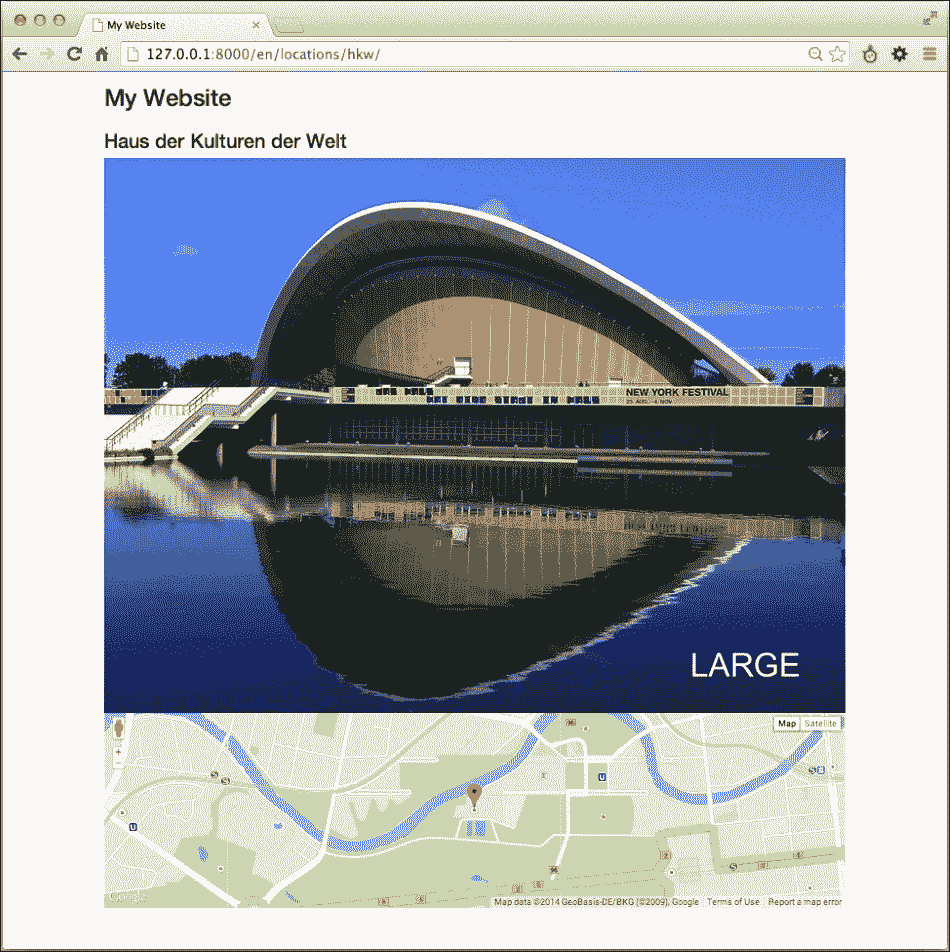
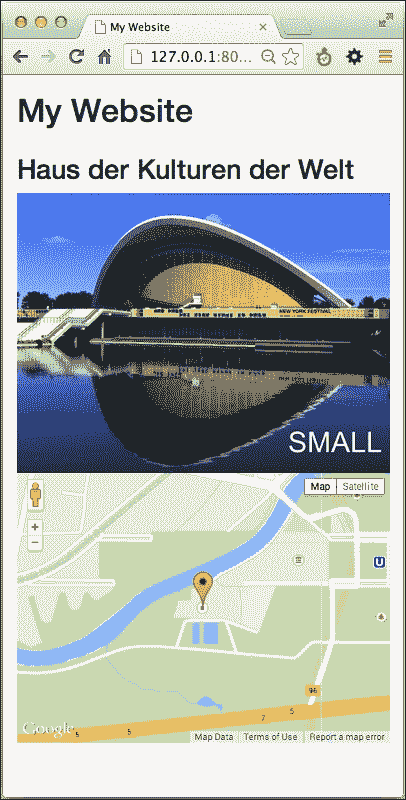
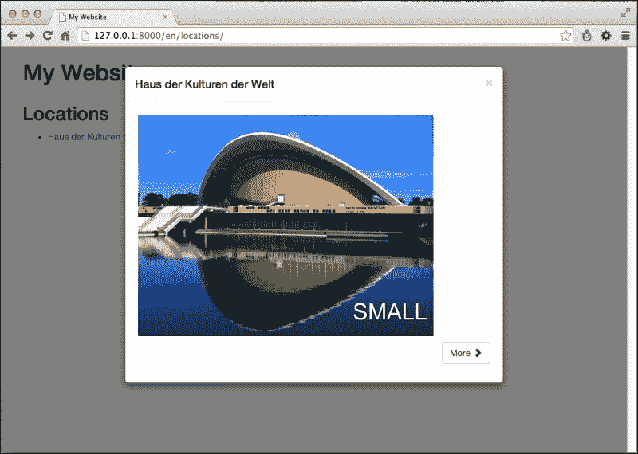
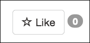
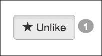
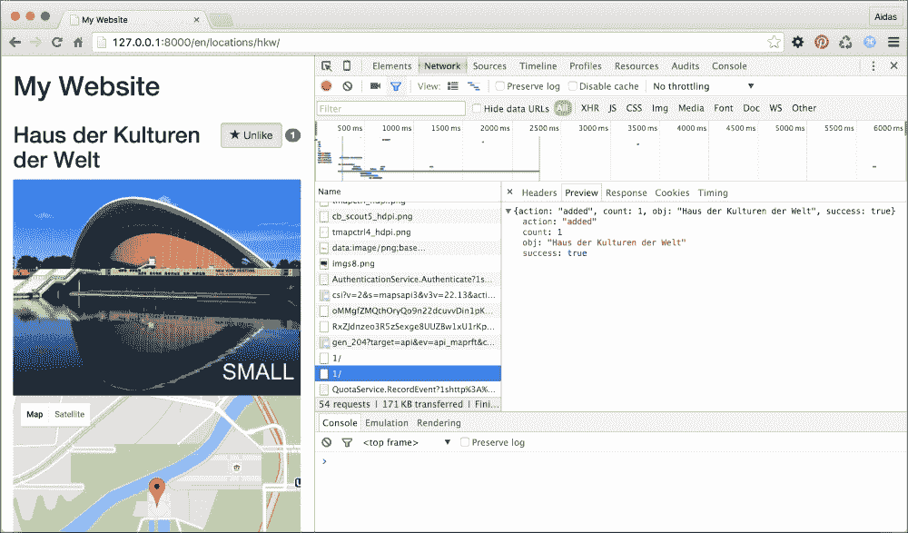

# 第四章：模板和 JavaScript

在本章中，我们将涵盖以下主题：

+   安排`base.html`模板

+   包含 JavaScript 设置

+   使用 HTML5 数据属性

+   在模态对话框中打开对象详情

+   实现连续滚动

+   实现点赞小部件

+   通过 Ajax 上传图片

# 简介

我们生活在一个 Web2.0 的世界，在这个世界里，社交网络应用和智能网站通过 Ajax 在服务器和客户端之间进行通信，只有当上下文发生变化时才会刷新整个页面。在本章中，你将学习处理模板中 JavaScript 的最佳实践，以创建丰富的用户体验。对于响应式布局，我们将使用 Bootstrap 3 前端框架。对于高效的脚本编写，我们将使用 jQuery JavaScript 框架。

# 安排`base.html`模板

当你开始处理模板时，首先要做的动作之一是创建`base.html`模板，这个模板将被项目中大多数页面模板扩展。在本食谱中，我们将演示如何创建这样一个模板，考虑到多语言 HTML5 网站的响应式设计。

### 小贴士

响应式网站是指能够适应设备视口的网站，无论访问者使用的是桌面浏览器、平板电脑还是手机。

## 准备工作

在你的项目中创建`templates`目录，并在设置中设置`TEMPLATE_DIRS`。

## 如何操作...

执行以下步骤：

1.  在你的`templates`根目录下，创建一个包含以下内容的`base.html`文件：

    ```py
    {# templates/base.html #}
    <!DOCTYPE html>
    
    <html lang="{{ LANGUAGE_CODE }}">
    <head>
        <meta charset="utf-8" />
        <meta name="viewport" content="width=device-width, initial-scale=1" />
        <title></title>
        <link rel="icon" href="{{ STATIC_URL }}site/img/favicon.ico" type="image/png" />

        

        
            <link rel="stylesheet" href="https://maxcdn.bootstrapcdn.com/bootstrap/3.3.5/css/bootstrap.min.css" />
            <link href="{{ STATIC_URL }}site/css/style.css" rel="stylesheet" media="screen" type="text/css" />
        
        

        
            <script src="img/"></script>
            <script src="img/"></script>
            <script src="img/bootstrap.min.js"></script>
            <script src="img/"></script>
        

        
        
    </head>
    <body class="">
        
            <section class="wrapper">
                <header class="clearfix container">
                    <h1></h1>
                    
                        
                    
                    
                        
                    
                </header>
                <div id="content" class="clearfix container">
                    
                    
                </div> 
                <footer class="clearfix container">
                    
                        
                    
                </footer>
            </section>
        
        
    </body>
    </html>
    ```

1.  在同一目录下，创建另一个名为`base_simple.html`的文件，用于特定情况，如下所示：

    ```py
    {# templates/base_simple.html #}
    

    
        <section class="wrapper">
            <div id="content" class="clearfix">
                
                
            </div>
        </section>
    
    ```

## 它是如何工作的...

基础模板包含了 HTML 文档的`<head>`和`<body>`部分，以及在每个网站页面上重复使用的所有详细信息。根据网页设计要求，你可以为不同的布局拥有额外的基础模板。例如，我们添加了`base_simple.html`文件，它具有相同的 HTML `<head>`部分和一个非常简约的`<body>`部分；它可以用于登录屏幕、密码重置或其他简单页面。你可以为单列、双列和三列布局拥有单独的基础模板，其中每个模板都扩展`base.html`并覆盖`<body>`部分的内容。

让我们来看看我们之前定义的`base.html`模板的细节。

在`<head>`部分，我们定义 UTF-8 为默认编码以支持多语言内容。然后，我们有 viewport 定义，它将在浏览器中缩放网站以使用全宽。这对于使用 Bootstrap 前端框架创建的特定屏幕布局的小屏幕设备是必要的。当然，有一个可定制的网站标题，favicon 将在浏览器标签中显示。我们为元标签、样式表、JavaScript 以及可能需要在`<head>`部分中使用的任何其他内容提供了可扩展的块。请注意，我们在模板中加载 Bootstrap CSS 和 JavaScript，因为我们希望所有元素都有响应式布局和基本坚固的预定义样式。然后，我们加载 JavaScript jQuery 库，该库高效且灵活，允许我们创建丰富的用户体验。我们还加载了从 Django 视图渲染的 JavaScript 设置。你将在下一个菜谱中了解这一点。

在`<body>`部分，我们有可覆盖的导航和语言选择器的页眉。我们还有内容块和页脚。在最底部，有一个可扩展的块用于额外的标记或 JavaScript。

我们创建的基本模板绝不是一种静态不可更改的模板。你可以添加你需要的内容，例如，Google Analytics 代码、常见的 JavaScript 文件、iPhone 书签的 Apple 触摸图标、Open Graph 元标签、Twitter Card 标签、schema.org 属性等等。

## 参见

+   *包含 JavaScript 设置* 菜谱

# 包含 JavaScript 设置

每个 Django 项目都在`conf/base.py`或`settings.py`设置文件中设置了其配置。其中一些配置值还需要在 JavaScript 中设置。由于我们希望在一个位置定义我们的项目设置，并且我们不希望在设置 JavaScript 值时重复这个过程，因此将一个动态生成的配置文件包含在基本模板中是一种良好的实践。在这个菜谱中，我们将看到如何做到这一点。

## 准备工作

确保你已经在`TEMPLATE_CONTEXT_PROCESSORS`设置中设置了媒体、静态和请求上下文处理器，如下所示：

```py
# conf/base.py or settings.py
TEMPLATE_CONTEXT_PROCESSORS = (
    "django.contrib.auth.context_processors.auth",
    "django.core.context_processors.debug",
    "django.core.context_processors.i18n",
 "django.core.context_processors.media",
 "django.core.context_processors.static",
    "django.core.context_processors.tz",
    "django.contrib.messages.context_processors.messages",
 "django.core.context_processors.request",
)
```

此外，如果你还没有这样做，请创建`utils`应用并将其放置在设置中的`INSTALLED_APPS`下。

## 如何做到…

按照以下步骤创建和包含 JavaScript 设置：

1.  创建一个 URL 规则来调用一个渲染 JavaScript 设置的视图，如下所示：

    ```py
    # urls.py
    # -*- coding: UTF-8 -*-
    from __future__ import unicode_literals
    from django.conf.urls import patterns, include, url
    from django.conf.urls.i18n import i18n_patterns

    urlpatterns = i18n_patterns("",
        # …
        url(r"^js-settings/$", "utils.views.render_js",
            {"template_name": "settings.js"},
            name="js_settings",
        ),
    )
    ```

1.  在你的`utils`应用的视图中，创建一个`render_js()`视图，该视图返回 JavaScript 内容类型的响应，如下所示：

    ```py
    # utils/views.py
    # -*- coding: utf-8 -*-
    from __future__ import unicode_literals
    from datetime import datetime, timedelta
    from django.shortcuts import render
    from django.views.decorators.cache import cache_control

    @cache_control(public=True)
    def render_js(request, cache=True, *args, **kwargs):
        response = render(request, *args, **kwargs)
        response["Content-Type"] = \
            "application/javascript; charset=UTF-8"
        if cache:
            now = datetime.utcnow()
            response["Last-Modified"] = \
                now.strftime("%a, %d %b %Y %H:%M:%S GMT")
            # cache in the browser for 1 month
            expires = now + timedelta(days=31)

            response["Expires"] = \
                expires.strftime("%a, %d %b %Y %H:%M:%S GMT")
        else:
            response["Pragma"] = "No-Cache"
        return response
    ```

1.  创建一个`settings.js`模板，该模板返回包含全局设置变量的 JavaScript，如下所示：

    ```py
    # templates/settings.js
    window.settings = {
        MEDIA_URL: '{{ MEDIA_URL|escapejs }}',
        STATIC_URL: '{{ STATIC_URL|escapejs }}',
        lang: '{{ LANGUAGE_CODE|escapejs }}',
        languages: { '{{ lang_code|escapejs }}': '{{ lang_name|escapejs }}',  }
    };
    ```

1.  最后，如果你还没有这样做，请将渲染的 JavaScript 设置文件包含在基本模板中，如下所示：

    ```py
    # templates/base.html
    <script src="img/"></script>
    ```

## 它是如何工作的…

Django 模板系统非常灵活；你不仅限于仅使用模板来创建 HTML。在这个例子中，我们将动态创建 JavaScript 文件。你可以在开发 Web 服务器`http://127.0.0.1:8000/en/js-settings/`中访问它，其内容将类似于以下内容：

```py
window.settings = {
    MEDIA_URL: '/media/',
    STATIC_URL: '/static/20140424140000/',
    lang: 'en',
    languages: { 'en': 'English', 'de': 'Deutsch', 'fr': 'Français', 'lt': 'Lietuvi kalba' }
};
```

视图将在服务器和浏览器中都可缓存。

如果你想向 JavaScript 设置传递更多变量，可以创建一个自定义视图并将所有值传递到上下文，或者创建一个自定义上下文处理器并将所有值传递到那里。在后一种情况下，这些变量也将被访问到你的项目的所有模板中。例如，你可能在模板中有`{{ is_mobile }}`、`{{ is_tablet }}`和`{{ is_desktop }}`这样的指示器，用户代理字符串会告诉访问者是否使用移动、平板或桌面浏览器。

## 参见

+   *安排 base.html 模板*的食谱

+   *使用 HTML5 数据属性*的食谱

# 使用 HTML5 数据属性

当你与 DOM 元素相关的动态数据时，你需要一种更有效的方法来从 Django 传递值到 JavaScript。在这个食谱中，我们将看到一种将 Django 中的数据附加到自定义 HTML5 数据属性的方法，然后描述如何使用两个实际示例从 JavaScript 中读取数据。第一个示例将是一个根据视口改变源图片的图片，这样在移动设备上显示最小版本，在平板上显示中等大小的版本，在网站桌面版本上显示最大高质量的图片。第二个示例将是一个带有指定地理位置标记的谷歌地图。

## 准备工作

要开始，请执行以下步骤：

1.  创建一个带有`Location`模型的`locations`应用，该模型至少包含标题字符字段、用于 URL 的 slug 字段、`small_image`、`medium_image`和`large_image`图像字段，以及纬度和经度浮点字段。

    ### 小贴士

    术语*slug*来自报纸编辑，它意味着一个没有特殊字符的短字符串；只有字母、数字、下划线和连字符。Slugs 通常用于创建唯一的 URL。

1.  为此模型创建一个管理界面并输入一个示例位置。

1.  最后，为位置创建一个详细视图并设置其 URL 规则。

## 如何做到这一点…

执行以下步骤：

1.  由于我们已经创建了应用，我们现在需要位置详情的模板：

    ```py
    {# templates/locations/location_detail.html #}
    

    
      <h2>{{ location.title }}</h2>

      

      <div id="map"
        data-latitude="{{ location.latitude|stringformat:"f" }}"
        data-longitude="{{ location.longitude|stringformat:"f" }}"
      ></div>
    

    
      <script src="img/js?v=3"></script>
      <script src="img/location_detail.js"></script>
    
    ```

1.  除了模板，我们还需要一个 JavaScript 文件，该文件将读取 HTML5 数据属性并相应地使用它们，如下所示：

    ```py
    //site_static/site/js/location_detail.js
    jQuery(function($) {

    function show_best_images() {
      $('img.img-full-width').each(function() {
        var $img = $(this);
        if ($img.width() > 1024) {
          $img.attr('src', $img.data('large-src'));
        } else if ($img.width() > 468) {
          $img.attr('src', $img.data('medium-src'));
        } else {
          $img.attr('src', $img.data('small-src'));
        }
      });
    }

    function show_map() {
      var $map = $('#map');
      var latitude = parseFloat($map.data('latitude'));
      var longitude = parseFloat($map.data('longitude'));
      var latlng = new google.maps.LatLng(latitude, longitude);

      var map = new google.maps.Map($map.get(0), {
        zoom: 15,
        center: latlng
      });
      var marker = new google.maps.Marker({
        position: latlng,
        map: map
      });
    }show_best_images();show_map();

    $(window).on('resize', show_best_images);

    });
    ```

1.  最后，我们需要设置一些 CSS，如下所示：

    ```py
    /* site_static/site/css/style.css */
    img.img-full-width {
        width: 100%;
    }
    #map {
        height: 300px;
    }
    ```

## 它是如何工作的…

如果你在一个浏览器中打开你的位置详情视图，你将在大窗口中看到类似以下的内容：



如果你将浏览器窗口调整到 468 像素或更小，图片将变为其最小版本，如下所示：



让我们来看看代码。在模板中，我们有一个带有`img-full-width` CSS 类的图像标签，其默认源是最小的图像。这个`image`标签还具有`data-small-src`、`data-medium-src`和`data-large-src`自定义属性。在 JavaScript 中，当页面加载或窗口大小调整时调用`show_best_images()`函数。该函数遍历所有带有`img-full-width` CSS 类的图像，并根据当前图像宽度从自定义数据属性中设置适当图像源。

然后，在模板中有一个带有地图 ID 和`data-latitude`和`data-longitude`自定义属性的`<div>`元素。在 JavaScript 中，当页面加载时调用`show_map()`函数。这个函数将在`<div>`元素中创建一个 Google 地图。最初，读取并从字符串转换为浮点数的自定义属性。然后，创建一个`LatLng`对象，在接下来的步骤中，它将成为地图的中心和在此地图上显示的标记的地理位置。

## 参见

+   *包含 JavaScript 设置* 菜谱

+   *在模态对话框中打开对象详情* 菜谱

+   在第六章 *插入地图到更改表单* 菜谱中，*模型管理*

# 在模态对话框中打开对象详情

在这个菜谱中，我们将创建一个位置链接列表，当点击时，会打开一个包含有关位置信息和*更多…*链接的 Bootstrap 3 模态对话框（在这个菜谱中我们将称之为弹出窗口），该链接指向位置详情页面。对话框的内容将通过 Ajax 加载。对于没有 JavaScript 的访客，详情页面将立即打开，而不经过这个中间步骤。

## 准备工作

让我们从之前菜谱中创建的`locations`应用开始。

在`urls.py`文件中，我们将有三个 URL 规则；一个用于位置列表，另一个用于位置详情，第三个用于对话框，如下所示：

```py
# locations/urls.py
# -*- coding: UTF-8 -*-
from __future__ import unicode_literals
from django.conf.urls import patterns, url

urlpatterns = patterns("locations.views",
    url(r"^$", "location_list", name="location_list"),
    url(r"^(?P<slug>[^/]+)/$", "location_detail",
        name="location_detail"),
    url(r"^(?P<slug>[^/]+)/popup/$", "location_detail_popup",
        name="location_detail_popup"),
)
```

因此，将会有三个简单的视图，如下所示：

```py
# locations/views.py
from __future__ import unicode_literals
# -*- coding: UTF-8 -*-
from django.shortcuts import render, get_object_or_404
from .models import Location

def location_list(request):
  location_list = Location.objects.all()
  return render(request, "locations/location_list.html",
    {"location_list": location_list})

def location_detail(request, slug):
  location = get_object_or_404(Location, slug=slug)
  return render(request, "locations/location_detail.html",
    {"location": location})

def location_detail_popup(request, slug):
  location = get_object_or_404(Location, slug=slug)
  return render(request, "locations/location_detail_popup.html",
    {"location": location})
```

## 如何做到这一点...

依次执行以下步骤：

1.  为位置列表视图创建一个模板，其中包含一个隐藏的空模态对话框。每个列表位置都将有处理弹出信息的自定义 HTML5 数据属性，如下所示：

    ```py
    {# templates/locations/location_list.html #}
    
    

    
        <h2></h2>
        <ul>
            
                <li class="item">
                    <a href=""
                    data-popup-url=""
                    data-popup-title="{{ location.title|escape }}">
                        {{ location.title }}
                    </a>
                </li>
            
        </ul>
    

    
        <div id="popup" class="modal fade">
            <div class="modal-dialog">
                <div class="modal-content">
                    <div class="modal-header">
                        <button type="button" class="close" data-dismiss="modal" aria-hidden="true">&times;</button>
                        <h4 class="modal-title">Modal title</h4>
                    </div>
                    <div class="modal-body">
                    </div>
                </div>
            </div>
        </div>
        <script src="img/location_list.js"></script>
    
    ```

1.  我们需要 JavaScript 来处理对话框的打开和内容的动态加载：

    ```py
    // site_static/site/js/location_list.js
    jQuery(function($) {
        var $popup = $('#popup');

        $('body').on('click', '.item a', function(e) {
            e.preventDefault();
            var $link = $(this);
            var popup_url = $link.data('popup-url');
            var popup_title = $link.data('popup-title');

            if (!popup_url) {
                return true;
            }
            $('.modal-title', $popup).html(popup_title);
            $('.modal-body', $popup).load(popup_url, function() {
                $popup.on('shown.bs.modal', function () {
                    // do something when dialog is shown
                }).modal("show");
            });

            $('.close', $popup).click(function() {
                // do something when dialog is closing
            });

        });
    });
    ```

1.  最后，我们将创建一个模板，用于在模态对话框中加载的内容，如下所示：

    ```py
    {# templates/locations/location_detail_popup.html #}
    
    <p></p>

    <p class="clearfix">
        <a href=""
        class="btn btn-default pull-right">
            
            <span class="glyphicon glyphicon-chevron-right"></span>
        </a>
    </p>
    ```

## 如何工作…

如果我们在浏览器中转到位置的列表视图并点击其中一个位置，我们将看到一个类似于以下模态对话框：



这是如何工作的？在模板中，有一个具有`item` CSS 类的`<div>`元素和每个位置的链接。链接具有`data-popup-url`和`data-popup-title`自定义属性。在 JavaScript 中，当页面加载时，我们为`<body>`标签分配一个`onclick`处理程序。处理程序检查是否有任何具有`item` CSS 类的链接被点击。对于每个这样的点击链接，自定义属性被读取为`popup_url`和`popup_title`，新的标题被设置为隐藏的对话框框，内容使用 Ajax 加载到模态对话框中，然后显示给访客。

## 参见

+   *使用 HTML5 数据属性*教程

+   *实现连续滚动*教程

+   *实现点赞小部件*教程

# 实现连续滚动

社交网站通常具有连续滚动的功能，这也被称为无限滚动。有长长的项目列表，当你向下滚动页面时，新项目会自动加载并附加到底部。在本教程中，我们将看到如何使用 Django 和 jScroll jQuery 插件实现这种效果。我们将使用一个示例视图来展示来自互联网电影数据库（[`www.imdb.com/`](http://www.imdb.com/)）的所有时间最顶部的 250 部电影。

## 准备工作

首先，从以下链接下载 jScroll 插件：[`github.com/pklauzinski/jscroll`](https://github.com/pklauzinski/jscroll)。

将包中的`jquery.jscroll.js`和`jquery.jscroll.min.js`文件放入`myproject/site_static/site/js/`目录。

接下来，对于本例，你将创建一个`movies`应用，该应用具有电影的分页列表视图。你可以创建一个`Movie`模型或包含电影数据的字典列表。每部电影都将有排名、标题、发行年份和评分字段。

## 如何做到这一点…

执行以下步骤以创建一个连续滚动的页面：

1.  第一步是为列表视图创建一个模板，该模板还将显示指向下一页的链接，如下所示：

    ```py
    {# templates/movies/movie_list.html #}
    
    

    
        <h2></h2>
        <div class="object_list">
            
                <div class="item">
                    <p>{{ movie.rank }}.
                        <strong>{{ movie.title }}</strong>
                        ({{ movie.year }})
                        <span class="badge">: {{ movie.rating }}</span>
                    </p>
                </div>
            
            
                <p class="pagination"><a class="next_page" href=""></a></p>
            
        </div>
    

    
        <script src="img/jquery.jscroll.min.js"></script>
        <script src="img/list.js"></script>
    
    ```

1.  第二步是添加 JavaScript，如下所示：

    ```py
    // site_static/site/js/list.js
    jQuery(function($) {
        $('.object_list').jscroll({
            loadingHtml: '',
            padding: 100,
            pagingSelector: '.pagination',
            nextSelector: 'a.next_page:last',
            contentSelector: '.item,.pagination'
        });
    });
    ```

## 它是如何工作的…

当你在浏览器中打开电影列表视图时；页面上会显示预定义数量的项目，例如，25 个。当你向下滚动时，会加载并附加到项目容器中的额外 25 个项目和下一个分页链接。然后，加载并附加到项目底部的第三页，这个过程会一直持续到没有更多页面可以显示。

页面加载时，具有`object_list` CSS 类的`<div>`标签，包含项目和分页链接，将变成一个 jScroll 对象。以下参数定义了其功能：

+   `loadingHtml`：这将在新页面加载时在列表末尾显示一个动画加载指示器。

+   `padding`：这将定义当滚动位置和滚动区域末尾之间有 100 像素时，需要加载新页面。

+   `pagingSelector`：这个 CSS 选择器用于找到在启用 JavaScript 的浏览器中将被隐藏的 HTML 元素

+   `nextSelector`：这个 CSS 选择器用于找到将用于读取下一页 URL 的 HTML 元素

+   `contentSelector`：这个 CSS 选择器定义了要从加载的内容中提取并放入容器的 HTML 元素

## 参见

+   第三章中的*管理分页列表*配方，*表单和视图*

+   第三章中的*编写基于类的视图*配方，*表单和视图*

+   *包括 JavaScript 设置*配方

# 实现 Like 小部件

现在，社交网站通常已经集成了 Facebook、Twitter 和 Google+小部件来喜欢和分享页面。在这个配方中，我将指导您通过一个类似的内部喜欢 Django 应用，该应用将所有喜欢保存到您的数据库中，以便您可以根据您网站上喜欢的事物创建特定的视图。我们将创建一个具有两种状态按钮和显示总喜欢数量的徽章的 Like 小部件。以下是其状态：

+   非激活状态，您可以点击按钮来激活它：

+   激活状态，您可以点击按钮来取消激活它：

小部件的状态将由 Ajax 调用处理。

## 准备工作

首先，创建一个包含`Like`模型的`likes`应用，该模型与喜欢某物的用户具有外键关系，与数据库中的任何对象具有通用关系。我们将使用在第二章中定义的`ObjectRelationMixin`，该定义位于*创建用于处理通用关系的模型混合*配方中，*数据库结构*。如果您不想使用混合，也可以在以下模型中自己定义一个通用关系：

```py
# likes/models.py
# -*- coding: UTF-8 -*-
from __future__ import unicode_literals
from django.db import models
from django.utils.translation import ugettext_lazy as _
from django.conf import settings
from django.utils.encoding import python_2_unicode_compatible
from utils.models import CreationModificationDateMixin
from utils.models import object_relation_mixin_factory

@python_2_unicode_compatible
class Like(CreationModificationDateMixin,
object_relation_mixin_factory(is_required=True)):
    user = models.ForeignKey(settings.AUTH_USER_MODEL)

    class Meta:
        verbose_name = _("like")
        verbose_name_plural = _("likes")
        ordering = ("-created",)

    def __str__(self):
        return _(u"%(user)s likes %(obj)s") % {
            "user": self.user,
            "obj": self.content_object,
        }
```

同时，确保请求上下文处理器已在设置中设置。我们还需要在设置中为当前登录用户附加请求的认证中间件：

```py
# conf/base.py or settings.py
TEMPLATE_CONTEXT_PROCESSORS = (
    # …
    "django.core.context_processors.request",
)
MIDDLEWARE_CLASSES = (
    # …
    "django.contrib.auth.middleware.AuthenticationMiddleware",
)
```

## 如何做到这一点…

依次执行以下步骤：

1.  在`likes`应用中，创建一个包含空`__init__.py`文件的`templatetags`目录，以便将其作为一个 Python 模块。然后，添加`likes_tags.py`文件，我们将在此文件中定义``模板标签，如下所示：

    ```py
    # likes/templatetags/likes_tags.py
    # -*- coding: UTF-8 -*-
    from django import template
    from django.contrib.contenttypes.models import ContentType
    from django.template import loader

    from likes.models import Like

    register = template.Library()

    ### TAGS ###

    @register.tag
    def like_widget(parser, token):
        try:
            tag_name, for_str, obj = token.split_contents()
        except ValueError:
            raise template.TemplateSyntaxError, \
                "%r tag requires a following syntax: " \
                "{%% %r for <object> %%}" % (
                    token.contents[0], token.contents[0])
        return ObjectLikeWidget(obj)

    class ObjectLikeWidget(template.Node):
        def __init__(self, obj):
            self.obj = obj

        def render(self, context):
            obj = template.resolve_variable(self.obj, context)
            ct = ContentType.objects.get_for_model(obj)

            is_liked_by_user = bool(Like.objects.filter(
                user=context["request"].user,
                content_type=ct,
                object_id=obj.pk,
            ))

            context.push()
            context["object"] = obj
            context["content_type_id"] = ct.pk
            context["is_liked_by_user"] = is_liked_by_user
            context["count"] = get_likes_count(obj)

            output = loader.render_to_string(
                "likes/includes/like.html", context)
            context.pop()
            return output
    ```

1.  同时，我们将在同一文件中添加一个过滤器，以获取指定对象的喜欢数量：

    ```py
    ### FILTERS ###

    @register.filter
    def get_likes_count(obj):
        ct = ContentType.objects.get_for_model(obj)
        return Like.objects.filter(
            content_type=ct,
            object_id=obj.pk,
        ).count()
    ```

1.  在 URL 规则中，我们需要一个用于视图的规则，该视图将使用 Ajax 处理喜欢和取消喜欢操作：

    ```py
    # likes/urls.py
    # -*- coding: UTF-8 -*-
    from django.conf.urls import patterns, url

    urlpatterns = patterns("likes.views",

       url(r"^(?P<content_type_id>[^/]+)/(?P<object_id>[^/]+)/$",
            "json_set_like", name="json_set_like"),
    )
    ```

1.  然后，我们需要定义视图，如下所示：

    ```py
    # likes/views.py
    # -*- coding: UTF-8 -*-
    import json
    from django.http import HttpResponse
    from django.views.decorators.cache import never_cache
    from django.contrib.contenttypes.models import ContentType
    from django.shortcuts import render
    from django.views.decorators.csrf import csrf_exempt

    from .models import Like
    from .templatetags.likes_tags import get_likes_count

    @never_cache
    @csrf_exempt
    def json_set_like(request, content_type_id, object_id):
        """
        Sets the object as a favorite for the current user
        """
        result = {
            "success": False,
        }
        if request.user.is_authenticated() and \
        request.method == "POST":
            content_type = ContentType.objects.get(id=content_type_id)
            obj = content_type.get_object_for_this_type(pk=object_id)
            like, is_created = Like.objects.get_or_create(
                content_type=ContentType.objects.get_for_model(obj),
                object_id=obj.pk,
                user=request.user,
            )
            if not is_created:
                like.delete()
            result = {
                "success": True,
                "obj": unicode(obj),
                "action": is_created and "added" or "removed",
                "count": get_likes_count(obj),
            }
        json_str = json.dumps(result, ensure_ascii=False,
                encoding="utf8")
        return HttpResponse(json_str,
        mimetype="application/json; charset=utf-8")
    ```

1.  在任何对象的列表或详细视图的模板中，我们可以添加小部件的模板标签。让我们将小部件添加到之前配方中创建的位置详细中，如下所示：

    ```py
    {# templates/locations/location_detail.html #}
    
    

    
        
            
        
        {# the details of the object go here… #}
    

    
        <script src="img/likes.js"></script>
    
    ```

1.  然后，我们需要为小部件创建一个模板，如下所示：

    ```py
    {# templates/likes/includes/like.html #}
    
    <div class="like-widget">
        <button type="button" class="like-button btn btn-default  active"
            data-href=""
            data-like-text=""
            data-unlike-text=""
        >
            
                <span class="glyphicon glyphicon-star"></span>
                
            
                <span class="glyphicon glyphicon-star-empty"></span>
                
            
        </button>
        <span class="like-badge badge">{{ count }}</span>
    </div>
    ```

1.  最后，我们创建 JavaScript 来处理浏览器中的喜欢和取消喜欢操作，如下所示：

    ```py
    // site_static/site/js/likes.js
    (function($) {
        $(document).on('click', '.like-button', function() {
            var $button = $(this);
            var $badge = $button.closest('.like-widget')
                .find('.like-badge');
            $.post($button.data('href'), function(data) {
                if (data['action'] == 'added') {
                    $button.addClass('active').html(
    '<span class="glyphicon glyphicon-star"></span> ' +
    $button.data('unlike-text')
                    );
                } else {
                    $button.removeClass('active').html(
    '<span class="glyphicon glyphicon-star-empty"></span> ' +
    $button.data('like-text')
                    );
                }
                $badge.html(data['count']);
            }, 'json');
        });
    })(jQuery);
    ```

## 如何工作…

对于你网站中的任何对象，你可以放置 `` 模板标签，该标签将检查对象是否已被喜欢，并显示适当的状态。小部件模板中的 `data-href`、`data-like-text` 和 `data-unlike-text` 自定义 HTML5 属性。第一个属性持有唯一的对象特定 URL，用于更改小部件的当前状态。其他两个属性持有小部件的翻译文本。在 JavaScript 中，喜欢按钮通过喜欢按钮 CSS 类识别。文档上附加的点击事件监听器监视来自每个此类按钮的 `onClick` 事件，然后向由 `data-href` 属性指定的 URL 发送 Ajax 请求。指定的视图接受被喜欢对象的两个参数，即内容类型和对象 ID。视图检查指定对象的 `Like` 是否存在，如果存在，则视图将其删除；否则，添加 `Like` 对象。因此，视图返回一个包含成功状态、被喜欢对象的文本表示、操作（`Like` 对象是添加还是删除）以及总喜欢数的 JSON 响应。根据返回的操作，JavaScript 将显示按钮的适当状态。

你可以在 Chrome 开发者工具或 Firefox Firebug 插件中调试 Ajax 响应。如果在开发过程中出现任何服务器错误，你将在响应预览中看到错误跟踪，否则你将看到如下截图所示的返回 JSON：



## 相关内容

+   *在模态对话框中打开对象详情* 的菜谱

+   *实现连续滚动* 的菜谱

+   *通过 Ajax 上传图像* 的菜谱

+   第二章中的 *创建用于处理通用关系的模型混入* 菜谱，*数据库结构*

+   第五章，*自定义模板过滤器和标签*

# 通过 Ajax 上传图像

使用 Ajax 进行文件上传已成为网络上的事实标准。人们希望在选择文件后立即看到他们选择的内容，而不是在提交表单后看到。此外，如果表单有验证错误，没有人愿意再次选择文件；带有验证错误的文件仍然应该保留在表单中。

有一个第三方应用程序 `django-ajax-uploader`，可以用来使用 Ajax 上传图像。在这个菜谱中，我们将看到如何做到这一点。

## 准备工作

让我们从为 第三章中的 *上传图像* 菜谱创建的 `quotes` 应用程序开始。我们将重用模型和视图；然而，我们将创建不同的表单和模板，并添加 JavaScript。

使用以下命令在你的本地环境中安装 `django-crispy-forms` 和 `django-ajax-uploader`：

```py
(myproject)$ pip install django-crispy-forms
(myproject)$ pip install ajaxuploader

```

不要忘记将这些应用程序放入 `INSTALLED_APPS` 中，如下所示：

```py
# conf/base.py or settings.py
INSTALLED_APPS = (
    # …
    "quotes",
    "crispy_forms",
    "ajaxuploader",
)
```

## 如何做…

让我们按照以下步骤重新定义励志名言的表单：

1.  首先，我们为 Bootstrap 3 标记创建一个布局。请注意，我们使用隐藏的`picture_path`和`delete_picture`字段以及一些文件上传小部件的标记，而不是`picture`图像字段：

    ```py
    # quotes/forms.py
    # -*- coding: UTF-8 -*-
    import os
    from django import forms
    from django.utils.translation import ugettext_lazy as _
    from django.core.files import File
    from django.conf import settings
    from crispy_forms.helper import FormHelper
    from crispy_forms import layout, bootstrap
    from .models import InspirationQuote

    class InspirationQuoteForm(forms.ModelForm):
     picture_path = forms.CharField(
     max_length=255,
     widget=forms.HiddenInput(),
     required=False,
     )
     delete_picture = forms.BooleanField(
     widget=forms.HiddenInput(),
     required=False,
     )

        class Meta:
            model = InspirationQuote
            fields = ["author", "quote"]

        def __init__(self, *args, **kwargs):
                    super(InspirationQuoteForm, self).\
                __init__(*args, **kwargs)

            self.helper = FormHelper()
            self.helper.form_action = ""
            self.helper.form_method = "POST"

            self.helper.layout = layout.Layout(
                layout.Fieldset(
                    _("Quote"),
                    layout.Field("author"),
                    layout.Field("quote", rows=3),               
     layout.HTML("""
     
                    """),
                    layout.Field("picture_path"), # hidden
                    layout.Field("delete_picture"), # hidden
                ),
                bootstrap.FormActions(
                    layout.Submit("submit", _("Save"),
                        css_class="btn btn-primary"),
                )
            )
    ```

1.  然后，我们将覆盖保存方法以处理励志名言的保存，如下所示：

    ```py
        def save(self, commit=True):
            instance = super(InspirationQuoteForm, self).\
                save(commit=True)

            if self.cleaned_data['delete_picture'] and \
                instance.picture:
                instance.picture.delete()

            if self.cleaned_data['picture_path']:
                tmp_path = self.cleaned_data['picture_path']
                abs_tmp_path = os.path.join(
                    settings.MEDIA_ROOT, tmp_path)

                filename = InspirationQuote._meta.\
                    get_field('picture').upload_to(
                    instance, tmp_path)
                instance.picture.save(
                    filename,
                    File(open(abs_tmp_path, "rb")),
                    False
                )

                os.remove(abs_tmp_path)
            instance.save()
            return instance
    ```

1.  除了在 quotes 应用中定义的先前视图外，我们添加了`ajax_uploader`视图，该视图将处理使用 Ajax 的上传，如下所示：

    ```py
    # quotes/views.py
    # …
    from ajaxuploader.views import AjaxFileUploader
    ajax_uploader = AjaxFileUploader()
    ```

1.  然后，我们为视图设置 URL 规则，如下所示：

    ```py
    # quotes/urls.py
    # -*- coding: UTF-8 -*-
    from django.conf.urls import patterns, url

    urlpatterns = patterns("",
        # …
        url(r"^ajax-upload/$", "quotes.views.ajax_uploader",
            name="ajax_uploader"),
    )
    ```

1.  接下来，创建一个`image_upload_widget.html`模板，该模板将被包含在 crispy 表单中：

    ```py
    {# templates/quotes/includes/image_upload_widget.html #}
    
    <div id="image_upload_widget">
        <div class="preview">
            
                
            
        </div>
        <div class="uploader">
            <noscript>
                <p></p>
            </noscript>
        </div>
        <p class="help_text" class="help-block"></p>
        <div class="messages"></div>
    </div>
    ```

1.  然后，是时候创建表单页面的模板了。在 extrabody 块中，我们将设置一个`translatable_file_uploader_options`变量，该变量将处理文件上传的所有可翻译选项，例如小部件模板标记、错误消息和通知：

    ```py
    {# templates/quotes/change_quote.html #}
    
    

    
        {{ block.super }}
        <link rel="stylesheet" href="{{ STATIC_URL }}ajaxuploader/css/fileuploader.css" />
    

    
        
    

    
        <script src="img/fileuploader.js"></script>
        <script>
            var translatable_file_uploader_options = {
                template: '<div class="qq-upload-drop-area"><span></span></div>' +
                    '<div class="qq-uploader">' +
                    '<div class="qq-upload-button btn"><span class="glyphicon glyphicon-upload"></span>  </div>' +
                    '&nbsp;<button class="btn btn-danger qq-delete-button"><span class="glyphicon glyphicon-trash"></span> </button>' +
                    '<ul class="qq-upload-list"></ul>' +
                '</div>',
                // template for one item in file list
                fileTemplate: '<li>' +
                    '<span class="qq-upload-file"></span>' +
                    '<span class="qq-upload-spinner"></span>' +
                    '<span class="qq-upload-size"></span>' +
                    '<a class="qq-upload-cancel" href="#"></a>' +
                    '<span class="qq-upload-failed-text"></span>' +
                '</li>',
                messages: {
                    typeError: '',
                    sizeError: '',
                    minSizeError: '',
                    emptyError: '',
                    filesLimitError: '',
                    onLeave: ''
                }
            };
            var ajax_uploader_path = '';
        </script>
        <script src="img/change_quote.js"></script>
    
    ```

1.  最后，我们创建一个 JavaScript 文件，该文件将初始化文件上传小部件并处理图片预览和删除，如下所示：

    ```py
    // site_static/site/js/change_quote.js
    $(function() {
        var csrfmiddlewaretoken = $('input[name="csrfmiddlewaretoken"]').val();
        var $image_upload_widget = $('#image_upload_widget');
        var current_image_path = $('#id_picture_path').val();
        if (current_image_path) {
            $('.preview', $image_upload_widget).html(
                ''
            );
        }
        var options = $.extend(window.translatable_file_uploader_options, {
            allowedExtensions: ['jpg', 'jpeg', 'gif', 'png'],
            action: window.ajax_uploader_path,
            element: $('.uploader', $image_upload_widget)[0],
            multiple: false,
            onComplete: function(id, fileName, responseJSON) {
                if(responseJSON.success) {
                    $('.messages', $image_upload_widget).html("");
                    // set the original to media_file_path
                    $('#id_picture_path').val('uploads/' + fileName);
                    // show preview link
                    $('.preview', $image_upload_widget).html(
                        ''
                    );
                }
            },
            onAllComplete: function(uploads) {
                // uploads is an array of maps
                // the maps look like this: {file: FileObject, response: JSONServerResponse}
                $('.qq-upload-success').fadeOut("slow", function() {
                    $(this).remove();
                });
            },
            params: {
                'csrf_token': csrfmiddlewaretoken,
                'csrf_name': 'csrfmiddlewaretoken',
                'csrf_xname': 'X-CSRFToken'
            },
            showMessage: function(message) {
                $('.messages', $image_upload_widget).html(
                    '<div class="alert alert-danger">' + message + '</div>'
                );
            }
        });
        var uploader = new qq.FileUploader(options);
        $('.qq-delete-button', $image_upload_widget).click(function() {
            $('.messages', $image_upload_widget).html("");
            $('.preview', $image_upload_widget).html("");
            $('#id_delete_picture').val(1);
            return false;
        });
    });
    ```

## 如何工作…

当在上传小部件中选择图片时，浏览器中的结果将类似于以下截图：


同一个表单可以用来创建励志名言和更改现有的励志名言。让我们深入了解这个过程，看看它是如何工作的。在表单中，我们有一个上传机制，由以下基本部分组成：

+   定义为具有预览 CSS 类的`<div>`标签的图片预览区域。最初，如果我们处于对象更改视图并且`InspirationQuote`对象作为`{{ instance }}`传递给模板，它可能会显示图片。

+   用于 Ajax 上传小部件的区域，该小部件定义为具有`uploader`CSS 类的`<div>`标签。它将被动态创建的上传和删除按钮以及上传进度指示器填充。

+   上传的帮助文本。

+   定义为具有`messages`CSS 类的`<div>`标签的错误消息区域。

+   用于设置上传文件路径的隐藏`picture_path`字符字段。

+   用于标记文件删除的隐藏`delete_picture`布尔字段。

在页面加载时，JavaScript 将检查`picture_path`是否已设置；如果是，它将显示图片预览。只有在选择图片并提交表单的情况下才会发生这种情况；然而，存在验证错误。

此外，我们正在 JavaScript 中定义上传小部件的选项。这些选项由全局`translatable_file_uploader_options`变量与模板中设置的翻译字符串以及其他在 JavaScript 文件中设置的配置选项组合而成。Ajax 上传小部件使用这些选项进行初始化。一些重要的设置需要注意，包括`onComplete`回调，它会在上传图片时显示图片预览并填写`picture_path`字段，以及`showMessage`回调，它定义了如何在指定区域显示错误消息。

最后，还有一个 JavaScript 中的删除按钮处理程序，当点击时，将隐藏的`delete_picture`字段设置为`1`并移除预览图片。

Ajax 上传小部件动态创建一个包含文件上传字段和隐藏的`<iframe>`标签的表单，用于提交表单数据。当选择一个文件时，它立即上传到`MEDIA_URL`下的`uploads`目录，并将文件的路径设置为隐藏的`picture_path`字段。此目录是上传文件的临时位置。当用户提交灵感名言表单且输入有效时，会调用`save()`方法。如果`delete_picture`设置为`1`，则模型实例的图片将被删除。如果`picture_path`字段已定义，则从临时位置复制图像到最终目的地，并删除原始文件。

## 参见

+   第三章中的*上传图片*菜谱

+   *在模态对话框中打开对象详情*菜谱

+   *实现连续滚动*菜谱

+   *实现点赞小部件*菜谱
