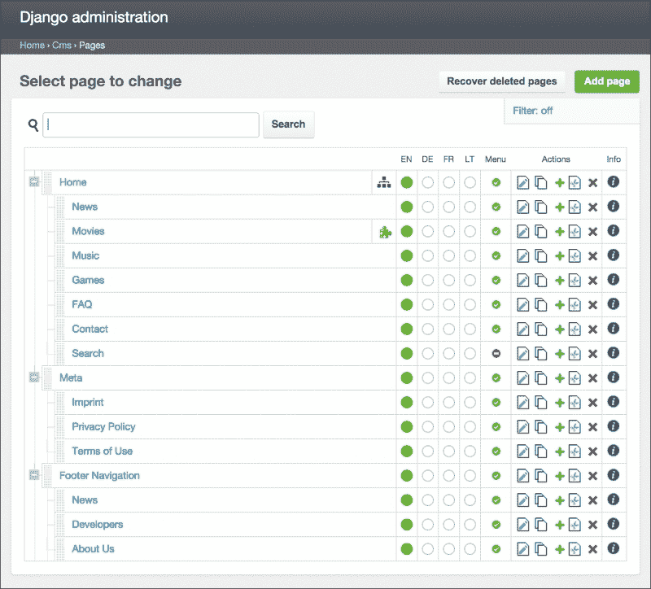
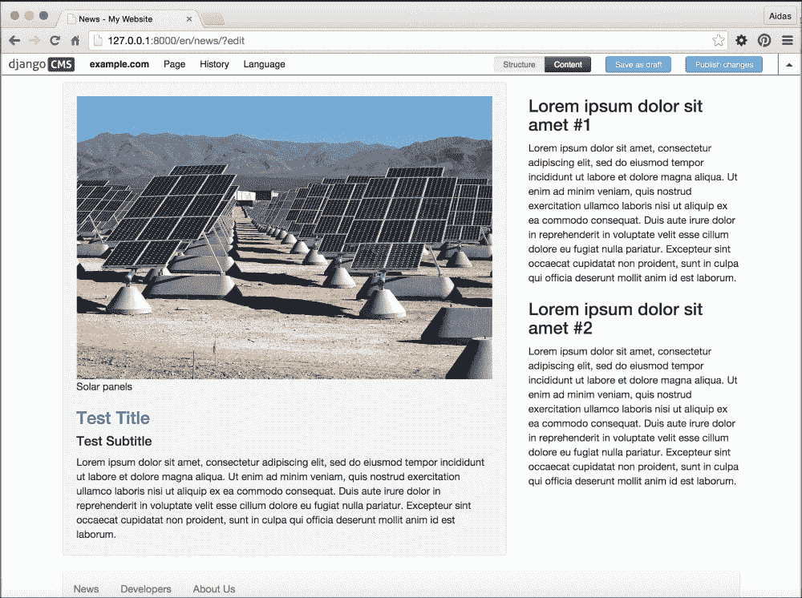
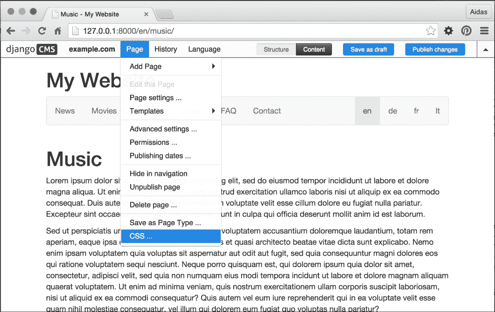
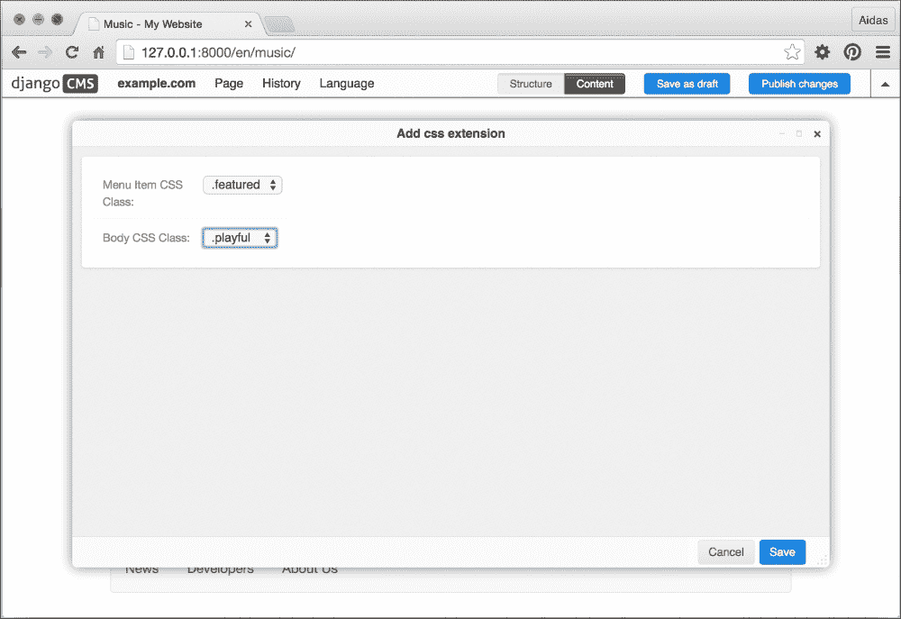

# 第七章 Django CMS

在本章中，我们将介绍以下菜谱：

+   为 Django CMS 创建模板

+   构建页面菜单

+   将应用转换为 CMS 应用

+   添加自己的导航

+   编写自己的 CMS 插件

+   向 CMS 页面添加新字段

# 简介

Django CMS 是一个基于 Django 的开源内容管理系统，由瑞士的 Divio AG 创建。Django CMS 负责网站的架构，提供导航菜单，使在前端编辑页面内容变得容易，并支持网站的多语言。你还可以使用提供的钩子根据需要扩展它。要创建网站，你需要创建页面的层次结构，其中每个页面都有一个模板。模板有占位符，可以分配不同的插件来包含内容。使用特殊的模板标签，可以从层次页面结构生成菜单。CMS 负责将 URL 映射到特定页面。

在本章中，我们将从开发者的角度查看 Django CMS 3.1。我们将了解模板正常运行所必需的内容，并查看头部和尾部导航的可能页面结构。你还将学习如何将应用的 URL 规则附加到 CMS 页面树节点。然后，我们将自定义导航附加到页面菜单并创建我们自己的 CMS 内容插件。最后，你将学习如何向 CMS 页面添加新字段。

尽管在这本书中，我不会引导你了解使用 Django CMS 的所有细节；但到本章结束时，你将了解其目的和使用方法。其余内容可以通过官方文档在 [`docs.django-cms.org/en/develop/`](http://docs.django-cms.org/en/develop/) 学习，也可以通过尝试 CMS 的前端用户界面来学习。

# 为 Django CMS 创建模板

对于你页面结构中的每一页，你需要从在设置中定义的模板列表中选择一个模板。在这个菜谱中，我们将查看这些模板的最小要求。

## 准备工作

如果你想要启动一个新的 Django CMS 项目，请在虚拟环境中执行以下命令并回答所有提示的问题：

```py
(myproject_env)$ pip install djangocms-installer
(myproject_env)$ djangocms -p project/myproject myproject

```

在这里，`project/myproject` 是项目将被创建的路径，而 `myproject` 是项目名称。

另一方面，如果你想在现有项目中集成 Django CMS，请查看官方文档 [`docs.django-cms.org/en/latest/how_to/install.html`](http://docs.django-cms.org/en/latest/how_to/install.html)。

## 如何操作...

我们将更新由 Bootstrap 驱动的 `base.html` 模板，使其包含 Django CMS 所需的所有内容。然后，我们将创建并注册两个模板，`default.html` 和 `start.html`，供 CMS 页面选择：

1.  首先，我们将更新在第四章 *安排 base.html 模板*食谱中创建的基本模板，如下所示：

    ```py
    {# templates/base.html #}
    <!DOCTYPE html>
    
    <html lang="{{ LANGUAGE_CODE }}">
    <head>
        <meta charset="utf-8" />
        <meta name="viewport" content="width=device-width, initial-scale=1" />
        <title></title>
        <link rel="icon" href="{{ STATIC_URL }}site/img/favicon.ico" type="image/png" />

        

     
        
            <link rel="stylesheet" href="//maxcdn.bootstrapcdn.com/bootstrap/3.3.5/css/bootstrap.min.css" />
            <link href="{{ STATIC_URL }}site/css/style.css" rel="stylesheet" media="screen" type="text/css" />
        
        

        
            <script src="img/"></script>
            <script src="img/"></script>
            <script src="img/bootstrap.min.js"></script>
        
        
        
    </head>
    <body class=" {{ request.current_page.cssextension.body_css_class }}">
     
        
            <div class="wrapper">
                <div id="header" class="clearfix container">
                    <h1></h1>
                    <nav class="navbar navbar-default" role="navigation">
                        
     <ul class="nav navbar-nav">
     
     </ul>
                        
                        
     <ul class="nav navbar-nav pull-right">
     
     </ul>
                        
                    </nav>
                </div>
                <div id="content" class="clearfix container">
                    
                    
                </div> 
                <div id="footer" class="clearfix container">
                    
                        <nav class="navbar navbar-default" role="navigation">
     <ul class="nav navbar-nav">
     
     </ul>
                        </nav>
                    
                </div>
            </div>
        
        
     
    </body>
    </html>
    ```

1.  然后，我们将在`templates`目录下创建一个`cms`目录，并为 CMS 页面添加两个模板：`default.html`用于普通页面，`start.html`用于主页，如下所示：

    ```py
    {# templates/cms/default.html #}
    
    

     - 

    
        <meta name="description" content=""/>
    

    
        <h1></h1>
        <div class="row">
            <div class="col-md-8">
                
            </div>
            <div class="col-md-4">
                
            </div>
        </div>
    

    {# templates/cms/start.html #}
    
    

    
        <meta name="description" content=""/>
    

    
        <!--
        Here goes very customized website-specific content like slideshows, latest tweets, latest news, latest profiles, etc.
        -->
    
    ```

1.  最后，我们将设置这两个模板的路径，如下所示：

    ```py
    # conf/base.py or settings.py
    CMS_TEMPLATES = (
        ("cms/default.html", gettext("Default")),
        ("cms/start.html", gettext("Homepage")),
    )
    ```

## 它是如何工作的...

如往常一样，`base.html`模板是所有其他模板扩展的主要模板。在这个模板中，Django CMS 使用来自`django-sekizai`模块的``模板标签在创建前端工具栏和其他管理小部件的模板中注入 CSS 和 JavaScript。我们将在`<body>`部分的开始处插入``模板标签——这就是工具栏将被放置的位置。我们将使用``模板标签从特定的页面菜单树渲染头部和底部菜单。此外，我们还将使用``模板标签渲染语言选择器，该选择器可以在不同语言中切换到同一页面。

在`CMS_TEMPLATES`设置中定义的`default.html`和`start.html`模板，在创建 CMS 页面时将作为选择项可用。在这些模板中，对于需要动态输入内容的每个区域，当需要页面特定内容时，添加``模板标签；当需要在不同页面间共享的内容时，添加``模板标签。登录管理员可以在 CMS 工具栏从**实时**模式切换到**草稿**模式，并切换到**结构**部分时，向占位符添加内容插件。

## 相关内容

+   第四章 *安排 base.html 模板*食谱

+   *页面菜单结构化*食谱

# 页面菜单结构化

在本食谱中，我们将讨论一些关于定义您网站页面树结构的指南。

## 准备工作

在创建您页面结构之前设置网站可用的语言是一种良好的做法（尽管 Django CMS 数据库结构也允许您稍后添加新语言）。除了`LANGUAGES`之外，请确保您在设置中已设置`CMS_LANGUAGES`。`CMS_LANGUAGES`设置定义了每个 Django 站点应激活哪些语言，如下所示：

```py
# conf/base.py or settings.py
# ...
from __future__ import unicode_literals
gettext = lambda s: s

LANGUAGES = (
    ("en", "English"),
    ("de", "Deutsch"),
    ("fr", "Français"),
    ("lt", "Lietuvių kalba"),
)

CMS_LANGUAGES = {
    "default": {
        "public": True,
        "hide_untranslated": False,
        "redirect_on_fallback": True,
    },
    1: [
        {
            "public": True,
            "code": "en",
            "hide_untranslated": False,
            "name": gettext("en"),
            "redirect_on_fallback": True,
        },
        {
            "public": True,
            "code": "de",
            "hide_untranslated": False,
            "name": gettext("de"),
            "redirect_on_fallback": True,
        },
        {
            "public": True,
            "code": "fr",
            "hide_untranslated": False,
            "name": gettext("fr"),
            "redirect_on_fallback": True,
        },
        {
            "public": True,
            "code": "lt",
            "hide_untranslated": False,
            "name": gettext("lt"),
            "redirect_on_fallback": True,
        },
    ],
}
```

## 如何操作...

页面导航是在树结构中设置的。第一棵树是主树，与其他树不同，主树的根节点不会反映在 URL 结构中。这个树的根节点是网站的首页。通常，这个页面有一个特定的模板，你在其中添加从不同应用程序聚合的内容；例如，幻灯片、实际新闻、新注册用户、最新推文或其他最新或特色对象。为了方便地从不同的应用程序渲染项目，请查看第五章 *在模板中创建一个模板标签到 QuerySet* 菜单中的 *自定义模板过滤器和标签*。

如果你的网站有多个导航，如顶部、元和页脚导航，请在页面的 **高级** 设置中为每个树的根节点分配一个 ID。这个 ID 将在基础模板中通过 `` 模板标签使用。你可以在官方文档中了解更多关于此和其他与菜单相关的模板标签的信息，请参阅 [`docs.django-cms.org/en/latest/reference/navigation.html`](http://docs.django-cms.org/en/latest/reference/navigation.html)。

第一棵树定义了网站的主结构。如果你想将页面放在根级 URL 下，例如，`/en/search/` 但不是 `/en/meta/search/`，请将此页面放在主页下。如果你不希望页面在菜单中显示，因为它将通过图标或小部件链接，只需将其从菜单中隐藏。

页脚导航通常显示与顶部导航不同的项目，其中一些项目被重复，例如，开发者页面仅在页脚中显示；而新闻页面将在页眉和页脚中显示。对于所有重复的项目，只需在页面的高级设置中创建一个带有 **重定向** 设置的页面，并将其设置为在主树中的原始页面。默认情况下，当你创建一个二级树结构时，该树根下的所有页面都将包括根页面的 slug 在它们的 URL 路径中。如果你想跳过 URL 路径中的根页面的 slug，你需要在页面的高级设置中设置 **覆盖 URL** 设置。例如，开发者页面应该在 `/en/developers/` 下，而不是 `/en/secondary/developers/`。

## 如何工作...

最后，你的页面结构将类似于以下图像（当然，页面结构也可以更复杂）：



## 参见

+   在第五章 *自定义模板过滤器和标签* 的 *在模板中创建一个模板标签来加载 QuerySet* 菜单中，*自定义模板过滤器和标签*

+   *为 Django CMS 创建模板* 菜单

+   *附加您自己的导航* 菜单

# 将应用程序转换为 CMS 应用程序

简单的 Django CMS 网站将使用管理界面创建整个页面树。然而，对于现实世界的案例，您可能需要在某些页面节点下显示表单或对象列表。如果您已经创建了一个负责您网站中某些类型对象的应用，例如`movies`，您可以轻松地将它转换为 Django CMS 应用并将其附加到一个页面上。这将确保应用的根 URL 是可翻译的，并且在选择菜单项时菜单项会被突出显示。在本教程中，我们将把`movies`应用转换为 CMS 应用。

## 准备工作

让我们从在第三章的*过滤对象列表*教程中创建的`movies`应用开始，*表单和视图*。

## 如何操作...

按照以下步骤将常规`movies`Django 应用转换为 Django CMS 应用：

1.  首先，删除或注释掉应用的 URL 配置的包含，因为它将由 Django CMS 中的 apphook 包含，如下所示：

    ```py
    # myproject/urls.py
    # -*- coding: UTF-8 -*-
    from __future__ import unicode_literals
    from django.conf.urls import patterns, include, url
    from django.conf import settings
    from django.conf.urls.static import static
    from django.contrib.staticfiles.urls import \
        staticfiles_urlpatterns
    from django.conf.urls.i18n import i18n_patterns
    from django.contrib import admin
    admin.autodiscover()

    urlpatterns = i18n_patterns("",
        # remove or comment out the inclusion of app's urls
     # url(r"^movies/", include("movies.urls")),

        url(r"^admin/", include(admin.site.urls)),
        url(r"^", include("cms.urls")),
    )
    urlpatterns += staticfiles_urlpatterns()
    urlpatterns += static(settings.MEDIA_URL,
        document_root=settings.MEDIA_ROOT)
    ```

1.  在`movies`目录下创建一个`cms_app.py`文件，并在其中创建`MoviesApphook`，如下所示：

    ```py
    # movies/cms_app.py
    # -*- coding: UTF-8 -*-
    from __future__ import unicode_literals
    from django.utils.translation import ugettext_lazy as _
    from cms.app_base import CMSApp
    from cms.apphook_pool import apphook_pool

    class MoviesApphook(CMSApp):
        name = _("Movies")
        urls = ["movies.urls"]

    apphook_pool.register(MoviesApphook)
    ```

1.  在设置中设置新创建的 apphook，如下所示：

    ```py
    # settings.py
    CMS_APPHOOKS = (
        # ...
        "movies.cms_app.MoviesApphook",
    )
    ```

1.  最后，在所有电影模板中，将第一行改为从当前 CMS 页面的模板扩展，而不是`base.html`，如下所示：

    ```py
    {# templates/movies/movies_list.html #}

    Change
    

    to
    
    ```

## 它是如何工作的...

Apphooks 是连接应用 URL 配置到 CMS 页面的接口。Apphooks 需要从`CMSApp`扩展。为了定义将在页面**高级**设置下的**应用**选择列表中显示的名称，将 apphook 的路径放入`CMS_APPHOOKS`项目设置中，并重新启动 Web 服务器；apphook 将作为高级页面设置中的一个应用出现。在选择页面应用后，您需要重新启动服务器以使 URL 生效。

如果您希望应用的模板包含页面的占位符或属性，例如`title`或`description`元标签，则应用的模板应该扩展页面模板。

## 参见

+   在第三章的*过滤对象列表*教程中，*表单和视图*的*过滤对象列表*教程

+   *附加自己的导航*教程

# 附加自己的导航

一旦您的应用被钩接到 CMS 页面，该页面节点下的所有 URL 路径将由该应用的`urls.py`文件控制。要在该页面下添加一些菜单项，您需要向页面树中添加一个动态的导航分支。在本教程中，我们将改进`movies`应用，并在**电影**页面下添加新的导航项。

## 准备工作

假设我们有一个针对不同电影列表的 URL 配置：编辑精选、商业电影和独立电影，如下面的代码所示：

```py
# movies/urls.py
# -*- coding: UTF-8 -*-
from __future__ import unicode_literals
from django.conf.urls import url, patterns
from django.shortcuts import redirect

urlpatterns = patterns("movies.views",
    url(r"^$", lambda request: redirect("featured_movie_list")),
    url(r"^editors-picks/$", "movie_list", {"featured": True},
        name='featured_movie_list'),
    url(r"^commercial/$", "movie_list", {"commercial": True},
        name="commercial_movie_list"),
    url(r"^independent/$", "movie_list", {"independent": True},
        name="independent_movie_list"),
    url(r"^(?P<slug>[^/]+)/$", "movie_detail",
        name="movie_detail"),
)
```

## 如何操作...

按照以下两个步骤将**编辑精选**、**商业电影**和**独立电影**菜单选项附加到**电影**页面下的导航菜单：

1.  在`movies`应用中创建一个`menu.py`文件，并添加以下`MoviesMenu`类，如下所示：

    ```py
    # movies/menu.py
    # -*- coding: UTF-8 -*-
    from __future__ import unicode_literals
    from django.utils.translation import ugettext_lazy as _
    from django.core.urlresolvers import reverse
    from menus.base import NavigationNode
    from menus.menu_pool import menu_pool
    from cms.menu_bases import CMSAttachMenu

    class MoviesMenu(CMSAttachMenu):
        name = _("Movies Menu")

        def get_nodes(self, request):
            nodes = [
                NavigationNode(
                    _("Editor's Picks"),
                    reverse("featured_movie_list"),
                    1,
                ),
                NavigationNode(
                    _("Commercial Movies"),
                    reverse("commercial_movie_list"),
                    2,
                ),
                NavigationNode(
                    _("Independent Movies"),
                    reverse("independent_movie_list"),
                    3,
                ),
            ]
            return nodes

    menu_pool.register_menu(MoviesMenu)
    ```

1.  重新启动 Web 服务器，然后编辑**电影**页面的**高级**设置，并选择**附加**菜单设置中的**电影菜单**。

## 工作原理...

在前端，您将看到附加到**电影**页面的新菜单项，如下面的图片所示：


可附加到页面的动态菜单需要扩展`CMSAttachMenu`，定义它们将被选中的名称，并定义返回`NavigationNode`对象列表的`get_nodes()`方法。`NavigationNode`类至少需要三个参数：菜单项的标题、菜单项的 URL 路径和节点的 ID。ID 可以自由选择，唯一的要求是它们必须在这个附加菜单中是唯一的。其他可选参数如下：

+   `parent_id`：如果您想创建一个层次动态菜单，这是父节点的 ID

+   `parent_namespace`：如果这个节点要附加到不同的菜单树，这是另一个菜单的名称，例如，这个菜单的名称是"`MoviesMenu`"

+   `attr`：这是一个字典，包含可以在模板或菜单修改器中使用的附加属性

+   `visible`：这设置菜单项是否可见

对于其他可附加菜单的示例，请参考官方文档中的[`django-cms.readthedocs.org/en/latest/how_to/menus.html`](https://django-cms.readthedocs.org/en/latest/how_to/menus.html)。

## 参见

+   *结构化页面菜单*菜谱

+   *将应用转换为 CMS 应用*菜谱

# 编写自己的 CMS 插件

Django CMS 自带许多内容插件，可以在模板占位符中使用，例如文本、Flash、图片和谷歌地图插件。然而，为了获得更结构化和更好的样式内容，你需要自己的自定义插件，这并不太难实现。在这个菜谱中，我们将看到如何创建一个新的插件，并为其数据创建一个自定义布局，这取决于页面选择的模板。

## 准备工作

让我们创建一个`editorial`应用，并在`INSTALLED_APPS`设置中提及它。此外，我们还需要`cms/magazine.html`模板，该模板已在`CMS_TEMPLATES`设置中创建和提及；您可以简单地复制`cms/default.html`模板来完成此操作。

## 如何做到...

要创建`EditorialContent`插件，请按照以下步骤操作：

1.  在新创建的应用的`models.py`文件中，添加一个继承自`CMSPlugin`的`EditorialContent`模型。`EditorialContent`模型将包含以下字段：标题、副标题、描述、网站、图片、图片标题以及一个 CSS 类：

    ```py
    # editorial/models.py
    # -*- coding: UTF-8 -*-
    from __future__ import unicode_literals
    import os
    from django.db import models
    from django.utils.translation import ugettext_lazy as _
    from django.utils.timezone import now as tz_now
    from cms.models import CMSPlugin
    from cms.utils.compat.dj import python_2_unicode_compatible

    def upload_to(instance, filename):
        now = tz_now()
        filename_base, filename_ext = \
            os.path.splitext(filename)
        return "editorial/%s%s" % (
            now.strftime("%Y/%m/%Y%m%d%H%M%S"),
            filename_ext.lower(),
        )

    @python_2_unicode_compatible
    class EditorialContent(CMSPlugin):
        title = models.CharField(_("Title"), max_length=255)
        subtitle = models.CharField(_("Subtitle"),
            max_length=255, blank=True)
        description = models.TextField(_("Description"),
            blank=True)
        website = models.CharField(_("Website"),
            max_length=255, blank=True)

        image = models.ImageField(_("Image"), max_length=255,
            upload_to=upload_to, blank=True)
        image_caption = models.TextField(_("Image Caption"),
            blank=True)

        css_class = models.CharField(_("CSS Class"),
            max_length=255, blank=True)

        def __str__(self):
            return self.title

        class Meta:
            ordering = ["title"]
            verbose_name = _("Editorial content")
            verbose_name_plural = _("Editorial contents")
    ```

1.  在同一个应用中，创建一个`cms_plugins.py`文件，并添加一个继承自`CMSPluginBase`的`EditorialContentPlugin`类。这个类有点像`ModelAdmin`——它定义了插件的行政设置的外观：

    ```py
    # editorial/cms_plugins.py
    # -*- coding: utf-8 -*-
    from __future__ import unicode_literals
    from django.utils.translation import ugettext as _
    from cms.plugin_base import CMSPluginBase
    from cms.plugin_pool import plugin_pool
    from .models import EditorialContent

    class EditorialContentPlugin(CMSPluginBase):
        model = EditorialContent
        name = _("Editorial Content")
        render_template = "cms/plugins/editorial_content.html"

        fieldsets = (
            (_("Main Content"), {
                "fields": (
                    "title", "subtitle", "description",
                    "website"),
                "classes": ["collapse open"]
            }),
            (_("Image"), {
                "fields": ("image", "image_caption"),
                "classes": ["collapse open"]
            }),
            (_("Presentation"), {
                "fields": ("css_class",),
                "classes": ["collapse closed"]
            }),
        )

        def render(self, context, instance, placeholder):
            context.update({
                "object": instance,
                "placeholder": placeholder,
            })
            return context

    plugin_pool.register_plugin(EditorialContentPlugin)
    ```

1.  要指定哪些插件放入哪些占位符，你必须定义`CMS_PLACEHOLDER_CONF`设置。你还可以为在特定占位符中渲染的插件的模板定义额外的上下文。让我们允许`EditorialContentPlugin`用于`main_content`占位符，并在`cms/magazine.html`模板中为`main_content`占位符设置`editorial_content_template`上下文变量，如下所示：

    ```py
    # settings.py
    CMS_PLACEHOLDER_CONF = {
        "main_content": {
            "name": gettext("Main Content"),
            "plugins": (
                "EditorialContentPlugin",
                "TextPlugin",
            ),
        },
        "cms/magazine.html main_content": {
            "name": gettext("Magazine Main Content"),
            "plugins": (
                "EditorialContentPlugin",
                "TextPlugin"
            ),
            "extra_context": {
                "editorial_content_template": \
                "cms/plugins/editorial_content/magazine.html",
            }
        },
    }
    ```

1.  然后，我们将创建两个模板。其中一个将是`editorial_content.html`模板。它检查`editorial_content_template`上下文变量是否存在。如果变量存在，则包含它。否则，显示编辑内容的默认布局：

    ```py
    {# templates/cms/plugins/editorial_content.html #}
    

    
        
    
        <div class="item {{ object.css_class }}">
            <!-- editorial content for non-specific placeholders -->
            <div class="img">
                
                    
                
                <p class="caption">{{ object.image_caption|removetags:"p" }}</p>
                
            </div>
            <h3><a href="{{ object.website }}">{{ object.title }}</a></h3>
            <h4>{{ object.subtitle }}</h4>
            <div class="description">{{ object.description|safe }}</div>
        </div>
    
    ```

1.  第二个模板是`cms/magazine.html`模板中`EditorialContent`插件的特定模板。这里没有什么特别之处，只是为容器添加了一个额外的 Bootstrap 特定的`well` CSS 类，使插件更加突出：

    ```py
    {# templates/cms/plugins/editorial_content/magazine.html #}
    
    <div class="well item {{ object.css_class }}">
        <!-- editorial content for non-specific placeholders -->
        <div class="img">
            
                
            
            <p class="caption">{{ object.image_caption|removetags:"p" }}</p>
            
        </div>
        <h3><a href="{{ object.website }}">{{ object.title }}</a></h3>
        <h4>{{ object.subtitle }}</h4>
        <div class="description">{{ object.description|safe }}</div>
    </div>
    ```

## 它是如何工作的...

如果你进入任何 CMS 页面的**草稿**模式并切换到**结构**部分，你可以在占位符中添加**编辑内容**插件。此插件的内容将使用指定的模板进行渲染，并且可以根据插件选择的页面模板进行自定义。例如，为**新闻**页面选择`cms/magazine.html`模板，然后添加**编辑内容**插件。**新闻**页面将类似于以下截图：



在这里，带有图片和描述的**测试标题**是插入到`magazine.html`页面模板中的`main_content`占位符中的自定义插件。如果页面模板不同，插件将不会渲染具有 Bootstrap 特定的`well` CSS 类；因此，它不会有灰色背景。

## 参见

+   *为 Django CMS 创建模板* 食谱

+   *结构化页面菜单* 食谱

# 向 CMS 页面添加新字段

CMS 页面有多个多语言字段，如标题、别名、菜单标题、页面标题、描述元标签和覆盖 URL。它们还有几个常见的非语言特定字段，如模板、在模板标签中使用的 ID、附加应用和附加菜单。然而，这可能对于更复杂的网站来说还不够。幸运的是，Django CMS 提供了一种可管理的机制来为 CMS 页面添加新的数据库字段。在本食谱中，你将了解如何为导航菜单项和页面主体的 CSS 类添加字段。

## 准备工作

让我们创建`cms_extensions`应用并将其放在设置中的`INSTALLED_APPS`下。

## 如何操作...

要创建具有导航菜单项和页面主体 CSS 类字段的 CMS 页面扩展，请按照以下步骤操作：

1.  在`models.py`文件中，创建一个扩展`PageExtension`的`CSSExtension`类，并为菜单项的 CSS 类和`<body>` CSS 类添加字段，如下所示：

    ```py
    # cms_extensions/models.py
    # -*- coding: UTF-8 -*-
    from __future__ import unicode_literals
    from django.db import models
    from django.utils.translation import ugettext_lazy as _
    from cms.extensions import PageExtension
    from cms.extensions.extension_pool import extension_pool

    MENU_ITEM_CSS_CLASS_CHOICES = (
        ("featured", ".featured"),
    )

    BODY_CSS_CLASS_CHOICES = (
        ("serious", ".serious"),
        ("playful", ".playful"),
    )

    class CSSExtension(PageExtension):
        menu_item_css_class = models.CharField(
            _("Menu Item CSS Class"),
            max_length=200,
            blank=True,
            choices=MENU_ITEM_CSS_CLASS_CHOICES,
        )
        body_css_class = models.CharField(
            _("Body CSS Class"),
            max_length=200,
            blank=True,
            choices=BODY_CSS_CLASS_CHOICES,
        )

    extension_pool.register(CSSExtension)
    ```

1.  在 `admin.py` 文件中，让我们为刚刚创建的 `CSSExtension` 模型添加管理选项：

    ```py
    # cms_extensions/admin.py
    # -*- coding: UTF-8 -*-
    from __future__ import unicode_literals
    from django.contrib import admin
    from cms.extensions import PageExtensionAdmin
    from .models import CSSExtension

    class CSSExtensionAdmin(PageExtensionAdmin):
        pass

    admin.site.register(CSSExtension, CSSExtensionAdmin)
    ```

1.  然后，我们需要在每个页面的工具栏中显示 CSS 扩展。这可以通过在应用的 `cms_toolbar.py` 文件中放置以下代码来完成：

    ```py
    # cms_extensions/cms_toolbar.py
    # -*- coding: UTF-8 -*-
    from __future__ import unicode_literals
    from cms.api import get_page_draft
    from cms.toolbar_pool import toolbar_pool
    from cms.toolbar_base import CMSToolbar
    from cms.utils import get_cms_setting
    from cms.utils.permissions import has_page_change_permission
    from django.core.urlresolvers import reverse, NoReverseMatch
    from django.utils.translation import ugettext_lazy as _
    from .models import CSSExtension

    @toolbar_pool.register
    class CSSExtensionToolbar(CMSToolbar):
        def populate(self):
            # always use draft if we have a page
            self.page = get_page_draft(
                self.request.current_page)

            if not self.page:
                # Nothing to do
                return

            # check global permissions
            # if CMS_PERMISSIONS is active
            if get_cms_setting("PERMISSION"):
                has_global_current_page_change_permission = \
                    has_page_change_permission(self.request)
            else:
                has_global_current_page_change_permission = \
                    False
                # check if user has page edit permission
            can_change = self.request.current_page and \
                         self.request.current_page.\
                             has_change_permission(self.request)
            if has_global_current_page_change_permission or \
                can_change:
                try:
                    extension = CSSExtension.objects.get(
                        extended_object_id=self.page.id)
                except CSSExtension.DoesNotExist:
                    extension = None
                try:
                    if extension:
                        url = reverse(
                   "admin:cms_extensions_cssextension_change",
                            args=(extension.pk,)
                        )
                    else:
                        url = reverse(
                   "admin:cms_extensions_cssextension_add") + \
                        "?extended_object=%s" % self.page.pk
                except NoReverseMatch:
                    # not in urls
                    pass
                else:
                    not_edit_mode = not self.toolbar.edit_mode
                    current_page_menu = self.toolbar.\
                        get_or_create_menu("page")
                    current_page_menu.add_modal_item(
                        _("CSS"),
                        url=url,
                        disabled=not_edit_mode
                    )
    ```

    此代码检查用户是否有更改当前页面的权限，如果有，它将从当前工具栏加载页面菜单，并添加一个新的菜单项，CSS，带有创建或编辑 `CSSExtension` 的链接。

1.  由于我们想在导航菜单中访问 CSS 扩展以附加 CSS 类，我们需要在相同应用的 `menu.py` 文件中创建一个菜单修改器：

    ```py
    # cms_extensions/menu.py
    # -*- coding: UTF-8 -*-
    from __future__ import unicode_literals
    from cms.models import Page
    from menus.base import Modifier
    from menus.menu_pool import menu_pool

    class CSSModifier(Modifier):
        def modify(self, request, nodes, namespace, root_id,
            post_cut, breadcrumb):
            if post_cut:
                return nodes
            for node in nodes:
                try:
                    page = Page.objects.get(pk=node.id)
                except:
                    continue
                try:
                    page.cssextension
                except:
                    pass
                else:
                    node.cssextension = page.cssextension
            return nodes

    menu_pool.register_modifier(CSSModifier)
    ```

1.  然后，我们将把主体 CSS 类添加到 `base.html` 模板中的 `<body>` 元素，如下所示：

    ```py
    {# templates/base.html #}
    <body class="{{ request.current_page.cssextension.body_css_class }}">
    ```

1.  最后，我们将修改 `menu.html` 文件，这是导航菜单的默认模板，并添加菜单项的 CSS 类，如下所示：

    ```py
    {# templates/menu/menu.html #}
    

    
        <li class="ancestor active dropdown {{ child.cssextension.menu_item_css_class }}">
            <a class="dropdown-toggle" data-toggle="dropdown" href="#">{{ child.get_menu_title }} <span class="caret"></span></a>
                <ul class="dropdown-menu">
                    
                </ul>
            
                <a href="{{ child.get_absolute_url }}"><span>{{ child.get_menu_title }}</span></a>
            
        </li>
    
    ```

## 它是如何工作的...

`PageExtension` 类是一个与 `Page` 模型具有一对一关系的模型混入。为了能够在 Django CMS 中管理自定义扩展模型，有一个特定的 `PageExtensionAdmin` 类可以扩展。然后，在 `cms_toolbar.py` 文件中，我们将创建 `CSSExtensionToolbar` 类，继承自 `CMSToolbar` 类，以在 Django CMS 工具栏中创建一个项。在 `populate()` 方法中，我们将执行常规的检查页面权限的流程，然后我们将向工具栏中添加一个 CSS 菜单项。

如果管理员有编辑页面的权限，那么他们将在 **页面** 菜单项下看到工具栏中的 **CSS** 选项，如下面的截图所示：



当管理员点击新的 **CSS** 菜单项时，会弹出一个窗口，他们可以从中选择导航菜单项和主体的 **CSS** 类，如下面的截图所示：



要在导航菜单中显示来自 `Page` 扩展的特定 CSS 类，我们需要相应地将 `CSSExtension` 对象附加到导航项上。然后，这些对象可以在 `menu.html` 模板中以 `{{ child.cssextension }}` 的形式访问。最后，你将有一些导航菜单项被突出显示，例如这里显示的 **音乐** 项（取决于你的 CSS）：


显示当前页面 `<body>` 的特定 CSS 类要简单得多。我们可以立即使用 `{{ request.current_page.cssextension.body_css_class }}`。

## 参见

+   *为 Django CMS 创建模板* 的食谱
