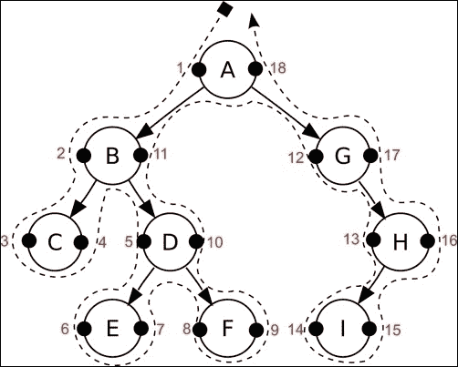
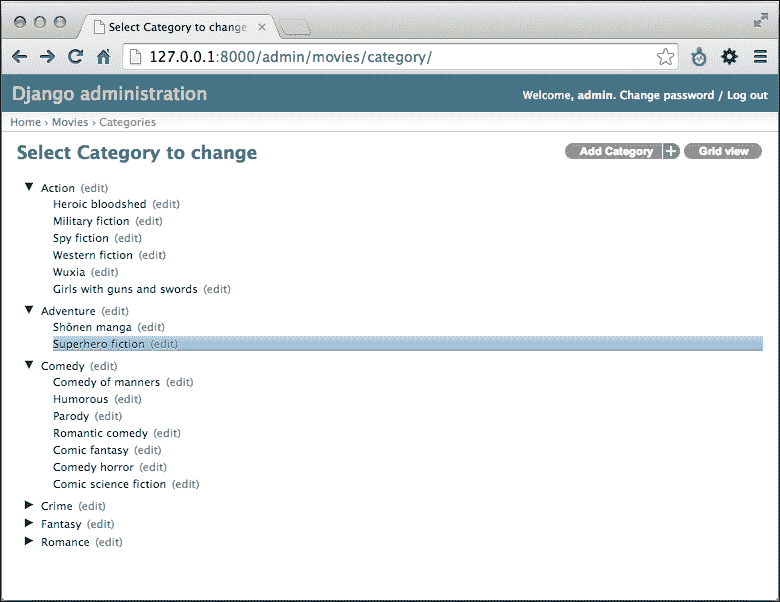
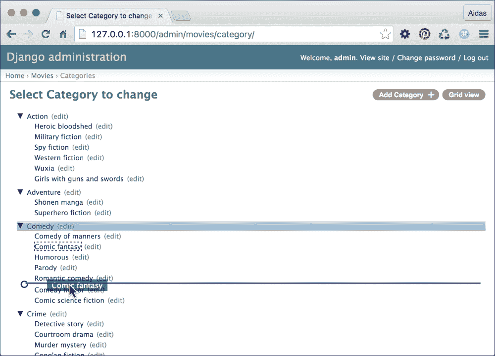
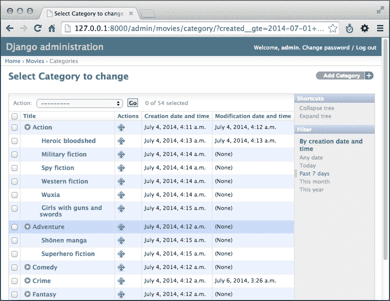
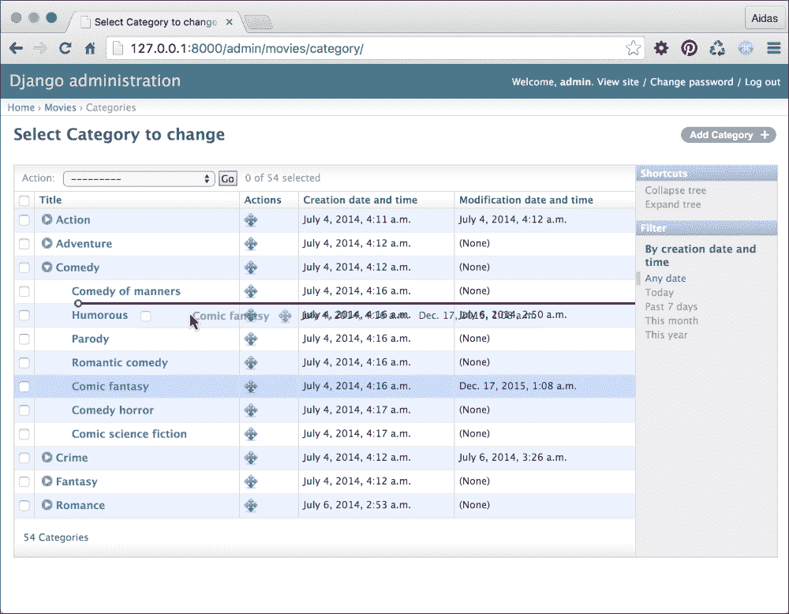
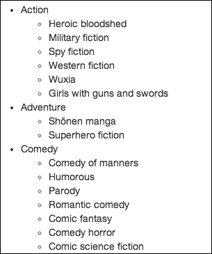
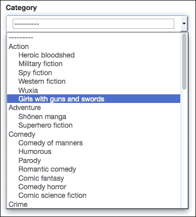
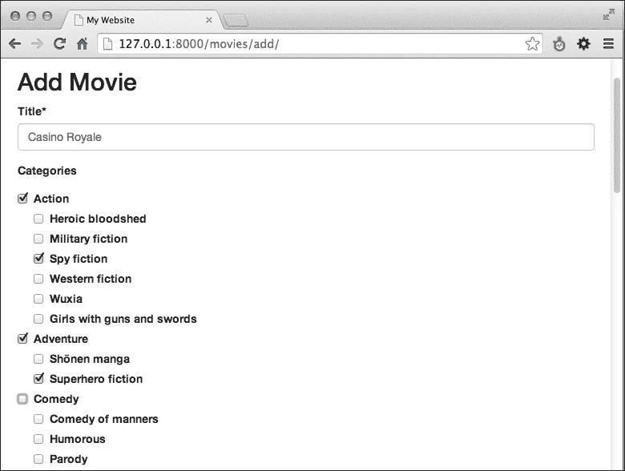

# 第八章。层次结构

在本章中，我们将介绍以下食谱：

+   创建层次类别

+   使用 django-mptt-admin 创建类别管理界面

+   使用 django-mptt-tree-editor 创建类别管理界面

+   在模板中渲染类别

+   在表单中使用单个选择字段选择类别

+   在表单中使用复选框列表选择多个类别

# 简介

无论你构建自己的论坛、线程评论还是分类系统，总会有需要将层次结构保存到数据库中的时刻。尽管关系数据库（如 MySQL 和 PostgreSQL）的表是扁平的，但有一种快速有效的方法来存储层次结构。它被称为**修改后的前序树遍历**（**MPTT**）。MPTT 允许你读取树结构，而无需对数据库进行递归调用。

首先，让我们熟悉树结构的术语。树数据结构是一个以根节点为起点的递归节点集合，具有对子节点的引用。有一个限制，即没有节点会回引用以创建循环，也没有重复的引用。以下是一些其他需要学习的术语：

+   **父节点**是指向子节点的任何节点。

+   **后代**是通过递归从父节点遍历到其子节点可以到达的节点。因此，节点的后代将是其子节点、子节点的子节点，依此类推。

+   **祖先**是通过递归从子节点遍历到其父节点可以到达的节点。因此，节点的祖先将是其父节点、父节点的父节点，依此类推，直到根节点。

+   **兄弟**是指具有相同父节点的节点。

+   **叶**是指没有子节点的节点。

现在，我将解释 MPTT 是如何工作的。想象一下，你将树水平展开，根节点在最上方。树中的每个节点都有左值和右值。想象它们作为节点左右两侧的小左右手柄。然后，你逆时针绕树行走（遍历），从根节点开始，并用数字标记你找到的每个左值或右值：1、2、3，依此类推。它看起来会类似于以下图表：



在这个层次结构的数据库表中，你将为每个节点有一个标题、左值和右值。

现在，如果你想获取具有左值为**2**和右值为**11**的**B**节点的子树，你必须选择所有左值在**2**和**11**之间的节点。它们是**C**、**D**、**E**和**F**。

要获取具有左值为**5**和右值为**10**的**D**节点的所有祖先，你必须选择所有左值小于**5**且右值大于**10**的节点。这些将是**B**和**A**。

要获取节点的后代数量，你可以使用以下公式：*descendants = (right - left - 1) / 2*

因此，**B**节点的后代数量可以按照以下方式计算：*(11 - 2 - 1) / 2 = 4*

如果我们要将**E**节点连接到**C**节点，我们只需要更新它们第一个共同祖先**B**节点的左右值。然后，**C**节点的左值仍然是**3**；**E**节点的左值将变为**4**，右值变为**5**；**C**节点的右值变为**6**；**D**节点的左值变为**7**；**F**节点的左值保持为**8**；其他节点也将保持不变。

类似地，在 MPTT 中还有其他与节点相关的树操作。对于项目中每个层次结构，自己管理所有这些可能过于复杂。幸运的是，有一个名为**django-mptt**的 Django 应用可以处理这些算法，并提供一个简单的 API 来处理树结构。在本章中，你将学习如何使用这个辅助应用。

# 创建层次化类别

为了说明如何处理 MPTT，我们将创建一个`movies`应用，它将有一个层次化的`Category`模型和一个与类别具有多对多关系的`Movie`模型。

## 准备工作

要开始，执行以下步骤：

1.  使用以下命令在你的虚拟环境中安装`django-mptt`：

    ```py
    (myproject_env)$ pip install django-mptt

    ```

1.  然后，创建一个`movies`应用。在设置中将`movies`应用以及`mptt`添加到`INSTALLED_APPS`中，如下所示：

    ```py
    # conf/base.py or settings.py
    INSTALLED_APPS = (
        # ...
        "mptt",
        "movies",
    )
    ```

## 如何操作...

我们将创建一个层次化的`Category`模型和一个`Movie`模型，这些模型将与类别具有多对多关系，如下所示：

1.  打开`models.py`文件，添加一个`Category`模型，它扩展了`mptt.models.MPTTModel`和`CreationModificationDateMixin`，这些我们在第二章中定义了，*数据库结构*。除了来自混入器的字段外，`Category`模型还需要一个`parent`字段，字段类型为`TreeForeignKey`，以及一个`title`字段：

    ```py
    # movies/models.py
    # -*- coding: UTF-8 -*-
    from __future__ import unicode_literals
    from django.db import models
    from django.utils.translation import ugettext_lazy as _
    from django.utils.encoding import \
        python_2_unicode_compatible
    from utils.models import CreationModificationDateMixin
    from mptt.models import MPTTModel
    from mptt.fields import TreeForeignKey, TreeManyToManyField

    @python_2_unicode_compatible
    class Category(MPTTModel, CreationModificationDateMixin):
     parent = TreeForeignKey("self", blank=True, null=True)
        title = models.CharField(_("Title"), max_length=200)

        def __str__(self):
            return self.title

        class Meta:
     ordering = ["tree_id", "lft"]
            verbose_name = _("Category")
            verbose_name_plural = _("Categories")
    ```

1.  然后，创建一个扩展`CreationModificationDateMixin`的`Movie`模型。还包括一个`title`字段和一个`categories`字段，字段类型为`TreeManyToManyField`：

    ```py
    @python_2_unicode_compatible
    class Movie(CreationModificationDateMixin):
        title = models.CharField(_("Title"), max_length=255)
     categories = TreeManyToManyField(Category,
     verbose_name=_("Categories"))

        def __str__(self):
            return self.title

        class Meta:
            verbose_name = _("Movie")
            verbose_name_plural = _("Movies")
    ```

## 它是如何工作的...

`MPTTModel`混入器将为`Category`模型添加`tree_id`、`lft`、`rght`和`level`字段。`tree_id`字段用于你可以有多个树在数据库表中。实际上，每个根类别都保存在一个单独的树中。`lft`和`rght`字段存储 MPTT 算法中使用的左右值。`level`字段存储节点在树中的深度。根节点的级别为`0`。

除了新字段外，`MPTTModel`混入器还添加了用于在树结构中导航的方法，类似于使用 JavaScript 通过 DOM 元素导航。以下列出了这些方法：

+   如果你想要获取一个分类的祖先节点，请使用以下代码：

    ```py
    ancestor_categories = category.get_ancestors(
        ascending=False,
        include_self=False,
    )
    ```

    升序参数定义了从哪个方向读取节点（默认为 `False`）。`include_self` 参数定义是否将分类本身包含在 `QuerySet` 中（默认为 `False`）。

+   要仅获取根分类，请使用以下代码：

    ```py
    root = category.get_root()
    ```

+   如果你想要获取一个分类的直接子节点，请使用以下代码：

    ```py
    children = category.get_children()
    ```

+   要获取一个分类的所有子节点，请使用以下代码：

    ```py
    descendants = category.get_descendants(include_self=False)
    ```

    在这里，`include_self` 参数再次定义是否将分类本身包含在 `QuerySet` 中。

+   如果你想在不查询数据库的情况下获取子节点数量，请使用以下代码：

    ```py
    descendants_count = category.get_descendant_count()
    ```

+   要获取所有兄弟节点，请调用以下方法：

    ```py
    siblings = category.get_siblings(include_self=False)
    ```

    根分类被视为其他根分类的兄弟。

+   要仅获取前一个和后一个兄弟节点，请调用以下方法：

    ```py
    previous_sibling = category.get_previous_sibling()
    next_sibling = category.get_next_sibling()
    ```

+   此外，还有方法检查分类是否为根节点、子节点或叶节点，如下所示：

    ```py
    category.is_root_node()
    category.is_child_node()
    category.is_leaf_node()
    ```

所有这些方法都可以在视图、模板或管理命令中使用。如果你想操作树结构，你也可以使用 `insert_at()` 和 `move_to()` 方法。在这种情况下，你可以阅读有关它们和树管理器方法的文档，请参阅[`django-mptt.github.io/django-mptt/models.html`](http://django-mptt.github.io/django-mptt/models.html)。

在前面的模型中，我们使用了 `TreeForeignKey` 和 `TreeManyToManyField`。这些与 `ForeignKey` 和 `ManyToManyField` 类似，不同之处在于它们在管理界面中以缩进的形式显示选择项。

此外，请注意，在 `Category` 模型的 `Meta` 类中，我们按 `tree_id` 和 `lft` 值的顺序对分类进行排序，以便在树结构中自然显示分类。

## 参见

+   在第二章的*创建用于处理创建和修改日期的模型混入*食谱中，*数据库结构*

+   在第七章的*结构化页面菜单*食谱中，*Django CMS*

+   *使用 django-mptt-admin 创建分类管理界面* 食谱

# 使用 django-mptt-admin 创建分类管理界面

`django-mptt` 应用程序附带一个简单的模型管理混入，允许你创建树结构并以缩进形式列出。要重新排序树，你需要自己创建此功能或使用第三方解决方案。目前，有两个应用程序可以帮助你为层次模型创建可拖拽的管理界面。其中之一是 `django-mptt-admin`。让我们在本食谱中看看它。

## 准备工作

首先，我们需要通过以下步骤安装 `django-mptt-admin` 应用程序：

1.  首先，使用以下命令在你的虚拟环境中安装应用程序：

    ```py
    (myproject_env)$ pip install django-mptt-admin

    ```

1.  然后，将其放入设置中的 `INSTALLED_APPS`，如下所示：

    ```py
    # conf/base.py or settings.py
    INSTALLED_APPS = (
        # ...
        "django_mptt_admin"
    )
    ```

## 如何操作...

创建一个扩展 `DjangoMpttAdmin` 而不是 `admin.ModelAdmin` 的 `Category` 模型的管理界面，如下所示：

```py
# movies/admin.py
# -*- coding: UTF-8 -*-
from __future__ import unicode_literals
from django.contrib import admin
from django_mptt_admin.admin import DjangoMpttAdmin
from .models import Category

class CategoryAdmin(DjangoMpttAdmin):
    list_display = ["title", "created", "modified"]
    list_filter = ["created"]

admin.site.register(Category, CategoryAdmin)
```

## 它是如何工作的...

分类的管理界面将有两种模式：树视图和网格视图。树视图看起来类似于以下截图：



树视图使用 jqTree jQuery 库进行节点操作。你可以展开和折叠分类以获得更好的概览。要重新排序或更改依赖关系，你可以在这个列表视图中拖放标题。在重新排序过程中，用户界面看起来类似于以下截图：



### 注意

注意，任何常规的列表相关设置，如 `list_display` 或 `list_filter`，都将被忽略。

如果你想要过滤分类、按特定字段排序或过滤，或应用管理操作，你可以切换到网格视图，它显示默认的分类变更列表。

## 参见

+   *创建分层分类* 的配方

+   *使用 django-mptt-tree-editor 创建分类管理界面* 的配方

# 使用 django-mptt-tree-editor 创建分类管理界面

如果你想在你的管理界面中使用变更列表的常用功能，例如列、管理操作、可编辑字段或过滤器，以及在同一视图中操作树结构，你需要使用另一个名为 `django-mptt-tree-editor` 的第三方应用程序。让我们看看如何做到这一点。

## 准备工作

首先，我们需要安装 `django-mptt-tree-editor` 应用程序。执行以下步骤：

1.  首先，使用以下命令在你的虚拟环境中安装应用程序：

    ```py
    (myproject_env)$ pip install django-mptt-tree-editor

    ```

1.  然后，将其放入设置中的 `INSTALLED_APPS`，如下所示：

    ```py
    # conf/base.py or settings.py
    INSTALLED_APPS = (
        # ...
        "mptt_tree_editor"
    )
    ```

## 如何做到这一点...

创建一个扩展 `TreeEditor` 而不是 `admin.ModelAdmin` 的 `Category` 模型的管理界面。确保你在 `list_display` 设置的开始处添加 `indented_short_title` 和 `actions_column`，如下所示：

```py
# movies/admin.py
# -*- coding: UTF-8 -*-
from __future__ import unicode_literals
from django.contrib import admin
from mptt_tree_editor.admin import TreeEditor
from .models import Category

class CategoryAdmin(TreeEditor):
    list_display = ["indented_short_title", "actions_column", "created", "modified"]
    list_filter = ["created"]

admin.site.register(Category, CategoryAdmin)
```

## 它是如何工作的...

你的分类管理界面现在看起来类似于以下截图：



分类管理界面允许你展开或折叠分类。`indented_short_title` 列将返回分类的缩进短标题（如果有的话）或分类的缩进 Unicode 表示。定义为 `actions_column` 的列将被渲染为拖放以重新排序或重构分类的手柄。由于拖动手柄位于不同于分类标题的列中，使用它可能会感觉有些奇怪。在重新排序过程中，用户界面看起来类似于以下截图：



如你所见，你可以在同一视图中使用默认 Django 管理界面的所有列表相关功能。

在`django-mptt-tree-editor`中，树编辑功能是从另一个使用 Django 制作的 CMS（内容管理系统）FeinCMS 移植过来的。

## 参见

+   *创建层次类别*的配方

+   *使用 django-mptt-admin 创建类别管理界面*的配方

# 在模板中渲染类别

一旦你在你的应用中创建了类别，你需要在模板中按层次结构显示它们。最简单的方法是使用`django-mptt`应用中的``模板标签。我将在本配方中向你展示如何做到这一点。

## 准备工作

确保你已经创建了`Category`模型，并在数据库中输入了一些类别。

## 如何做...

将你的层次类别`QuerySet`传递给模板，然后使用以下方式使用``模板标签：

1.  创建一个视图，加载所有类别并将它们传递给一个模板：

    ```py
    # movies/views.py
    # -*- coding: UTF-8 -*-
    from __future__ import unicode_literals
    from django.shortcuts import render
    from .models import Category

    def movie_category_list(request):
        context = {
            "categories": Category.objects.all(),
        }
        return render(
            request,
            "movies/movie_category_list.html",
            context
        )
    ```

1.  创建一个包含以下内容的模板：

    ```py
    {# templates/movies/movie_category_list.html #}
    
    

    
    

    
    <ul class="root">
     
            <li>
                {{ node.title }}
                
                    <ul class="children">
                        {{ children }}
                    </ul>
                
            </li>
     
    </ul>
    
    ```

1.  创建一个 URL 规则来显示视图。

## 它是如何工作的...

模板将被渲染为嵌套列表，如下面的截图所示：



``模板标签块模板标签接受类别的`QuerySet`，并使用标签中的模板内容渲染列表。这里使用了两个特殊变量：`node`和`children`。`node`变量是`Category`模型的一个实例。你可以使用它的字段或方法，如`{{ node.get_descendant_count }}`、`{{ node.level }}`或`{{ node.is_root }}`来添加特定的 CSS 类或 HTML5 `data-*`属性以供 JavaScript 使用。第二个变量`children`定义了当前类别子类的放置位置。

## 更多内容...

如果你的层次结构非常复杂，有超过 20 个深度级别，建议使用非递归模板过滤器`tree_info`。有关如何做到这一点的更多信息，请参阅官方文档[`django-mptt.github.io/django-mptt/templates.html#tree-info-filter`](http://django-mptt.github.io/django-mptt/templates.html#tree-info-filter)。

## 参见

+   在第四章 *模板和 JavaScript* 中的*使用 HTML5 数据属性*配方

+   *创建层次类别*的配方

+   *在表单中使用单选字段选择类别*的配方

# 在表单中使用单选字段选择类别

如果你想在表单中显示类别选择会发生什么？层次结构将如何呈现？在`django-mptt`中有一个特殊的`TreeNodeChoiceField`表单字段，你可以用它来在选择的字段中显示层次结构。让我们看看如何做到这一点。

## 准备工作

我们将从之前配方中定义的`movies`应用开始。

## 如何做...

让我们创建一个包含类别字段的表单，并在视图中显示它：

1.  在应用的`forms.py`文件中，创建一个包含类别字段的表单，如下所示：

    ```py
    # movies/forms.py
    # -*- coding: UTF-8 -*-
    from __future__ import unicode_literals
    from django import forms
    from django.utils.translation import ugettext_lazy as _
    from django.utils.html import mark_safe
    from mptt.forms import TreeNodeChoiceField
    from .models import Category

    class MovieFilterForm(forms.Form):
     category = TreeNodeChoiceField(
     label=_("Category"),
     queryset=Category.objects.all(),
     required=False,
     level_indicator=mark_safe(
     "&nbsp;&nbsp;&nbsp;&nbsp;"
     ),
        )
    ```

1.  然后，创建一个 URL 规则、视图和模板来显示这个表单。

## 它是如何工作的...

类别选择将类似于以下：



`TreeNodeChoiceField` 的行为类似于 `ModelChoiceField`；然而，它以缩进的形式显示层次选择。默认情况下，`TreeNodeChoiceField` 使用三个连字符 `---` 作为每个更深层级的前缀。在我们的例子中，我们将通过将 `level_indicator` 参数传递给字段来更改级别指示符为四个非换行空格（`&nbsp;` HTML 实体）。为了确保非换行空格不会被转义，我们使用了 `mark_safe()` 函数。

## 参见

+   *在表单中使用复选框列表来选择多个类别* 的食谱

# 在表单中使用复选框列表来选择多个类别

当在表单中需要选择多个类别时，你可以使用由 `django-mptt` 提供的 `TreeNodeMultipleChoiceField` 多选字段。然而，从 GUI 的角度来看，多选字段并不非常用户友好，因为用户需要滚动并按住控制键同时点击才能进行多选。这真的很糟糕。一个更好的方法将是提供一个复选框列表来选择类别。在这个食谱中，我们将创建一个允许你在表单中显示缩进复选框的字段。

## 准备工作

我们将从之前食谱中定义的 `movies` 应用程序开始，以及你应该在你的项目中拥有的 `utils` 应用程序。

## 如何操作...

要渲染带有复选框的缩进类别列表，创建并使用一个新的 `MultipleChoiceTreeField` 表单字段，并为此字段创建一个 HTML 模板。具体的模板将传递到表单的 crispy 布局中。为此，执行以下步骤：

1.  在 `utils` 应用中添加一个 `fields.py` 文件，并创建一个扩展 `ModelMultipleChoiceField` 的 `MultipleChoiceTreeField` 表单字段，如下所示：

    ```py
    # utils/fields.py
    # -*- coding: utf-8 -*-
    from __future__ import unicode_literals
    from django import forms

    class MultipleChoiceTreeField(
        forms.ModelMultipleChoiceField
    ):
        widget = forms.CheckboxSelectMultiple

        def label_from_instance(self, obj):
            return obj
    ```

1.  使用新的带有类别选择的字段来在电影创建表单中选择。此外，在表单布局中，将自定义模板传递给类别字段，如下所示：

    ```py
    # movies/forms.py
    # -*- coding: UTF-8 -*-
    from __future__ import unicode_literals
    from django import forms
    from django.utils.translation import ugettext_lazy as _
    from crispy_forms.helper import FormHelper
    from crispy_forms import layout, bootstrap
    from utils.fields import MultipleChoiceTreeField
    from .models import Movie, Category

    class MovieForm(forms.ModelForm):
     categories = MultipleChoiceTreeField(
     label=_("Categories"),
     required=False,
     queryset=Category.objects.all(),
     )
        class Meta:
            model = Movie

        def __init__(self, *args, **kwargs):
            super(MovieForm, self).__init__(*args, **kwargs)
            self.helper = FormHelper()
            self.helper.form_action = ""
            self.helper.form_method = "POST"
            self.helper.layout = layout.Layout(
                layout.Field("title"),
     layout.Field(
     "categories",
     template="utils/"\
     "checkbox_select_multiple_tree.html"
     ),
                bootstrap.FormActions(
                    layout.Submit("submit", _("Save")),
                )
            )
    ```

1.  创建一个类似以下所示的 Bootstrap 风格的复选框列表模板：

    ```py
    {# templates/utils/checkbox_select_multiple_tree.html #}
    
    

    <div id="div_{{ field.auto_id }}" class="form-group {{ wrapper_class }} has-error {{ field.css_classes }}">
        
            <label for="{{ field.id_for_label }}" class="control-label {{ label_class }} requiredField">
                {{ field.label|safe }}<span class="asteriskField">*</span>
            </label>
        
        <div class="controls {{ field_class }}" {{ flat_attrs|safe }}>
            

     
                <label class="checkbox-{{ inline_class }} level-{{ choice_instance.level }}">
                    <input type="checkbox" checked="checked"

    name="{{ field.html_name }}"id="id_{{ field.html_name }}_{{ forloop.counter }}"value="{{ choice_value|unlocalize }}"{{ field.field.widget.attrs|flatatt }}>
                    {{ choice_instance }}
                </label>
     
            
        </div>
    </div>
    ```

1.  创建一个 URL 规则、视图和模板，使用 `` 模板标签来显示表单。要了解如何使用此模板标签，请参考第三章中的 *使用 django-crispy-forms 创建表单布局* 食谱。

1.  最后，在你的 CSS 文件中添加一个规则，通过设置 margin-left 参数来缩进具有类名的标签，例如 `.level-0`、`.level-1`、`.level-2` 等。确保你有足够多的这些 CSS 类，以适应你上下文中可能的树的最大深度，如下所示：

    ```py
    /* style.css */
    .level-0 {
        margin-left: 0;
    }
    .level-1 {
        margin-left: 20px;
    }
    .level-2 {
        margin-left: 40px;
    }
    ```

## 它是如何工作的...

因此，我们得到以下表单：



与 Django 的默认行为相反，Django 在 Python 代码中硬编码了字段生成，而`django-crispy-forms`应用使用模板来渲染字段。您可以在`crispy_forms/templates/bootstrap3`下浏览它们，并将其中一些复制到您项目模板目录中的类似路径，并在必要时覆盖它们。

在我们的电影创建表单中，我们为类别字段传递了一个自定义模板，该模板将为`<label>`标签添加`.level-*` CSS 类，并包裹复选框。`CheckboxSelectMultiple`小部件的一个问题是，当渲染时，它只使用选择值和选择文本，而在我们的情况下，我们还需要其他属性，如类别深度级别。为了解决这个问题，我们将创建一个自定义的`MultipleChoiceTreeField`表单字段，它扩展了`ModelMultipleChoiceField`并重写了`label_from_instance`方法，以返回类别本身而不是其 Unicode 表示。字段的模板看起来很复杂；然而，它只是普通字段模板（`crispy_forms/templates/bootstrap3/field.html`）和多个复选框字段模板（`crispy_forms/templates/bootstrap3/layout/checkboxselectmultiple.html`）的组合，包含所有必要的 Bootstrap 3 标记。我们只是稍作修改，添加了`.level-*` CSS 类。

## 参见

+   在第三章 *表单和视图* 中的 `Creating a form layout with django-crispy-forms` 配方

+   *使用单个选择字段在表单中选择类别* 的配方
