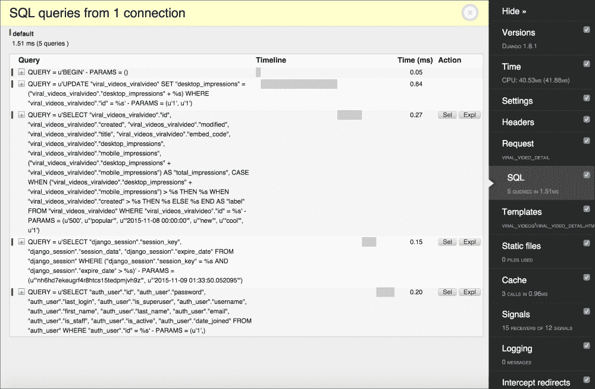
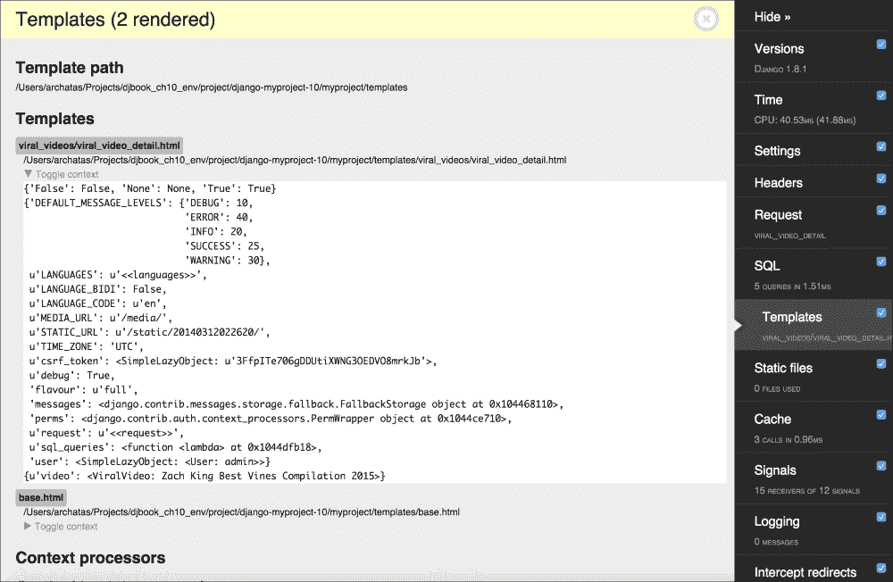

# 第十章。铃铛和装饰

在本章中，我们将介绍以下菜谱：

+   使用 Django shell

+   使用数据库查询表达式

+   为更好的国际化支持对 slugify()函数进行猴子补丁

+   切换调试工具栏

+   使用 ThreadLocalMiddleware

+   缓存方法返回值

+   使用 Memcached 来缓存 Django 视图

+   使用信号通知管理员关于新条目的信息

+   检查缺失的设置

# 简介

在本章中，我们将介绍其他几个重要的小技巧，这将帮助你更好地理解和利用 Django。你将了解如何使用 Django shell 在将代码写入文件之前进行实验。你将介绍猴子补丁，也称为游击式补丁，这是 Python 和 Ruby 等动态语言的一个强大功能。你将学习如何调试代码和检查其性能。你将了解如何从任何模块访问当前登录用户和其他请求参数。此外，你还将学习如何缓存值、处理信号和创建系统检查。准备好一个有趣的编程体验！

# 使用 Django shell

在虚拟环境激活并且将你的项目目录选为当前目录后，在你的命令行工具中输入以下命令：

```py
(myproject_env)$ python manage shell

```

通过执行前面的命令，你将进入一个为你的 Django 项目配置的交互式 Python shell，在那里你可以玩转代码，检查类，尝试方法，或即时执行脚本。在本菜谱中，我们将介绍你需要了解的最重要的函数，以便与 Django shell 一起工作。

## 准备工作

你可以使用以下命令之一安装 IPython 或 bpython，这将突出显示 Django shell 输出的语法，并添加一些其他辅助工具：

```py
(myproject_env)$ pip install ipython
(myproject_env)$ pip install bpython

```

## 如何做到...

通过遵循以下说明来学习使用 Django shell 的基本知识：

1.  通过输入以下命令来运行 Django shell：

    ```py
    (myproject_env)$ python manage.py shell

    ```

    提示符将更改为`In [1]:`或`>>>`，具体取决于你是否使用 IPython。如果你使用 bpython，shell 将显示在完整的终端窗口中，底部有可用的快捷键（类似于 nano 编辑器），并且你还可以在输入时获得代码高亮和文本自动完成。

1.  现在，你可以导入类、函数或变量，并与之互动。例如，要查看已安装模块的版本，你可以导入该模块，然后尝试读取其`__version__`、`VERSION`或`version`变量，如下所示：

    ```py
    >>> import re
    >>> re.__version__
    '2.2.1'

    ```

1.  要获取模块、类、函数、方法、关键字或文档主题的全面描述，请使用`help()`函数。你可以传递一个包含特定实体路径的字符串，或者直接传递实体本身，如下所示：

    ```py
    >>> help("django.forms")

    ```

    这将打开`django.forms`模块的帮助页面。使用箭头键上下滚动页面。按*Q*键返回 shell。

    ### 小贴士

    如果你不带参数运行`help()`，它将打开交互式帮助。在这里，你可以输入模块、类、函数等的任何路径，并获取有关其功能和使用方法的信息。要退出交互式帮助，请按*Ctrl* + *D*。

1.  这是一个将实体传递给`help()`函数的示例。这将打开`ModelForm`类的帮助页面，如下所示：

    ```py
    >>> from django.forms import ModelForm
    >>> help(ModelForm)

    ```

1.  要快速查看模型实例可用的字段和值，请使用`__dict__`属性。此外，使用`pprint()`函数以更可读的格式（不仅仅是长行）打印字典，如下所示：

    ```py
    >>> from pprint import pprint
    >>> from django.contrib.contenttypes.models import ContentType
    >>> pprint(ContentType.objects.all()[0].__dict__)
    {'_state': <django.db.models.base.ModelState object at 0x10756d250>,
     'app_label': u'bulletin_board',
     'id': 11,
     'model': u'bulletin',
     'name': u'Bulletin'}

    ```

    注意，使用`__dict__`，我们不会得到多对多关系。然而，这可能足以快速了解字段和值。

1.  要获取对象的全部可用属性和方法，你可以使用`dir()`函数，如下所示：

    ```py
    >>> dir(ContentType())
    ['DoesNotExist', 'MultipleObjectsReturned', '__class__', '__delattr__', '__dict__', '__doc__', '__eq__', '__format__', '__getattribute__', '__hash__', '__init__', u'__module__', '__ne__', '__new__', '__reduce__', '__reduce_ex__', '__repr__', '__setattr__', '__sizeof__', '__str__', '__subclasshook__', '__unicode__', '__weakref__', '_base_manager', '_default_manager', '_deferred', '_do_insert', '_do_update', '_get_FIELD_display', '_get_next_or_previous_by_FIELD', '_get_next_or_previous_in_order', '_get_pk_val', '_get_unique_checks', '_meta', '_perform_date_checks', '_perform_unique_checks', '_save_parents', '_save_table', '_set_pk_val', '_state', 'app_label', 'clean', 'clean_fields', 'content_type_set_for_comment', 'date_error_message', 'delete', 'full_clean', 'get_all_objects_for_this_type', 'get_object_for_this_type', 'id', 'logentry_set', 'model', 'model_class', 'name', 'natural_key', 'objects', 'permission_set', 'pk', 'prepare_database_save', 'save', 'save_base', 'serializable_value', 'unique_error_message', 'validate_unique']

    ```

    要按行打印这些属性，你可以使用以下方法：

    ```py
    >>> pprint(dir(ContentType()))

    ```

1.  Django shell 在将它们放入你的模型方法、视图或管理命令之前，用于实验`QuerySets`或正则表达式。例如，要检查电子邮件验证正则表达式，你可以在 Django shell 中键入以下内容：

    ```py
    >>> import re
    >>> email_pattern = re.compile(r"[^@]+@[^@]+\.[^@]+")
    >>> email_pattern.match("aidas@bendoraitis.lt")
    <_sre.SRE_Match object at 0x1075681d0>

    ```

1.  如果你想要尝试不同的`QuerySets`，你需要执行项目中模型和应用的设置，如下所示：

    ```py
    >>> import django
    >>> django.setup()
    >>> from django.contrib.auth.models import User
    >>> User.objects.filter(groups__name="Editors")
    [<User: admin>]

    ```

1.  要退出 Django shell，请按*Ctrl* + *D*或键入以下命令：

    ```py
    >>> exit()

    ```

## 它是如何工作的...

正常 Python shell 和 Django shell 之间的区别在于，当你运行 Django shell 时，`manage.py`会将`DJANGO_SETTINGS_MODULE`环境变量设置为项目的设置路径，然后 Django shell 中的所有代码都在你的项目上下文中处理。

## 参见

+   *Using database query expressions* 食谱

+   *Monkey-patching the slugify() function for better internationalization support* 食谱

# 使用数据库查询表达式

Django **对象关系映射**（**ORM**）包含特殊抽象构造，可用于构建复杂的数据库查询。它们被称为**查询表达式**，允许你过滤数据、排序它、注解新列和聚合关系。在本食谱中，我们将看到如何在实践中使用它。我们将创建一个显示病毒视频并计算每个视频在移动设备和桌面设备上被观看次数的应用。

## 准备工作

首先，将`django-mobile`安装到你的虚拟环境中。此模块将用于区分桌面设备和移动设备：

```py
(myproject_env)$ pip install django-mobile

```

要配置它，你需要修改几个项目设置，如下所示。除此之外，让我们创建`viral_videos`应用。将它们都放在`INSTALLED_APPS`下：

```py
# conf/base.py or settings.py
INSTALLED_APPS = (
    # ...
    # third party
 "django_mobile",

    # project-specific
    "utils",
 "viral_videos",
)

TEMPLATE_CONTEXT_PROCESSORS = (
    # ...
    "django_mobile.context_processors.flavour",
)

TEMPLATE_LOADERS = (
    # ...
    "django_mobile.loader.Loader",
)

MIDDLEWARE_CLASSES = (
    # ...
    "django_mobile.middleware.MobileDetectionMiddleware",
    "django_mobile.middleware.SetFlavourMiddleware",
)
```

接下来，创建一个包含创建和修改时间戳、标题、嵌入代码、桌面设备上的印象和移动设备上的印象的病毒视频模型，如下所示：

```py
# viral_videos/models.py
# -*- coding: UTF-8 -*-
from __future__ import unicode_literals
from django.db import models
from django.utils.translation import ugettext_lazy as _
from django.utils.encoding import python_2_unicode_compatible
from utils.models import CreationModificationDateMixin, UrlMixin

@python_2_unicode_compatible
class ViralVideo(CreationModificationDateMixin, UrlMixin):
    title = models.CharField(
        _("Title"), max_length=200, blank=True)
    embed_code = models.TextField(_("YouTube embed code"), blank=True)
    desktop_impressions = models.PositiveIntegerField(
        _("Desktop impressions"), default=0)
    mobile_impressions = models.PositiveIntegerField(
        _("Mobile impressions"), default=0)

    class Meta:
        verbose_name = _("Viral video")
        verbose_name_plural = _("Viral videos")

    def __str__(self):
        return self.title

    def get_url_path(self):
        from django.core.urlresolvers import reverse
        return reverse(
            "viral_video_detail",
            kwargs={"id": str(self.id)}
        )
```

## 如何做到这一点...

为了说明查询表达式，让我们创建病毒视频详情视图并将其插入到 URL 配置中，如下所示：

1.  在`views.py`中创建`viral_video_detail()`视图，如下所示：

    ```py
    # viral_videos/views.py
    # -*- coding: UTF-8 -*-
    from __future__ import unicode_literals
    import datetime
    from django.shortcuts import render, get_object_or_404
    from django.db import models
    from django.conf import settings
    from .models import ViralVideo

    POPULAR_FROM = getattr(
        settings, "VIRAL_VIDEOS_POPULAR_FROM", 500
    )

    def viral_video_detail(request, id):
        yesterday = datetime.date.today() - \
            datetime.timedelta(days=1)

        qs = ViralVideo.objects.annotate(
            total_impressions=\
                models.F("desktop_impressions") + \
                models.F("mobile_impressions"),
            label=models.Case(
                models.When(
                    total_impressions__gt=OPULAR_FROM,
                    then=models.Value("popular")
                ),
                models.When(
                    created__gt=yesterday,
                    then=models.Value("new")
                ),
                default=models.Value("cool"),
                output_field=models.CharField(),
            ),
        )

     # DEBUG: check the SQL query that Django ORM generates
     print(qs.query)

        qs = qs.filter(pk=id)
        if request.flavour == "mobile":
            qs.update(
                mobile_impressions=\
                    models.F("mobile_impressions") + 1
            )
        else:
            qs.update(
                desktop_impressions=\
                    models.F("desktop_impressions") + 1
            )

        video = get_object_or_404(qs)

        return render(
            request,
            "viral_videos/viral_video_detail.html",
            {'video': video}
        )
    ```

1.  定义应用的 URL 配置，如下所示：

    ```py
    # viral_videos/urls.py
    # -*- coding: UTF-8 -*-
    from __future__ import unicode_literals
    from django.conf.urls import *
    urlpatterns = [
        url(
            r"^(?P<id>\d+)/",
            "viral_videos.views.viral_video_detail",
            name="viral_video_detail"
        ),
    ]
    ```

1.  将应用的 URL 配置包含到项目的根 URL 配置中，如下所示：

    ```py
    # myproject/urls.py
    # -*- coding: UTF-8 -*-
    from __future__ import unicode_literals
    from django.conf.urls import include, url
    from django.conf import settings
    from django.conf.urls.i18n import i18n_patterns

    urlpatterns = i18n_patterns("",
        # ...
        url(r"^viral-videos/", include("viral_videos.urls")),
    )
    ```

1.  为`viral_video_detail()`视图创建一个模板，如下所示：

    ```py
    {# templates/viral_videos/viral_video_detail.html #}
    
    

    
        <h1>{{ video.title }}
            <span class="badge">{{ video.label }}</span>
        </h1>
        <div>{{ video.embed_code|safe }}</div>
        <div>
            <h2></h2>
            <ul>
                <li>:
                    {{ video.desktop_impressions }}</li>
                <li>:
                    {{ video.mobile_impressions }}</li>
                <li>:
                    {{ video.total_impressions }}</li>
            </ul>
        </div>
    
    ```

1.  为`viral_videos`应用设置管理权限并向数据库中添加一些视频。

## 如何工作...

你可能已经注意到了视图中的`print()`语句。它是临时用于调试目的的。如果你运行本地开发服务器并在浏览器中访问`http://127.0.0.1:8000/en/viral-videos/1/`中的第一个视频，你将在控制台看到以下 SQL 查询被打印出来：

```py
SELECT "viral_videos_viralvideo"."id", "viral_videos_viralvideo"."created", "viral_videos_viralvideo"."modified", "viral_videos_viralvideo"."title", "viral_videos_viralvideo"."embed_code", "viral_videos_viralvideo"."desktop_impressions", "viral_videos_viralvideo"."mobile_impressions", ("viral_videos_viralvideo"."desktop_impressions" + "viral_videos_viralvideo"."mobile_impressions") AS "total_impressions", CASE WHEN ("viral_videos_viralvideo"."desktop_impressions" + "viral_videos_viralvideo"."mobile_impressions") > 500 THEN popular WHEN "viral_videos_viralvideo"."created" > 2015-11-06 00:00:00 THEN new ELSE cool END AS "label" FROM "viral_videos_viralvideo"
```

然后，在浏览器中，你会看到一个类似于以下图像的简单页面，显示视频标题、视频标签、嵌入的视频以及桌面设备、移动设备和总印象数：


Django `QuerySets`中的`annotate()`方法允许你在`SELECT SQL`语句中添加额外的列，以及从`QuerySets`检索到的对象的即时创建属性。使用`models.F()`，我们可以引用所选数据库表中的不同字段值。在本例中，我们将创建`total_impressions`属性，它是桌面设备和移动设备上的印象总和。

使用`models.Case()`和`models.When()`，我们可以根据不同的条件返回值。为了标记值，我们使用`models.Value()`。在我们的例子中，我们将为 SQL 查询创建`label`列，并为`QuerySet`返回的对象创建属性。如果印象数超过 500，则将其设置为*popular*，如果它是今天创建的，则设置为*new*，否则设置为*cool*。

在视图的末尾，我们调用了`qs.update()`方法。根据访客使用的设备，它们会增加当前视频的`mobile_impressions`或`desktop_impressions`。增加操作在 SQL 级别发生。这解决了所谓的竞争条件，即当两个或更多访客同时访问视图并尝试同时增加印象计数时。

## 参见

+   *使用 Django shell*配方

+   在第二章的*创建与 URL 相关的方法的模型混入*配方中，*数据库结构*

+   在第二章的*创建用于处理创建和修改日期的模型混入*配方中，*数据库结构*

# 为更好的国际化支持对 slugify()函数进行猴子补丁

Monkey patch 或 guerrilla patch 是一段在运行时扩展或修改另一段代码的代码。通常不建议经常使用 monkey patch；然而，有时，这是在不创建模块的单独分支的情况下修复第三方模块中错误的唯一可能方法。此外，monkey patching 可以用来准备功能或单元测试，而不需要使用复杂的数据库或文件操作。在这个菜谱中，您将学习如何用来自第三方 `awesome-slugify` 模块的默认 `slugify()` 函数替换，该模块更智能地处理德语、希腊语和俄语单词，并允许为其他语言创建定制的 slug。作为一个快速提醒，我们使用 `slugify()` 函数来创建对象的标题或上传的文件名的 URL 友好版本；它删除前后空白字符，将文本转换为小写，删除非单词字符，并将空格转换为连字符。

## 准备工作

要开始，请执行以下步骤：

1.  在您的虚拟环境中安装 `awesome-slugify`，如下所示：

    ```py
    (myproject_env)$ pip install awesome-slugify

    ```

1.  在您的项目中创建一个 `guerrilla_patches` 应用程序，并将其放在设置中的 `INSTALLED_APPS` 下。

## 如何操作...

在 `guerrilla_patches` 应用程序的 `models.py` 文件中，添加以下内容：

```py
# guerrilla_patches/models.py
# -*- coding: UTF-8 -*-
from __future__ import unicode_literals
from django.utils import text
from slugify import slugify_de as awesome_slugify
awesome_slugify.to_lower = True
text.slugify = awesome_slugify
```

## 它是如何工作的...

默认的 Django `slugify()` 函数处理德语变音符号不正确。要亲自查看这一点，请在 Django shell 中运行以下代码而不使用 monkey patch：

```py
(myproject_env)$ python manage.py shell
>>> from django.utils.text import slugify
>>> slugify("Heizölrückstoßabdämpfung")
u'heizolruckstoabdampfung'

```

在德语中，这是不正确的，因为字母 `ß` 完全被移除，而不是用 `ss` 替换，而字母 `ä`、`ö` 和 `ü` 被改为 `a`、`o` 和 `u`；而它们应该被替换为 `ae`、`oe` 和 `ue`。

我们所做的 monkey patch 在初始化时加载 `django.utils.text` 模块，并将 `Slugify` 类的可调用实例分配给 `slugify()` 函数。现在，如果您在 Django shell 中运行相同的代码，您将得到不同但正确的结果，如下所示：

```py
(myproject_env)$ python manage.py shell
>>> from django.utils.text import slugify
>>> slugify("Heizölrückstoßabdämpfung")
u'heizoelrueckstossabdaempfung'

```

想了解更多关于如何使用 `awesome-slugify` 模块的信息，请参考以下链接：[`pypi.python.org/pypi/awesome-slugify`](https://pypi.python.org/pypi/awesome-slugify)。

## 还有更多...

在创建任何 monkey patch 之前，我们需要完全理解我们想要修改的代码是如何工作的。这可以通过分析现有代码和检查不同变量的值来完成。为此，有一个有用的内置 Python 调试器 `pdb` 模块，可以临时添加到 Django 代码或任何第三方模块中，以便在任何断点处停止开发服务器的执行。使用以下代码来调试 Python 模块的未知部分：

```py
import pdb
pdb.set_trace()
```

这将启动交互式 shell，您可以在其中输入变量以查看它们的值。如果您输入 `c` 或 `continue`，代码执行将继续到下一个断点。如果您输入 `q` 或 `quit`，管理命令将被终止。您可以了解更多关于 Python 调试器的命令以及如何检查代码的跟踪回溯，请参阅[`docs.python.org/2/library/pdb.html`](https://docs.python.org/2/library/pdb.html)。

另一种快速查看开发服务器中变量值的方法是使用变量作为消息发出警告，如下所示：

```py
raise Warning, some_variable

```

当您处于 `DEBUG` 模式时，Django 记录器将为您提供跟踪回溯和其他局部变量。

### 小贴士

在将代码提交到仓库之前，不要忘记移除调试函数。

## 相关内容

+   *使用 Django shell* 的食谱

# 切换调试工具栏

在使用 Django 进行开发时，您可能想要检查请求头和参数，检查当前的模板上下文，或测量 SQL 查询的性能。所有这些以及更多都可以通过 Django 调试工具栏实现。它是一组可配置的面板，显示有关当前请求和响应的各种调试信息。在本食谱中，我将指导您如何根据由书签工具设置的 cookie 切换调试工具栏的可见性。书签工具是一个包含一小段 JavaScript 代码的书签，您可以在浏览器中的任何页面上运行它。

## 准备工作

要开始切换调试工具栏的可见性，请查看以下步骤：

1.  将 Django 调试工具栏安装到您的虚拟环境中：

    ```py
    (myproject_env)$ pip install django-debug-toolbar==1.4

    ```

1.  在设置中将 `debug_toolbar` 放入 `INSTALLED_APPS`。

## 如何做...

按照以下步骤设置 Django 调试工具栏，可以使用浏览器中的书签工具切换其开启或关闭：

1.  添加以下项目设置：

    ```py
    MIDDLEWARE_CLASSES = (
        # ...
        "debug_toolbar.middleware.DebugToolbarMiddleware",
    )

    DEBUG_TOOLBAR_CONFIG = {
        "DISABLE_PANELS": [],
     "SHOW_TOOLBAR_CALLBACK": \
     "utils.misc.custom_show_toolbar",
        "SHOW_TEMPLATE_CONTEXT": True,
    }

    DEBUG_TOOLBAR_PANELS = [
        "debug_toolbar.panels.versions.VersionsPanel",
        "debug_toolbar.panels.timer.TimerPanel",
        "debug_toolbar.panels.settings.SettingsPanel",
        "debug_toolbar.panels.headers.HeadersPanel",
        "debug_toolbar.panels.request.RequestPanel",
        "debug_toolbar.panels.sql.SQLPanel",
        "debug_toolbar.panels.templates.TemplatesPanel",
        "debug_toolbar.panels.staticfiles.StaticFilesPanel",
        "debug_toolbar.panels.cache.CachePanel",
        "debug_toolbar.panels.signals.SignalsPanel",
        "debug_toolbar.panels.logging.LoggingPanel",
        "debug_toolbar.panels.redirects.RedirectsPanel",
    ]
    ```

1.  在 `utils` 模块中，创建一个 `misc.py` 文件，包含 `custom_show_toolbar()` 函数，如下所示：

    ```py
    # utils/misc.py
    # -*- coding: UTF-8 -*-
    from __future__ import unicode_literals

    def custom_show_toolbar(request):
        return "1" == request.COOKIES.get("DebugToolbar", False)
    ```

1.  打开 Chrome 或 Firefox 浏览器，转到 **书签管理器**。然后，创建两个新的 JavaScript 链接。第一个链接显示工具栏。它看起来类似于以下内容：

    ```py
    Name: Debug Toolbar On
    URL: javascript:(function(){document.cookie="DebugToolbar=1; path=/";location.reload();})();
    ```

1.  第二个 JavaScript 链接隐藏工具栏，看起来类似于以下内容：

    ```py
    Name: Debug Toolbar Off
    URL: javascript:(function(){document.cookie="DebugToolbar=0; path=/";location.reload();})();
    ```

## 如何工作...

`DEBUG_TOOLBAR_PANELS` 设置定义了工具栏中要显示的面板。`DEBUG_TOOLBAR_CONFIG` 字典定义了工具栏的配置，包括用于检查是否显示工具栏的功能的路径。

默认情况下，当您浏览项目时，Django 调试工具栏不会显示。然而，当您点击您的书签工具时，**调试工具栏开启**，`DebugToolbar` cookie 将被设置为 `1`，页面将被刷新，您将看到带有调试面板的工具栏。例如，您将能够检查 SQL 语句的性能以进行优化，如下面的截图所示：



你还将能够检查当前视图的模板上下文变量，如下面的截图所示：



## 参见

+   在第十一章的*通过电子邮件获取详细错误报告*配方中，*测试和部署*

# 使用 ThreadLocalMiddleware

`HttpRequest`对象包含有关当前用户、语言、服务器变量、cookies、会话等信息。实际上，`HttpRequest`在视图和中间件中提供，然后你可以将其或其属性值传递给表单、模型方法、模型管理器、模板等。为了使生活更简单，你可以使用存储当前`HttpRequest`对象的`ThreadLocalMiddleware`中间件，在全局可访问的 Python 线程中。因此，你可以从模型方法、表单、信号处理器以及任何之前没有直接访问`HttpRequest`对象的任何地方访问它。在本配方中，我们将定义此中间件。

## 准备工作

创建`utils`应用程序并将其放在设置中的`INSTALLED_APPS`下。

## 如何操作...

执行以下两个步骤：

1.  在`utils`应用程序中添加一个`middleware.py`文件，内容如下：

    ```py
    # utils/middleware.py
    # -*- coding: UTF-8 -*-
    from threading import local
    _thread_locals = local()

    def get_current_request():
        """ returns the HttpRequest object for this thread """
        return getattr(_thread_locals, "request", None)

    def get_current_user():
        """ returns the current user if it exists
            or None otherwise """
        request = get_current_request()
        if request:
            return getattr(request, "user", None)

    class ThreadLocalMiddleware(object):
        """ Middleware that adds the HttpRequest object
            to thread local storage """
        def process_request(self, request):
            _thread_locals.request = request
    ```

1.  将此中间件添加到设置中的`MIDDLEWARE_CLASSES`：

    ```py
    MIDDLEWARE_CLASSES = (
        # ...
        "utils.middleware.ThreadLocalMiddleware",
    )
    ```

## 如何工作...

`ThreadLocalMiddleware`处理每个请求并将当前的`HttpRequest`对象存储在当前线程中。Django 中的每个请求-响应周期都是单线程的。有两个函数：`get_current_request()`和`get_current_user()`。这些函数可以从任何地方使用，以获取当前的`HttpRequest`对象或当前用户。

例如，你可以创建并使用`CreatorMixin`，将当前用户保存为模型的创建者，如下所示：

```py
# utils/models.py
# -*- coding: UTF-8 -*-
from __future__ import unicode_literals
from django.db import models
from django.utils.translation import ugettext_lazy as _

class CreatorMixin(models.Model):
    """
    Abstract base class with a creator
    """
    creator = models.ForeignKey(
        "auth.User",
        verbose_name=_("creator"),
        editable=False,
        blank=True,
        null=True,
    )

    def save(self, *args, **kwargs):
 from utils.middleware import get_current_user
        if not self.creator:
 self.creator = get_current_user()
        super(CreatorMixin, self).save(*args, **kwargs)
    save.alters_data = True

    class Meta:
        abstract = True
```

## 参见

+   在第二章的*创建与 URL 相关的模型混入*配方中，*数据库结构*

+   在第二章的*创建用于处理创建和修改日期的模型混入*配方中，*数据库结构*

+   在第二章的*创建用于处理元标签的模型混入*配方中，*数据库结构*

+   在第二章的*创建用于处理通用关系的模型混入*配方中，*数据库结构*

# 缓存方法返回值

如果你多次在请求-响应周期中调用相同的模型方法，该方法具有重量级计算或数据库查询，那么视图的性能可能会非常慢。在本配方中，你将了解一个可以用于缓存方法返回值以供以后重复使用的模式。请注意，我们在这里不使用 Django 缓存框架，我们只是使用 Python 默认提供的。

## 准备工作

选择一个具有在相同的请求-响应周期中将被重复使用的耗时方法的模型的应用程序。

## 如何操作...

这是一个你可以用来缓存模型方法返回值的模式，以便在视图、表单或模板中重复使用，如下所示：

```py
class SomeModel(models.Model):
    # ...
    def some_expensive_function(self):
        if not hasattr(self, "_expensive_value_cached"):
            # do some heavy calculations...
            # ... and save the result to result variable
            self._expensive_value_cached = result
        return self._expensive_value_cached
```

例如，让我们在本章“使用数据库查询表达式”食谱中创建的 `ViralVideo` 模型中创建一个 `get_thumbnail_url()` 方法：

```py
# viral_videos/models.py
# -*- coding: UTF-8 -*-
from __future__ import unicode_literals
import re
# ... other imports ...

@python_2_unicode_compatible
class ViralVideo(CreationModificationDateMixin, UrlMixin):
    # ...
    def get_thumbnail_url(self):
        if not hasattr(self, "_thumbnail_url_cached"):
            url_pattern = re.compile(
                r'src="img/([^"]+)"'
            )
            match = url_pattern.search(self.embed_code)
            self._thumbnail_url_cached = ""
            if match:
                video_id = match.groups()[0]
                self._thumbnail_url_cached = \
                    "http://img.youtube.com/vi/{}/0.jpg".format(
                        video_id
                    )
        return self._thumbnail_url_cached
```

## 它是如何工作的...

该方法检查模型实例是否存在 `_expensive_value_cached` 属性。如果不存在，则进行耗时计算并将结果分配给这个新属性。在方法结束时，返回缓存的值。当然，如果你有多个重量级方法，你需要使用不同的属性名来保存每个计算值。

现在，你可以在模板的页眉和页脚中使用类似 `{{ object.some_expensive_function }}` 的内容，耗时计算将只进行一次。

在模板中，你可以在 `` 条件和值的输出中使用该函数，如下所示：

```py

    <span class="special">
        {{ object.some_expensive_function }}
    </span>

```

在本例中，我们通过解析视频嵌入代码的 URL，获取其 ID，然后组合缩略图图像的 URL 来检查 YouTube 视频的缩略图。然后，你可以在模板中如下使用它：

```py

    <figure>
        
        <figcaption>{{ video.title }}</figcaption>
    </figure>

```

## 参见

+   有关更多详细信息，请参阅第四章，“模板和 JavaScript”。

# 使用 Memcached 缓存 Django 视图

Django 提供了一种通过缓存最昂贵的部分（如数据库查询或模板渲染）来加速请求-响应周期的可能性。Django 原生支持的最快、最可靠的缓存服务器是基于内存的缓存服务器 Memcached。在本食谱中，你将学习如何使用 Memcached 缓存我们之前在本章“使用数据库查询表达式”食谱中创建的 `viral_videos` 应用程序中的视图。

## 准备工作

为了为你的 Django 项目准备缓存，你需要做几件事情：

1.  安装 Memcached 服务器，如下所示：

    ```py
    $ wget http://memcached.org/files/memcached-1.4.23.tar.gz
    $ tar -zxvf memcached-1.4.23.tar.gz
    $ cd memcached-1.4.23
    $ ./configure && make && make test && sudo make install

    ```

1.  启动 Memcached 服务器，如下所示：

    ```py
    $ memcached -d

    ```

1.  在你的虚拟环境中安装 Memcached Python 绑定，如下所示：

    ```py
    (myproject_env)$ pip install python-memcached

    ```

## 如何操作...

要为特定的视图集成缓存，请执行以下步骤：

1.  在项目设置中设置 `CACHES`，如下所示：

    ```py
    CACHES = {
        "default": {
            "BACKEND": "django.core.cache.backends."
                "memcached.MemcachedCache",
            "LOCATION": "127.0.0.1:11211",
            "TIMEOUT": 60,  # 1 minute
            "KEY_PREFIX": "myproject_production",
        }
    }
    ```

1.  修改 `viral_videos` 应用的视图，如下所示：

    ```py
    # viral_videos/views.py
    # -*- coding: UTF-8 -*-
    from __future__ import unicode_literals
    from django.views.decorators.vary import vary_on_cookie
    from django.views.decorators.cache import cache_page

    @vary_on_cookie
    @cache_page(60)
    def viral_video_detail(request, id):
      # ...
    ```

## 它是如何工作的...

现在，如果你访问第一个病毒视频 `http://127.0.0.1:8000/en/viral-videos/1/` 并刷新页面几次，你会看到点击次数每分钟只改变一次。这是因为对于每个访问者，缓存被启用 60 秒。使用 `@cache_page` 装饰器为视图设置了缓存。

Memcached 是一个键值存储，默认情况下，对于每个缓存的页面，使用完整的 URL 生成键。当两个访问者同时访问同一页面时，第一个访问者将获得由 Python 代码生成的页面，而第二个访问者将获得来自 Memcached 服务器的 HTML 代码。

在我们的示例中，为了确保即使访问相同的 URL，每个访客也能得到单独的处理，我们使用了`@vary_on_cookie`装饰器。这个装饰器检查 HTTP 请求的`Cookie`头部的唯一性。

从官方文档中了解更多关于 Django 缓存框架的信息，请访问[`docs.djangoproject.com/en/1.8/topics/cache/`](https://docs.djangoproject.com/en/1.8/topics/cache/)。

## 参见

+   *使用数据库查询表达式*菜谱

+   *缓存方法返回值*菜谱

# 使用信号通知管理员关于新条目的信息

Django 框架有一个名为信号的概念，类似于 JavaScript 中的事件。有几个内置的信号可以在模型初始化前后、保存或删除实例、迁移数据库模式、处理请求等操作时触发。此外，你可以在你的可重用应用程序中创建自己的信号，并在其他应用程序中处理它们。在这个菜谱中，你将学习如何使用信号在特定模型保存时向管理员发送电子邮件。

## 准备工作

让我们从在*使用数据库查询表达式*菜谱中创建的`viral_videos`应用程序开始。

## 如何做...

按照以下步骤创建通知管理员：

1.  创建包含以下内容的`signals.py`文件：

    ```py
    # viral_videos/signals.py
    # -*- coding: UTF-8 -*-
    from __future__ import unicode_literals
    from django.db.models.signals import post_save
    from django.dispatch import receiver
    from .models import ViralVideo

    @receiver(post_save, sender=ViralVideo)
    def inform_administrators(sender, **kwargs):
        from django.core.mail import mail_admins
        instance = kwargs["instance"]
        created = kwargs["created"]
        if created:
            context = {
                "title": instance.title,
                "link": instance.get_url(),
            }
            plain_text_message = """
    A new viral video called "%(title)s" has been created.
    You can preview it at %(link)s.""" % context
            html_message = """
    <p>A new viral video called "%(title)s" has been created.</p>
    <p>You can preview it <a href="%(link)s">here</a>.</p>""" % context

            mail_admins(
                subject="New Viral Video Added at example.com",
                message=plain_text_message,
                html_message=html_message,
                fail_silently=True,
            )
    ```

1.  创建包含以下内容的`apps.py`文件：

    ```py
    # viral_videos/apps.py
    # -*- coding: UTF-8 -*-
    from __future__ import unicode_literals
    from django.apps import AppConfig
    from django.utils.translation import ugettext_lazy as _

    class ViralVideosAppConfig(AppConfig):
        name = "viral_videos"
        verbose_name = _("Viral Videos")

        def ready(self):
            from .signals import inform_administrators
    ```

1.  更新包含以下内容的`__init__.py`文件：

    ```py
    # viral_videos/__init__.py
    # -*- coding: UTF-8 -*-
    from __future__ import unicode_literals

    default_app_config = \
        "viral_videos.apps.ViralVideosAppConfig"
    ```

1.  确保在项目设置中已设置`ADMINS`，如下所示：

    ```py
    ADMINS = (
        ("Aidas Bendoraitis", "aidas.bendoraitis@example.com"),
    )
    ```

## 它是如何工作的...

`ViralVideosAppConfig`应用程序配置类有一个`ready()`方法，当所有项目模型被加载到内存中时会被调用。根据 Django 文档，*信号允许某些发送者通知一组接收者某个动作已经发生*。在`ready()`方法中，我们将导入，因此注册了`inform_administrators()`信号接收器，并将其限制为仅处理`ViralVideo`模型作为发送者的信号。因此，每次我们保存`ViralVideo`模型时，`inform_administrators()`函数都会被调用。该函数检查视频是否是新创建的。如果是这样，它将向在设置中列出的系统管理员发送电子邮件。

从官方文档中了解更多关于 Django 信号的信息，请访问[`docs.djangoproject.com/en/1.8/topics/signals/`](https://docs.djangoproject.com/en/1.8/topics/signals/)。

## 参见

+   *使用数据库查询表达式*菜谱

+   第一章中的*创建应用程序配置*菜谱，*使用 Django 1.8 入门*

+   *检查缺失的设置*菜谱

# 检查缺失的设置

自 Django 1.7 以来，您可以使用可扩展的 **系统检查框架**，它取代了旧版的 `validate` 管理命令。在本配方中，您将学习如何创建一个检查 `ADMINS` 设置是否已设置的检查。同样，您将能够检查您使用的 API 是否设置了不同的密钥或访问令牌。

## 准备工作

让我们从在 *使用数据库查询表达式* 配方中创建并扩展的 `viral_videos` 应用程序开始。

## 如何操作...

要使用系统检查框架，请按照以下简单步骤操作：

1.  创建包含以下内容的 `checks.py` 文件：

    ```py
    # viral_videos/checks.py
    # -*- coding: UTF-8 -*-
    from __future__ import unicode_literals
    from django.core.checks import Warning, register, Tags

    @register(Tags.compatibility)
    def settings_check(app_configs, **kwargs):
        from django.conf import settings
        errors = []
        if not settings.ADMINS:
            errors.append(
                Warning(
                    """The system admins are not set in the project settings""",
                    hint="""In order to receive notifications when new videos are created, define system admins like ADMINS=(("Admin", "admin@example.com"),) in your settings""",
                    id="viral_videos.W001",
                )
            )
        return errors
    ```

1.  在应用配置的 `ready()` 方法中导入检查，如下所示：

    ```py
    # viral_videos/apps.py
    # -*- coding: UTF-8 -*-
    from __future__ import unicode_literals
    from django.apps import AppConfig
    from django.utils.translation import ugettext_lazy as _

    class ViralVideosAppConfig(AppConfig):
        name = "viral_videos"
        verbose_name = _("Viral Videos")

        def ready(self):
            from .signals import inform_administrators
     from .checks import settings_check

    ```

1.  要尝试您刚刚创建的检查，请删除或注释掉 `ADMINS` 设置，并在您的虚拟环境中运行 `check` 管理命令，如下所示：

    ```py
    (myproject_env)$ python manage.py check
    System check identified some issues:

    WARNINGS:
    ?: (viral_videos.W001) The system admins are not set in the project settings
     HINT: define system admins like ADMINS=(("Admin", "admin@example.com"),) in your settings

    System check identified 1 issue (0 silenced).

    ```

## 它是如何工作的...

系统检查框架在模型、字段、数据库、管理、认证、内容类型和安全方面有一系列检查，如果项目中某些设置不正确，它会引发错误或警告。此外，您还可以创建类似于本配方中我们所做的自己的检查。

我们已注册了 `settings_check()` 函数，该函数在没有为项目定义 `ADMINS` 设置时返回一个包含警告的列表。

除了来自 `django.core.checks` 模块的 `Warning` 实例外，返回的列表还可以包含 `Debug`、`Info`、`Error` 和 `Critical` 类的实例或任何继承自 `django.core.checks.CheckMessage` 的其他类的实例。调试、信息和警告会静默失败；而错误和临界错误会阻止项目运行。

在此示例中，检查被标记为 `compatibility` 检查。其他选项包括：`models`、`signals`、`admin` 和 `security`。

从官方文档中了解更多关于系统检查框架的信息，请访问 [`docs.djangoproject.com/en/1.8/topics/checks/`](https://docs.djangoproject.com/en/1.8/topics/checks/)。

## 参见

+   *使用数据库查询表达式* 的配方

+   *使用信号通知管理员关于新条目* 的配方

+   在 第一章 的 *创建应用配置* 配方中，*使用 Django 1.8 入门*
