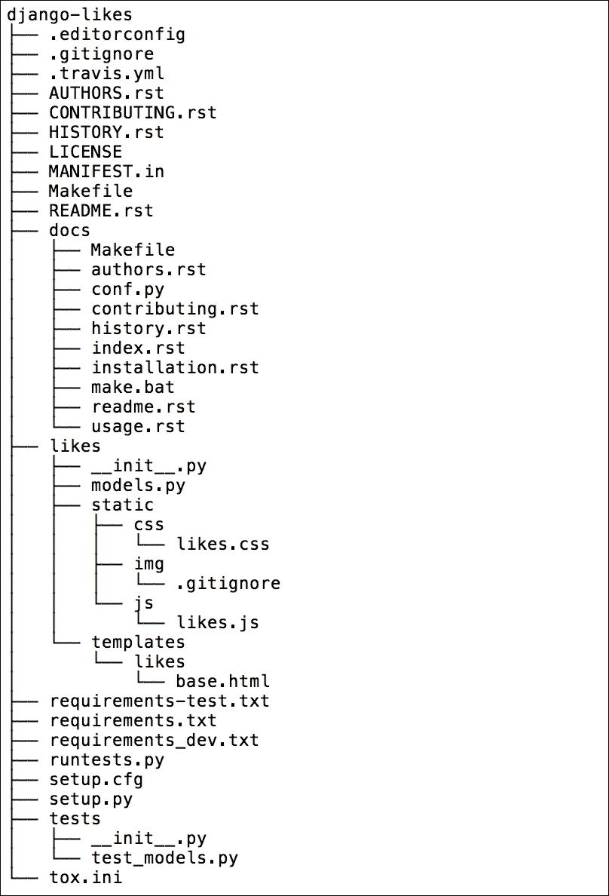
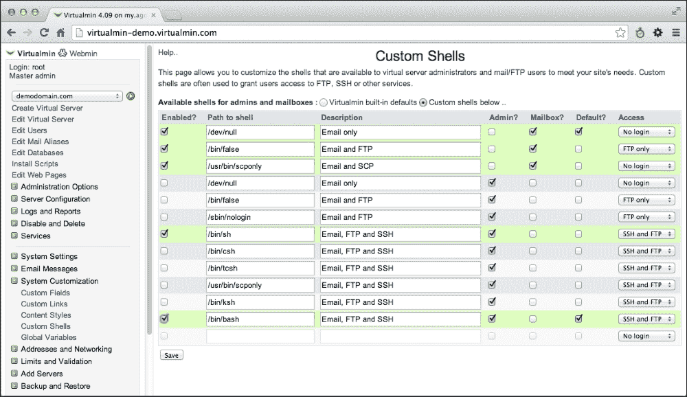
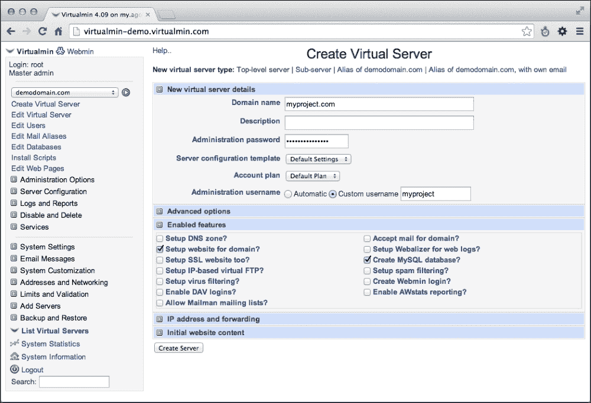

# 第十一章 测试和部署

在本章中，我们将介绍以下食谱：

+   使用 Selenium 测试页面

+   使用 mock 测试视图

+   测试使用 Django REST 框架创建的 API

+   发布可重用 Django 应用

+   通过电子邮件获取详细的错误报告

+   在 Apache 上使用 mod_wsgi 部署

+   设置 cron 作业以执行常规任务

+   创建和使用 Fabric 部署脚本

# 简介

到目前为止，我期望您已经开发了一个或多个 Django 项目或可重用应用，并准备好向公众展示。对于开发周期的最后一步，我们将探讨如何测试您的项目，将可重用应用分发给他人，并在远程服务器上发布您的网站。请继续关注最终的部分！

# 使用 Selenium 测试页面

Django 为您的网站提供了编写测试套件的可能性。测试套件会自动检查您的网站或其组件，以查看是否一切正常工作。当您修改代码时，您可以运行测试来检查更改是否没有以错误的方式影响应用程序的行为。自动化软件测试的世界可以分为五个级别：单元测试、集成测试、组件接口测试、系统测试和操作验收测试。验收测试检查业务逻辑，以了解项目是否按预期工作。在本食谱中，您将学习如何使用 Selenium 编写验收测试，这允许您在浏览器中模拟填写表单或点击特定 DOM 元素等活动。

## 准备工作

让我们从第四章中*实现点赞小部件*食谱的`locations`和`likes`应用开始，*模板和 JavaScript*。

如果您还没有，请从[`getfirefox.com`](http://getfirefox.com)安装 Firefox 浏览器。

然后，按照以下步骤在您的虚拟环境中安装 Selenium：

```py
(myproject_env)$ pip install selenium

```

## 如何操作...

我们将通过以下步骤使用 Selenium 测试基于 Ajax 的*点赞*功能：

1.  在您的`locations`应用中创建名为`tests.py`的文件，并包含以下内容：

    ```py
    # locations/tests.py
    # -*- coding: UTF-8 -*-
    from __future__ import unicode_literals
    from time import sleep
    from django.test import LiveServerTestCase
    from django.contrib.contenttypes.models import ContentType
    from django.contrib.auth.models import User
    from selenium import webdriver
    from selenium.webdriver.support.ui import WebDriverWait
    from likes.models import Like
    from .models import Location

    class LiveLocationTest(LiveServerTestCase):
        @classmethod
        def setUpClass(cls):
            super(LiveLocationTest, cls).setUpClass()
            cls.browser = webdriver.Firefox()
            cls.browser.delete_all_cookies()
            cls.location = Location.objects.create(
                title="Haus der Kulturen der Welt",
                slug="hkw",
                small_image="locations/2015/11/"
                    "20151116013056_small.jpg",
                medium_image="locations/2015/11/"
                    "20151116013056_medium.jpg",
                large_image="locations/2015/11/"
                    "20151116013056_large.jpg",
            )
            cls.username = "test-admin"
            cls.password = "test-admin"
            cls.superuser = User.objects.create_superuser(
                username=cls.username,
                password=cls.password,
                email="",
            )

        @classmethod
        def tearDownClass(cls):
            super(LiveLocationTest, cls).tearDownClass()
            cls.browser.quit()
            cls.location.delete()
            cls.superuser.delete()

        def test_login_and_like(self):
            # login
            self.browser.get("%(website)s/admin/login/"
                "?next=/locations/%(slug)s/" % {
                "website": self.live_server_url,
                "slug": self.location.slug,
            })
            username_field = \
                self.browser.find_element_by_id("id_username")
            username_field.send_keys(self.username)
            password_field = \
                self.browser.find_element_by_id("id_password")
            password_field.send_keys(self.password)
            self.browser.find_element_by_css_selector(
                'input[type="submit"]'
            ).click()
            WebDriverWait(self.browser, 10).until(
                lambda x: self.browser.\
                    find_element_by_css_selector(
                        ".like-button"
                    )
            )
            # click on the "like" button
            like_button = self.browser.\
                find_element_by_css_selector('.like-button')
            is_initially_active = \
                "active" in like_button.get_attribute("class")
            initial_likes = int(self.browser.\
                find_element_by_css_selector(
                    ".like-badge"
                ).text)

            sleep(2) # remove this after the first run

            like_button.click()
            WebDriverWait(self.browser, 10).until(
                lambda x: int(
                    self.browser.find_element_by_css_selector(
                        ".like-badge"
                    ).text
                ) != initial_likes
            )
            likes_in_html = int(
                self.browser.find_element_by_css_selector(
                    ".like-badge"
                ).text
            )
            likes_in_db = Like.objects.filter(
                content_type=ContentType.objects.\
                    get_for_model(Location),
                object_id=self.location.pk,
            ).count()

            sleep(2) # remove this after the first run

            self.assertEqual(likes_in_html, likes_in_db)
            if is_initially_active:
                self.assertLess(likes_in_html, initial_likes)
            else:
                self.assertGreater(
                    likes_in_html, initial_likes
                )

            # click on the "like" button again to switch back
            # to the previous state
            like_button.click()
            WebDriverWait(self.browser, 10).until(
                lambda x: int(
                    self.browser.find_element_by_css_selector(
                        ".like-badge"
                    ).text
                ) == initial_likes
            )

            sleep(2) # remove this after the first run
    ```

1.  测试将在`DEBUG = False`模式下运行；因此，您必须确保所有静态文件在您的开发环境中都是可访问的。请确保您将以下行添加到项目 URL 配置中：

    ```py
    # myproject/urls.py
    # -*- coding: UTF-8 -*-
    from __future__ import unicode_literals
    from django.conf.urls import patterns, include, url
    from django.conf import settings
    from django.conf.urls.static import static
    from django.contrib.staticfiles.urls import \
        staticfiles_urlpatterns

    urlpatterns = patterns("",# …
    )

    urlpatterns += staticfiles_urlpatterns()
    urlpatterns += static(
     settings.STATIC_URL,
     document_root=settings.STATIC_ROOT
    )
    urlpatterns += static(
        settings.MEDIA_URL,
        document_root=settings.MEDIA_ROOT
    )
    ```

1.  收集静态文件，以便测试服务器可以访问，如下所示：

    ```py
    (myproject_env)$ python manage.py collectstatic --noinput

    ```

1.  按照以下所示运行`locations`应用的测试：

    ```py
    (myproject_env)$ python manage.py test locations
    Creating test database for alias 'default'...
    .
    --------------------------------------------------------
    Ran 1 test in 19.158s

    OK
    Destroying test database for alias 'default'...

    ```

## 它是如何工作的...

当我们运行这些测试时，Firefox 浏览器将打开并转到`http://localhost:8081/admin/login/?next=/locations/hkw/`的登录管理页面。

然后，用户名和密码字段将填写为`test-admin`，您将被重定向到`Haus der Kulturen der Welt`位置的详细页面，如下所示：`http://localhost:8081/locations/hkw/`。

在那里，您将看到**点赞**按钮被点击两次，导致点赞和取消点赞操作。

让我们看看这个测试套件是如何工作的。我们定义一个继承自`LiveServerTestCase`的类。这创建了一个测试套件，将在`8081`端口下运行本地服务器。`setUpClass()`类方法将在所有测试开始时执行，`tearDownClass()`类方法将在测试运行后执行。在中间，测试将执行套件中以`test`开头名称的所有方法。对于每个通过测试，你将在命令行工具中看到一个点（`.`），对于每个失败的测试，将有一个字母`F`，对于测试中的每个错误，你将看到一个字母`E`。最后，你将看到有关失败和错误测试的提示。由于我们目前在`locations`应用的套件中只有一个测试，所以你将只在那里看到一个点。

当我们开始测试时，会创建一个新的测试数据库。在`setUpClass()`中，我们创建一个浏览器对象、一个位置和一个超级用户。然后执行`test_login_and_like()`方法，该方法打开管理登录页面，找到**用户名**字段，输入管理员的用户名，找到**密码**字段，输入管理员的密码，找到**提交**按钮，并点击它。然后，它最多等待十秒钟，直到页面上可以找到具有`.like-button` CSS 类的 DOM 元素。

如你从第四章中*实现点赞小部件*的配方中可能记得，我们的小部件由两个元素组成：一个**点赞**按钮和一个显示总点赞数的徽章。如果按钮被点击，你的`点赞`将通过 Ajax 调用添加或从数据库中移除。此外，徽章计数将更新以反映数据库中的点赞数，如图所示：


在测试的进一步过程中，我们检查按钮的初始状态（是否有`.active` CSS 类），检查初始的点赞数，并模拟点击按钮。我们最多等待 10 秒钟，直到徽章中的计数发生变化。然后，我们检查徽章中的计数是否与数据库中该位置的点赞总数匹配。我们还将检查徽章中的计数是如何变化的（增加或减少）。最后，我们将再次模拟点击按钮以切换回之前的状态。

`sleep()`函数仅在测试中用于让你能够看到整个工作流程。你可以安全地删除它们，以使测试运行更快。

最后，调用`tearDownClass()`方法，该方法关闭浏览器并从测试数据库中删除位置和超级用户。

## 参见

+   在第四章中*实现点赞小部件*的配方，*模板和 JavaScript*

+   使用 mock 测试视图的*配方*

+   使用 Django REST Framework 创建的*测试 API*配方

# 使用 mock 测试视图

在本配方中，我们将探讨如何编写单元测试。单元测试是检查函数或方法是否返回正确结果的那种测试。我们再次以`likes`应用为例，编写测试以检查向`json_set_like()`视图发送请求时，对于未认证用户返回`{"success": false}`，对于认证用户返回`{"action": "added", "count": 1, "obj": "Haus der Kulturen der Welt", "success": true}`。我们将使用`Mock`对象来模拟`HttpRequest`和`AnonymousUser`对象。

## 准备工作

让我们从*实现 Like 小部件*配方中的`locations`和`likes`应用开始，该配方位于第四章，*模板和 JavaScript*。

在你的虚拟环境中安装`mock`模块，如下所示：

```py
(myproject_env)$ pip install mock

```

## 如何做...

我们将通过以下步骤使用模拟来测试*点赞*动作：

1.  在你的`likes`应用中创建名为`tests.py`的文件，内容如下：

    ```py
    # likes/tests.py
    # -*- coding: UTF-8 -*-
    from __future__ import unicode_literals
    import mock
    import json
    from django.contrib.contenttypes.models import ContentType
    from django.contrib.auth.models import User
    from django.test import SimpleTestCase
    from locations.models import Location

    class JSSetLikeViewTest(SimpleTestCase):
        @classmethod
        def setUpClass(cls):
            super(JSSetLikeViewTest, cls).setUpClass()
            cls.location = Location.objects.create(
                title="Haus der Kulturen der Welt",
                slug="hkw",
                small_image="locations/2015/11/"
                    "20151116013056_small.jpg",
                medium_image="locations/2015/11/"
                    "20151116013056_medium.jpg",
                large_image="locations/2015/11/"
                    "20151116013056_large.jpg",
            )
            cls.content_type = \
                ContentType.objects.get_for_model(Location)
            cls.username = "test-admin"
            cls.password = "test-admin"
            cls.superuser = User.objects.create_superuser(
                username=cls.username,
                password=cls.password,
                email="",
            )

        @classmethod
        def tearDownClass(cls):
            super(JSSetLikeViewTest, cls).tearDownClass()
            cls.location.delete()
            cls.superuser.delete()

        def test_authenticated_json_set_like(self):
            from .views import json_set_like
            mock_request = mock.Mock()
            mock_request.user = self.superuser
            mock_request.method = "POST"
            response = json_set_like(
                mock_request,
                self.content_type.pk,
                self.location.pk
            )
            expected_result = json.dumps({
                "success": True,
                "action": "added",
                "obj": self.location.title,
                "count": Location.objects.count(),
            })
            self.assertJSONEqual(
                response.content,
                expected_result
            )

        def test_anonymous_json_set_like(self):
            from .views import json_set_like
            mock_request = mock.Mock()
            mock_request.user.is_authenticated.return_value = \
                False
            mock_request.method = "POST"
            response = json_set_like(
                mock_request,
                self.content_type.pk,
                self.location.pk
            )
            expected_result = json.dumps({
                "success": False,
            })
            self.assertJSONEqual(
                response.content,
                expected_result
            )
    ```

1.  按如下方式运行`likes`应用的测试：

    ```py
    (myproject_env)$ python manage.py test likes
    Creating test database for alias 'default'...
    ..
    --------------------------------------------------------
    Ran 2 tests in 0.093s

    OK
    Destroying test database for alias 'default'...

    ```

## 它是如何工作的...

就像在前一个配方中一样，当你为`likes`应用运行测试时，首先创建一个临时测试数据库。然后调用`setUpClass()`方法。稍后，执行以`test`开头的方法，最后调用`tearDownClass()`方法。

单元测试继承自`SimpleTestCase`类。在`setUpClass()`中，我们创建一个位置和一个超级用户。同时，我们找到`Location`模型的`ContentType`对象——我们将需要它在设置或删除不同对象的点赞视图中使用。作为提醒，视图看起来类似于以下内容，并返回 JSON 字符串作为结果：

```py
def json_set_like(request, content_type_id, object_id):
    # ...all the view logic goes here...
    return HttpResponse(
        json_str,
        content_type="text/javascript; charset=utf-8"
    )
```

在`test_authenticated_json_set_like()`和`test_anonymous_json_set_like()`方法中，我们使用了`Mock`对象。它们是具有任何属性或方法的对象。`Mock`对象的每个未定义属性或方法都是另一个`Mock`对象。因此，在 shell 中，你可以尝试如下链式属性：

```py
>>> import mock
>>> m = mock.Mock()
>>> m.whatever.anything().whatsoever
<Mock name='mock.whatever.anything().whatsoever' id='4464778896'>

```

在我们的测试中，我们使用`Mock`对象来模拟`HttpRequest`和`AnonymousUser`对象。对于认证用户，我们仍然需要真实的`User`对象，因为视图需要用户的 ID 来保存到数据库中的`Like`对象。

因此，我们调用`json_set_like()`函数，查看返回的 JSON 响应是否正确：如果访问者未认证，则响应返回`{"success": false}`；对于认证用户，返回类似`{"action": "added", "count": 1, "obj": "Haus der Kulturen der Welt", "success": true}`的内容。

最后，调用`tearDownClass()`类方法，从测试数据库中删除位置和超级用户。

## 参见

+   在第四章的*实现 Like 小部件*配方中，*模板和 JavaScript*的*实现 Like 小部件*配方

+   *使用 Selenium 测试页面*配方

+   *使用 Django REST Framework 创建的 API 测试*配方

# 测试使用 Django REST 框架创建的 API

我们已经了解了如何编写操作验收和单元测试。在这个配方中，我们将对本书早期创建的 REST API 进行组件接口测试。

### 小贴士

如果你不太熟悉 REST API 是什么以及如何使用它，你可以在 [`www.restapitutorial.com/`](http://www.restapitutorial.com/) 上了解相关信息。

## 准备工作

让我们从第九章 *数据导入和导出* 中的 *使用 Django REST 框架创建 API* 配方中的 `bulletin_board` 应用开始。

## 如何做到这一点...

要测试 REST API，请执行以下步骤：

1.  在你的 `bulletin_board` 应用中创建一个 `tests.py` 文件，如下所示：

    ```py
    # bulletin_board/tests.py
    # -*- coding: UTF-8 -*-
    from __future__ import unicode_literals
    from django.contrib.auth.models import User
    from django.core.urlresolvers import reverse
    from rest_framework import status
    from rest_framework.test import APITestCase
    from .models import Category, Bulletin

    class BulletinTests(APITestCase):
        @classmethod
        def setUpClass(cls):
            super(BulletinTests, cls).setUpClass()
            cls.superuser, created = User.objects.\
                get_or_create(
                    username="test-admin",
                )
            cls.superuser.is_active = True
            cls.superuser.is_superuser = True
            cls.superuser.save()

            cls.category = Category.objects.create(
                title="Movies"
            )

            cls.bulletin = Bulletin.objects.create(
                bulletin_type="searching",
                category=cls.category,
                title="The Matrix",
                description="There is no Spoon.",
                contact_person="Aidas Bendoraitis",
            )
            cls.bulletin_to_delete = Bulletin.objects.create(
                bulletin_type="searching",
                category=cls.category,
                title="Animatrix",
                description="Trinity: "
                    "There's a difference, Mr. Ash, "
                    "between a trap and a test.",
                contact_person="Aidas Bendoraitis",
            )

        @classmethod
        def tearDownClass(cls):
            super(BulletinTests, cls).tearDownClass()
            cls.category.delete()
            cls.bulletin.delete()
            cls.superuser.delete()
    ```

1.  添加一个方法来测试如下所示列出公告的 API 调用：

    ```py
    def test_list_bulletins(self):
        url = reverse("rest_bulletin_list")
        data = {}
        response = self.client.get(url, data, format="json")
        self.assertEqual(
            response.status_code, status.HTTP_200_OK
        )
        self.assertEqual(
            response.data["count"], Bulletin.objects.count()
        )
    ```

1.  添加一个方法来测试如下显示单个公告的 API 调用：

    ```py
    def test_get_bulletin(self):
        url = reverse("rest_bulletin_detail", kwargs={
            "pk": self.bulletin.pk
        })
        data = {}
        response = self.client.get(url, data, format="json")
        self.assertEqual(
            response.status_code, status.HTTP_200_OK
        )
        self.assertEqual(response.data["id"], self.bulletin.pk)
        self.assertEqual(
            response.data["bulletin_type"],
            self.bulletin.bulletin_type
        )
        self.assertEqual(
            response.data["category"]["id"],
            self.category.pk
        )
        self.assertEqual(
            response.data["title"],
            self.bulletin.title
        )
        self.assertEqual(
            response.data["description"],
            self.bulletin.description
        )
        self.assertEqual(
            response.data["contact_person"],
            self.bulletin.contact_person
        )
    ```

1.  添加一个方法来测试如果当前用户已认证，则创建公告的 API 调用，如下所示：

    ```py
    def test_create_bulletin_allowed(self):
        # login
        self.client.force_authenticate(user=self.superuser)

        url = reverse("rest_bulletin_list")
        data = {
            "bulletin_type": "offering",
            "category": {"title": self.category.title},
            "title": "Back to the Future",
            "description": "Roads? Where we're going, "
                "we don't need roads.",
            "contact_person": "Aidas Bendoraitis",
        }
        response = self.client.post(url, data, format="json")
        self.assertEqual(
            response.status_code, status.HTTP_201_CREATED
        )
        self.assertTrue(Bulletin.objects.filter(
            pk=response.data["id"]
        ).count() == 1)

        # logout
        self.client.force_authenticate(user=None)
    ```

1.  添加一个方法来测试尝试创建公告的 API 调用；然而，由于当前访客是匿名用户，操作失败，如下所示：

    ```py
    def test_create_bulletin_restricted(self):
        # make sure the user is logged out
        self.client.force_authenticate(user=None)

        url = reverse("rest_bulletin_list")
        data = {
            "bulletin_type": "offering",
            "category": {"title": self.category.title},
            "title": "Back to the Future",
            "description": "Roads? Where we're going, "
                "we don't need roads.",
            "contact_person": "Aidas Bendoraitis",
        }
        response = self.client.post(url, data, format="json")
        self.assertEqual(
            response.status_code, status.HTTP_403_FORBIDDEN
        )
    ```

1.  添加一个方法来测试如果当前用户已认证，则更改公告的 API 调用，如下所示：

    ```py
    def test_change_bulletin_allowed(self):
        # login
        self.client.force_authenticate(user=self.superuser)

        url = reverse("rest_bulletin_detail", kwargs={
            "pk": self.bulletin.pk
        })

        # change only title
        data = {
            "bulletin_type": self.bulletin.bulletin_type,
            "category": {
                "title": self.bulletin.category.title
            },
            "title": "Matrix Resurrection",
            "description": self.bulletin.description,
            "contact_person": self.bulletin.contact_person,
        }
        response = self.client.put(url, data, format="json")
        self.assertEqual(
            response.status_code, status.HTTP_200_OK
        )
        self.assertEqual(response.data["id"], self.bulletin.pk)
        self.assertEqual(
            response.data["bulletin_type"], "searching"
        )

        # logout
        self.client.force_authenticate(user=None)
    ```

1.  添加一个方法来测试尝试更改公告的 API 调用；然而，由于当前访客是匿名用户，操作失败：

    ```py
    def test_change_bulletin_restricted(self):
        # make sure the user is logged out
        self.client.force_authenticate(user=None)

        url = reverse("rest_bulletin_detail", kwargs={
            "pk": self.bulletin.pk
        })
        # change only title
        data = {
            "bulletin_type": self.bulletin.bulletin_type,
            "category": {
                "title": self.bulletin.category.title
            },
            "title": "Matrix Resurrection",
            "description": self.bulletin.description,
            "contact_person": self.bulletin.contact_person,
        }
        response = self.client.put(url, data, format="json")
        self.assertEqual(
            response.status_code, status.HTTP_403_FORBIDDEN
        )
    ```

1.  添加一个方法来测试如果当前用户已认证，则删除公告的 API 调用，如下所示：

    ```py
    def test_delete_bulletin_allowed(self):
        # login
        self.client.force_authenticate(user=self.superuser)

        url = reverse("rest_bulletin_detail", kwargs={
            "pk": self.bulletin_to_delete.pk
        })
        data = {}
        response = self.client.delete(url, data, format="json")
        self.assertEqual(
            response.status_code, status.HTTP_204_NO_CONTENT
        )

        # logout
        self.client.force_authenticate(user=None)
    ```

1.  添加一个方法来测试尝试删除公告的 API 调用；然而，由于当前访客是匿名用户，操作失败：

    ```py
    def test_delete_bulletin_restricted(self):
        # make sure the user is logged out
        self.client.force_authenticate(user=None)

        url = reverse("rest_bulletin_detail", kwargs={
            "pk": self.bulletin_to_delete.pk
        })
        data = {}
        response = self.client.delete(url, data, format="json")
        self.assertEqual(
            response.status_code, status.HTTP_403_FORBIDDEN
        )
    ```

1.  按如下所示运行 `bulletin_board` 应用的测试：

    ```py
    (myproject_env)$ python manage.py test bulletin_board
    Creating test database for alias 'default'...
    ........
    --------------------------------------------------------
    Ran 8 tests in 0.081s

    OK
    Destroying test database for alias 'default'...

    ```

## 它是如何工作的...

REST API 测试套件扩展了 `APITestCase` 类。再次强调，我们有 `setUpClass()` 和 `tearDownClass()` 类方法，这些方法将在不同的测试之前和之后执行。此外，测试套件有一个 `client` 属性，它是 `APIClient` 类型的，可以用来模拟 API 调用。它有所有标准 HTTP 调用的方法：`get()`、`post()`、`put()`、`patch()`、`delete()`、`head()` 和 `options()`；而在我们的测试中，我们使用的是 `GET`、`POST` 和 `DELETE` 请求。此外，`client` 有方法通过登录凭证、令牌或直接传递 `User` 对象来认证用户。在我们的测试中，我们通过第三种方式认证，即直接将用户传递给 `force_authenticate()` 方法。

代码的其余部分是自我解释的。

## 参见

+   在第九章 *数据导入和导出* 中的 *使用 Django REST 框架创建 API* 配方 Chapter 9，*数据导入和导出*

+   *使用 Selenium 测试页面* 的配方

+   *使用模拟测试视图* 的配方

# 发布可重用 Django 应用

Django 文档有一个教程，介绍如何打包你的可重用应用，以便可以在任何虚拟环境中使用 `pip` 安装：

[`docs.djangoproject.com/en/1.8/intro/reusable-apps/`](https://docs.djangoproject.com/en/1.8/intro/reusable-apps/)

然而，还有更好的方法来使用 **Cookiecutter** 工具打包和发布可重用的 Django 应用，它为不同的编码项目创建模板，例如新的 Django CMS 网站、Flask 网站，或 jQuery 插件。可用的项目模板之一是 `cookiecutter-djangopackage`。在这个食谱中，您将学习如何使用它来分发可重用的 `likes` 应用。

## 准备工作

在您的虚拟环境中安装 `Cookiecutter`：

```py
(myproject_env)$ pip install cookiecutter

```

## 如何操作...

要发布您的 `likes` 应用，请按照以下步骤操作：

1.  按照以下步骤开始一个新的 Django 应用项目：

    ```py
    (myapp_env)$ cookiecutter \
    https://github.com/pydanny/cookiecutter-djangopackage.git

    ```

1.  回答问题以创建应用模板：

    ```py
    full_name [Your full name here]: Aidas Bendoraitis
    email [you@example.com]: aidas@bendoraitis.lt
    github_username [yourname]: archatas
    project_name [dj-package]: django-likes
    repo_name [dj-package]: django-likes
    app_name [djpackage]: likes
    project_short_description [Your project description goes here]: Django-likes allows your website users to like any object.
    release_date [2015-10-02]:
    year [2015]:
    version [0.1.0]:

    ```

1.  这将创建一个文件结构，如下面的图像所示：

1.  将 `likes` 应用的文件从您正在使用的 Django 项目中复制到 `django-likes/likes` 目录。

1.  将可重用应用项目添加到 GitHub 下的 Git 仓库。

1.  探索不同的文件并完成许可、README、文档、配置和其他文件。

1.  确保应用通过测试：

    ```py
    (myapp_env)$ pip install -r requirements-test.txt
    (myapp_env)$ python runtests.py

    ```

1.  如果您的包是封闭源代码，创建一个可共享的 ZIP 存档作为发布：

    ```py
    (myapp_env)$ python setup.py sdist

    ```

    这将创建一个 `django-likes/dist/django-likes-0.1.0.tar.gz` 文件，可以使用 pip 安装或卸载，如下所示：

    ```py
    (myproject_env)$ pip install django-likes-0.1.0.tar.gz
    (myproject_env)$ pip uninstall django-likes

    ```

1.  如果您的包是开源的，请在 **Python 包索引**（**PyPI**）上注册并发布您的应用。

    ```py
    (myapp_env)$ python setup.py register
    (myapp_env)$ python setup.py publish

    ```

1.  此外，为了传播信息，通过在[`www.djangopackages.com/packages/add/`](https://www.djangopackages.com/packages/add/)提交表格，将您的应用添加到 Django 包中。

## 它是如何工作的...

Cookiecutter 填充了 Django 应用项目模板的不同部分中输入的请求数据。因此，您将获得一个准备分发的 `setup.py` 文件，用于 Python 包索引、Sphinx 文档、BSD 作为默认许可、项目的通用文本编辑配置、包含在您的应用中的静态文件和模板，以及其他好东西。

## 参考也

+   在第一章的*创建项目文件结构*食谱中，*使用 Django 1.8 入门*

+   在第一章的*使用 pip 处理项目依赖*食谱中，*使用 Django 1.8 入门*

+   在第四章的*实现点赞小部件*食谱中，*模板和 JavaScript*中

# 通过电子邮件获取详细的错误报告

为了执行系统日志，Django 使用 Python 内置的日志模块。默认的 Django 配置似乎相当复杂。在这个食谱中，您将学习如何调整它，以便在发生错误时发送包含完整 HTML 的错误电子邮件，类似于 Django 在 DEBUG 模式下提供的。

## 准备工作

在您的虚拟环境中定位 Django 项目。

## 如何操作...

以下步骤将帮助您发送关于错误的详细电子邮件：

1.  在文本编辑器中打开`myproject_env/lib/python2.7/site-packages/django/utils/log.py`文件，并将`DEFAULT_LOGGING`字典复制到您的项目设置中的`LOGGING`字典。

1.  将`include_html`设置添加到`mail_admins`处理器中，如下所示：

    ```py
    # myproject/conf/base.py or myproject/settings.py
    LOGGING = {
        "version": 1,
        "disable_existing_loggers": False,
        "filters": {
            "require_debug_false": {
                "()": "django.utils.log.RequireDebugFalse",
            },
            "require_debug_true": {
                "()": "django.utils.log.RequireDebugTrue",
            },
        },
        "handlers": {
            "console": {
                "level": "INFO",
                "filters": ["require_debug_true"],
                "class": "logging.StreamHandler",
            },
            "null": {
                "class": "django.utils.log.NullHandler",
            },
            "mail_admins": {
                "level": "ERROR",
                "filters": ["require_debug_false"],
                "class": "django.utils.log.AdminEmailHandler",
     "include_html": True,
            }
        },
        "loggers": {
            "django": {
                "handlers": ["console"],
            },
            "django.request": {
                "handlers": ["mail_admins"],
                "level": "ERROR",
                "propagate": False,
            },
            "django.security": {
                "handlers": ["mail_admins"],
                "level": "ERROR",
                "propagate": False,
            },
            "py.warnings": {
                "handlers": ["console"],
            },
        }
    }
    ```

## 工作原理...

日志配置包括四个部分：记录器、处理器、过滤器和格式化器。以下是如何描述它们：

+   记录器是日志系统中的入口点。每个记录器都可以有一个日志级别：`DEBUG`、`INFO`、`WARNING`、`ERROR`或`CRITICAL`。当消息写入记录器时，消息的日志级别将与记录器的级别进行比较。如果它符合或超过记录器的日志级别，它将被进一步处理。否则，消息将被忽略。

+   处理器是定义记录器中每个消息如何处理的引擎。它们可以写入控制台、通过电子邮件发送给管理员、保存到日志文件、发送到 Sentry 错误日志服务等等。在我们的案例中，我们为`mail_admins`处理器设置了`include_html`参数，因为我们希望包含完整的 HTML、跟踪信息和局部变量，以便于我们 Django 项目中发生的错误消息。

+   过滤器提供了对从记录器传递到处理器的消息的额外控制。例如，在我们的案例中，只有当 DEBUG 模式设置为`False`时，才会发送电子邮件。

+   格式化器用于定义如何将日志消息渲染为字符串。在本例中未使用；然而，有关日志的更多信息，您可以参考官方文档[`docs.djangoproject.com/en/1.8/topics/logging/`](https://docs.djangoproject.com/en/1.8/topics/logging/)。

## 相关内容

+   *使用 mod_wsgi 在 Apache 上部署*教程

# 使用 mod_wsgi 在 Apache 上部署

关于如何部署您的 Django 项目，有许多选择。在本教程中，我将指导您如何在配备 Virtualmin 的专用 Linux 服务器上部署 Django 项目。

专用服务器是一种互联网托管类型，您租赁的是整个服务器，不会与其他人共享。Virtualmin 是一个网络托管控制面板，允许您管理虚拟域名、邮箱、数据库和整个服务器，而无需深入了解服务器管理的命令行程序。

要运行 Django 项目，我们将使用带有`mod_wsgi`模块的 Apache 网络服务器和 MySQL 数据库。

## 准备工作

确保您已在您的专用 Linux 服务器上安装了 Virtualmin。有关说明，请参阅[`www.virtualmin.com/download.html`](http://www.virtualmin.com/download.html)。

## 如何操作...

按照以下步骤在配备 Virtualmin 的 Linux 服务器上部署 Django 项目：

1.  以 root 用户登录到 Virtualmin 并将服务器的用户默认 shell 从 `sh` 更改为 `bash`。这可以通过导航到 **Virtualmin** | **系统定制** | **自定义 Shell** 来完成，如下面的截图所示：

1.  通过导航到 **Virtualmin** | **创建虚拟服务器** 为你的项目创建一个虚拟服务器。启用以下功能：**为域名设置网站？** 和 **创建 MySQL 数据库？**。你为域名设置的用户名和密码也将用于 SSH 连接、FTP 和 MySQL 数据库访问，如下所示：

1.  登录到你的域名管理面板，并将你的域名的 `A` 记录设置为专用服务器的 IP 地址。

1.  以 root 用户通过 Secure Shell 连接到专用服务器，并在系统范围内安装 Python 库，`pip`，`virtualenv`，`MySQLdb` 和 `Pillow`。

1.  确保默认的 MySQL 数据库编码为 UTF-8：

    1.  在远程服务器上编辑 MySQL 配置文件，例如，使用 nano 编辑器：

        ```py
        $ ssh root@myproject.com
        root@myproject.com's password:

        $ nano /etc/mysql/my.cnf

        ```

        添加或编辑以下配置：

        ```py
        [client]
        default-character-set=utf8

        [mysql]
        default-character-set=utf8

        [mysqld]
        collation-server=utf8_unicode_ci
        init-connect='SET NAMES utf8'
        character-set-server=utf8

        ```

    1.  按 *Ctrl* + *O* 保存更改，并按 *Ctrl* + *X* 退出 nano 编辑器。

    1.  然后，按照以下步骤重新启动 MySQL 服务器：

        ```py
        $ /etc/init.d/mysql restart

        ```

    1.  按 *Ctrl* + *D* 退出 Secure Shell。

1.  当你在 Virtualmin 中创建一个域名时，该域的用户会自动创建。以你的 Django 项目的用户身份通过 Secure Shell 连接到专用服务器，并按照以下步骤为你的项目创建一个虚拟环境：

    ```py
    $ ssh myproject@myproject.com
    myproject@myproject.com's password:

    $ virtualenv . --system-site-packages
    $ echo source ~/bin/activate >> .bashrc
    $ source ~/bin/activate
    (myproject)myproject@server$

    ```

    ### 提示

    每次你通过 Secure Shell 以与域名相关的用户连接到你的 Django 项目时，`.bashrc` 脚本都会被调用。该脚本将自动激活此项目的虚拟环境。

1.  如果你将项目代码托管在 Bitbucket 上，你需要设置 SSH 密钥以避免从或向 Git 仓库拉取或推送时出现密码提示：

    1.  逐个执行以下命令：

        ```py
        (myproject)myproject@server$ ssh-keygen
        (myproject)myproject@server$ ssh-agent /bin/bash
        (myproject)myproject@server$ ssh-add ~/.ssh/id_rsa
        (myproject)myproject@server$ cat ~/.ssh/id_rsa.pub

        ```

    1.  最后一条命令将打印出你需要复制并粘贴到 Bitbucket 网站上的 **管理账户** | **SSH 密钥** | **添加密钥** 的 SSH 公钥。

1.  创建一个 `project` 目录，进入它，并按照以下步骤克隆你的项目代码：

    ```py
    (myproject)myproject@server$ git clone \
    git@bitbucket.org:somebitbucketuser/myproject.git myproject

    ```

    ### 提示

    现在，你的项目路径应该类似于以下：`/home/myproject/project/myproject`

1.  按照以下步骤安装你项目的 Python 需求，包括指定的 Django 版本：

    ```py
    (myproject)myproject@server$ pip install -r requirements.txt

    ```

1.  在你的项目目录下创建 `media`，`tmp` 和 `static` 目录。

1.  此外，创建一个与以下设置类似的 `local_settings.py`：

    ```py
    # /home/myproject/project/myproject/myproject/local_settings.py
    DATABASES = {
        "default": {
            "ENGINE": "django.db.backends.mysql",
            "NAME": "myproject",
            "USER": "myproject",
            "PASSWORD": "mypassword",
        }
    }
    PREPEND_WWW = True
    DEBUG = False
    ALLOWED_HOSTS = ["myproject.com"]
    ```

1.  导入你本地创建的数据库转储。如果你使用的是 Mac，你可以使用一个应用程序，**Sequel Pro** ([`www.sequelpro.com/`](http://www.sequelpro.com/))，通过 SSH 连接来完成。你也可以通过 FTP 将数据库转储上传到服务器，然后在 Secure Shell 中运行以下命令：

    ```py
    (myproject)myproject@server$ python manage.py dbshell < \
    ~/db_backups/db.sql

    ```

1.  按照以下步骤收集静态文件：

    ```py
    (myproject)myproject@server$ python manage.py collectstatic \
    --noinput

    ```

1.  进入`~/public_html`目录，并使用 nano 编辑器（或您选择的任何编辑器）创建一个`wsgi`文件：

    ```py
    # /home/myproject/public_html/my.wsgi
    #!/home/myproject/bin/python
    # -*- coding: utf-8 -*-
    import os, sys, site
    django_path = os.path.abspath(
        os.path.join(os.path.dirname(__file__),
        "../lib/python2.6/site-packages/"),
    )
    site.addsitedir(django_path)
    project_path = os.path.abspath(
        os.path.join(os.path.dirname(__file__),
        "../project/myproject"),
    )
    sys.path += [project_path]
    os.environ["DJANGO_SETTINGS_MODULE"] = "myproject.settings"
    from django.core.wsgi import get_wsgi_application
    application = get_wsgi_application()
    ```

1.  然后，在同一目录中创建`.htaccess`文件。`.htaccess`文件将重定向所有请求到在`wsgi`文件中设置的 Django 项目，如下所示：

    ```py
    # /home/myproject/public_html/.htaccess
    AddHandler wsgi-script .wsgi
    DirectoryIndex index.html
    RewriteEngine On
    RewriteBase /
    RewriteCond %{REQUEST_FILENAME} !-f
    RewriteCond %{REQUEST_FILENAME}/index.html !-f
    RewriteCond %{REQUEST_URI} !^/media/
    RewriteCond %{REQUEST_URI} !^/static/
    RewriteRule ^(.*)$ /my.wsgi/$1 [QSA,L]
    ```

1.  将`.htaccess`复制为`.htaccess_live`。

1.  然后，也为维护情况创建`.htaccess_maintenance`。这个新的 Apache 配置文件将向除了您之外的所有用户显示`temporarily-offline.html`，这些用户通过您的局域网或计算机的 IP 地址被识别。您可以通过谷歌搜索`what's my ip`来检查您的 IP。以下是如何`.htaccess_maintenance`看起来：

    ```py
    # /home/myproject/public_html/.htaccess_maintenance
    AddHandler wsgi-script .wsgi
    DirectoryIndex index.html
    RewriteEngine On
    RewriteBase /
    RewriteCond %{REMOTE_HOST} !¹\.2\.3\.4$
    RewriteCond %{REQUEST_URI} !/temporarily-offline\.html
    RewriteCond %{REQUEST_URI} !^/media/
    RewriteCond %{REQUEST_URI} !^/static/
    RewriteRule .* /temporarily-offline.html [R=302,L]
    RewriteCond %{REQUEST_FILENAME} !-f
    RewriteCond %{REQUEST_FILENAME}/index.html !-f
    RewriteCond %{REQUEST_URI} !^/media/
    RewriteCond %{REQUEST_URI} !^/static/
    RewriteRule ^(.*)$ /my.wsgi/$1 [QSA,L]
    ```

    ### 小贴士

    将此文件中的 IP 数字替换为您的 IP 地址。

1.  然后，创建一个当您的网站宕机时将显示的 HTML 文件：

    ```py
    <!-- /home/myproject/public_html/temporarily-offline.html -->
    The site is being updated... Please come back later.
    ```

1.  通过 Secure Shell 以 root 用户身份登录到服务器并编辑 Apache 配置：

    1.  打开域名配置文件，如下所示：

        ```py
        $ nano /etc/apache2/sites-available/myproject.mydomain.conf

        ```

    1.  在`</VirtualHost>`之前添加以下行：

        ```py
        Options -Indexes
        AliasMatch ^/static/\d+/(.*) \
            "/home/myproject/project/myproject/static/$1"
        AliasMatch ^/media/(.*) \
            "/home/myproject/project/myproject/media/$1"
        <FilesMatch "\.(ico|pdf|flv|jpe?g|png|gif|js|css|swf)$">
            ExpiresActive On
            ExpiresDefault "access plus 1 year"
        </FilesMatch>
        ```

    1.  重启 Apache 以使更改生效：

        ```py
        $ /etc/init.d/apache2 restart

        ```

1.  设置默认的预定 cron 作业。有关如何操作的更多信息，请参阅*设置 cron 作业以执行常规任务*配方。

## 它是如何工作的...

使用此配置，`media`和`static`目录中的文件将直接由 Apache 提供服务；而所有其他 URL 都由 Django 项目通过`my.wsgi`文件处理。

使用 Apache 站点配置中的`<FilesMatch>`指令，所有媒体文件都被设置为缓存一年。静态 URL 路径有一个编号的前缀，每次您从 Git 仓库更新代码时都会更改。

当您需要更新网站并希望将其关闭进行维护时，您必须将`.htaccess_maintenance`复制到`.htaccess`。当您想要再次设置网站时，您必须将`.htaccess_live`复制到`.htaccess`。

## 更多内容...

要查找托管您的 Django 项目的其他选项，请参阅：[`djangofriendly.com/hosts/`](http://djangofriendly.com/hosts/)。

## 参见

+   第一章中的*创建项目文件结构*配方，*Django 1.8 入门*

+   第一章中的*使用 pip 处理项目依赖项*配方，*Django 1.8 入门*

+   第一章中的*为 Git 用户动态设置 STATIC_URL 配方*，*Django 1.8 入门*

+   第一章中的*将 UTF-8 设置为 MySQL 配置的默认编码*配方，*Django 1.8 入门*

+   *创建和使用 Fabric 部署脚本*配方

+   *设置 cron 作业以执行常规任务*配方

# 设置 cron 作业以执行常规任务

通常网站每周、每天或每小时都需要在后台执行一些管理任务。这可以通过 cron 作业实现，也称为计划任务。这些是在指定时间段内在服务器上运行的脚本。在这个配方中，我们将创建两个 cron 作业：一个用于清除数据库中的会话，另一个用于备份数据库数据。两者都将每晚运行。

## 准备工作

首先，将你的 Django 项目部署到远程服务器上。然后，通过 SSH 连接到服务器。

## 如何操作...

让我们按照以下步骤创建两个脚本并使它们定期运行：

1.  在你的项目主目录中创建 `commands`、`db_backups` 和 `logs` 目录：

    ```py
    (myproject)myproject@server$ mkdir commands
    (myproject)myproject@server$ mkdir db_backups
    (myproject)myproject@server$ mkdir logs

    ```

1.  在 `commands` 目录中，创建一个包含以下内容的 `cleanup.sh` 文件：

    ```py
    # /home/myproject/commands/cleanup.sh
    #! /usr/bin/env bash
    PROJECT_PATH=/home/myproject
    CRON_LOG_FILE=${PROJECT_PATH}/logs/cleanup.log

    echo "Cleaning up the database" > ${CRON_LOG_FILE}
    date >> ${CRON_LOG_FILE}

    cd ${PROJECT_PATH}
    . bin/activate
    cd project/myproject
    python manage.py cleanup --traceback >> \
    ${CRON_LOG_FILE}  2>&1
    ```

1.  使以下文件可执行：

    ```py
    (myproject)myproject@server$ chmod +x cleanup.sh

    ```

1.  然后，在同一个目录中，创建一个包含以下内容的 `backup_db.sh` 文件：

    ```py
    # /home/myproject/commands/cleanup.sh
    #! /usr/bin/env bash
    PROJECT_PATH=/home/myproject
    CRON_LOG_FILE=${PROJECT_PATH}/logs/backup_db.log
    WEEK_DATE=$(LC_ALL=en_US.UTF-8 date +"%w-%A")
    BACKUP_PATH=${PROJECT_PATH}/db_backups/${WEEK_DATE}.sql
    DATABASE=myproject
    USER=my_db_user
    PASS=my_db_password

    EXCLUDED_TABLES=(
    django_session
    )

    IGNORED_TABLES_STRING=''
    for TABLE in "${EXCLUDED_TABLES[@]}"
    do :
        IGNORED_TABLES_STRING+=\
        " --ignore-table=${DATABASE}.${TABLE}"
    done

    echo "Creating DB Backup" > ${CRON_LOG_FILE}
    date >> ${CRON_LOG_FILE}

    cd ${PROJECT_PATH}
    mkdir -p db_backups

    echo "Dump structure" >> ${CRON_LOG_FILE}
    mysqldump -u ${USER} -p${PASS} --single-transaction \
    --no-data ${DATABASE} > ${BACKUP_PATH} 2>> ${CRON_LOG_FILE}

    echo "Dump content" >> ${CRON_LOG_FILE}
    mysqldump -u ${USER} -p${PASS} ${DATABASE} \
    ${IGNORED_TABLES_STRING} >> ${BACKUP_PATH} 2>> \
    ${CRON_LOG_FILE}
    ```

1.  使以下文件也可执行：

    ```py
    (myproject)myproject@server$ chmod +x backup_db.sh

    ```

1.  通过运行脚本并检查 `logs` 目录中的 `*.log` 文件来测试脚本是否正确执行，如下所示：

    ```py
    (myproject)myproject@server$ ./cleanup.sh
    (myproject)myproject@server$ ./backup_db.sh

    ```

1.  在你的项目主目录中创建一个包含以下任务的 `crontab.txt` 文件：

    ```py
    00 01 * * * /home/myproject/commands/cleanup.sh
    00 02 * * * /home/myproject/commands/backup_db.sh

    ```

1.  按照以下方式安装 crontab 任务：

    ```py
    (myproject)myproject@server$ crontab -e crontab.txt

    ```

## 它是如何工作的...

在当前设置下，每晚 1 点 `cleanup.sh` 将被执行，2 点 `backup_db.sh` 将被执行。执行日志将保存在 `cleanup.log` 和 `backup_db.log` 文件中。如果你遇到任何错误，你应该检查这些文件以查找错误跟踪。

数据库备份脚本稍微复杂一些。每周的每一天，它都会为该天创建一个名为 `0-Sunday.sql`、`1-Monday.sql` 等的备份文件。因此，你将能够恢复七天前或更晚的数据。首先，备份脚本导出所有表的数据库模式，然后导出所有表的数据，除了在 `EXCLUDED_TABLES`（目前是，即 `django_session`）中并列在一起的那些表。

crontab 语法如下：每行包含一个特定的时间段和一个要运行的任务。时间由五个部分组成，由空格分隔，如下所示：

+   从 0 到 59 分钟

+   从 0 到 23 小时

+   一个月中的天从 1 到 31

+   从 1 到 12 个月

+   一周中的天从 0 到 7，其中 0 是星期日，1 是星期一，以此类推。7 又是星期日。

星号（`*`）表示将使用每个时间段。因此，以下任务定义了每天每月每天都要执行的 `cleanup.sh` 在凌晨 1:00。

```py
00 01 * * * /home/myproject/commands/cleanup.sh

```

你可以在 [`en.wikipedia.org/wiki/Cron`](https://en.wikipedia.org/wiki/Cron) 上了解更多关于 crontab 的详细信息。

## 参见

+   *使用 mod_wsgi 在 Apache 上部署* 的配方

+   *创建和使用 Fabric 部署脚本* 的配方

# 创建和使用 Fabric 部署脚本

通常，要更新你的网站，你必须执行诸如设置维护页面、停止 cron 作业、创建数据库备份、从仓库拉取新代码、迁移数据库、收集静态文件、测试、再次启动 cron 作业以及取消维护页面等重复性任务。这是一项相当繁琐的工作，其中可能会出错。此外，你还需要记住预发布网站（可以测试新功能的地方）和生产网站（向公众展示的地方）的不同程序。幸运的是，有一个名为 **Fabric** 的 Python 库允许你自动化这些任务。在这个菜谱中，你将学习如何创建 `fabfile.py`，Fabric 的脚本，以及如何在预发布和生产环境中部署你的项目。

可以从包含它的目录中调用 Fabric 脚本，如下所示：

```py
(myproject_env)$ fab staging deploy

```

这将在预发布服务器上部署项目。

## 准备工作

使用 *在 Apache 上使用 mod_wsgi 部署* 的说明设置类似的预发布和生产网站。全局或在你的项目虚拟环境中安装 Fabric，如下所示：

```py
$ pip install fabric

```

## 如何操作...

我们将首先在 Django 项目目录中创建一个 `fabfile.py` 文件，包含几个函数，如下所示：

```py
# fabfile.py
# -*- coding: UTF-8 -*-
from fabric.api import env, run, prompt, local, get, sudo
from fabric.colors import red, green
from fabric.state import output

env.environment = ""
env.full = False
output['running'] = False

PRODUCTION_HOST = "myproject.com"
PRODUCTION_USER = "myproject"

def dev():
    """ chooses development environment """
    env.environment = "dev"
    env.hosts = [PRODUCTION_HOST]
    env.user = PRODUCTION_USER
    print("LOCAL DEVELOPMENT ENVIRONMENT\n")

def staging():
    """ chooses testing environment """
    env.environment = "staging"
    env.hosts = ["staging.myproject.com"]
    env.user = "myproject"
    print("STAGING WEBSITE\n")

def production():
    """ chooses production environment """
    env.environment = "production"
    env.hosts = [PRODUCTION_HOST]
    env.user = PRODUCTION_USER
    print("PRODUCTION WEBSITE\n")

def full():
    """ all commands should be executed without questioning """
    env.full = True

def deploy():
    """ updates the chosen environment """
    if not env.environment:
        while env.environment not in ("dev", "staging",
            "production"):
            env.environment = prompt(red('Please specify target'
                'environment ("dev", "staging", or '
                '"production"): '))
            print
    globals()["_update_%s" % env.environment]()
```

`dev()`、`staging()` 和 `production()` 函数为当前任务设置适当的环境。然后，`deploy()` 函数分别调用 `_update_dev()`、`_update_staging()` 或 `_update_production()` 私有函数。让我们在同一个文件中定义这些私有函数，如下所示：

+   在开发环境中部署的函数将可选执行以下任务：

    +   使用生产数据库中的数据更新本地数据库

    +   从生产服务器下载媒体文件

    +   从 Git 仓库更新代码

    +   迁移本地数据库

    让我们在 Fabric 脚本文件中创建这个函数，如下所示：

    ```py
    def _update_dev():
        """ updates development environment """
        run("")  # password request
        print

        if env.full or "y" == prompt(red("Get latest "
            "production database (y/n)?"), default="y"):
            print(green(" * creating production-database "
                "dump..."))
            run("cd ~/db_backups/ && ./backup_db.sh --latest")
            print(green(" * downloading dump..."))
            get("~/db_backups/db_latest.sql",
                "tmp/db_latest.sql")
            print(green(" * importing the dump locally..."))
            local("python manage.py dbshell < "
                "tmp/db_latest.sql && rm tmp/db_latest.sql")
            print
            if env.full or "y" == prompt("Call prepare_dev "
               "command (y/n)?", default="y"):
                print(green(" * preparing data for "
                    "development..."))
                local("python manage.py prepare_dev")
        print

        if env.full or "y" == prompt(red("Download media "
            "uploads (y/n)?"), default="y"):
            print(green(" * creating an archive of media "
                "uploads..."))
            run("cd ~/project/myproject/media/ "
                "&& tar -cz -f "
                "~/project/myproject/tmp/media.tar.gz *")
            print(green(" * downloading archive..."))
            get("~/project/myproject/tmp/media.tar.gz",
                "tmp/media.tar.gz")
            print(green(" * extracting and removing archive "
                "locally..."))
            for host in env.hosts:
                local("cd media/ "
                    "&& tar -xzf ../tmp/media.tar.gz "
                    "&& rm tmp/media.tar.gz")
            print(green(" * removing archive from the "
                "server..."))
            run("rm ~/project/myproject/tmp/media.tar.gz")
        print

        if env.full or "y" == prompt(red("Update code (y/n)?"),
            default="y"):
            print(green(" * updating code..."))
            local("git pull")
        print

        if env.full or "y" == prompt(red("Migrate database "
            "schema (y/n)?"), default="y"):
            print(green(" * migrating database schema..."))
            local("python manage.py migrate --no-initial-data")
            local("python manage.py syncdb")
        print
    ```

+   在预发布环境中部署的函数将可选执行以下任务：

    +   设置维护页面，说明网站正在更新，访客应等待或稍后回来

    +   停止计划中的 cron 作业

    +   从生产数据库获取最新数据

    +   从生产数据库获取最新的媒体文件

    +   从 Git 仓库拉取代码

    +   收集静态文件

    +   迁移数据库模式

    +   重启 Apache 网络服务器

    +   启动计划中的 cron 作业

    +   取消维护页面

    让我们在 Fabric 脚本中创建这个函数，如下所示：

    ```py
    def _update_staging():
        """ updates testing environment """
        run("")  # password request
        print

        if env.full or "y" == prompt(red("Set under-"
            "construction screen (y/n)?"), default="y"):
            print(green(" * Setting maintenance screen"))
            run("cd ~/public_html/ "
                "&& cp .htaccess_under_construction .htaccess")
        print

        if env.full or "y" == prompt(red("Stop cron jobs "
            " (y/n)?"), default="y"):
            print(green(" * Stopping cron jobs"))
            sudo("/etc/init.d/cron stop")
        print

        if env.full or "y" == prompt(red("Get latest "
            "production database (y/n)?"), default="y"):
            print(green(" * creating production-database "
                "dump..."))
            run("cd ~/db_backups/ && ./backup_db.sh --latest")
            print(green(" * downloading dump..."))
            run("scp %(user)s@%(host)s:"
                "~/db_backups/db_latest.sql "
                "~/db_backups/db_latest.sql" % {
                    "user": PRODUCTION_USER,
                    "host": PRODUCTION_HOST,
                }
            )
            print(green(" * importing the dump locally..."))
            run("cd ~/project/myproject/ && python manage.py "
                "dbshell < ~/db_backups/db_latest.sql")
            print
            if env.full or "y" == prompt(red("Call "
                " prepare_staging command (y/n)?"),
                default="y"):
                print(green(" * preparing data for "
                    " testing..."))
                run("cd ~/project/myproject/ "
                    "&& python manage.py prepare_staging")
        print
        if env.full or "y" == prompt(red("Get latest media "
            " (y/n)?"), default="y"):
            print(green(" * updating media..."))
            run("scp -r %(user)s@%(host)s:"
                "~/project/myproject/media/* "
                " ~/project/myproject/media/" % {
                    "user": PRODUCTION_USER,
                    "host": PRODUCTION_HOST,
                }
            )
        print

        if env.full or "y" == prompt(red("Update code (y/n)?"),
            default="y"):
            print(green(" * updating code..."))
            run("cd ~/project/myproject "
                "&& git pull")
        print

        if env.full or "y" == prompt(red("Collect static "
            "files (y/n)?"), default="y"):
            print(green(" * collecting static files..."))
            run("cd ~/project/myproject "
                "&& python manage.py collectstatic --noinput")
        print

        if env.full or "y" == prompt(red('Migrate database "
            " schema (y/n)?'), default="y"):
            print(green(" * migrating database schema..."))
            run("cd ~/project/myproject "
                "&& python manage.py migrate "
                "--no-initial-data")
            run("cd ~/project/myproject "
                "&& python manage.py syncdb")
        print

        if env.full or "y" == prompt(red("Restart webserver "
            "(y/n)?"), default="y"):
            print(green(" * Restarting Apache"))
            sudo("/etc/init.d/apache2 graceful")
        print

        if env.full or "y" == prompt(red("Start cron jobs "
            "(y/n)?"), default="y"):
            print(green(" * Starting cron jobs"))
            sudo("/etc/init.d/cron start")
        print

        if env.full or "y" == prompt(red("Unset under-"
            "construction screen (y/n)?"), default="y"):
            print(green(" * Unsetting maintenance screen"))
            run("cd ~/public_html/ "
                "&& cp .htaccess_live .htaccess")
        print
    ```

+   在生产环境中部署的函数将可选执行以下任务：

    +   设置维护页面，说明网站正在更新，访客应等待或稍后回来

    +   停止计划中的 cron 作业

    +   备份数据库

    +   从 Git 仓库拉取代码

    +   收集静态文件

    +   迁移数据库模式

    +   重启 Apache 网络服务器

    +   启动计划中的 cron 作业

    +   取消维护页面

    让我们在 Fabric 脚本中创建这个函数，如下所示：

    ```py
    def _update_production():
        """ updates production environment """
        if "y" != prompt(red("Are you sure you want to "
            "update " + red("production", bold=True) + \
            " website (y/n)?"), default="n"):
            return

        run("")  # password request
        print

        if env.full or "y" == prompt(red("Set under-"
            "construction screen (y/n)?"), default="y"):
            print(green(" * Setting maintenance screen"))
            run("cd ~/public_html/ "
                "&& cp .htaccess_under_construction .htaccess")
        print
        if env.full or "y" == prompt(red("Stop cron jobs"
            " (y/n)?"), default="y"):
            print(green(" * Stopping cron jobs"))
            sudo("/etc/init.d/cron stop")
        print

        if env.full or "y" == prompt(red("Backup database "
            "(y/n)?"), default="y"):
            print(green(" * creating a database dump..."))
            run("cd ~/db_backups/ "
                "&& ./backup_db.sh")
        print

        if env.full or "y" == prompt(red("Update code (y/n)?"),
            default="y"):
            print(green(" * updating code..."))
            run("cd ~/project/myproject/ "
                "&& git pull")
        print

        if env.full or "y" == prompt(red("Collect static "
            "files (y/n)?"), default="y"):
            print(green(" * collecting static files..."))
            run("cd ~/project/myproject "
                "&& python manage.py collectstatic --noinput")
        print

        if env.full or "y" == prompt(red("Migrate database "
            "schema (y/n)?"), default="y"):
            print(green(" * migrating database schema..."))
            run("cd ~/project/myproject "
                "&& python manage.py migrate "
                "--no-initial-data")
            run("cd ~/project/myproject "
                "&& python manage.py syncdb")
        print

        if env.full or "y" == prompt(red("Restart webserver "
            "(y/n)?"), default="y"):
            print(green(" * Restarting Apache"))
            sudo("/etc/init.d/apache2 graceful")
        print
        if env.full or "y" == prompt(red("Start cron jobs "
            "(y/n)?"), default="y"):
            print(green(" * Starting cron jobs"))
            sudo("/etc/init.d/cron start")
        print

        if env.full or "y" == prompt(red("Unset under-"
            "construction screen (y/n)?"), default="y"):
            print(green(" * Unsetting maintenance screen"))
            run("cd ~/public_html/ "
                "&& cp .htaccess_live .htaccess")
        print
    ```

## 它是如何工作的...

在`fabfile.py`文件中的每个非私有函数都成为从命令行工具调用可能的参数。要查看所有可用的函数，请运行以下命令：

```py
(myproject_env)$ fab --list
Available commands:
 deploy      updates the chosen environment
 dev         chooses development environment
 full        all commands should be executed without questioning
 production  chooses production environment
 staging     chooses testing environment

```

这些函数的调用顺序与它们传递给 Fabric 脚本的顺序相同，因此你在部署到不同环境时需要小心参数的顺序：

+   要在开发环境中部署，请运行以下命令：

    ```py
    (myproject_env)$ fab dev deploy

    ```

    这将提出类似于以下的问题：

    ```py
    Get latest production database (y/n)? [y] _

    ```

    当回答是时，将执行特定的步骤。

+   要在预发布环境中部署，请运行以下命令：

    ```py
    (myproject_env)$ fab staging deploy

    ```

+   最后，要在生产环境中部署，请运行以下命令：

    ```py
    (myproject_env)$ fab production deploy

    ```

对于部署的每一步，你都会被询问是否要执行它或跳过它。如果你想要在不进行任何提示（除了密码请求）的情况下执行所有步骤，请在部署脚本中添加一个`full`参数，如下所示：

```py
(myproject_env)$ fab dev full deploy

```

Fabric 脚本使用几个基本函数，可以描述如下：

+   `local()`: 这个函数用于在当前计算机上本地运行命令

+   `run()`: 这个函数用于在远程服务器上以指定用户运行命令

+   `prompt()`: 这个函数用于提问

+   `get()`: 这个函数用于从远程服务器下载文件到本地计算机

+   `sudo()`: 这个函数用于以 root（或其他）用户运行命令

Fabric 使用安全外壳连接在远程服务器上执行任务。每个`run()`或`sudo()`命令作为一个单独的连接执行；因此，当你想要一次性执行多个命令时，你必须要么在服务器上创建一个`bash`脚本并通过 Fabric 调用它，要么使用`&&`shell 运算符来分隔命令，该运算符仅在上一条命令成功后才会执行下一条命令。

我们还使用`scp`命令从生产服务器复制文件到预发布服务器。递归复制指定目录下所有文件的`scp`语法类似于以下：

```py
scp -r myproject_user@myproject.com:/path/on/production/server/* \
/path/on/staging/server/

```

为了使输出更友好，我们使用了颜色，如下所示：

```py
print(green(" * migrating database schema..."))

```

部署脚本期望你拥有两个管理命令：`prepare_dev`和`prepare_staging`。由你自己决定将这些命令放在哪里。基本上，你可以更改超级用户密码为更简单的一个，并更改那里的站点域名。如果你不需要这样的功能，只需从 Fabric 脚本中删除它即可。

一般原则是不要在 Git 仓库中保存任何敏感数据，因此，例如，为了备份数据库，我们在远程生产服务器上调用`backup_db.sh`脚本。这样的文件内容可能类似于以下：

```py
# ~/db_backups/backup_db.sh
#!/bin/bash
if [[ $1 = '--latest' ]]
then
    today="latest"
else
    today=$(date +%Y-%m-%d-%H%M)
fi
mysqldump --opt -u my_db_user -pmy_db_password myproject > \
    db_$today.sql
```

你可以使用以下方法使其可执行：

```py
$ chmod +x backup_db.sh

```

当运行前面的命令而不带参数时，它将在文件名中包含日期和时间来创建数据库备份，例如，`db_2014-04-24-1400.sql`，如下所示：

```py
$ ./backup_db.sh

```

当传递 `--latest` 参数时，备份文件的名称将是 `db_latest.sql`：

```py
$ ./backup_db.sh --latest

```

## 还有更多...

Fabric 脚本不仅可以用于部署，还可以用于在远程服务器上执行任何常规操作，例如，当你使用 Rosetta 工具在线翻译 `*.po` 文件时收集可翻译字符串，当你使用 Haystack 进行全文搜索时重建搜索索引，按需创建备份，调用自定义管理命令，等等。

要了解更多关于 Fabric 的信息，请参考以下网址：[`docs.fabfile.org/en/1.10/`](http://docs.fabfile.org/en/1.10/)。

## 参见

+   *使用 mod_wsgi 在 Apache 上部署* 菜单
