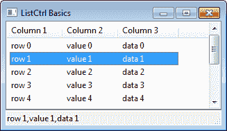
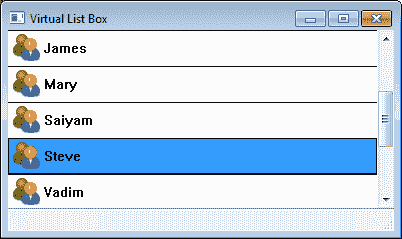
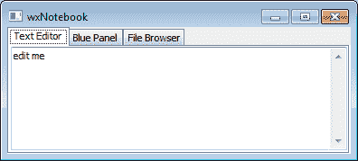
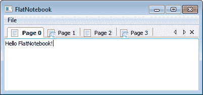

# 第四章 用户界面的高级构建块

在本章中，我们将涵盖：

+   使用`ListCtrl`列出数据

+   使用 `CustomTreeCtrl` 浏览文件

+   创建一个 `VListBox`

+   使用词法分析器创建 `StyledTextCtrl`

+   使用托盘图标

+   向`笔记本`中添加标签页

+   使用`FlatNotebook`

+   使用`ScrolledPanel`进行滚动

+   简化 `FoldPanelBar`

# 简介

展示数据集合和管理复杂的窗口布局是大多数 UI 开发者迟早会遇到的任务。wxPython 提供了一系列组件，以帮助开发者满足这些更高级界面的需求。

随着应用程序在其用户界面中需要显示的控制和数据量增加，有效管理可用屏幕空间的任务也随之增加。要将这些信息适当地放入可用空间，需要使用一些更高级的控制和容器；因此，让我们深入探讨，开始我们对于 wxPython 所能提供的某些更高级控制器的探索之旅。

# 使用 ListCtrl 列出数据

`ListCtrl` 是一种用于显示文本和/或图像集合的多功能控件。该控件支持许多不同的显示格式，尽管通常其最常用的显示模式是报表模式。报表模式具有与网格或电子表格非常相似的视觉表示，因为它可以有多个行和列，以及列标题。本食谱展示了如何从在报表模式下创建的 `ListCtrl` 中填充和检索数据。



## 如何做到这一点...

`ListCtrl` 的设置比大多数基本控件要复杂一些，因此我们将首先创建一个子类来设置我们希望在控件中拥有的列：

```py
class MyListCtrl(wx.ListCtrl):
    def __init__(self, parent):
        super(MyListCtrl, self).__init__(parent,
                                         style=wx.LC_REPORT)

        # Add three columns to the list          
        self.InsertColumn(0, "Column 1")
        self.InsertColumn(1, "Column 2")
        self.InsertColumn(2, "Column 3")

    def PopulateList(self, data):
        """Populate the list with the set of data. Data
        should be a list of tuples that have a value for each
        column in the list.
        [('hello', 'list', 'control'),]
        """
        for item in data:
            self.Append(item)

```

接下来我们将创建一个我们的`ListCtrl`实例，并将其放置在一个`Panel`上，然后使用我们的`PopulateList`方法将一些示例数据放入控件中：

```py
class MyPanel(wx.Panel):
    def __init__(self, parent):
        super(MyPanel, self).__init__(parent)

        # Attributes
        self.lst = MyListCtrl(self)

        # Setup
        data = [ ("row %d" % x,
                  "value %d" % x,
                  "data %d" % x) for x in range(10) ]
        self.lst.PopulateList(data)

        # Layout
        sizer = wx.BoxSizer(wx.VERTICAL)
        sizer.Add(self.lst, 1, wx.EXPAND)
        self.SetSizer(sizer)

        # Event Handlers
        self.Bind(wx.EVT_LIST_ITEM_SELECTED, 
                  self.OnItemSelected)

    def OnItemSelected(self, event):
        selected_row = event.GetIndex()
        val = list()
        for column in range(3):
            item = self.lst.GetItem(selected_row, column)
            val.append(item.GetText())
        # Show what was selected in the frames status bar
        frame = self.GetTopLevelParent()
        frame.PushStatusText(",".join(val))

```

## 它是如何工作的...

通常在使用`ListCtrl`时，需要进行相当多的设置，因此将控制器的使用封装在一个专门的子类中而不是直接使用它是个不错的选择。在我们的`ListCtrl`类中，我们保持了相当基础的设计。我们只是使用了`InsertColumn`方法来设置列表的三个列。然后为了方便，添加了`PopulateList`方法，允许从 Python 数据列表中填充`ListCtrl`。它简单地封装了`ListCtrl`的`Append`方法，该方法只需一个可迭代的字符串，每个字符串代表列表中的一个列。

`MyPanel` 类旨在展示如何使用我们创建的 `ListCtrl` 类。首先，我们通过生成一个元组列表并调用我们的 `PopulateList` 方法来填充它。为了展示如何从列表中检索数据，我们创建了一个事件处理程序用于 `EVT_LIST_ITEM_SELECTED`，它将在控制中每次进行新选择时被触发。为了从 `ListCtrl` 中检索一个值，你需要知道你希望从中检索数据的单元格的行和列索引，然后调用 `GetItem` 方法并传入行和列以获取表示该单元格的 `ListItem` 对象。然后可以通过调用 `ListItem` 的 `GetText` 方法来检索单元格的字符串值。

## 还有更多...

根据用于创建 `ListCtrl` 的样式标志，它将以许多不同的可能方式表现。正因为如此，了解一些可以用于创建 `ListCtrl` 的不同样式标志是很重要的。

| 样式标志 | 描述 |
| --- | --- |
| `LC_LIST` | 在列表模式下，控件将自动计算列，因此无需调用 `InsertColumn`。它可以用来显示字符串，以及可选的小图标 |
| `LC_REPORT` | 单列或多列报表视图，可以带或不带标题显示 |
| `LC_ICON` | 大图标视图，可选带有标签 |
| `LC_SMALL_ICON` | 可选带有标签的小图标视图 |
| `LC_EDIT_LABELS` | 允许用户编辑项目标签 |
| `LC_NO_HEADER` | 隐藏列标题（报告模式） |
| `LC_SORT_ASCENDING` | 按升序排序项目（必须提供`SortItems`回调方法） |
| `LC_SORT_DESCENDING` | 按降序排序项目（必须提供`SortItems`回调方法） |
| `LC_HRULE` | 在行之间绘制水平线（报告模式） |
| `LC_VRULE` | 在列之间绘制垂直线（报告模式） |
| `LC_SINGLE_SEL` | 仅允许一次选择一个项目（默认允许多选） |
| `LC_VIRTUAL` | 按需获取用于在列表中显示的项目（报告模式） |

### 虚拟模式

当在虚拟模式下创建`ListCtrl`（使用`LC_VIRTUAL`样式标志）时，它不会内部存储数据；相反，当需要显示数据时，它会从数据源请求数据。这种模式在您拥有大量数据时非常有用，因为预先在控件中加载这些数据可能会引起性能问题。要使用虚拟模式的`ListCtrl`，您必须调用`SetItemCount`来告诉控件有多少行数据，并重写`OnGetItemText`方法，以便在控件请求时返回`ListItem`的文本。

## 参见

+   本章中创建 *创建 VListBox* 菜单的示例是另一个用于以列表形式展示数据的控件示例。

# 使用 CustomTreeCtrl 浏览文件

`TreeCtrl` 是在用户界面中显示层次数据的一种方式。`CustomTreeCtrl` 是一个完全由所有者绘制的 `TreeCtrl`，其外观和功能与默认的 `TreeCtrl` 几乎相同，但它提供了一些默认原生控件所不具备的额外功能和可定制性。本食谱展示了如何通过使用 `CustomTreeCtrl` 来创建一个自定义文件浏览器类。

## 如何做到这一点...

要创建这个自定义的`FileBrowser`控件，我们将使用其构造函数来设置用于树中文件夹和文件的图片：

```py
import  os
import wx
import wx.lib.customtreectrl as customtree

class FileBrowser(customtree.CustomTreeCtrl):
    FOLDER, \
    ERROR, \
    FILE = range(3)
    def __init__(self, parent, rootdir, *args, **kwargs):
        super(FileBrowser, self).__init__(parent,
                                          *args,
                                          **kwargs)         
        assert os.path.exists(rootdir), \
               "Invalid Root Directory!"
        assert os.path.isdir(rootdir), \
               "rootdir must be a Directory!"

        # Attributes
        self._il = wx.ImageList(16, 16)
        self._root = rootdir
        self._rnode = None  

        # Setup
        for art in (wx.ART_FOLDER, wx.ART_ERROR,
                    wx.ART_NORMAL_FILE):
            bmp = wx.ArtProvider.GetBitmap(art, size=(16,16))
            self._il.Add(bmp)
        self.SetImageList(self._il)
        self._rnode = self.AddRoot(os.path.basename(rootdir),
                                   image=FileBrowser.FOLDER,
                                   data=self._root)
        self.SetItemHasChildren(self._rnode, True)
        # use Windows-Vista-style selections       
        self.EnableSelectionVista(True)

        # Event Handlers
        self.Bind(wx.EVT_TREE_ITEM_EXPANDING, 
                  self.OnExpanding)
        self.Bind(wx.EVT_TREE_ITEM_COLLAPSED, 
                  self.OnCollapsed)

    def _GetFiles(self, path):
        try:
            files = [fname for fname in os.listdir(path)
                     if fname not in ('.', '..')]
        except OSError:
            files = None
        return files

```

以下两个事件处理器用于更新在树中节点展开或折叠时显示哪些文件：

```py
    def OnCollapsed(self, event):
        item = event.GetItem()
        self.DeleteChildren(item)

    def OnExpanding(self, event):
        item = event.GetItem()
        path = self.GetPyData(item)
        files = self._GetFiles(path)

        # Handle Access Errors
        if files is None:
            self.SetItemImage(item, FileBrowser.ERROR)
            self.SetItemHasChildren(item, False)
            return

        for fname in files:
            fullpath = os.path.join(path, fname)
            if os.path.isdir(fullpath):
                self.AppendDir(item, fullpath)
            else:
                self.AppendFile(item, fullpath)

```

以下方法被添加为 API，用于与控件一起添加项目并检索它们的磁盘路径：

```py
    def AppendDir(self, item, path):
        """Add a directory node"""
        assert os.path.isdir(path), "Not a valid directory!"
        name = os.path.basename(path)
        nitem = self.AppendItem(item, name,
                                image=FileBrowser.FOLDER,
                                data=path)
        self.SetItemHasChildren(nitem, True)

    def AppendFile(self, item, path):
        """Add a file to a node"""
        assert os.path.isfile(path), "Not a valid file!"
        name = os.path.basename(path)
        self.AppendItem(item, name,
                        image=FileBrowser.FILE,
                        data=path)

    def GetSelectedPath(self):
        """Get the selected path"""
        sel = self.GetSelection()
        path = self.GetItemPyData(sel)
        return path

    def GetSelectedPaths(self):
        """Get a list of selected paths"""
        sels = self.GetSelections()
        paths = [self.GetItemPyData(sel)
                 for sel in sels ]
        return paths

```

## 它是如何工作的...

只需几行代码，我们就创建了一个非常实用的迷你小工具，用于显示和操作文件系统。让我们快速了解一下它是如何工作的。

在类的构造函数中，我们使用控制器的 `AddRoot` 方法添加了一个根节点。根节点是一个顶级节点，其上方没有其他父节点。第一个参数是要显示的文本，`image` 参数指定了 `TreeItem` 的默认图像，而 `data` 参数指定了与项目关联的任何类型的数据——在这种情况下，我们为项目的路径设置了一个字符串。然后我们为该项目调用了 `SetItemHasChildren` 方法，以便它旁边会显示一个按钮，允许它被展开。在构造函数中我们做的最后一件事是将控制器绑定到两个事件上，这样我们就可以在其中一个节点被展开或折叠时更新树。

在节点即将展开之前，我们的`EVT_TREE_ITEM_EXPANDING`处理程序将被调用。正是在这里，我们找到目录节点下的所有文件和文件夹，然后通过调用`AppendItem`将它们作为该节点的子项添加，`AppendItem`的功能类似于`AddRoot`，但用于向树中已存在的节点添加项。

相反，当树中的节点即将被折叠时，我们的`EVT_TREE_ITEM_COLLAPED`事件处理程序将被调用。在这里，我们只是简单地调用`DeleteChildren`来从节点中删除子项，这样我们就可以在节点下一次展开时更容易地更新它们。否则，我们下次展开时将不得不找出有什么不同，然后删除已删除的项，并插入可能已添加到目录中的新项。

我们班级的最后两项是为了获取所选项目的文件路径，由于我们在每个节点中存储文件路径，所以这仅仅是一个通过调用`GetPyData`从当前选中的每个`TreeItems`获取数据的问题。

## 还有更多...

在这个菜谱中我们做的绝大多数事情实际上也可以用标准的 `TreeCtrl` 来实现。区别在于 `CustomTreeCtrl` 提供的额外可定制性数量。由于它是一个完全由所有者绘制的控件，几乎所有的可见属性都可以进行定制。以下是可用于定制其外观的一些函数列表：

| 函数 | 描述 |
| --- | --- |
| `EnableSelectionGradient(bool)` | 使用渐变来绘制树项选择矩形。 |
| `EnableSelectionVista(bool)` | 使用类似于 Windows Vista 中看到的原生控件的美观圆角矩形来进行项目选择。 |
| `SetButtonsImageList(ImageList)` | 更改展开/折叠按钮。`ImageList` 应包含以下状态的四个位图，顺序如下：`正常，选中，展开`，以及`展开选中`。 |
| `SetConnectionPen(pen)` | 改变树中项目之间连接线的绘制方式。接受一个用于绘制线的 `wx.Pen` 对象。 |
| `SetBackgroundImage(bitmap)` | 允许使用图像作为控件背景。 |
| `SetBackgroundColour(colour)` | 用于更改控件背景颜色。 |

# 创建一个 VListBox

`VListBox` 控件与 `ListBox` 控件非常相似，但它却是虚拟的（它不内部存储数据）并且允许项目具有可变的行高。它通过提供一系列虚拟回调方法来实现，你必须在一个子类中重写这些方法以按需绘制项目。由于需要重写纯虚拟方法，`VListBox` 将始终被派生。这个配方展示了如何创建一个派生的 `VListBox` 控件，它支持每个项目中的图标和文本。

## 如何做到这一点...

要创建我们的用户列表控件，我们只需继承一个`VListBox`并重写其中的一些回调方法以执行必要的操作：

```py
class UserListBox(wx.VListBox):
    """Simple List Box control to show a list of users"""
    def __init__(self, parent, users):
        """@param users: list of user names"""
        super(UserListBox, self).__init__(parent)

        # Attributes
        # system-users.png is a sample image provided with
        # this chapters sample code.
        self.bmp = wx.Bitmap("system-users.png",
                             wx.BITMAP_TYPE_PNG)
        self.bh = self.bmp.GetHeight()
        self.users = users

        # Setup
        self.SetItemCount(len(self.users))

    def OnMeasureItem(self, index):
        """Called to get an items height"""
        # All our items are the same so index is ignored
        return self.bh + 4

    def OnDrawSeparator(self, dc, rect, index):
        """Called to draw the item separator"""
        oldpen = dc.GetPen()
        dc.SetPen(wx.Pen(wx.BLACK))
        dc.DrawLine(rect.x, rect.y,
                    rect.x + rect.width,
                    rect.y)
        rect.Deflate(0, 2)
        dc.SetPen(oldpen)

    def OnDrawItem(self, dc, rect, index):
        """Called to draw the item"""
        # Draw the bitmap
        dc.DrawBitmap(self.bmp, rect.x + 2,
                      ((rect.height - self.bh) / 2) + rect.y)
        # Draw the label to the right of the bitmap
        textx = rect.x + 2 + self.bh + 2
        lblrect = wx.Rect(textx, rect.y,
                          rect.width - textx,
                          rect.height)
        dc.DrawLabel(self.users[index], lblrect,
                     wx.ALIGN_LEFT|wx.ALIGN_CENTER_VERTICAL)

```

这里是`UserListBox`的截图，其中包含了一些示例数据。



## 它是如何工作的...

我们的定制`VListBox`控件可以用于任何需要显示用户列表的应用程序。构造函数接收一个用户名列表并调用`SetItemCount`来告知控件需要显示的项目数量。我们还加载了一个位图，用于列表项中。此位图包含在伴随本主题的示例代码中。

从这个菜谱中，我们需要掌握的是我们覆盖的三个虚拟回调方法，以便在我们的控件中绘制项目：

1.  第一个需要重写的方法是 `OnMeasureItem`。这个方法将为列表中的每个项目被调用，并且需要返回项目的高度。

1.  下一个方法是 `OnDrawSeparator`。此方法为可选，可用于在控件中的每个项目之间绘制分隔符。如有必要，它还可以修改 `Rect`，这样当调用 `OnDrawItem` 时，它将知道不要在分隔符上绘制。

1.  最终的方法是 `OnDrawItem`。这个方法用于绘制实际的项。对于我们的控件，我们绘制一个位图，然后将用户的姓名作为标签放置在其右侧。就是这样；很简单，对吧。

## 还有更多...

有几种其他方法可供使用，这些方法在实现 `VListBox` 子类时可能很有用。以下列表描述了这些方法。

| 方法 | 描述 |
| --- | --- |
| `OnDrawItemBackground` | 此方法可以像 `DrawItem` 一样被重写，以便为项目绘制自定义背景。默认基类会以系统默认选择颜色绘制选中项的背景。 |
| `IsSelected` | 此方法可用于查看项目是否被选中，如果你想在`OnDrawItem`中更改绘制项目的方式，例如使字体加粗。 |

## 参见

+   第一章中的*理解继承限制*配方，*wxPython 入门*包含了关于 C++对象中虚方法的解释。

+   本章中关于使用 ListCtrl 列表控件展示数据的示例，是另一种将数据以列表形式呈现的控件示例。

+   第八章中的“*屏幕绘图*”配方，*《屏幕绘图》*，讨论了 PaintEvents 和设备上下文的使用。

# 使用词法分析器的样式文本控件

`StyledTextCtrl` 是由 `wx.stc` 模块提供的先进文本控件类。该类是对 Scintilla 源代码编辑组件的封装（参见 [`www.scintilla.org`](http://www.scintilla.org)）。`StyledTextCtrl` 主要用于显示和操作各种编程语言的源代码。它为许多不同类型的源代码文件提供了内置的语法高亮支持，并且可以扩展以使用自定义词法分析器。本菜谱展示了如何设置控件以使用其内置的词法分析器对 Python 进行源代码高亮显示。

## 如何做到这一点...

要开始，我们将定义一个通用的语言编辑器类，该类将管理所有常见的样式设置，以便我们能够轻松地创建支持不同类型编程语言的其它类：

```py
imp ort wx
import wx.stc as stc
import keyword

class CodeEditorBase(stc.StyledTextCtrl):
    def __init__(self, parent):
        super(CodeEditorBase, self).__init__(parent)

        # Attributes
        font = wx.Font(10, wx.FONTFAMILY_MODERN,
                           wx.FONTSTYLE_NORMAL,
                           wx.FONTWEIGHT_NORMAL)
        self.face = font.GetFaceName()
        self.size = font.GetPointSize()

        # Setup
        self.SetupBaseStyles()

    def EnableLineNumbers(self, enable=True):
        """Enable/Disable line number margin"""
        if enable:
            self.SetMarginType(1, stc.STC_MARGIN_NUMBER)
            self.SetMarginMask(1, 0)
            self.SetMarginWidth(1, 25)
        else:
            self.SetMarginWidth(1, 0)

    def GetFaces(self):
        """Get font style dictionary"""
        return dict(font=self.face,
                    size=self.size)

    def SetupBaseStyles(self):
        """Sets up the the basic non lexer specific
        styles.
        """
        faces = self.GetFaces()
        default = "face:%(font)s,size:%(size)d" % faces
        self.StyleSetSpec(stc.STC_STYLE_DEFAULT, default)
        line = "back:#C0C0C0," + default
        self.StyleSetSpec(stc.STC_STYLE_LINENUMBER, line)
        self.StyleSetSpec(stc.STC_STYLE_CONTROLCHAR,
                          "face:%(font)s" % faces)

```

现在我们将从我们的`CodeEditorBase`类派生出一个新的类，该类专门用于处理 Python 文件：

```py
class PythonCodeEditor(CodeEditorBase):
    def __init__(self, parent):
        super(PythonCodeEditor, self).__init__(parent)

        # Setup
        self.SetLexer(wx.stc.STC_LEX_PYTHON)
        self.SetupKeywords()
        self.SetupStyles()
        self.EnableLineNumbers(True)

    def SetupKeywords(self):
        """Sets up the lexers keywords"""
        kwlist = u" ".join(keyword.kwlist)
        self.SetKeyWords(0, kwlist)
        #self.SetKeywords(1, user_kw)

    def SetupStyles(self):
        """Sets up the lexers styles"""
        # Python styles
        faces = self.GetFaces()
        fonts = "face:%(font)s,size:%(size)d" % faces
        default = "fore:#000000," + fonts

        # Default 
        self.StyleSetSpec(stc.STC_P_DEFAULT, default)
        # Comments
        self.StyleSetSpec(stc.STC_P_COMMENTLINE,
                          "fore:#007F00," + fonts)
        # Number
        self.StyleSetSpec(stc.STC_P_NUMBER,
                          "fore:#007F7F," + fonts)
        # String
        self.StyleSetSpec(stc.STC_P_STRING,
                          "fore:#7F007F," + fonts)
        # Single quoted string
        self.StyleSetSpec(stc.STC_P_CHARACTER,
                          "fore:#7F007F," + fonts)
        # Keyword
        self.StyleSetSpec(stc.STC_P_WORD,
                          "fore:#00007F,bold," + fonts)
        # Triple quotes
        self.StyleSetSpec(stc.STC_P_TRIPLE,
                          "fore:#7F0000," + fonts)
        # Triple double quotes
        self.StyleSetSpec(stc.STC_P_TRIPLEDOUBLE,
                          "fore:#7F0000," + fonts)
        # Class name definition
        self.StyleSetSpec(stc.STC_P_CLASSNAME,
                          "fore:#0000FF,bold," + fonts)
        # Function or method name definition
        self.StyleSetSpec(stc.STC_P_DEFNAME,
                          "fore:#007F7F,bold," + fonts)
        # Operators
        self.StyleSetSpec(stc.STC_P_OPERATOR, "bold," + fonts)
        # Identifiers
        self.StyleSetSpec(stc.STC_P_IDENTIFIER, default)
        # Comment-blocks
        self.StyleSetSpec(stc.STC_P_COMMENTBLOCK,
                          "fore:#7F7F7F," + fonts)
        # End of line where string is not closed
        eol_style = "fore:#000000,back:#E0C0E0,eol," + fonts
        self.StyleSetSpec(stc.STC_P_STRINGEOL, eol_style)

```

## 它是如何工作的...

我们创建了两个类：一个基础编辑器类和一个专门用于 Python 源文件的类。让我们首先看看 `CodeEditorBase` 类。

`CodeEditorBase` 设置了控件的基本功能，它仅仅是为了封装一些常见的项目，如果我们决定稍后添加其他针对不同类型源文件的专用类，它就派上用场了。

首要的是，它初始化基本的窗口样式并提供字体信息。`StyledTextCtrl` 为缓冲区中不同文本的样式提供了多种样式规范。这些样式是通过使用 `StyleSetSpec` 方法来指定的，该方法接受样式 ID 和样式规范字符串作为参数。适用于所有词法分析器的通用样式 ID 以 `STC_STYLE_` 前缀标识。样式规范字符串的格式如下：

```py
ATTRIBUTE:VALUE,ATTRIBUTE:VALUE,MODIFIER 

```

在这里，`ATTRIBUTE` 和 `VALUE` 可以替换为以下表格中可能规格的任何组合：

| 属性 | 可能的值 |
| --- | --- |
| `fore` | 前景色；可以是颜色名称（黑色）或十六进制颜色字符串（例如，`#000000`） |
| `back` | 背景颜色；可以是颜色名称（例如，白色）或十六进制颜色字符串（例如，`#FFFFFF`） |
| `face` | 一种字体名称（例如，`Monaco`） |
| `size` | 字体的大小（例如，`10`） |

此外，还有一些额外的 `MODIFER` 属性也支持不包含 `VALUE` 参数：

| 修饰符 | 描述 |
| --- | --- |
| **粗体** | 使文本加粗 |
| `斜体` | 斜体化文本 |
| `eol` | 将背景样式扩展到当前行的末尾 |
| `underline` | 下划线文本 |

`StyledTextCtrl` 还支持在缓冲区的左侧设置特殊边距，用于显示行号、断点和代码折叠按钮等。我们的 `CodeEditorBase` 通过其 `EnableLineNumbers` 方法展示了如何在最左侧边距中启用行号。

我们推导出的 `PythonCodeEditor` 类仅仅执行设置正确词法分析器所需的三个基本操作：

1.  首先，它调用`SetLexer`来设置词法分析器模式。该方法简单地取自`stc`模块中找到的`STC_LEX_FOO`值之一。

1.  其次，它为词法分析器设置了关键字。关于每个词法分析器可用的关键字集的文档很少，因此有时需要查看 Scintilla 源代码以查看为每个词法分析器定义了哪些关键字集。Python 词法分析器支持两个关键字集：一个用于语言关键字，另一个用于用户定义的关键字。`SetKeywords` 方法接受两个参数：一个关键字 ID 和一个与该 ID 关联的空格分隔的关键字字符串。每个关键字 ID 都与给定词法分析器的 Style ID 相关联。在这个例子中，关键字 ID 为零的关联 Style ID 是：`STC_P_WORD`。

1.  第三点也是最后一点，它为所有的样式规范设置了 lexer。这与我们在基类中所做的方式相同，通过为 lexer 定义的每个样式规范 ID 调用`StyleSetSpec`来实现。有关哪些样式与哪些 lexer 相关联的快速参考可以在 wxPython wiki 中找到（[`wiki.wxpython.org/StyledTextCtrl%20Lexer%20Quick%20Reference`](http://wiki.wxpython.org/StyledTextCtrl%20Lexer%20Quick%20Reference)）。

## 还有更多...

`StyledTextCtrl` 是一个包含非常庞大 API 的大类。它具有许多在这里未讨论的附加功能，例如用于实现自动完成的弹出列表、可点击的热点、代码折叠和自定义高亮显示。以下是一些关于 `StyledTextCtrl` 的参考资料和文档链接：

+   [`www.yellowbrain.com/stc/index.html`](http://www.yellowbrain.com/stc/index.html)

+   [wxPython 文档中关于 wx.stc.StyledTextCtrl 类的 API](http://www.wxpython.org/docs/api/wx.stc.StyledTextCtrl-class.html)

+   [`wiki.wxpython.org/StyledTextCtrl`](http://wiki.wxpython.org/StyledTextCtrl)

## 参见

+   第三章中的*使用 TextCtrl*配方，*用户界面基本构建块*展示了如何使用基本文本控件。

+   第十章中的 *StyledTextCtrl 自定义高亮* 菜单，*创建组件和扩展功能* 展示了如何扩展 `StyledTextCtrl` 以执行自定义文本样式。

# 使用托盘图标

桌面图标是集成到窗口管理器的任务栏（Windows/Linux）或 Dock（OS X）的 UI 组件。它们可用于通知，并在用户点击通知图标时提供弹出菜单。本食谱展示了如何通过使用`TaskBarIcon`类来创建和使用桌面图标。

## 如何做到这一点...

为了创建此菜谱示例代码的图标栏，我们创建了一个`TaskBarIcon`的子类，该子类加载一个用于显示的图像，并且当点击时具有显示`Menu`的处理功能：

```py
class CustomTaskBarIcon(wx.TaskBarIcon):
    ID_HELLO = wx.NewId()
    ID_HELLO2 = wx.NewId()
    def __init__(self):
        super(CustomTaskBarIcon, self).__init__()

        # Setup
        icon = wx.Icon("face-monkey.png", wx.BITMAP_TYPE_PNG)
        self.SetIcon(icon)

        # Event Handlers
        self.Bind(wx.EVT_MENU, self.OnMenu)

    def CreatePopupMenu(self):
        """Base class virtual method for creating the
        popup menu for the icon.
        """
        menu = wx.Menu()
        menu.Append(CustomTaskBarIcon.ID_HELLO, "HELLO")
        menu.Append(CustomTaskBarIcon.ID_HELLO2, "Hi!")
        menu.AppendSeparator()
        menu.Append(wx.ID_CLOSE, "Exit")
        return menu

    def OnMenu(self, event):
        evt_id = event.GetId()
        if evt_id == CustomTaskBarIcon.ID_HELLO:
            wx.MessageBox("Hello World!", "HELLO")
        elif evt_id == CustomTaskBarIcon.ID_HELLO2:
            wx.MessageBox("Hi Again!", "Hi!")
        elif evt_id == wx.ID_CLOSE:
            self.Destroy()
        else:
            event.Skip()

```

## 它是如何工作的...

`TaskBarIcon` 类使用起来相当简单直接。需要做的只是创建一个图标，并调用 `SetIcon` 方法来创建将在系统托盘显示的对象的 UI 部分。然后我们重写 `CreatePopupMenu` 方法，这个方法是在图标被点击时基类会调用的，以创建菜单。这个方法需要做的只是创建一个 `Menu` 对象，然后返回它；`TaskBarIcon` 类会处理其余部分。最后，我们添加了一个 `EVT_MENU` 事件处理程序来处理来自我们的弹出菜单的菜单事件。

## 还有更多...

`TaskBarIcon` 类关联了许多事件，如果您想自定义不同类型点击的行为。请参阅以下表格以获取可用事件列表及其调用描述。

| Events | 描述 |
| --- | --- |
| `EVT_TASKBAR_CLICK` | 鼠标点击了图标 |
| `EVT_TASKBAR_LEFT_DCLICK` | 左键双击任务栏图标 |
| `EVT_TASKBAR_LEFT_DOWN` | 左键点击图标按下 |
| `EVT_TASKBAR_LEFT_UP` | 左键在图标上释放 |
| `EVT_TASKBAR_MOVE` | 任务栏图标已移动 |
| `EVT_TASKBAR_RIGHT_DCLICK` | 右键双击任务栏图标 |
| `EVT_TASKBAR_RIGHT_DOWN` | 右键鼠标点击图标按下 |
| `EVT_TASKBAR_RIGHT_UP` | 右键鼠标在图标上释放 |

## 参见

+   第三章中的 *添加菜单和菜单栏* 菜谱，*用户界面基本构建块* 包含了更多使用和创建菜单的示例。

+   第三章中的 *如何使用弹出菜单* 菜谱，*用户界面基本构建块* 包含了创建上下文菜单的另一个示例。

# 在笔记本中添加选项卡

`Notebook`类是一个容器控件，用于通过标签页管理多个面板。当选择一个标签页时，相关的面板会显示，而之前的一个面板会被隐藏。本食谱展示了如何使用默认的原生`Notebook`类创建一个类似于以下截图所示的基于标签页的用户界面：



## 如何做到这一点...

以下示例代码片段定义了一个包含三个标签页的`Notebook`类：

```py
class MyNotebook(wx.Notebook):
    def __init__(self, parent):
        super(MyNotebook, self).__init__(parent)

        # Attributes
        self.textctrl = wx.TextCtrl(self, value="edit me",
                                    style=wx.TE_MULTILINE)
        self.blue = wx.Panel(self)
        self.blue.SetBackgroundColour(wx.BLUE)
        self.fbrowser = wx.GenericDirCtrl(self)

        # Setup
        self.AddPage(self.textctrl, "Text Editor")
        self.AddPage(self.blue, "Blue Panel")
        self.AddPage(self.fbrowser, "File Browser")

```

## 它是如何工作的...

这个示例仅仅展示了如何使用`Notebook`控件的基本原理。我们简单地创建了一些我们希望放入`Notebook`中的窗口对象。在这种情况下，我们创建了三个不同的对象：一个`TextCtrl`，一个`Panel`和一个`GenericDirCtrl`。需要注意的是，我们希望放入`Notebook`中的项目必须是`Notebook`的子对象。

然后将对象通过调用其`AddPage`方法添加到`Notebook`中。此方法接受一个窗口对象和一个标签作为参数。

## 还有更多...

基本的`Notebook`类并没有提供太多超出上述展示的功能。然而，还有一些额外的样式，以及一些与选项卡选择相关的事件。以下是一些关于这些额外项目的快速参考。

### 样式

Notebook 构造函数可以提供以下样式：

| 样式 | 描述 |
| --- | --- |
| `NB_BOTTOM` | 将选项卡放置在控制区域的底部 |
| `NB_FIXEDWIDTH` | 所有制表符大小相同（仅限 Windows） |
| `NB_LEFT` | 将选项卡放置在控制区域的左侧 |
| `NB_MULTILINE` | 允许多行制表符（仅限 Windows） |
| `NB_NOPAGETHEME` | 仅在 Windows 系统中使用纯色作为标签页颜色 |
| `NB_RIGHT` | 将选项卡放置在控制区域的右侧 |
| `NB_TOP` | 将选项卡置于控制区域顶部（默认） |

### 事件

笔记本会发出以下事件：

| 事件 | 描述 |
| --- | --- |
| `EVT_NOTEBOOK_PAGE_CHANGING` | 当笔记本正在从一个页面切换到另一个页面时，会触发此事件。在事件对象上调用 Veto 将阻止页面切换。 |
| `EVT_NOTEBOOK_PAGE_CHANGED` | 当选中的页面发生变化时，将触发此事件。 |

## 参见

+   本章中关于*使用 FlatNotebook 食谱*的部分展示了另一种类型标签控制的用法。

# 使用 FlatNotebook

`FlatNotebook` 类是一个自定义的 `Notebook` 实现，它提供了比默认 `Notebook` 更多的功能。这些额外功能包括在每个标签页上拥有关闭按钮、拖放标签页到不同的位置，以及多种不同的标签页样式来改变控件的外观和感觉。本食谱将探索这个控件提供的部分扩展功能。

## 如何做到这一点...

作为如何使用 `FlatNotebook` 的一个示例，我们将定义一个具有显示多个 `TextCtrls:` 特殊化的子类：

```py
import wx
import wx.lib
import wx.lib.flatnotebook as FNB

class MyFlatNotebook(FNB.FlatNotebook):
    def __init__(self, parent):
        mystyle = FNB.FNB_DROPDOWN_TABS_LIST|\
                  FNB.FNB_FF2|\
                  FNB.FNB_SMART_TABS|\
                  FNB.FNB_X_ON_TAB
        super(MyFlatNotebook, self).__init__(parent,
                                             style=mystyle)
        # Attributes
        self._imglst = wx.ImageList(16, 16)

        # Setup
        bmp = wx.Bitmap("text-x-generic.png")
        self._imglst.Add(bmp)
        bmp = wx.Bitmap("text-html.png")
        self._imglst.Add(bmp)
        self.SetImageList(self._imglst)

        # Event Handlers
        self.Bind(FNB.EVT_FLATNOTEBOOK_PAGE_CLOSING, 
                  self.OnClosing)

    def OnClosing(self, event):
        """Called when a tab is closing"""
        page = self.GetCurrentPage()
        if page and hasattr(page, "IsModified"):
            if page.IsModified():
                r = wx.MessageBox("Warning unsaved changes”
                                  “ will be lost",
                                  "Close Warning",
                                  wx.ICON_WARNING|\
                                  wx.OK|wx.CANCEL)
                if r == wx.CANCEL:
                    event.Veto()

```

在下面的屏幕截图里，我们可以看到上述子类在实际操作中的表现，在一个简单的文件编辑器应用中。下面应用的完整源代码以及与这个食谱一起提供的代码都可以获取。



## 它是如何工作的...

这份小食谱展示了`FlatNotebook`相对于标准`Notebook`类提供的许多特性。因此，让我们逐节分析，从构造函数开始。

在我们子类的构造函数中，我们指定了四个样式标志。第一个，`FNB_DROPDOWN_TAB_LIST`，指定了我们想要一个下拉列表，显示所有打开的标签页。下拉列表是那个小向下箭头按钮：点击它将显示一个弹出菜单，允许从列表中选择当前打开的标签页之一。第二个样式标志，`FNB_FF2`，指定了我们想要使用 Firefox 2 标签渲染器的标签页，这将绘制出看起来和感觉类似于 Firefox 2 中的标签页。第三个样式标志，`FNB_SMART_TABS`，指定了*Ctrl + Tab*快捷键将弹出一个对话框，显示打开的标签页，并允许通过按*Tab*键在它们之间循环。我们使用的第四个和最后一个样式标志，`FNB_X_ON_TAB`，指定了我们想要在活动标签页上显示一个关闭按钮。这允许用户在点击此按钮时关闭标签页。

为了能够在标签上显示图标，我们还为该控件创建并分配了一个`ImageList`。`ImageList`简单来说是一个用于存放`Bitmap`对象的容器，控件在绘制标签时会使用它来检索位图数据。需要注意的是，我们通过将其分配给`self._imglst`来保留对该对象的引用；保留引用是很重要的，这样它就不会被垃圾回收。

我们最后做的是将控制与页面关闭事件`EVT_FLATNOTEBOOK_PAGE_CLOSING`绑定。在这个例子中，我们期望我们的页面提供一个`IsModified`方法，这样我们就可以在关闭页面之前检查是否有未保存的更改，以便给用户一个取消关闭页面的机会。

## 还有更多...

因为`FlatNotebook`是一个纯 Python 类，所以它比基本的`Notebook`类更可定制。以下是可以用来定制控件外观和行为的样式标志列表：

### 样式标志

这里是其他可用的样式标志列表，我们之前还没有介绍过：

| 样式标志 | 描述 |
| --- | --- |
| `FNB_ALLOW_FOREIGN_DND` | 允许标签被拖动并移动到其他 `FlatNotebook` 实例，并从其他实例接受标签 |
| `FNB_BACKGROUND_GRADIENT` | 在标签页背景区域绘制渐变 |
| `FNB_BOTTOM` | 将选项卡放置在控制区域的底部 |
| `FNB_COLORFUL_TABS` | 使用彩色标签（仅 VC8 样式） |
| `FNB_DCLICK_CLOSES_TABS` | 允许双击关闭活动标签 |
| `FNB_DEFAULT_STYLE` | `FNB_MOUSE_MIDDLE_CLOSES_TABS` 和 `FNB_HIDE_ON_SINGLE_TAB` 的组合 |
| `FNB_FANCY_TABS` | 使用 `fancy` 标签渲染器来绘制标签 |
| `FNB_HIDE_ON_SINGLE_TAB` | 当只有一个标签打开时隐藏标签容器区域 |
| `FNB_MOUSE_MIDDLE_CLOSES_TABS` | 允许鼠标中键点击关闭标签 |
| `FNB_NODRAG` | 不允许标签拖放 |
| `FNB_NO_NAV_BUTTONS` | 不显示标签滚动按钮 |
| `FNB_NO_X_BUTTON` | 不要在标签容器区域的右侧显示**X**按钮 |
| `FNB_TABS_BORDER_SIMPLE` | 在页面周围绘制细边框 |
| `FNB_VC71` | 使用 Visual Studio 2003 风格的制表符 |
| `FNB_VC8` | 使用 Visual Studio 2005 风格的选项卡 |

## 参见

+   本章中关于*添加标签页到笔记本*的配方展示了如何使用基本的标签控制功能。

# 使用 ScrolledPanel 进行滚动

`ScrolledPanel` 类是一个内置 `ScrollBars` 的自定义 `Panel` 类。这个类由 `wx.lib` 模块中的 `scrolledpanel` 提供。默认情况下，`Panels` 在内容超出给定窗口区域时没有滚动能力。这个菜谱展示了如何使用 `ScrolledPanel`，通过它来创建一个自定义的图像列表小部件。

## 如何做到这一点...

要创建我们自定义的图像查看器控件，该控件使用`ScrolledPanel`，我们将定义这样一个简单的类来管理一系列`Bitmaps`：

```py
import wx
import wx.lib.scrolledpanel as scrolledpanel

class ImageListCtrl(scrolledpanel.ScrolledPanel):
    """Simple control to display a list of images"""
    def __init__(self, parent, bitmaps=list(),
                 style=wx.TAB_TRAVERSAL|wx.BORDER_SUNKEN):
        super(ImageListCtrl, self).__init__(parent,
                                            style=style)

        # Attributes
        self.images = list()
        self.sizer = wx.BoxSizer(wx.VERTICAL)

        # Setup
        for bmp in bitmaps:
            self.AppendBitmap(bmp)
        self.SetSizer(self.sizer)

    def AppendBitmap(self, bmp):
        """Add another bitmap to the control"""
        self.images.append(bmp)
        sbmp = wx.StaticBitmap(self, bitmap=bmp)
        self.sizer.Add(sbmp, 0, wx.EXPAND|wx.TOP, 5)
        self.SetupScrolling()

```

## 它是如何工作的...

`ScrolledPanel` 使得与 `ScrollBars` 一起工作变得非常简单，所以让我们快速了解一下它是如何工作的。

我们创建了一个简单的类，名为 `ImageListCtrl`。这个控件可以用来显示位图列表。我们从这个类派生出了 `ScrolledPanel`，这样如果包含很多图片，用户就可以滚动查看所有图片。使用 `ScrolledPanel` 的唯一特殊之处在于，当所有面板的子控件都添加到其 `Sizer` 中时，需要调用它的 `SetupScrolling` 方法。通常，这会在子类的 `__init__` 方法中完成，但由于我们的小部件可以在任何时候添加更多的 `Bitmap` 项目，因此我们需要在 `AppendBitmap` 方法中添加每个 `Bitmap` 之后调用它。

`SetupScrolling` 方法通过计算 `Panel` 内容的最小尺寸，并为 `ScrollBar` 对象设置与之协同工作的虚拟区域大小来工作。

# 简化 FoldPanelBar

`FoldPanelBar` 是一个自定义容器类，它允许将多个控件组合成 `FoldPanelItem` 控件，通过点击其 `CaptionBar` 来展开或收缩。`FoldPanelBar` 不与基于 `Sizer` 的布局一起工作，因此其 API 可能会有些繁琐，因为它需要你逐个添加每个控件并使用各种标志来设置其布局。本菜谱展示了如何创建一个与 `Panel` 对象一起工作的自定义 `FoldPanelBar`。这个类将允许你将代码模块化到 `Panel` 类中，然后只需将它们添加到 `FoldPanelBar` 而不是直接将所有内容添加到 `FoldPanelBar` 本身。

## 如何做到这一点...

这个自定义的`FoldPanelBar`类采用工厂方法来简化并抽象化向控件添加新的`Panel`的过程：

```py
import wx
import wx.lib.foldpanelbar as foldpanel

class FoldPanelMgr(foldpanel.FoldPanelBar):
    """Fold panel that manages a collection of Panels"""
    def __init__(self, parent, *args, **kwargs):
        super(FoldPanelMgr, self).__init__(parent,
                                           *args,
                                           **kwargs)

    def AddPanel(self, pclass, title=u"", collapsed=False):
        """Add a panel to the manager
        @param pclass: Class constructor (callable)
        @keyword title: foldpanel title
        @keyword collapsed: start with it collapsed
        @return: pclass instance
        """
        fpitem = self.AddFoldPanel(title, collapsed=collapsed)
        wnd = pclass(fpitem)
        best = wnd.GetBestSize()
        wnd.SetSize(best)
        self.AddFoldPanelWindow(fpitem, wnd)
        return wnd

```

## 它是如何工作的...

我们对 `FoldPanelBar` 的子类添加了一个新的方法到 `AddPanel` 类。`AddPanel` 方法是对 `FoldPanelBar` 控件的 `AddFoldPanel` 和 `AddFoldPanelWindow` 方法的简单封装。`AddFoldPanel` 方法用于创建控制件的 `CaptionBar` 和容器，而 `AddFoldPanelWindow` 方法用于将一个窗口对象添加到 `FoldPanel`。

我们的 `AddPanel` 方法将其第一个参数接受为一个可调用对象。这个可调用对象必须接受一个 "parent" 参数，并在被调用时返回一个新窗口，该窗口是父窗口的子窗口。我们这样做是因为我们的面板需要作为 `AddFoldPanel` 返回的 `FoldPanelItem` 的子窗口来创建。这是在使用 `FoldPanelBar` 时需要记住的一个重要点。添加到其中的所有控件都必须是其中一个 `FoldPanelItems` 的子控件，而不是 `FoldPanelBar` 本身的子控件。

由于`FoldPanelBar`内部使用手动布局，因此在我们添加每个`Panel`时，需要为每个`Panel`设置一个显式的大小。这是通过获取每个`Panel`对象的`GetBestSize`方法的最佳大小来完成的。

## 还有更多...

`FoldPanelBar` 的 `CaptionBar` 可以通过创建一个自定义的 `CaptionBarStyle` 对象并将其传递给 `AddFoldPanel` 方法来自定义。`CaptionBarStyle` 对象具有用于更改 `CaptionBar` 将使用的颜色、字体和样式的各种方法。`AddFoldPanel` 方法还接受一个可选的 `foldIcons` 参数，该参数接受一个必须包含两个 16x16 像素位图的 `ImageList` 对象。第一个将被用于按钮的展开状态，第二个将被用于其折叠状态。
