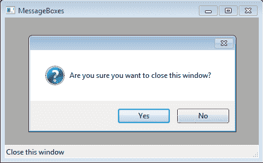
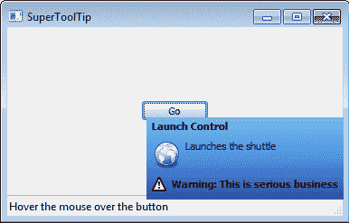

# 第五章：提供信息和提醒用户

在本章中，我们将涵盖：

+   显示一个 `消息框`

+   提供对 `ToolTips` 的帮助

+   使用`超级工具提示`

+   显示一个`气球提示`

+   创建自定义的 `SplashScreen`

+   使用进度对话框显示任务进度

+   创建一个 `关于框`

# 简介

在应用程序运行期间，在多种不同情况下可能会出现各种各样的事件。这导致了需要能够以同样广泛的各种上下文敏感、直观和有效的方式提醒和通知用户这些事件的需求。

在正确的时间和方式提供信息对于应用程序的可用性至关重要。wxPython 包含许多小部件来帮助满足任何类型应用程序的特定需求。因此，让我们来看看这些小部件，并了解如何充分利用它们。

# 显示消息框

`消息框`是（如果不是）最常见和最简单的方式之一，用于提醒用户并为他们提供做出简单选择的能力。`消息框`有多种不同的形式，但都共享两个共同点。它们都有一个（通常是）简短的标题消息和一个或多个按钮，允许用户对消息做出回应。这个配方展示了如何添加一个`消息框`，让用户有机会取消关闭`框架`。

## 如何做到这一点...

作为一个如何显示`MessageBox`的例子，我们将创建一个小的`Frame`类，它使用`MessageBox`作为对窗口关闭事件的确认：

```py
class MyFrame(wx.Frame):
    def __init__(self, parent, *args, **kwargs):
        super(MyFrame, self).__init__(parent, *args, **kwargs)

        # Layout
        self.CreateStatusBar()
        self.PushStatusText("Close this window")

        # Event Handlers
        self.Bind(wx.EVT_CLOSE, 

    def OnClose(self, event):
        result = wx.MessageBox("Are you sure you want "
                               "to close this window?",
                               style=wx.CENTER|\
                                     wx.ICON_QUESTION|\
                                     wx.YES_NO)
        if result == wx.NO:
            event.Veto()
        else:
            event.Skip()

```



## 它是如何工作的...

`wx.MessageBox` 是一个创建、显示和清理模态对话框的函数。它只需要第一个参数，该参数指定了将要显示的消息：

```py
wx.MessageBox(message, caption=””, style=wx.OK|wx.CENTER,
                               parent=None, x=-1, y=-1)

```

其他参数都是可选的关键字参数。第二个参数用于指定对话框的标题。第三个参数是样式参数，用于指定对话框的外观以及它将包含哪些按钮。这个参数就像任何其他小部件构造函数一样，其值将是一个样式标志的位掩码。第四个参数可以用来指定对话框的父窗口。最后两个参数可以用来在桌面上显式设置对话框的 X 和 Y 坐标。

在这个示例中，我们只使用了消息和样式参数。在样式参数中，我们指定了`CENTER`标志，表示对话框应在其父元素上居中显示，在这种情况下，由于我们没有指定父窗口，所以将是桌面。`ICON_QUESTION`标志指定我们希望在对话框上显示问号图标。最后一个标志`YES_NO`表示我们希望在对话框上有一个是/否按钮，以便用户可以回复我们消息中提出的是/否问题。

当用户点击对话框中的一个按钮时，对话框将结束其模态循环并返回被点击按钮的值，在这种情况下将是`YES`或`NO`。在这里，我们简单地检查返回值，要么`否决`事件以阻止`Frame`关闭，要么`跳过`它以允许`Frame`被销毁。

### 注意

**平台公告**

在 OS X 上，这些对话框将显示应用程序图标。这样做是为了符合苹果的人机界面指南。这意味着除非你已经将你的脚本构建成一个小程序并为其指定了图标，否则对话框将显示 `Python.app` 图标。

## 还有更多...

`MessageBox` 函数可以接受多个样式标志。以下是一个按类别划分的快速参考列表。

### 图标

`MessageBox`只能显示一个图标，因此一次只能指定以下标志中的一个：

| 标志 | 描述 |
| --- | --- |
| `wx.ICON_ERROR` | 在对话框上显示一个图标，表示已发生错误。 |
| `wx.ICON_INFORMATION` | 在对话框上显示一个图标，表示该对话框仅显示信息。 |
| `wx.ICON_QUESTION` | 在对话框上显示一个图标，表示用户需要回答的问题。 |
| `wx.ICON_WARNING` | 在对话框上显示一个图标，表示向用户显示警告信息。 |

### 按钮

以下标志用于指定在对话框中显示的按钮。默认情况下，对话框将仅显示一个“确定”按钮：

| Flags | 描述 |
| --- | --- |
| `wx.CANCEL` | 向对话框添加一个取消按钮。 |
| `wx.OK` | 在对话框中添加一个确定按钮。 |
| `wx.YES` | 添加一个“是”按钮到对话框。 |
| `wx.NO` | 在对话框中添加一个“否”按钮。 |
| `wx.YES_NO` | `wx.YES/wx.NO`的便捷性。 |
| `wx.YES_DEFAULT` | 设置“是”按钮为默认按钮。 |
| `wx.NO_DEFAULT` | 设置“否”按钮为默认按钮。 |

# 提供工具提示的帮助

`工具提示`（`ToolTips`）是当鼠标光标在窗口对象上停留片刻时显示的小型弹出帮助文本。当鼠标离开窗口区域时，它们会自动消失。在需要向用户展示关于界面某部分功能额外信息的场合，它们非常有用。几乎所有的窗口对象都支持与它们关联一个`工具提示`。本食谱展示了如何向一个`按钮`添加一个`工具提示`。

## 如何做到这一点...

为了了解如何向控件添加`ToolTip`，让我们先创建一个简单的`Panel`类，它上面有一个单独的`Button`：

```py
class ToolTipTestPanel(wx.Panel):
    def __init__(self, parent):
        super(ToolTipTestPanel, self).__init__(parent)

        # Attributes
        self.button = wx.Button(self, label="Go")

        # Setup
        self.button.SetToolTipString("Launch the shuttle")
        self.timer = wx.Timer(self)
        self.count = 11

        # Layout
        sizer = wx.BoxSizer(wx.VERTICAL)
        sizer.Add(self.button, 0, wx.ALIGN_CENTER)
        msizer = wx.BoxSizer(wx.HORIZONTAL)
        msizer.Add(sizer, 1, wx.ALIGN_CENTER)
        self.SetSizer(msizer)

        # Event Handlers
        self.Bind(wx.EVT_BUTTON, self.OnGo, self.button)
        self.Bind(wx.EVT_TIMER, self.OnTimer, self.timer)

    def OnGo(self, event):
        self.button.Disable()
        print self.timer.Start(1000)
        tlw = self.GetTopLevelParent()
        tlw.PushStatusText("Launch initiated...")

    def OnTimer(self, event):
        tlw = self.GetTopLevelParent()
        self.count -= 1
        tlw.PushStatusText("%d" % self.count)
        if self.count == 0:
            self.timer.Stop()
            wx.MessageBox("Shuttle Launched!")

```

## 它是如何工作的...

在这里，我们仅仅创建了一个带有单个按钮的简单面板。按钮上只有一个简单的标签，写着`Go`。由于没有其他指示说明这个按钮可能执行的操作，我们随后通过调用`SetToolTipString`方法向其添加了一个`ToolTip`。`SetToolTipString`方法属于基类`wx.Window`，因此它可以与屏幕上任何可见的对象一起使用。此方法创建一个`ToolTip`对象，然后调用窗口的`SetToolTip`方法将`ToolTip`与`Window`关联起来。

## 还有更多...

+   本章中的 *使用 SuperToolTips* 菜单展示了为用户提供上下文相关帮助的另一种方法。

+   请参阅第二章中的*鼠标玩转技巧*食谱，了解系统如何在鼠标光标进入窗口时显示提示的细节。

# 使用 SuperToolTips

`SuperToolTip` 类是由 `wx.lib.agw.supertooltip` 模块提供的高级 `ToolTip` 类型。与常规的 `ToolTip` 不同，`SuperToolTip` 是一个自定义的全拥有者绘制的控件，支持广泛的显示选项。它具有显示标题、页脚、主体部分的能力，并且每个部分也可以在其中显示图片。除此之外，它还支持自定义背景、内容的 HTML 渲染和超链接。本食谱展示了如何创建和使用 `SuperToolTip`。

### 注意事项

`wx.lib.agw` 在 wxPython 2.8.9.2 及更高版本中可用。

## 如何做到这一点...

让我们修改来自“使用 ToolTips 提供帮助”菜谱的示例，以展示更详细的帮助信息在这种情况下可能是有益的。这个菜谱使用了两个与本章源代码一起提供的图像文件：

```py
import wx.lib.agw.supertooltip as supertooltip

class SuperToolTipTestPanel (wx.Panel):
    def __init__(self, parent):
        super(SuperToolTipTestPanel, self).__init__(parent)

        # Attributes
        self.button = wx.Button(self, label="Go")
        msg = "Launches the shuttle"
        self.stip = supertooltip.SuperToolTip(msg)

        # Setup SuperToolTip
        bodybmp = wx.Bitmap("earth.png", wx.BITMAP_TYPE_PNG)
        self.stip.SetBodyImage(bodybmp)
        self.stip.SetHeader("Launch Control")
        footbmp = wx.Bitmap("warning.png", wx.BITMAP_TYPE_PNG)
        self.stip.SetFooterBitmap(footbmp)
        footer = "Warning: This is serious business"
        self.stip.SetFooter(footer)          
        self.stip.ApplyStyle("XP Blue")
        self.stip.SetTarget(self.button)

```



## 它是如何工作的...

在这里，我们修改了之前的配方，将其改为使用`SuperToolTip`而不是标准的`ToolTip`。

首先，我们从`wx.lib.agw`包中导入扩展模块，以便我们可以访问`SuperToolTip`类。然后，我们在`SuperToolTipTestPanel`类中为我们的按钮创建`SuperToolTip`对象。在我们的用例中，这包括创建带有其正文消息的提示，然后设置一个将显示在我们消息左侧的正文图像。我们随后通过调用`SetHeader`方法添加了一些标题文本，以及通过使用`SetFooter`和`SetFooterBitmap`方法添加了页脚和页脚图像。最后一步设置是调用`ApplyStyle`方法。此方法允许使用大约 30 种内置样式主题之一来设置背景渐变。

使用 `SuperToolTip` 的最后一步是它与标准 `ToolTip` 之间的重要区别。我们必须在 `SuperToolTip` 对象上调用 `SetTarget` 而不是在 `Window` 对象（在这种情况下是我们的 `Button`）上调用 `SetToolTip`。这是因为 `SuperToolTip` 管理其显示/隐藏的时间，而不是它所属的 `Window`。

## 还有更多...

`SuperToolTip` 包含一些本食谱未涵盖的选项。以下是一些额外的参考和信息。

### 样式

`ApplyStyles` 方法接受一个命名内置样式作为参数。目前大约有 30 种不同的内置样式。它们都在 `supertooltip` 模块中定义，并且可以通过查看 `supertooltip.GetStyleKeys()` 的返回值来找到，该函数将返回所有内置样式的列表。

### 额外的自定义

有几种额外的方法可以用来自定义`SuperToolTip`的外观。以下表格包含了这些方法的快速参考：

| 方法 | 描述 |
| --- | --- |
| `SetDrawHeaderLine(bool)` | 在标题和正文之间绘制一条水平分隔线。 |
| `SetDrawFooterLine(bool)` | 在页脚和主体之间绘制一条水平分隔线。 |
| `SetDropShadow(bool)` | 在提示窗口上使用阴影效果。（仅限 Windows） |
| `SetUseFade(bool)` | 在视图中淡入/淡出。(仅限 Windows) |
| `SetEndDelay(int)` | 设置提示显示的时间。 |
| `SetTopGradientColour(colour)` | 设置顶部渐变颜色。 |
| `SetBottomGradientColour(colour)` | 设置底部渐变颜色。 |
| `SetMiddleGradientColour(colour)` | 设置中间渐变颜色。 |

## 参见

+   本章中的“使用 ToolTips 提供帮助”配方展示了提供简单帮助信息的方法。

# 显示气球提示

`BalloonTips` 是另一种 `ToolTip` 实现。它们与 `SuperToolTip` 相当相似，但外观和感觉模仿了 Windows XP 任务栏的气球通知。当显示时，`BalloonTip` 将创建一个具有指向其目标窗口中心的尖点的提示窗口。本食谱展示了如何将 `BalloonTip` 添加到应用程序的 `TaskBarIcon`。

### 注意

`wx.lib.agw` 在 wxPython 2.8.9.2 及更高版本中可用。

## 如何做到这一点...

在这里，我们将创建一个简单的 `TaskBarIcon` 类，当鼠标悬停在其上时将显示一个 `BalloonTip`。在这个示例中，我们再次使用与本章源代码一起提供的外部图标：

```py
import wx.lib.agw.balloontip as btip

class TaskBarBalloon(wx.TaskBarIcon):
    def __init__(self):
        super(TaskBarBalloon, self).__init__()

        # Setup
        icon = wx.Icon("face-monkey.png", wx.BITMAP_TYPE_PNG)
        self.SetIcon(icon)

        # Setup BallooTip
        title="BalloonTip Recipe"
        msg = "Welcome to the Balloon Tip Recipe"
        bmp = wx.BitmapFromIcon(icon)
        self.tip = btip.BalloonTip(topicon=bmp,
                                   toptitle=title,
                                   message=msg,
                                   shape=btip.BT_ROUNDED,
                                   tipstyle=btip.BT_BUTTON)
        self.tip.SetStartDelay(1000)
        self.tip.SetTarget(self)

        # Event Handlers
        self.Bind(wx.EVT_MENU, self.OnMenu)

    def CreatePopupMenu(self):
        menu = wx.Menu()
        menu.Append(wx.ID_CLOSE, "Exit")
        return menu

    def OnMenu(self, event):
        self.RemoveIcon()
        self.tip.DestroyTimer()
        self.Destroy()

```

## 它是如何工作的...

`BalloonTip` 类位于 `wx.lib.agw.balloontip` 模块中。为了便于使用，我们使用别名 `btip` 导入了它。`BalloonTip` 构造函数最多接受五个可选的关键字参数，用于指定提示框的内容和外观：

| 关键字参数 | 描述 |
| --- | --- |
| `topicon` | 接受一个将在 `BalloonTip` 窗口的左上角显示的 `Bitmap` 对象 |
| `toptitle` | 一个指定 `BalloonTip` 窗口标题的字符串 |
| `message` | 一个指定 `BalloonTip` 窗口主要信息的字符串 |
| `形状` | 要么是 `BT_RECTANGLE` 或 `BT_ROUNDED`（默认），用于指定 `BalloonTip` 窗口的形状 |

| `tipstyle` | 指定如何关闭 `BalloonTip` 窗口的以下值之一：

+   `BT_LEAVE:` 当鼠标离开目标窗口时，提示窗口将被关闭

+   `BT_CLICK:` 当用户点击目标窗口时，提示窗口将被关闭

+   `BT_BUTTON:` 点击提示窗口上的关闭按钮将关闭提示窗口

在创建了`BalloonTip`之后，我们通过调用`SetStartDelay`方法来修改其启动延迟，该方法设置从鼠标移动到目标窗口后显示提示窗口的延迟时间（以毫秒为单位）。最后，我们调用`SetTarget`来将`TaskBarIcon`设置为该`BalloonTip`的目标窗口。之后，`BalloonTip`就全部设置好了，可以与我们的`TaskBarIcon`一起使用。

在退出菜单事件的`TaskBarIcons`事件处理器中，我们不得不在我们的`BalloonTip`上添加对`DestroyTimer`的调用。这是为了确保提示窗口被销毁，否则如果它仍然打开，由于应用程序中仍有顶层窗口，应用程序的主循环将不会退出。

## 还有更多...

与`wx.lib`中大多数通用小部件一样，`BalloonTip`类提供了多种方法来自定义其外观。下表包含了对这些方法的一些快速参考：

| 方法 | 描述 |
| --- | --- |
| `SetBalloonColour(colour)` | 设置 `BalloonTips` 的背景颜色。传递 `None` 以恢复到默认值。 |
| `SetMessageColour(colour)` | 设置主消息的文本 `颜色`。传递 `None` 以恢复到默认设置。 |
| `SetMessageFont(font)` | 设置用于主要信息的 `Font`。传递 `None` 以恢复到默认设置。 |
| `SetTitleColour(colour)` | 设置标题的文本 `颜色`。传递 `None` 以恢复到默认设置。 |
| `SetTitleFont(font)` | 设置标题 `字体`. 通过传递 `None` 来恢复默认设置。 |

## 参见

+   本章中的*使用 SuperToolTips*配方展示了提供上下文相关信息消息的另一种方法。

+   第四章中的*使用托盘图标*配方，*用户界面的高级构建块*包含了在应用程序中使用`TaskBarIcons`的解释。

# 创建自定义启动画面

`SplashWindows` 在应用程序启动过程中很常见。它们是用来显示软件标志的一种方式，更重要的是，它们通常被用作在应用程序启动需要一些时间时向用户提供反馈的手段，这样用户就会知道应用程序正在加载过程中。这个配方展示了如何创建一个高级的 `SplashWindow` 类，它可以显示应用程序在启动过程中的增量进度。

## 如何做到这一点...

在这里，我们将创建我们的自定义`SplashScreen`类。本章附带的源代码还包括一个示例应用程序，展示如何使用这个类：

```py
class ProgressSplashScreen(wx.SplashScreen):
    def __init__(self, *args, **kwargs):
        super(ProgressSplashScreen, self).__init__(*args,
                                                   **kwargs)

        # Attributes
        self.gauge = wx.Gauge(self, size=(-1, 16))

        # Setup
        rect = self.GetClientRect()
        new_size = (rect.width, 16)
        self.gauge.SetSize(new_size)
        self.SetSize((rect.width, rect.height + 16))
        self.gauge.SetPosition((0, rect.height))

    def SetProgress(self, percent):
        """Set the indicator gauges progress"""
        self.gauge.SetValue(percent)

    def GetProgress(self):
        """Get the current progress of the gauge"""
        return self.gauge.GetValue()

```

截图如下：


## 它是如何工作的...

基本的 `SplashScreen` 使用传递给构造函数的 `Bitmap` 来设置其大小，然后 `Bitmap` 被绘制以填充背景。在我们的子类中，我们创建了一个 `Gauge` 以允许程序向用户反馈启动过程的进度。

为了让`Gauge`适应`SplashScreen`，我们首先通过调用其`SetSize`方法，并传入`Gauge`的高度和`SplashScreen`的宽度，将`Gauge`的宽度改为与`SplashScreen`相同。接下来，我们将`SplashScreen`的大小调整为更高，以便我们可以将`Gauge`放置在其底部而不与`SplashScreen`图像重叠。然后，最后一步是通过调用其`SetPosition`方法，并传入`Gauge`顶部左角应放置的 X 和 Y 坐标，手动将`Gauge`定位到我们在底部添加的额外空间中。

我们为这个类添加的最后两件事只是允许用户通过这个类来操作`Gauge`的一些简单访问方法。为了了解这个类在实际中的应用，请查看本章附带的示例代码。

## 还有更多...

`SplashScreen` 构造函数有两个不同的样式参数。第一个参数，`splashStyle`，是一个必需的位掩码，可以是以下一个或多个标志的组合：

| 标志 | 描述 |
| --- | --- |
| `wx.SPLASH_CENTRE_ON_PARENT` | 将启动画面居中显示在其父窗口上。 |
| `wx.SPLASH_CENTRE_ON_SCREEN` | 将启动画面居中显示在桌面上。 |
| `wx.SPLASH_NO_CENTRE` | 不要居中显示启动画面。 |
| `wx.SPLASH_TIMEOUT` | 允许当超时达到时自动销毁启动画面。 |
| `wx.SPLASH_NO_TIMEOUT` | 不允许启动画面超时（需要显式销毁它）。 |

第二个样式标志参数是典型的可选参数，用于指定 `wx.Frame` 样式标志。`SplashScreen` 从 `wx.Frame` 派生，因此这些标志将传递到基类。在大多数情况下，默认标志就是这里想要使用的，否则它最终的行为会更像 `Frame` 而不是 `SplashScreen`。

# 使用进度对话框显示任务进度

`ProgressDialog` 是一个用于显示长时间运行任务进度的对话框，例如从互联网下载文件或从您的程序中导出数据。该对话框显示一条简短的消息、一个进度条，以及可选的“中止”和/或“跳过”按钮。此外，它还可以可选地显示估计时间、已用时间和剩余时间。本食谱展示了如何制作一个命令行脚本，该脚本可用于从互联网下载文件，并使用 `ProgressDialog` 显示下载进度。

## 如何做到这一点...

我们将在这里创建一个完整的应用程序，以便从命令行传递给脚本的 URL 下载文件。因此，首先我们将定义应用程序对象类：

```py
import wx
import os
import sys
import urllib2

class DownloaderApp(wx.App):
    def OnInit(self):
        # Create a hidden frame so that the eventloop
        # does not automatically exit before we show
        # the download dialog.
        self.frame = wx.Frame(None)
        self.frame.Hide()
        return True

    def Cleanup(self):
        self.frame.Destroy()

```

在这里，我们定义了将要用来显示`ProgressDialog`的方法，以及通过使用 Python 标准库中的`urllib`模块来实际下载文件的方法：

```py
    def DownloadFile(self, url):
        """Downloads the file
        @return: bool (success/fail)
        """
        dialog = None
        try:
            # Open the url to read from and
            # the local file to write the downloaded
            # data to.
            webfile = urllib2.urlopen(url)
            size = int(webfile.info()['Content-Length'])
            dlpath = os.path.abspath(os.getcwd())
            dlfile = url.split('/')[-1]
            dlpath = GetUniqueName(dlpath, dlfile)
            localfile = open(dlpath, 'wb')

            # Create the ProgressDialog
            dlmsg = "Downloading: %s" % dlfile
            style = (wx.PD_APP_MODAL
                     |wx.PD_CAN_ABORT
                     |wx.PD_ELAPSED_TIME
                     |wx.PD_REMAINING_TIME)
            dialog = wx.ProgressDialog("Download Dialog",
                                       dlmsg,
                                       maximum=size,
                                       parent=self.frame,
                                       style=style)

            # Download the file
            blk_sz = 4096
            read = 0
            keep_going = True
            while read < size and keep_going:
                data = webfile.read(blk_sz)
                localfile.write(data)
                read += len(data)
                keep_going, skip = dialog.Update(read)

            localfile.close()
            webfile.close()
        finally:
            # All done so cleanup top level windows
            # to cause the event loop to exit.
            if dialog:
                dialog.Destroy()
            self.Cleanup()

```

在这里，我们有一个额外的辅助函数，用于获取一个唯一的路径，以便将下载的数据写入：

```py
#--- Utility Functions ----#

def GetUniqueName(path, name):
    """Make a file name that will be unique in case a file
    of the same name already exists at that path.
    @param path: Root path to folder of files destination
    @param name: desired file name base
    @return: string
    """
    tmpname = os.path.join(path, name)
    if os.path.exists(tmpname):
        if '.' not in name:
            ext = ''
            fbase = name
        else:
            ext = '.' + name.split('.')[-1]
            fbase = name[:-1 * len(ext)]

        inc = len([x for x in os.listdir(path)
                   if x.startswith(fbase)])
        newname = "%s-%d%s" % (fbase, inc, ext)
        tmpname = os.path.join(path, newname)
        while os.path.exists(tmpname):
            inc = inc + 1
            newname = "%s-%d%s" % (fbase, inc, ext)
            tmpname = os.path.join(path, newname)

    return tmpname

```

最后，执行该脚本的主体部分如下，它为该应用程序处理简单的命令行参数并开始下载：

```py
#---- Main Execution ----#
if __name__ == "__main__":
    if len(sys.argv) > 1:
        url = sys.argv[1]
        app = DownloaderApp(False)
        # Start with a slight delay so the eventloop
        # can start running, to ensure our dialog gets
        # shown
        wx.CallLater(2000, app.DownloadFile, url)
        app.MainLoop()
    else:
        # Print some help text
        print(("wxPython Cookbook - ProgressDialog\n"
               "usage: downloader url\n"))

```

这里是一个从命令行下载器调用此脚本的示例：`python downloader.py http://somewebsite.com/afile.zip`.

## 它是如何工作的...

上面的食谱展示了整个下载应用程序的代码。让我们从顶部开始，一步步了解它是如何工作的。

首先，我们从标准 Python 库中导入了某些模块。我们需要 `os` 模块来进行路径操作，`sys` 模块来获取命令行参数，以及 `urllib2` 模块以便我们可以打开远程 URL。

接下来，我们定义了我们的 `DownloaderApp`。这个应用程序对象有两个对我们来说很有兴趣的方法。第一个是重写 `wx.App.OnInit`。在我们的重写中，我们创建了一个框架并将其隐藏。我们这样做只是为了确保在创建和显示我们的 `ProgressDialog` 之前，事件循环不会退出，因为当应用程序中没有更多顶层窗口时，事件循环将默认退出。第二个方法是 `DownloadFile`。这是这个应用程序主要动作发生的地方。

`DownloadFile` 首先使用 `urllib2` 打开传入的远程 URL，并获取该 URL 指向的文件大小。接下来，它在本地文件系统中打开一个文件，以便我们在从远程 URL 读取数据时写入。然后，我们创建我们的 `ProgressDialog`，给它必要的样式标志以包含一个中止按钮并显示已过时间和剩余时间。一旦对话框创建完成，我们就可以开始从我们打开的 URL 读取数据。我们通过一个循环来完成这个操作，该循环检查我们已经读取了多少数据以及中止按钮是否被点击。从 URL 读取一块数据后，我们调用 `ProgressDialog` 的 `Update` 方法，该方法将更新进度条并返回两个布尔标志，指示是否点击了两个可能的对话框按钮之一。一旦循环退出，我们只需关闭两个文件并 `Destroy` 我们窗口对象，以使主循环退出。

最后两件事是`GetUniqueName`函数和`__main__`。`__main__`只是一个简单的实用函数，用来帮助生成本地文件名，以确保我们不会尝试覆盖已经存在的文件。`__main__`执行部分只是对命令行参数进行简单的检查，然后创建`DownloaderApp`实例并调用其`DownloadFile`方法。我们需要使用`wx.CallLater`来延迟调用几秒钟，因为当调用`DownloadFile`时，它将会阻塞。如果不使用`CallLater`，它将会阻塞，执行下载，并在`MainLoop`开始之前返回，这意味着我们的对话框永远不会在屏幕上显示。

## 还有更多...

以下包含了一些在使用`ProgressDialog`时需要考虑的额外参考信息和资料。

### 消息参数

在某些情况下，使用`ProgressDialog`的消息参数可能会出现一些不理想的行为。如果传入的消息字符串非常长，它会导致对话框的宽度被设置得非常宽。所以如果你看到对话框显示的宽度比你预期的要宽得多，尝试缩短你的消息。

### 样式标志

这里是`ProgressDialog`可用的样式标志的快速参考：

| 样式标志 | 描述 |
| --- | --- |
| `wx.PD_APP_MODAL` | 对话框应该是应用程序模式 |
| `wx.PD_AUTO_HIDE` | 当进度条达到最大值时，对话框将自动消失 |
| `wx.PD_SMOOTH` | 使进度条平滑更新 |
| `wx.PD_CAN_ABORT` | 在对话框上显示“取消”按钮 |
| `wx.PD_CAN_SKIP` | 在对话框上显示跳过按钮 |
| `wx.PD_ELAPSED_TIME` | 显示已过时间状态文本 |
| `wx.PD_ESTIMATED_TIME` | 显示预估的总时间状态文本 |
| `wx.PD_REMAININT_TIME` | 显示预估剩余时间状态文本 |

# 创建一个关于框（AboutBox）

关于对话框是一个简单的对话框，用于向用户显示有关应用程序的一些信息，例如应用程序的版本号和许可信息。这个对话框可以在大多数操作系统上的任何应用程序中找到。它包含一个图标和一个小信息区域，通常至少包含版本信息和致谢。本食谱展示了如何在应用程序中设置和显示关于对话框。

## 如何做到这一点...

在这里，我们创建了一个简单的骨架应用程序，展示了如何将`AboutBox`集成到应用程序中：

```py
import wx
import sys

class AboutRecipeFrame(wx.Frame):
    def __init__(self, parent, *args, **kwargs):
        super(AboutRecipeFrame, self).__init__(*args,
                                               **kwargs)

        # Attributes
        self.panel = wx.Panel(self)

        # Setup Menus
        menubar = wx.MenuBar()
        helpmenu = wx.Menu()
        helpmenu.Append(wx.ID_ABOUT, "About")
        menubar.Append(helpmenu, "Help")
        self.SetMenuBar(menubar)

        # Setup StatusBar
        self.CreateStatusBar()
        self.PushStatusText("See About in the Menu")

        # Event Handlers
        self.Bind(wx.EVT_MENU, self.OnAbout, id=wx.ID_ABOUT)

    def OnAbout(self, event):
        """Show the about dialog"""
        info = wx.AboutDialogInfo()

        # Make a template for the description
        desc = ["\nwxPython Cookbook Chapter 5\n",
                "Platform Info: (%s,%s)",
                "License: Public Domain"]
        desc = "\n".join(desc)

        # Get the platform information
        py_version = [sys.platform,
                      ", python ",
                      sys.version.split()[0]]
        platform = list(wx.PlatformInfo[1:])
        platform[0] += (" " + wx.VERSION_STRING)
        wx_info = ", ".join(platform)

        # Populate with information
        info.SetName("AboutBox Recipe")
        info.SetVersion("1.0")
        info.SetCopyright("Copyright (C) Joe Programmer")
        info.SetDescription(desc % (py_version, wx_info))

        # Create and show the dialog
        wx.AboutBox(info)

class AboutRecipeApp(wx.App):
    def OnInit(self):
        self.frame = AboutRecipeFrame(None, 
                                      title="AboutDialog", 
                                      size=(300,200))
        self.SetTopWindow(self.frame)
        self.frame.Show()

        return True

if __name__ == "__main__":
    app = AboutRecipeApp(False)
    app.MainLoop()

```

## 它是如何工作的...

在这个示例中，我们创建了一个非常简单但功能完整的应用程序，用于创建和显示关于对话框。因此，让我们回顾一下上述代码中的重要部分。

首先，让我们看看在`AboutRecipeFrame`类中设置菜单的部分。标准的应用程序关于对话框是通过菜单项显示的。在 Windows 和 GTK Linux 上，这个菜单项位于帮助菜单下；在 Macintosh OS X 上，这个菜单项位于应用程序菜单下。由于我们为我们的关于菜单项分配了`wx.ID_ABOUT`库存 ID，wxPython 会自动为我们处理这些平台差异，这个 ID 让 wx 知道该菜单项是一个标准的关于信息菜单项。

本食谱的下一部分且最为重要的部分是`OnAbout`菜单事件处理器。当我们的“关于”菜单条目被激活时，将会调用此方法，这也是我们通过调用`AboutBox`函数创建并显示“关于”对话框的地方。`AboutBox`函数需要一个包含所有我们希望在创建的对话框中显示的信息的`AboutDialogInfo`对象。

`AboutDialogInfo` 对象提供了多种方法来设置对话框可以支持的不同数据字段。这些方法都是简单的设置方法，它们接受字符串或字符串列表作为参数。在本食谱中，我们使用了其中的四种方法：

1.  `SetName` 函数用于获取应用程序的名称。此字符串将在对话框的标题栏中显示，并在主内容区域的第一行中显示。

1.  `SetVersion` 用于设置和显示应用程序的版本号。这将在主内容区域中的应用程序名称之后显示。

1.  `SetCopyright` 设置版权信息字段。关于这个方法需要注意的特殊之处是，如果字符串中包含一个（C），这将自动转换为版权符号 ©。

1.  `SetDescription` 是主要描述字段，可以包含关于应用的任何任意信息。

我们最后做的事情是显示“关于”对话框。这相当简单。我们只需要调用我们创建的`AboutDialogInfo`参数来调用`wx.AboutBox`函数。

## 还有更多...

`AboutDialogInfo` 对象支持许多额外的字段，用于其他特殊类型的数据和自定义 `AboutBox`。wxPython 在三个主要平台（MSW、GTK、OSX）上提供了关于对话框的原生实现。然而，只有 GTK 版本的 `AboutBox` 才原生支持 `AboutDialogInfo` 所支持的所有额外字段。如果 `AboutDialogInfo` 包含任何原生对话框不支持的字段，wxPython 将自动切换到通用版本的对话框。如果你想在应用程序中保持原生外观和感觉，这可能会成为一个问题。因此，以下是其他可用的 `AboutDialogInfo` 字段列表，以及哪些字段会在 Windows 和 OS X 上导致使用通用对话框：

| 其他 `AboutDialogInfo` 字段 | 描述 |
| --- | --- |
| `SetArtists(list_of_strings)` | 用于归功于应用程序的图形艺术家。 |
| `SetDevelopers(list_of_strings)` | 用于认可应用程序的开发者。 |
| `SetDocWriters(list_of_strings)` | 用于归功于应用程序的文档编写者。 |
| `SetIcon(icon)` | 自定义对话框的图标。默认为应用程序图标（仅限 GTK） |
| `SetLicense(license_string)` | 用于显示应用程序的长许可文本（仅限 GTK）。 |
| `SetTranslators(list_of_strings)` | 用于认可应用程序的翻译者。 |
| `SetWebSite(url_string)` | 在对话框中创建指向网站的链接（仅限 GTK）。 |

## 参见

+   第一章中的*使用库存 ID*配方，在*使用 wxPython 入门*中解释了内置 ID 的用法。

+   第三章中的*添加菜单和菜单栏*配方，*用户界面基本构建块*包含了关于创建菜单并将它们添加到框架的`MenuBar`中的详细信息。
