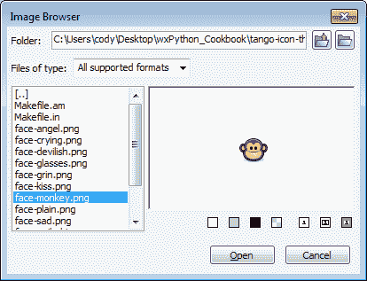

# 第六章：从用户检索信息

在本章中，我们将涵盖：

+   使用`FileDialog`选择文件

+   使用 `FindReplaceDialog` 搜索文本

+   使用 `ImageDialog` 获取图片

+   使用打印对话框

# 简介

能够从用户那里检索信息是任何应用程序的基本部分。对话框是检索用户信息的一种方式；大多数桌面应用程序都使用一些常见的对话框来执行诸如打开、保存和打印文件等任务。

有两种主要的对话框类型：模态对话框和模式对话框。模态对话框是在显示时阻止并禁用与其父窗口或应用程序中所有其他窗口（在应用程序模态对话框的情况下）的交互的对话框。模态对话框用于程序在继续其下一个任务之前必须从用户那里检索数据的情况。另一方面，模式对话框的行为类似于框架。当显示模式对话框时，应用程序中的其他窗口仍然可访问。当关闭模式对话框时，通常会将一个事件发送到其父窗口，以通知它对话框已关闭。

wxPython 提供了许多内置对话框，可以满足几乎所有常见情况的需求。因此，让我们通过本章中的食谱来查看一些这些常见对话框的实际应用。

# 使用 FileDialog 选择文件

允许用户打开和保存文件是许多应用最基本的功能之一。为了提供这一功能，通常需要赋予用户选择打开哪些文件、为新文件命名以及保存新文件的位置的能力。`FileDialog` 可以在您的应用中扮演这一角色。本食谱创建了一个简单的文本编辑应用，可以打开和保存文本文件，以展示如何使用 `FileDialog`。

## 如何做到这一点...

在这里，我们将创建一个完整的文本编辑器应用程序：

```py
import wx

class FileEditorApp(wx.App):
    def OnInit(self):
        self.frame = FileEditorFrame(None,
                                     title="File Editor")
        self.frame.Show()
        return True

```

我们的主要应用程序窗口在此定义，并包括一个框架（Frame）、文本控件（TextCtrl）和菜单栏（MenuBar）：

```py
class FileEditorFrame(wx.Frame):
    def __init__(self, parent, *args, **kwargs):
        super(FileEditorFrame, self).__init__(*args, **kwargs) 

        # Attributes
        self.file = None
        style = style=wx.TE_MULTILINE|wx.TE_RICH2
        self.txtctrl = wx.TextCtrl(self, style=style)

        # Setup
        self._SetupMenus()

        # Layout
        sizer = wx.BoxSizer(wx.VERTICAL)
        sizer.Add(self.txtctrl, 1, wx.EXPAND)
        self.SetSizer(sizer)

        # Event Handlers
        self.Bind(wx.EVT_MENU, self.OnOpen, id=wx.ID_OPEN)
        self.Bind(wx.EVT_MENU, self.OnSave, id=wx.ID_SAVE)
        self.Bind(wx.EVT_MENU, self.OnSave, id=wx.ID_SAVEAS)
        self.Bind(wx.EVT_MENU, self.OnExit, id=wx.ID_EXIT)
        self.Bind(wx.EVT_CLOSE, self.OnExit)

    def _SetupMenus(self):
        """Make the frames menus"""
        menub = wx.MenuBar()
        fmenu = wx.Menu()
        fmenu.Append(wx.ID_OPEN, "Open\tCtrl+O")
        fmenu.AppendSeparator()
        fmenu.Append(wx.ID_SAVE, "Save\tCtrl+S")
        fmenu.Append(wx.ID_SAVEAS, "Save As\tCtrl+Shift+S")
        fmenu.AppendSeparator()
        fmenu.Append(wx.ID_EXIT, "Exit\tCtrl+Q")
        menub.Append(fmenu, "File")
        self.SetMenuBar(menub)

```

这里是我们在 Frame 的 MenuBar 上添加的`MenuItems`的事件处理器。这些事件处理器主要用于将任务委托给执行用户请求的操作的方法。

```py
    #---- Event Handlers ----#

    def OnOpen(self, event):
        """Handle Open"""
        if event.GetId() == wx.ID_OPEN:
            self.DoOpen()
        else:
            event.Skip()

    def OnSave(self, event):
        """Handle Save/SaveAs"""
        evt_id = event.GetId()
        if evt_id in (wx.ID_SAVE,
                      wx.ID_SAVEAS):
            if self.file:
                self.Save(self.file)
            else:
                self.DoSaveAs()
        else:
            event.Skip()

    def OnExit(self, event):
        """Handle window close event"""
        # Give warning about unsaved changes
        if self.txtctrl.IsModified():
            message = ("There are unsaved changes.\n\n"
                       "Would you like to save them?")
            style = wx.YES_NO|wx.ICON_WARNING|wx.CENTRE
            result = wx.MessageBox(message,
                                   "Save Changes?",
                                   style=style)
            if result == wx.YES:
                if self.file is None:
                    self.DoSaveAs()
                else:
                    self.Save(self.file)
        event.Skip()

    #---- End Event Handlers ----#

    #---- Implementation ----#

```

在此，在`DoOpen`方法中，我们首次使用`FileDialog`的`OPEN`模式，允许用户选择他们希望打开的文件：

```py
    def DoOpen(self):
        """Show file open dialog and open file"""
        wildcard = "Text Files (*.txt)|*.txt"
        dlg = wx.FileDialog(self,
                            message="Open a File",
                            wildcard=wildcard,
                            style=wx.FD_OPEN)
        if dlg.ShowModal() == wx.ID_OK:
            path = dlg.GetPath()
            with open(path, "rb") as handle:
                text = handle.read()
                self.txtctrl.SetValue(text)
                self.file = path
        dlg.Destroy()

```

在 `DoSaveAs` 中，我们看到了 `FileDialog` 的第二次使用，通过以 `SAVE` 模式创建对话框，允许用户选择保存文件的位置。

```py
    def DoSaveAs(self):
        """Show SaveAs dialog"""
        wildcard = "Text Files (*.txt)|*.txt"
        dlg = wx.FileDialog(self,
                            message="Save As",
                            wildcard=wildcard,
                            style=wx.FD_SAVE
                                  |wx.FD_OVERWRITE_PROMPT)
        if dlg.ShowModal() == wx.ID_OK:
            path = dlg.GetPath()
            self.Save(path)
            self.file = path
        dlg.Destroy()

    def Save(self, path):
        """Save the file"""
        with open(path, "wb") as handle:
            text = self.txtctrl.GetValue()
            handle.write(text)
            self.txtctrl.SetModified(False)

    #---- End Implementation ----#

#---- Main Execution ----#
if __name__ == "__main__":
    app = FileEditorApp(False)
    app.MainLoop()

```

## 它是如何工作的...

只为了提供一个感觉，看看你能在 wxPython 中多快地创建一个可用的应用程序，让我们来看看上面的配方。大约 100 行代码，我们就基本实现了一个 Windows 记事本克隆版。由于这个配方是关于`FileDialog`的，我们就专注于我们的文本编辑应用程序的`DoOpen`和`DoSaveAs`方法，看看它是如何工作的。

`FileDialog` 有两种基本模式：打开和保存。对话框的模式取决于它创建时使用的样式标志。我们的 `DoOpen` 方法使用 `FD_OPEN` 样式标志来创建它，这使得它处于打开模式。打开模式与保存模式的不同之处在于，它只允许你选择一个文件，而不能输入名称来创建一个新的文件。

在我们在这个应用程序中使用的两个`FileDialog`中，我们都使用了相同的可选参数来创建它。`wildcards`参数接受一个特殊格式的字符串来指定对话框中的文件过滤器列表。这个字符串必须按照以下格式进行格式化：

```py
“All Files (*)|*|Text Files (*.txt;*.in)|*.txt;*.in”

```

该字符串中的字段解释如下：

```py
Description1|wildcard1|Description2|wildcard1;wildcard2

```

每个字段都是一个描述，后面跟着管道字符作为分隔符，然后是`wx.ID_OK`通配符来与该描述关联。多个通配符由分号分隔。

一旦设置了对话框，其使用方法非常简单。只需使用 `ShowModal` 来显示它。然后，如果用户确认关闭它，我们只需调用对话框的 `GetPath` 方法，以便获取用户在对话框中选择的或输入的路径。

## 还有更多...

`FileDialog`的构造函数接受多个参数以自定义其行为；有关如何设置`FileDialog`的更多信息，请参阅下文。

### 默认路径

`FileDialog`有几个我们应用中没有使用的额外参数，可以用来自定义其初始状态。第一个是`defaultDir`参数，它接受一个目录路径作为值。这个路径必须存在，并且将确保对话框以该目录选中时显示。另一个额外的参数是`defaultFile`，它接受一个文件名作为值。这将被设置为对话框文件名字段的默认值。

### 样式标志

样式标志及其描述如下表所示：

| 样式标志 | 描述 |
| --- | --- |
| `wx.FD_DEFAULT_STYLE` | 与 `wx.FD_OPEN` 相同 |
| `wx.FD_OPEN` | 创建为打开对话框。不能与 `wx.FD_SAVE` 结合使用。 |
| `wx.FD_SAVE` | 创建一个保存对话框。不能与 `wx.FD_OPEN` 结合使用。 |
| `wx.FD_OVERWRITE_PROMPT` | 确认路径已存在时的提示。仅适用于保存对话框。 |
| `wx.FD_FILE_MUST_EXIST` | 允许用户仅选择实际存在的文件。仅适用于打开对话框。 |
| `wx.FD_MULTIPLE` | 允许多个文件被选中。仅适用于打开对话框。应使用对话框的`GetPaths`方法来获取选中路径的列表。 |
| `wx.FD_PREVIEW` | 显示所选文件的预览。 |
| `wx.FD_CHANGE_DIR` | 将当前工作目录更改为用户选择文件的位置。如果不使用`defaultDir`参数，下次打开对话框时，它将打开到最后一次使用的位置。 |

## 参见

+   第一章中的*使用库存 ID*配方，在*使用 wxPython 入门*中解释了内置 ID 的用法。

+   第二章中的“*处理事件*”食谱涵盖了事件处理的基本知识。

+   第三章中的 *添加菜单和菜单栏* 菜谱，*用户界面基本构建块* 讨论了如何将菜单添加到框架中。

# 使用 FindReplaceDialog 搜索文本

`FindReplaceDialog` 是一个常见的对话框，用于从用户那里获取信息以便在应用程序中执行查找和替换操作。`FindReplaceDialog` 总是作为一个无模式对话框使用，当其按钮被点击时，会发出事件通知父窗口用户希望执行的操作。本食谱将扩展之前的食谱（`FileDialog`），展示如何使用 `FindReplaceDialog` 将查找和替换功能添加到应用程序中。

## 如何做到这一点...

在这里，我们将展示我们如何通过`FindReplaceDialog:`对`FileEditorFrame`进行子类化以添加查找和替换功能：

```py
import wx
# FileDialog Recipe sample module
import filedialog

class FindReplaceEditorFrame(filedialog.FileEditorFrame):
    def __init__(self, parent, *args, **kwargs):
        super(FindReplaceEditorFrame, self).__init__(*args,
                                                     **kwargs)

        # Attributes
        self.finddlg = None
        self.finddata = wx.FindReplaceData()

        # Setup
        menub = self.GetMenuBar()
        editmenu = wx.Menu()
        editmenu.Append(wx.ID_FIND, "Find\tCtrl+F")
        editmenu.Append(wx.ID_REPLACE, "Replace\tCtrl+R")
        menub.Append(editmenu, "Edit")

        # Event Handlers
        self.Bind(wx.EVT_MENU,
                  self.OnFindMenu,
                  id=wx.ID_FIND)
        self.Bind(wx.EVT_MENU,
                  self.OnFindMenu,
                  id=wx.ID_REPLACE)
        self.Bind(wx.EVT_FIND, self.OnFind)
        self.Bind(wx.EVT_FIND_NEXT, self.OnFind)
        self.Bind(wx.EVT_FIND_REPLACE, self.OnReplace)
        self.Bind(wx.EVT_FIND_REPLACE_ALL, self.OnReplaceAll)
        self.Bind(wx.EVT_FIND_CLOSE, self.OnFindClose)

```

此方法是一个辅助方法，根据用户从菜单中选择的行为，以正确的模式创建`FindReplaceDialog`：

```py
    def _InitFindDialog(self, mode):
        if self.finddlg:
            self.finddlg.Destroy()

        style = (wx.FR_NOUPDOWN
                 |wx.FR_NOMATCHCASE
                 |wx.FR_NOWHOLEWORD)
        if mode == wx.ID_REPLACE:
            style |= wx.FR_REPLACEDIALOG
            title = "Find/Replace"
        else:
            title = "Find"
        dlg = wx.FindReplaceDialog(self,
                                   self.finddata,
                                   title,
                                   style)
        self.finddlg = dlg

    # ---- Event Handlers ----#

```

这个第一个事件处理器用于处理当选择菜单项时的事件，并将用于创建和显示相应的`FindReplaceDialog:`版本：

```py
    def OnFindMenu(self, event):
        evt_id = event.GetId()
        if evt_id in (wx.ID_FIND, wx.ID_REPLACE):
            self._InitFindDialog(evt_id)
            self.finddlg.Show()
        else:
            event.Skip()

```

接下来的四个事件处理器处理由`FindReplaceDialog`在用户操作后生成的事件：

```py
    def OnFind(self, event):
        """Find text"""
        findstr = self.finddata.GetFindString()
        if not self.FindString(findstr):
            wx.Bell() # beep at the user for no match

    def OnReplace(self, event):
        """Replace text"""
        rstring = self.finddata.GetReplaceString()
        fstring = self.finddata.GetFindString()
        cpos = self.GetInsertionPoint()
        start, end = cpos, cpos
        if fstring:
            if self.FindString(fstring):
                start, end = self.txtctrl.GetSelection()
        self.txtctrl.Replace(start, end, rstring)

    def OnReplaceAll(self, event):
        """Do a replace all"""
        rstring = self.finddata.GetReplaceString()
        fstring = self.finddata.GetFindString()
        text = self.txtctrl.GetValue()
        newtext = text.replace(fstring, rstring)
        self.txtctrl.SetValue(newtext)

    def OnFindClose(self, event):
        if self.finddlg:
            self.finddlg.Destroy()
            self.finddlg = None

    #---- End Event Handlers ----#

    #---- Implementation ----#

```

最后，这里有一个在`TextCtrl`中搜索给定字符串并设置选择的非常简单的方法：

```py
    def FindString(self, findstr):
        """Find findstr in TextCtrl and set selection"""
        text = self.txtctrl.GetValue()
        csel = self.txtctrl.GetSelection()
        if csel[0] != csel[1]:
            cpos = max(csel)
        else:
            cpos = self.txtctrl.GetInsertionPoint()

        if cpos == self.txtctrl.GetLastPosition():
            cpos = 0

        # Do a simple case insensitive search 
        # to find the next match
        text = text.upper()
        findstr = findstr.upper()
        found = text.find(findstr, cpos)
        if found != -1:
            end = found + len(findstr)
            self.txtctrl.SetSelection(end, found)
            self.txtctrl.SetFocus()
            return True
        return False

```

运行前面的代码将会显示如下窗口：


## 它是如何工作的...

在这个菜谱中，我们使用了在上一道菜谱中创建的`FileEditorFrame`类，并通过使用`FindReplaceDialog`扩展了其查找和替换功能。因此，让我们通过查看我们添加到这个类中的内容，从上到下了解我们是如何利用`FindReplaceDialog`的。

在我们的 `FindReplaceEditorFrame` 类的 `__init__` 方法中，我们添加了两个实例属性，`finddlg` 和 `finddata`。由于 `FindReplaceDialog` 是非模态的，我们需要在我们的类中跟踪它，以便我们可以在稍后适当地清理它，确保它在创建时将被分配给 `finddlg` 属性。第二个属性 `finddata` 保存了对 `FindReplaceData` 的引用，该数据用于初始化对话框，以及用于在对话框和其父窗口之间传递数据。我们保留对这个项目的引用有两个原因，首先，它允许方便地访问对话框的标志和用户输入的查找和替换字段字符串，其次，通过每次使用相同的 `FindReplaceData` 对象，对话框将使用用户上次使用时相同的设置进行初始化。在 `__init__` 中需要注意的最后一件事是事件绑定：我们将五个 `FindReplaceDialog` 可以在用户与之交互时发出的事件绑定到它。

下一个新方法是 `_InitFindDialog` 方法。这个方法是我们用来响应 **查找** 或 **替换** 菜单项事件以初始化 `FindReplaceDialog` 的。由于我们的应用程序只将支持简单的单向、不区分大小写的搜索，我们使用适当的样式标志禁用了对话框中的所有额外选项。然后，如果我们处于替换模式，我们简单地使用 `FR_REPLACEDIALOG` 标志创建对话框，如果不处于替换模式，则不使用该标志，最后将新的对话框实例分配给我们的 `finddlg` 属性。

下一个需要查看的部分是我们的 `FindReplaceDialog` 事件处理器。这里我们处理用户通过对话框发起的请求操作。`OnFind` 处理用户在对话框中点击 **查找** 或 **查找下一个** 按钮的情况。在这里，我们首先通过使用我们的 `finddata` 属性来访问它，获取到对话框中输入的字符串。然后我们在基类的 `TextCtrl` 文本中进行简单搜索，如果找到匹配项则选择它，如果没有找到匹配项则使用 `wx.Bell` 使计算机对用户发出蜂鸣声。

`OnReplace` 方法在点击 `FindReplaceDialog` 中的 `Replace` 按钮时被调用。在这里，我们从 `FindReplaceData` 中获取输入的查找和替换字符串。然后我们尝试找到匹配项，并用输入的替换字符串替换该匹配项。`OnReplaceAll` 方法在点击对话框的 `Replace All` 按钮时被调用，它基本上与 `OnReplace` 做相同的事情，但将操作应用于 `TextCtrl` 文本中的所有匹配项。

最后的事件处理程序是 `OnFindClose`。当用户关闭 `FindReplaceDialog` 时会调用此函数。我们需要处理这个事件，以便通过调用其上的 `Destroy` 方法来清理对话框。就这样。现在我们有一个具有查找和替换功能文本编辑器应用程序了！

## 还有更多...

为了简化，这个配方禁用了对话框的额外查找选项。当在对话框中选择这些选项时，可以通过使用`FindReplaceData`对象来检查它们，就像查找和替换字符串一样。它将在`GetFlags`返回的值中设置所选选项的标志，这是一个`FindReplaceData`标志的位掩码。由于这些标志和对话框样式标志的命名方式，了解它们各自是什么可能会有些困惑，因此请参考以下两个表格来区分这两组不同但名称相似的标志集。

### FindReplaceDialog 样式标志

这些标志是应该传递给对话框构造函数的样式参数的标志：

| Flags | 描述 |
| --- | --- |
| `wx.FR_NOMATCHCASE` | 禁用“区分大小写”复选框 |
| `wx.FR_NOUPDOWN` | 禁用“上”和“下”单选按钮 |
| `wx.FR_NOWHOLEWORD` | 禁用“全字”复选框 |
| `wx.FR_REPLACEDIALOG` | 在替换模式下创建对话框 |

### FindReplaceData 标志

以下标志是可以在`FindReplaceData`中设置的标志，用于设置对话框的初始状态以及识别用户选择的查找偏好。

| 标志 | 描述 |
| --- | --- |
| `wx.FR_DOWN` | “向下”单选按钮被选中 |
| `wx.FR_MATCHCASE` | “匹配大小写”复选框被选中 |
| `wx.FR_WHOLEWORD` | “全词”复选框被选中 |

## 参见

+   请参阅*使用 FileDialog 选择文件*的配方，以了解此配方扩展的基本示例。

+   第二章中的*理解事件传播*配方，*响应事件*包含了更多关于事件如何传递到不同窗口的信息。

# 使用 ImageDialog 获取图片

`ImageDialog` 是由 `wx.lib.imagebrowser` 模块提供的一个自定义对话框类。它在目的上与默认的 `FileDialog` 类似，但专门用于允许用户选择和预览图像。本菜谱展示了如何使用此对话框检索用户选择的图像并将其加载到 `StaticBitmap` 中，以便在应用程序的主窗口中显示。

## 如何做到这一点...

在这里，我们将创建一个非常简单的图片查看器应用程序，允许用户使用 ImageDialog 选择要查看的图片：

```py
import wx
import wx.lib.imagebrowser as imagebrowser

class ImageDialogApp(wx.App):
    def OnInit(self):
        self.frame = ImageDialogFrame(None,
                                       title="ImageDialog")
        self.frame.Show()
        return True

class ImageDialogFrame(wx.Frame):
    def __init__(self, parent, *args, **kwargs):
        super(ImageDialogFrame, self).__init__(*args, 
                                               **kwargs)wx.Frame.__init__(self, parent, *args, **kwargs)

        # Attributes
        self.panel = ImageDialogPanel(self)

class ImageDialogPanel(wx.Panel):
    def __init__(self, parent, *args, **kwargs):
        super(ImageDialogPanel, self).__init__(*args, 
                                               **kwargs)wx.Panel.__init__(self, parent, *args, **kwargs)

        # Attributes
        self.lastpath = None
        self.bmp = wx.StaticBitmap(self)
        self.btn = wx.Button(self, label="Choose Image")

        # Layout
        vsizer = wx.BoxSizer(wx.VERTICAL)
        hsizer = wx.BoxSizer(wx.HORIZONTAL)
        vsizer.Add(self.bmp, 0, wx.ALIGN_CENTER)
        vsizer.AddSpacer((5, 5))
        vsizer.Add(self.btn, 0, wx.ALIGN_CENTER)
        hsizer.AddStretchSpacer()
        hsizer.Add(vsizer, 0, wx.ALIGN_CENTER)
        hsizer.AddStretchSpacer()
        self.SetSizer(hsizer)

        # Event Handlers
        self.Bind(wx.EVT_BUTTON, self.OnShowDialog, self.btn)

    def OnShowDialog(self, event):
        # Create the dialog with the path cached
        # from the last time it was opened
        dlg = imagebrowser.ImageDialog(self, self.lastpath)
        if dlg.ShowModal() == wx.ID_OK:
            # Save the last used path
            self.lastpath = dlg.GetDirectory()
            imgpath = dlg.GetFile()
            bitmap = wx.Bitmap(imgpath)
            if bitmap.IsOk():
                self.bmp.SetBitmap(bitmap)
                self.Layout()
                self.bmp.Refresh()
        dlg.Destroy()

if __name__ == '__main__':
    app = ImageDialogApp(False)
    app.MainLoop()

```

运行上一段代码并点击选择图片按钮，将会显示以下对话框：



## 它是如何工作的...

在这个菜谱中，我们创建了一个简单的图像查看器应用程序，允许用户使用`ImageDialog`选择计算机硬盘上的图像，并在应用程序窗口中显示该图像。

这个应用程序遵循了大多数简单应用程序的常见模式。因此，让我们详细看看我们是如何使用`ImageDialog`的。首先，我们必须导入`wx.lib.imagebrowser`模块，因为`ImageDialog`不是标准 wx 模块的一部分。在我们的`ImageDialogFrame`类中，我们添加了三个实例属性。第一个是用来保存`ImageDialog`上次使用的路径。我们这样做是为了提高应用程序的可用性，以便我们可以在用户下次打开应用程序时打开对话框到他们上次使用的最后一个路径。第二个属性是一个`StaticBitmap`对象，我们将使用它来显示用户通过`ImageDialog`选择的图像。请注意，我们在这个例子中使用了`StaticBitmap`以简化示例。为了更好地支持更大尺寸的图像，最好是我们自己将图像绘制在`Panel`上。这种方法将在第八章，*屏幕绘图*这一主题中介绍。最后一个属性只是一个按钮，它将用来触发显示`ImageDialog`的事件。

这个应用程序遵循了大多数简单应用程序的常见模式。因此，让我们详细看看我们是如何使用`ImageDialog`的。首先，我们必须导入`wx.lib.imagebrowser`模块，因为`ImageDialog`不是标准 wx 模块的一部分。在我们的`ImageDialogFrame`类中，我们添加了三个实例属性。第一个是用来保存`ImageDialog`上次使用的路径。我们这样做是为了提高应用程序的可用性，以便我们可以在用户下次打开应用程序时打开对话框到他们上次使用的最后一个路径。第二个属性是一个`StaticBitmap`对象，我们将使用它来显示用户通过`ImageDialog`选择的图像。请注意，我们在这个例子中使用了`StaticBitmap`以简化示例。为了更好地支持更大尺寸的图像，最好是我们自己将图像绘制在`Panel`上。这种方法将在第八章，*屏幕绘图*这一主题中介绍。最后一个属性只是一个按钮，它将被用来触发显示`ImageDialog`的事件。

在本食谱中，我们的 `OnShowDialog` 方法创建 `ImageDialog` 并将其初始化为上次使用的路径。第一次使用时，它将是 None，默认为当前工作目录。然后显示对话框，以便用户导航并选择要显示的图像。如果他们点击对话框的 **打开** 按钮，对话框将返回 `wx.ID_OK`。在此阶段，我们首先获取并保存对话框最后所在的目录引用，以便下次显示对话框时可以恢复它。然后剩下的就是创建位图并调用 `StaticBitmap` 的 `SetBitmap` 方法来更改显示的图像。之后，必须调用 `Panel` 上的 `Layout`，以确保调整器可以适应新的 `Bitmap` 的大小，然后我们最终调用 `StaticBitmap` 上的 `Refresh` 来确保它被完全重绘。

## 还有更多...

在当前版本的 `ImageDialog` 中，唯一可用的其他选项是能够更改支持的文件过滤器列表。这可以通过向对话框的 `ChangeFileTypes` 方法传递一个包含文件类型描述和通配符字符串的元组列表来实现。

```py
dlg.ChangeFileTypes([('png, '*.png'), ('jpeg', '*.jpg')])

```

## 参见

+   第一章中的 *使用位图* 菜单，在 *wxPython 入门* 部分提供了使用位图和 `StaticBitmap` 类的额外示例。

# 使用打印对话框

将打印支持添加到应用程序可能是一项艰巨的任务，因为需要处理许多任务。这包括选择和配置打印机、将屏幕上的演示文稿转换为纸张，以及最终将数据发送到打印机。

在 wxPython 中，有三个与打印相关的对话框类：`PageSetupDialog`、`PreviewFrame`和`Printer`类。除了这些类之外，还有一些必须与这些对话框一起使用的支持类，以便将打印支持添加到应用程序中。本菜谱展示了如何使用 wx 打印框架的一些基本知识，通过创建一个封装三个打印对话框使用的类，允许应用程序打印`Bitmap`。

## 如何做到这一点...

为了简化并压缩在应用程序中支持打印所需的各种不同步骤，我们将首先定义一个类，将不同的任务封装成几个简单的调用方法：

```py
class BitmapPrinter(object):
    """Manages PrintData and Printing"""
    def __init__(self, parent):
        """Initializes the Printer
        @param parent: parent window
        """
        super(BitmapPrinter, self).__init__()

        # Attributes
        self.parent = parent
        self.print_data = wx.PrintData()

    def CreatePrintout(self, bmp):
        """Creates a printout object
        @param bmp: wx.Bitmap
        """
        assert bmp.IsOk(), "Invalid Bitmap!"
        data = wx.PageSetupDialogData(self.print_data)
        return BitmapPrintout(bmp, data)

```

`PageSetup` 方法处理打印机设置对话框的显示，并将设置存储在 `print_data` 属性中：

```py
    def PageSetup(self):
        """Show the PrinterSetup dialog"""
        # Make a copy of our print data for the setup dialog
        dlg_data = wx.PageSetupDialogData(self.print_data)
        print_dlg = wx.PageSetupDialog(self.parent, dlg_data)
        if print_dlg.ShowModal() == wx.ID_OK:
            # Update the printer data with the changes from
            # the setup dialog.
            newdata = dlg_data.GetPrintData()
            self.print_data = wx.PrintData(newdata)
            paperid = dlg_data.GetPaperId()
            self.print_data.SetPaperId(paperid)
        print_dlg.Destroy()
)

```

在预览中，我们创建`PrintPreview`对话框以预览打印输出将呈现的样子：

```py
    def Preview(self, bmp):
        """Show the print preview
        @param bmp: wx.Bitmap
        """
        printout = self.CreatePrintout(bmp)
        printout2 = self.CreatePrintout(bmp)
        preview = wx.PrintPreview(printout, printout2,
                                  self.print_data)
        preview.SetZoom(100)
        if preview.IsOk():
            pre_frame = wx.PreviewFrame(preview,
                                        self.parent,
                                        "Print Preview")
            # The default size of the preview frame
            # sometimes needs some help.
            dsize = wx.GetDisplaySize()
            width = self.parent.GetSize()[0]
            height = dsize.GetHeight() - 100
            pre_frame.SetInitialSize((width, height))
            pre_frame.Initialize()
            pre_frame.Show()
        else:
            # Error
            wx.MessageBox("Failed to create print preview",
                          "Print Error",
                          style=wx.ICON_ERROR|wx.OK)

```

最后，在`Print`方法中，我们显示`Printer`对话框，允许用户请求打印一个`Bitmap`，并将其发送到打印机进行打印：

```py
    def Print(self, bmp):
        """Prints the document"""
        pdd = wx.PrintDialogData(self.print_data)
        printer = wx.Printer(pdd)
        printout = self.CreatePrintout(bmp)
        result = printer.Print(self.parent, printout)
        if result:
            # Store copy of print data for future use
            dlg_data = printer.GetPrintDialogData()
            newdata = dlg_data.GetPrintData()
            self.print_data = wx.PrintData(newdata)
        elif printer.GetLastError() == wx.PRINTER_ERROR:
            wx.MessageBox("Printer error detected.",
                          "Printer Error",
                          style=wx.ICON_ERROR|wx.OK)
        printout.Destroy()

```

在这里，我们将实现用于打印 `Bitmaps` 的 `Printout` 对象。`Printout` 对象是负责管理打印任务并将位图绘制到打印机设备上下文的对象：

```py
class BitmapPrintout(wx.Printout):
    """Creates an printout of a Bitmap"""
    def __init__(self, bmp, data):
        super(BitmapPrintout, self).__init__()wx.Printout.__init__(self)

        # Attributes
        self.bmp = bmp
        self.data = data

    def GetPageInfo(self):
        """Get the page range information"""
        # min, max, from, to # we only support 1 page
        return (1, 1, 1, 1)

    def HasPage(self, page):
        """Is a page within range"""
        return page <= 1

    def OnPrintPage(self, page):
        """Scales and Renders the bitmap
        to a DC and prints it
        """
        dc = self.GetDC() # Get Device Context to draw on

        # Get the Bitmap Size
        bmpW, bmpH = self.bmp.GetSize()

        # Check if we need to scale the bitmap to fit
        self.MapScreenSizeToPageMargins(self.data)
        rect = self.GetLogicalPageRect()
        w, h = rect.width, rect.height
        if (bmpW > w) or (bmpH > h):
            # Image is large so apply some scaling
            self.FitThisSizeToPageMargins((bmpW, bmpH),
                                          self.data)
            x, y = 0, 0
        else:
            # try to center it
            x = (w - bmpW) / 2
            y = (h - bmpH) / 2

        # Draw the bitmap to DC
        dc.DrawBitmap(self.bmp, x, y)

        return True

```

## 它是如何工作的...

`BitmapPrinter` 类封装了应用程序可能需要支持的三个主要打印相关任务：打印机设置、打印预览和打印。这个类是想要允许打印 `Bitmaps` 的应用程序使用的接口，用于其所有打印需求。应用程序所需的一切只是一个 `Bitmap`，而它需要做的只是使用这三个方法之一：`PageSetup`、`Preview` 和 `Print`。那么，让我们来看看这个类和这三个方法是如何工作的。

构造函数接受一个参数用于父窗口。这将被用作所有对话框的父窗口。这通常是一个应用程序的主窗口。我们还在构造函数中创建并存储了一个`PrintData`对象的引用。所有打印对话框都以一种或另一种形式使用`PrintData`。这允许我们在用户使用其中一个对话框时保存用户可能做出的任何打印配置更改。

`PageSetup` 用于创建和显示 `PageSetupDialog`。要使用 `PageSetupDialog`，我们首先通过将其构造函数传递我们的 `PrintData` 对象来创建一个 `PageSetupDialogData` 对象，这样它将使用我们数据对象中可能已经持久化的任何设置。然后我们只需通过传递 `PageSetupDialogData` 对象来创建对话框。如果对话框通过“确定”按钮关闭，我们随后从对话框中获取 `PrintData` 并制作一个副本以存储。制作副本非常重要，因为当 `PageSetupDialog` 被销毁时，它将删除数据。

`预览`功能会创建打印输出的预览效果，并通过`PreviewFrame`显示。`PreviewFrame`需要一个`PrintPreview`对象。要创建`PrintPreview`对象，必须传入两个`Printout`对象和一个`PrintData`对象。`Printout`对象负责实际渲染打印机将要打印的内容。当我们到达`BitmapPrintout`类时，我们将回到关于`Printout`如何工作的细节。第一个`Printout`对象用于`PreviewFrame`，第二个对象用于用户点击`PreviewFrame`的打印按钮时的实际打印。

`Print` 函数创建一个 `Printer` 对象，当调用其 `Print` 方法时将显示打印机对话框。与 `Preview` 对象类似，`Printer` 对象是在一些 `PrintData` 和一个 `Printout` 对象的实例的基础上创建的。当点击打印对话框中的打印按钮时，它将使用 `Printout` 对象来告诉物理打印机在纸上绘制什么内容。

`BitmapPrintout` 类实现了用于一次性将单个位图打印到一张纸上的 `Printout` 对象。`Printout` 对象必须始终被子类化，以便实现需要打印的数据的应用特定要求，因为基类仅提供了一个接口，该接口在子类中需要重写虚拟方法。在我们的类中，我们重写了以下三个方法：`GetPageInfo`、`HasPage` 和 `OnPrintPage`。前两个方法用于返回将要打印的页数信息；由于我们只支持一页，这些在这个菜谱中相当简单。`OnPrintPage` 方法是实际将绘图绘制到打印机设备上下文的方法。此方法被调用以绘制将要打印的每一页。

通过调用`GetDC`函数返回的设备上下文对象来绘制`Printout`。设备上下文的使用在第八章 *屏幕绘图*中有详细说明，因此为了简化问题，我们在这里只是将画布计算的缩放比例设置为尝试将图像居中在纸张上，然后使用 DC 的`DrawBitmap`方法将`Bitmap`绘制到设备上下文中。关于`BitmapPrinter`类的实际应用示例，请参阅本章附带的示例代码。

## 还有更多...

以下包含有关打印框架的一些附加信息。

### 打印输出

`wx.Printout` 对象拥有许多其他可覆盖的方法，这些方法可能对不同类型的文档有所帮助。下表是这些其他接口方法的一些参考。

| 接口方法 | 描述 |
| --- | --- |
| `OnBeginDocument(start, end)` | 在打印作业中每个文档副本的开始时调用。如果此方法被重写，必须在其中调用基类的该方法。 |
| `OnEndDocument()` | 在打印作业中打印每份文档的末尾被调用。如果此方法被重写，必须在其中调用基类方法。 |
| `OnBeginPrinting()` | 在打印作业开始时只调用一次。 |
| `OnEndPrinting()` | 在打印作业结束时只调用一次。 |
| `OnPreparePrinting()` | 在使用 `Printout` 对象之前被调用。通常在这里进行关于诸如文档页数等事项的计算。 |

### Bug notice

在 wxPython 2.8 中存在一个 bug，无法从`PageSetup`或`Print`对话框的`PrintData`中检索页面方向（纵向或横向）。

## 参见

+   第一章中的*理解继承限制*配方，*wxPython 入门*包含了如何覆盖 wxPython 类中虚拟方法的详细解释。

+   第八章中的*屏幕绘图*配方，*屏幕绘图*讨论了设备上下文（DCs）及其绘图命令的使用。
