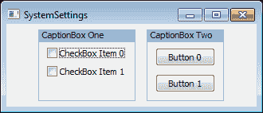
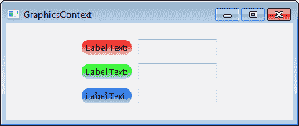

# 第八章. 将绘图输出到屏幕

在本章中，我们将涵盖：

+   屏幕绘图

+   绘制形状

+   利用 `SystemSettings`

+   使用一个`GraphicsContext`

+   使用 `RendererNative` 绘制

+   减少绘图过程中的闪烁

# 简介

能够在计算机显示上显示对象是 GUI 工具箱最基本的功能之一。在 wxPython 中，对象通过向**设备上下文**（**DC**）发出的绘图命令在显示上显示。在底层，所有控件都表示为绘制在屏幕显示上的位图。设备上下文提供的接口允许自定义控件的外观。当与事件结合使用时，它们也是创建新控件的基础。

这些基础工具打开了许多门和可能性，使得应用设计师能够填补工具箱提供的空白，以满足特定应用的需求。现在工具已经介绍完毕，是时候拿起它并投入使用。

# 屏幕绘图

屏幕上所有可见的窗口都会向设备上下文（通常称为 DC）发出一些绘图命令，以告诉系统在屏幕上显示哪种像素信息。一些控件类，如`wx.Control`、`wx.Window`和`wx.Panel`，允许通过使用`wx.EVT_PAINT`来定义用户对屏幕上绘制内容的控制。本食谱通过创建一个简单的幻灯片小部件来介绍屏幕绘图，该部件将从目录中加载 PNG 或 JPG 文件，然后在屏幕上绘制该图像，并在其下方添加一些标签文本，以显示哪张图像是集合中的。

## 如何做到这一点...

在这里，我们将查看我们的`ImageCanvas`小部件。从其构造函数开始，我们将其`Bind`到`EVT_PAINT`，这样当我们的窗口的一部分被标记为需要重绘时，我们可以从框架中获取回调：

```py
import os
import wx

class ImageCanvas(wx.PyPanel):
    def __init__(self, parent):
        super(SlideShowPanel, self).__init__(parent)

        # Attributes
        self.idx = 0 # Current index in image list
        self.images = list() # list of images found to display

        # Event Handlers
        self.Bind(wx.EVT_PAINT, self.OnPaint)

```

在这里，我们重写`DoGetBestSize`方法，以便根据显示在其中的图像大小调整小部件的大小：

```py
    def DoGetBestSize(self):
        """Virtual override for PyPanel"""
        newsize = wx.Size(0, 0)
        if len(self.images):
            imgpath = self.images[self.idx]
            bmp = wx.Bitmap(imgpath)
            newsize = bmp.GetSize()
            newsize = newsize + (20, 20) # some padding
        else:
            tsize = self.GetTextExtent("No Image!")
            newsize = tsize + (20, 20)

        # Ensure new size is at least 300x300
        return wx.Size(max(300, newsize[0]),
                       max(300, newsize[1]))

```

在这里，在 `OnPaint` 函数中，我们处理 `EVT_PAINT` 事件并创建一个 `PaintDC` 来在面板上绘制当前图像：

```py
    def OnPaint(self, event):
        """Draw the image on to the panel"""
        dc = wx.PaintDC(self) # Must create a PaintDC

        # Get the working rectangle
        rect = self.GetClientRect()

        # Setup the DC
        dc.SetTextForeground(wx.BLACK)

        # Do the drawing
        if len(self.images):
            # Draw the current image
            imgpath = self.images[self.idx]
            bmp = wx.Bitmap(imgpath)
            bsize = bmp.GetSize()
            # Try and center the image
            # Note: assumes image is smaller than canvas
            xpos = (rect.width - bsize[0]) / 2
            ypos = (rect.height - bsize[1]) / 2
            dc.DrawBitmap(bmp, xpos, ypos)
            # Draw a label under the image saying what
            # number in the set it is.
            imgcount = len(self.images)
            number = "%d / %d" % (self.idx+1, imgcount)
            tsize = dc.GetTextExtent(number)
            xpos = (rect.width - tsize[0]) / 2
            ypos = ypos + bsize[1] + 5 # 5px below image
            dc.DrawText(number, xpos, ypos)
        else:
            # Display that there are no images
            font = self.GetFont()
            font.SetWeight(wx.FONTWEIGHT_BOLD)
            dc.SetFont(font)
            dc.DrawLabel("No Images!", rect, wx.ALIGN_CENTER)

```

最后，我们添加了一些客户端代码可以与之交互的方法，以便更改图像并设置图像源目录：

```py
def Next(self):
        """Goto next image"""
        self.idx += 1
        if self.idx >= len(self.images):
            self.idx = 0 # Go back to zero
        self.Refresh() # Causes a repaint

    def Previous(self):
        """Goto previous image"""
        self.idx -= 1
        if self.idx < 0:
            self.idx = len(self.images) - 1 # Goto end
        self.Refresh() # Causes a repaint

    def SetImageDir(self, imgpath):
        """Set the path to where the images are"""
        assert os.path.exists(imgpath)
        # Find all the images in the directory
        self.images = [ os.path.join(imgpath, img)
                        for img in os.listdir(imgpath)
                        if img.lower().endswith('.png') or
                           img.lower().endswith('.jpg') ]
        self.idx = 0

```

## 它是如何工作的...

这相当简单，所以让我们快速浏览一下，看看一切是如何工作的。首先，我们从 `PyPanel` 派生出了我们的 `ImageCanvas` 面板，这样我们就可以访问它的一些虚拟方法。接下来，在构造函数中，我们将我们的绘图处理程序 `Bind` 到 `EVT_PAINT`，这样我们就会收到 `PaintEvent` 通知。

下一个方法，`DoGetBestSize`，是一个虚拟覆盖。当框架需要我们告诉它我们的最佳尺寸时，将会调用此方法。这发生在布局计算时。我们根据当前图像的大小来确定最佳尺寸，但保留一个最小矩形区域 300x300 像素，以确保我们有足够的空间进行操作。

接下来我们来到 `OnPaint`。这里是本菜谱的主要焦点展开的地方。首先要注意的是，我们创建了一个 `PaintDC`。这是一个必须的步骤。如果在 `EVT_PAINT` 处理器中未创建 `PaintDC`，那么在像 Windows 这样的平台上刷新窗口时将会出现错误。`PaintDC` 提供了与 DC 的接口，这将允许我们在屏幕上绘制。

在`OnPaint`中的大部分工作只是计算我们要绘制的内容的位置。我们通过首先获取我们必须工作的矩形来完成这个任务，这个矩形可以通过调用`GetClientRect`简单地返回。从这里开始，如果我们有一些图像要显示，我们会进行一些简单的计算来居中当前图像，然后使用 DC 的`DrawBitmap`方法将我们的`Bitmap`对象绘制到屏幕上。然后我们继续在图像下方绘制一些文本，以显示图像在集合中的编号。为此，我们使用`GetTextExtent`来获取我们的字符串将需要用当前字体绘制的屏幕大小。在没有图像的情况下，我们简单地使用带有`ALIGN_CENTER`标志的 DC 的`DrawLabel`函数在矩形的中间绘制一个警告标签。

为了方便在通过调用 `SetImageDir` 指定的目录中循环浏览图片，我们提供了两种方法：`Next` 和 `Previous`。这些方法只是简单地增加或减少我们在列表中查看的索引，然后调用 `Refresh`。`Refresh` 将导致系统发出一个新的 `PaintEvent`。当这种情况发生时，我们的 `OnPaint` 处理程序将被调用，并将绘制新的图片。请参阅随此配方提供的示例代码，了解如何使用我们的 `ImageCanvas` 小部件构建一个示例应用程序。

## 参见

+   第一章中的 *使用位图* 菜单，在 *wxPython 入门* 一书中讨论了在应用程序中使用位图的基本知识。

+   第一章中的*理解继承限制*配方，*使用 wxPython 入门*解释了`Py`类的用法以及如何重写它们的虚拟方法。

# 绘制形状

除了能够绘制文本和位图之外，DC 组件还能够绘制任意形状和线条。这些基本工具使得创建完全定制的控件和执行诸如绘制图表等任务成为可能。本食谱通过创建一个简单的笑脸控件来探索 `PaintDC` 的这些附加功能。

## 如何做到这一点...

在这里，我们将定义从 PyControl 派生出的简单笑脸控制：

```py
class Smiley(wx.PyControl):
    def __init__(self, parent, size=(50,50)):
        super(Smiley, self).__init__(parent,
                                     size=size,
                                     style=wx.NO_BORDER)

        # Event Handlers
        self.Bind(wx.EVT_PAINT, self.OnPaint)

```

在这里，`OnPaint` 是我们将要在 `PyControl` 的背景上绘制笑脸的地方：

```py
    def OnPaint(self, event):
        """Draw the image on to the panel"""
        dc = wx.PaintDC(self) # Must create a PaintDC

        # Get the working rectangle we can draw in
        rect = self.GetClientRect()

        # Setup the DC
        dc.SetPen(wx.BLACK_PEN) # for drawing lines / borders
        yellowbrush = wx.Brush(wx.Colour(255, 255, 0))
        dc.SetBrush(yellowbrush) # Yellow fill

```

首先，我们将从绘制头部圆圈开始，通过找到控制矩形的中心，并使用 `DrawCircle` 函数绘制一个带有黑色边框的黄色圆圈，使用上面设置的当前笔刷和画笔：

```py
        cx = (rect.width / 2) + rect.x
        cy = (rect.width / 2) + rect.y
        radius = min(rect.width, rect.height) / 2
        dc.DrawCircle(cx, cy, radius)

```

下一步是绘制眼睛。这个笑脸将拥有蓝色、方形的眼眸。为了做到这一点，我们首先计算眼睛的大小为整个面部面积的 1/8，然后将画笔设置为蓝色，接着使用 DC 的`DrawRectangle`方法绘制每只眼睛：

```py
        eyesz = (rect.width / 8, rect.height / 8)
        eyepos = (cx / 2, cy / 2)
        dc.SetBrush(wx.BLUE_BRUSH)
        dc.DrawRectangle(eyepos[0], eyepos[1],
                         eyesz[0], eyesz[1])
        eyepos = (eyepos[0] + (cx - eyesz[0]), eyepos[1])
        dc.DrawRectangle(eyepos[0], eyepos[1],
                         eyesz[0], eyesz[1])

```

最后但同样重要的是在脸上画出微笑。为了做到这一点，我们将画笔颜色设置为黄色，然后使用 DC 的`DrawArc`方法来绘制圆的一部分。由于我们只想使用弧的下半部分作为微笑，所以我们最后画一个黄色的矩形覆盖在切片的上半部分，以遮盖掉楔形：

```py
        dc.SetBrush(yellowbrush)
        startpos = (cx / 2, (cy / 2) + cy)
        endpos = (cx + startpos[0], startpos[1])
        dc.DrawArc(startpos[0], startpos[1],
                   endpos[0], endpos[1], cx, cy)
        dc.SetPen(wx.TRANSPARENT_PEN)
        dc.DrawRectangle(startpos[0], cy,
                         endpos[0] - startpos[0],
                         startpos[1] - cy)

```

## 它是如何工作的...

在这个菜谱中，我们使用了`笔`、`刷子`以及`PaintDC`为我们提供的某些基本绘图程序。让我们来看看我们的`OnPaint`方法，看看一切是如何工作的。

首先，我们开始设置我们的直流绘图工具。我们设置了一支黑色`Pen`，当直流绘制线条时会使用它。然后我们设置了一块黄色`Brush`。`Brush`用于在绘制形状时填充形状内部的区域。接下来，我们开始绘制脸部，它是一个圆形。为此，我们只需要找到我们的绘图区域中心，然后调用带有我们所需的中心点和半径的`DrawCircle`方法。然后直流将使用我们的`Pen`和`Brush`来创建一个带有黑色边框的黄色圆形。

接下来，对于眼睛，我们决定将它们绘制成蓝色方块。因此，我们切换到蓝色`Brush`，并调用`DrawRectangle`例程来绘制方块。此方法的前两个参数是矩形左上角将被绘制的位置。接下来的两个参数是矩形的宽度和高度。

最后一步是绘制微笑，这只是一个简单的弧线。为了执行这一步，我们需要确定弧线的两个端点位置，这些端点是基于我们圆的中心点来确定的。然后我们调用了`DrawArc`方法，这个方法会绘制圆的一部分。因为它绘制的是圆的一部分，所以会有两条从中心点延伸到弧线起始点和结束点的多余线条。为了消除这些线条，我们在它们上方绘制了一个黄色的矩形来擦除它们，只留下构成微笑的弧线。

## 还有更多...

这里是`PaintDC`的基本绘图函数的快速参考。

| 函数 | 描述 |
| --- | --- |
| `DrawArc(x1,y1,x2,y2, xcenter,ycenter)` | 绘制以`(xcenter,ycenter)`为中心，从`(x1,y1)`到`(x2,y2)`的圆弧部分。 |
| `DrawBitmap(bmp,x,y, useMask=False)` | 在位置 `x,y` 绘制位图。 |
| `DrawCheckMark(x,y,width, height)` | 在给定的矩形中绘制勾选标记。 |
| `DrawCircle(x,y,radius)` | 绘制以点 `x,y` 为中心，给定半径的圆。 |
| `DrawEllipse(x,y,width,height)` | 在给定的矩形中绘制椭圆。 |
| `DrawEllipticArc(x,y,w,h, start,end)` | 在给定的矩形中绘制椭圆的弧线。start 和 end 参数是角度，用于指定弧线的起始和结束位置，相对于矩形中的 3 点钟位置。 |
| `DrawIcon(icon, x, y)` | 在 `x,y` 位置绘制图标。 |
| `DrawImageLabel(lbl,bmp,rect, align)` | 在给定的矩形内绘制一个标签和位图，使用给定的对齐标志。 |
| `DrawLabel(text,rect,align)` | 在给定的对齐标志下，在矩形内绘制文本。 |
| `DrawLine(x1,y1,x2,y2)` | 使用当前笔从 `x1,y1` 到 `x2,y2` 绘制一条线。 |
| `DrawPoint(x,y)` | 使用当前笔在 `x,y` 位置绘制一个点。 |
| `DrawPolygon(points,x,y)` | 基于点列表在位置 `x,y` 绘制多边形。 |
| `DrawRectangle(x,y,w,h)` | 在位置 `x,y` 绘制大小为 `w,h` 的矩形。 |
| `DrawRotatedText(text,x,y, angle)` | 在位置 `x,y` 以给定角度旋转绘制文本。 |
| `DrawRoundedRectangle(x,y,w,h, angle)` | 绘制具有圆角的矩形。 |
| `DrawSpline(points)` | 使用点列表绘制样条曲线。 |
| `DrawText(text,x,y)` | 在位置 `x,y` 绘制文本。 |

## 参见

+   请参阅本章中的*屏幕绘图*配方，了解创建和使用`DeviceContext`的基本方法。

# 利用系统设置

`SystemSettings` 对象允许程序查询系统以获取有关默认颜色和字体信息。在创建自定义绘图时，能够了解这些信息非常有帮助，因为它使得使用与原生系统组件相同的颜色和字体成为可能，这样你的自定义控件或窗口装饰就可以融入其中，看起来像是与其他共享同一窗口的原生组件属于一体。在本食谱中，我们将使用 `SystemSettings` 创建一个类似于 `StaticBox` 的自定义控件，但其标题栏类似于 `Frame` 栏的标题栏。

## 如何做到这一点...

对于这个自定义控件，我们再次从 `PyPanel` 派生出来，以便我们可以访问其 `DoGetBestSize` 方法：

```py
class CaptionBox(wx.PyPanel):
    def __init__(self, parent, caption):
        super(CaptionBox, self).__init__(parent,
                                         style=wx.NO_BORDER)

        # Attributes
        self._caption = caption
        self._csizer = wx.BoxSizer(wx.VERTICAL)

        # Setup
        self.__DoLayout()

        # Event Handlers
        self.Bind(wx.EVT_PAINT, self.OnPaint)

    def __DoLayout(self):
        msizer = wx.BoxSizer(wx.HORIZONTAL)
        self._csizer.AddSpacer(12) # extra space for caption
        msizer.Add(self._csizer, 0, wx.EXPAND|wx.ALL, 8)
        self.SetSizer(msizer)

    def DoGetBestSize(self):
        size = super(CaptionBox, self).DoGetBestSize()

        # Compensate for wide caption labels
        tw = self.GetTextExtent(self._caption)[0]
        size.SetWidth(max(size.width, tw+20))
        return size

    def AddItem(self, item):
        """Add a window or sizer item to the CaptionBox"""
        self._csizer.Add(item, 0, wx.ALL, 5)

```

在这里，在我们的 `EVT_PAINT` 处理程序中，我们使用从 `SystemSettings` 单例中检索到的标题颜色，在面板顶部绘制一个简单的标题，并在其余部分绘制一个边框：

```py
    def OnPaint(self, event):
        """Draws the Caption and border around the controls"""
        dc = wx.PaintDC(self)

        # Get the working rectangle we can draw in
        rect = self.GetClientRect()

        # Get the sytem color to draw the caption
        ss = wx.SystemSettings
        color = ss.GetColour(wx.SYS_COLOUR_ACTIVECAPTION)
        txtcolor = ss.GetColour(wx.SYS_COLOUR_CAPTIONTEXT)
        dc.SetTextForeground(txtcolor)

        # Draw the border
        rect.Inflate(-2, -2)
        dc.SetPen(wx.Pen(color))
        dc.SetBrush(wx.TRANSPARENT_BRUSH)
        dc.DrawRectangleRect(rect)

        # Add the Caption
        rect = wx.Rect(rect.x, rect.y,
                       rect.width, 16)
        dc.SetBrush(wx.Brush(color))
        dc.DrawRectangleRect(rect)
        rect.Inflate(-5, 0)
        dc.SetFont(self.GetFont())
        dc.DrawLabel(self._caption, rect, wx.ALIGN_LEFT)

```

## 它是如何工作的...

在这个示例中，我们是从 `PyPanel` 派生出了新的 `CaptionBox` 类。这样做的原因是，这个控件将成为其他控件的容器，而使用 `PyPanel` 将允许使用布局和尺寸管理器来管理控件的布局和尺寸。

作为`__DoLayout`中面板初始布局的一部分，我们在顶部预留了 20 像素的空间，在其余三边各预留了 8 像素的空间，用于标题和边框。这是通过在顶部添加一个间隔符，并在将要用于布局`CaptionBox`子控件`BoxSizer`周围额外添加 8 像素边框来实现的。同时，作为布局管理的一部分，我们重写了`DoGetBestSize`方法，以便处理标题文本宽度超过框子子窗口的情况。当使用这个类时，必须使用其`AddItem`方法来添加其子控件。

现在我们来看看如何绘制控件。在`OnPaint`函数中，我们首先使用`SystemSettings`单例来获取系统定义的标题背景和文本颜色，这将使控件能够适应并匹配在任何主题或操作系统上运行的其它控件。接下来，我们将绘制`Rect`向两边各缩小 2 像素来定义控件的边框。之后，我们只需将画笔设置为标题颜色并调用`DrawRect`来绘制边框。标题栏也是通过在布局中预留的上部空间创建一个较小的矩形，并通过将`Brush`设置为标题颜色来绘制一个实心矩形来类似地绘制的。最后，我们只需在刚刚绘制的矩形上绘制标题文本。请参见以下截图，它显示了两个`CaptionBoxes:`



## 更多内容

除了能够提供颜色外，`SystemSettings` 对象还可以提供系统字体和度量。三个方法 `GetColour`、`GetFont` 和 `GetMetric` 都接受一个索引参数，该参数是 `wx.SYS_*` 常量之一。

## 参见

+   详见本章中关于如何创建和使用设备上下文的*屏幕绘图*配方。

# 使用 GraphicsContext

`GraphicsContext` 是 wxPython2.8 中的一个新特性。它提供了访问平台高级绘图功能的能力。它提供了诸如抗锯齿、浮点精度坐标系、透明度混合、渐变画笔以及一些高级方法等功能。这个示例使用它来创建一个类似于 `StaticText` 的自定义控件，但其背景是渐变填充的药丸形状。

## 如何做到这一点...

与本章中的其他配方类似，我们将从 `PyControl` 中派生我们的新控件，以便我们可以覆盖其 `DoGetBestSize` 方法来调整控件的大小以适应我们的标签：

```py
class PodLabel(wx.PyControl):
    def __init__(self, parent, label, color):
        super(PodLabel, self).__init__(parent,
                                       style=wx.NO_BORDER)

        # Attributes
        self._label = label
        self._color = color

        # Event Handlers
        self.Bind(wx.EVT_PAINT, self.OnPaint)

    def DoGetBestSize(self):
        txtsz = self.GetTextExtent(self._label)
        size = wx.Size(txtsz[0] + 10, txtsz[1] + 6)
        return size

```

这次在 `OnPaint` 中，我们将从我们的 `PaintDC` 创建一个 GCDC，并使用 GCDC 和其 `GraphicsContext:` 进行绘图：

```py
    def OnPaint(self, event):
        """Draws the Caption and border around the controls"""
        dc = wx.PaintDC(self)
        gcdc = wx.GCDC(dc)
        gc = gcdc.GetGraphicsContext()

        # Get the working rectangle we can draw in
        rect = self.GetClientRect()

        # Setup the GraphicsContext
        pen = gc.CreatePen(wx.TRANSPARENT_PEN)
        gc.SetPen(pen)
        rgb = self._color.Get(False)
        alpha = self._color.Alpha() *.2 # fade to transparent
        color2 = wx.Colour(*rgb, alpha=alpha)
        x1, y1 = rect.x, rect.y
        y2 = y1 + rect.height
        gradbrush = gc.CreateLinearGradientBrush(x1, y1,
                                                 x1, y2,
                                                 self._color,
                                                 color2)
        gc.SetBrush(gradbrush)

        # Draw the background
        gc.DrawRoundedRectangle(rect.x, rect.y,
                                rect.width, rect.height,
                                rect.height/2)
        # Use the GCDC to help draw the aa text
        gcdc.DrawLabel(self._label, rect, wx.ALIGN_CENTER)

```

## 它是如何工作的...

为了在`OnPaint`中绘制这个控件，我们使用了`PaintDC`并将其包装在`GCDC`中。`GCDC`是一个内部使用`GraphicsContext`的设备上下文接口。使用这个接口使得在类似使用常规设备上下文的方式中使用`GraphicsContext`成为可能。

当设置`Pen`和`Brush`时，我们使用了一种透明的笔来避免在控件周围绘制边框。使用`GraphicsContext`的`CreateLinearGradientBrush`方法返回的`GraphicsBrush`，可以轻松地用渐变色背景。此方法将创建一个从第一组坐标到第二组坐标绘制渐变的画刷，从第一种颜色开始，逐渐过渡到第二种颜色。在这种情况下，我们的第二种颜色仅在 alpha 级别上有所不同，因此渐变将淡化为半透明，这将显示出其背后的面板。

现在剩下的只是调用 `GraphicsContext` 的 `DrawRoundedRectangle` 方法，绘制一个填充了我们之前定义的渐变的漂亮的药丸形背景。然后剩下的就是绘制背景上的标签文本。为此，我们使用了 `GCDC` 的 `DrawLabel` 方法，它就像 `PaintDC` 的 `DrawLabel` 方法一样，但在底层使用 `GraphicsContext` 来绘制平滑、抗锯齿的文本。下面的截图显示了一个示例对话框，其中包含三个 `PodLabel` 控件的实例。正如所见，使用 `GraphicsContext` 允许控件以平滑、抗锯齿的边缘和渐变背景绘制，背景在底部通过利用 `GraphicsContext` 的 alpha 混合渐变并变得透明。



## 参见

+   本章中关于**屏幕绘图**的配方讨论了设备上下文的使用。

+   请参阅本章中的 *绘制形状* 菜单以了解基本绘图例程的概述。

+   查阅本章中的*减少绘图例程中的闪烁*配方，以获取更多使用`GraphicsContext`的示例。

# 使用 RendererNative 绘图

`RendererNative` 是一个包含一系列封装了原生 UI 组件绘制功能的类。它允许你在设备上下文中绘制诸如看起来像原生的 `Button` 和 `CheckBox` 对象，而无需了解任何关于如何实现它的细节。当你需要创建通用的控件但同时又想保持平台自身控件的原生外观和感觉时，这个类非常强大且实用。本食谱使用 `RendererNative` 创建了一个自定义按钮类，用于显示下拉菜单。

## 如何做到这一点...

这个自定义按钮类将使用`RendererNative`根据鼠标的位置和状态来进行绘制：

```py
class DropArrowButton(wx.PyControl):
    def __init__(self, parent, id=wx.ID_ANY,
                 label="", pos=wx.DefaultPosition,
                 size=wx.DefaultSize, style=0,
                 validator=wx.DefaultValidator,
                 name="DropArrowButton"):
        style |= wx.BORDER_NONE
        super(DropArrowButton, self).__init__(parent, id,
                                              pos, size,
                                              style,
                                              validator, name)

        # Attributes
        self._label = label
        self._menu = None
        self._state = 0

        # Event Handlers
        self.Bind(wx.EVT_LEFT_DOWN, self.OnLeftDown)
        self.Bind(wx.EVT_LEFT_UP, self.OnLeftUp)
        self.Bind(wx.EVT_LEAVE_WINDOW,
                  lambda event:
                  self.SetState(0))
        self.Bind(wx.EVT_ENTER_WINDOW,
                  lambda event:
                  self.SetState(wx.CONTROL_CURRENT))
        self.Bind(wx.EVT_PAINT, self.OnPaint)

```

我们重写`DoGetBestSize`函数，并使用标签字符串的大小作为计算按钮尺寸的基础：

```py
    def DoGetBestSize(self):
        size = self.GetTextExtent(self._label)
        size = (size[0]+16, size[1]+16) # Drop Arrow
        size = (size[0]+8, size[1]+4) # Padding
        self.CacheBestSize(size)
        return size

```

在这里，我们添加了处理 `EVT_LEFT_DOWN` 和 `EVT_LEFT_UP` 的事件处理程序，以改变控件的状态，并显示我们的弹出菜单：

```py
    def OnLeftDown(self, event):
        """Show the drop menu"""
        self.SetState(wx.CONTROL_PRESSED)
        if self._menu:
            size = self.GetSizeTuple()
            self.PopupMenu(self._menu, (0, size[1]))

    def OnLeftUp(self, event):
        """Send a button click event"""
        if self._state != wx.CONTROL_PRESSED:
            return

        self.SetState(wx.CONTROL_CURRENT)

```

在这里，在 `OnPaint` 中，我们创建了所需的 `PaintDC` 并获取了对 `RendererNative` 单例的引用，我们将使用它来帮助我们绘制按钮的背景：

```py
    def OnPaint(self, event):
        """Draw the Conrol"""
        dc = wx.PaintDC(self)
        gc = wx.GCDC(dc) # AA text

        # Get the renderer singleton
        render = wx.RendererNative.Get()

        # Get the working rectangle we can draw in
        rect = self.GetClientRect()

        # Draw the button
        render.DrawPushButton(self, gc, rect, self._state)
        # Draw the label on the button
        lblrect = wx.Rect(rect.x+4, rect.y+2,
                          rect.width-24, rect.height-4)
        gc.DrawLabel(self._label, lblrect, wx.ALIGN_CENTER)
        # Draw drop arrow
        droprect = wx.Rect((rect.x+rect.width)-20,
                           rect.y+2, 16, rect.height-4)
        state = self._state
        if state != wx.CONTROL_PRESSED:
            state = wx.CONTROL_CURRENT
        render.DrawDropArrow(self, gc, droprect, state)

```

最后，我们提供了一个 API，允许客户端代码设置按钮的弹出菜单：

```py
    def SetMenu(self, menu):
        """Set the buttons drop menu
        @param menu: wx.Menu
        """
        if self._menu:
            self._menu.Destroy()
        self._menu = menu

    def SetState(self, state):
        self._state = state
        self.Refresh()

```

## 它是如何工作的...

在这个示例中，我们创建了一个全新的自定义按钮控件，它看起来就像一个普通的本地按钮，但有一个下拉箭头，点击时会显示一个`菜单`。使用`RendererNative`来处理大部分绘图工作极大地简化了这个看起来很棒的控件的创建过程，所以让我们看看它是如何整合在一起的。

让我们从查看 `OnPaint` 方法开始，因为这是控件被绘制的地方。首先，我们创建了所需的 `PaintDC`，然后我们使用它来创建一个 `GCDC`，这将允许我们绘制与原生控件一样的抗锯齿文本。然后，我们通过调用类的 `Get` 方法来获取 `RendererNative` 单例的引用。接下来，我们开始绘制控件。所有的 `RenderNative` 方法都接受相同的四个参数：我们正在绘制的窗口、一个 DC、一个 `Rect` 和渲染器标志。`DrawPushButton` 将使用给定的 DC 和由渲染器标志的位掩码指定的状态绘制一个原生按钮控件。在这个例子中，我们传递了三个标志之一：`0` 表示默认状态，`CONTROL_CURRENT` 表示悬停状态，`CONTROL_PRESSED` 表示控件被按下时。我们使用 `DrawLabel` 和 `DrawDropArrow` 完成剩余部分，以绘制带有右侧向下箭头的按钮标签。

要使这个控件表现得像一个按钮，我们在控件的`__init__`方法中绑定了一系列鼠标事件。`EVT_ENTER_WINDOW`和`EVT_LEAVE_WINDOW`用于通过在`CONTROL_CURRENT`和`0`之间切换控件标志来切换悬停状态，`EVT_LEFT_DOWN`用于设置`CONTROL_PRESSED`状态，最后`EVT_LEFT_UP`用于显示弹出菜单。在每次状态改变后，调用`Refresh`以重新调用`OnPaint`处理程序并绘制控件的新状态。

## 还有更多...

以下列出了一些快速参考表格，其中包含了`RendererNative`的绘图命令以及影响其绘制控件状态的标志位。

### 绘图方法

以下表格是`RendererNative`方法的快速参考。所有方法都接受相同的四个初始参数：`window, DC, rect`和`flags`。

| `RendererNative` 方法 | 描述 |
| --- | --- |
| `DrawCheckBox` | 绘制复选框 |
| `DrawChoice` | 绘制一个 `Choice` 控件 |
| `DrawComboBox` | 绘制一个 `ComboBox` |
| `DrawComboBoxDropButton` | 绘制一个 `ComboBox` 按钮 |
| `DrawDropArrow` | 绘制下拉箭头 |
| `DrawHeaderButton` | 绘制 `ListCtrl` 列表头 |
| `DrawItemSelectionRect` | 绘制选择矩形 |
| `DrawPushButton` | 绘制一个 `按钮` |
| `DrawRadioButton` | 绘制一个 `RadioButton` |
| `DrawSplitterBorder` | 绘制 `SplitterWindow` 边框 |
| `DrawSplitterSash` | 绘制一个 `SplitterWindow` 分隔条 |
| `DrawTextCtrl` | 绘制一个 `TextCtrl` |
| `DrawTreeItemButton` | 绘制 `TreeCtrl` 节点按钮 |

### 控制标志

以下标志可以作为位掩码的一部分传递给绘制方法的`flags`参数。不传递任何标志，或为`flags`参数传递`0`，将导致控件以默认状态绘制：

| Flags | 描述 |
| --- | --- |
| `CONTROL_CHECKABLE` | 控件可以被检查（用于 `DrawCheckBox`） |
| `CONTROL_CHECKED` | 控件被检查（用于 `DrawCheckBox`） |
| `CONTROL_CURRENT` | 鼠标悬停在控制上 |
| `CONTROL_DISABLED` | 控制已禁用 |
| `CONTROL_EXPANDED` | 仅适用于 `DrawTreeItemButton` |
| `CONTROL_FOCUSED` | 控制拥有键盘焦点 |
| `CONTROL_ISDEFAULT` | 是否为默认控制（对于 `DrawPushButton`） |
| `CONTROL_PRESSED` | 按钮被按下 |
| `CONTROL_SELECTED` | 控制已选中 |
| `CONTROL_UNDETERMINED` | `复选框`处于不确定状态 |

## 参见

+   请参阅第二章中的*使用鼠标*食谱，*响应事件*部分，以获取一些使用`MouseEvents`的额外示例。

# 降低绘图过程中的闪烁

当窗口重绘导致用户界面出现可见闪烁时，就会发生闪烁现象。即使简单的绘图程序，如果操作不当，也可能引起闪烁。幸运的是，有几种方法可以用来对抗和最小化闪烁，从而改善应用程序界面的外观和感觉。本食谱展示了三种可以用来减少绘图程序中闪烁的技术片段。本章附带的示例代码包括一个示例应用程序，该应用程序使用所有这些技术来创建一个简单的动画手表控制。

## 如何做到这一点...

我们将从最简单的技术开始，即通过绑定到`EVT_ERASE_BACKGROUND:`来避免不必要的背景擦除事件。

```py
self.Bind(wx.EVT_ERASE_BACKGROUND, self.OnErase)

```

然后在处理程序中我们不需要对它做任何事情，以防止它擦除背景：

```py
    def OnErase(self, event):
        # Do nothing, reduces flicker by removing
        # unneeded background erasures and redraws
        pass

```

下一个技巧是在`OnPaint`处理程序中使用带缓冲的`PaintDC`，这样所有的单个绘图步骤都将在屏幕外执行，然后一次性将完成的产品显示在屏幕上：

```py
    def OnPaint(self, event):
        """Draw the image on to the panel"""
        # Create a Buffered PaintDC
        dc = wx.AutoBufferedPaintDCFactory(self)

```

第三种技巧是在可能的情况下只重新绘制屏幕的最小部分，通过使用`Refresh`方法的`rect`参数来告诉它需要更新的窗口部分：

```py
self Refresh(rect=RectToUpdate)

```

## 它是如何工作的...

展示的第一种技术是创建一个空的事件处理程序并将其绑定到 `EVT_ERASE_BACKGROUND` 事件。当你遇到绘图程序中的闪烁问题时，这通常是首先要尝试的事情。在事件处理程序中不执行任何操作，我们防止系统清除背景，这样当我们再次在 `OnPaint` 中绘制时，它将覆盖现有的背景。这减少了重绘的可见性，因为背景在 `EVT_ERASE_BACKGROUND` 和 `EVT_PAINT` 之间不会闪烁成白色。

第二种技术使用`AutoBufferedPaintDCFactory`来在`OnPaint`处理程序中创建一个缓冲的`PaintDC`，而不是常规的`PaintDC`。缓冲的 DC 在屏幕外的`Bitmap`上完成所有绘图，然后在一个操作中将整个新的`Bitmap``Blit`到屏幕上。这大大减少了闪烁，因为屏幕的更新是在一次单一的改变中完成的，而不是在直接向未缓冲的 DC 绘制屏幕时进行的许多个别改变。

展示的最后一项技术是只重新绘制需要重新绘制的屏幕最小部分。这项技术可以在控制需要由于状态变化而手动重新绘制自身的一部分时使用。例如，想象一个由一些标签文本和一张图片组成的控制。如果控制具有在鼠标悬停时更改标签颜色的行为，它可以使用`rect`参数调用自身的 Refresh 方法来指定控制中标签的矩形，这样只有控制的那部分被更新，最小化重新绘制屏幕的面积。

## 参见

+   第二章中的“*处理事件*”食谱，*响应事件*解释了事件处理的基本原理。

+   请参阅本章中的*使用 GraphicsContext* 菜谱，以获取有关使用 `GraphicsContext` 类绘制渐变的更详细信息。

+   请参阅第十一章中的*使用定时器*配方，以获取有关使用定时器的更多信息。
