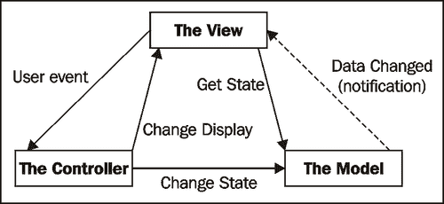
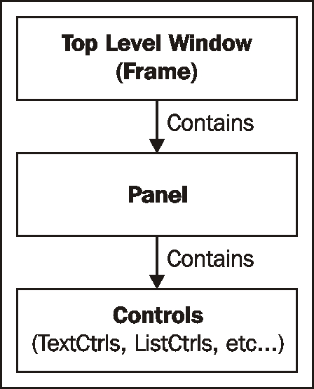

# 第九章：设计方法和技巧

在本章中，我们将涵盖：

+   创建单例

+   实现观察者模式

+   策略模式

+   模型-视图-控制器

+   使用混合类

+   使用装饰器

# 简介

编程全在于模式。从编程语言本身，到工具集，再到应用，每个层面都有模式。能够辨别并选择最合适的解决方案来处理当前问题，有时可能是一项艰巨的任务。你了解的模式越多，你的工具箱就越丰富，选择正确工具来完成工作的难度也就越小。

不同的编程语言和工具包通常倾向于某些模式和解决问题的方法。Python 编程语言和 wxPython 也毫不例外，因此让我们深入探讨一下如何将一些常见的设计方法和技巧应用到 wxPython 应用程序中。

# 创建单例模式

在面向对象编程中，单例模式是一个相对简单的概念，它只允许在给定时间只有一个给定对象的实例存在。这意味着在任何给定时间，它只允许对象的一个实例存在于内存中，因此应用程序中所有对该对象的引用都是共享的。单例通常用于在应用程序中维护全局状态，因为应用程序中所有单例的实例都引用了该对象完全相同的实例。在 wxPython 核心库中，存在许多单例对象，例如`ArtProvider`、`ColourDatabase`和`SystemSettings`。本菜谱展示了如何创建一个单例`Dialog`类，这对于创建在给定时间只应有一个实例存在的非模态对话框非常有用，例如设置对话框或特殊工具窗口。

## 如何做到这一点...

要开始，我们将定义一个元类，它可以被任何需要转换为单例的类重复使用。我们将在“如何工作”部分后面详细介绍。元类是一个创建类的类。当有人尝试创建类的实例时，它会将一个类传递给它的`__init__`和`__call__`方法。

```py
class Singleton(type):
    def __init__(cls, name, bases, dict):
        super(Singleton, cls).__init__(name, bases, dict)
        cls.instance = None

    def __call__(cls, *args, **kw):
        if not cls.instance:
            # Not created or has been Destroyed
            obj = super(Singleton, cls).__call__(*args, **kw)
            cls.instance = obj
            cls.instance.SetupWindow()

        return cls.instance

```

这里有一个使用我们元类的例子，它展示了如何通过简单地将`Singleton`类指定为`SingletonDialog`的`__metaclass__`，轻松地将以下类转换为单例类。唯一的另一个要求是定义`Singleton`元类使用的`SetupWindow`方法，作为初始化钩子，在创建类的第一个实例时设置窗口。

### 注意事项

注意，在 Python 3+ 中，`__metaclass__` 属性已被替换为类定义中的元类关键字参数。

```py
class SingletonDialog(wx.Dialog):
    __metaclass__ = Singleton

    def SetupWindow(self):
        """Hook method for initializing window"""
        self.field = wx.TextCtrl(self)
        self.check = wx.CheckBox(self, label="Enable Foo")

        # Layout
        vsizer = wx.BoxSizer(wx.VERTICAL)
        label = wx.StaticText(self, label="FooBar")
        hsizer = wx.BoxSizer(wx.HORIZONTAL)
        hsizer.AddMany([(label, 0, wx.ALIGN_CENTER_VERTICAL),
                        ((5, 5), 0),
                        (self.field, 0, wx.EXPAND)])
        btnsz = self.CreateButtonSizer(wx.OK)
        vsizer.AddMany([(hsizer, 0, wx.ALL|wx.EXPAND, 10),
                        (self.check, 0, wx.ALL, 10),
                        (btnsz, 0, wx.EXPAND|wx.ALL, 10)])
        self.SetSizer(vsizer)
        self.SetInitialSize()

```

## 它是如何工作的...

在 Python 中实现单例模式有多种方法。在这个菜谱中，我们使用元类来完成这个任务。这是一个很好地封装且易于重用的模式来完成这项任务。我们定义的 `Singleton` 类可以被任何定义了 `SetupWindow` 方法的类使用。所以，既然我们已经完成了这个任务，让我们快速看一下单例是如何工作的。

单例元类动态地为传入的类创建并添加一个名为 `instance` 的类变量。为了更清楚地了解这个过程，元类在我们的示例中会生成以下代码：

```py
class SingletonDialog(wx.Dialog):
instance = None

```

那么第一次调用元类的 `__call__` 方法时，它将分配由超类的 `__call__` 方法返回的类对象实例，在这个菜谱中是一个我们的 `SingletonDialog` 的实例。所以基本上，它等同于以下内容：

```py
SingletonDialog.instance = SingletonDialog(*args,**kwargs)

```

任何后续的初始化都将导致返回之前创建的那个，而不是创建一个新的，因为类定义维护的是对象的生存期，而不是用户代码中创建的单独引用。

我们的 `SingletonDialog` 类是一个非常简单的对话框，它上面有 `TextCtrl`、`CheckBox` 和 `Ok Button` 对象。我们不是在对话框的 `__init__` 方法中调用初始化，而是定义了一个名为 `SetupWindow` 的接口方法，当对象最初创建时，由 Singleton 元类调用该方法。在这个方法中，我们只是简单地对对话框中的控件进行布局。如果你运行与这个主题相关的示例应用程序，你会发现无论点击显示对话框按钮多少次，它只会导致现有对话框实例被带到前台。此外，如果你在对话框的 `TextCtrl` 或 `CheckBox` 中进行更改，然后关闭并重新打开对话框，更改将被保留，因为相同的对话框实例将被重新显示，而不是创建一个新的实例。

# 实现观察者模式

观察者模式是一种设计方法，其中对象可以作为其他对象发布事件的观察者进行订阅。事件的发布者（们）随后只需将事件广播给所有订阅者。这允许创建一个可扩展的、松散耦合的通知框架，因为发布者（们）不需要对观察者有任何特定的了解。由`wx.lib`包提供的`pubsub`模块通过发布者/订阅者方法提供了一个易于使用的观察者模式实现。任意数量的对象都可以将自己的回调方法订阅到发布者将发送的消息，以便进行通知。这个配方展示了如何使用`pubsub`模块在应用程序中发送配置通知。

## 如何做到这一点...

在这里，我们将创建我们的应用程序配置对象，该对象存储应用程序的运行时配置变量，并提供一个通知机制，以便在配置中添加或修改值时，通过使用观察者模式的一个接口来通知：

```py
import wx
from wx.lib.pubsub import Publisher

# PubSub message classification
MSG_CONFIG_ROOT = ('config',)

class Configuration(object):
    """Configuration object that provides
    notifications.
    """
    def __init__(self):
        super(Configuration, self).__init__()

        # Attributes
        self._data = dict()

    def SetValue(self, key, value):
        self._data[key] = value
        # Notify all observers of config change
        Publisher.sendMessage(MSG_CONFIG_ROOT + (key,),
                              value)

    def GetValue(self, key):
        """Get a value from the configuration"""
        return self._data.get(key, None)

```

现在，我们将创建一个非常简单的应用程序来展示如何将观察者订阅到`Configuration`类中的配置更改：

```py
class ObserverApp(wx.App):
    def OnInit(self):
        self.config = Configuration()
        self.frame = ObserverFrame(None,
                                   title="Observer Pattern")
        self.frame.Show()
        self.configdlg = ConfigDialog(self.frame,
                                      title="Config Dialog")
        self.configdlg.Show()
        return True

    def GetConfig(self):
        return self.config

```

此对话框将包含一个配置选项，允许用户更改应用程序的字体：

```py
class ConfigDialog(wx.Dialog):
    """Simple setting dialog"""
    def __init__(self, parent, *args, **kwargs):
        super(ConfigDialog, self).__init__(*args, **kwargs)

        # Attributes
        self.panel = ConfigPanel(self)

        # Layout
        sizer = wx.BoxSizer(wx.VERTICAL)
        sizer.Add(self.panel, 1, wx.EXPAND)
        self.SetSizer(sizer)
        self.SetInitialSize((300, 300))

class ConfigPanel(wx.Panel):
    def __init__(self, parent):
        super(ConfigPanel, self).__init__(parent)

        # Attributes
        self.picker = wx.FontPickerCtrl(self)

        # Setup
        self.__DoLayout()

        # Event Handlers
        self.Bind(wx.EVT_FONTPICKER_CHANGED,
                  self.OnFontPicker)

    def __DoLayout(self):
        vsizer = wx.BoxSizer(wx.VERTICAL)
        hsizer = wx.BoxSizer(wx.HORIZONTAL)

        vsizer.AddStretchSpacer()
        hsizer.AddStretchSpacer()
        hsizer.AddWindow(self.picker)
        hsizer.AddStretchSpacer()
        vsizer.Add(hsizer, 0, wx.EXPAND)
        vsizer.AddStretchSpacer()
        self.SetSizer(vsizer)

```

在此，在`FontPicker`的事件处理程序中，我们获取新选定的字体，并调用`App`对象拥有的`Configuration`对象的`SetValue`方法来更改配置，这将导致发布`('config', 'font')`消息：

```py
    def OnFontPicker(self, event):
        """Event handler for the font picker control"""
        font = self.picker.GetSelectedFont()
        # Update the configuration
        config = wx.GetApp().GetConfig()
        config.SetValue('font', font)

```

现在，在这里，我们定义应用程序的主窗口，使其`OnConfigMsg`方法作为所有`('config',)`消息的观察者，这样每当配置被修改时，它就会被调用：

```py
class ObserverFrame(wx.Frame):
    """Window that observes configuration messages"""
    def __init__(self, parent, *args, **kwargs):
        super(ObserverFrame, self).__init__(*args, **kwargs)

        # Attributes
        self.txt = wx.TextCtrl(self, style=wx.TE_MULTILINE)
        self.txt.SetValue("Change the font in the config "
                          "dialog and see it update here.")

        # Observer of configuration changes
        Publisher.subscribe(self.OnConfigMsg, MSG_CONFIG_ROOT)

    def __del__(self):
        # Unsubscribe when deleted
        Publisher.unsubscribe(self.OnConfigMsg)

```

这里是当`pubsub Publisher`发送以`'config'`开头的任何消息时将被调用的观察者方法。在这个示例应用中，我们仅检查`('config', 'font')`消息，并将`TextCtrl`对象的字体更新为新配置的字体：

```py
    def OnConfigMsg(self, msg):
        """Observer method for config change messages"""
        if msg.topic[-1] == 'font':
            # font has changed so update controls
            self.SetFont(msg.data)
            self.txt.SetFont(msg.data)

if __name__ == '__main__':
    app = ObserverApp(False)
    app.MainLoop()

```

## 它是如何工作的...

本食谱展示了一种通过允许应用程序感兴趣的部分在配置的某些部分被修改时订阅更新来管理应用程序配置的便捷方法。让我们快速了解一下 pubsub 是如何工作的。

Pubsub 消息使用树状结构来组织不同消息的分类。一个消息类型可以被定义为元组`('root', 'child1', 'grandchild1')`，或者定义为点分隔的字符串`'root.child1.grandchild1'`。将回调函数订阅到`('root',)`将会导致您的回调方法对所有以`('root',)`开头的消息被调用。这意味着如果一个组件发布了`('root', 'child1', 'grandchild1')`或`('root', 'child1')`，那么所有订阅到`('root',)`的方法也将被调用。

Pubsub 基本上是通过在`pubsub`模块的静态内存中存储消息类型到回调的映射来工作的。在 Python 中，模块只会在你的应用程序的任何其他部分使用`pubsub`模块并且共享相同的单例`Publisher`对象时才导入一次。

在我们的配方中，`Configuration` 对象是一个用于存储关于我们应用程序配置数据的简单对象。它的 `SetValue` 方法是重要的部分，需要关注。这是每当应用程序中发生配置更改时将被调用的方法。反过来，当这个方法被调用时，它将发送一个 `('config',) + (key,)` 的 pubsub 消息，这将允许任何观察者订阅根项或由确切配置项确定的更具体的主题。

接下来，我们有一个简单的 `ConfigDialog` 类。这只是一个简单的示例，它只提供了一个配置应用程序字体的选项。当在 `ConfigPanel` 中的 `FontPickerCtrl` 发生更改时，将从 `App` 中检索 `Configuration` 对象，并将其更新以存储新选择的 `Font`。当这种情况发生时，`Configuration` 对象将向所有已订阅的观察者发布一个更新消息。

我们的 `ObserverFrame` 通过将其 `OnConfigMsg` 方法订阅到 `MSG_CONFIG_ROOT` 上，成为所有 `('config',)` 消息的观察者。每当调用 `Configuration` 对象的 `SetValue` 方法时，都会调用 `OnConfigMsg`。回调的 `msg` 参数将包含一个具有 `topic` 和 `data` 属性的 `Message` 对象。`topic` 属性将包含触发回调的消息的元组，而 `data` 属性将包含消息发布者与 `topic` 关联的任何数据。在 `('config', 'font')` 消息的情况下，我们的处理程序将更新 `Frame` 的 `Font` 和其 `TextCtrl`。

## 参见

+   请参阅本章中的 *创建单例* 菜谱，以了解像本菜谱中的 Publisher 这样的单例对象是如何工作的。

+   请参阅第十章中的*创建工具窗口*配方，第十章，以了解*创建组件和扩展功能*中另一个使用发布者模式的示例。

# 策略模式

策略模式是一种允许应用程序在运行时选择将使用的策略或行为的途径。它通过封装不同的算法并使客户能够使用它们，而不管算法的底层行为是什么来实现这一点。这可能是编程中最基本的设计模式之一，你可能已经在不知情的情况下以某种形式使用过它。这个配方展示了如何创建一个可重用的`Dialog`类，该类使用策略模式来允许主要内容根据所使用的策略而变化。

## 如何做到这一点...

首先，我们将从定义一个包含我们对话类将使用所有策略的基本接口开始：

```py
class BaseDialogStrategy:
    """Defines the strategy interface"""
    def GetWindowObject(self, parent):
        """Must return a Window object"""
        raise NotImplementedError, "Required method"

    def DoOnOk(self):
        """@return: bool (True to exit, False to not)"""
        return True

    def DoOnCancel(self):
        """@return: bool (True to exit, False to not)"""
        return True

```

现在我们来定义我们的简单“确定/取消”对话框，它将使用从我们的`BaseDialogStrategy`类派生出的策略，以便其主内容区域可以根据所使用的策略而变化：

```py
class StrategyDialog(wx.Dialog):
    """Simple dialog with builtin OK/Cancel button and
    strategy based content area.   
    """
    def __init__(self, parent, strategy, *args, **kwargs):
        super(StrategyDialog, self).__init__(parent,
                                             *args,
                                             **kwargs)

        # Attributes
        self.strategy = strategy
        self.pane = self.strategy.GetWindowObject(self)

        # Layout
        self.__DoLayout()

        # Event Handlers
        self.Bind(wx.EVT_BUTTON, self.OnButton)

```

在以下我们的`StrategyDialog`方法的实现中，我们只是委托给当前策略，以便它能够定义对话框的行为：

```py
    def __DoLayout(self):
        sizer = wx.BoxSizer(wx.VERTICAL)
        sizer.Add(self.pane, 1, wx.EXPAND)
        btnsz = self.CreateButtonSizer(wx.OK|wx.CANCEL)
        sizer.Add(btnsz, 0, wx.EXPAND|wx.ALL, 8)
        self.SetSizer(sizer)

    def GetStrategy(self):
        return self.strategy

    def OnButton(self, event):
        evt_id = event.GetId()
        bCanExit = False
        if evt_id == wx.ID_OK:
            bCanExit = self.strategy.DoOnOk()
        elif evt_id == wx.ID_OK:
            bCanExit = self.strategy.DoOnCancel()
        else:
            evt.Skip()

        if bCanExit:
            self.EndModal(evt_id)

```

现在我们来实现一个简单的策略，该策略可以用来让对话框显示一个用于选择文件的控件：

```py
class FileTreeStrategy(BaseDialogStrategy):
    """File chooser strategy"""
    def GetWindowObject(self, parent):
        assert not hasattr(self, 'dirctrl')
        self.dirctrl = wx.GenericDirCtrl(parent)
        return self.dirctrl

    def DoOnOk(self):
        path = self.dirctrl.GetPath()
        if path:
            wx.MessageBox("You selected: %s" % path)
            return True
        else:
            wx.MessageBox("No file selected!")
            return False

```

然后，在应用中，要创建一个使用此策略的对话框，所需进行的操作如下：

```py
# Note: ‘self’ is some window object (i.e a Frame)
strategy = FileTreeStrategy()
dlg = StrategyDialog(self, strategy, title=”Choose File”)
dlg.ShowModal()

```

## 它是如何工作的...

由于我们对话将使用的所有策略都必须可互换，因此定义一个它们将实现的接口非常重要。因此，在我们的`BaseDialogStrategy`类中，我们定义了一个简单的三方法接口，我们的`StrategyDialog`将委托给这个接口。

`StrategyDialog`基本上只是一个简单的通用外壳，将有关其外观和行为的所有决策委托给策略。当对话框初始化时，它会向策略请求一个窗口对象，该对象将用作对话框的主要内容区域。然后，对话框在界面中创建并添加一些标准的确定/取消按钮。

当用户点击这些按钮之一时，`StrategyDialog` 将简单地委托给其策略，以便策略处理用户操作。这使我们能够通过简单地实现不同的策略，以多种不同的方式重用这个对话框类。

## 参见

+   请参阅本章中的*模型-视图-控制器*配方，以获取策略模式的一些更多示例。

# 模型-视图-控制器（Model View Controller）

**模型-视图-控制器**（**MVC**）是一种设计模式，它在一个程序的架构中创建了一个清晰的关注点分离。它分为三个层次：底层的**模型**，其中包含应用程序的数据对象和业务逻辑，顶层的**视图**，通常由用于显示和编辑数据的控件组成，最后是中间的**控制器**，它负责在模型和视图之间以及反之亦然的数据流的中介：



MVC 实际上是由其他更简单的模式组合而成的一个大怪物模式。模型（Model）实现了一个观察者模式（observer pattern），以便在变化时更新感兴趣的各方，这使得它可以从视图（View）和控制器（Controller）中独立实现。另一方面，视图（View）和控制器（Controller）实现了一个策略模式（strategy pattern），其中控制器（Controller）是一个实现视图行为的策略。

在这个菜谱中，我们探讨如何创建一个简单的数字生成器应用程序，该程序在 wxPython 中实现了这个模式。

## 如何做到这一点...

由于存在多个需要协同工作的组件，定义接口是这个过程的重要一步，因此首先让我们定义一些基类，这些基类将定义我们数字生成器模型和控制器接口。

从我们模型的界面开始，我们提供了一个类，该类只需重写其`Generate`方法即可提供特定实现的行怍。我们还内置了一个简单的观察者模式机制，允许视图订阅模型中的更新通知：

```py
class ModelInterface(object):
    """Defines an interface for a simple value
    generator model.
    """
    def __init__(self):
        super(ModelInterface, self).__init__()

        # Attributes
        self.val = 0
        self.observers = list()

    def Generate(self):
        """Interface method to be implemented by
        subclasses.
        """
        raise NotImplementedError

    def SetValue(self, val):
        self.val = val
        self.NotifyObservers()

    def GetValue(self):
        return self.val

    def RegisterObserver(self, callback):
        """Register an observer callback
        @param: callable(newval)
        """
        self.observers.append(callback)

    def NotifyObservers(self):
        """Notify all observers of current value"""
        for observer in self.observers:
            observer()

```

接下来，我们有框架视图控制器的基本接口定义，我们的控制器需要从中继承。这仅仅定义了一个简单的`DoGenerateNext`方法，该方法必须由具体的实现类重写：

```py
class ControllerInterface(object):
    """Defines an interface a value generator
    controller.
    """
    def __init__(self, model):
        super(ControllerInterface, self).__init__()

        # Attributes
        self.model = model
        self.view = TheView(None, self, self.model,
                            "Fibonacci Generator")

        # Setup
        self.view.Show()

    def DoGenerateNext(self):
        """User action request next value"""
        raise NotImplementedError

```

现在我们来定义一些实现接口并提供特殊化的子类。

从我们的`FibonacciModel`类开始，我们定义了一个将生成斐波那契数的模型：

```py
class FibonacciModel(ModelInterface):
    def Generate(self):
        cval = self.GetValue()
        # Get the next one
        for fib in self.fibonacci():
            if fib > cval:
                self.SetValue(fib)
                break

    @staticmethod
    def fibonacci():
        """Fibonacci generator method"""
        a, b = 0, 1
        while True1:
            yield a
            a, b = b, a + b

```

然后，我们的 `FibonacciController` 提供了控制器特殊化，在这个例子中，它只是对用户界面进行了一次更新，即在模型计算下一个值时禁用按钮：

```py
class FibonacciController(ControllerInterface):
    def DoGenerateNext(self):
        self.view.EnableButton(False)
        self.model.Generate()

```

现在模型和控制器已经定义好了，让我们来看看我们的视图，它由一个`Frame`、一个包含用于显示模型中存储的当前值的`TextCtrl`的`Panel`以及一个用于检索模型定义的序列中下一个值的`Button`组成：

```py
class TheView(wx.Frame):
    def __init__(self, parent, controller, model, title):
        """The view for """
        super(TheView, self).__init__(parent, title=title)

        # Attributes
        self.panel = ViewPanel(self, controller, model)

        # Layout
        sizer = wx.BoxSizer(wx.VERTICAL)
        sizer.Add(self.panel, 1, wx.EXPAND)
        self.SetSizer(sizer)
        self.SetInitialSize((300, 300))

    def EnableButton(self, enable=True):
        self.panel.button.Enable(enable)

```

在这里，`ViewPanel` 是我们与模型和控制器交互的地方。我们在初始化时从模型中检索初始值，然后注册为模型变化的观察者：

```py
class ViewPanel(wx.Panel):
    def __init__(self, parent, controller, model):
        super(ViewPanel, self).__init__(parent)

        # Attributes
        self.model = model
        self.controller = controller
        initial = str(self.model.GetValue())
        self.text = wx.TextCtrl(self, value=initial)
        self.button = wx.Button(self, label="Generate")

        # Layout
        self.__DoLayout()

        # Setup
        self.model.RegisterObserver(self.OnModelUpdate)

        # Event Handlers
        self.Bind(wx.EVT_BUTTON, self.OnAction)

    def __DoLayout(self):
        vsizer = wx.BoxSizer(wx.VERTICAL)
        hsizer = wx.BoxSizer(wx.HORIZONTAL)

        vsizer.AddStretchSpacer()
        vsizer.Add(self.text, 0, wx.ALIGN_CENTER|wx.ALL, 8)
        hsizer.AddStretchSpacer()
        hsizer.AddWindow(self.button)
        hsizer.AddStretchSpacer()
        vsizer.Add(hsizer, 0, wx.EXPAND)
        vsizer.AddStretchSpacer()
        self.SetSizer(vsizer)

```

这里是我们的观察者方法，当模型更新为新值时将会被调用：

```py
    def OnModelUpdate(self):
        """Observer method"""
        value = self.model.GetValue()
        self.text.SetValue(str(value))
        self.button.Enable(True)

```

此事件处理器用于`按钮`，并且将其委托给控制器，以便允许控制器执行特定实现的动作：

```py
    def OnAction(self, event):
        self.controller.DoGenerateNext()

```

最后，我们将所有内容整合并实现一个应用程序：

```py
class ModelViewApp(wx.App):
    def OnInit(self):
        self.model = FibonacciModel()
        self.controller = FibonacciController(self.model)
        return True

if __name__ == '__main__':
    app = ModelViewApp(False)
    app.MainLoop()

```

## 它是如何工作的...

使用 MVC 设计应用程序框架需要相当多的自律。正如这个简单的例子所示，需要做很多额外的“事情”。正如之前所描述的，MVC 将关注点分为三个主要角色：

1.  模型

1.  视图

1.  控制器

因此，让我们看看这些角色是如何在我们的示例食谱中结合在一起的。

首先，是模型：它具有存储值和在其`Generate`方法被调用时生成序列中下一个值的能力。在这个菜谱中，我们实现了一个模型，用于计算和存储斐波那契数。从这个例子中要吸取的重要部分是，模型对视图或控制器没有任何直接的知识。

接下来让我们跳转到视图部分，它仅仅显示一个`TextCtrl`字段和一个`Button`。它并不了解控制器或模型如何工作的任何细节。它只通过定义好的接口与它们进行交互。当用户点击`Button`时，它会请求控制器决定要做什么。为了知道模型何时发生变化，它会在模型上注册一个回调函数，作为观察者来监听模型`SetValue`方法的调用。

现在转到控制器，它是将模型和视图粘合在一起的中介。控制器主要负责根据模型的状态实现视图的行为。我们这个菜谱的简单控制器只有一个接口方法，这个方法是在视图中的“按钮”点击事件响应时被调用的。这个动作首先禁用“按钮”，然后告诉模型生成序列中的下一个数字。

## 还有更多...

你可能想知道“这一切额外的繁琐有什么意义？”创建这样一个简单应用。嗯，由于模型（Model）与视图（View）完全分离，它可以在自动测试套件中更容易地进行单元测试。除此之外，由于视图（View）仅仅是一个视图，并不实现任何行为，因此如果，例如，我们想要向我们的应用中添加一个素数生成器模型，它就可以很容易地被重用。

可维护性也得到了提升，因为这三个部分是分离的，可以单独工作而不会干扰其他组件。由于这些优点，许多其他工具包，如 Django 和 web2py，都采用了这种模式。

## 参见

+   请参阅本章中的 *实现观察者模式* 菜单，了解另一种使用观察者模式的方法。

+   有关使用策略的更多信息，请参阅本章中的*策略模式*配方。

# 使用混合类

混合类是一种类似于策略模式的设计方法，但它直接使用继承来向新类添加扩展/通用功能。本食谱展示了如何创建一个混合类，该类可以为使用它的任何类添加调试日志功能。

## 如何做到这一点...

首先，让我们创建我们的`LoggerMixin`类，它将为需要日志功能的类提供日志功能。它简单地提供了一个`Log`方法，该方法将传入的字符串写入文件：

```py
import os
import time
import wx

class LoggerMixin:
    def __init__(self, logfile="log.txt"):
        """@keyword logfile: path to log output file"""
        # Attributes
        self.logfile = logfile

    def Log(self, msg):
        """Write a message to the log.
        Automatically adds timestamp and originating class
        information.
        """
        if self.logfile is None:
            return

        # Open and write to the log file
        with open(self.logfile, 'ab') as handle:
            # Make a time stamp
            ltime = time.localtime(time.time())
            tstamp = "%s:%s:%s" % (str(ltime[3]).zfill(2),
                                   str(ltime[4]).zfill(2),
                                   str(ltime[5]).zfill(2))
            # Add client info
            client = getattr(self, 'GetName',
                             lambda: "unknown")()
            # Construct the final message
            output = "[%s][%s] %s%s" % (tstamp, client,
                                        msg, os.linesep)
            handle.write(output)

```

然后，要在应用程序中使用`LoggerMixin`，只需将其混合到任何类中即可为其添加`Log`方法：

```py
class MixinRecipeFrame(wx.Frame, LoggerMixin):
    """Main application window"""
    def __init__(self, parent, *args, **kwargs):
        wx.Frame.__init__(self, parent, *args, **kwargs)
        LoggerMixin.__init__(self)
        self.Log("Creating instance...")

        # Attributes
        self.panel = MixinRecipePanel(self)

        # Layout
        sizer = wx.BoxSizer(wx.VERTICAL)
        sizer.Add(self.panel, 1, wx.EXPAND)
        self.SetSizer(sizer)
        self.SetInitialSize((300, 300))

```

## 它是如何工作的...

本食谱中的混合类是`LoggerMixin`类。它将为使用它的类添加一个`Log`方法，该方法将接受一个简单的字符串作为参数，并将其写入指定的日志文件，同时包含一个时间戳和一个 ID，以显示消息的来源。

混入（mixin）通过使用多重继承来为类添加额外的功能。`LoggerMixin` 混入类可以与任何 Python 类一起使用，但它期望（但不要求）被混合的类有一个 `GetName` 方法，用于获取日志消息的 ID 部分：

```py
[17:42:24][unknown] OnInit called
[17:42:24][frame] Creating instance...
[17:42:24][panel] Begin Layout
[17:42:24][panel] End Layout
[17:42:26][panel] Button -203: Clicked
[17:42:26][panel] Button -203: Clicked 

```

## 还有更多

`wx.lib.mixins` 包提供了一系列实用的混合类。以下是一些可用的混合类及其提供的功能简介。

### ListCtrl 混合

以下所有混合类都是为了与`ListCtrl`子类一起使用，并由`wx.lib.mixins.listctrl`模块提供：

| 混合类 | 描述 |
| --- | --- |
| `CheckListCtrlMixin` | 为 `ListCtrl` 的第一列添加 `CheckBox` 功能 |
| `ColumnSorterMixin` | 处理在点击`ListCtrl`的列标题时对项目进行排序 |
| `ListCtrlAutoWidthMixin` | 自动调整 `ListCtrl` 的最后一列大小以填充任何剩余空间 |
| `ListRowHighlighter` | 自动在 `ListCtrl` 的交替行上更改背景颜色，以使其呈现条纹外观 |
| `TextEditMixin` | 为 `ListCtrl` 的任何列添加显示可编辑文本字段的能力 |

### TreeCtrl 混合

以下所有混合类都是用于与`TreeCtrl`子类一起使用，并由`wx.lib.mixins.treectrl`模块提供：

| 混合类 | 描述 |
| --- | --- |
| `DragAndDrop` | 帮助简化向 `TreeCtrl` 添加拖放支持 |
| `ExpansionState` | 用于在 `TreeCtrl` 中保存和恢复节点展开状态的辅助工具 |
| `VirtualTree` | 允许 `TreeCtrl` 被虚拟化，以便按需添加和删除节点，而不是必须在前端构建整个树结构 |

# 使用装饰器

由于窗口层次结构，可能会向程序员展示一些架构问题，这些问题会导致一些繁琐且不必要的代码重复，因为需要在包含层次结构的每一级都拥有代理访问器方法或属性。通常，应用程序中的任何框架或对话框都按照以下图示的结构组织：



当需要检索或修改窗口中显示的数据时，需要访问的是小部件和**控件**。这些控件包含在**面板**中，而面板又包含在**顶级窗口**中。由于面板负责其子控件，它通常会提供修改和访问其子控件维护的数据的方法。因此，顶级窗口类通常需要具有重复的方法，这些方法只是委托给面板的方法来获取和设置窗口的数据。这些委托方法之所以需要，是因为顶级窗口是在应用程序级别实例化的对象，应用程序在使用它时不应需要知道顶级窗口的`Panel`的详细信息。

本食谱展示了如何创建一个简单的装饰器方法，该方法利用 Python 的动态特性，以便将自定义面板类的一个选择方法暴露给其顶级窗口容器。

## 如何做到这一点...

这个装饰器类接受一个类的名称作为参数，并将动态地在顶级窗口的目标子`Panel`中定义`delegate`方法：

```py
class expose(object):
    """Expose a panels method to a to a specified class
    The panel that is having its method exposed by this
    decorator must be a child of the class its exposing
    itself too.
    """
    def __init__(self, cls):
        """@param cls: class to expose the method to"""
        super(expose, self).__init__()
        self.cls = cls

```

这里发生了魔法。我们使用 `setattr` 动态地向目标类添加一个与被装饰函数同名的新函数。当从目标类调用时，新方法将遍历窗口的子元素以找到其 `Panel`，并将调用委托给子类的函数：

```py
    def __call__(self, funct):
        """Dynamically bind and expose the function
        to the toplevel window class.
        """
        fname = funct.func_name
        def delegate(*args, **kwargs):
            """Delegate method for panel"""
            self = args[0] # The TLW
            # Find the panel this method belongs to
            panel = None
            for child in self.GetChildren():
                if isinstance(child, wx.Panel) and \
                   hasattr(child, fname):
                    panel = child
                    break
            assert panel is not None, "No matching child!"
            # Call the panels method
            return getattr(panel, fname)(*args[1:], **kwargs)

        # Bind the new delegate method to the tlw class
        delegate.__name__ = funct.__name__
        delegate.__doc__ = funct.__doc__
        setattr(self.cls, fname, delegate)

        # Return original function to the current class
        return funct

```

本章节附带的示例代码包含一个示例应用程序，展示了如何使用这个装饰器。

## 它是如何工作的...

这个配方与其说是一个设计模式，不如说是一种帮助快速编写新的 `Dialog` 和 `Frame` 类以及减少代码重复的技术。为了做到这一点，我们创建了一个装饰器类，用于将子 `Panel` 类的方法暴露给它们的父级顶级窗口。让我们先看看 `expose` 装饰器，看看它是如何施展魔法的。

`expose` 装饰器接受一个单一参数，即方法应该暴露给该类。在构造函数中保存对这个参数的引用，以便在装饰器应用其 `__call__` 方法时后续使用。`__call__` 方法创建一个名为 `delegate` 的方法，它将搜索第一个具有与正在暴露的方法相同名称的子面板。如果找到合适的面板，它将简单地调用面板的方法并返回其值。接下来，它使用 `setattr` 将新创建的 `delegate` 方法（具有与 `Panel` 的方法匹配的别名）插入到装饰器构造函数中指定的类的命名空间中。此时，该方法即可在调用 `expose` 时使用的顶层窗口中使用。最后，我们只需将未修改的原始函数返回给它所属的 `Panel` 类。

为了明确起见，这个装饰器，正如在这个菜谱中定义的那样，只能由具有已知关系的`Panel`子类使用，即它们是它们父窗口的唯一子窗口。这通常是大多数`Frame`和`Dialog`子类构建的方式，正如在本章示例代码中包含的`CommentDialog`类所示。

## 参见

+   请参阅第一章中的*理解窗口层次结构*配方，以获取对不同对象包含层次结构的额外解释。
