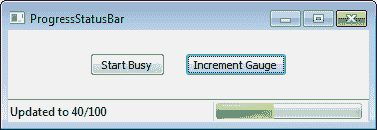
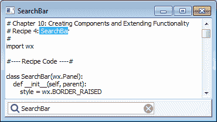
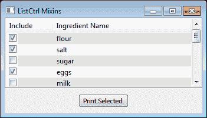
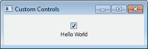

# 第十章 创建组件和扩展功能

在本章中，我们将涵盖：

+   自定义 `ArtProvider`

+   向`StatusBar`添加控件

+   创建一个工具窗口

+   创建一个 `搜索栏`

+   使用 `ListCtrl` 混合

+   `StyledTextCtrl` 自定义高亮

+   创建自定义控件

# 简介

一旦您使用 wxPython 了一段时间，您可能会发现您需要一些默认情况下普通控件所不具备的功能或行为。因此，为了获得这些功能，您可能需要一定程度的定制，甚至可能需要创建一种全新的控件类型，以便提供您应用程序和用户所需的用户界面。

许多控件内置了相当大的灵活性，可以通过使用它们的样式标志来改变它们的行为。然而，在本章中，我们将探讨一些面向对象的方法来创建新的控件，以及通过继承扩展一些标准控件的功能。那么，让我们开始并跳入一些食谱吧。

# 自定义 ArtProvider

`ArtProvider` 是一个单例对象，可以被任何想要显示系统主题提供的位图的组件使用。在 wxPython 2.8 中，只有 GTK（Linux）端口有这个对象的本地实现，因此其他平台使用的是内置到 wxPython 中的图标。这些内置图标至少看起来有些过时和不太合适。这个菜谱展示了如何创建一个自定义的 `ArtProvider` 来处理 Windows 和 OS X 上自定义图标的显示，同时仍然保留 Linux 上的本地系统主题图标。

## 如何做到这一点...

在这里，我们定义我们的自定义 `ArtProvider` 实现，这只需要我们重写 `CreateBitmap` 方法，该方法用于加载我们的自定义图标：

```py
class TangoArtProvider(wx.ArtProvider):
    def __init__(self):
        super(TangoArtProvider, self).__init__()

        # Attributes
        self.bmps = [bmp.replace('.png', '')
                     for bmp in os.listdir('tango')
                     if bmp.endswith('.png')]

    def CreateBitmap(self, id,
                     client=wx.ART_OTHER,
                     size=wx.DefaultSize):

        # Return NullBitmap on GTK to allow
        # the default artprovider to get the
        # system theme bitmap.
        if wx.Platform == '__WXGTK__':
            return wx.NullBitmap

        # Non GTK Platform get custom resource
        # when one is available.
        bmp = wx.NullBitmap
        if client == wx.ART_MENU or size == (16,16):
            if id in self.bmps:
                path = os.path.join('tango', id+'.png')
                bmp = wx.Bitmap(path)
        else:
            # TODO add support for other bitmap sizes
            pass

        return bmp

```

然后我们只需要在应用程序中使用自定义的 `TangoArtProvider`，将其推送到 `ArtProvider` 栈中：

```py
class ArtProviderApp(wx.App):
    def OnInit(self):
        # Push our custom ArtProvider on to
        # the provider stack.
        wx.ArtProvider.PushProvider(TangoArtProvider())
        title = “Tango ArtProvider"
        self.frame = ArtProviderFrame(None,
                                      title=title)
        self.frame.Show()
        return True

```

## 它是如何工作的...

`ArtProvider` 单例维护了一个由 `ArtProvider` 对象组成的栈，这些对象是相互链接的。当在 `ArtProvider` 上调用 `GetBitmap` 方法时，它将首先向栈顶的对象请求所需的 `Bitmap`。如果该对象返回 `NullBitmap`，它将请求下一个对象，以此类推，直到找到 `Bitmap` 或到达栈底。

创建自定义的 `ArtProvider` 所需做的所有事情就是创建一个覆盖 `CreateBitmap` 方法的子类。我们的 `TangoArtProvider` 覆盖了这个方法，并从免费的 Tango ([`tango.freedesktop.org`](http://tango.freedesktop.org)) 图标集中提供了一小套图标。我们仅仅有一个包含一些 PNG 图像的文件夹，我们将这些图像映射到一些 wxPython 的 `ART_*` ID 上，然后在需要时从磁盘加载它们到 `Bitmap` 中。

## 参见

+   请参阅第九章中的*创建单例*配方，*设计方法和技巧*，以了解单例（如`ArtProvider`）的解释。

# 向状态栏添加控件

`StatusBar` 是许多应用程序中常见的一个组件，用于在主窗口内容区域的底部显示简短的信息消息。标准的 `StatusBar` 支持显示多个状态文本字段。本食谱展示了如何创建一个高级的 `StatusBar`，其中内置了一个 `Gauge` 以便在长时间运行的任务中显示进度。为了提前一睹我们将要创建的内容，请查看以下截图以查看 `ProgressStatusBar` 的实际应用：



## 如何做到这一点...

首先，我们将通过创建`StatusBar`的子类来创建我们的`ProgressStatusBar`类。在构造函数中，我们创建一个用于显示进度的`Gauge`和一个用于更新`Gauge`的`Timer`：

```py
class ProgressStatusBar(wx.StatusBar):
    """Custom StatusBar with a built-in progress bar"""
    def __init__(self, parent, id_=wx.ID_ANY,
                 style=wx.SB_FLAT,
                 name="ProgressStatusBar"):
        super(ProgressStatusBar, self).__init__(parent,
                                                id_,
                                                style,
                                                name)

        # Attributes
        self._changed = False   # position has changed ?
        self.busy = False       # Bar in busy mode ?
        self.timer = wx.Timer(self)
        self.prog = wx.Gauge(self, style=wx.GA_HORIZONTAL)
        self.prog.Hide() # Hide on init

        # Layout
        self.SetFieldsCount(2)
        self.SetStatusWidths([-1, 155])

        # Event Handlers
        self.Bind(wx.EVT_IDLE, 
                  lambda evt: self.__Reposition())
        self.Bind(wx.EVT_TIMER, self.OnTimer)
        self.Bind(wx.EVT_SIZE, self.OnSize)

    def __del__(self):
        if self.timer.IsRunning():
            self.timer.Stop()

```

以下辅助方法用于确保当`Gauge`控制的位置或大小发生变化时，它会被重新定位到最右侧的状态字段：

```py
    def __Reposition(self):
        """Repositions the gauge as necessary"""
        if self._changed:
            lfield = self.GetFieldsCount() - 1
            rect = self.GetFieldRect(lfield)
            prog_pos = (rect.x + 2, rect.y + 2)
            self.prog.SetPosition(prog_pos)
            prog_size = (rect.width - 8, rect.height - 4)
            self.prog.SetSize(prog_size)
        self._changed = False

    def OnSize(self, evt):
        self._changed = True
        self.__Reposition()
        evt.Skip()

```

`Timer`事件处理器用于处理在不确定模式下使用`Gauge`时进行脉冲的`Gauge:`

```py
    def OnTimer(self, evt):
        if not self.prog.IsShown():
            self.Stop()

        if self.busy:
            # In busy (indeterminate) mode
            self.prog.Pulse()

```

从这里的 `Run` 方法开始，我们为用户代码操作 `StatusBar 的 Gauge` 添加了一些公共方法。

```py
    def Run(self, rate=100):
        if not self.timer.IsRunning():
            self.timer.Start(rate)

    def GetProgress(self):
        return self.prog.GetValue()

    def SetProgress(self, val):
        if not self.prog.IsShown():
            self.ShowProgress(True)

        # Check if we are finished
        if val == self.prog.GetRange():
            self.prog.SetValue(0)
            self.ShowProgress(False)
        else:
            self.prog.SetValue(val)

    def SetRange(self, val):
        if val != self.prog.GetRange():
            self.prog.SetRange(val)

    def ShowProgress(self, show=True):
        self.__Reposition()
        self.prog.Show(show)

    def StartBusy(self, rate=100):
        self.busy = True
        self.__Reposition()
        self.ShowProgress(True)
        if not self.timer.IsRunning():
            self.timer.Start(rate)

    def StopBusy(self):
        self.timer.Stop()
        self.ShowProgress(False)
        self.prog.SetValue(0)   # Reset progress value
        self.busy = False

    def IsBusy(self):
        """Is the gauge busy?"""
        return self.busy

```

请参阅本章附带的示例代码，以了解`ProgressStatusBar`的实际应用示例。

## 它是如何工作的...

这道菜谱的主要技巧是需要手动维护`Gauge`控制的大小和位置，以确保它在`StatusBar`上保持相同的相对位置，无论窗口如何移动或调整大小。我们通过我们的`__Reposition`方法来处理这个问题，该方法简单地根据`StatusBar`中最右侧的字段来定位和调整`Gauge`的大小。然后，我们只需在隐藏或显示 Gauge、窗口调整大小或必要时在`OnIdle`期间调用此方法即可。

`ProgressStatusBar` 类支持进度条两种操作模式。`Gauge` 可以以忙碌模式（不确定）或增量模式显示。在忙碌模式下，我们只需在事件处理程序中启动并运行一个 `Timer` 来 `Pulse` 进度条。在增量模式下，首先使用 `SetRange` 设置 `Gauge` 的范围，然后根据需要通过调用 `SetProgress` 逐步更新其进度。

## 参见

+   请参阅第五章，*提供信息和提醒用户*中的*创建自定义启动画面*配方，以了解使用仪表控件和计时器的另一个示例。

# 创建工具窗口

`ToolWindow` 是一个小型的浮动窗口，通常像 `ToolBar` 一样工作，在其上有很多不同的工具图标，可以通过点击来启动各种操作。这类窗口通常在绘画应用程序中用于存放调色板和其他工具。本食谱展示了如何创建一个简单的 `ToolWindow` 类。

## 如何做到这一点...

首先，让我们通过从 `MiniFrame` 派生来定义基本的 `ToolWindow` 类，使其成为一个小型、浮动、顶级窗口：

```py
import wx
import wx.lib.pubsub as pubsub

# message data will be tool id
MSG_TOOL_CLICKED = ('toolwin', 'clicked')

class ToolWindow(wx.MiniFrame):
    def __init__(self, parent, rows=1, columns=0, title=''):
        style = wx.CAPTION|wx.SYSTEM_MENU|\
                wx.SIMPLE_BORDER|wx.CLOSE_BOX
        super(ToolWindow, self).__init__(parent,
                                         title=title,
                                         style=style)

        # Attributes
        self.panel = ToolPanel(self, rows, columns)

        # Layout
        sizer = wx.BoxSizer(wx.VERTICAL)
        sizer.Add(self.panel, 1, wx.EXPAND)
        self.SetSizer(sizer)

    def AddTool(self, id, bmp, helplbl=''):
        """Add a tool to the window"""
        self.panel.AddTool(id, bmp, helplbl)
        self.Fit()

```

`ToolPanel` 类充当添加到 `ToolWindow:` 的工具的容器和管理者。

```py
class ToolPanel(wx.Panel):
    """Panel to hold the tools"""
    def __init__(self, parent, rows, columns):
        super(ToolPanel, self).__init__(parent)

        # Attributes
        self.sizer = wx.FlexGridSizer(rows, columns, 5, 5)

        # Setup
        self.SetSizer(self.sizer)

        # Event Handlers
        self.Bind(wx.EVT_BUTTON, self.OnButton)

```

`AddTool` 方法接收传入的 ID 和位图，创建一个 `BitmapButton` 作为工具，然后简单地将它添加到布局管理器的布局中：

```py
    def AddTool(self, id, bmp, helplbl=''):
        tool = wx.BitmapButton(self, id, bmp)
        tool.SetToolTipString(helplbl)
        self.sizer.Add(tool)
        self.Layout()

```

`OnButton` 处理器捕获 `Panel` 中的所有按钮点击，然后向所有已订阅工具消息的观察者发布通知：

```py
    def OnButton(self, event):
        """Notify clients when tool is clicked"""
        pubsub.Publisher.sendMessage(MSG_TOOL_CLICKED,
                                     event.GetId())

```

请参阅本章附带示例代码，以了解使用`ToolWindow`的文本编辑器应用程序的示例。

## 它是如何工作的...

现在我们已经看到了代码，让我们快速浏览一下，以便我们可以看到它是如何协同工作的。

我们的`ToolWindow`类由一个`MiniFrame`和一个`Panel`组成，当客户端代码调用其`AddTool`方法时，将会向其添加`BitmapButtons`。`ToolWindow`有两个参数，`rows`和`columns`，可以指定在`ToolPanel`的`FlexGridSizer`中布局工具时使用的尺寸。为了确保`ToolWindow`的大小正确并且所有工具都可见，有必要在`ToolPanel`的`AddTool`方法中调用`Layout`，然后对`ToolWindow`调用`Fit`以确保布局重新计算并且窗口大小调整以最佳适应其内容。

当在 `ToolWindow` 上点击一个工具时，按钮的事件处理程序简单地使用 `pubsub` 发送一个包含工具 ID 的消息到 `MSG_TOOL_CLICKED` 主题的任何观察者。选择这种通知方式是因为这样，如果应用程序有多个窗口，它们都可以共享同一个 `ToolWindow`，而不是每个窗口都创建它自己的实例。

## 参见

+   请参阅第九章中的*实现观察者模式*配方，在*设计方法和技巧*中深入讨论使用观察者模式。

# 创建一个搜索栏

搜索栏已成为许多应用中一个相当熟悉的组件，作为替代显示可以覆盖部分屏幕、遮挡搜索区域的`FindDialog`。wxPython 中没有内置的控制来实现这一功能，因此这个菜谱展示了如何创建一个简单的`SearchBar`控制。

## 如何做到这一点...

我们的 `SearchBar` 控件将是一个由 `Panel` 作为基础，并在其上添加 `SearchCtrl` 以允许输入搜索文本的复合控件：

```py
class SearchBar(wx.Panel):
    def __init__(self, parent):
        style = wx.BORDER_RAISED
        super(SearchBar, self).__init__(parent,
                                        style=style)

        # Attributes
        self.search = wx.SearchCtrl(self,
                                    size=(250, -1),
                                    style=wx.TE_PROCESS_ENTER)
        self.lastfind = ''

        # Layout
        self.__DoLayout()

        # Event Handlers
        if wx.Platform in ['__WXMSW__', '__WXGTK__']:
            # Workaround for composite control on msw/gtk
            for child in self.search.GetChildren():
                if isinstance(child, wx.TextCtrl):
                    child.Bind(wx.EVT_KEY_UP, self.OnEnter)
                    break
        else:
            self.search.Bind(wx.EVT_KEY_UP, self.OnEnter)
        self.Bind(wx.EVT_SEARCHCTRL_CANCEL_BTN, self.OnCancel)

    def __DoLayout(self):
        sizer = wx.BoxSizer(wx.HORIZONTAL)
        sizer.Add(self.search, 0, wx.ALL, 2)
        self.SetSizer(sizer)

```

在这里，在`OnCancel`中，我们处理`SearchCtrl`的取消按钮事件，以便清除当前搜索文本并隐藏取消按钮：

```py
    def OnCancel(self, event):
        self.search.SetValue("")
        self.search.ShowCancelButton(False)

```

`OnEnter` 将处理由 `SearchCtrl` 生成的键盘事件。我们使用它来查看用户何时按下回车键以启动搜索。我们通过创建一个 `FindDialogEvent` 来允许客户端绑定到 `EVT_FIND` 并处理搜索：

```py
    def OnEnter(self, event):
        """Send a search event"""
        code = event.GetKeyCode()
        val = self.search.GetValue()
        if code == wx.WXK_RETURN and val:
            if val == self.lastfind:
                etype = wx.wxEVT_COMMAND_FIND
            else:
                etype = wx.wxEVT_COMMAND_FIND_NEXT
            fevent = wx.FindDialogEvent(etype)
            fevent.SetFindString(val)
            self.ProcessEvent(fevent)
            self.lastfind = val
        else:
            show = bool(val)
            self.search.ShowCancelButton(show)

```

运行本食谱所附带的示例应用程序，将显示如下窗口：



## 它是如何工作的...

这个菜谱展示了如何制作一个非常基本的复合控件。`SearchBar`只是一个简单的`Panel`，上面有一个`SearchCtrl`。要在`Frame`中使用它，只需创建一个垂直的`BoxSizer`并将`SearchBar`添加到其中，这样它就会位于搜索将进行的主体内容区域下方或上方。然后，`Frame`可以响应`SearchBar`发出的事件。为了支持在用户在`SearchCtrl`中按下*Return*键时发送查找事件，我们不得不做一些事情。现在，让我们看看这个吧。

在`SearchBar`的构造函数中，我们不得不为 Windows 和 Linux 定义一些特殊情况的代码，以便能够绑定我们的`EVT_KEY_UP`处理程序。这是为了解决一个 bug，由于`SearchControl`在这两个平台上是一个复合控件，导致`KeyEvents`无法正确传播。在 Macintosh 上，`SearchCtrl`是一个原生小部件，因此事件绑定可以正常工作。接下来，在我们的`OnEnter`事件处理程序中，我们检查控件中的文本值，并根据搜索的上下文生成一个`EVT_FIND`或`EVT_FIND_NEXT`事件。由于这些是命令事件，调用`self.ProcessEvent`将在事件处理程序链中启动我们的`FIND`事件的处理，允许它传播直到被处理。

## 参见

+   请参阅第二章中的*理解事件传播*配方，以了解事件是如何工作的讨论。

+   请参阅第七章中的*使用 BoxSizer*配方，*窗口布局与设计*，以了解如何使用 BoxSizers 进行窗口布局控制。

# 使用 ListCtrl 混合

类似于 `TreeCtrl`，有多个混合类（mixin classes）可供扩展标准 `ListCtrl` 的功能。本食谱介绍了如何使用 `CheckListCtrlMixin`、`ListRowHighlighter` 和 `ListCtrlAutoWidthMixin` 混合类来创建一个 `ListCtrl`，该控件允许通过使用 `CheckBoxes` 来选择多个项目。

## 如何做到这一点...

在这里，我们将定义我们的基础 `CheckListCtrl` 类，该类使用三个混合类来自定义控件的外观和感觉，并添加复选框：

```py
import wx
import wx.lib.mixins.listctrl as listmix

class CheckListCtrl(wx.ListCtrl,
                    listmix.CheckListCtrlMixin,
                    listmix.ListRowHighlighter,
                    listmix.ListCtrlAutoWidthMixin):
    def __init__(self, *args, **kwargs):
        wx.ListCtrl.__init__(self, *args, **kwargs)
        listmix.CheckListCtrlMixin.__init__(self)
        listmix.ListRowHighlighter.__init__(self)
        listmix.ListCtrlAutoWidthMixin.__init__(self)

        # Attributes
        self._observers = list()

```

在这里，我们重写了`CheckListCtlrMixin`的`OnCheckItem`方法，并实现了一个观察者接口，以便在列表中的`CheckBox`被切换时通知客户端：

```py
    def OnCheckItem(self, index, flag):
        """Overrides CheckListCtrlMixin.OnCheckItem 
        callback"""
        # Notify observers that a checkbox was 
        # checked/unchecked
        for observer in self._observers:
            observer(index, flag)

```

剩下的就是添加一个`GetItems`方法来返回已检查项目的列表，以及另一个方法允许客户端注册自己作为当项目在控制中检查时的观察者：

```py
    def GetItems(self, checked=True):
        """Gets a list of all the (un)checked items"""
        indexes = list()
        for index in range(self.GetItemCount()):
            if self.IsChecked(index) == checked:
                indexes.append(index)
        return indexes

    def RegisterObserver(self, callback):
        """Register OnCheckItem callback
        @param callaback: callable(index, checked)
        """
        self._observers.append(callback)

```

## 它是如何工作的...

在这个示例中，我们创建了一个通用基类 `CheckListCtrl`，它将具有以下扩展功能。在列 0 的每一行都将有一个 `CheckBox`，交替的行将突出显示其背景，而 `ListCtrl` 的最右侧列将自动调整大小以填充控件中的剩余空间。这些功能分别由 `CheckListCtrlMixin`、`ListRowHighlighter` 和 `ListCtrlAutoWidthMixin` 类提供。

`CheckListCtrlMixin` 提供了一个可重写的方法，`OnCheckItem`，当在 `ListCtrl` 中的某个 `CheckBox` 被点击时会被调用。我们重写了这个方法，并添加了一种方式让客户端代码可以注册观察者回调方法到该控件中。这样，如果任何使用这个控件的客户端代码希望在 `CheckBox` 切换时收到通知，它们可以注册自己的观察者方法。

我们`CheckListCtrl`类的最后一部分是`GetItems`方法，它是为了使获取控制中所有已勾选或未勾选项的索引列表变得容易而添加的。请参阅随此主题附带的示例代码，以了解使用此新控件的应用示例：



## 还有更多...

`wx.lib.mixins.listctrl` 模块为 `ListCtrl` 提供了几个额外的混合类。以下是这些其他类的快速参考：

| 混入类 | 描述 |
| --- | --- |
| `ColumnSorterMixin` | 帮助处理在点击列标题时控件中项的排序。 |
| `TextEditMixin` | 使之能够编辑多列 `ListCtrl` 中的任意列文本。 |

## 参见

+   请参阅第四章中的*使用 ListCtrl 列出数据*配方，*用户界面的高级构建块*，以了解使用`ListCtrl`的另一个示例。

+   请参阅第九章中的*实现观察者模式*配方，以了解如何使用观察者模式。

# 样式文本控件自定义高亮

如第四章“用户界面的高级构建块”中“使用 lexers 的 StyledTextCtrl”部分所述，`StyledTextCtrl`是一个功能强大的源代码编辑组件，它支持多种不同类型源代码的语法高亮。然而，如果你发现你的应用程序需要支持一些`StyledTextCtrl`没有内置 lexers 的语法高亮，你可能认为你运气不佳。但这并非事实。可以通过使用特殊的容器 lexer 来添加自定义 lexers。本食谱展示了如何编写和使用一个执行一些简单高亮的自定义 lexer。

## 如何做到这一点...

作为这个菜谱的一部分，我们将创建一个简单的框架，它可以扩展以执行其他类型的突出显示。让我们从定义处理由 `StyledTextCtrl:` 生成的 `EVT_STC_STYLENEEDED` 事件的 `BaseLexer` 类开始。

```py
import wx
import wx.stc

class BaseLexer(object):
    """Defines simple interface for custom lexer objects"""
    def __init__(self):
        super(BaseLexer, self).__init__()

    def StyleText(self, event):
        raise NotImplementedError

```

接下来，我们有我们的`VowelLexer`示例实现，它将为文档中所有的元音字母提供文本样式：

```py
class VowelLexer(BaseLexer):
    """Simple lexer to highlight vowels"""
    # Define some style IDs
    STC_STYLE_VOWEL_DEFAULT, \
    STC_STYLE_VOWEL_KW = range(2)
    def __init__(self):
        super(VowelLexer, self).__init__()

        # Attributes
        self.vowels = [ord(char) for char in "aeiouAEIOU"] 

```

`StyleText` 方法是我们自定义的 `StyledTextCtrl` 在其 `EVT_STC_STYLENEEDED` 事件处理程序中将要委托执行的方法。`VowelLexer` 支持两种不同的样式：一种用于其默认样式，另一种用于元音字母。

```py
    def StyleText(self, event):
        """Handle the EVT_STC_STYLENEEDED event"""
        stc = event.GetEventObject()
        # Last correctly styled character
        last_styled_pos = stc.GetEndStyled()
        # Get styling range for this call
        line = stc.LineFromPosition(last_styled_pos)
        start_pos = stc.PositionFromLine(line)
        end_pos = event.GetPosition()
        # Walk the line and find all the vowels to style
        # Note: little inefficient doing one char at a time
        #       but just to illustrate the process.
        while start_pos < end_pos:
            stc.StartStyling(start_pos, 0x1f)
            char = stc.GetCharAt(start_pos)
            if char in self.vowels:
                # Set Vowel Keyword style
                style = VowelLexer.STC_STYLE_VOWEL_KW
            else:
                # Set Default style
                style = VowelLexer.STC_STYLE_VOWEL_DEFAULT
            # Set the styling byte information for 1 char from
            # current styling position (start_pos) with the
            # given style.
            stc.SetStyling(1, style)
            start_pos += 1

```

`CustomSTC` 类将为使用 `BaseLexer-derived` 类来定制控件中文本的高亮显示提供框架：

```py
class CustomSTC(wx.stc.StyledTextCtrl):
    def __init__(self, *args, **kwargs):
        super(CustomSTC, self).__init__(*args, **kwargs)

        # Attributes
        self.custlex = None

        # Event Handlers
        self.Bind(wx.stc.EVT_STC_STYLENEEDED, self.OnStyle)

    def OnStyle(self, event):
        # Delegate to custom lexer object if one exists
        if self.custlex:
            self.custlex.StyleText(event)
        else:
            event.Skip()

    def SetLexer(self, lexerid, lexer=None):
        """Overrides StyledTextCtrl.SetLexer
        Adds optional param to pass in custom container
        lexer object.
        """
        self.custlex = lexer
        super(CustomSTC, self).SetLexer(lexerid)

```

与本章所附的示例代码一起包含的是一个使用上面定义的定制`VowelLexer`类的简单应用程序。

## 它是如何工作的...

在这个菜谱中，我们首先为创建针对 `StyledTextCtrl` 的自定义词法分析器构建了一个小框架。从我们的 `BaseLexer` 类开始，我们定义了一个简单的接口，用于将处理 `EVT_STC_STYLENEEDED` 任务委托给对象。接下来，我们创建了 `VowelLexer` 类，这是一个简单的 `BaseLexer` 子类，它将在文档文本中突出显示元音字母。在 `StyledTextCtrl` 中应用样式涉及三个基本步骤。首先，你需要调用 `StartStyling` 来指示你希望在缓冲区中开始样式的位置，然后你需要确定要设置的样式字节，最后你需要调用 `SetStyling` 来设置从起始位置开始应用给定样式的字符数。

现在为了让 `StyledTextCtrl` 能够使用这些词法分析器，我们需要做一些事情，这些事情我们已经封装在 `CustomSTC` 类中。`StyledTextCtrl` 需要绑定到 `EVT_STC_STYLENEEDED` 并设置 `STC_LEX_CONTAINER` 词法分析器。当容器词法分析器是当前词法分析器，并且检测到缓冲区中的某些文本可能因为内容的变化需要重新格式化时，`StyledTextCtrl` 将会生成 `EVT_STC_STYLEDNEEDED` 事件。为了在我们的 `CustomSTC` 类中处理这种情况，我们只需将事件委托给通过我们重写的 `SetLexer` 方法设置的当前词法分析器对象。

最后，我们有一个超级简单的示例应用程序，展示了如何在我们的应用程序中使用`CustomSTC`和`VowelLexer`。首先，我们需要通过调用`SetStyleSpec`来设置样式，指定为我们的词法分析器的两种样式字节应用哪些颜色。`STC_STYLE_VOWEL_DEFAULT`将以纯黑色文本样式显示，而`STC_STYLE_VOWEL_KW`将以红色文本样式显示。然后，剩下的就是调用`SetLexer`来设置`STC_LEX_CONTAINER`词法分析器，并为控件创建一个我们的`VowelLexer`实例。所以运行一下，当你将文本输入到缓冲区时，所有的元音字母都应该被涂成红色。

## 参见

+   请参阅第四章中的*使用 lexers 的 StyledTextCtrl*配方，*用户界面的高级构建块*，以了解使用`StyleTextCtrl`的另一个示例。

# 创建自定义控件

在某个时候，你可能需要发明一个全新的控件来满足你应用程序的一些特定需求。因此，在这个菜谱中，我们将探讨一些从头开始创建新控件的技术。我们将创建一个自定义的`CheckBox`控件，其标签位于`CheckBox`下方。

## 如何做到这一点...

要开始，我们将定义`CustomCheckBox`控制器的构造函数为`PyControl`的子类。在构造函数中，我们将绑定一系列事件，这将使我们能够定义控制器的行为：

```py
class CustomCheckBox(wx.PyControl):
    """Custom CheckBox implementation where label is
    below the CheckBox.
    """
    def __init__(self, parent, id_=wx.ID_ANY, label=""):
        style = wx.BORDER_NONE
        super(CustomCheckBox, self).__init__(parent,
                                             id_,
                                             style=style)

        # Attributes
        self.InheritAttributes()
        self._hstate = 0
        self._checked = False
        self._ldown = False
        self.SetLabel(label)

        # Event Handlers
        self.Bind(wx.EVT_PAINT, self.OnPaint)
        self.Bind(wx.EVT_ERASE_BACKGROUND, self.OnErase)
        self.Bind(wx.EVT_LEFT_DOWN, self.OnLeftDown)
        self.Bind(wx.EVT_LEFT_UP, self.OnLeftUp)
        self.Bind(wx.EVT_ENTER_WINDOW,
                  lambda event:
                  self._SetState(wx.CONTROL_CURRENT))
        self.Bind(wx.EVT_LEAVE_WINDOW,
                  lambda event: self._SetState(0))

```

接下来，我们有一个辅助方法来帮助管理控制状态与鼠标的关系：

```py
    def _SetState(self, state):
        if self._hstate != state:
            if state == 0:
                self._ldown = False
            self._hstate = state
            self.Refresh()

    #-- Implementation --#

```

这是对`PyControl`的`DoGetBestSize`方法的虚拟覆盖，用于控制控件的大小：

```py
    def DoGetBestSize(self):
        lblsz = self.GetTextExtent(self.GetLabel())
        width = max(lblsz[0], 16) + 4 # 2px padding l/r
        height = lblsz[1] + 16 + 6
        best_sz = wx.Size(width, height)
        self.CacheBestSize(best_sz)
        return best_sz

    #-- Event Handlers --#

```

接下来，我们关注将定义控件行为的处理事件。首先，在`OnPaint`中，我们进行绘制操作，赋予控件外观：

```py
    def OnPaint(self, event):
        dc = wx.AutoBufferedPaintDCFactory(self)
        gc = wx.GCDC(dc)
        renderer = wx.RendererNative.Get()

        # Setup GCDC
        rect = self.GetClientRect()
        bcolour = self.GetBackgroundColour()
        brush = wx.Brush(bcolour)
        gc.SetBackground(brush)
        gc.Clear()

        # Center checkbox
        cb_x = (rect.width - 16) / 2
        cb_y = 2 # padding from top
        cb_rect = wx.Rect(cb_x, cb_y, 16, 16)

        # Draw the checkbox
        state = 0
        if self._checked:
            state = wx.CONTROL_CHECKED
        if not self.IsEnabled():
            state |= wx.CONTROL_DISABLED
        renderer.DrawCheckBox(self, dc, cb_rect,
                              state|self._hstate)

        # Draw the label
        lbl_rect = wx.Rect(0, cb_rect.bottom, rect.width,
                           rect.height - cb_rect.height)
        gc.DrawLabel(self.GetLabel(),
                     lbl_rect,
                     wx.ALIGN_CENTER)

    def OnErase(self, event):
        pass # do nothing

```

下两个事件处理器管理控件中的鼠标点击状态，以切换`CheckBox`的状态：

```py
    def OnLeftDown(self, event):
        self._ldown = True
        event.Skip()

    def OnLeftUp(self, event):
        if self._ldown:
            self._ldown = False
            self._checked = not self._checked
            self.Refresh()
            # Generate EVT_CHECKBOX event
            etype = wx.wxEVT_COMMAND_CHECKBOX_CLICKED
            chevent = wx.CommandEvent(etype, self.GetId())
            chevent.SetEventObject(self)
            self.ProcessEvent(chevent)
        event.Skip()

```

最后但同样重要的是，我们定义了几种方法来实现`wx.CheckBox`接口的一部分：

```py
    #---- Public Api ----#

    def SetValue(self, state):
        self._checked = state
        self.Refresh()

    def GetValue(self):
        return self._checked

    def IsChecked(self):
        return self.GetValue()

```

## 它是如何工作的...

这是一种相对简单的控制实现，但它是一个很好的例子，展示了在创建自己的自定义控制时可以采取的一些方法。因此，让我们逐一分析每个重要部分，看看它们是如何影响控制工作方式的。

首先，在构造函数中，我们定义了三个属性来管理控制器的状态：

1.  `self._hstate:` 用于存储控制器的当前高亮状态。

1.  `self._checked:` 用于保存 `CheckBox` 的状态。

1.  `self._ldown:` 当在控件中点击了左鼠标按钮时保持。

接下来，我们需要`绑定`到绘制控件和实现其行为所必需的事件。我们使用了两个绘图事件和四个不同的鼠标事件。首先，让我们看看用于实现控件行为的鼠标事件处理器。

在 `OnLeftDown` 中，我们只需将我们的 `self._ldown` 标志设置为 `True`，以指示下点击动作是在此窗口中而不是在其他地方发起的。然后，在 `OnLeftUp` 处理程序中，如果 `self._ldown` 标志为 `True`，我们将 `self._checked` 标志切换以反映新的 `CheckBox` 状态，然后调用 `Refresh`。调用 `Refresh` 将会生成一个 `EVT_PAINT` 事件，这样我们就可以使用我们的 `OnPaint` 处理程序重新绘制控件以反映其新状态。之后，我们还会生成一个 `EVT_CHECKBOX` 事件，以便通知应用程序 `CheckBox` 状态已更改。剩余的两个鼠标事件用于在鼠标进入或离开控件区域时更新控件的高亮状态。

`OnPaint` 是我们绘制控件并赋予其外观的地方。我们在 `OnPaint` 中创建绘图上下文并设置背景。接下来，我们计算在控件矩形内绘制 `CheckBox` 的位置，并使用 `RendererNative` 根据控件的当前状态绘制 `CheckBox`。然后，剩下的就是使用我们的 `GCDC's DrawLabel` 方法在 `CheckBox` 下方绘制标签。

为了完成控制功能，我们添加了一些方法来实现`CheckBox`部分常规界面的功能，以便使用此控件的应用程序代码可以获取和设置`CheckBox`的状态：



## 参见

+   请参阅第一章中的*理解继承限制*配方，以了解关于重写虚拟方法的讨论。

+   查阅第二章中的“理解事件传播”配方，*响应事件*以获取更多关于处理事件的详细信息。

+   请参阅第八章中的*使用 RendererNative 进行绘图*配方，*屏幕绘图*部分提供了使用`RendererNative`绘制原生外观控件的其他示例。

+   请参阅第八章中的*减少绘图过程中的闪烁*配方，*屏幕绘图*章节，以了解如何减少绘图过程中的闪烁。
