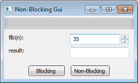
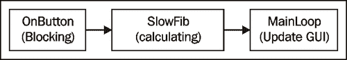
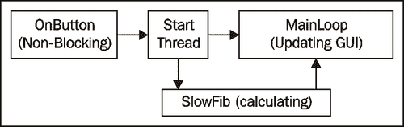
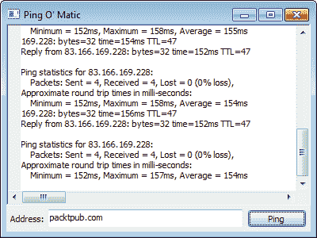

# 第十一章 使用线程和计时器创建响应式界面

在本章中，我们将涵盖：

+   非阻塞 GUI

+   理解线程安全性

+   线程工具

+   使用计时器

+   捕获输出

# 简介

当你使用一个应用程序并点击某个按钮或控件时，突然发现应用程序的 UI 似乎停止响应，忙碌的光标出现，而你只能在那里猜测应用程序是否还在工作，或者它是否已经锁定并需要强制退出。这种不愉快的体验几乎总是由于一个在调用后需要相当长时间才能返回结果的函数或动作造成的。如果这个函数或动作是在 GUI 对象所在的同一线程上被调用的，它将阻塞所有在后台运行并管理 GUI 的代码，导致这个锁定且无响应的界面。

能够以防止这种情况出现在用户面前的方式设计应用程序，与大多数传统的程序性方法相比，需要额外的考虑。本章通过提供解决方案，并希望提供所有必要的工具，来探讨这个问题，以构建高度响应的、多线程的 wxPython 应用程序。

# 非阻塞图形用户界面

在这个菜谱中，我们探讨什么是响应式界面，并试图对其他菜谱章节中将要提供的解决方案所针对的问题有一个良好的理解。该菜谱创建了一个包含两个按钮的简单应用程序。每个按钮将执行完全相同的任务。然而，由于控制流的执行方式不同，两个按钮在点击按钮后对用户响应和提供反馈的方式将大相径庭。

## 如何做到这一点...

为了说明当前的问题，我们将创建一个简单的斐波那契数计算器应用程序。首先，我们将从定义一个线程类和用于计算第 N 个斐波那契数的函数开始：

```py
import wx
import threading

class FibThread(threading.Thread):
    def __init__(self, window, n):
        super(FibThread, self).__init__()

        # Attributes
        self.window = window
        self.n = n

    def run(self):
        val = SlowFib(self.n)
        wx.CallAfter(self.window.output.SetValue, str(val))
        wx.CallAfter(self.window.StopBusy)

def SlowFib(n):
    """Calculate Fibonacci numbers
    using slow recursive method to demonstrate
    blocking the UI.
    """
    if n == 0:
        return 0
    elif n == 1:
        return 1
    else:
        return SlowFib(n-1) + SlowFib(n-2)

```

现在让我们为我们的斐波那契数计算器创建用户界面：

```py
class BlockingApp(wx.App):
    def OnInit(self):
        self.frame = BlockingFrame(None,
                                   title="Non-Blocking Gui")
        self.frame.Show()
        return True

class BlockingFrame(wx.Frame):
    """Main application window"""
    def __init__(self, *args, **kwargs):
        super(BlockingFrame, self).__init__(*args, **kwargs)

        # Attributes
        self.panel = BlockingPanel(self)

        # Layout
        sizer = wx.BoxSizer(wx.VERTICAL)
        sizer.Add(self.panel, 1, wx.EXPAND)
        self.SetSizer(sizer)
        self.SetInitialSize()

```

在这里，在`面板`中，大部分的操作将在本例中发生。在这里，我们布局了一个简单的界面，包括一个输入字段和一个输出字段，两个按钮，以及一个进度条：

```py
class BlockingPanel(wx.Panel):
    def __init__(self, parent):
        super(BlockingPanel, self).__init__(parent)

        # Attributes
        self.timer = wx.Timer(self)
        self.input = wx.SpinCtrl(self, value="35", min=1)
        self.output = wx.TextCtrl(self)
        self.block = wx.Button(self, label="Blocking")
        self.noblock = wx.Button(self, label="Non-Blocking")
        self.prog = wx.Gauge(self)

        # Layout
        self.__DoLayout()

        # Event Handlers
        self.Bind(wx.EVT_BUTTON, self.OnButton)
        self.Bind(wx.EVT_TIMER, self.OnPulse, self.timer)

    def __DoLayout(self):
        vsizer = wx.BoxSizer(wx.VERTICAL)
        hsizer = wx.BoxSizer(wx.HORIZONTAL)
        gridsz = wx.GridSizer(2, 2, 5, 5)

        # Layout controls
        vsizer.Add(self.prog, 0, wx.EXPAND)
        gridsz.Add(wx.StaticText(self, label="fib(n):"))
        gridsz.Add(self.input, 0, wx.EXPAND)
        gridsz.Add(wx.StaticText(self, label="result:"))
        gridsz.Add(self.output, 0, wx.EXPAND)
        vsizer.Add(gridsz, 0, wx.EXPAND|wx.ALL, 10)
        hsizer.Add(self.block, 0, wx.ALL, 5)
        hsizer.Add(self.noblock, 0, wx.ALL, 5)
        vsizer.Add(hsizer, 0, wx.ALIGN_CENTER_HORIZONTAL)

        self.SetSizer(vsizer)

```

在我们的`EVT_BUTTON`处理程序中，我们进行计算。首先，我们清除当前输出，然后启动进度`Gauge`。之后，我们根据点击的是哪个`Button`选择两条路径之一。如果是“Blocking”按钮，我们就在同一个线程中直接进行计算。如果是“Non-Blocking”按钮被点击，我们将任务委托给后台线程，以便允许 GUI 继续处理：

```py
    def OnButton(self, event):
        input = self.input.GetValue()
        self.output.SetValue("") # clear output
        self.StartBusy() # give busy feedback
        if event.GetEventObject() == self.block:
            # Calculate value in blocking mode
            val = SlowFib(input)
            self.output.SetValue(str(val))
            self.StopBusy()
        else:
            # Non-Blocking mode
            task = FibThread(self, input)
            task.start()

```

这些方法被添加以控制进度量表并更新 GUI 的状态，具体取决于应用程序是否正在计算：

```py
    def OnPulse(self, event):
        self.prog.Pulse() # Pulse busy feedback

    def StartBusy(self):
        self.timer.Start(100)
        self.block.Disable()
        self.noblock.Disable()

    def StopBusy(self):
        self.timer.Stop()
        self.prog.SetValue(0)
        self.block.Enable()
        self.noblock.Enable()

if __name__ == '__main__':
    app = BlockingApp(False)
    app.MainLoop()

```

## 它是如何工作的...

运行上一段代码将会显示以下应用程序窗口：



此应用程序将计算由第一个字段指定的第 N 个斐波那契数。使用 35 或更高的数字，通过使用`SlowFib`函数进行计算将需要从几秒到几分钟不等。点击两个按钮中的任意一个，都会调用相同的`SlowFib`函数，并最终生成相同的结果。因此，带着这个想法，让我们跳转到`BlockingPanel`的`OnButton`方法，看看两个按钮之间有什么不同之处。

当调用`OnButton`时，我们首先清除结果字段，然后`Start`启动`Timer`以`Pulse`窗口顶部的`Gauge`，从而给用户反馈我们正在忙于计算结果。如果点击了阻塞按钮，我们直接调用`SlowFib`函数来获取结果。在此阶段，应用程序的控制流将停滞等待`SlowFib`返回，这意味着`MainLoop`将等待我们的`OnButton`方法返回。由于`OnButton`只有在`SlowFib`完成后才会返回，因此框架将无法处理任何事件，例如重绘窗口、鼠标点击或我们的`TimerEvent`以脉冲`Gauge`。正因为如此，阻塞按钮仍然看起来是按下的，并且`Frame`及其所有控件将完全无响应，直到`SlowFib`完成并返回控制权到`MainLoop`：



相反，如果你点击了非阻塞按钮，我们仍然运行相同的`SlowFib`函数，但是在一个单独的`Thread`中执行。这允许`OnButton`立即返回，将控制权交还给`MainLoop`。因此，由于`MainLoop`没有被`OnButton`阻塞，它可以自由地处理其他事件，允许我们的忙碌指示器更新，按钮显示为禁用状态，以及`Frame`可以在桌面上自由移动。当`FibThread`上的计算完成时，它使用`CallAfter`函数发送消息来调用所需的功能，以在主线程上更新 GUI，然后退出，使 GUI 准备好开始另一个计算：



两个按钮产生结果所需的时间大致相同，但非阻塞按钮允许 GUI 继续平稳运行，并会给用户留下软件正在忙碌工作的良好印象，知道软件并未锁定。

## 参见

+   有关创建线程安全 GUI 的更多信息，请参阅本章中的*理解线程安全*配方。

+   请参阅本章中的*使用计时器*配方，了解在执行长时间运行的任务时保持 GUI 响应的其他方法。

# 理解线程安全性

几乎所有用户界面工具包都是设计在单个执行线程中运行的。了解如何在多线程应用程序中与其他工作线程交互 GUI 线程是一项重要的任务，需要谨慎执行，以避免应用程序中出现看似无法解释且随机的崩溃。这在 wxPython 中与其他典型的 GUI 工具包一样适用。

在 wxPython 应用程序中保持线程安全可以通过几种不同的方式来处理，但使用事件是最典型的方法。由`MainLoop`监控的事件队列提供了一种线程安全的方式来从后台线程传递数据和动作，以便在 GUI 线程的上下文中进行处理。本食谱展示了如何使用自定义事件和`PostEvent`函数来更新存在于主 GUI 线程中的 GUI 对象。

## 如何做到这一点...

由于我们将在示例应用程序中使用事件来维护线程安全，我们首先将定义一个自定义事件类型：

```py
import wx
import time
import threading

# Define a new custom event type
wxEVT_THREAD_UPDATE = wx.NewEventType()
EVT_THREAD_UPDATE = wx.PyEventBinder(wxEVT_THREAD_UPDATE, 1)

class ThreadUpdateEvent(wx.PyCommandEvent):
    def __init__(self, eventType, id):
        super(ThreadUpdateEvent, self).__init__(eventType, id)

        # Attributes
        self.value = None

    def SetValue(self, value):
        self.value = value

    def GetValue(self):
        return self.value

```

下面的`CountingThread`类将被用作本应用程序的后台工作线程，并使用之前的事件类来通知并在主 GUI 线程上执行更新：

```py
class CountingThread(threading.Thread):
    """Simple thread that sends an update to its 
    target window once a second with the new count value.
    """
    def __init__(self, targetwin, id):
        super(CountingThread, self).__init__()

        # Attributes
        self.window = targetwin
        self.id = id
        self.count = 0
        self.stop = False

    def run(self):
        while not self.stop:
            time.sleep(1) # wait a second
            # Notify the main thread itsit’s time 
            # to update the ui
            if self.window:
                event = ThreadUpdateEvent(wxEVT_THREAD_UPDATE,
                                          self.id)
                event.SetValue(self.count)
                wx.PostEvent(self.window, event)
            self.count += 1

    def Stop(self):
        # Stop the thread
        self.stop = True

class ThreadSafetyApp(wx.App):
    def OnInit(self):
        self.frame = ThreadSafeFrame(None,
                                     title="Thread Safety")
        self.frame.Show()
        return True

```

从这里开始，我们将使用`ThreadSafeFrame`类来创建应用程序的 GUI。框架将是来自`CountingThread:`更新的目标：

```py
class ThreadSafeFrame(wx.Frame):
    """Main application window"""
    def __init__(self, *args, **kwargs):
        super(ThreadSafeFrame, self).__init__(*args, **kwargs)

        # Attributes
        self.panel = ThreadSafePanel(self)
        self.threadId = wx.NewId()
        self.worker = CountingThread(self, self.threadId)

        # Layout
        sizer = wx.BoxSizer(wx.VERTICAL)
        sizer.Add(self.panel, 1, wx.EXPAND)
        self.SetSizer(sizer)
        self.SetInitialSize((300, 300))

        # Start the worker thread
        self.worker.start()

        # Event Handlers
        self.Bind(wx.EVT_CLOSE, self.OnClose)
        self.Bind(EVT_THREAD_UPDATE, self.OnThreadEvent)

    def OnClose(self, event):
        # Stop the worker thread
        self.worker.Stop()
        event.Skip()

```

这里是绑定到自定义`ThreadUpdateEvent`类的`EVT_THREAD_UPDATE`事件绑定器的`ThreadSafeFrame`的事件处理器。此方法将在`CountingThread`发布新的更新事件后，在主 GUI 线程上执行 GUI 更新时被调用：

```py
    def OnThreadEvent(self, event):
        if event.GetId() == self.threadId():
            # Handle event to update Displayed Count
            value = event.GetValue()
            self.panel.DisplayCount(value)
        else:
            event.Skip()

class ThreadSafePanel(wx.Panel):
    def __init__(self, parent):
        super(ThreadSafePanel, self).__init__(parent)

        # Attributes
        self.count = wx.StaticText(self, label="Count: ")

        # Setup
        self.__DoLayout()

    def __DoLayout(self):
        vsizer = wx.BoxSizer(wx.VERTICAL)
        hsizer = wx.BoxSizer(wx.HORIZONTAL)
        vsizer.AddStretchSpacer()
        hsizer.AddStretchSpacer()
        hsizer.Add(self.count)
        hsizer.AddStretchSpacer()
        vsizer.Add(hsizer, 0, wx.EXPAND)
        vsizer.AddStretchSpacer()
        self.SetSizer(vsizer)

    def DisplayCount(self, value):
        self.count.SetLabel("Count: %d" % value)

if __name__ == '__main__':
    app = ThreadSafetyApp(False)
    app.MainLoop()

```

## 它是如何工作的...

这个菜谱的目的是展示一个从后台线程更新 GUI 的通用模式。为了说明这一点，我们创建了一个简单的`Frame`，它包含一个带有单个`StaticTextCtrl`的`Panel`，该`StaticTextCtrl`将在`CountingThread`完成其艰巨的任务（每次将计数增加一）后进行更新。

首先，我们创建了一个新的事件类型`ThreadUpdateEvent`，以及相关的事件绑定器，用于在需要告诉 UI 更新显示值时，从`CountingThread`传输数据到主线程。`ThreadUpdateEvent`在`CountingThread`的`run`方法中使用，通过传递给`PostEvent`来使用，这是一种线程安全的方式来为主 GUI 线程排队一些工作。

`PostEvent`会将事件对象放入`MainLoop`的事件队列中，这样在它完成处理任何当前任务后，它将抓取并派发这个更新事件到我们`ThreadSafeFrame`中适当的事件处理器。这是使得从后台线程安全更新 GUI 成为可能的关键。

如果我们直接在`CountingThread`的上下文中调用`Panel's DisplayCount`方法，无法保证两个线程不会同时尝试访问或修改相同的数据。例如，如果 GUI 线程正在处理一个内部的`PaintEvent`以重新绘制`StaticTextCtrl`，控制器的标签值将被访问。如果在同一时间，在`CountingThread`中，它试图更改该值，则可能会发生潜在的内存损坏，这会导致应用程序崩溃。通过使用事件，更新将在主线程完成任何其他挂起的任务后，在主线程的上下文中进行处理，从而消除碰撞的风险，因为对变量的访问将由主线程以序列化的方式进行控制。

## 还有更多...

wxPython 提供的`CallAfter`函数也可以用于从后台线程调用影响 GUI 对象的方法。`CallAfter`函数内部封装了大部分事件创建和处理过程，因此在进行简单的 GUI 更改时，它可能更加方便和透明，正如我们在本食谱中所做的那样。因此，让我们简要了解一下`CallAfter`是如何工作以及如何使用的：

```py
wx.CallAfter(callable, *args, **kw)

```

`CallAfter` 函数将其第一个参数接受为一个函数。`*args` 和 `**kw` 用于指定任何应传递给第一个参数指定的函数的定位或关键字参数。因此，例如，我们可以用以下代码替换掉我们 `CountingThread` 的 `run` 方法中创建和发送自定义事件的三个代码行：

```py
wx.CallAfter(self.window.panel.DisplayCount,
             self.count)

```

现在，`CallAfter` 函数将在主 GUI 线程上创建并发布一个事件，该事件包含函数及其参数到 App 对象。当 `MainLoop` 到达处理此事件时，它将由属于 `App` 对象的事件处理器处理。然后，此事件处理器将简单地使用其指定的任何参数调用该函数，因此它将在主 GUI 线程的上下文中被调用。

重要的是要理解`CallAfter`的确切含义——该方法将在`MainLoop`的下一个迭代之后被调用。因此，你不能期望从传递给它的方法中获取返回值，因为它将在你进行`CallAfter`调用作用域之外异步调用。所以，为了明确起见，`CallAfter`总是返回`None`，这意味着你不能用它来编写如下代码：

```py
value = wx.CallAfter(window.GetValue)

```

这是因为 `window.GetValue` 实际上是在 `CallAfter` 函数返回之后才被调用的。

## 参见

+   请参阅第二章中的*创建自定义事件类*配方，*响应事件*部分提供了创建自定义事件的另一个示例。

+   请参阅本章中的 *线程工具* 菜单以获取更多示例和保持与后台线程一起工作时 GUI 线程安全性的方法。

# 线程工具

维护线程安全性有时可能会很繁琐和困难，因此在本教程中，我们将创建三个有用的工具，使线程操作变得更加容易。我们将创建两个装饰器函数和一个元类，以帮助将线程安全规则应用到方法和函数中，使其变得像添加一行代码一样简单。

## 如何做到这一点...

在这里，将创建一个小的实用模块，它可以被用来帮助任何需要与线程一起工作的 wxPython 应用程序：

```py
import wx
import threading
from types import FunctionType, MethodType

__all__ = ['callafter', 'synchfunct', 'ClassSynchronizer']

```

从这里开始，我们将创建一个简单的装饰器函数，它可以用来装饰 GUI 类中的任何方法，这样如果从后台线程调用被装饰的方法，它将自动将调用委托给`CallAfter`函数：

```py
def callafter(funct):callafter(funct):
    """Decorator to automatically use CallAfter if
    a method is called from a different thread.
    """
    def callafterwrap(*args, **kwargs):
        if wx.Thread_IsMain():
            return funct(*args, **kwargs)
        else:
            wx.CallAfter(funct, *args, **kwargs)
    callafterwrap.__name__ = funct.__name__
    callafterwrap.__doc__ = funct.__doc__
    return callafterwrap

```

接下来是`Synchronizer`类，它被用作辅助类来同步对主 GUI 线程的异步调用：

```py
class Synchronizer(object):
    """Synchronize CallAfter calls"""
    def __init__(self, funct, args, kwargs):
        super(Synchronizer, self).__init__()

        # Attributes
        self.funct = funct
        self.args = args
        self.kwargs = kwargs
        self._synch = threading.Semaphore(0)

```

此方法将由该类的`Run`方法通过`CallAfter`在主 GUI 线程上执行调用。它只是调用该函数并释放`Semaphore:`

```py
    def _AsynchWrapper(self):
        """This part runs in main gui thread"""
        try:
            self.result = self.funct(*self.args,
                                     **self.kwargs)
        except Exception, msg:
            # Store exception to report back to
            # the calling thread.
            self.exception = msg
        # Release Semaphore to allow processing back 
        # on other thread to resume.
        self._synch.release()

```

`Run` 方法由后台线程调用，并使用 `CallAfter` 将函数调用委托给主 GUI 线程。然后它`获取`了`Semaphore`，这样执行就会在后台线程中的该行暂停，直到 `_AsyncWrapper` 方法调用 `release:`

```py
    def Run(self):
        """Call from background thread"""
        # Make sure this is not called from main thread
        # as it will result in deadlock waiting on the
        # Semaphore.
        assert not wx.Thread_IsMain(), "Deadlock!"
        # Make the asynchronous call to the main thread
        # to run the function.
        wx.CallAfter(self._AsynchWrapper)
        # Block on Semaphore release until the function
        # has been processed in the main thread by the
        # UI's event loop.
        self._synch.acquire()
        # Return result to caller or raise error
        try:
            return self.result
        except AttributeError:
            raise self.exception

```

接下来是 `syncfunct` 装饰器，它的工作方式与 `CallAfter` 装饰器相同，只不过它使用 `Synchronizer` 来使后台线程的调用变为同步：

```py
def synchfunct(funct):
    """Decorator to synchronize a method call from a worker
    thread to the GUI thread.
    """
    def synchwrap(*args, **kwargs):
        if wx.Thread_IsMain():
            # called in context of main thread so
            # no need for special synchronization
            return self.funct(*args, **kwargs)
        else:
            synchobj = Synchronizer(funct, args, kwargs)
            return synchobj.Run()

    synchwrap.__name__ = funct.__name__
    synchwrap.__doc__ = funct.__doc__
    return synchwrap

```

本模块将展示的最终实用工具是 `ClassSynchronizer` 元类，它可以用来自动将 `synchfunct` 装饰器应用到类中的所有方法：

```py
class ClassSynchronizer(type):
    """Metaclass to make all methods in a class threadsafe"""
    def __call__(mcs, *args, **kwargs):
        obj = type.__call__(mcs, *args, **kwargs)

        # Wrap all methods/functions in the class with
        # the synchfunct decorator.
        for attrname in dir(obj):
            attr = getattr(obj, attrname)
            if type(attr) in (MethodType, FunctionType):
                nfunct = synchfunct(attr)
                setattr(obj, attrname, nfunct)

        return obj

```

## 它是如何工作的...

如果你之前没有使用过装饰器和元类，它们可能会让你一开始感到有些 intimidating，所以让我们逐一查看我们这三个新的实用工具，看看它们是如何工作的，以及如何在你的代码中使用它们。

第一个实用工具是 `callafter` 装饰器。这是一个非常简单的装饰器，当从非 GUI 线程的线程调用时，它将仅将函数包装在 `CallAfter` 中。由于它使用 `CallAfter`，此装饰器仅应用于不需要返回值的函数，例如设置值或执行不需要在后台线程中获取反馈的更新。此装饰器的使用非常简单。请参阅以下示例片段：

```py
class MyPanel(wx.Panel):
    @callafter
    def SetSomeGuiValues(self, values):
        self.ctrl1.SetValue(values[0])
        ...
        self.ctrlN.SetValue(values[N])

```

现在，`SetSomeGuiValues` 方法可以从应用程序中的任何线程调用。装饰器函数接受另一个函数作为参数，并返回一个新的函数，该函数通常将现有函数包装在某种新行为中。因此，当我们的模块由 Python 初始化时，它将看到类中的装饰器参数将装饰器应用于函数，然后将函数重新绑定到装饰器返回的新函数。我们的 `callafter` 装饰器简单地将给定的函数包装在一个检查中，以查看它是否是从主线程调用的，如果不是，它将使用 `CallAfter` 来运行该函数。

接下来是 `synchfunct` 装饰器。这个装饰器使用我们的 `Synchronizer` 类来实现对函数间线程调用的同步。当后台线程需要以同步方式调用 GUI 来获取值时，可以使用此方法。`synchfunct` 装饰器的工作方式几乎与我们的 `callafter` 装饰器相同，因此让我们看看 `Synchronizer` 是如何使异步的 `CallAfter` 函数变为同步调用的。

`Synchronizer` 类，就像 `CallAfter` 函数一样，接受一个函数及其任何参数作为参数来初始化它。它还从 `threading` 模块创建一个 `Semaphore` 对象，用于同步操作。`Synchronizer` 的 `Run` 方法使用 `CallAfter` 来调用传入的函数。在调用 `CallAfter` 之后，`Run` 方法将在 `Semaphore` 的 `acquire` 调用上阻塞。这将停止 `Run` 函数中其余代码的执行以及后台线程，直到 `_AsynchWrapper` 方法在主线程上完成对传入函数的运行后，在 `Semaphore` 上调用 `release`。当调用 `release` 后，`Run` 方法将继续执行其 `acquire` 调用之后的部分，并将返回在主线程上运行的函数的结果，或者如果调用该方法时引发了异常，则抛出异常。

最后，我们有`ClassSynchronizer`元类。这个元类将使用`synchfunct`装饰器来使类中的每个方法都成为线程安全的。首先，让我们快速看一下下面的代码片段，以便展示如何使用这个元类，然后我们将检查它是如何工作的：

```py
class MyPanel(wx.Panel):
    __metaclass__ = ClassSynchronizer
    def __init__(self, parent, *args, **kwargs)

```

没有什么比这更简单了，对吧？当 Python 解释器初始化类时，它会看到我们的 `__metaclass__` 声明，这将导致我们的 `ClassSynchronizer` 的 `__call__` 方法被调用。在 `__call__` 中，我们使用 `dir` 来枚举给定类字典中的所有项。然后，对于类中的每个是 `MethodType` 或 `FunctionType` 的项，我们应用 `synchfunct` 装饰器以获取方法的新包装版本，然后使用包装后的版本来替换它。

## 还有更多...

伴随本主题的示例代码中包含了上面显示的完整 `threadtools` 模块，以及一个示例应用程序，该应用程序展示了 `callafter` 和 `syncfunct` 装饰器的一些额外使用示例，以及在一个从给定 URL 获取 HTML 并在 `TextCtrl` 中显示的应用程序中的 `ClassSynchronizer` 元类。

## 参见

+   有关使用线程与 GUI 的更多信息，请参阅本章中的*理解线程安全性*配方。

+   请参阅第九章中的*使用装饰器*配方，以了解使用装饰器函数的另一个示例，所在章节为*设计方法和技巧*。

# 使用计时器

`计时器`是一个可以创建的对象，用于定期发送事件。通常，`计时器`用于运行短小的原子任务，例如状态检查和更新，但也可以通过分步执行任务而不是一个长时间的阻塞调用，来利用它保持 UI 在长时间运行的任务中活跃。然而，由于`计时器`将在主 GUI 线程的上下文中运行，因此有必要设计长时间运行任务的执行，使其能够以几个较小的增量步骤进行，否则在处理`TimerEvent`时 UI 仍然会锁定。这个配方通过使用计时器创建了一个简单的框架来处理长时间运行的任务。

## 如何做到这一点...

首先，我们将创建一个基类，该类定义了一个任务可以从中派生的接口：

```py
class TimerTaskBase(object):
    """Defines interface for long running task
    state machine.
    """
    TASK_STATE_PENDING, \
    TASK_STATE_RUNNING, \
    TASK_STATE_COMPLETE = range(3)
    def __init__(self):
        super(TimerTaskBase, self).__init__()

        # Attributes
        self._state = TimerTaskBase.TASK_STATE_PENDING

    #---- Interface ----#

    def ProcessNext(self):
        """Do next iteration of task
        @note: must be implemented by subclass
        """
        raise NotImplementedError

    def InitTask(self):
        """Optional override called before task 
        processing begins
        """
        self.SetState(TimerTaskBase.TASK_STATE_RUNNING)

    #---- Implementation ----#

    def GetState(self):
        return self._state

    def SetState(self, state):
        self._state = state

```

接下来，可以使用`TimerTaskMixin`类将使用`Timer`处理`TimerTaskBase 派生`的任务对象的功能添加到任何窗口类中：

```py
class TimerTaskMixin(object):
    """Mixin class for a wxWindow object to use timers
    for running long task. Must be used as a mixin with
    a wxWindow derived class!
    """
    def __init__(self):
        super(TimerTaskMixin, self).__init__()

        # Attributes
        self._task = None
        self._timer = wx.Timer(self)

        # Event Handlers
        self.Bind(wx.EVT_TIMER, self.OnTimer, self._timer)

    def __del__(self):
        # Make sure timer is stopped
        self.StopProcessing()

```

`OnTimer` 方法将在每 100 毫秒被调用一次，当 `Timer` 生成一个新事件时。每次调用时，它将调用 `TimerTask` 对象的 `ProcessNext` 方法，以便它能够执行其处理过程中的下一步：

```py
    def OnTimer(self, event):
        if self._task is not None:
            self._task.ProcessNext()
            state = self._task.GetState()
            if state == self._task.TASK_STATE_COMPLETE:
                self._timer.Stop()

    def StartTask(self, taskobj):
        assert not self._timer.IsRunning(), \
               "Task already busy!"
        assert isinstance(taskobj, TimerTaskBase)
        self._task = taskobj
        self._task.InitTask()
        self._timer.Start(100)

    def StopProcessing(self):
        if self._timer.IsRunning():
            self._timer.Stop()

```

## 它是如何工作的...

首先，让我们看一下我们的 `TimerTaskBase` 类，它定义了我们的 `TimerTaskMixin` 类将用于执行长时间运行任务的基本接口。`TimerTaskBase` 类非常简单。它提供了一个 `ProcessNext` 方法，该方法必须由子类重写以实现任务工作下一块的处理。每次 `TimerTaskMixin` 类的计时器触发 `TimerEvent` 时，都会调用此方法。另一个方法 `InitTask` 是子类可选的重写，用于实现。它将在第一次调用 `ProcessNext` 之前立即被调用，并可用于执行任务在处理之前可能需要的任何设置。

`TimerTaskMixin` 类是一个混合类，它可以与任何 `wx.Window-derived` 类一起使用，例如 `Frame` 或 `Panel`。它为管理 `TimerTask` 对象提供了框架。这个简单的框架添加了一个 `StartTask` 方法，该方法可以被 UI 用于启动 `TimerTask` 的处理。`StartTask` 接收需要处理的 `TimerTask` 对象，然后启动 `Timer`。`Timer` 将每 100 毫秒触发一次，以调用任务的 `ProcessNext` 方法，直到任务报告其状态处于完成状态。

## 还有更多...

在本主题所附带的完整示例代码中，有一个简单的示例应用程序，它使用此框架将一串 DNA 代码转录为 RNA，作为将更大任务分解为许多较小任务并在计时器事件中处理的示例。

## 参见

+   请参阅第二章中的*处理事件*配方，*响应事件*章节以获取更多关于事件处理的信息。

+   有关使用混合类（mixin classes）的更多信息及示例，请参阅第九章中的*使用混合类*配方，*设计方法和技巧*。

# 捕获输出

这个配方使用了本章前面提出的一些概念，来创建一个`OutputWindow`组件，它可以用来捕获子进程的控制台输出并将其重定向到应用程序中的文本显示。它将使用`Threads`和`Timers`来实现对这个任务的高性能解决方案，所以让我们开始并查看代码。

### 注意事项

当在 Windows 上运行时，此配方使用 pywin32 扩展模块。（[`sourceforge.net/projects/pywin32/`](http://sourceforge.net/projects/pywin32/))

## 如何做到这一点...

在这个菜谱中，我们将创建两个类。第一个将是一个工作线程类，它将运行`subprocess`并将输出报告给 GUI。第二个将是一个 GUI 组件，它将使用工作线程并显示其输出：

```py
import wx
import wx.stc as stc
import threading
import subprocess

```

`ProcessThread` 类将运行一个 `subprocess` 并从其输出管道读取进程的输出，然后将数据传递回线程的 `parent` 对象：

```py
class ProcessThread(threading.Thread):
    """Helper Class for OutputWindow to run a subprocess in
    a separate thread and report its output back 
    to the window.
    """
    def __init__(self, parent, command, readblock=4096):
        """
        @param parent: OutputWindow instance
        @param command: Command line command
        @param readblock: amount to read from stdout each read
        """
        assert hasattr(parent, 'AppendUpdate')
        assert readblock > 0
        super(ProcessThread, self).__init__()

        # Attributes
        self._proc = None
        self._parent = parent
        self._command = command
        self._readblock = readblock

        # Setup
        self.setDaemon(True)

```

在这里的`ProcessThread`的`run`方法中，我们使用 Python 标准库中的`subprocess`模块来启动和运行我们想要获取输出的进程：

```py
    def run(self):
        # Suppress popping up a console window
        # when running on windows
        if subprocess.mswindows:            
            suinfo = subprocess.STARTUPINFO()
            try:
                from win32process import STARTF_USESHOWWINDOW
                suinfo.dwFlags |= STARTF_USESHOWWINDOW
            except ImportError:
                # Give up and use hard coded value 
                # from Windows.h
                suinfo.dwFlags |= 0x00000001
        else:
            suinfo = None

        try:
            # Start the subprocess
            outmode = subprocess.PIPE
            errmode = subprocess.STDOUT
            self._proc = subprocess.Popen(self._command,
                                          stdout=outmode,
                                          stderr=errmode,
                                          shell=True,
                                          startupinfo=suinfo)
        except OSError, msg:
            self._parent.AppendUpdate(unicode(msg))
            return

```

在这里，我们只需循环直到进程正在运行，读取其输出并将其附加到`parent`对象的更新队列中：

```py
        # Read from stdout while there is output from process
        while True:
            self._proc.poll()
            if self._proc.returncode is None:
                # Still running so check stdout
                txt = self._proc.stdout.read(self._readblock)
                if txt:
                    # Add to UI's update queue
                    self._parent.AppendUpdate(txt)
            else:
                break

```

接下来，我们有用于显示进程输出的 GUI 控件。这个类将使用`ProcessThread`来运行进程并作为其数据的接收者。它将维护一个线程列表，以便可以同时运行任意数量的进程。

```py
class OutputWindow(stc.StyledTextCtrl):
    def __init__(self, parent):
        super(OutputWindow, self).__init__(parent)

        # Attributes
        self._mutex = threading.Lock()
        self._updating = threading.Condition(self._mutex)
        self._updates = list()
        self._timer = wx.Timer(self)
        self._threads = list()

        # Setup
        self.SetReadOnly(True)

        # Event Handlers
        self.Bind(wx.EVT_TIMER, self.OnTimer)

    def __del__(self):
        if self._timer.IsRunning():
            self._timer.Stop()

```

`AppendUpdate` 方法由 `ProcessThread` 使用，以向此控件传递数据。更新被追加到一个列表中，我们使用锁来保护它，以确保一次只有一个线程可以访问它：

```py
    def AppendUpdate(self, value):
        """Thread safe method to add updates to UI"""
        self._updating.acquire()
        self._updates.append(value)
        self._updating.release()

```

接下来，我们有一个`Timer`事件处理器，用于定期检查更新列表并将它们应用到 GUI：

```py
def OnTimer(self, event):
"""Check updates queue and apply to UI"""
# Check Thread(s)
tlist = list(self._threads)
for idx, thread in enumerate(tlist):
if not thread.isAlive():
del self._threads[idx]
# Apply pending updates to control
ind = len(self._updates)
if ind:
# Flush update buffer
self._updating.acquire()
self.SetReadOnly(False)
txt = ''.join(self._updates[:])
self.AppendText(txt)
self.GotoPos(self.GetLength())
self._updates = list()
self.SetReadOnly(True)
self._updating.release()
if not len(self._threads):
self._timer.Stop()

```

最后，`StartProcess` 方法是应用程序用来告诉控制器启动一个新进程的方法：

```py
    def StartProcess(self, command, blocksize=4096):
        """Start command. Blocksize can be used to control
        how much text must be read from stdout before window
        will update.
        """
        procthread = ProcessThread(self, command, blocksize)
        procthread.start()
        self._threads.append(procthread)
        if not self._timer.IsRunning():
            self._timer.Start(250)

```

## 它是如何工作的...

首先，让我们先看看我们的`ProcessThread`类。这是`OutputWindow`用来启动外部进程并捕获其输出的工作线程。构造函数接受三个参数：一个父窗口、一个命令行字符串，以及一个可选的关键字参数，该参数可以指定在每次迭代中从进程的标准输出读取时阻塞的文本量。将`readblock`参数设置为一个较小的数值将导致`ProcessThread`有更多的响应式更新。然而，在一个输出大量数据的进程中设置得太低可能会导致许多小而低效的更新。因此，通常最好尝试选择一个尽可能大的值，这个值对于给定进程的输出是合适的。

`ProcessThread` 的 `run` 方法是它执行所有工作的地方。首先，我们必须处理 Windows 的一个特殊情况，因为 `subprocess.POpen` 在运行 shell 命令时可能会打开一个命令窗口。我们可以使用 `startupflags` 来抑制这种行为，因为我们希望将输出显示在我们的 `OutputWindow` 中。接下来，我们使用 `subprocess` 模块的 `POpen` 类来运行构造函数中指定的命令。最后，线程进入一个简单的循环，检查进程是否仍在运行，如果是，则阻塞从进程输出管道中读取指定数量的文本。读取文本后，它调用 `OutputWindow` 的 `AppendUpdate` 方法将输出添加到其更新队列中。

现在，让我们看看`OutputWindow`是如何工作的，用于显示`ProcessThread`捕获的文本。`OutputWindow`是从`StyledTextCtrl`派生出来的，因为这样可以处理比标准`TextCtrl`更大的文本量，并且通常具有更好的性能，同时提供了一个更强大的 API 来处理缓冲区中的文本，以便我们决定在以后添加一些额外的功能。在`OutputWindow`的构造函数中，我们做了几件重要的事情。首先，我们创建了一个锁，用于保护更新队列，以确保一次只有一个线程可以修改它。如果第二个线程在另一个线程持有锁的情况下尝试`acquire`这个锁，它将导致第二个线程在`acquire`调用处等待，直到其他线程释放锁。第二是更新队列，第三是用于定期轮询更新队列的`Timer`，最后我们有一个列表来保存已启动的`ProcessThread(s)`的引用。

`OutputWindow` 类中剩余的方法都是用来管理它所拥有的 `ProcessThread(s)` 的更新。`StartProcess` 方法用于创建并启动一个新的 `ProcessThread`，如果之前尚未启动，还会启动 `OutputWindow` 的更新计时器。`AppendUpdate` 是一个线程安全的方法，供后台线程调用并添加更新到 `OutputWindow`。这个方法可以直接从后台线程调用，因为它正在修改的数据对象被一个锁保护，这个锁可以防止多个线程同时修改对象。这个方法被选择而不是从工作线程发布事件，因为它可以帮助在大量更新时保持 UI 的响应性，因为它允许将 UI 更新分组为更少的较大更新，而不是许多小更新，这可能导致在处理所有事件时 UI 被锁定。最后但同样重要的是 `OnTimer` 方法，在这里实际发生 UI 更新。`OnTimer` 首先检查并移除线程池中已经完成运行的任何线程，然后获取锁以确保它对更新队列有独占访问权。在获取锁之后，它继续将所有排队更新刷新到 `OutputWindow`，然后清空队列并释放锁。

## 还有更多...

请参阅本主题所附的示例代码，以了解一个小型示例应用程序，该应用程序利用`OutputWindow`创建用于运行 ping 命令的 GUI 显示：



## 参见

+   请参阅本章中的*理解线程安全*配方，以了解线程安全与 GUI 相关的讨论。

+   请参阅本章中的*使用计时器*配方，以了解使用计时器的另一个示例。
